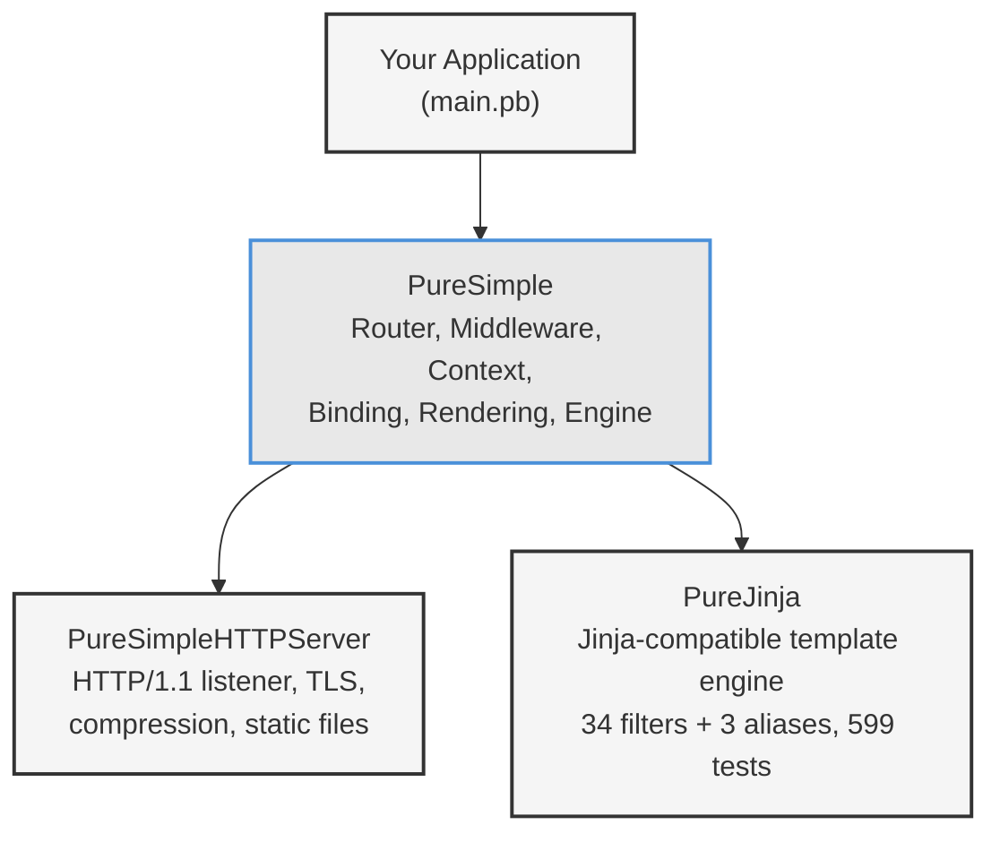

# Chapter 1: Why PureBasic for the Web?

*The case for compiling your web app into a single file that just runs.*

---

## Learning Objectives

After reading this chapter you will be able to:

- Explain the practical advantages of deploying a web application as a single native binary
- Identify the three repositories in the PureSimple ecosystem and describe the role of each
- Set up a PureBasic development environment with the correct compiler paths
- Compile and run a minimal PureSimple web application from the command line

---

## 1.1 The Binary Advantage

Most web applications require a ritual before they can serve their first request. A Node.js app needs Node installed, `npm install` to download dependencies, and often a build step to transpile TypeScript or bundle assets. A Python app needs the correct interpreter version, a virtual environment, and `pip install -r requirements.txt`. A Ruby app needs the runtime, Bundler, and a prayer that the native extensions compile on the target machine.

A PureSimple application needs none of that. You compile it on your development machine, copy the resulting binary to a server, and run it. That is the entire deployment process.

The binary contains everything: the HTTP server, the router, the template engine, the SQLite driver, and your application code. There is no interpreter to install, no virtual machine to configure, no package manager to appease. The server does not even need PureBasic installed. The binary runs on bare metal, allocates only the memory it uses, and starts in milliseconds rather than seconds.

Your `node_modules` folder has more files than some operating systems. A PureSimple application has exactly one file in production: the binary.

This matters beyond mere convenience. Every runtime dependency is a potential failure point. Every package version mismatch is a 3 AM phone call. Every interpreter update is a risk that your application will behave differently in production than it did in testing. A static binary eliminates these categories of failure entirely.

Here is a rough comparison of what it takes to deploy a web application across three stacks:

| | **PureSimple** | **Go (Gin)** | **Node.js (Express)** |
|---|---|---|---|
| Files to deploy | 1 binary | 1 binary | `node_modules/` + source + `package.json` |
| Runtime required | None | None | Node.js |
| Startup time | ~5 ms | ~10 ms | ~500-2000 ms |
| Binary size | ~2-4 MB | ~8-15 MB | N/A (interpreted) |
| Memory at idle | ~3-5 MB | ~8-12 MB | ~30-60 MB |

The numbers for PureSimple come from the `massively` blog example running on a production Ubuntu server. Your numbers will vary depending on the application, but the pattern holds: compiled languages produce smaller, faster, leaner processes than interpreted ones.

> **Compare:** If you have worked with Go, this should feel familiar. Go also compiles to a single static binary. PureSimple produces smaller binaries because PureBasic's standard library is more compact, but Go has a vastly larger ecosystem and built-in concurrency primitives. The trade-off is real, and this book does not pretend otherwise.

## 1.2 Why Not Just Use Go?

This is a fair question, and one that deserves an honest answer rather than marketing language.

Go is an excellent choice for web services. It has a mature standard library, a massive ecosystem, built-in goroutines for concurrency, and a compiler that produces static binaries. If you already know Go and are productive with it, this book is not trying to convince you to switch.

PureBasic occupies a different niche. It appeals to developers who want native performance without the complexity of systems programming. PureBasic's syntax is approachable. Its standard library covers GUI development, multimedia, networking, and file I/O without requiring external packages. There is no package manager because there does not need to be one. The compiler ships with everything you need.

In Go you would write `if err != nil` about forty times per file. In PureBasic you write `If result = 0` about forty times per file. Progress.

The real argument for PureSimple is not that it is better than Go or Python or Rust for web development in general. It is that if you already work in PureBasic, or if you want a web framework where you can read every line of source code in an afternoon, PureSimple gives you a complete stack in a language you can master quickly. The entire framework, including the HTTP server, router, template engine, and database layer, is roughly ten thousand lines of PureBasic. Try reading the source of Express.js or Django in an afternoon.

## 1.3 The Three-Repo Ecosystem

PureSimple is not a single repository. It is an ecosystem of three repositories that compile together into one binary. Each repo has a clear responsibility, and understanding the boundary between them will save you confusion throughout this book.


*Figure 1.1 -- The three-repo ecosystem. Your application includes PureSimple, which in turn includes the HTTP server and template engine. All four compile into a single binary.*

**PureSimpleHTTPServer** is the HTTP engine. It listens on a port, accepts TCP connections, parses HTTP/1.1 requests, handles TLS termination, serves static files, and applies gzip compression. It does not know anything about routing, middleware, or templates. It simply calls a dispatch callback whenever a request arrives. This repo is production-stable at version 1.x.

**PureSimple** is the framework layer -- and the subject of this book. It provides the router (a radix trie that maps URL patterns to handler procedures), the request context (a per-request struct that carries method, path, headers, body, parameters, and a key-value store), the middleware chain (Logger, Recovery, BasicAuth, CSRF, Session), request binding (query strings, form data, JSON), response rendering (JSON, HTML, text, redirects, files, templates), route groups, a SQLite database adapter with a migration runner, configuration loading from `.env` files, and levelled logging. That is a long list, but the source code for all of it fits in roughly a dozen `.pbi` files.

**PureJinja** is a Jinja-compatible template engine written in PureBasic. If you have used Jinja in Python, the syntax is identical: `{{ variable }}`, ``, ``, ``. PureJinja supports 34 built-in filters (plus 3 aliases, giving 37 registered names), template inheritance, and block overrides. It has 599 tests of its own. PureSimple calls PureJinja's `RenderString` API to render HTML templates.

The integration pattern is straightforward. Your `main.pb` includes PureSimple with a single line:

```purebasic
XIncludeFile "src/PureSimple.pb"
```

PureSimple's entry file, `src/PureSimple.pb`, includes both PureSimpleHTTPServer and PureJinja alongside its own modules. The compiler resolves all include paths, compiles everything together, and produces one binary. There is no linking step, no dynamic library loading, and no runtime class path. The compiler is the package manager.

## 1.4 Setting Up the Development Environment

PureBasic is a commercial compiler available for macOS, Linux, and Windows. You need version 6.x, which uses a C backend for code generation. Earlier versions used an assembler backend and will not compile PureSimple.

### Installing PureBasic

Download PureBasic 6.x from the official website (purebasic.com). The installer places the compiler and IDE in a standard location:

- **macOS:** `/Applications/PureBasic.app/Contents/Resources`
- **Linux:** `/usr/local/purebasic` or wherever you extracted the archive
- **Windows:** `C:\Program Files\PureBasic`

### Setting PUREBASIC_HOME

The compiler binary lives inside the installation directory. Rather than typing the full path every time, set an environment variable in your shell profile:

```bash
# macOS — add to ~/.zshrc or ~/.bash_profile
export PUREBASIC_HOME="/Applications/PureBasic.app/Contents/Resources"

# Linux — add to ~/.bashrc
export PUREBASIC_HOME="/opt/purebasic"

# Windows (Command Prompt)
set PUREBASIC_HOME=C:\Program Files\PureBasic

# Windows (PowerShell)
$env:PUREBASIC_HOME = "C:\Program Files\PureBasic"
```

After reloading your shell (`source ~/.zshrc`), you can invoke the compiler as:

```bash
$PUREBASIC_HOME/compilers/pbcompiler myfile.pb -cl -o myapp
```

> **Tip:** On Windows, use `%PUREBASIC_HOME%\Compilers\pbcompiler.exe` (Command Prompt) or `& "$env:PUREBASIC_HOME\Compilers\pbcompiler.exe"` (PowerShell). The compiler flags are identical across platforms.

> **Tip:** Set `PUREBASIC_HOME` in your shell profile so you do not have to export it every session. Every build command in this book assumes it is set.

### Cloning the Repositories

Clone all three repositories side by side in the same parent directory. The include paths in PureSimple expect this layout:

```
PureBasic_Projects/
  PureSimple/              # This repo
  PureSimpleHTTPServer/    # HTTP server
  pure_jinja/              # Template engine
```

```bash
mkdir PureBasic_Projects && cd PureBasic_Projects
git clone https://github.com/Jedt3D/PureSimple.git
git clone https://github.com/Jedt3D/PureSimpleHTTPServer.git
git clone https://github.com/Jedt3D/pure_jinja.git
```

### IDE vs Command Line

PureBasic ships with a full IDE featuring syntax highlighting, an integrated debugger with breakpoints and variable watches, a profiler, and a visual form designer. It is excellent for exploring code and stepping through problems.

However, web servers need to run as console applications, and the IDE's debugger does not handle long-running server processes gracefully. Throughout this book, we compile and run from the command line. If you prefer the IDE for editing, that works fine -- just compile and run your server from a terminal.

## 1.5 Hello World: Your First PureSimple App

Here is the smallest PureSimple application that does something useful. It registers two routes -- a JSON endpoint and a health check -- and starts listening on port 8080.

```purebasic
; Listing 1.1 -- Hello World PureSimple app
EnableExplicit
XIncludeFile "src/PureSimple.pb"

Engine::Use(@Logger::Middleware())
Engine::Use(@Recovery::Middleware())

Engine::GET("/",        @IndexHandler())
Engine::GET("/health",  @HealthHandler())

Engine::Run(8080)

Procedure IndexHandler(*C.RequestContext)
  Rendering::JSON(*C, ~"{\"hello\":\"world\"}")
EndProcedure

Procedure HealthHandler(*C.RequestContext)
  Rendering::Text(*C, "OK")
EndProcedure
```

Every line matters. `EnableExplicit` tells the compiler to reject undeclared variables -- a safety net you will appreciate the first time it catches a typo. `XIncludeFile "src/PureSimple.pb"` pulls in the entire framework. The two `Engine::Use` calls register global middleware: Logger prints request timing to the console, and Recovery catches runtime errors and returns a 500 response instead of crashing.

The `Engine::GET` calls register route patterns. When a GET request arrives at `/`, the router calls `IndexHandler`. When a GET request arrives at `/health`, the router calls `HealthHandler`. Both handlers receive a pointer to a `RequestContext` struct -- the backpack that carries all request and response data through the handler chain.

`Rendering::JSON` sets the response body to a JSON string, sets the content type to `application/json`, and sets the status code to 200. `Rendering::Text` does the same but with `text/plain`. The HTTP server takes care of actually sending the response bytes back to the client.

To compile and run:

**Listing 1.2** -- Compiling and running from the terminal

```bash
$PUREBASIC_HOME/compilers/pbcompiler main.pb -cl -o hello
./hello
```

The `-cl` flag is critical. It tells the compiler to produce a console application. Without it, PureBasic produces a GUI binary that will not print to the terminal and will not work as a server. Open a browser to `http://localhost:8080/` and you should see `{"hello":"world"}`. Hit `http://localhost:8080/health` and you get `OK`.

```mermaid
graph LR
    A["main.pb<br/>+ PureSimple.pb<br/>+ HTTPServer.pbi<br/>+ PureJinja.pbi"] -->|"pbcompiler -cl"| B["hello<br/>(native binary)"]
    B -->|"./hello"| C["Listening on :8080"]
    D["Browser"] -->|"GET /"| C
    C -->|'{"hello":"world"}'| D

    style A fill:#f5f5f5,stroke:#333,stroke-width:1px
    style B fill:#e8e8e8,stroke:#4A90D9,stroke-width:2px
    style C fill:#f5f5f5,stroke:#333,stroke-width:1px
    style D fill:#f5f5f5,stroke:#333,stroke-width:1px
```
*Figure 1.2 -- The compilation pipeline. Source files are compiled into a single native binary, which listens on a port and serves requests directly to the browser.*

> **Compare:** If you know Go's `net/http`, PureSimple is roughly Gin for PureBasic. `Engine::GET` maps to `r.GET`, `*C.RequestContext` maps to `*gin.Context`, and `Rendering::JSON` maps to `c.JSON()`. The concepts translate directly; only the syntax changes.

That is the entire development loop: write code, compile, run, test in the browser. No build tools, no transpilers, no bundlers, no watchers. One command produces one binary. The binary runs your server. Everything else is detail, and that is what the rest of this book covers.

---

## Summary

PureBasic compiles web applications into single native binaries with no runtime dependencies. The PureSimple ecosystem splits responsibility across three repositories -- PureSimpleHTTPServer for the HTTP engine, PureSimple for routing and framework features, and PureJinja for Jinja-compatible templates -- that merge at compile time through `XIncludeFile` directives. Setting up a development environment requires only the PureBasic compiler and three `git clone` commands. A complete web application fits in ten lines of code and compiles in seconds.

## Key Takeaways

- **One binary, zero deployment complexity.** Copy the compiled binary to a server and run it. No interpreter, no package manager, no dependency resolution at deploy time.
- **Three repos, one `XIncludeFile` chain.** PureSimpleHTTPServer handles HTTP, PureSimple handles routing and framework logic, PureJinja handles templates. All three compile into your application binary.
- **The compiler is your package manager.** There is no `npm install` or `go mod tidy`. The compiler resolves includes, compiles everything, and links the result. If it compiles, it ships.

## Review Questions

1. Name the three repositories in the PureSimple ecosystem and explain what each one does.
2. What is the advantage of compiling a web application into a single binary versus deploying an interpreted language with a package ecosystem?
3. *Try it:* Clone all three repositories into a shared parent directory, compile the Hello World example with `pbcompiler -cl -o hello`, and verify that `http://localhost:8080/health` returns `OK`.
