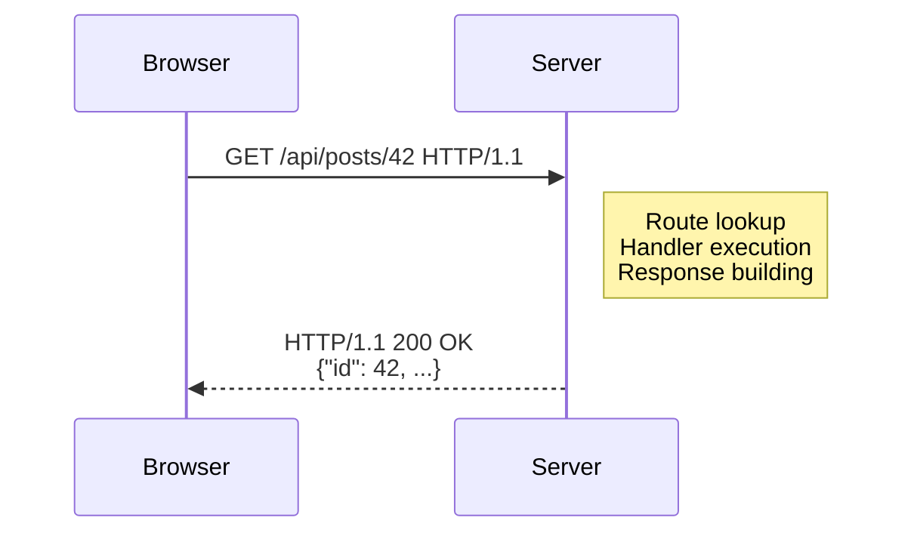
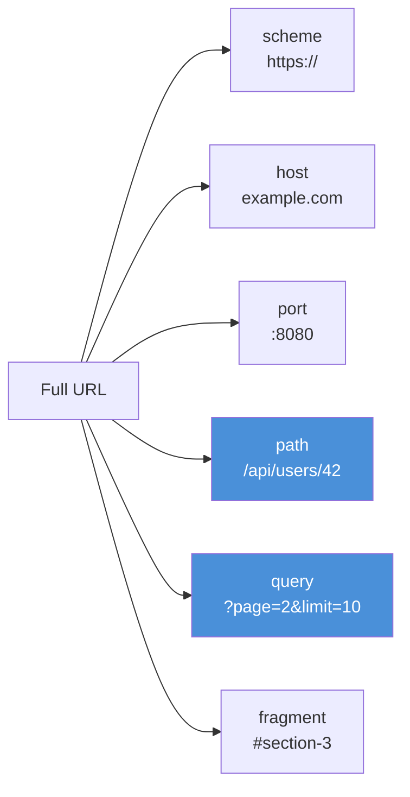

# Chapter 4: HTTP Fundamentals

*The language your browser and server speak to each other.*

---

## Learning Objectives

After reading this chapter you will be able to:

- Describe the HTTP request/response cycle and identify each component of a request and a response
- Break a URL into its constituent parts: scheme, host, port, path, query string, and fragment
- Explain the role of content types in HTTP communication and choose the right one for your use case
- Articulate why HTTP is stateless and how cookies and sessions compensate for that limitation
- Distinguish the responsibilities of PureSimpleHTTPServer from those of PureSimple

---

## 4.1 Request and Response

HTTP is a polite conversation between two programs that fundamentally do not trust each other. The browser says, "I would like this resource, please." The server says, "Here it is," or, more often, "No." Every interaction on the web follows this pattern: one request in, one response out. No exceptions, no callbacks, no surprise phone calls in the middle of the night.

A request consists of four parts. First, the **method** tells the server what kind of operation the client wants: `GET` to read, `POST` to create, `PUT` or `PATCH` to update, `DELETE` to remove. Second, the **path** tells the server which resource the client is addressing. Third, **headers** carry metadata: the content type the client can accept, cookies for authentication, caching directives, and dozens of other fields. Fourth, the **body** carries data when the client needs to send something to the server, such as a JSON payload or form submission. `GET` requests typically have no body; `POST` and `PUT` requests almost always do.

A response mirrors this structure with its own four components. The **status code** is a three-digit number that summarizes the outcome: `200` means success, `301` means permanent redirect, `404` means the resource was not found, and `500` means the server had a bad day. **Headers** in the response carry metadata back to the client: the content type of the body, cache instructions, and cookies the server wants the browser to remember. The **body** contains the actual content: an HTML page, a JSON object, an image, or nothing at all (as in a `204 No Content` response). Finally, the **status line** at the top of every response includes the HTTP version and the human-readable reason phrase, though modern clients ignore the reason phrase entirely.

```
; Listing 4.1 — A raw HTTP request (text)
GET /api/posts/42 HTTP/1.1
Host: example.com
Accept: application/json
Cookie: session=abc123
```

```
; Listing 4.2 — A raw HTTP response (text)
HTTP/1.1 200 OK
Content-Type: application/json
Content-Length: 47

{"id": 42, "title": "Hello", "status": "draft"}
```

The request in Listing 4.1 asks for a specific blog post. The response in Listing 4.2 delivers it as JSON. The entire exchange is plain text riding over a TCP connection. There is no magic here -- just structured text with rules about where the headers end and the body begins (the blank line).


*Figure 4.1 — The HTTP request/response cycle. The browser sends a request; the server processes it and returns a response. One in, one out.*

> **Compare:** If you have used Go's `net/http`, you have already seen this model. The `http.Request` and `http.ResponseWriter` pair map directly to PureSimple's `RequestContext`, which bundles both the incoming request data and the outgoing response fields into a single structure. Chapter 6 covers the context in detail.

---

## 4.2 URL Anatomy

A URL (Uniform Resource Locator) is a compact string that identifies a resource and tells the client how to reach it. It looks deceptively simple until you need to parse one by hand. Consider this URL:

```
https://example.com:8080/api/users/42?page=2&limit=10#section-3
```

That single string contains six distinct parts:

1. **Scheme** (`https`) -- the protocol. For web applications it is either `http` or `https`.
2. **Host** (`example.com`) -- the domain name or IP address of the server.
3. **Port** (`8080`) -- the TCP port. If omitted, `http` defaults to 80 and `https` defaults to 443.
4. **Path** (`/api/users/42`) -- the hierarchical address of the resource. This is what the router matches against.
5. **Query string** (`page=2&limit=10`) -- key-value pairs appended after a `?`. Multiple pairs are separated by `&`.
6. **Fragment** (`#section-3`) -- a client-side anchor. The browser never sends this to the server.


*Figure 4.2 — Anatomy of a URL. The path and query string (highlighted) are the parts your application code will work with most.*

The distinction between path parameters and query parameters is worth understanding early. The path `/users/42` embeds the user ID directly in the URL structure. This is a **path parameter** -- the router extracts `42` and passes it to your handler as a named value (`:id`). The URL `/users?id=42` achieves the same result using a **query parameter**, but the semantics are different. Path parameters identify a specific resource; query parameters modify how the server processes the request (filtering, sorting, pagination).

The RFC calls the encoding of special characters in URLs "percent encoding" because `%20` is shorter than "that space character that breaks everything." When a query string contains a space, the browser replaces it with `%20` or `+`. PureSimple handles this decoding for you in the binding layer (Chapter 8), but knowing it exists helps you debug the occasional URL that looks like it was assembled by a cat walking across a keyboard.

> **Tip:** When designing your API routes, put resource identifiers in the path (`/posts/:id`) and filtering or pagination options in the query string (`?page=2`). This is not just convention -- it maps cleanly to how PureSimple's router distinguishes between path matching and query parsing.

---

## 4.3 Content Types

When a server sends a response, the `Content-Type` header tells the client what kind of data is in the body. Get this wrong and the browser will either render raw JSON as a wall of text or try to parse HTML as a JSON object. Neither is a pleasant user experience.

The three content types you will use most in PureSimple are:

- **`application/json`** -- Structured data for APIs. Machines love it. Humans tolerate it.
- **`text/html`** -- Web pages. Browsers render it. Machines struggle with it.
- **`text/plain`** -- Raw text. Health check endpoints, error messages, and the occasional existential crisis from your server at 3 AM.

Content negotiation is the process by which a client and server agree on a content type. The client sends an `Accept` header listing the types it can handle (`Accept: application/json, text/html`), and the server picks the best match. In practice, most APIs return JSON unconditionally, and most browser-facing routes return HTML unconditionally. The negotiation matters more in theory than in day-to-day PureSimple development, but knowing it exists prevents confusion when you see `Accept` headers in your logs.

PureSimple sets the content type through the rendering layer. When you call `Rendering::JSON`, it sets `Content-Type: application/json`. When you call `Rendering::HTML`, it sets `text/html`. You rarely need to set it manually -- but you can, by writing directly to `*C\ContentType` on the request context.

> **Warning:** If you forget to set the content type and your handler writes a JSON string to `ResponseBody`, browsers will receive it as `text/plain` and display it as raw text. Always use the rendering functions rather than writing to `ResponseBody` directly.

---

## 4.4 Stateless HTTP

HTTP has no memory. Every request arrives as if the server has never seen the client before. The server does not know who you are, what you did five seconds ago, or whether you are logged in. This is by design -- statelessness makes HTTP simple, cacheable, and scalable. It also makes building a login system feel like explaining yourself to someone with amnesia.

The solution to this deliberate forgetfulness is a **cookie**: a small piece of data the server sends to the browser with instructions to send it back on every subsequent request. The cookie is the sticky note on the fridge that says, "You are user #42, and you logged in at 3:15 PM."

A **session** builds on cookies. Instead of storing user data in the cookie itself (which the client can read and tamper with), the server stores a random session ID in the cookie and keeps the actual data on the server side. The session ID is a key into a server-side store -- a map, a database row, or a file. When a request arrives with a session cookie, the server looks up the session data, attaches it to the request context, and your handler can read the user's name, role, or shopping cart without asking the client to provide that information again.

You could also build your own session system from scratch using `Mid()` and `FindString()` to parse cookie headers manually. You could also build a house with a spoon. Both are technically possible. PureSimple provides `Cookie::Get`, `Cookie::Set`, and a full session middleware so you do not have to.

Cookies and sessions are covered in depth in Chapter 15. Authentication builds on top of sessions in Chapter 16. CSRF protection, which prevents attackers from forging requests using your cookies, is covered in Chapter 17. For now, the key takeaway is that HTTP itself has no memory -- everything else is built on top.

> **Compare:** Express.js uses `req.session` after loading `express-session` middleware. PureSimple uses `Session::Get(*C, "key")` after loading `Session::Middleware`. The pattern is identical: middleware loads the session, handlers read and write it, middleware saves it back.

---

## 4.5 What PureSimpleHTTPServer Provides

PureSimple is not a web server. It is a framework that sits on top of one. The actual HTTP heavy lifting -- listening on a TCP socket, parsing raw HTTP bytes, handling TLS, compressing responses, and serving static files -- is handled by **PureSimpleHTTPServer**, a separate repository that compiles into the same binary.

PureSimpleHTTPServer provides the foundation:

- **TCP listener** on a configurable port
- **HTTP/1.1 parsing** of requests into method, path, headers, and body
- **TLS termination** for HTTPS connections (though in production, Caddy typically handles this)
- **Gzip compression** of response bodies when the client supports it
- **Static file serving** for CSS, JavaScript, images, and other assets

PureSimple adds the application logic on top:

- **Routing** -- matching request paths to handler functions (Chapter 5)
- **Middleware** -- running shared logic before and after handlers (Chapter 7)
- **Context** -- bundling request and response data into a single struct (Chapter 6)
- **Binding** -- extracting typed data from query strings, forms, and JSON (Chapter 8)
- **Rendering** -- producing JSON, HTML, and redirect responses (Chapter 9)

The two repositories meet at a single point: the **dispatch callback**. PureSimpleHTTPServer receives a raw HTTP request, parses it, and calls a function pointer registered by PureSimple. That function creates a `RequestContext`, runs it through the router to find a matching handler, wraps the handler in middleware, and dispatches the chain. When the chain completes, the response fields on the context are read by PureSimpleHTTPServer, which serializes them back into an HTTP response and sends them to the client.

This separation is deliberate. PureSimpleHTTPServer knows nothing about routes, middleware, or templates. PureSimple knows nothing about TCP sockets, HTTP parsing, or compression. Each repository does one thing well, and they compose at compile time into a single binary.

> **Under the Hood:** The dispatch callback pattern is a function pointer registered with PureSimpleHTTPServer's `SetRequestHandler()` API. In PureBasic terms, this is a `Prototype.i` that takes a pointer to the incoming request data. PureSimple's engine creates a `RequestContext`, populates it from the raw data, runs the handler chain, and writes the response fields back. The HTTP server never sees a `RequestContext` -- it only sees the raw fields.

---

## Summary

HTTP is a stateless, text-based protocol where every interaction consists of one request and one response. Requests carry a method, path, headers, and optional body; responses carry a status code, headers, and body. URLs encode the resource address along with query parameters, and content types tell the client how to interpret the response body. Because HTTP forgets everything between requests, cookies and sessions provide the memory that web applications need. PureSimpleHTTPServer handles the low-level socket and parsing work, while PureSimple provides the routing, middleware, context, and rendering that turn raw HTTP into a structured application.

## Key Takeaways

- Every HTTP request has a method (GET, POST, PUT, DELETE), a path, headers, and an optional body. Every response has a status code, headers, and an optional body.
- Path parameters (`/users/:id`) identify resources; query parameters (`?page=2`) modify how the server processes the request. Use both, but use them for different purposes.
- HTTP is stateless by design -- cookies carry a session ID that lets the server look up stored data between requests.
- PureSimpleHTTPServer and PureSimple have separate responsibilities that meet at a dispatch callback, compiling into one binary with clean separation of concerns.

## Review Questions

1. What is the difference between a path parameter (`/users/:id`) and a query parameter (`/users?id=42`)? When would you use each?
2. Why is HTTP considered stateless, and what mechanism do web applications use to remember users between requests?
3. *Try it:* Open your browser's developer tools (F12), navigate to any website, and examine the Network tab. Find a request and identify its method, path, status code, content type, and any cookies. Write down what each part tells you about the interaction.
