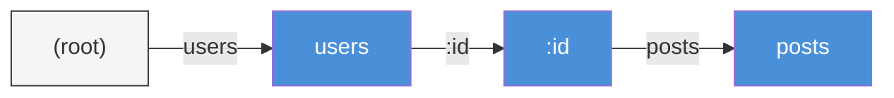

# Chapter 5: Routing

*Teaching your server which handler answers which URL.*

---

**After reading this chapter you will be able to:**

- Register routes for all HTTP methods using `Engine::GET`, `POST`, `PUT`, `PATCH`, `DELETE`, and `Any`
- Extract named parameters from URL paths using `:param` segments
- Use wildcard routes with `*path` to catch all remaining path segments
- Explain the priority order of route matching: exact segment, then parameter, then wildcard
- Configure custom handlers for 404 Not Found and 405 Method Not Allowed responses

---

## 5.1 Registering Routes

A route is a contract between a URL pattern and a handler function. When a request arrives with `GET /api/posts/42`, the router's job is to find the handler registered for that pattern and hand it the request. If no handler matches, the server returns a 404. That is the entire job description.

PureSimple's `Engine` module provides convenience functions that map directly to HTTP methods. Each function takes a pattern string and a handler address, then delegates to `Router::Insert` with the appropriate method:

```purebasic
; Listing 5.1 — Registering routes with Engine convenience functions
Procedure IndexHandler(*C.RequestContext)
  *C\StatusCode   = 200
  *C\ResponseBody = "Welcome"
  *C\ContentType  = "text/plain"
EndProcedure

Procedure GetPostHandler(*C.RequestContext)
  *C\StatusCode   = 200
  *C\ResponseBody = "Post detail"
  *C\ContentType  = "text/plain"
EndProcedure

Procedure CreatePostHandler(*C.RequestContext)
  *C\StatusCode   = 201
  *C\ResponseBody = "Created"
  *C\ContentType  = "text/plain"
EndProcedure

Engine::GET("/", @IndexHandler())
Engine::GET("/posts/:id", @GetPostHandler())
Engine::POST("/posts", @CreatePostHandler())
```

The `@` operator gets the address of a procedure. This is a function pointer, and it is how PureSimple registers handlers without requiring an object system or interface dispatch. The pattern is remarkably similar to Go's Gin framework, where you write `r.GET("/path", handler)`. Here you write `Engine::GET("/path", @Handler())`. The `@` and the parentheses are PureBasic's way of saying the same thing.

Under the hood, each `Engine::GET` call does exactly one thing:

```purebasic
; From src/Engine.pbi — Engine::GET procedure
Procedure GET(Pattern.s, Handler.i)
  Router::Insert("GET", Pattern, Handler)
EndProcedure
```

The `Engine::Any` function registers the same handler for all five standard methods. This is useful for catch-all routes or health check endpoints that should respond to any method:

```purebasic
; Listing 5.2 — Registering a route for all HTTP methods
Procedure HealthHandler(*C.RequestContext)
  *C\StatusCode   = 200
  *C\ResponseBody = "OK"
  *C\ContentType  = "text/plain"
EndProcedure

Engine::Any("/health", @HealthHandler())
```

> **Compare:** In Gin (Go), you write `r.GET("/path", handler)`. In Express (Node.js), you write `app.get("/path", handler)`. In PureSimple, you write `Engine::GET("/path", @Handler())`. The pattern is universal across web frameworks -- only the punctuation changes.

---

## 5.2 Named Parameters

Static routes like `/posts` and `/about` only get you so far. Real applications need dynamic segments -- the `/42` in `/posts/42` that identifies a specific resource. PureSimple supports this with **named parameters**, denoted by a colon prefix in the route pattern.

```purebasic
; Listing 5.3 — Named parameter extraction
Procedure UserHandler(*C.RequestContext)
  Protected userId.s = Ctx::Param(*C, "id")
  *C\StatusCode   = 200
  *C\ResponseBody = "User ID: " + userId
  *C\ContentType  = "text/plain"
EndProcedure

Engine::GET("/users/:id", @UserHandler())
```

When a request arrives for `GET /users/42`, the router matches the `:id` segment against the literal value `42` and stores the association in the context. The handler retrieves it with `Ctx::Param(*C, "id")`, which returns `"42"` as a string. Note that all parameters are strings. If you need a numeric value, you must convert it yourself with `Val()`.

You can use multiple named parameters in a single route:

```purebasic
; Listing 5.4 — Multiple named parameters
Procedure CommentHandler(*C.RequestContext)
  Protected postId.s    = Ctx::Param(*C, "postId")
  Protected commentId.s = Ctx::Param(*C, "commentId")
  *C\StatusCode   = 200
  *C\ResponseBody = "Post " + postId + ", Comment " + commentId
  *C\ContentType  = "text/plain"
EndProcedure

Engine::GET("/posts/:postId/comments/:commentId",
            @CommentHandler())
```

A request to `/posts/7/comments/3` yields `postId = "7"` and `commentId = "3"`. The parameter names must be unique within a single pattern -- registering `/users/:id/posts/:id` would produce ambiguous results.

> **Under the Hood:** The router stores parameter key-value pairs in two parallel strings on the `RequestContext`: `ParamKeys` and `ParamVals`, delimited by `Chr(9)` (the tab character). `Ctx::Param` searches `ParamKeys` for the requested name and returns the corresponding value from `ParamVals`. This tab-delimited design avoids the overhead of a map allocation per request, which matters when you are handling thousands of requests per second on a single-threaded server.

---

## 5.3 Wildcard Routes

Sometimes you need a route that matches everything under a prefix. A file server that maps `/static/css/style.css` and `/static/js/app.js` to the same handler needs a way to capture the entire remaining path. PureSimple handles this with **wildcard parameters**, denoted by an asterisk prefix:

```purebasic
; Listing 5.5 — Wildcard route capturing the remaining path
Procedure StaticHandler(*C.RequestContext)
  Protected filePath.s = Ctx::Param(*C, "filepath")
  *C\StatusCode   = 200
  *C\ResponseBody = "Serving file: " + filePath
  *C\ContentType  = "text/plain"
EndProcedure

Engine::GET("/static/*filepath", @StaticHandler())
```

A request to `/static/css/style.css` sets `filepath` to `"css/style.css"`. A request to `/static/images/logo.png` sets it to `"images/logo.png"`. The wildcard consumes everything from its position to the end of the URL, including slashes.

> **Warning:** The wildcard segment must be the last segment in the pattern. You cannot register `/static/*filepath/edit` because the wildcard does not know where to stop consuming. PureSimple will register the route, but it will never match anything after the wildcard.

Wildcards are also useful for single-page application (SPA) fallback routes, where the server needs to return the same HTML for any URL under a prefix so the client-side JavaScript router can take over:

```purebasic
; Listing 5.6 — SPA fallback route
Procedure SpaHandler(*C.RequestContext)
  *C\StatusCode   = 200
  *C\ResponseBody = "<html>SPA shell</html>"
  *C\ContentType  = "text/html"
EndProcedure

Engine::GET("/app/*path", @SpaHandler())
```

---

## 5.4 The Radix Trie

PureSimple's router uses a **radix trie** (also called a prefix tree) to store and match routes. Understanding this data structure explains why route matching is fast and why the priority rules work the way they do.

A trie is a tree where each node represents a path segment. Consider three registered routes: `/users`, `/users/:id`, and `/users/:id/posts`. The trie looks like this:


*Figure 5.1 — Radix trie for three routes. Each node is a path segment. The router walks the tree one segment at a time, matching the request path against node labels.*

When a request for `/users/42/posts` arrives, the router starts at the root and walks the tree segment by segment. It matches `users` exactly, then matches `42` against the `:id` parameter node (storing `id = "42"`), then matches `posts` exactly. If the final node has a handler registered, the match succeeds.

The implementation stores nodes in four parallel arrays rather than linked objects:

```purebasic
; From src/Router.pbi — Trie storage
#_MAX = 512

Global Dim _Seg.s(#_MAX)       ; node segment string
Global Dim _Handler.i(#_MAX)   ; terminal handler address
Global Dim _Child.i(#_MAX)     ; first child index
Global Dim _Sibling.i(#_MAX)   ; next sibling index
Global _Cnt.i = 1              ; next free slot
Global NewMap _Root.i()        ; method -> root node index
```

Each method (`GET`, `POST`, etc.) has its own root node, which is stored in a map keyed by the method string. This means `GET /users` and `POST /users` can have different handlers, which is exactly what you want.

> **Under the Hood:** The parallel-array design is a deliberate PureBasic optimization. Module bodies in PureBasic cannot reference structures defined outside the module in global arrays without workarounds. Using four simple-type arrays sidesteps this restriction entirely. It also has excellent cache locality, since the arrays are contiguous in memory. The tradeoff is a fixed maximum of 512 nodes, which is more than enough for any practical application. If you register 512 route segments and need more, your API has a different problem.

---

## 5.5 Match Priority

When the router encounters a path segment, it must decide which child node to follow. PureSimple applies a strict priority order: **exact segment beats named parameter beats wildcard**. This is not a democracy. Exact beats param beats wildcard. Every time, without negotiation.

Consider these three routes registered on the same method:

```purebasic
; Listing 5.7 — Route priority demonstration
Engine::GET("/files/readme",    @ReadmeHandler())
Engine::GET("/files/:name",     @FileByNameHandler())
Engine::GET("/files/*path",     @CatchAllHandler())
```

A request to `/files/readme` matches the first route exactly. A request to `/files/report` matches the second route with `name = "report"`. A request to `/files/docs/guide.pdf` matches the third route with `path = "docs/guide.pdf"`. The router never hesitates -- it tries exact first, then parameter, then wildcard.

The implementation in `Router::_Match` makes this priority explicit:

```purebasic
; From src/Router.pbi — Match priority in _Match procedure
; First pass: exact segment matches (highest priority)
While child <> 0
  cseg = _Seg(child)
  If Left(cseg, 1) = ":"
    If paramChild = 0 : paramChild = child : EndIf
  ElseIf Left(cseg, 1) = "*"
    If wildChild = 0 : wildChild = child : EndIf
  ElseIf cseg = seg
    result = _Match(child, Segs(), Depth + 1,
                    Total, CtxPtr)
    If result <> 0 : ProcedureReturn result : EndIf
  EndIf
  child = _Sibling(child)
Wend

; Second pass: :param match with backtrack on failure
If paramChild
  ; ... try param, backtrack if no handler found
EndIf

; Third pass: *wildcard consumes all remaining segments
If wildChild
  ; ... consume everything, return handler
EndIf
```

The first pass scans all children for an exact match. If it finds one, it recurses immediately. Only if the exact match fails (no handler found downstream) does it fall through to the second pass and try parameter matching. The wildcard is always the last resort.

The backtracking behavior deserves attention. If the `:param` path leads to a dead end (no handler at the terminal node), the router resets the parameter state and falls through to the wildcard pass. This means that registration order does not matter -- the priority is structural, not chronological.

> **PureBasic Gotcha:** The `_Match` procedure passes the `RequestContext` as a plain `.i` integer (the raw pointer address) rather than as a typed `*C.RequestContext` parameter. This is because PureBasic module bodies sometimes have trouble with externally-defined structure types in recursive procedure parameters. The typed alias is rebuilt inside the procedure with `*C = CtxPtr`. It works, but it is the kind of thing that makes you appreciate type-safe languages on Mondays.

---

## 5.6 Custom Error Handlers

When no route matches, PureSimple returns a default `404 Not Found` plain-text response. When a route exists for the path but not for the requested method (e.g., `DELETE /health` when only `GET /health` is registered), the default response is `405 Method Not Allowed`. Both defaults are functional but ugly. You will want to replace them.

```purebasic
; Listing 5.8 — Custom 404 and 405 handlers
Procedure My404Handler(*C.RequestContext)
  *C\StatusCode   = 404
  *C\ResponseBody = "Nothing here. Check the URL."
  *C\ContentType  = "text/plain"
EndProcedure

Procedure My405Handler(*C.RequestContext)
  *C\StatusCode   = 405
  *C\ResponseBody = "This method is not allowed."
  *C\ContentType  = "text/plain"
EndProcedure

Engine::SetNotFoundHandler(@My404Handler())
Engine::SetMethodNotAllowedHandler(@My405Handler())
```

The `Engine::HandleNotFound` procedure checks whether a custom handler has been registered. If so, it calls the custom handler via a function pointer. If not, it writes the default response directly:

```purebasic
; From src/Engine.pbi — HandleNotFound
Procedure HandleNotFound(*C.RequestContext)
  Protected fn.PS_HandlerFunc
  If _NotFoundHandler <> 0
    fn = _NotFoundHandler
    fn(*C)
  Else
    *C\StatusCode   = 404
    *C\ResponseBody = "404 Not Found"
    *C\ContentType  = "text/plain"
  EndIf
EndProcedure
```

In a production application, your custom 404 handler would render an HTML template with proper navigation so users can find their way back. In an API, it would return a JSON error object. The mechanism is the same either way -- register a handler, and PureSimple will call it whenever a route match fails.

> **Tip:** Always register custom error handlers before starting your application. A well-designed 404 page can turn a lost visitor into a returning user. A raw `"404 Not Found"` plain-text response sends the message that nobody is home.

---

## Summary

Routing is the router's entire reason for existing: take an incoming method and path, find the right handler, and extract any dynamic segments along the way. PureSimple's radix trie stores routes efficiently, supports named parameters and wildcards, and applies a strict priority order that guarantees predictable matching. Custom error handlers let you control what happens when no route matches, turning the framework's defaults into your application's personality.

## Key Takeaways

- Register routes with `Engine::GET`, `POST`, `PUT`, `PATCH`, `DELETE`, or `Any`. Each delegates to `Router::Insert` with the appropriate HTTP method string.
- Named parameters (`:id`) match a single path segment and are extracted with `Ctx::Param(*C, "id")`. Wildcards (`*path`) consume all remaining segments. Wildcards must be the last segment in a pattern.
- Match priority is absolute: exact segment beats named parameter beats wildcard. This priority is structural in the trie, not dependent on registration order.
- Custom 404 and 405 handlers replace the defaults via `Engine::SetNotFoundHandler` and `Engine::SetMethodNotAllowedHandler`.

## Review Questions

1. If you register `Engine::GET("/files/readme", ...)`, `Engine::GET("/files/:name", ...)`, and `Engine::GET("/files/*path", ...)`, which handler runs for a request to `/files/readme`? Which runs for `/files/report.pdf`? Which runs for `/files/docs/api/index.html`?
2. Why does the router use a radix trie instead of a flat list of routes? What advantage does the tree structure provide for matching?
3. *Try it:* Register five routes covering a simple blog: `GET /` (index), `GET /posts/:slug` (single post), `POST /posts` (create), `PUT /posts/:slug` (update), `DELETE /posts/:slug` (delete). Write handlers that return plain-text descriptions of what each route does. Compile and test with `curl`.
