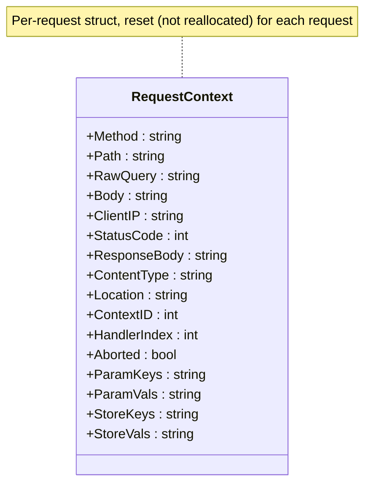
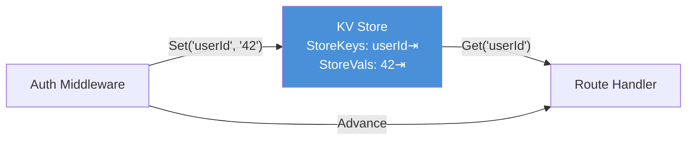

# Chapter 6: The Request Context

*The backpack every request carries through the handler chain.*

---

**After reading this chapter you will be able to:**

- Identify every field on the `RequestContext` structure and explain its purpose
- Use `Ctx::Advance` to pass control to the next handler in the chain and explain why it cannot be called `Next`
- Stop the handler chain with `Ctx::Abort`, `Ctx::AbortWithStatus`, and `Ctx::AbortWithError`
- Pass data between middleware and handlers using the KV store (`Ctx::Set` and `Ctx::Get`)
- Extract route parameters from the context with `Ctx::Param`

---

## 6.1 What Lives on the RequestContext

Every request that enters PureSimple gets a `RequestContext` -- a single structure that carries everything the handler chain needs to know about the incoming request and everything it needs to build the outgoing response. If you have used Gin in Go, this is `*gin.Context`. If you have used Express in Node.js, this is `req` and `res` fused into one object. PureSimple chose the single-struct approach because passing one pointer is simpler than passing two, and simplicity is a feature.

The `RequestContext` structure lives in `src/Types.pbi` and is the most important type in the entire framework. Here it is, annotated by responsibility:

```purebasic
; Listing 6.1 — The RequestContext structure (from src/Types.pbi)
Structure RequestContext
  ; --- Incoming request data ---
  Method.s            ; "GET", "POST", etc.
  Path.s              ; URL path, e.g. "/api/users/42"
  RawQuery.s          ; query string, e.g. "page=1&limit=10"
  Body.s              ; raw request body (for JSON binding)
  ClientIP.s          ; remote address

  ; --- Outgoing response state ---
  StatusCode.i        ; HTTP status to send (default 200)
  ResponseBody.s      ; response content
  ContentType.s       ; MIME type (default "text/plain")
  Location.s          ; redirect URL

  ; --- Handler chain machinery ---
  ContextID.i         ; slot index for handler arrays
  HandlerIndex.i      ; current position in the chain
  Aborted.i           ; #True if Abort() was called

  ; --- Route params and query (tab-delimited) ---
  ParamKeys.s
  ParamVals.s
  QueryKeys.s
  QueryVals.s

  ; --- KV store for middleware communication ---
  StoreKeys.s
  StoreVals.s

  ; --- JSON binding handle ---
  JSONHandle.i

  ; --- Cookie / session ---
  Cookie.s            ; raw Cookie header
  SetCookies.s        ; Set-Cookie directives
  Authorization.s     ; raw Authorization header
  SessionID.s         ; session ID from cookie
  SessionKeys.s       ; session data keys
  SessionVals.s       ; session data values
EndStructure
```

That is twenty-five fields. It looks like a lot until you realize it replaces what other frameworks spread across three or four separate objects. The context is your one-stop shop for reading request data, writing response data, managing the handler chain, and passing information between middleware layers.


*Figure 6.1 -- The RequestContext structure. Request data flows in through the top fields; response data flows out through the middle fields; handler chain state and the KV store occupy the bottom.*

> **Under the Hood:** The context is not allocated fresh for every request. PureSimple maintains a rolling pool of 32 context slots (`#_MAX_CTX = 32`). When a request arrives, `Ctx::Init` picks the next slot, resets every field to its default value, and returns the same memory address. This avoids heap allocation on every request, which matters when PureBasic's memory allocator is the only thing standing between you and garbage collection pauses. The trade-off is a hard cap of 32 concurrent contexts, which is fine for a single-threaded server.

---

## 6.2 Initializing the Context

Before a context can be used, it must be initialized with the incoming request's method and path. `Ctx::Init` resets every field to a clean default, assigns a slot ID, and clears the handler chain:

```purebasic
; Listing 6.2 — Ctx::Init resets the context
; (from src/Context.pbi)
Procedure Init(*C.RequestContext, Method.s, Path.s)
  Protected slot.i = _SlotSeq % #_MAX_CTX
  _SlotSeq + 1
  *C\Method       = Method
  *C\Path         = Path
  *C\RawQuery     = ""
  *C\Body         = ""
  *C\ClientIP     = ""
  *C\StatusCode   = 200
  *C\ResponseBody = ""
  *C\ContentType  = "text/plain"
  *C\Location     = ""
  *C\ParamKeys    = ""
  *C\ParamVals    = ""
  *C\QueryKeys    = ""
  *C\QueryVals    = ""
  *C\StoreKeys    = ""
  *C\StoreVals    = ""
  *C\ContextID    = slot
  *C\HandlerIndex = 0
  *C\Aborted      = #False
  *C\JSONHandle   = 0
  *C\Cookie       = ""
  *C\SetCookies   = ""
  *C\Authorization = ""
  *C\SessionID    = ""
  *C\SessionKeys  = ""
  *C\SessionVals  = ""
  _HandlerCount(slot) = 0
EndProcedure
```

Two things stand out. First, the default `StatusCode` is 200 and the default `ContentType` is `"text/plain"`. If your handler does nothing but set `ResponseBody`, the client receives a 200 plain-text response. Sensible defaults reduce boilerplate. Second, the slot assignment uses a modular counter (`_SlotSeq % #_MAX_CTX`) that wraps around. This is a rolling pool, not a fixed assignment. Slot 0 gets reused after 32 requests. Since each request completes before the slot is needed again in a single-threaded server, this works perfectly.

> **Tip:** In test code, you will create `RequestContext` structures manually and call `Ctx::Init` yourself. This is the canonical way to set up a context for unit testing handlers and middleware without needing an HTTP server running.

---

## 6.3 Advance -- The "Next" That Cannot Be Called Next

The handler chain is the backbone of PureSimple's request processing. Middleware functions and the final route handler are combined into a flat array. When a request is dispatched, PureSimple calls the first handler. That handler must explicitly call `Ctx::Advance(*C)` to pass control to the next handler in the chain. If it does not call `Advance`, the chain stops.

The method is called `Advance` because `Next` is reserved. PureBasic uses `Next` to close `For...Next` loops, and it will not negotiate. I once named this method `Next` during early development, watched the compiler throw a deeply unhelpful error about a missing loop body, and spent longer than I care to admit before realizing that `Next` is not a name you get to use. So `Advance` it is.

```purebasic
; Listing 6.3 — Ctx::Advance iterates the handler chain
; (from src/Context.pbi)
Procedure Advance(*C.RequestContext)
  Protected slot.i = *C\ContextID
  Protected idx.i  = *C\HandlerIndex
  Protected cnt.i  = _HandlerCount(slot)
  Protected fn.PS_HandlerFunc
  If Not *C\Aborted And idx < cnt
    *C\HandlerIndex + 1
    fn = _Handlers(slot, idx)
    If fn : fn(*C) : EndIf
  EndIf
EndProcedure
```

The logic is clean. If the context is not aborted and there are more handlers to call, increment the index and call the next handler via its function pointer. The increment happens *before* the call, so when the called handler itself calls `Advance`, it gets the handler after it, not itself. This prevents infinite recursion.

The middleware pattern emerges from this design. A middleware function does some work before `Advance`, calls `Advance` to let the rest of the chain run, then does some work after `Advance` returns:

```purebasic
; Listing 6.4 — Middleware pattern using Advance
Procedure TimingMiddleware(*C.RequestContext)
  Protected t0.i = ElapsedMilliseconds()

  Ctx::Advance(*C)   ; run the rest of the chain

  Protected elapsed.i = ElapsedMilliseconds() - t0
  ; "after" logic runs when Advance returns
  PrintN("Request took " + Str(elapsed) + "ms")
EndProcedure
```

The code before `Advance` runs on the way in. The code after `Advance` runs on the way out. This is the onion model: each middleware wraps the ones inside it. Chapter 7 explores this pattern in detail.

> **PureBasic Gotcha:** `Next` is a reserved keyword in PureBasic. It closes `For...Next` loops. You cannot use it as a procedure name, a variable name, or a module method. PureSimple uses `Advance` instead. If you see `Next` in Go framework documentation and reach for it in PureBasic, the compiler will reject it with an error that mentions loop structure, not naming conflicts. This is the kind of error message that makes you question your career choices at 11 PM.

---

## 6.4 Abort -- Stopping the Chain

Sometimes a middleware needs to stop the chain entirely. An authentication middleware that finds no credentials should return a 401 and prevent the route handler from running. A rate-limiting middleware that detects abuse should return a 429 and shut the door. `Ctx::Abort` provides this mechanism.

```purebasic
; Listing 6.5 — Ctx::Abort and its variants
; (from src/Context.pbi)

; Stop the chain — all subsequent handlers are skipped
Procedure Abort(*C.RequestContext)
  *C\Aborted = #True
EndProcedure

; Abort and set the HTTP status code
Procedure AbortWithStatus(*C.RequestContext,
                           StatusCode.i)
  *C\Aborted    = #True
  *C\StatusCode = StatusCode
EndProcedure

; Abort, set status, and write a plain-text error body
Procedure AbortWithError(*C.RequestContext,
                          StatusCode.i, Message.s)
  *C\Aborted      = #True
  *C\StatusCode   = StatusCode
  *C\ResponseBody = Message
  *C\ContentType  = "text/plain"
EndProcedure
```

When `Aborted` is set to `#True`, `Advance` checks this flag before calling the next handler and short-circuits. No more handlers execute. The response is built from whatever the aborting middleware wrote to `StatusCode`, `ResponseBody`, and `ContentType`.

Here is a practical example -- an authentication guard:

```purebasic
; Listing 6.6 — Authentication middleware using Abort
Procedure AuthGuard(*C.RequestContext)
  If *C\Authorization = ""
    Ctx::AbortWithError(*C, 401,
                        "Authorization required")
    ProcedureReturn
  EndIf
  Ctx::Advance(*C)
EndProcedure
```

Notice the `ProcedureReturn` after `AbortWithError`. This is a habit worth building. Although `Advance` checks the aborted flag and will not call the next handler, returning immediately from the current procedure makes the control flow explicit. It also prevents any "after" logic in the middleware from running, which is usually what you want when you are aborting.

> **Warning:** Calling `Abort` does not roll back any side effects from handlers that already ran. If the first middleware in the chain wrote to the KV store and the second middleware calls `Abort`, the KV store entries from the first middleware still exist. `Abort` prevents future handlers from running; it does not undo the past.

---

## 6.5 The KV Store

Middleware and handlers often need to share data. An authentication middleware might validate a token and want to pass the user ID to the route handler. A logging middleware might generate a request ID and want other middleware to include it in their output. The context's KV store provides this channel.

```purebasic
; Listing 6.7 — Using the KV store for middleware
; communication
Procedure RequestIDMiddleware(*C.RequestContext)
  Protected reqId.s = "req-" + Str(Random(99999))
  Ctx::Set(*C, "requestId", reqId)
  Ctx::Advance(*C)
EndProcedure

Procedure MyHandler(*C.RequestContext)
  Protected reqId.s = Ctx::Get(*C, "requestId")
  *C\StatusCode   = 200
  *C\ResponseBody = "Request ID: " + reqId
  *C\ContentType  = "text/plain"
EndProcedure
```

`Ctx::Set` appends a key and value to the tab-delimited `StoreKeys` and `StoreVals` strings on the context. `Ctx::Get` searches for the key and returns the corresponding value, or an empty string if the key is not found:

```purebasic
; From src/Context.pbi — Set and Get
Procedure Set(*C.RequestContext, Key.s, Val.s)
  *C\StoreKeys + Key + Chr(9)
  *C\StoreVals + Val + Chr(9)
EndProcedure

Procedure.s Get(*C.RequestContext, Key.s)
  ProcedureReturn _LookupTab(*C\StoreKeys,
                              *C\StoreVals, Key)
EndProcedure
```


*Figure 6.2 -- KV store data flow. Middleware writes key-value pairs with `Set`; handlers and downstream middleware read them with `Get`. The data lives on the RequestContext and is reset for each request.*

The KV store is deliberately simple. It is not a map -- it is two strings with linear search. For the small number of keys a typical request carries (usually fewer than ten), linear search on short strings is faster than map allocation and hashing. If you find yourself storing fifty keys per request, the KV store is still fast enough, but your architecture might benefit from a rethink.

> **Under the Hood:** The tab character (`Chr(9)`) is the delimiter for all parallel-string storage in PureSimple: route parameters, query parameters, and the KV store. This means your values must not contain tab characters. If you store a value that contains a tab, `_LookupTab` will split it incorrectly. The `SafeVal` helper function (introduced in the blog example, Chapter 22) strips tabs from user input before storing it. This is the kind of constraint that is easy to forget until it breaks in production, so consider it your first free debugging hint.

---

## 6.6 Dispatch and the Handler Chain

The handler chain is assembled by `Engine::CombineHandlers`, which prepends global middleware before the route handler, and kicked off by `Ctx::Dispatch`:

```purebasic
; Listing 6.8 — Ctx::Dispatch starts the chain
; (from src/Context.pbi)
Procedure Dispatch(*C.RequestContext)
  *C\HandlerIndex = 0
  *C\Aborted      = #False
  Advance(*C)
EndProcedure
```

`Dispatch` resets the handler index to zero, clears any abort flag (in case the context was recycled from a previous aborted request), and calls `Advance` to start the chain. From there, each handler calls `Advance` to continue, or calls `Abort` to stop. When the final handler returns without calling `Advance`, the chain naturally ends -- there is nothing left to advance to.

The full lifecycle for a single request looks like this:

1. `Ctx::Init(*C, method, path)` -- reset the context
2. `Router::Match(method, path, *C)` -- find the handler and populate route params
3. `Engine::CombineHandlers(*C, routeHandler)` -- build the chain: global middleware + route handler
4. `Ctx::Dispatch(*C)` -- start the chain
5. Each handler runs, calls `Advance` or `Abort`
6. Response fields on `*C` are read by PureSimpleHTTPServer and sent to the client

This is the entire request lifecycle. There are no events, no callbacks, no promises, no futures. One pointer, one chain, one pass through. The simplicity is deliberate.

---

## 6.7 Extracting Route Parameters

Route parameters set by the router during matching are extracted with `Ctx::Param`:

```purebasic
; Listing 6.9 — Extracting route parameters
Procedure ShowUser(*C.RequestContext)
  Protected userId.s = Ctx::Param(*C, "id")
  If userId = ""
    Ctx::AbortWithError(*C, 400, "Missing user ID")
    ProcedureReturn
  EndIf
  *C\StatusCode   = 200
  *C\ResponseBody = "User: " + userId
  *C\ContentType  = "text/plain"
EndProcedure

; Registered as: Engine::GET("/users/:id", @ShowUser())
```

`Ctx::Param` delegates to the same `_LookupTab` helper used by the KV store. It searches `ParamKeys` for the name and returns the matching value from `ParamVals`. If the parameter does not exist (because the route pattern does not include it, or because you misspelled the name), it returns an empty string. Always check for empty strings when extracting parameters from user-facing routes.

> **Tip:** Route parameters are always strings. If you need a numeric ID, convert with `Val(Ctx::Param(*C, "id"))`. If you need to validate that the parameter is a valid integer, check that `Val()` returns a non-zero value or that the string is not empty -- `Val("abc")` returns `0` in PureBasic, which is indistinguishable from `Val("0")`.

---

## Summary

The `RequestContext` is the single structure that threads through every handler and middleware in PureSimple. It carries the incoming request data, the outgoing response fields, the handler chain state, route parameters, and a KV store for middleware communication. `Ctx::Init` resets it for each request from a rolling pool of slots. `Ctx::Advance` passes control to the next handler in the chain (named `Advance` because PureBasic reserves `Next` for loops). `Ctx::Abort` stops the chain when a middleware decides the request should go no further. The KV store lets middleware pass data downstream without global variables, and `Ctx::Param` extracts route parameters set by the router during matching.

## Key Takeaways

- The `RequestContext` is a single struct that bundles request data, response state, handler chain machinery, route parameters, and a KV store. It is reset per request, not reallocated.
- `Ctx::Advance` calls the next handler in the chain. Code before `Advance` runs on the way in; code after runs on the way out. This creates the onion model for middleware.
- `Ctx::Abort` sets the `Aborted` flag, which causes `Advance` to skip all remaining handlers. Use `AbortWithError` to set both the status code and an error message in one call.
- The KV store (`Ctx::Set` / `Ctx::Get`) is the canonical way to pass data between middleware and handlers. Values must not contain tab characters.

## Review Questions

1. Why does PureSimple use a rolling pool of 32 context slots instead of allocating a new `RequestContext` for every request? What is the trade-off?
2. What happens if a middleware calls `Ctx::Abort` but does not call `ProcedureReturn` immediately afterward? Is the "after" logic still executed?
3. *Try it:* Write a middleware that generates a unique request ID (using `Random()`), stores it in the KV store with `Ctx::Set`, and prints it after `Ctx::Advance` returns. Register it with `Engine::Use`, add a simple route handler, and verify that the request ID appears in the console output.
