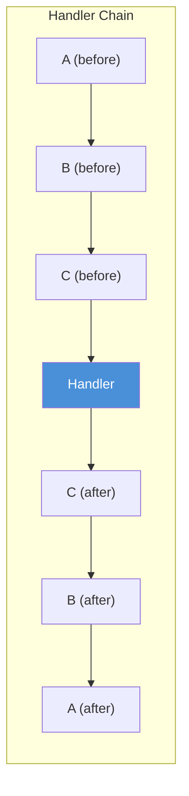
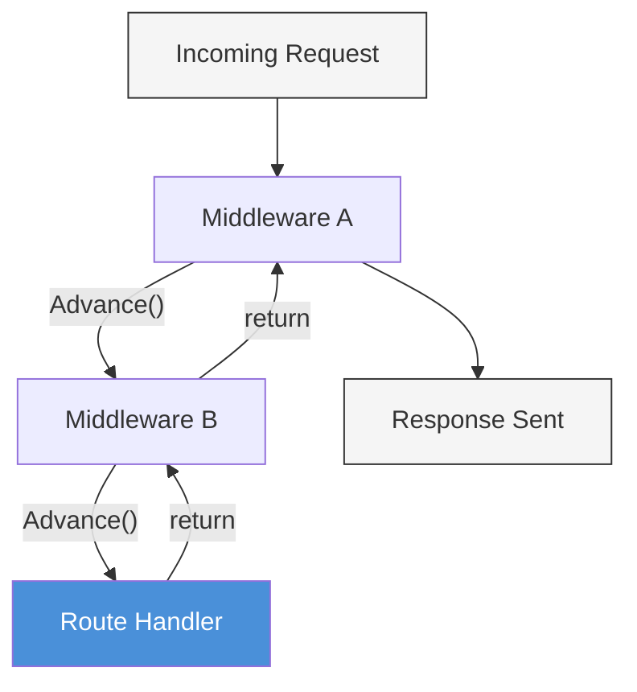

# Chapter 7: Middleware

*The security gates every request must pass through.*

---

**After reading this chapter you will be able to:**

- Explain the middleware pattern and the onion model of request processing
- Trace the execution order of a middleware chain and predict which code runs before and after the handler
- Read and understand the Logger and Recovery middleware implementations in PureSimple
- Write custom middleware for tasks like request ID generation, timing, and basic rate limiting
- Reason about middleware ordering and explain why the order of `Engine::Use` calls matters

---

## 7.1 What Middleware Is

Middleware is like airport security. Everyone passes through it, nobody enjoys it, and it catches the one thing that would ruin everyone's day.

In practical terms, middleware is a handler that runs shared logic before and after the route handler. Logging, error recovery, authentication, CSRF validation, session loading, rate limiting, CORS headers -- these are all concerns that apply to many (or all) routes and that you do not want to duplicate in every handler function. Middleware lets you write this logic once and apply it globally or to specific route groups.

The mechanism is straightforward. A middleware function has the same signature as any handler: `Procedure MyMiddleware(*C.RequestContext)`. It does some work, calls `Ctx::Advance(*C)` to pass control to the next handler in the chain, and optionally does more work after `Advance` returns. If it does not call `Advance`, the chain stops and no downstream handlers execute.

```purebasic
; Listing 7.1 — The anatomy of a middleware function
Procedure ExampleMiddleware(*C.RequestContext)
  ; --- "before" logic: runs on the way in ---
  PrintN("Before handler")

  Ctx::Advance(*C)   ; pass control downstream

  ; --- "after" logic: runs on the way out ---
  PrintN("After handler")
EndProcedure
```

This is the entire pattern. There are no special interfaces to implement, no abstract classes to extend, no lifecycle methods to override. A middleware is a procedure that calls `Advance` at the appropriate moment. The simplicity is the feature.

---

## 7.2 The Onion Model

When you register multiple middleware with `Engine::Use`, PureSimple adds them to the handler chain in order, followed by the route handler at the end. The resulting execution follows what is commonly called the **onion model**: each middleware wraps the ones inside it, like layers of an onion.

Consider three middleware functions (A, B, C) and a route handler:


*Figure 7.1 -- The onion model. Each middleware's "before" code runs in registration order. The handler executes. Then each middleware's "after" code runs in reverse order.*

The execution trace for this chain is:

1. A's before logic runs
2. A calls `Advance` -- B's before logic runs
3. B calls `Advance` -- C's before logic runs
4. C calls `Advance` -- the route handler runs
5. Handler returns -- C's after logic runs
6. C's `Advance` returns -- B's after logic runs
7. B's `Advance` returns -- A's after logic runs

This is not theory. This is exactly what happens in the code. Each call to `Advance` pushes one level deeper. Each return from `Advance` pops one level back. The call stack *is* the middleware chain.


*Figure 7.2 -- Middleware ordering. Execution flows inward through `Advance` calls and outward through returns. The first middleware registered is the outermost layer.*

> **Compare:** Express.js uses `app.use(middleware)` and the middleware calls `next()` to continue. Gin (Go) uses `r.Use(middleware)` and the middleware calls `c.Next()` to continue. PureSimple uses `Engine::Use(@Middleware())` and the middleware calls `Ctx::Advance(*C)` to continue. The pattern is identical across frameworks -- only the function names change.

---

## 7.3 Logger Middleware

The Logger middleware is the first middleware you should register and the last one you should remove. It records the HTTP method, path, response status code, and elapsed time for every request. When something goes wrong at 3 AM, the logger output is the first thing you check.

Here is the complete implementation:

```purebasic
; Listing 7.2 — Logger middleware
; (from src/Middleware/Logger.pbi)
DeclareModule Logger
  Declare Middleware(*C.RequestContext)
EndDeclareModule

Module Logger
  UseModule Types

  Procedure Middleware(*C.RequestContext)
    Protected t0.i      = ElapsedMilliseconds()
    Protected method.s  = *C\Method
    Protected path.s    = *C\Path

    Ctx::Advance(*C)

    Protected elapsed.i = ElapsedMilliseconds() - t0
    PrintN("[LOG] " + method + " " + path +
           " -> " + Str(*C\StatusCode) +
           " (" + Str(elapsed) + "ms)")
  EndProcedure

EndModule
```

The Logger captures the method and path *before* `Advance`, because downstream handlers might modify the context in ways that make these values harder to read later. The status code and elapsed time are captured *after* `Advance`, because they are not known until the handler chain has completed. This is the onion model in action: before-logic captures input, after-logic captures output.

The output looks like:

```
[LOG] GET /api/posts -> 200 (3ms)
[LOG] POST /api/posts -> 201 (12ms)
[LOG] GET /api/missing -> 404 (0ms)
```

Registration is a single line:

```purebasic
; Listing 7.3 — Registering the Logger middleware
Engine::Use(@Logger::Middleware())
```

> **Tip:** Always register Logger as the *first* middleware (before Recovery). This ensures that the logger's timer captures the full request processing time, including any time spent in Recovery's error handling. If you register Logger after Recovery, a recovered panic's processing time will not be included in the log.

---

## 7.4 Recovery Middleware

In a production web server, an unhandled runtime error (null-pointer dereference, array out of bounds, explicit `RaiseError`) must not crash the process. The Recovery middleware catches these errors and converts them into a 500 Internal Server Error response. Your server stays alive, the error gets logged, and the client gets a dignified error page instead of a connection reset.

```purebasic
; Listing 7.4 — Recovery middleware
; (from src/Middleware/Recovery.pbi)
DeclareModule Recovery
  Declare Middleware(*C.RequestContext)
EndDeclareModule

Module Recovery
  UseModule Types

  Global _CtxPtr.i = 0

  Procedure Middleware(*C.RequestContext)
    Protected *Cx.RequestContext

    _CtxPtr = *C
    OnErrorGoto(?_Mw_Recovery_Error)

    Ctx::Advance(*C)

    Goto _Mw_Recovery_Done

  _Mw_Recovery_Error:
    If _CtxPtr
      *Cx = _CtxPtr
      *Cx\StatusCode   = 500
      *Cx\ResponseBody = "Internal Server Error"
      *Cx\ContentType  = "text/plain"
      Ctx::Abort(*Cx)
    EndIf

  _Mw_Recovery_Done:
    _CtxPtr = 0
    OnErrorDefault()
  EndProcedure

EndModule
```

This is the most complex middleware in PureSimple, and it is worth understanding line by line.

`OnErrorGoto(?_Mw_Recovery_Error)` installs a `setjmp` checkpoint. If any downstream handler triggers a runtime error, the PureBasic runtime performs a `longjmp` and execution resumes at the `_Mw_Recovery_Error` label. The global `_CtxPtr` holds the context address because local variables do not survive a `longjmp` -- the stack frame is gone by the time execution reaches the error handler.

In the error path, Recovery sets the status code to 500, writes a generic error message, and calls `Ctx::Abort` to prevent any further handlers from running. In the normal (no-error) path, `Goto _Mw_Recovery_Done` skips the error block entirely. At the end, `OnErrorDefault()` removes the custom error handler so it does not interfere with code outside the middleware.

> **PureBasic Gotcha:** `OnErrorGoto` uses `setjmp`/`longjmp` under the hood. On macOS arm64, `longjmp` does not catch OS-level signals (e.g., SIGBUS, SIGSEGV from accessing unmapped memory). It catches PureBasic runtime errors like `RaiseError()`, array bounds violations when the debugger is enabled, and null-pointer string operations. For true crash protection in production, you also need an external process monitor (systemd's `Restart=always`).

> **Under the Hood:** The `_CtxPtr` global is a deliberate compromise. Normally, PureSimple avoids global mutable state. But `longjmp` destroys the call stack, which means the `*C` parameter -- a local variable on the stack -- is no longer accessible in the error handler. Storing the pointer in a global before the error-prone section and clearing it afterward is the standard pattern for `setjmp`-based error recovery. It is not pretty, but it works.

---

## 7.5 Writing Custom Middleware

The pattern for writing custom middleware is always the same: capture state before, call `Advance`, do work after. Here is a request-ID middleware that generates a unique identifier for each request and attaches it to the context's KV store:

```purebasic
; Listing 7.5 — Custom request-ID middleware
Procedure RequestIDMiddleware(*C.RequestContext)
  Protected reqId.s = Hex(Random($FFFFFFFF)) +
                      Hex(Random($FFFFFFFF))
  Ctx::Set(*C, "requestId", reqId)

  Ctx::Advance(*C)

  ; After: could log the request ID with the response
EndProcedure

Engine::Use(@RequestIDMiddleware())
```

And here is a simple rate limiter that rejects requests exceeding a threshold. This is a naive implementation using a global counter and a time window, suitable for single-threaded servers:

```purebasic
; Listing 7.6 — Simple rate-limiting middleware
Global _RateCount.i  = 0
Global _RateWindow.i = 0

Procedure RateLimitMiddleware(*C.RequestContext)
  Protected now.i = ElapsedMilliseconds()

  ; Reset counter every 60 seconds
  If now - _RateWindow > 60000
    _RateCount  = 0
    _RateWindow = now
  EndIf

  _RateCount + 1

  If _RateCount > 100
    Ctx::AbortWithError(*C, 429, "Too Many Requests")
    ProcedureReturn
  EndIf

  Ctx::Advance(*C)
EndProcedure
```

Notice the `ProcedureReturn` after `AbortWithError`. This is critical. Without it, execution falls through to `Ctx::Advance`, which checks the aborted flag and does nothing -- but the intent is unclear, and any after-logic below `Advance` would still run. Always return immediately after aborting.

A few guidelines for writing middleware:

1. **Keep it focused.** Each middleware should do one thing. Authentication is one middleware. Logging is another. Do not combine them.
2. **Always call `Advance` on the success path.** If your middleware does not call `Advance`, the handler chain stops. This is only correct if you are intentionally blocking the request.
3. **Always call `ProcedureReturn` after aborting.** Even though `Advance` checks the aborted flag, an explicit return makes the control flow visible.
4. **Avoid heavy computation before `Advance`.** The client is waiting. Do the minimum work needed to decide whether the request should proceed, then advance. Expensive work (like logging to a file) can happen after `Advance` returns.

> **Tip:** When debugging middleware issues, add `PrintN("MW:before:" + *C\Path)` before `Advance` and `PrintN("MW:after:" + Str(*C\StatusCode))` after. This gives you a clear trace of the chain execution order without needing a debugger.

---

## 7.6 Middleware Ordering

The order in which you register middleware with `Engine::Use` determines the order in which they execute. This is not a detail you can ignore.

```purebasic
; Listing 7.7 — Middleware registration order
Engine::Use(@Logger::Middleware())
Engine::Use(@Recovery::Middleware())
Engine::Use(@AuthGuard())
```

With this registration, the execution order is:

1. Logger (before) -- capture method, path, start timer
2. Recovery (before) -- install error handler
3. AuthGuard (before) -- check credentials
4. Route handler
5. AuthGuard (after) -- nothing in this case
6. Recovery (after) -- remove error handler
7. Logger (after) -- log status code and elapsed time

If you reverse Logger and Recovery, the logger's timer will not include time spent in Recovery's error handling path. If you put AuthGuard before Recovery, an error in AuthGuard will crash the process because Recovery has not installed its error handler yet.

The recommended ordering for PureSimple middleware is:

1. **Logger** -- first in, last out. Captures everything.
2. **Recovery** -- second in, second-to-last out. Catches errors from everything after it.
3. **Session** -- loads session data for use by subsequent middleware.
4. **CSRF** -- validates tokens before any state-changing handlers run.
5. **Authentication** -- checks credentials using session data loaded by step 3.
6. Route handler.

`Engine::CombineHandlers` builds the chain by prepending all global middleware before the route handler:

```purebasic
; From src/Engine.pbi — CombineHandlers
Procedure CombineHandlers(*C.RequestContext,
                           RouteHandler.i)
  Protected i.i
  For i = 0 To _MWCount - 1
    Ctx::AddHandler(*C, _MW(i))
  Next i
  Ctx::AddHandler(*C, RouteHandler)
EndProcedure
```

The middleware array `_MW` is populated by `Engine::Use` calls in the order they are made. `CombineHandlers` iterates this array and appends each middleware to the context's handler chain, followed by the route handler at the end. The route handler is always last. You cannot put middleware after the handler in the global chain -- but you do not need to, because middleware after-logic achieves the same effect via the onion model.

> **Warning:** `Engine::Use` is a global registration. Every route in your application will pass through every globally registered middleware. If you need middleware that applies only to certain routes, use route groups (Chapter 10) instead of `Engine::Use`. A common mistake is registering admin-only authentication as global middleware, which blocks access to public routes.

---

## 7.7 Reset Between Tests

When writing tests, you will register middleware for one test suite and need a clean state for the next. `Engine::ResetMiddleware()` clears all global middleware, custom 404/405 handlers, and the middleware counter:

```purebasic
; Listing 7.8 — Resetting middleware state between tests
Engine::ResetMiddleware()

; Now register middleware for this test suite only
Engine::Use(@Logger::Middleware())
Engine::Use(@Recovery::Middleware())
```

Forgetting to call `ResetMiddleware()` between test suites leads to middleware from previous suites leaking into subsequent ones. The symptoms are confusing: unexpected 401 responses, doubled log lines, or middleware that runs twice. If your test output looks haunted, `ResetMiddleware()` is usually the exorcism you need.

---

## Summary

Middleware is the mechanism for running shared logic across routes without duplicating code in every handler. The pattern is universal: do work before `Advance`, call `Advance` to continue the chain, do work after `Advance` returns. Logger captures timing and status information. Recovery catches runtime errors via `OnErrorGoto` and converts them to 500 responses. Custom middleware follows the same pattern for authentication, rate limiting, request IDs, and any other cross-cutting concern. The order of `Engine::Use` calls determines execution order, and getting it wrong produces bugs that are difficult to diagnose without understanding the onion model.

## Key Takeaways

- Middleware is a handler that calls `Ctx::Advance(*C)` to pass control downstream. Code before `Advance` runs on the way in; code after `Advance` runs on the way out. This is the onion model.
- Logger should be the first middleware registered (outermost layer) so its timer captures the entire request lifecycle. Recovery should be second so it catches errors from all downstream middleware and handlers.
- Always call `ProcedureReturn` immediately after `Ctx::Abort` or `Ctx::AbortWithError`. Even though `Advance` checks the aborted flag, an explicit return makes control flow visible and prevents after-logic from executing.
- `Engine::Use` registers global middleware that applies to every route. For route-specific middleware, use route groups (Chapter 10).

## Review Questions

1. If middleware A, B, and C are registered in that order with `Engine::Use`, and the route handler is H, what is the complete execution order of before-logic, handler, and after-logic?
2. Why does the Recovery middleware store the context pointer in a global variable (`_CtxPtr`) instead of using the `*C` parameter in the error handler?
3. *Try it:* Write a middleware that adds an `X-Request-Time` header concept by storing the elapsed time (in milliseconds) in the KV store with key `"x-request-time"`. Register it with `Engine::Use` alongside Logger and Recovery. Create a simple handler that reads the value from the KV store after `Advance` returns and prints it. Verify that the timing value is consistent with what Logger reports.
