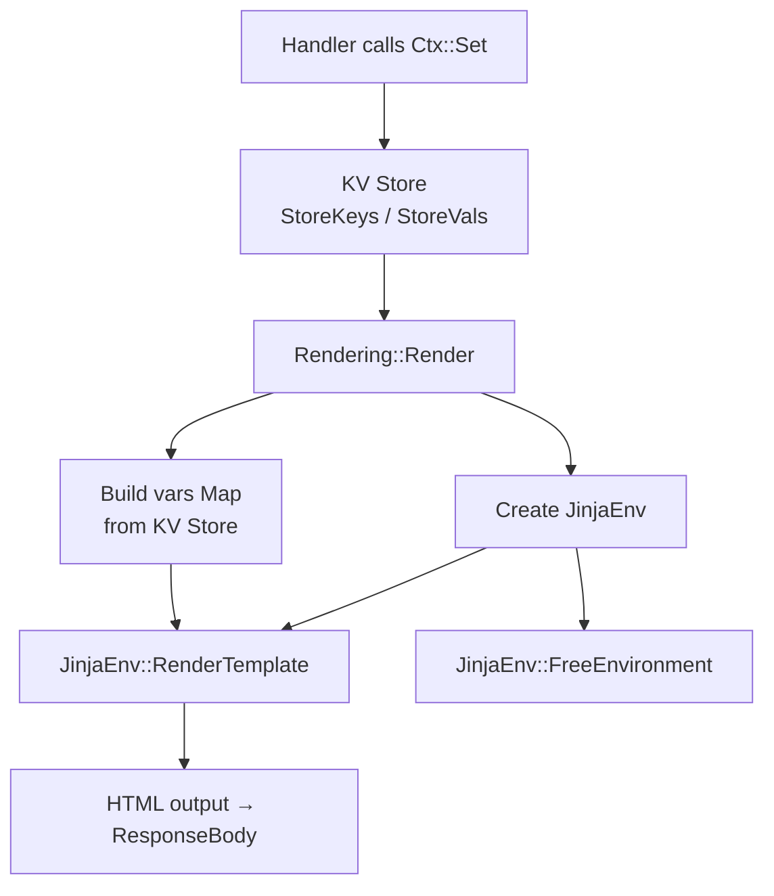

# Chapter 9: Response Rendering

*Giving your server a voice -- JSON, HTML, redirects, and files.*

---

**After reading this chapter you will be able to:**

- Send JSON, HTML, and plain-text responses with appropriate content types and status codes
- Redirect clients with 302 (temporary) and 301 (permanent) status codes
- Serve static files from disk using `Rendering::File`
- Render Jinja2 templates through `Rendering::Render`, passing handler data via the context KV store
- Set bare status codes for bodyless responses like 204 No Content

---

## 9.1 The Rendering Module

Chapter 8 covered how data gets into your handler. This chapter covers how data gets out. The `Rendering` module is the mirror image of `Binding`: where Binding reads from `*C\Body`, `*C\RawQuery`, and `*C\ParamKeys`, Rendering writes to `*C\ResponseBody`, `*C\ContentType`, and `*C\StatusCode`. The HTTP server reads those fields after your handler returns and sends the response to the client.

Every rendering procedure follows the same pattern: accept a context pointer and some content, set the three response fields, and return. There is no buffering, no streaming, no response object to build and then flush. You call one procedure, and the response is ready. It is, as rendering goes, the polar opposite of building a PDF.

Here is the full public interface:

```purebasic
; Listing 9.1 -- The Rendering module's public interface
DeclareModule Rendering
  Declare JSON(*C.RequestContext, Body.s, StatusCode.i = 200)
  Declare HTML(*C.RequestContext, Body.s, StatusCode.i = 200)
  Declare Text(*C.RequestContext, Body.s, StatusCode.i = 200)
  Declare Status(*C.RequestContext, StatusCode.i)
  Declare Redirect(*C.RequestContext, URL.s, StatusCode.i = 302)
  Declare File(*C.RequestContext, FilePath.s)
  Declare Render(*C.RequestContext, TemplateName.s,
                 TemplatesDir.s = "templates/")
EndDeclareModule
```

Seven procedures. No configuration. No builder objects. You call one, and your handler is done. The simplicity is intentional. A web framework's rendering layer has one job: put the right bytes in the right fields. Anything more is a template engine's responsibility, and PureSimple delegates that to PureJinja (Chapter 11).

---

## 9.2 JSON Responses

The most common response type for APIs is JSON. `Rendering::JSON` sets the content type to `application/json`, stores the body string, and sets the status code:

```purebasic
; Listing 9.2 -- Sending a JSON response
Procedure HealthHandler(*C.RequestContext)
  Rendering::JSON(*C, ~"{\"status\":\"ok\"}")
EndProcedure

Engine::GET("/health", @HealthHandler())
```

The status code defaults to 200 but can be overridden:

```purebasic
; Listing 9.3 -- JSON with a custom status code
Procedure NotFoundHandler(*C.RequestContext)
  Rendering::JSON(*C,
    ~"{\"error\":\"resource not found\"}", 404)
EndProcedure
```

You build the JSON string yourself using PureBasic's string concatenation and escape sequences (`~"..."` prefix for `\"` characters). For simple responses -- a status message, an error, a small object -- this is faster and more readable than constructing a JSON tree with `CreateJSON`, `SetJSONString`, and `ComposeJSON`. For complex objects with nested arrays, use PureBasic's JSON library directly and pass the result to `Rendering::JSON`.

> **Compare:** Gin's `c.JSON(200, gin.H{"status": "ok"})` automatically serialises a Go map to JSON. PureSimple does not have an equivalent auto-serialiser because PureBasic lacks reflection -- there is no way to inspect a structure's fields at runtime and convert them to JSON keys. You build the string, and the framework sends it. This is a trade-off: more typing, zero magic, zero surprises.

The implementation is four lines:

```purebasic
; Listing 9.4 -- Rendering::JSON internals (from src/Rendering.pbi)
Procedure JSON(*C.RequestContext, Body.s, StatusCode.i = 200)
  *C\StatusCode   = StatusCode
  *C\ResponseBody = Body
  *C\ContentType  = "application/json"
EndProcedure
```

If you were expecting something more dramatic, that is the point. The rendering module is not where the complexity lives. It is a thin assignment layer that ensures the content type and status code are always set correctly. The drama happens in the router, the middleware chain, and the template engine. Rendering is the calm after the storm.

---

## 9.3 HTML and Text Responses

For server-rendered pages that do not use templates, `Rendering::HTML` sends an HTML string with `text/html`:

```purebasic
; Listing 9.5 -- Sending a raw HTML response
Procedure SimplePageHandler(*C.RequestContext)
  Rendering::HTML(*C,
    "<html><body><h1>Hello</h1></body></html>")
EndProcedure
```

For plain-text responses -- debug output, health checks, simple messages -- `Rendering::Text` sets `text/plain`:

```purebasic
; Listing 9.6 -- Sending a plain-text response
Procedure PingHandler(*C.RequestContext)
  Rendering::Text(*C, "pong")
EndProcedure
```

Both work identically to `Rendering::JSON` but with different content types. The browser uses the content type to decide how to render the response: HTML gets parsed and displayed as a page, plain text gets shown as-is in a monospace font, and JSON typically gets formatted by browser developer tools.

Writing raw HTML strings in handler code is fine for one-off pages and prototypes. For anything with a navigation bar, a footer, or more than about ten lines of markup, use `Rendering::Render` with templates (Section 9.7). Your future self will thank you. Your present self might not appreciate the extra files, but your future self is the one who has to add a sidebar to every page.

---

## 9.4 Status-Only Responses

Some HTTP responses carry no body at all. A successful `DELETE` often returns `204 No Content`. An `OPTIONS` preflight response returns headers only. For these, `Rendering::Status` sets the status code without touching the response body:

```purebasic
; Listing 9.7 -- Status-only response for DELETE
Procedure DeleteItemHandler(*C.RequestContext)
  Protected id.s = Binding::Param(*C, "id")
  ; Delete the item from storage...
  Rendering::Status(*C, 204)
EndProcedure

Engine::DELETE("/items/:id", @DeleteItemHandler())
```

> **Tip:** Use `Rendering::Status` for 204 No Content, 304 Not Modified, and any other response where a body would be meaningless. Sending an empty body with `Rendering::JSON(*C, "", 204)` works, but it sets a content type header that promises JSON and then delivers nothing. That is technically valid HTTP but philosophically dishonest.

---

## 9.5 Redirects

Redirects tell the browser to go somewhere else. `Rendering::Redirect` sets the `Location` header and clears the response body:

```purebasic
; Listing 9.8 -- Temporary redirect after form submission
Procedure SubmitFormHandler(*C.RequestContext)
  ; Process form data...
  Rendering::Redirect(*C, "/thank-you")
EndProcedure

Engine::POST("/contact", @SubmitFormHandler())
```

The default status code is 302 (Found), which is the right choice for the Post-Redirect-Get (PRG) pattern: the user submits a form, the server processes it, and then redirects to a confirmation page. If the user refreshes the confirmation page, the browser re-requests the GET, not the POST. This prevents duplicate form submissions, which is especially important when the form creates database records or sends emails.

For permanent redirects -- when a URL has moved forever and search engines should update their indexes -- use 301:

```purebasic
; Listing 9.9 -- Permanent redirect for moved content
Procedure OldBlogHandler(*C.RequestContext)
  Protected slug.s = Binding::Param(*C, "slug")
  Rendering::Redirect(*C, "/post/" + slug, 301)
EndProcedure

Engine::GET("/blog/:slug", @OldBlogHandler())
```

The difference between 301 and 302 matters primarily to search engines and caching proxies. Browsers follow both. Use 302 unless you are certain the old URL will never be valid again.

Here is what `Redirect` does internally:

```purebasic
; Listing 9.10 -- Rendering::Redirect internals
;                  (from src/Rendering.pbi)
Procedure Redirect(*C.RequestContext, URL.s,
                    StatusCode.i = 302)
  *C\StatusCode   = StatusCode
  *C\Location     = URL
  *C\ResponseBody = ""
  *C\ContentType  = "text/plain"
EndProcedure
```

It sets `*C\Location`, which PureSimpleHTTPServer reads and converts into a `Location:` response header. The response body is cleared because redirect responses should not carry content -- the browser will not display it anyway. It is loading the next page before your response body finishes downloading.

---

## 9.6 File Responses

`Rendering::File` reads a file from disk and sends its contents as HTML:

```purebasic
; Listing 9.11 -- Serving a static HTML file
Procedure LicenseHandler(*C.RequestContext)
  Rendering::File(*C, "static/license.html")
EndProcedure

Engine::GET("/license", @LicenseHandler())
```

The procedure handles two error cases internally. If the file does not exist (`FileSize` returns less than zero), it returns a 404 with a plain-text error message. If the file exists but cannot be opened, it returns a 500. Both cases set the content type to `text/plain` so the error message displays correctly.

```purebasic
; Listing 9.12 -- File error handling (from src/Rendering.pbi)
Procedure File(*C.RequestContext, FilePath.s)
  Protected fh.i
  If FileSize(FilePath) < 0
    *C\StatusCode   = 404
    *C\ResponseBody = "File not found: " + FilePath
    *C\ContentType  = "text/plain"
    ProcedureReturn
  EndIf
  fh = ReadFile(#PB_Any, FilePath)
  If fh = 0
    *C\StatusCode   = 500
    *C\ResponseBody = "Cannot open file: " + FilePath
    *C\ContentType  = "text/plain"
    ProcedureReturn
  EndIf
  *C\ResponseBody = ""
  While Not Eof(fh)
    *C\ResponseBody + ReadString(fh) + #LF$
  Wend
  CloseFile(fh)
  *C\StatusCode  = 200
  *C\ContentType = "text/html"
EndProcedure
```

> **PureBasic Gotcha:** PureBasic does not have a `FileExists()` function. The framework uses `FileSize(path) < 0` as the existence check. `FileSize` returns -1 if the file does not exist and -2 if the path is a directory. Any value of zero or greater means the file exists and has that many bytes. This is one of those PureBasic surprises that wastes exactly one debugging session before it becomes permanently etched in your memory.

Note that `Rendering::File` currently sets the content type to `text/html` for all files. For serving images, CSS, JavaScript, or other static assets, use PureSimpleHTTPServer's built-in static file server instead, which detects content types automatically. `Rendering::File` is designed for serving HTML page files from handler code, not for general-purpose static file serving. Using it to serve a PNG would technically work, but the browser would be very confused about why an image claims to be HTML.

---

## 9.7 Template Rendering with PureJinja

The most powerful rendering procedure is `Rendering::Render`. It loads a Jinja2 template file from disk, populates it with variables from the context's KV store, and sends the rendered HTML to the client. This is where PureSimple meets PureJinja, the Jinja2-compatible template engine that compiles into the same binary.

```purebasic
; Listing 9.13 -- Rendering a template with variables
Procedure HomeHandler(*C.RequestContext)
  Ctx::Set(*C, "site_name", "My Blog")
  Ctx::Set(*C, "greeting", "Welcome, visitor!")
  Rendering::Render(*C, "index.html",
                    "examples/blog/templates/")
EndProcedure
```

The flow works like this: you set variables on the context using `Ctx::Set`, then call `Rendering::Render` with the template filename and the directory where templates live. The Render procedure iterates the context's `StoreKeys` and `StoreVals` fields, creates a PureJinja variable map from them, creates a PureJinja environment, sets the template path, renders the template, and cleans everything up.


*Figure 9.1 -- The Rendering::Render pipeline from KV store to HTML output*

The `TemplatesDir` parameter defaults to `"templates/"`, which works for production deployments where the templates directory sits next to the binary. During development, you may need to specify a relative path like `"examples/blog/templates/"` to match your project structure.

> **Under the Hood:** `Rendering::Render` creates and destroys a `JinjaEnvironment` on every call. This includes parsing the template file, evaluating expressions, and freeing all allocated memory. For a blog with modest traffic, this is perfectly fine. The PureJinja engine is fast -- it runs at compiled-code speed, not interpreted-template speed. For high-traffic applications that render the same template thousands of times per second, you would want to cache the environment. That optimisation is not built into the framework today, but it is a straightforward extension.

Chapter 11 covers PureJinja's template syntax in detail -- `{{ variables }}`, `` blocks, `` loops, filters, and template inheritance. For now, the key insight is that `Rendering::Render` is the bridge between your handler code and your HTML templates. The handler sets data with `Ctx::Set`. The template reads it with `{{ variable_name }}`. The renderer connects the two.

---

## Summary

The Rendering module provides seven procedures that cover every common response type: `JSON` for APIs, `HTML` and `Text` for inline content, `Status` for bodyless responses, `Redirect` for navigation, `File` for serving pages from disk, and `Render` for Jinja2 templates. Each procedure sets `*C\StatusCode`, `*C\ResponseBody`, and `*C\ContentType` on the context, which PureSimpleHTTPServer reads and sends to the client. The module is deliberately thin -- it assigns fields and gets out of the way, leaving complex rendering to PureJinja.

## Key Takeaways

- Every rendering procedure sets exactly three context fields: `StatusCode`, `ResponseBody`, and `ContentType`. Redirects also set `Location`.
- Use `Rendering::Status` for bodyless responses (204, 304) instead of sending an empty body with a content type that promises content.
- `Rendering::Render` bridges the handler and PureJinja: the handler sets KV store variables with `Ctx::Set`, and the template reads them with `{{ variable }}` syntax.
- `Rendering::File` uses `FileSize(path) < 0` for existence checks because PureBasic has no `FileExists()` function.

## Review Questions

1. What is the difference between `Rendering::JSON(*C, "", 204)` and `Rendering::Status(*C, 204)`? Which is more correct for a "No Content" response, and why?
2. Explain the Post-Redirect-Get (PRG) pattern and why `Rendering::Redirect` defaults to status code 302 rather than 301.
3. *Try it:* Write a handler that reads a query parameter called `format`. If `format` is `"json"`, return a JSON response. If it is `"text"`, return a plain-text response. If it is anything else, return an HTML response. All three should contain the message "Hello, PureSimple!" with a 200 status code.
