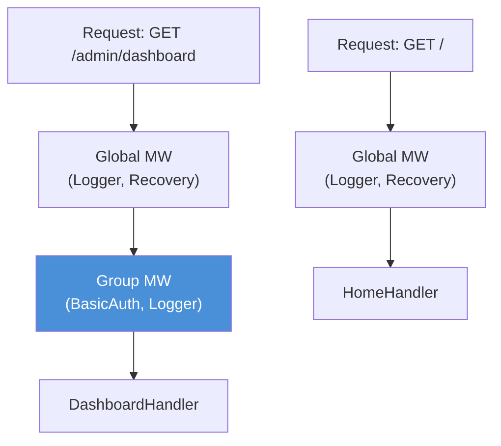

# Chapter 10: Route Groups

*Organising routes the way you organise your code -- by responsibility.*

---

**After reading this chapter you will be able to:**

- Create route groups with shared path prefixes using `Group::Init`
- Attach group-scoped middleware with `Group::Use`
- Nest groups using `Group::SubGroup` to build hierarchical route structures
- Implement API versioning with prefix-based groups
- Scope authentication middleware to admin-only route groups

---

## 10.1 Why Groups Exist

By Chapter 9, you know how to register routes, extract data, and send responses. A small application with five or six routes works fine with flat registration:

```purebasic
Engine::GET("/",          @HomeHandler())
Engine::GET("/about",     @AboutHandler())
Engine::GET("/health",    @HealthHandler())
Engine::POST("/contact",  @ContactHandler())
```

Now imagine an application with thirty routes. Ten belong to a public API under `/api/v1`, eight belong to an admin panel under `/admin`, and the rest are public pages. Every admin route needs authentication middleware. Every API route needs a rate limiter. If you register each route individually and attach middleware to each one, you repeat yourself thirty times. Repetition is not just tedious -- it is a bug factory. Forget to attach the auth middleware to one admin route, and you have an unauthenticated endpoint in production. Good luck finding it before someone else does.

Route groups solve this problem. A group bundles a path prefix and a set of middleware together. Every route registered through the group inherits both. Change the group's middleware, and every route in the group picks up the change. Add a route to the group, and it automatically gets the prefix and all the middleware. You define the policy once, and the routes follow it.

This is the same idea as Go's `r.Group()` in Chi, or `r.Group()` in Gin. If you have used either of those, PureSimple's groups will feel immediately familiar. If you have not, think of a group as a sub-router with a prefix sticker and a bouncer at the door.

---

## 10.2 Creating a Group

A group is a `PS_RouterGroup` structure that holds a path prefix, a middleware array, and a count. You declare one on the stack and initialise it with `Group::Init`:

```purebasic
; Listing 10.1 -- Creating a basic route group
Protected api.PS_RouterGroup
Group::Init(@api, "/api")

Group::GET(@api, "/users",  @ListUsersHandler())
Group::POST(@api, "/users", @CreateUserHandler())
```

`Group::Init` sets the prefix to `"/api"` and resets the middleware count to zero. When you call `Group::GET(@api, "/users", @ListUsersHandler())`, the group prepends its prefix to the pattern, producing `"/api/users"`, and passes that to `Router::Insert`. The handler is registered as if you had written `Engine::GET("/api/users", @ListUsersHandler())`. The group is syntax sugar -- it does the concatenation for you and guarantees consistency.

The `PS_RouterGroup` structure is defined in `src/Types.pbi`:

```purebasic
; Listing 10.2 -- The PS_RouterGroup structure
;                  (from src/Types.pbi)
Structure PS_RouterGroup
  Prefix.s        ; path prefix for all routes
  MW.i[32]        ; middleware procedure addresses
  MWCount.i       ; number of registered middleware
EndStructure
```

The middleware array is fixed at 32 slots. This is a deliberate design choice. A fixed-size array avoids dynamic allocation, keeps the structure stack-allocatable, and imposes a reasonable upper bound. If you need more than 32 middleware handlers on a single group, the problem is your architecture, not the array size. Thirty-two middleware handlers in a chain would make a request feel like it is passing through customs at every border in Europe.

---

## 10.3 Group Middleware

Middleware registered with `Group::Use` applies only to routes in that group. Global middleware (registered with `Engine::Use`) still applies to every route, including those in groups. The final handler chain for a grouped route is: global middleware, then group middleware, then the route handler.

```purebasic
; Listing 10.3 -- Adding middleware to a group
Protected admin.PS_RouterGroup
Group::Init(@admin, "/admin")
Group::Use(@admin, @BasicAuth::Middleware())
Group::Use(@admin, @Logger::Middleware())

Group::GET(@admin, "/dashboard",  @DashboardHandler())
Group::GET(@admin, "/users",      @AdminUsersHandler())
Group::POST(@admin, "/users",     @AdminCreateHandler())
```

In this example, every request to `/admin/dashboard`, `/admin/users`, or any other route registered on the `admin` group passes through `BasicAuth::Middleware` and then `Logger::Middleware` before reaching the handler. Public routes registered with `Engine::GET` do not see the BasicAuth middleware. The authentication boundary is defined by the group, not by individual routes.


*Figure 10.1 -- Route group middleware stacking: grouped routes pass through global and group middleware; ungrouped routes see only global middleware*

> **Under the Hood:** When a grouped route is dispatched, `Group::CombineHandlers` builds the full handler chain. It first calls `Engine::AppendGlobalMiddleware(*C)` to add all global middleware to the context's handler array. Then it loops through the group's `MW` array, adding each group middleware. Finally, it adds the route handler itself. The context's `Advance` mechanism (Chapter 6) then iterates through this combined array one handler at a time, calling each in order.

```purebasic
; Listing 10.4 -- CombineHandlers builds the chain
;                  (from src/Group.pbi)
Procedure CombineHandlers(*G.PS_RouterGroup,
                           *C.RequestContext,
                           RouteHandler.i)
  Protected i.i
  Engine::AppendGlobalMiddleware(*C)
  For i = 0 To *G\MWCount - 1
    Ctx::AddHandler(*C, *G\MW[i])
  Next i
  Ctx::AddHandler(*C, RouteHandler)
EndProcedure
```

---

## 10.4 Nesting Groups with SubGroup

Groups can nest. An API group can contain version sub-groups. An admin group can contain section sub-groups. `Group::SubGroup` creates a child group that inherits the parent's prefix and middleware, then adds its own:

```purebasic
; Listing 10.5 -- Nested groups for API versioning
Protected api.PS_RouterGroup
Group::Init(@api, "/api")
Group::Use(@api, @RateLimitMiddleware())

Protected v1.PS_RouterGroup
Group::SubGroup(@api, @v1, "/v1")

Protected v2.PS_RouterGroup
Group::SubGroup(@api, @v2, "/v2")
Group::Use(@v2, @DeprecationHeaderMiddleware())

; /api/v1/users -- rate-limited
Group::GET(@v1, "/users", @ListUsersV1())

; /api/v2/users -- rate-limited + deprecation header
Group::GET(@v2, "/users", @ListUsersV2())
```

`SubGroup` performs two operations. First, it concatenates the parent's prefix with the sub-prefix: `"/api"` + `"/v1"` = `"/api/v1"`. Second, it copies the parent's middleware array into the child. The copy is a value copy, not a reference. After `SubGroup` returns, the child has its own independent middleware list that starts with whatever the parent had. Calling `Group::Use` on the child adds middleware only to the child -- the parent is unaffected.

```purebasic
; Listing 10.6 -- SubGroup copies prefix and middleware
;                  (from src/Group.pbi)
Procedure SubGroup(*Parent.PS_RouterGroup,
                    *Child.PS_RouterGroup,
                    SubPrefix.s)
  Protected i.i
  *Child\Prefix  = *Parent\Prefix + SubPrefix
  *Child\MWCount = *Parent\MWCount
  For i = 0 To *Parent\MWCount - 1
    *Child\MW[i] = *Parent\MW[i]
  Next i
EndProcedure
```

This copy-on-SubGroup design means groups form a tree where each node inherits from its parent at creation time, but subsequent mutations do not propagate up or down. Add middleware to the parent after creating a child, and the child does not see it. This is predictable behavior: the group tree is a snapshot hierarchy, not a live reference graph. If you want a middleware to apply to all descendants, attach it to the parent before creating sub-groups.

> **Warning:** The middleware copy happens at `SubGroup` call time, not at dispatch time. If you call `Group::Use` on a parent after calling `SubGroup`, the child does not pick up the new middleware. Always configure a parent's middleware before creating its sub-groups. The code reads top-to-bottom, and the middleware chain builds top-to-bottom. Keep them in sync.

---

## 10.5 API Versioning Pattern

API versioning is the most common use case for nested groups. You want `/api/v1/users` and `/api/v2/users` to coexist, sharing some middleware but not all. Here is a complete pattern:

```purebasic
; Listing 10.7 -- Complete API versioning setup
; Global middleware
Engine::Use(@Logger::Middleware())
Engine::Use(@Recovery::Middleware())

; API group with shared middleware
Protected api.PS_RouterGroup
Group::Init(@api, "/api")
Group::Use(@api, @CORSMiddleware())

; Version 1 -- stable
Protected v1.PS_RouterGroup
Group::SubGroup(@api, @v1, "/v1")
Group::GET(@v1, "/users",     @V1ListUsers())
Group::GET(@v1, "/users/:id", @V1GetUser())
Group::POST(@v1, "/users",    @V1CreateUser())

; Version 2 -- new features
Protected v2.PS_RouterGroup
Group::SubGroup(@api, @v2, "/v2")
Group::GET(@v2, "/users",     @V2ListUsers())
Group::GET(@v2, "/users/:id", @V2GetUser())
Group::POST(@v2, "/users",    @V2CreateUser())
Group::GET(@v2, "/users/:id/posts", @V2UserPosts())
```

Both versions inherit the CORS middleware from the API group. V2 adds a new route (`/users/:id/posts`) that V1 does not have. The handlers for each version can diverge independently. V1 might return a flat user JSON, while V2 includes nested relations. The router does not care -- it matches the URL to the correct handler and lets the version-specific code take over.

People sometimes ask whether they should version their API. The answer is: you already have an API version. It is called "the current one." The question is whether you will regret not numbering it when the breaking changes come. You will.

---

## 10.6 Admin Routes with Scoped Authentication

Another common pattern is restricting an entire section of routes to authenticated users. Instead of attaching authentication middleware to each route, attach it to the group:

```purebasic
; Listing 10.8 -- Admin group with BasicAuth
Protected admin.PS_RouterGroup
Group::Init(@admin, "/admin")
Group::Use(@admin, @BasicAuth::Middleware())

Group::GET(@admin, "/",         @AdminDashboard())
Group::GET(@admin, "/posts",    @AdminListPosts())
Group::POST(@admin, "/posts",   @AdminCreatePost())
Group::PUT(@admin, "/posts/:id", @AdminUpdatePost())
Group::DELETE(@admin, "/posts/:id", @AdminDeletePost())
```

Five routes, one authentication boundary. If you later add `/admin/settings` or `/admin/users`, they are automatically protected. The group is not just a convenience -- it is a security policy expressed in code. Reviewers can see at a glance which routes require authentication by looking at which group they belong to.

> **Compare:** In Express.js, you would create a sub-router with `express.Router()`, attach `authMiddleware` with `.use()`, and mount it at `/admin`. In Go's Chi, you would use `r.Route("/admin", func(r chi.Router) { r.Use(authMW); r.Get("/", handler) })`. PureSimple's `Group::Init` + `Group::Use` follows exactly the same pattern. The syntax differs, the concept is identical.

---

## 10.7 The Complete HTTP Method Set

The Group module supports all six HTTP methods plus a wildcard:

```purebasic
; Listing 10.9 -- All group route registration methods
Group::GET(@g,    "/resource",     @GetHandler())
Group::POST(@g,   "/resource",     @PostHandler())
Group::PUT(@g,    "/resource/:id", @PutHandler())
Group::PATCH(@g,  "/resource/:id", @PatchHandler())
Group::DELETE(@g, "/resource/:id", @DeleteHandler())
Group::Any(@g,    "/wildcard",     @CatchAllHandler())
```

`Group::Any` registers the handler for all five methods (GET, POST, PUT, PATCH, DELETE) at the group's prefixed path. This is useful for handlers that need to respond to any method -- health checks, CORS preflight handlers, or catch-all error pages. Internally, it calls `Router::Insert` five times with the same handler and the same full path.

Each method procedure is a two-liner: concatenate the group prefix with the pattern, call `Router::Insert`. The simplicity makes the code easy to audit. There are no hidden transformations, no middleware injection at registration time, and no deferred evaluation. When you call `Group::GET`, the route is registered immediately and permanently. There is no "route table build phase" or "router compilation step." What you register is what you get.

---

## Summary

Route groups solve the problem of repetition in route registration. A group bundles a path prefix and a set of middleware, and every route registered through the group inherits both. Groups nest via `SubGroup`, which copies the parent's prefix and middleware into a child at creation time. This enables API versioning (shared prefix, divergent handlers) and scoped authentication (shared middleware, protected routes) without per-route configuration. The middleware array is fixed at 32 slots and copied by value, making groups stack-allocatable and mutation-safe.

## Key Takeaways

- `Group::Init` sets the prefix and resets middleware. All routes registered through the group get the prefix prepended automatically.
- `Group::Use` adds middleware that applies only to the group's routes. Global middleware (from `Engine::Use`) still applies to grouped routes, in addition to the group's own middleware.
- `Group::SubGroup` copies the parent's prefix and middleware by value. Changes to the parent after `SubGroup` do not propagate to the child.
- The middleware array has a fixed size of 32 slots per group. If you need more than 32, simplify your middleware architecture.

## Review Questions

1. In what order are handlers executed for a request that matches a grouped route? Describe the relationship between global middleware, group middleware, and the route handler.
2. A developer calls `Group::Use` on a parent group after calling `Group::SubGroup` to create a child. Will the child inherit the new middleware? Explain why or why not.
3. *Try it:* Create an API group at `/api` with a logging middleware. Create two sub-groups: `/api/v1` and `/api/v2`. Register a `GET /users` handler on each version that returns a different JSON response. Verify that both versions log requests.
