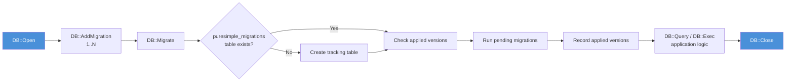

# Chapter 13: SQLite Integration

*Your database compiles into the binary too.*

---

**Learning Objectives**

After reading this chapter you will be able to:

- Open SQLite databases (file-based and in-memory) using the `DB` module
- Execute DDL and DML statements with parameterised queries to prevent SQL injection
- Query rows and extract typed column values using `DB::GetStr`, `DB::GetInt`, and `DB::GetFloat`
- Register and run idempotent migrations with `DB::AddMigration` and `DB::Migrate`
- Handle database errors gracefully using `DB::Error`

---

## 13.1 Why SQLite?

Most web frameworks require you to install a database server. You set up PostgreSQL, configure users, manage connections, and hope your ORM generates sensible SQL. PureSimple takes a different path. PureBasic ships with SQLite compiled into its standard library. When you call `UseSQLiteDatabase()`, the SQLite engine becomes part of your binary. No external process. No socket connections. No configuration files. Your database is either a single file on disk or a transient in-memory store that vanishes when the process exits.

This is not a limitation. SQLite handles hundreds of concurrent reads, supports transactions, and powers more deployed applications than any other database engine on the planet. Your phone uses it. Your browser uses it. If SQLite is good enough for Firefox and every Android device ever manufactured, it is good enough for your blog.

The `DB` module in PureSimple wraps PureBasic's built-in SQLite functions behind a clean, minimal API. The wrapper exists for two reasons. First, it gives every database operation a consistent `DB::` prefix, making code easier to read. Second, it adds a migration runner -- something PureBasic does not provide out of the box. You register numbered SQL statements, call `DB::Migrate`, and the framework applies only the ones that have not been run yet.

> **Compare:** If you have used Go's `database/sql` package, the `DB` module fills a similar role. `DB::Open` is `sql.Open`. `DB::Query` is `db.Query`. `DB::NextRow` is `rows.Next`. The API surface is deliberately small -- about a dozen procedures -- because a thin wrapper ages better than a thick abstraction.

---

## 13.2 Opening and Closing Databases

Everything starts with `DB::Open`. Pass it a file path and you get a database handle. Pass it `":memory:"` and you get a fresh in-memory database that disappears when you call `DB::Close` or the process exits.

```purebasic
; Listing 13.1 -- Opening a file-based and an in-memory database
EnableExplicit

XIncludeFile "../../src/PureSimple.pb"

; File-based database (created if it doesn't exist)
Define db.i = DB::Open("app.db")
If db = 0
  PrintN("Failed to open database")
  End 1
EndIf

; In-memory database (fast, temporary)
Define testdb.i = DB::Open(":memory:")

; ... use the databases ...

DB::Close(testdb)
DB::Close(db)
```

The handle returned by `DB::Open` is a PureBasic `#PB_Any` identifier -- an integer that uniquely identifies this database connection. You pass it to every subsequent `DB::` call. If the open fails, you get zero back. Always check for zero.

I once spent twenty minutes debugging a handler that silently produced empty pages. The database file path was wrong. `DB::Open` returned zero, every query returned zero, every `NextRow` returned zero, and the handler dutifully rendered a page with no data. No crash. No error message. Just a blank page and a developer staring at the screen. Check your handles.

> **Warning:** Always verify that `DB::Open` returns a non-zero handle before proceeding. A zero handle means the database could not be opened, and all subsequent operations on it will silently fail.

Under the hood, `DB::Open` calls PureBasic's `OpenDatabase(#PB_Any, Path, "", "")`. The two empty strings are the username and password parameters -- unused by SQLite but required by the function signature. `DB::Close` calls `CloseDatabase`. The wrapper adds no overhead; the compiler inlines these one-line procedures.

> **PureBasic Gotcha:** PureBasic requires `UseSQLiteDatabase()` to be called before any SQLite operations. In PureSimple, this is handled automatically -- `src/DB/SQLite.pbi` calls it at module level. If you write standalone SQLite code outside the framework, add `UseSQLiteDatabase()` before your first `DB::Open` call.

---

## 13.3 Executing Statements

Database operations split into two categories: statements that change data and statements that read data. The `DB` module reflects this split with `DB::Exec` for writes and `DB::Query` for reads.

### DDL: Creating Tables and Indexes

`DB::Exec` runs any SQL statement that does not return rows. This includes `CREATE TABLE`, `CREATE INDEX`, `INSERT`, `UPDATE`, `DELETE`, `DROP`, and `ALTER TABLE`.

```purebasic
; Listing 13.2 -- Creating a table and an index with DB::Exec
Define ok.i

ok = DB::Exec(db, "CREATE TABLE IF NOT EXISTS posts (" +
                   "id INTEGER PRIMARY KEY AUTOINCREMENT, " +
                   "title TEXT NOT NULL, " +
                   "slug TEXT NOT NULL UNIQUE, " +
                   "body TEXT NOT NULL, " +
                   "created_at TEXT NOT NULL DEFAULT " +
                   "(datetime('now')))")

If Not ok
  PrintN("Create table failed: " + DB::Error(db))
EndIf

ok = DB::Exec(db, "CREATE INDEX IF NOT EXISTS " +
                   "idx_posts_slug ON posts (slug)")
```

`DB::Exec` returns `#True` on success and `#False` on failure. When it fails, call `DB::Error` to get the error message from SQLite. The error string is useful for logging but should never be shown to end users -- it can leak schema details.

### DML: Inserting and Updating Data

Inserting data works the same way. But here you must confront the most important rule in web development: never concatenate user input into SQL strings.

```purebasic
; Listing 13.3 -- WRONG: SQL injection vulnerability
; NEVER DO THIS
Define title.s = userInput  ; ← attacker-controlled
DB::Exec(db, "INSERT INTO posts (title) VALUES ('" +
              title + "')")
; If title = "'); DROP TABLE posts; --"
; you just lost your data
```

Instead, use parameterised queries. PureBasic's database layer supports `?` placeholders. You bind values to those placeholders by index, and the database engine handles escaping.

```purebasic
; Listing 13.4 -- Correct: parameterised INSERT
DB::BindStr(db, 0, title)
DB::BindStr(db, 1, slug)
DB::BindStr(db, 2, body)
DB::Exec(db, "INSERT INTO posts (title, slug, body) " +
              "VALUES (?, ?, ?)")
```

> **Warning:** Always use parameterised queries. Never concatenate user input into SQL. This is not a suggestion. SQL injection has been the number-one web vulnerability for over twenty years, and the fix has been parameterised queries for exactly that long. There is no excuse.

The `DB::BindStr` and `DB::BindInt` procedures set parameter values by zero-based index. Call them *before* calling `DB::Exec` or `DB::Query`. The bindings apply to the next statement execution only.

---

## 13.4 Querying Data

Reading data requires a three-step dance: execute the query, iterate over rows, then clean up the result set.

```purebasic
; Listing 13.5 -- Querying rows with DB::Query and DB::NextRow
If DB::Query(db, "SELECT id, title, slug FROM posts " +
                  "ORDER BY id DESC")
  While DB::NextRow(db)
    Protected id.i    = DB::GetInt(db, 0)
    Protected title.s = DB::GetStr(db, 1)
    Protected slug.s  = DB::GetStr(db, 2)
    PrintN(Str(id) + ": " + title + " (" + slug + ")")
  Wend
  DB::Done(db)
EndIf
```

`DB::Query` returns `#True` if the query executed successfully (even if it returns zero rows). `DB::NextRow` advances to the next row and returns `#True` if one is available. When there are no more rows, it returns `#False` and you fall out of the `While` loop. `DB::Done` frees the internal result set -- call it when you are finished, whether you read all rows or not.

> **Tip:** PureBasic's `Protected` is scoped to the procedure, not the block. Declaring `Protected` inside a `While` loop does not re-allocate -- it is equivalent to declaring it at the top of the procedure. We place it near first use for readability.

> **PureBasic Gotcha:** The method is called `DB::NextRow`, not `DB::Next`. PureBasic reserves `Next` for `For...Next` loops. Every time you reach for `Next` and the compiler complains, remember: PureBasic has strong opinions about `For...Next`, and it will not negotiate.

Column values are extracted by zero-based index, not by name. Column 0 is the first column in your `SELECT` list. Three accessors cover the common types:

| Procedure | Returns | Use for |
|-----------|---------|---------|
| `DB::GetStr(db, col)` | `.s` (string) | TEXT columns |
| `DB::GetInt(db, col)` | `.i` (integer) | INTEGER columns |
| `DB::GetFloat(db, col)` | `.d` (double) | REAL/FLOAT columns |

### Parameterised SELECT Queries

You can bind parameters to SELECT queries the same way you bind them to INSERT statements:

```purebasic
; Listing 13.6 -- Parameterised SELECT query
DB::BindStr(db, 0, "hello-world")
If DB::Query(db, "SELECT title, body FROM posts " +
                  "WHERE slug = ?")
  If DB::NextRow(db)
    Protected postTitle.s = DB::GetStr(db, 0)
    Protected postBody.s  = DB::GetStr(db, 1)
  EndIf
  DB::Done(db)
EndIf
```

Bind first, query second. The parameter index corresponds to the position of the `?` placeholder in the SQL string, starting from zero.

---

## 13.5 The Migration Runner

Databases evolve. You start with one table, then add a column, then add another table, then create an index. The migration runner tracks which changes have been applied and runs only the pending ones.


*Figure 13.1 -- SQLite lifecycle: open, migrate, query, close*

### Registering Migrations

Call `DB::AddMigration` with a version number and a SQL string. Version numbers must be unique positive integers. Migrations run in registration order, not in version-number order, so register them sequentially.

```purebasic
; Listing 13.7 -- Registering and running migrations
DB::AddMigration(1, "CREATE TABLE IF NOT EXISTS posts (" +
                     "id INTEGER PRIMARY KEY AUTOINCREMENT, " +
                     "title TEXT NOT NULL, " +
                     "slug TEXT NOT NULL UNIQUE, " +
                     "body TEXT NOT NULL, " +
                     "created_at TEXT NOT NULL DEFAULT " +
                     "(datetime('now')))")

DB::AddMigration(2, "CREATE TABLE IF NOT EXISTS contacts (" +
                     "id INTEGER PRIMARY KEY AUTOINCREMENT, " +
                     "name TEXT NOT NULL, " +
                     "email TEXT NOT NULL, " +
                     "message TEXT NOT NULL, " +
                     "created_at TEXT NOT NULL DEFAULT " +
                     "(datetime('now')))")

DB::AddMigration(3, "ALTER TABLE posts ADD COLUMN " +
                     "is_published INTEGER DEFAULT 1")

Define db.i = DB::Open("app.db")
If DB::Migrate(db)
  PrintN("Migrations applied successfully")
Else
  PrintN("Migration failed: " + DB::Error(db))
EndIf
```

### How Migrate Works

When you call `DB::Migrate`, the framework does the following:

1. Creates the `puresimple_migrations` table if it does not exist. This table has two columns: `version` (integer primary key) and `applied_at` (text).
2. For each registered migration, checks whether its version number already appears in `puresimple_migrations`.
3. If the version is not found, executes the migration SQL.
4. Records the version and timestamp in `puresimple_migrations`.
5. If any migration fails, returns `#False` immediately. Already-applied migrations in the same batch are not rolled back.

This is idempotent. You can call `DB::Migrate` on every application startup. Migrations that have already been applied are skipped. New migrations are applied in order. Your schema converges to the correct state regardless of how many times you restart.

> **Under the Hood:** Migrations are stored in two global arrays: `_MigVer` for version numbers and `_MigSQL` for SQL strings. The maximum is 64 migrations, defined by the `#_MAX_MIG` constant. If your application needs more than 64 migrations, you have either been iterating very aggressively or you should consider squashing older migrations into a single baseline schema.

### Resetting Migrations for Tests

Between test suites, call `DB::ResetMigrations()` to clear the registered migration list. This prevents migrations from one test suite leaking into another:

```purebasic
; Listing 13.8 -- Resetting migrations between tests
DB::ResetMigrations()
DB::AddMigration(1, "CREATE TABLE test_items (" +
                     "id INTEGER PRIMARY KEY, " +
                     "name TEXT)")
Define testdb.i = DB::Open(":memory:")
DB::Migrate(testdb)
; ... run tests ...
DB::Close(testdb)
DB::ResetMigrations()
```

> **Tip:** Use `":memory:"` for test databases. They are fast, require no cleanup, and guarantee test isolation. Each call to `DB::Open(":memory:")` creates a completely independent database.

---

## 13.6 Error Handling

Every `DB::Exec` and `DB::Query` call can fail. The pattern is consistent: check the return value, then call `DB::Error` for details.

```purebasic
; Listing 13.9 -- Handling database errors
If Not DB::Exec(db, "INSERT INTO posts (title, slug, " +
                     "body) VALUES (?, ?, ?)")
  Protected errMsg.s = DB::Error(db)
  PrintN("Insert failed: " + errMsg)
  ; Return a 500 error to the client
  ; Rendering::Status(*C, 500)
EndIf
```

`DB::Error` returns the error message from the SQLite engine. Common errors include `UNIQUE constraint failed` (duplicate key), `NOT NULL constraint failed` (missing required field), and `no such table` (schema not migrated). These messages are useful for logging but should be translated into user-friendly messages before sending them in an HTTP response.

In a handler, the typical pattern is: attempt the operation, check for failure, and return an appropriate HTTP status. A duplicate slug on insert becomes a 409 Conflict. A missing table becomes a 500 Internal Server Error (because it means your migrations did not run).

Database errors in web applications are not exceptional -- they are expected. Users will submit duplicate data. Network hiccups will corrupt in-flight queries. Disks will fill up. Handle errors explicitly, log them, and return sensible HTTP responses. Your users deserve better than a stack trace.

---

## 13.7 The Complete DB Module API

Here is the full public interface of the `DB` module, collected in one place for reference:

| Procedure | Signature | Purpose |
|-----------|-----------|---------|
| `DB::Open` | `(Path.s) -> .i` | Open a database; returns handle or 0 |
| `DB::Close` | `(Handle.i)` | Close a database handle |
| `DB::Exec` | `(Handle.i, SQL.s) -> .i` | Execute non-SELECT SQL; returns `#True`/`#False` |
| `DB::Query` | `(Handle.i, SQL.s) -> .i` | Execute SELECT; returns `#True`/`#False` |
| `DB::NextRow` | `(Handle.i) -> .i` | Advance to next row; `#True` if available |
| `DB::Done` | `(Handle.i)` | Free the current query result set |
| `DB::GetStr` | `(Handle.i, Col.i) -> .s` | Get string value from column |
| `DB::GetInt` | `(Handle.i, Col.i) -> .i` | Get integer value from column |
| `DB::GetFloat` | `(Handle.i, Col.i) -> .d` | Get float value from column |
| `DB::BindStr` | `(Handle.i, Idx.i, Val.s)` | Bind string to parameter placeholder |
| `DB::BindInt` | `(Handle.i, Idx.i, Val.i)` | Bind integer to parameter placeholder |
| `DB::Error` | `(Handle.i) -> .s` | Get last error message |
| `DB::AddMigration` | `(Version.i, SQL.s)` | Register a migration |
| `DB::Migrate` | `(Handle.i) -> .i` | Run pending migrations |
| `DB::ResetMigrations` | `()` | Clear all registered migrations |

> See `src/DB/SQLite.pbi` in the PureSimple repository for the complete implementation.

---

## Summary

SQLite integration in PureSimple gives you a compiled-in database engine with zero deployment overhead. The `DB` module wraps PureBasic's SQLite functions behind a consistent API: `Open` and `Close` for lifecycle management, `Exec` and `Query` for statement execution, `BindStr` and `BindInt` for parameterised queries, and `AddMigration` plus `Migrate` for schema evolution. Parameterised queries are mandatory -- never concatenate user input into SQL. The migration runner is idempotent, so you can call `DB::Migrate` on every startup without worrying about duplicate schema changes.

---

**Key Takeaways**

- Always use parameterised queries (`DB::BindStr`, `DB::BindInt`) -- SQL injection is the oldest vulnerability in web development, and it is entirely preventable.
- Use `":memory:"` for test databases to get fast, isolated test runs with no file cleanup.
- Call `DB::Migrate` on every application startup -- the migration runner skips already-applied migrations automatically.
- Always check return values from `DB::Open`, `DB::Exec`, and `DB::Query` -- silent failures produce blank pages, not error messages.

---

**Review Questions**

1. What happens if you call `DB::Migrate` twice on the same database with the same set of registered migrations? Explain why this behavior matters for production deployments.

2. Why should you call `DB::Done` after finishing a query, even if you read all the rows?

3. *Try it:* Create a migration that adds a `users` table with `id`, `username`, `email`, and `created_at` columns. Open an in-memory database, run the migration, insert two users with parameterised queries, then query them back and print the results.
