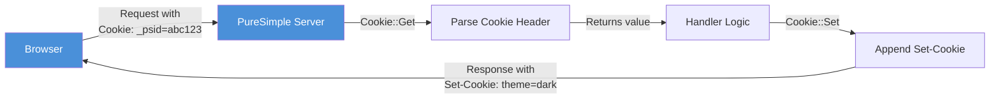
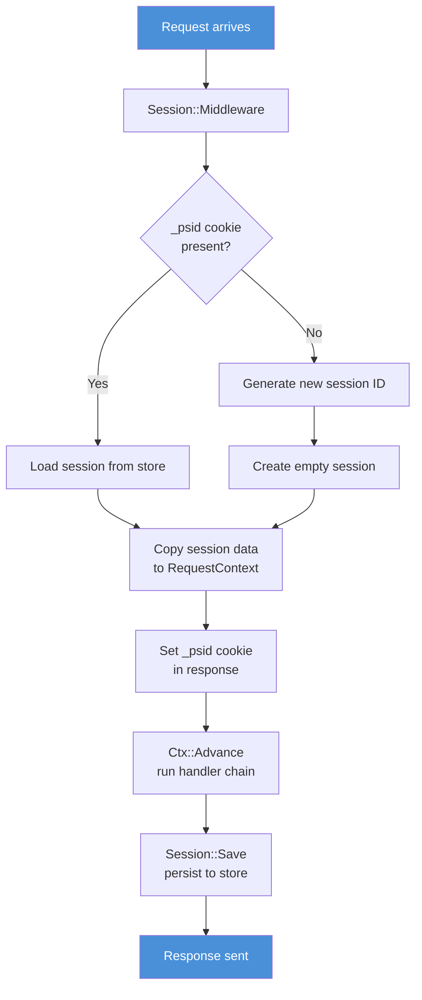

# Chapter 15: Cookies and Sessions

*Teaching a stateless protocol to remember who you are.*

---

**Learning Objectives**

After reading this chapter you will be able to:

- Read and write HTTP cookies using the `Cookie` module
- Manage session lifecycle with the `Session` middleware
- Store and retrieve session data with `Session::Get` and `Session::Set`
- Explain the trade-offs between in-memory and persistent session storage
- Reset session state between test suites with `Session::ClearStore`

---

## 15.1 The Memory Problem

HTTP has amnesia. Every request arrives with no memory of the request before it. The server processes it, sends a response, and forgets the conversation ever happened. This is by design -- statelessness makes HTTP simple, scalable, and cacheable. It also makes it completely useless for anything that requires remembering who a user is.

Think of it like a hotel reception desk where the staff changes every thirty seconds and no one writes anything down. You check in, get a room, walk to the elevator, come back to ask about breakfast, and the new person at the desk has no idea who you are. "May I see your room key?"

That room key is a cookie. The guest register behind the desk is the session store. Together, they give HTTP the illusion of memory.

---

## 15.2 Cookies: The Client-Side Half

A cookie is a small piece of data that the server sends to the browser. The browser stores it and sends it back with every subsequent request. The server reads the cookie, recognises the user, and picks up where it left off.

In PureSimple, cookies are managed by the `Cookie` module. It has exactly two procedures:

```purebasic
; From src/Middleware/Cookie.pbi
Cookie::Get(*C, Name.s)   ; → returns cookie value
Cookie::Set(*C, Name.s, Value.s, Path.s, MaxAge.i)
```

### Reading Cookies

`Cookie::Get` parses the incoming `Cookie` header and returns the value of the named cookie. If the cookie is not present, it returns an empty string.

```purebasic
; Listing 15.1 -- Reading a cookie value
Procedure PreferenceHandler(*C.RequestContext)
  Protected theme.s = Cookie::Get(*C, "theme")
  If theme = ""
    theme = "light"   ; ← default
  EndIf
  ; ... render page with theme preference ...
EndProcedure
```

> **Under the Hood:** The browser sends cookies in a single `Cookie` header as semicolon-delimited pairs: `name1=value1; name2=value2; name3=value3`. The `Cookie::Get` procedure splits this string using `StringField` with `";"` as the delimiter, trims whitespace from each pair, and extracts the value after the `=` sign. It is a linear scan -- O(n) where n is the number of cookies. For the typical web application with three to five cookies, this is instantaneous.

### Writing Cookies

`Cookie::Set` appends a `Set-Cookie` directive to the response. The browser receives it and stores the cookie for future requests.

```purebasic
; Listing 15.2 -- Setting a cookie with path and max-age
Procedure SetThemeHandler(*C.RequestContext)
  Protected theme.s = Binding::Query(*C, "theme")
  If theme = "dark" Or theme = "light"
    Cookie::Set(*C, "theme", theme, "/", 86400 * 30)
    ; 86400 * 30 = 30 days in seconds
  EndIf
  Rendering::Redirect(*C, "/", 302)
EndProcedure
```

The `Cookie::Set` parameters:

| Parameter | Type | Purpose |
|-----------|------|---------|
| `*C` | `*RequestContext` | The current request context |
| `Name` | `.s` | Cookie name |
| `Value` | `.s` | Cookie value |
| `Path` | `.s` | URL path scope (default `"/"` = entire site) |
| `MaxAge` | `.i` | Lifetime in seconds (0 = session cookie) |

A `MaxAge` of zero means the cookie expires when the browser closes. A positive value sets an explicit lifetime. There is no way to set a negative max-age -- if you want to delete a cookie, set its value to an empty string and its max-age to 1 (one second in the past, effectively).

Multiple cookies are accumulated in the `*C\SetCookies` field, separated by `Chr(10)`. PureSimpleHTTPServer splits this field and sends each cookie as a separate `Set-Cookie` header in the response.

> **Warning:** Cookies are sent in plain text with every request. Never store sensitive data directly in a cookie. Store a session ID instead, and keep the actual data on the server.


*Figure 15.2 -- Cookie read/write flow: the browser sends cookies with every request; the server reads them and optionally sets new ones in the response*

---

## 15.3 Sessions: The Server-Side Half

A cookie tells you *who* is making the request. A session tells you *what you know* about them. The session is a key-value store on the server, indexed by a unique session ID. The session ID is stored in a cookie. The user's browser sends the session ID cookie with every request. The server looks up the corresponding session data and makes it available to the handler.

PureSimple's session system uses three components working together:

1. **The `Cookie` module** -- reads and writes the session ID cookie (`_psid`)
2. **The `Session` module** -- manages the in-memory session store and provides `Get`/`Set`/`Save`
3. **The `Session::Middleware`** -- wraps the handler chain to load session data before the handler runs and save it after the handler returns


*Figure 15.1 -- Session lifecycle: the middleware loads or creates a session before the handler runs, then saves it after the handler returns*

### Enabling Sessions

Sessions require the session middleware. Register it before any handlers that need session access:

```purebasic
; Listing 15.3 -- Enabling session middleware
Engine::Use(@Session_Middleware())

Procedure Session_Middleware(*C.RequestContext)
  Session::Middleware(*C)
EndProcedure
```

The thin wrapper procedure exists because PureBasic's `@` operator requires a procedure in the current scope -- you cannot pass `@Session::Middleware()` directly across module boundaries.

Once the middleware is registered, every request gets a session. New visitors receive a fresh session ID. Returning visitors have their existing session loaded from the store.

### Reading and Writing Session Data

Inside any handler that runs after the session middleware, you can read and write session values:

```purebasic
; Listing 15.4 -- Using Session::Get and Session::Set
Procedure DashboardHandler(*C.RequestContext)
  Protected userId.s = Session::Get(*C, "user_id")
  If userId = ""
    Rendering::Redirect(*C, "/login", 302)
    ProcedureReturn
  EndIf

  Protected visits.s = Session::Get(*C, "visit_count")
  Protected count.i = Val(visits) + 1
  Session::Set(*C, "visit_count", Str(count))

  ; ... render dashboard ...
EndProcedure
```

`Session::Get` returns the value associated with a key, or an empty string if the key does not exist. `Session::Set` writes a key-value pair into the session. Values are strings -- if you need to store numbers, convert with `Str()` and `Val()`.

> **PureBasic Gotcha:** The session module uses a local variable named `sessData` to hold the raw session string. This is not an accident. `Data` is a reserved keyword in PureBasic (it declares inline data sections). If you name your variable `data`, the compiler will produce a cryptic error about unexpected tokens. The framework learned this the hard way so you do not have to.

### Session IDs

Session IDs are 32-character hexadecimal strings generated by concatenating four random 32-bit integers:

```purebasic
; From src/Middleware/Session.pbi -- _GenerateID
Procedure.s _GenerateID()
  Protected i.i, id.s = ""
  For i = 1 To 4
    id + RSet(Hex(Random($FFFFFFFF)), 8, "0")
  Next i
  ProcedureReturn id
EndProcedure
```

This produces 128 bits of randomness -- sufficient for session identification. The `RSet` call pads each hex segment to 8 characters with leading zeros, ensuring the final ID is always exactly 32 characters. The IDs look like `A3F0B12C00000042DEADBEEF01234567`.

You can retrieve the current session ID with `Session::ID(*C)`:

```purebasic
; Listing 15.5 -- Retrieving the current session ID
Procedure DebugHandler(*C.RequestContext)
  Protected sid.s = Session::ID(*C)
  PrintN("Session: " + sid)
EndProcedure
```

### How Session Storage Works

Sessions are stored in a global PureBasic map: `NewMap _Store.s()`. The map key is the session ID. The map value is a packed string containing all key-value pairs.

The packing format uses `Chr(9)` (tab) as the delimiter between keys (and between values), and `Chr(1)` (SOH) as the separator between the keys string and the values string:

```
key1<TAB>key2<TAB>key3<TAB><SOH>val1<TAB>val2<TAB>val3<TAB>
```

When the middleware loads a session, it splits the stored string at `Chr(1)` and copies the keys and values into `*C\SessionKeys` and `*C\SessionVals`. When a handler calls `Session::Set`, the key and value are appended (with a trailing tab). When the middleware saves the session after the handler chain returns, it concatenates the keys and values back into a single string with `Chr(1)` between them.

The `Get` procedure uses a "last match wins" strategy: it scans all keys and returns the value from the last matching key. This means multiple `Set` calls for the same key within a single request work correctly -- the latest value shadows the earlier ones.

> **Under the Hood:** The tab-delimited parallel-list approach is unconventional. Most session implementations use a map or dictionary. PureSimple uses parallel strings because the `RequestContext` struct is a fixed-size structure -- it cannot contain dynamically-sized maps. The performance is adequate for sessions with fewer than fifty keys. If your sessions grow beyond that, you are probably storing too much in them.

### Auto-Save

You do not need to call `Session::Save` manually. The session middleware calls it automatically after the handler chain returns:

```purebasic
; From src/Middleware/Session.pbi -- Middleware
Procedure Middleware(*C.RequestContext)
  ; ... load/create session ...
  Ctx::Advance(*C)        ; ← run the handler chain
  Save(*C)                ; ← auto-save after chain returns
EndProcedure
```

This is the onion model in action. The middleware wraps the handler chain. Everything before `Ctx::Advance` is pre-processing (load session). Everything after `Ctx::Advance` is post-processing (save session). The handler in the middle reads and writes session data without worrying about persistence.

---

## 15.4 Session Storage Trade-Offs

The current implementation stores sessions in memory. This has important implications:

| Aspect | In-Memory (current) | Persistent (SQLite-backed) |
|--------|---------------------|---------------------------|
| Speed | Sub-microsecond | Milliseconds per read/write |
| Durability | Lost on restart | Survives restart |
| Scalability | Limited by RAM | Limited by disk |
| Complexity | Zero | Requires migration + cleanup |

For development and small deployments, in-memory sessions are perfect. Your application starts, users log in, and sessions work. If the application restarts, all users have to log in again. For a blog with one admin user, this is a minor inconvenience.

For production deployments with many users, you would extend the session store to persist sessions to SQLite. The `Session::Save` procedure would write to a database table instead of (or in addition to) the global map. The `Session::Middleware` load step would read from the database. The API for handlers would not change at all -- `Session::Get` and `Session::Set` would still work exactly the same way.

> **Warning:** In-memory sessions are lost when the process restarts. For development this is fine. For production, consider that every deployment via `deploy.sh` restarts the process and logs out all users. If your application has persistent user sessions as a requirement, extend the session store to use SQLite.

---

## 15.5 Clearing Sessions for Tests

Between test suites, call `Session::ClearStore()` to wipe all sessions:

```purebasic
; Listing 15.6 -- Clearing session state between tests
BeginSuite("Session Tests")

; ... run session tests ...

Session::ClearStore()

BeginSuite("Auth Tests")
; ... sessions from previous suite won't leak ...
```

This is the test isolation pattern from Chapter 14 applied to sessions. Without it, a session ID created in one test suite could persist and interfere with assertions in another.

---

## Summary

HTTP is stateless, but cookies and sessions give it memory. The `Cookie` module reads incoming cookies from the `Cookie` header and writes outgoing cookies via `Set-Cookie` directives. The `Session` module builds on cookies to provide a server-side key-value store indexed by a random session ID. The session middleware handles the complete lifecycle automatically: it loads or creates a session before the handler runs, and saves it after the handler returns. Session data is stored in memory, which is fast but not durable across restarts.

---

**Key Takeaways**

- Cookies carry the session ID; sessions carry the data. Never store sensitive information directly in cookies.
- The session middleware handles load and save automatically -- handlers just call `Session::Get` and `Session::Set`.
- In-memory sessions are fast and simple but are lost on process restart. Plan accordingly for production deployments.

---

**Review Questions**

1. What is the purpose of the `_psid` cookie, and what happens when a new visitor arrives without one?

2. Explain the "last match wins" strategy used by `Session::Get`. Why does this approach work correctly even when `Session::Set` is called multiple times with the same key?

3. *Try it:* Register the session middleware, write a handler that increments a `visit_count` session variable on each request, and verify the count increases across multiple requests using `curl` with a cookie jar (`curl -b cookies.txt -c cookies.txt`).
