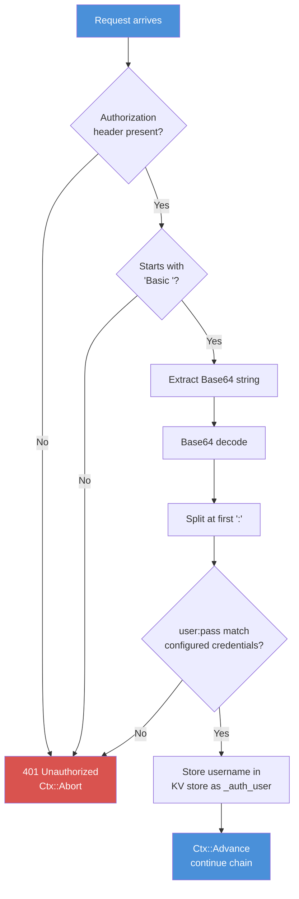

# Chapter 16: Authentication

*Making sure the person at the door is who they say they are.*

---

**Learning Objectives**

After reading this chapter you will be able to:

- Implement HTTP Basic Authentication using the `BasicAuth` module
- Explain how Base64 credential encoding works (and why it is not encryption)
- Hash passwords with PureBasic's `Fingerprint` and SHA-256
- Build a session-based login and logout flow
- Scope authentication to specific route groups

---

## 16.1 Authentication vs Authorisation

Before we write any code, let us clarify two terms that developers routinely confuse, sometimes with expensive consequences.

**Authentication** answers the question: "Who are you?" It verifies identity. A username and password. A fingerprint. A badge at the front desk.

**Authorisation** answers the question: "What are you allowed to do?" It controls access. An admin can delete posts. A regular user can only read them. A guest can see the public pages.

This chapter covers authentication. Authorisation is handled by route groups with scoped middleware (Chapter 10) and by checking session values inside handlers. Get authentication right first. If you do not know *who* someone is, you certainly cannot decide what they are allowed to do.

---

## 16.2 HTTP Basic Authentication

Basic Auth is the simplest authentication mechanism in HTTP. The browser sends a username and password encoded in the `Authorization` header. The server decodes them and checks against known credentials. If they match, the request proceeds. If not, the server responds with `401 Unauthorized`.

It is simple, stateless, and widely supported. It is also completely insecure without TLS, because the credentials are merely Base64-encoded -- not encrypted. Base64 is encoding, not encryption. Anyone watching the network traffic can decode the credentials in about three seconds. With TLS (which Caddy provides automatically), Basic Auth is perfectly acceptable for admin panels and internal tools.

I have heard developers say "we don't need HTTPS for an internal tool." Those developers have not met their curious colleagues with Wireshark.

### How It Works


*Figure 16.1 -- BasicAuth decode pipeline: the middleware validates credentials in five steps before allowing the request to proceed*

### Setting Up Basic Auth

The `BasicAuth` module has two procedures: `SetCredentials` to configure the expected username and password, and `Middleware` to enforce them.

```purebasic
; Listing 16.1 -- Configuring and using BasicAuth
EnableExplicit

XIncludeFile "../../src/PureSimple.pb"

BasicAuth::SetCredentials("admin", "s3cret-passw0rd")

; Protect the admin group
Procedure AdminAuthMW(*C.RequestContext)
  BasicAuth::Middleware(*C)
EndProcedure

; ... in route setup:
; adminGroup = Group::Init("/admin")
; Group::Use(adminGroup, @AdminAuthMW())
```

When a request hits a route protected by the BasicAuth middleware, the middleware reads the `Authorization` header from `*C\Authorization`. If the header is missing or does not start with `"Basic "`, the middleware calls `Ctx::AbortWithError(*C, 401, "Unauthorized")` and returns. The handler never runs.

If the header is present, the middleware extracts the Base64-encoded portion, decodes it, splits the result at the first colon to get the username and password, and compares them against the configured credentials:

```purebasic
; From src/Middleware/BasicAuth.pbi -- credential validation
Protected encoded.s  = Mid(auth, 7)
Protected bufSize.i  = Len(encoded) + 4
Protected *buf       = AllocateMemory(bufSize)

Protected decodedLen.i  = Base64Decoder(encoded,
                                         *buf, bufSize)
Protected credentials.s = PeekS(*buf, decodedLen,
                                 #PB_Ascii)
FreeMemory(*buf)

Protected colon.i = FindString(credentials, ":")
Protected user.s = Left(credentials, colon - 1)
Protected pass.s = Mid(credentials, colon + 1)

If user <> _User Or pass <> _Pass
  Ctx::AbortWithError(*C, 401, "Unauthorized")
  ProcedureReturn
EndIf
```

The decoding uses PureBasic's `Base64Decoder`, which writes raw bytes into a buffer. `PeekS` converts those bytes into a PureBasic string using ASCII encoding. This matters -- HTTP Basic Auth credentials are ASCII by convention. Unicode usernames in Basic Auth are... let us say "implementation-defined" across browsers and best avoided.

> **Under the Hood:** The middleware allocates `Len(encoded) + 4` bytes for the decode buffer. The `+ 4` provides a safety margin because Base64 decoding produces at most `ceil(len * 3 / 4)` bytes. For typical credentials (under 100 characters), this allocation and deallocation takes nanoseconds. The buffer is freed immediately after use with `FreeMemory(*buf)` -- no leaks.

### Accessing the Authenticated User

When authentication succeeds, the middleware stores the username in the context's KV store under the key `"_auth_user"`:

```purebasic
; From src/Middleware/BasicAuth.pbi
Ctx::Set(*C, "_auth_user", user)
Ctx::Advance(*C)
```

Downstream handlers can retrieve it:

```purebasic
; Listing 16.2 -- Reading the authenticated username
Procedure AdminDashboard(*C.RequestContext)
  Protected username.s = Ctx::Get(*C, "_auth_user")
  PrintN("Admin: " + username)
  ; ... render admin dashboard ...
EndProcedure
```

This is the standard middleware-to-handler communication pattern: the middleware validates, stores context, and advances. The handler reads context and acts.

---

## 16.3 Password Hashing

The `BasicAuth` module stores credentials in memory as plaintext strings. This is acceptable for simple admin panels where the password is set in code and the application runs in a trusted environment. For user-facing authentication with passwords stored in a database, you must hash them.

Storing passwords in plaintext is not a "minor risk." It is professional negligence. When (not if) your database leaks, every user's password is exposed. Since most people reuse passwords, you have compromised not just your application but their email, their banking, and their everything else.

PureBasic provides `Fingerprint` for hashing. Combined with SHA-256, it produces a one-way hash that you can store safely:

```purebasic
; Listing 16.3 -- Hashing a password with SHA-256
EnableExplicit

UseSHA2Fingerprint()

Procedure.s HashPassword(password.s)
  ProcedureReturn Fingerprint(@password,
    StringByteLength(password), #PB_Cipher_SHA2,
    256)
EndProcedure

; Creating a user with a hashed password
Define hash.s = HashPassword("my-secret-password")
; hash = "5E884898DA280471..."
; Store `hash` in the database, never the plaintext
```

To verify a login, hash the submitted password and compare it to the stored hash:

```purebasic
; Listing 16.4 -- Verifying a password against a stored hash
Procedure.i VerifyPassword(submitted.s,
                           storedHash.s)
  Protected hash.s = HashPassword(submitted)
  ProcedureReturn Bool(hash = storedHash)
EndProcedure
```

> **Warning:** SHA-256 is a fast hash. For production password storage, a slow hash like bcrypt or Argon2 is better because it resists brute-force attacks. PureBasic does not include bcrypt natively, but SHA-256 with a per-user salt is a significant improvement over plaintext.

To add a salt (a random string prepended to the password before hashing), generate a random string when the user registers, store it alongside the hash, and prepend it before hashing:

```purebasic
; Listing 16.5 -- Salted password hashing
Procedure.s GenerateSalt()
  Protected i.i, salt.s = ""
  For i = 1 To 4
    salt + RSet(Hex(Random($FFFFFFFF)), 8, "0")
  Next i
  ProcedureReturn salt
EndProcedure

Procedure.s HashWithSalt(password.s, salt.s)
  Protected combined.s = salt + password
  ProcedureReturn Fingerprint(@combined,
    StringByteLength(combined), #PB_Cipher_SHA2,
    256)
EndProcedure
```

Store both the salt and the hash in the database. When verifying, retrieve the salt, prepend it to the submitted password, hash the result, and compare. The salt ensures that two users with the same password produce different hashes.

---

## 16.4 Session-Based Login Flow

Basic Auth prompts the browser to show a native login dialog. This works for admin panels, but for a public-facing application you want a proper login page with a form. Session-based authentication combines HTML forms, password verification, and sessions.

The flow works like this:

1. User visits `/login` -- handler renders a login form
2. User submits username and password via POST
3. Handler verifies credentials (hash the submitted password, compare to the stored hash)
4. If valid: store the user ID in the session, redirect to the dashboard
5. If invalid: re-render the login form with an error message
6. On subsequent requests: the session middleware loads the session; the handler checks for `user_id` in the session
7. To log out: clear the session data and redirect to the login page

```purebasic
; Listing 16.6 -- Login handler with session authentication
Procedure LoginPageHandler(*C.RequestContext)
  ; Render the login form (GET /login)
  Rendering::Render(*C, "login.html", 200)
EndProcedure

Procedure LoginSubmitHandler(*C.RequestContext)
  ; Process the login form (POST /login)
  Protected username.s = Binding::PostForm(*C,
                                            "username")
  Protected password.s = Binding::PostForm(*C,
                                            "password")

  ; Look up user in database
  Protected storedHash.s = ""
  Protected userId.s = ""
  DB::BindStr(db, 0, username)
  If DB::Query(db, "SELECT id, password_hash " +
                    "FROM users WHERE username = ?")
    If DB::NextRow(db)
      userId     = Str(DB::GetInt(db, 0))
      storedHash = DB::GetStr(db, 1)
    EndIf
    DB::Done(db)
  EndIf

  ; Verify password
  If userId <> "" And VerifyPassword(password,
                                      storedHash)
    Session::Set(*C, "user_id", userId)
    Session::Set(*C, "username", username)
    Rendering::Redirect(*C, "/dashboard", 302)
  Else
    Ctx::Set(*C, "error", "Invalid credentials")
    Rendering::Render(*C, "login.html", 401)
  EndIf
EndProcedure

Procedure LogoutHandler(*C.RequestContext)
  ; Clear session data (POST /logout)
  Session::Set(*C, "user_id", "")
  Session::Set(*C, "username", "")
  Rendering::Redirect(*C, "/login", 302)
EndProcedure
```

The session middleware (from Chapter 15) handles loading and saving the session automatically. The login handler just writes to the session. The dashboard handler checks the session:

```purebasic
; Listing 16.7 -- Checking authentication in a handler
Procedure DashboardHandler(*C.RequestContext)
  Protected userId.s = Session::Get(*C, "user_id")
  If userId = ""
    Rendering::Redirect(*C, "/login", 302)
    ProcedureReturn
  EndIf

  ; User is authenticated -- render dashboard
  Protected username.s = Session::Get(*C, "username")
  Ctx::Set(*C, "username", username)
  Rendering::Render(*C, "dashboard.html", 200)
EndProcedure
```

> **Compare:** This flow is identical to how authentication works in Express.js with Passport, Flask with Flask-Login, or Go with Gorilla Sessions. The session stores the user ID. Every request checks the session. The login handler writes to the session. The logout handler clears it. The pattern is universal because the problem is universal.

---

## 16.5 Scoped Authentication with Route Groups

Not every route needs authentication. Public pages, the login page itself, and health check endpoints should be accessible without credentials. PureSimple's route groups let you scope authentication middleware to specific URL prefixes.

```purebasic
; Listing 16.8 -- Scoping BasicAuth to the admin group
; Public routes -- no auth required
Engine::GET("/", @IndexHandler())
Engine::GET("/post/:slug", @PostHandler())
Engine::GET("/health", @HealthHandler())

; Admin routes -- BasicAuth required
BasicAuth::SetCredentials("admin", "s3cret")

Procedure AdminAuthMW(*C.RequestContext)
  BasicAuth::Middleware(*C)
EndProcedure

Define admin.i = Group::Init("/admin")
Group::Use(admin, @AdminAuthMW())
Group::GET(admin, "/", @AdminDashboard())
Group::GET(admin, "/posts", @AdminPostList())
Group::POST(admin, "/posts", @AdminPostCreate())
```

The `AdminAuthMW` wrapper runs only for routes under `/admin`. A request to `/` or `/post/hello` passes through without any authentication challenge. A request to `/admin/posts` triggers the Basic Auth prompt.

For session-based auth, you can write a similar middleware that checks for a session value:

```purebasic
; Listing 16.9 -- Session-based auth middleware
Procedure RequireLoginMW(*C.RequestContext)
  Protected userId.s = Session::Get(*C, "user_id")
  If userId = ""
    Rendering::Redirect(*C, "/login", 302)
    Ctx::Abort(*C)
    ProcedureReturn
  EndIf
  Ctx::Advance(*C)
EndProcedure
```

Register this middleware on any group that requires login. Unauthenticated users are redirected to the login page. Authenticated users proceed to the handler. The middleware does not know or care *which* handler runs -- it only checks that a valid session exists.

This is the beauty of the middleware pattern. Authentication is a cross-cutting concern. You define it once and apply it to a group. Every route in that group is protected. No handler needs to duplicate the check.

---

## Summary

Authentication verifies identity. The `BasicAuth` module provides HTTP Basic Authentication by decoding Base64 credentials from the `Authorization` header and comparing them against configured values. For user-facing applications, session-based authentication stores the user ID in the session after a successful login form submission. Passwords must be hashed before storage -- PureBasic's `Fingerprint` with SHA-256 provides a solid foundation, especially when combined with per-user salts. Route groups let you scope authentication to specific URL prefixes, keeping public routes accessible and admin routes protected.

---

**Key Takeaways**

- Basic Auth is simple and effective for admin panels but requires TLS to be secure -- Base64 is encoding, not encryption.
- Never store plaintext passwords. Use `Fingerprint` with SHA-256 (and a per-user salt) for hashing.
- Session-based login is the standard pattern for user-facing web applications: write `user_id` to the session on login, check it on every subsequent request, clear it on logout.

---

**Review Questions**

1. Explain the difference between Base64 encoding and encryption. Why does HTTP Basic Auth require TLS to be secure?

2. What key does the `BasicAuth` middleware store in the context KV store after successful authentication, and how can downstream handlers access it?

3. *Try it:* Write a login and logout flow using session-based authentication. Create a users table, hash a password with SHA-256, and verify login credentials against the database.
