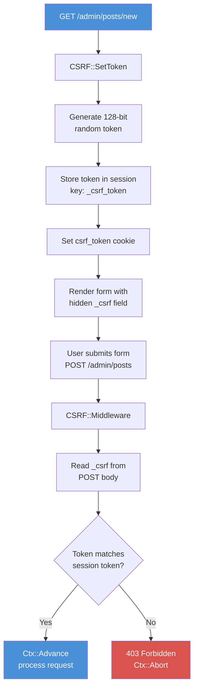

# Chapter 17: CSRF Protection

*The invisible attack you only discover after it's too late.*

---

**Learning Objectives**

After reading this chapter you will be able to:

- Explain what a CSRF attack is and why form-based web applications are vulnerable
- Generate cryptographically random tokens with `CSRF::GenerateToken`
- Embed CSRF tokens in HTML forms and validate them on submission
- Configure the CSRF middleware to protect POST, PUT, PATCH, and DELETE routes
- Identify when CSRF protection is unnecessary (JSON APIs with Authorization headers)

---

## 17.1 The Attack You Cannot See

Imagine you are logged into your bank. In another browser tab, you visit a funny cat website. The cat website has a hidden form that submits a POST request to your bank's transfer endpoint. Your browser helpfully attaches your bank's session cookie to the request. The bank sees a valid session, processes the transfer, and you are now the proud owner of fewer dollars.

This is Cross-Site Request Forgery. The attacker does not steal your credentials. They do not break into the server. They trick your browser into making a request on their behalf, using your existing authenticated session. The server cannot tell the difference between a legitimate form submission from your bank's website and a forged one from a malicious page.

CSRF attacks have been used to transfer money, change email addresses, grant admin privileges, and delete accounts. They are silent, effective, and entirely preventable. The prevention mechanism is embarrassingly simple: a random token that the attacker cannot guess.

---

## 17.2 How CSRF Tokens Work

The defence has three steps:

1. When the server renders a form, it generates a random token and embeds it as a hidden field
2. When the user submits the form, the token is sent along with the form data
3. The server validates that the submitted token matches the one it generated

The attacker's malicious form cannot include the correct token because the attacker does not have access to it. The token is generated per-session, stored on the server, and embedded in a page that only the legitimate site can render. The attacker can forge the form, but they cannot forge the token.


*Figure 17.1 -- CSRF token flow: the token is generated on the GET request, embedded in the form, submitted with the POST, and validated by the middleware*

---

## 17.3 Generating Tokens

The `CSRF` module generates tokens using the same approach as session IDs: four random 32-bit integers concatenated into a 32-character hexadecimal string.

```purebasic
; From src/Middleware/CSRF.pbi -- GenerateToken
Procedure.s GenerateToken()
  Protected i.i, token.s = ""
  For i = 1 To 4
    token + RSet(Hex(Random($FFFFFFFF)), 8, "0")
  Next i
  ProcedureReturn token
EndProcedure
```

This produces 128 bits of randomness. An attacker would need to guess one value out of 2^128 possibilities -- roughly 3.4 x 10^38. To put that in perspective, if an attacker could try a billion guesses per second, it would take approximately 10^22 years to try them all. The universe is about 1.4 x 10^10 years old. They will not be guessing your tokens.

> **Under the Hood:** PureBasic's `Random()` uses the system's pseudo-random number generator. While this is not a cryptographic PRNG (like `/dev/urandom`), the 128-bit token space is large enough that prediction attacks are impractical for web application CSRF tokens. For cryptographic key generation, you would want a dedicated CSPRNG, but for CSRF tokens, this level of randomness is more than sufficient.

---

## 17.4 Setting Tokens in Forms

When rendering a page that contains a form, call `CSRF::SetToken` in the handler. This generates a new token, stores it in the session, and sets a cookie so client-side JavaScript can also access it if needed.

```purebasic
; Listing 17.1 -- Setting CSRF token before rendering a form
Procedure NewPostHandler(*C.RequestContext)
  CSRF::SetToken(*C)

  ; Make the token available to the template
  Protected token.s = Session::Get(*C, "_csrf_token")
  Ctx::Set(*C, "csrf_token", token)

  Rendering::Render(*C, "admin/new_post.html", 200)
EndProcedure
```

The `CSRF::SetToken` procedure does three things internally:

```purebasic
; From src/Middleware/CSRF.pbi -- SetToken
Procedure SetToken(*C.RequestContext)
  Protected token.s = GenerateToken()
  Session::Set(*C, #_SESSION_KEY, token)  ; ← store in session
  Cookie::Set(*C, "csrf_token", token)    ; ← set as cookie
EndProcedure
```

The token is stored in the session under the key `"_csrf_token"` and also set as the `csrf_token` cookie. The session storage is what the middleware uses for validation. The cookie is a convenience for JavaScript-heavy applications that need to read the token client-side.

In your HTML template, embed the token as a hidden form field:

```html
<!-- Listing 17.2 -- HTML form with CSRF hidden field -->
<form method="POST" action="/admin/posts">
  <input type="hidden" name="_csrf"
         value="{{ csrf_token }}">

  <label for="title">Title</label>
  <input type="text" name="title" id="title"
         required>

  <label for="body">Body</label>
  <textarea name="body" id="body" required></textarea>

  <button type="submit">Create Post</button>
</form>
```

The hidden field `_csrf` carries the token. When the form is submitted, the token travels with the POST body alongside the other form fields. The CSRF middleware reads it from the POST data and validates it.

> **Tip:** The field name `_csrf` is defined by the `#_FORM_FIELD` constant in the CSRF module. If you need to change it (for example, to match a front-end framework's convention), modify the constant. But `_csrf` is a widely-used convention and there is rarely a reason to change it.

---

## 17.5 The CSRF Middleware

The middleware is where validation happens. It runs before your handler and makes a simple decision: is this a safe request (GET/HEAD), or is it a state-changing request (POST/PUT/PATCH/DELETE)?

Safe requests pass through without validation. There is nothing to forge in a GET request -- it should not change any state. State-changing requests must include a valid CSRF token.

```purebasic
; From src/Middleware/CSRF.pbi -- Middleware
Procedure Middleware(*C.RequestContext)
  Protected method.s = *C\Method

  If method = "GET" Or method = "HEAD"
    Ctx::Advance(*C)
    ProcedureReturn
  EndIf

  ; Read CSRF token from form body
  Protected token.s = Binding::PostForm(*C,
                                         #_FORM_FIELD)

  If Not ValidateToken(*C, token)
    Ctx::AbortWithError(*C, 403,
                         "CSRF token invalid or missing")
    ProcedureReturn
  EndIf

  Ctx::Advance(*C)
EndProcedure
```

The `ValidateToken` procedure compares the submitted token against the session-stored token:

```purebasic
; From src/Middleware/CSRF.pbi -- ValidateToken
Procedure.i ValidateToken(*C.RequestContext, Token.s)
  Protected expected.s = Session::Get(*C,
                                       #_SESSION_KEY)
  ProcedureReturn Bool(expected <> "" And
                        expected = Token)
EndProcedure
```

Two conditions must be true: the session must contain a token (it is not empty), and the submitted token must match it exactly. If either condition fails, the middleware returns `#False`, and the request gets a 403 Forbidden response.

### Registering the Middleware

The CSRF middleware must run *after* the session middleware (because it reads from the session) and *before* your handlers:

```purebasic
; Listing 17.3 -- Registering CSRF middleware in the
; correct order
Procedure Session_MW(*C.RequestContext)
  Session::Middleware(*C)
EndProcedure

Procedure CSRF_MW(*C.RequestContext)
  CSRF::Middleware(*C)
EndProcedure

; Order matters: Session first, then CSRF
Engine::Use(@Session_MW())
Engine::Use(@CSRF_MW())
```

If you register CSRF before Session, the CSRF middleware will try to read from a session that has not been loaded yet. It will find no token, reject every POST request with 403, and you will spend an entertaining afternoon wondering why your forms do not work.

> **Warning:** Middleware order matters. Session must run before CSRF. If CSRF cannot read the session, it cannot validate tokens, and every state-changing request will be rejected with 403 Forbidden.

---

## 17.6 The Complete Flow in Practice

Let us trace a complete CSRF-protected form submission from start to finish. This is the pattern you will use for every form in your application: contact forms, login forms, admin post creation, settings pages -- any page where the user submits data.

**Step 1: User requests the form (GET)**

```
GET /admin/posts/new HTTP/1.1
Cookie: _psid=A3F0B12C00000042DEADBEEF01234567
```

The session middleware loads the session. The CSRF middleware sees a GET request and passes through. The handler calls `CSRF::SetToken`, which generates `"8F3A...C721"`, stores it in the session, and sets the `csrf_token` cookie. The template renders the form with the token in a hidden field.

**Step 2: User submits the form (POST)**

```
POST /admin/posts HTTP/1.1
Cookie: _psid=A3F0B12C00000042DEADBEEF01234567
Content-Type: application/x-www-form-urlencoded

_csrf=8F3A...C721&title=My+Post&body=Hello+world
```

The session middleware loads the session (which contains `_csrf_token = "8F3A...C721"`). The CSRF middleware sees a POST request, reads `_csrf` from the form body, calls `ValidateToken`, finds that `"8F3A...C721" = "8F3A...C721"`, and calls `Ctx::Advance`. The handler creates the post.

**Step 3: Attacker tries to forge a request**

```
POST /admin/posts HTTP/1.1
Cookie: _psid=A3F0B12C00000042DEADBEEF01234567
Content-Type: application/x-www-form-urlencoded

_csrf=WRONG_TOKEN&title=Hacked&body=PWNED
```

The CSRF middleware reads `_csrf = "WRONG_TOKEN"` from the form body, compares it to the session token `"8F3A...C721"`, finds a mismatch, and calls `Ctx::AbortWithError(*C, 403, "CSRF token invalid or missing")`. The handler never runs. The attacker's forged request is rejected.

The key insight is that the attacker can send a POST request with the user's session cookie (because browsers attach cookies automatically), but they cannot include the correct CSRF token because they do not have access to the form page where it was embedded.

---

## 17.7 When CSRF Protection Is Not Needed

CSRF protection is essential for browser-based form submissions. It is unnecessary -- and sometimes counterproductive -- for JSON APIs that use token-based authentication.

If your API requires an `Authorization: Bearer <token>` header, CSRF is not a concern. The browser does not automatically attach `Authorization` headers the way it attaches cookies. An attacker's hidden form cannot set custom headers. The `Authorization` header must be explicitly set by JavaScript running on the legitimate origin.

```purebasic
; Listing 17.4 -- JSON API routes without CSRF
; These routes use Bearer token auth, not cookies
; No CSRF middleware needed
Engine::GET("/api/v1/posts", @APIListPosts())
Engine::POST("/api/v1/posts", @APICreatePost())
Engine::PUT("/api/v1/posts/:id", @APIUpdatePost())
Engine::DELETE("/api/v1/posts/:id", @APIDeletePost())
```

> **Tip:** If your application has both browser-rendered forms (needing CSRF) and a JSON API (using Bearer tokens), register the CSRF middleware only on the form-serving route groups. Do not apply it globally.

The rule is simple: if authentication travels in a cookie, you need CSRF protection. If authentication travels in a header that the browser does not automatically attach, you do not.

CORS (Cross-Origin Resource Sharing) provides an additional layer of defence for APIs by restricting which origins can make requests. But CORS is not a replacement for CSRF tokens on cookie-authenticated routes. They solve different problems. Belt and suspenders.

---

## 17.8 Common Mistakes

Three mistakes appear regularly when developers implement CSRF protection. Each one opens a security hole while creating the illusion of safety.

**Mistake 1: Generating the token but not embedding it in the form.**

You call `CSRF::SetToken` in the handler but forget to pass the token to the template or omit the hidden field. Every POST submission fails with 403. You curse the middleware, disable it, and move on. Now you have no CSRF protection. The fix: always include `<input type="hidden" name="_csrf" value="{{ csrf_token }}">` in every form.

**Mistake 2: Registering CSRF middleware before Session middleware.**

The CSRF middleware reads from the session. If the session has not been loaded, it reads nothing. It finds no stored token. It rejects everything. You curse the middleware again. The fix: register Session first, then CSRF.

**Mistake 3: Using the same token forever.**

The current implementation generates a new token on every `CSRF::SetToken` call. Some developers cache the token and reuse it across requests for "performance." This weakens the protection. If a token leaks (through a log, a Referer header, or a cached page), it remains valid indefinitely. Fresh tokens limit the window of vulnerability.

---

## Summary

CSRF attacks exploit the browser's automatic cookie attachment to forge requests on behalf of authenticated users. The defence is a random token embedded in forms and validated on submission. The CSRF module generates 128-bit random tokens, stores them in the session, and validates them through middleware. GET and HEAD requests pass through without validation; POST, PUT, PATCH, and DELETE requests must include a matching token. JSON APIs using Bearer token authentication do not need CSRF protection because browsers do not automatically attach Authorization headers.

---

**Key Takeaways**

- CSRF attacks work because browsers automatically send cookies with every request, including requests initiated by malicious sites.
- The CSRF middleware must run after the Session middleware -- it reads the expected token from the session.
- JSON APIs with `Authorization` headers are immune to CSRF and do not need token protection -- only cookie-authenticated form submissions require it.

---

**Review Questions**

1. Why can an attacker forge a POST request with the user's session cookie but not with the correct CSRF token? What prevents the attacker from obtaining the token?

2. What HTTP status code does the CSRF middleware return when validation fails, and why is that code appropriate?

3. *Try it:* Add CSRF protection to a form-based application. Create a form with a hidden `_csrf` field, register the Session and CSRF middleware in the correct order, and verify that submitting the form without the token produces a 403 error.
