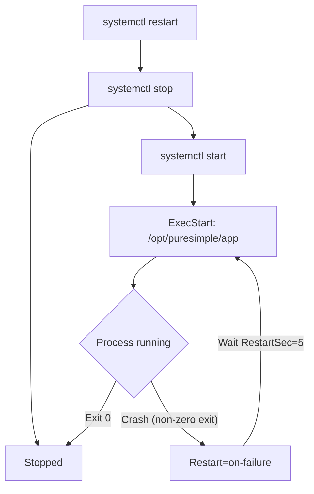
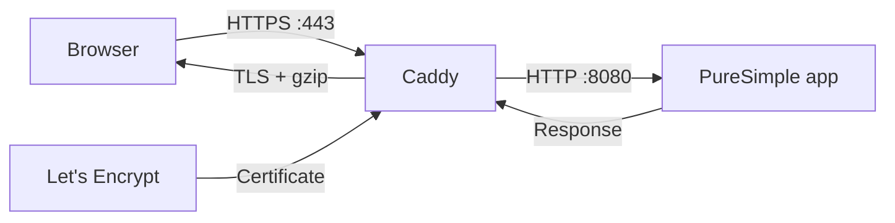
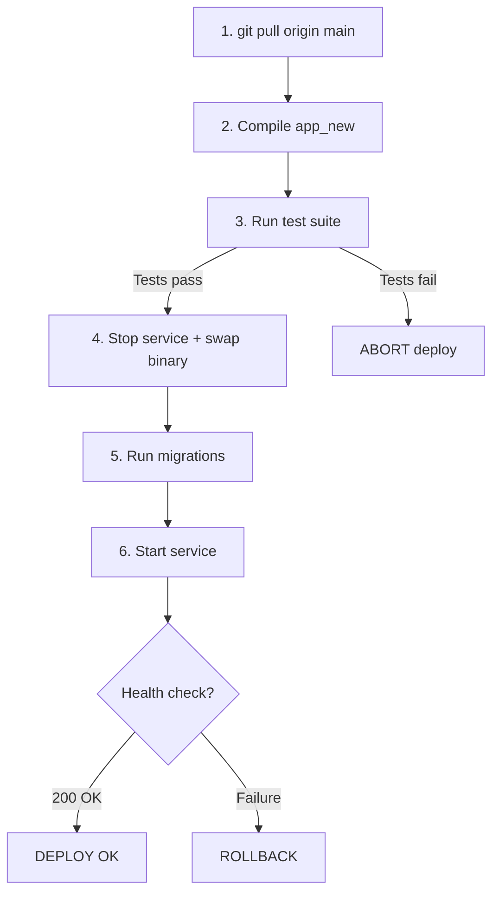

# Chapter 19: Deployment

*Getting your binary from your laptop to a server, without crossing your fingers.*

---

**After reading this chapter you will be able to:**

- Compile a production-optimised PureSimple binary with the `-z` flag
- Configure a systemd service to run your application as a managed daemon
- Set up Caddy as a reverse proxy with automatic TLS
- Deploy with confidence using the `deploy.sh` pipeline (pull, compile, test, swap, health check)
- Roll back a failed deployment in under ten seconds

---

## 19.1 The Single-Binary Advantage (Revisited)

We talked about the single-binary advantage in Chapter 1. Now it is time to cash that cheque. Deploying a PureSimple application means copying one file to a server and running it. There is no `npm install`. There is no `pip install -r requirements.txt`. There is no container image to pull from a registry, no runtime to install, no dependency graph to resolve. One file. `chmod +x`. Done.

This is not a theoretical benefit. The deploy script for PureSimple's production blog is 78 lines of bash. The rollback script is 51 lines. Compare that to a typical Kubernetes deployment manifest, a Dockerfile, a CI/CD pipeline YAML, and the three hours you spent debugging why the staging container has a different version of `libssl` than production. We will take the 78 lines.

But simplicity does not mean sloppiness. A production deployment still needs a process manager, a reverse proxy, TLS termination, health checks, and a rollback plan. PureSimple uses systemd for process management, Caddy for reverse proxying and TLS, and a pair of shell scripts for the deployment pipeline. Let us walk through each piece.

## 19.2 Compiling for Production

Development builds prioritise fast compilation. Production builds prioritise fast execution. The difference is the `-z` flag, which enables the PureBasic C backend's optimiser.

```bash
# Listing 19.1 -- Development build vs production build
# Development: fast compile, no optimisation
$PUREBASIC_HOME/compilers/pbcompiler src/main.pb -o app

# Production: slower compile, optimised binary
$PUREBASIC_HOME/compilers/pbcompiler src/main.pb -z -o app
```

The `-z` flag tells the C backend to apply optimisations during code generation. The resulting binary is the same size (or slightly smaller) but runs faster, particularly in tight loops and string-heavy operations. Compilation takes longer -- sometimes two to three times longer -- but you compile once and run for weeks. That is a good trade.

> **Tip:** Always compile with `-cl` for console mode when building servers. A PureBasic binary compiled without `-cl` produces a GUI application on Linux, which will fail silently when launched by systemd because there is no display server. The deploy script handles this automatically, but if you are compiling manually, remember the flag.

## 19.3 The systemd Service File

systemd is the process manager on virtually every modern Linux distribution. It starts your application, restarts it if it crashes, captures its stdout/stderr into the journal, and stops it cleanly on shutdown. The PureSimple service file is fifteen lines:

```ini
; Listing 19.2 -- From deploy/puresimple.service
[Unit]
Description=PureSimple Web Framework
After=network.target

[Service]
ExecStart=/opt/puresimple/app
Restart=on-failure
RestartSec=5
WorkingDirectory=/opt/puresimple
User=www-data
Environment=PURESIMPLE_MODE=release

[Install]
WantedBy=multi-user.target
```

Each section serves a specific purpose:

**[Unit]** describes the service. `After=network.target` tells systemd to wait for the network stack before starting the application. Your web server is not very useful without a network.

**[Service]** defines how to run the process. `ExecStart` points to the binary. `WorkingDirectory` sets the current directory, which matters because PureSimple looks for `.env` files and template directories relative to the working directory. `User=www-data` runs the process as a non-root user -- never run a web server as root unless you enjoy reading post-mortems about your own infrastructure. `Restart=on-failure` tells systemd to restart the process if it exits with a non-zero code, with a 5-second delay between attempts. `Environment=PURESIMPLE_MODE=release` sets the run mode.

**[Install]** tells systemd when to start the service. `WantedBy=multi-user.target` means "start this when the system reaches normal multi-user mode" -- which is every normal boot.

The service file is installed by the setup script:

```bash
# Listing 19.3 -- Installing the systemd unit
cp deploy/puresimple.service /etc/systemd/system/
systemctl daemon-reload
systemctl enable puresimple
```

`daemon-reload` tells systemd to re-read its configuration. `enable` creates the symlinks needed for the service to start at boot. After that, you control the service with the usual commands:

```bash
# Listing 19.4 -- Managing the service
systemctl start puresimple
systemctl stop puresimple
systemctl restart puresimple
systemctl status puresimple
journalctl -u puresimple -f  # follow live logs
```



> **Warning:** If you change the `.service` file after installation, you must run `systemctl daemon-reload` before the changes take effect. systemd caches unit files aggressively. Forgetting `daemon-reload` is the deployment equivalent of wondering why your changes are not showing up, then realising you saved the file but never recompiled. We have all been there.

## 19.4 Caddy as a Reverse Proxy

Your PureSimple application listens on `localhost:8080`. The internet does not talk to `localhost:8080`. The internet talks to port 443 over HTTPS with a valid TLS certificate. Something needs to sit between the two and translate. That something is a reverse proxy.

PureSimple uses Caddy. Caddy is a web server written in Go that does three things exceptionally well: reverse proxying, automatic HTTPS via Let's Encrypt, and not requiring you to read 4,000 lines of nginx configuration.

The Caddyfile is seven lines:

```
# Listing 19.5 -- From deploy/Caddyfile
yourdomain.com {
    reverse_proxy localhost:8080
    encode gzip
    log {
        output file /var/log/caddy/access.log
    }
}
```

Replace `yourdomain.com` with your actual domain. Caddy will automatically obtain a TLS certificate from Let's Encrypt, renew it before it expires, and redirect HTTP to HTTPS. You do not need to configure certificate paths, key files, or renewal cron jobs. Caddy handles all of it.

`reverse_proxy localhost:8080` forwards all incoming requests to your PureSimple application. `encode gzip` compresses responses. The `log` block writes access logs to `/var/log/caddy/access.log`.



The architecture is straightforward. The browser connects to Caddy over HTTPS on port 443. Caddy terminates TLS, decompresses the request if needed, and forwards it to your application over plain HTTP on localhost. Your application generates a response. Caddy compresses it, encrypts it, and sends it back to the browser. Your application never touches TLS directly. It does not need to. Separation of concerns is not just a software design principle -- it applies to infrastructure too.

> **Tip:** Caddy's automatic HTTPS requires that your domain's DNS A record points to your server's public IP address. Without a valid domain, Caddy falls back to self-signed certificates. For development and testing on a raw IP address, you can use `http://` instead of a domain name in the Caddyfile, but this disables TLS entirely.

## 19.5 The Deploy Pipeline

The deploy script automates the entire process of getting code from your repository onto the production server. It runs from your local machine, connects to the server over SSH, and executes six steps. If any step fails, the script aborts. If the health check fails after deployment, it triggers an automatic rollback.



Let us walk through each step using the actual `deploy.sh` script.

### Step 1: Pull Latest Code

```bash
# Listing 19.6 -- From scripts/deploy.sh: Step 1
log "Pulling latest code on remote..."
remote "cd $DEPLOY_DIR && git pull origin main"
```

The script SSHs into the server and pulls the latest code from the main branch. The `remote()` helper function wraps `ssh` with the key path and host:

```bash
# Listing 19.7 -- The remote() helper
REMOTE_HOST="root@129.212.236.80"
SSH_KEY="$HOME/.ssh/id_ed25519"
SSH_OPTS="-i $SSH_KEY -o StrictHostKeyChecking=no"

remote() {
  ssh $SSH_OPTS "$REMOTE_HOST" "$@"
}
```

### Step 2: Compile the New Binary

```bash
# Listing 19.8 -- From scripts/deploy.sh: Step 2
log "Compiling app_new..."
remote "cd $DEPLOY_DIR && \
  $PUREBASIC_HOME/compilers/pbcompiler src/main.pb \
  -o app_new"
```

The new binary is compiled as `app_new`, not `app`. The current production binary (`app`) continues running while compilation happens. If compilation fails, the script aborts and the running application is untouched. This is the first safety net.

### Step 3: Run the Test Suite

```bash
# Listing 19.9 -- From scripts/deploy.sh: Step 3
log "Running test suite..."
remote "cd $DEPLOY_DIR && \
  $PUREBASIC_HOME/compilers/pbcompiler tests/run_all.pb \
  -cl -o run_all_tmp && \
  ./run_all_tmp; rc=\$?; rm -f run_all_tmp; exit \$rc"
```

This is the second safety net -- and arguably the most important one. The script compiles and runs the full test suite on the production server, using the production environment. If any test fails, the deploy aborts. The new binary (`app_new`) is left sitting on disk but never installed. The rollback script exists because hope is not a deployment strategy, but running tests before deploying means you need the rollback script less often.

### Step 4: Swap Binaries

```bash
# Listing 19.10 -- From scripts/deploy.sh: Step 4
log "Stopping service..."
remote "systemctl stop $SERVICE || true"

log "Swapping binary (app -> app.bak, app_new -> app)..."
remote "cd $DEPLOY_DIR && \
  cp -f app app.bak 2>/dev/null || true && \
  mv -f app_new app"
```

The service is stopped. The current binary is copied to `app.bak` (your escape hatch). The new binary takes its place. The `|| true` guards ensure the script does not abort if there is no existing `app` file (first-time deploy) or if the service is not running.

### Step 5: Run Migrations

```bash
# Listing 19.11 -- From scripts/deploy.sh: Step 5
log "Running migrations..."
remote "cd $DEPLOY_DIR && ./app --migrate 2>/dev/null || true"
```

If your application has database migrations, they run here, after the binary swap but before the service starts. The `|| true` suppresses errors from applications that do not implement a `--migrate` flag yet.

### Step 6: Start and Health Check

```bash
# Listing 19.12 -- From scripts/deploy.sh: Step 6
log "Starting service..."
remote "systemctl start $SERVICE"

log "Waiting for health check..."
sleep 3

if remote "curl -sf $HEALTH_URL"; then
  log "DEPLOY OK -- $HEALTH_URL responded 200"
else
  log "Health check FAILED -- triggering rollback"
  ssh $SSH_OPTS "$REMOTE_HOST" \
    "bash $DEPLOY_DIR/scripts/rollback.sh"
  exit 1
fi
```

The service starts. The script waits three seconds for the application to initialise. Then it hits the health check endpoint (`GET /health` on `localhost:8080`). If the endpoint returns 200, the deploy is complete. If it does not, the script automatically triggers a rollback.

This is the third safety net. Even if the tests pass, something might go wrong at runtime -- a missing environment variable, a database connection failure, a port conflict. The health check catches these. You could also check the health endpoint manually with `curl`, but automating it means you do not have to remember. Humans forget things. Scripts do not.

> **Warning:** Never deploy without a health check. A deployment that "succeeds" without verifying the application actually started is not a deployment. It is a prayer.

## 19.6 The Rollback Script

When things go wrong -- and eventually, they will -- you need to recover fast. The rollback script is your emergency brake. It stops the service, restores `app.bak` to `app`, restarts the service, and verifies health.

```bash
# Listing 19.13 -- From scripts/rollback.sh: core logic
log "Stopping service..."
systemctl stop "$SERVICE" || true

if [[ -f app.bak ]]; then
  log "Restoring app.bak -> app"
  mv -f app.bak app
else
  log "ERROR: app.bak not found -- cannot rollback"
  exit 1
fi

log "Starting service..."
systemctl start "$SERVICE"

sleep 3

if curl -sf "$HEALTH_URL"; then
  log "ROLLBACK OK -- service is healthy"
else
  log "ROLLBACK FAILED -- service is not responding"
  exit 1
fi
```

The script detects whether it is running on the server itself or on your local machine. If local, it SSHs to the server and re-invokes itself with a `--local` flag. This means you can trigger a rollback from your laptop or from the server directly -- whichever is faster when production is on fire at 3 AM.

Total rollback time: about 8 seconds. Three seconds to stop and swap, three seconds for the health check wait, two seconds for SSH overhead. Compare that to rolling back a Docker deployment, which involves pulling the previous image, recreating the container, and hoping the orchestrator cooperates. Those eight seconds are the most calming eight seconds in a production incident.

## 19.7 Server Provisioning

Before your first deploy, you need to provision the server. The `setup-server.sh` script handles one-time setup: installing system packages, Caddy, PureBasic, cloning the repositories, and configuring systemd.

```bash
# Listing 19.14 -- Key steps from deploy/setup-server.sh
# 1. System packages
apt-get install -y git curl unzip

# 2. Install Caddy
curl -1sLf \
  'https://dl.cloudsmith.io/public/caddy/stable/gpg.key' \
  | gpg --dearmor -o /usr/share/keyrings/caddy-stable-archive-keyring.gpg

# 3. Install PureBasic
mkdir -p "$PUREBASIC_HOME"
tar -xzf "$PUREBASIC_ARCHIVE" -C "$PUREBASIC_HOME" \
  --strip-components=1

# 4. Clone repos
git clone "$REPO_PURESIMPLE" "$DEPLOY_DIR"

# 5. Install Caddyfile and systemd unit
cp deploy/Caddyfile /etc/caddy/Caddyfile
cp deploy/puresimple.service /etc/systemd/system/
systemctl daemon-reload
systemctl enable puresimple caddy

# 6. Set ownership
chown -R www-data:www-data "$DEPLOY_DIR"
```

After provisioning, you edit the Caddyfile to replace `yourdomain.com` with your actual domain, then run `deploy.sh` from your local machine to build and start the application for the first time.

## 19.8 The Health Check Endpoint

The health check is a simple handler that returns 200 OK with a plain text body. It proves that the application started, the router is working, and the HTTP server is accepting connections.

```purebasic
; Listing 19.15 -- Health check handler
Procedure HealthHandler(*C.RequestContext)
  Rendering::Text(*C, 200, "OK")
EndProcedure

Engine::GET("/health", @HealthHandler())
```

Two lines of code. But those two lines are the difference between "the deploy succeeded" and "I think the deploy succeeded." In production, you might extend the health check to verify database connectivity, but the basic version should always return quickly and never depend on external services that might be slow.

> **Under the Hood:** The deploy script uses `curl -sf` for the health check. The `-s` flag suppresses progress output, and `-f` makes curl return a non-zero exit code on HTTP errors (4xx, 5xx). This means the `if` condition in the script correctly distinguishes between "the server responded 200" and "the server responded 500" or "the server is not listening at all."

---

## Summary

Deploying a PureSimple application means compiling a single binary, copying it to a server, and managing it with systemd. Caddy provides reverse proxying and automatic TLS in a seven-line configuration file. The deploy script automates the full pipeline -- pull, compile, test, swap, migrate, start, health check -- with automatic rollback on failure. The rollback script restores the previous binary in under ten seconds. This entire infrastructure runs on two shell scripts, a fifteen-line systemd unit, and a seven-line Caddyfile.

## Key Takeaways

- **Compile with `-z` for production.** The optimiser flag trades slower compilation for faster runtime performance.
- **Never run a web server as root.** Use `User=www-data` in the systemd service file and set proper directory ownership.
- **Automate the health check.** A deploy that does not verify the application started is just hope with a shell script around it.
- **Keep a rollback plan.** The `app.bak` pattern gives you an instant fallback when something goes wrong.

## Review Questions

1. What are the six steps in the `deploy.sh` pipeline, and which steps serve as safety nets against deploying broken code?
2. Why does the deploy script compile the new binary as `app_new` instead of overwriting `app` directly?
3. *Try it:* Set up a local test of the deploy workflow. Create a `.env` file, a health check handler, and a systemd service file. Compile the binary, start it with systemd, and verify the health check with curl. Then modify a handler, re-deploy using the swap pattern, and confirm the change took effect.
