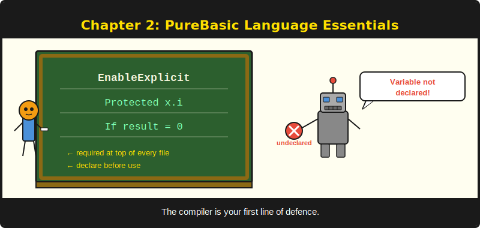

# Chapter 2: The PureBasic Language



*Everything you need to read framework code and write handlers.*

---

## Learning Objectives

After reading this chapter you will be able to:

- Declare variables with explicit types and explain why `EnableExplicit` is mandatory
- Manipulate strings using PureBasic's built-in string functions
- Define structures, maps, lists, and arrays, and choose the right collection for each task
- Write procedures with return types and use `Prototype` for function pointers
- Organise code into modules with `DeclareModule` and `UseModule`
- Handle runtime errors using return-code patterns and OnErrorGoto recovery

---

## 2.1 Types and Variables

PureBasic is a statically typed language. Every variable has a type, and the type determines how much memory it occupies and what operations you can perform on it. If you are coming from Python or JavaScript, this will feel restrictive at first. Give it a week. You will stop missing dynamic types around the same time you stop debugging type coercion bugs.

The built-in types are:

| Suffix | Type | Size | Range |
|--------|------|------|-------|
| `.b` | Byte | 1 byte | -128 to 127 |
| `.w` | Word | 2 bytes | -32768 to 32767 |
| `.l` | Long | 4 bytes | -2,147,483,648 to 2,147,483,647 |
| `.q` | Quad | 8 bytes | Full 64-bit signed integer |
| `.i` | Integer | **pointer-sized** | 4 bytes on x86, 8 bytes on x64 |
| `.f` | Float | 4 bytes | Single precision |
| `.d` | Double | 8 bytes | Double precision |
| `.s` | String | Variable | Unicode string |

The `.i` type deserves special attention. It is not 32-bit, and it is not 64-bit. It is pointer-sized, meaning it is 4 bytes when you compile for x86 and 8 bytes when you compile for x64. PureSimple uses `.i` extensively for handles, IDs, loop counters, and procedure addresses. On a modern 64-bit system, `.i` and `.q` are the same size, but they are not interchangeable in intent. Use `.i` when the value represents a handle or pointer. Use `.q` when the value is genuinely a 64-bit number.

```purebasic
; Listing 2.1 -- Type declarations and EnableExplicit
EnableExplicit

Protected count.i = 0          ; pointer-sized integer
Protected name.s  = "PureSimple"
Protected price.d = 29.95      ; double-precision float
Protected flag.b  = #True      ; byte (0 or 1)

; This line would cause a compiler error with
; EnableExplicit because 'total' is not declared:
; total = count + 1
```

The first line, `EnableExplicit`, changes everything. Without it, PureBasic silently creates variables the first time you use them, inferring the type from context. That sounds convenient until you mistype `coutn` instead of `count` and spend an hour wondering why your counter never increments. Forgetting `EnableExplicit` is like driving without a seatbelt. You feel free right up until the crash.

> **Warning:** `EnableExplicit` is non-negotiable. Every file in PureSimple uses it. Every file you write should use it. The compiler is your ally, but only if you let it check your work.

### Scope: Protected vs Global vs Shared

Variables declared inside a procedure are local to that procedure by default, but PureBasic has several scope qualifiers:

- **`Protected`** -- the variable exists only within the current procedure. This is what you want 95% of the time. Every procedure-local variable in PureSimple uses `Protected`.
- **`Global`** -- the variable is visible everywhere in the program, including inside procedures. Use sparingly. Global state is the enemy of testable code.
- **`Shared`** -- makes a previously declared `Global` variable accessible inside a specific procedure. You will rarely need this.
- **`Static`** -- the variable retains its value between procedure calls, like C's `static`. Useful for counters and caches, but it complicates reasoning about state.

The rule in PureSimple is simple: use `Protected` inside procedures, use `Global` at module scope when the module genuinely needs shared state (like the test harness counters), and avoid `Shared` unless you have a specific reason.

## 2.2 Strings

Strings in PureBasic are Unicode, mutable, and manipulated through built-in functions rather than methods. There is no `str.split()` syntax. Instead, you call `StringField(str, index, delimiter)`.

Concatenation uses the `+` operator:

```purebasic
Protected greeting.s = "Hello, " + "world" + "!"
; greeting = "Hello, world!"
```

The most important string functions for web development are:

```purebasic
; Listing 2.2 -- String manipulation: StringField splitting
EnableExplicit

Protected csv.s = "alice,bob,charlie"

; Split by delimiter -- fields are 1-indexed
Protected first.s  = StringField(csv, 1, ",")  ; "alice"
Protected second.s = StringField(csv, 2, ",")  ; "bob"
Protected third.s  = StringField(csv, 3, ",")  ; "charlie"

; Count occurrences of a substring
Protected commas.i = CountString(csv, ",")     ; 2

; Find position of substring (1-based, 0 = not found)
Protected pos.i = FindString(csv, "bob")       ; 7

; Substring extraction
Protected sub.s = Mid(csv, 7, 3)               ; "bob"
Protected lft.s = Left(csv, 5)                 ; "alice"
Protected rgt.s = Right(csv, 7)                ; "charlie"

; Case conversion
Protected up.s  = UCase("hello")               ; "HELLO"
Protected lo.s  = LCase("HELLO")               ; "hello"

; Length
Protected len.i = Len(csv)                     ; 17

; Trim whitespace
Protected trimmed.s = Trim("  hello  ")        ; "hello"
```

Escape sequences require the `~"..."` prefix. A plain `"Hello\nWorld"` is a literal backslash followed by `n`. To get an actual newline, write `~"Hello\nWorld"`.

```purebasic
Protected plain.s   = "Hello\nWorld"     ; literal: Hello\nWorld
Protected escaped.s  = ~"Hello\nWorld"   ; actual newline between Hello and World
```

This catches everyone at least once. PureBasic treats double-quoted strings as literal unless you opt in to escape processing with the tilde prefix.

## 2.3 Data Structures

PureBasic has three main collection types, plus structures for defining custom record types. Choosing the right one matters for performance and clarity.

### Structures

A `Structure` is PureBasic's equivalent of a C struct or a Go struct. It defines a named collection of typed fields:

```purebasic
; Listing 2.3 -- Structure definition and pointer access
EnableExplicit

Structure User
  Name.s
  Email.s
  Age.i
EndStructure

Protected user.User
user\Name  = "Alice"
user\Email = "alice@example.com"
user\Age   = 30

; Pointer to a structure
Protected *ptr.User = @user
PrintN(*ptr\Name)   ; prints "Alice"
```

Field access uses the backslash `\` operator, not a dot. If you are coming from most other languages, this will take a few days to become automatic. The `*` prefix on a variable name marks it as a pointer. `*ptr.User` is a pointer to a `User` structure.

The `RequestContext` structure in PureSimple's `Types.pbi` is the single most important structure in the framework. It carries the HTTP method, path, query string, body, status code, response body, content type, route parameters, the KV store, and session data. Every handler receives a pointer to it.

### Maps

A `NewMap` creates a hash map with string keys:

```purebasic
NewMap headers.s()
headers("Content-Type") = "application/json"
headers("X-Request-ID") = "abc-123"

If FindMapElement(headers(), "Content-Type")
  PrintN("Found: " + headers())  ; prints the value at current position
EndIf
```

Maps are the natural choice for key-value lookups: HTTP headers, query parameters, configuration settings.

### Lists

A `NewList` creates a doubly-linked list:

```purebasic
NewList names.s()
AddElement(names()) : names() = "Alice"
AddElement(names()) : names() = "Bob"
AddElement(names()) : names() = "Charlie"

ForEach names()
  PrintN(names())
Next
```

Lists are good for ordered collections where you frequently add or remove elements. They are not good for random access by index.

### Arrays

`Dim` creates a fixed-size array:

```purebasic
; Listing 2.4 -- Map, List, and Array comparison
EnableExplicit

; Array: Dim a(N) creates N+1 elements (indices 0 to N)
Dim scores.i(4)    ; creates 5 elements: scores(0) through scores(4)
scores(0) = 95
scores(4) = 87

; Use ReDim to resize (preserves existing data)
ReDim scores.i(9)  ; now 10 elements: scores(0) through scores(9)
```

> **PureBasic Gotcha:** `Dim a(5)` creates **six** elements (indices 0 through 5). Not five. Six. This is consistent within PureBasic -- the argument is the highest index, not the count -- but it surprises developers from every other language. To create exactly five elements, write `Dim a(4)`.

When to use each:

| Collection | Best for | Indexed access | Insert/Remove |
|-----------|---------|---------------|--------------|
| `NewMap` | Key-value lookup | By string key | Fast |
| `NewList` | Ordered, dynamic-size | Sequential only | Fast |
| `Dim` | Fixed-size, indexed | By integer index | Slow (ReDim copies) |

## 2.4 Procedures and Prototypes

Procedures are PureBasic's functions. They have a name, optional parameters, an optional return type, and a body:

```purebasic
Procedure.s Greet(name.s)
  ProcedureReturn "Hello, " + name + "!"
EndProcedure

Protected msg.s = Greet("PureBasic")  ; "Hello, PureBasic!"
```

The `.s` after `Procedure` declares the return type as a string. Use `.i` for integer returns, `.d` for doubles, or omit the suffix for procedures that return nothing.

### Function Pointers with Prototype

PureSimple registers handlers and middleware by passing procedure addresses. To do this, PureBasic uses `Prototype` to define a function signature, and `@MyProc()` to take the address of a procedure:

```purebasic
; Define the handler signature
Prototype.i PS_HandlerFunc(*Ctx.RequestContext)

; Register a handler by address
Engine::GET("/users", @ListUsersHandler())

; The handler procedure matches the prototype signature
Procedure ListUsersHandler(*C.RequestContext)
  Rendering::JSON(*C, ~"{\"users\":[]}")
EndProcedure
```

The `@` operator returns the memory address of a procedure. This address is stored in the route table. When a matching request arrives, the router retrieves the address, casts it to the `PS_HandlerFunc` prototype, and calls it. This is the same mechanism as C function pointers, and it is how every handler and middleware in PureSimple gets invoked.

### Forward Declarations

If procedure A calls procedure B, and B is defined later in the file, you need a `Declare` statement:

```purebasic
Declare.s FormatName(first.s, last.s)

; Now you can call FormatName before its body appears
Protected full.s = FormatName("Jedt", "Sitth")

Procedure.s FormatName(first.s, last.s)
  ProcedureReturn first + " " + last
EndProcedure
```

In practice, PureSimple avoids this issue by putting procedures inside modules, where declaration order is handled by the `DeclareModule` block.

## 2.5 Modules

Modules are PureBasic's encapsulation mechanism. They are not packages in the Go sense or classes in the Java sense. They are closer to C++ namespaces with a twist: the module body is a black box. Nothing inside a `Module` block can see variables or types defined outside it, unless you explicitly import them.

```purebasic
; Listing 2.5 -- Module declaration and UseModule
EnableExplicit

DeclareModule Greeter
  Declare.s Hello(name.s)
  Declare.s Goodbye(name.s)
EndDeclareModule

Module Greeter
  Procedure.s Hello(name.s)
    ProcedureReturn "Hello, " + name + "!"
  EndProcedure

  Procedure.s Goodbye(name.s)
    ProcedureReturn "Goodbye, " + name + "."
  EndProcedure
EndModule

; Call with module prefix
PrintN(Greeter::Hello("World"))

; Or import the module to skip the prefix
UseModule Greeter
PrintN(Hello("World"))
```

Module bodies are like hotel rooms. What happens inside stays inside. Unless you left the door open with `DeclareModule`.

`DeclareModule` is the public interface. Only procedures and types listed there are visible to the outside world. `Module` is the implementation. Private helper procedures that do not appear in `DeclareModule` are invisible to callers.

> **Compare:** PureBasic's modules are like Go packages, except they share nothing by default. In Go, any capitalised name is exported. In PureBasic, only names listed in `DeclareModule` are exported. The isolation is stricter.

### The Types Module Pattern

There is an important consequence of module isolation: if you define a structure outside any module, procedures inside a module cannot use it. PureSimple solves this by putting all shared types inside a `Types` module:

```purebasic
DeclareModule Types
  Structure RequestContext
    Method.s
    Path.s
    ; ... other fields
  EndStructure
EndDeclareModule

Module Types
  ; No runtime code -- pure type library
EndModule
```

Then, every consuming module adds `UseModule Types` at the top of its `Module` block:

```purebasic
Module Engine
  UseModule Types   ; now *C.RequestContext works here
  ; ...
EndModule
```

And the main program adds `UseModule Types` at program level so application code can write `*C.RequestContext` instead of `Types::RequestContext`. This pattern appears in `src/PureSimple.pb`:

```purebasic
XIncludeFile "Types.pbi"
UseModule Types        ; import into global scope
```

## 2.6 Error Handling

PureBasic does not have exceptions in the try/catch sense. It has two error handling mechanisms, and you will use both.

### Return-Code Pattern

The most common pattern is checking return values:

```purebasic
; Listing 2.6 -- Return-code and OnErrorGoto patterns
EnableExplicit

Protected file.i = ReadFile(#PB_Any, "config.txt")
If file = 0
  PrintN("Cannot open config.txt")
  End 1
EndIf

; File is open, proceed
Protected line.s = ReadString(file)
CloseFile(file)
```

Most PureBasic functions return 0 on failure and a non-zero handle on success. This is explicit and reliable.

### OnErrorGoto

For catching runtime errors like null pointer dereferences or division by zero, PureBasic provides `OnErrorGoto`:

```purebasic
OnErrorGoto(?ErrorHandler)

; Code that might fail
Protected *ptr.Integer = 0
*ptr\i = 42  ; null pointer dereference

; This label catches the error
ErrorHandler:
PrintN("Error: " + ErrorMessage())
PrintN("  at line " + Str(ErrorLine()))
PrintN("  in file " + ErrorFile())
End 1
```

`ErrorMessage()`, `ErrorLine()`, and `ErrorFile()` give you diagnostic information about what went wrong and where. The Recovery middleware in PureSimple uses this pattern to catch runtime errors inside handlers and return a 500 response instead of crashing the server.

> **PureBasic Gotcha:** There is no `FileExists()` function. To check whether a file exists, use `FileSize(path) >= 0`. `FileSize` returns -1 for files that do not exist, and -2 for directories. I once spent three hours debugging a `FileExists()` call before discovering it does not exist. The function, I mean. The file was fine.

## 2.7 Reserved Words That Will Bite You

PureBasic reserves a number of common English words for its own syntax. If you try to use them as procedure names, variable names, or parameter names, the compiler will produce confusing error messages. Here is the table of words that matter most for web development:

```purebasic
; Listing 2.7 -- Reserved word workarounds
;
; Reserved Word  | PureBasic Uses It For     | PureSimple Workaround
; ---------------------------------------------------------------
; Next           | For...Next loop closing   | Ctx::Advance
; Default        | Select...Case...Default   | Use "fallback" or "def"
; Data           | Data statement (inline)   | Use "payload" or "body"
; Debug          | IDE debug output          | Use Log:: module instead
; Read           | Read from Data block      | Use "fetch" or "load"
; End            | Program termination       | (use carefully)
; FreeJSON       | Built-in JSON cleanup     | Binding::ReleaseJSON
; Assert         | PureUnit halt-on-fail     | Check (test harness)
; AssertString   | PureUnit string assert    | CheckStr (test harness)
```

The method is called `Advance` because `Next` is reserved. PureBasic has strong opinions about `For...Next` loops, and it will not negotiate.

Similarly, PureSimple uses `ReleaseJSON` instead of `FreeJSON` because PureBasic 6.x already defines `FreeJSON` as a built-in function. Redefining it causes a silent conflict where the wrong version gets called.

---

## Summary

PureBasic is a typed, compiled language with explicit variable declarations, and a module system that enforces strong encapsulation. Its type system is small but requires attention to the pointer-sized `.i` type. Strings are manipulated through functions rather than methods. Structures, maps, lists, and arrays each serve different purposes, and choosing the right one affects both correctness and performance. Modules isolate implementation details behind `DeclareModule` interfaces, and the `Types` module pattern makes shared structures available across module boundaries. Several common English words are reserved, and the framework renames its APIs to avoid collisions.

## Key Takeaways

- **Always use `EnableExplicit`.** It turns the compiler from a silent accomplice into an error-catching ally. Every file in PureSimple starts with it.
- **`.i` is pointer-sized, not 32-bit.** It is 4 bytes on x86 and 8 bytes on x64. Use it for handles and pointers; use `.l` or `.q` when you need a specific size.
- **Module bodies are black boxes.** Use `DeclareModule` to expose the public interface and `UseModule Types` to share structures across modules.
- **Several common English words are reserved.** `Next`, `Default`, `Data`, `Debug`, `Assert`, and `FreeJSON` cannot be used as custom identifiers. PureSimple works around each one.

## Review Questions

1. Why does `Dim a(5)` create six elements, and how would you write a declaration that creates exactly five?
2. Explain the difference between `IncludeFile` and `XIncludeFile`. Why does PureSimple use `XIncludeFile` exclusively?
3. *Try it:* Write a module called `Greeter` that exposes a `Greet(name.s)` procedure returning `"Hello, " + name + "!"`. Call it from main code using both the `Greeter::Greet()` syntax and the `UseModule` syntax. Compile with `EnableExplicit` and verify it runs.
