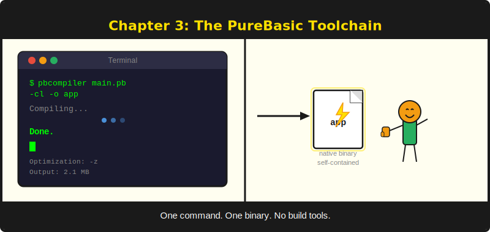
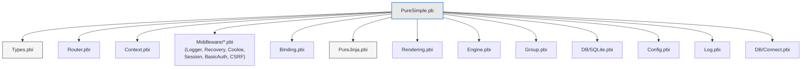
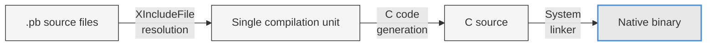

# Chapter 3: The PureBasic Toolchain -- Compiler, Debugger, and PureUnit



*The three tools that turn your code into a tested, debugged binary.*

---

## Learning Objectives

After reading this chapter you will be able to:

- Compile PureBasic source files from the command line using essential compiler flags
- Trace the `XIncludeFile` resolution tree for the PureSimple framework
- Write and run tests using both PureUnit's built-in assertions and PureSimple's custom harness
- Use the PureBasic IDE debugger for breakpoints, variable inspection, and profiling
- Follow the compile-test-debug cycle used throughout the PureSimple development process

---

## 3.1 The PureBasic Compiler (`pbcompiler`)

The PureBasic compiler is a single executable that reads `.pb` source files, resolves includes, generates C code, and invokes the system linker to produce a native binary. There is no separate preprocessor, no intermediate bytecode, and no just-in-time compilation. Source goes in, a binary comes out.

The compiler lives inside your PureBasic installation:

**Listing 3.1** -- Compiling a console app from the command line

```bash
$PUREBASIC_HOME/compilers/pbcompiler main.pb -cl -o myapp
./myapp
```

> **Tip:** On Windows, use `%PUREBASIC_HOME%\Compilers\pbcompiler.exe` (Command Prompt) or `& "$env:PUREBASIC_HOME\Compilers\pbcompiler.exe"` (PowerShell). The compiler flags are identical across platforms.

The compiler does not have a package manager. It does not need one. It also does not have a `node_modules` folder. You are welcome.

### Essential Flags

Here are the compiler flags you will use throughout this book:

| Flag | Purpose | When to use |
|------|---------|-------------|
| `-cl` | Console application | **Always** for servers and test runners |
| `-o <name>` | Output binary name | Always (otherwise you get a default name) |
| `-z` | Enable C optimiser | Release builds |
| `-k` | Syntax check only | Fast feedback during development |
| `-t` | Thread-safe mode | When using threads or thread-safe libraries |
| `-dl` | Compile as shared library | Plugin architectures (rarely needed) |

> **Warning:** Always use `-cl` for server applications and test runners. Without it, PureBasic produces a GUI binary that will not print to the terminal. Your server will start, listen on a port, and produce no log output whatsoever. You will stare at a silent terminal wondering if anything is happening. It is not a pleasant experience.

The `-k` flag deserves special mention. It performs a full syntax check without producing a binary. On a typical PureSimple compilation, the full build takes 2-3 seconds. A syntax check with `-k` takes under a second. When you are iterating on code and just want to know if it compiles, `-k` is your friend.

> **Tip:** Use `-k` for syntax checking during development -- it is 10x faster than a full compile.

### Compiler Constants

PureBasic provides several compile-time constants that are useful for diagnostics and cross-platform code:

```purebasic
; Listing 3.2 -- Using compiler constants for diagnostics
EnableExplicit

PrintN("Compiled with PureBasic")
PrintN("  File: " + #PB_Compiler_File)
PrintN("  Line: " + Str(#PB_Compiler_Line))
PrintN("  Home: " + #PB_Compiler_Home)

CompilerSelect #PB_Compiler_OS
  CompilerCase #PB_OS_MacOS
    PrintN("  OS: macOS")
  CompilerCase #PB_OS_Linux
    PrintN("  OS: Linux")
  CompilerCase #PB_OS_Windows
    PrintN("  OS: Windows")
CompilerEndSelect

CompilerIf #PB_Compiler_Processor = #PB_Processor_x64
  PrintN("  Arch: x64 (pointer = 8 bytes)")
CompilerElse
  PrintN("  Arch: x86 (pointer = 4 bytes)")
CompilerEndIf
```

`#PB_Compiler_File` and `#PB_Compiler_Line` are particularly useful for test harnesses and error reporting. They expand to the current source file path and line number at compile time, which is exactly how PureSimple's `Check` macro reports the location of a failing assertion.

### The Include Resolution Model

When the compiler encounters `XIncludeFile "path/to/file.pbi"`, it reads that file and compiles it as if its contents were pasted into the current file at that point. This is textual inclusion, similar to C's `#include`. The `X` prefix means "include only once" -- if the same file is included again (directly or through another include chain), the second inclusion is silently skipped. This prevents duplicate definition errors.

`IncludeFile` (without the `X`) includes the file every time. If two modules both `IncludeFile "Types.pbi"`, you get duplicate structure definitions and a compiler error. PureSimple uses `XIncludeFile` exclusively.

Include paths are relative to the file that contains the `XIncludeFile` directive, not relative to the compiler's working directory. This means if `tests/run_all.pb` includes `"../src/PureSimple.pb"`, the compiler resolves that relative to the `tests/` directory.

## 3.2 The Include Tree

Understanding PureSimple's include tree is essential for navigating the codebase. The framework entry point is `src/PureSimple.pb`, and it includes every module in dependency order:

```purebasic
; Listing 3.3 -- PureSimple.pb include chain (annotated)
EnableExplicit

XIncludeFile "Types.pbi"               ; Shared types: RequestContext, PS_HandlerFunc
UseModule Types                        ; Import types into global scope

XIncludeFile "Router.pbi"              ; Radix trie router: Insert / Match
XIncludeFile "Context.pbi"             ; Request lifecycle: Advance, Abort, KV store
XIncludeFile "Middleware/Logger.pbi"   ; Logger: method/path/status/elapsed
XIncludeFile "Middleware/Recovery.pbi" ; Recovery: OnError -> 500 response
XIncludeFile "Binding.pbi"             ; Request binding: Param, Query, PostForm, JSON
XIncludeFile "Middleware/Cookie.pbi"   ; Cookie parsing + Set-Cookie
XIncludeFile "Middleware/Session.pbi"  ; In-memory session store
XIncludeFile "Middleware/BasicAuth.pbi"; HTTP Basic Authentication
XIncludeFile "Middleware/CSRF.pbi"     ; CSRF token generation + validation
XIncludeFile "../../pure_jinja/PureJinja.pbi"  ; Jinja template engine
XIncludeFile "Rendering.pbi"           ; Response: JSON, HTML, Text, Redirect, File
XIncludeFile "Engine.pbi"              ; Top-level API: NewApp, Run, GET, POST, Use
XIncludeFile "Group.pbi"               ; RouterGroup: sub-router with prefix
XIncludeFile "DB/SQLite.pbi"           ; SQLite adapter + migration runner
XIncludeFile "Config.pbi"              ; .env loader + config store
XIncludeFile "Log.pbi"                 ; Levelled logger
XIncludeFile "DB/Connect.pbi"          ; Multi-driver DSN connection factory
```

The order is not arbitrary. Types must come before everything else because every module uses `RequestContext`. Router comes before Context because the context needs route matching results. Middleware modules come before Engine because Engine's `Use()` function registers middleware by address. Rendering comes after PureJinja because it calls the template engine's API.


*Figure 3.1 -- XIncludeFile resolution tree for PureSimple.pb. The framework entry point includes all modules in dependency order. Types comes first because every other module depends on the RequestContext structure.*

When you compile a test file or application, you include `PureSimple.pb`, and the entire framework comes along. The compiler resolves each `XIncludeFile`, compiles the contents, and discards any duplicate includes. Your final binary contains exactly the code it needs.


*Figure 3.2 -- Compiler pipeline. PureBasic resolves all includes into a single compilation unit, generates C code, and invokes the system linker to produce a native binary.*

## 3.3 The PureBasic IDE and Debugger

PureBasic ships with a full-featured IDE that includes syntax highlighting, code folding, an integrated debugger, and a profiler. If you prefer writing code in a GUI environment, the IDE is a capable editor.

The debugger is where the IDE truly shines. You can set breakpoints by clicking in the gutter, then run your program. When execution hits a breakpoint, you can inspect variables, watch expressions, navigate the call stack, and step through code line by line. The profiler shows you how much time each procedure takes, which is invaluable when optimising hot paths.

The `Debug` statement sends output to the IDE's debug window:

```purebasic
Debug "Connection count: " + Str(count)
Debug "Processing request for: " + path
```

`Debug` statements are stripped from release builds (when you compile without the debugger enabled), so they have zero cost in production. Use them liberally during development.

However, web servers are long-running console processes. The IDE debugger is designed for programs that start, do work, and stop. It handles interactive debugging sessions well but does not handle a server sitting idle waiting for connections. For web development, the practical workflow is:

1. **Edit** in your preferred editor (IDE, VS Code, vim, whatever you like)
2. **Compile** from the command line with `pbcompiler -cl`
3. **Run** the binary directly
4. **Debug** specific problems by isolating them in a small test file and using the IDE debugger

> **Tip:** The IDE is excellent for exploring and debugging. The command line is essential for CI and deployment. Use both.

## 3.4 PureUnit -- The Built-in Test Framework

PureBasic 6.x includes a built-in testing mechanism through two pre-defined macros: `Assert()` and `AssertString()`. These are part of `pureunit.res`, which is linked into every PureBasic program.

```purebasic
; Listing 3.4 -- A PureUnit test file: Assert() and AssertString()
EnableExplicit

; Numeric assertion -- halts on failure
Assert(1 + 1 = 2)
Assert(10 > 5)

; String assertion -- halts on failure
AssertString(UCase("hello"), "HELLO")
AssertString(Left("PureBasic", 4), "Pure")

PrintN("All PureUnit assertions passed.")
```

PureUnit works on a "halt on first failure" model. If any assertion fails, execution stops immediately. You see the failure, fix it, recompile, and run again. This is simple and effective for small programs.

The limitation becomes obvious in a larger project. If you have 264 assertions across 11 test suites, and assertion number 3 fails, you do not know whether assertions 4 through 264 pass or fail. You fix the first failure, recompile, run, and discover the next failure. This is the debugging equivalent of whack-a-mole.

> **Compare:** PureUnit's `Assert()` is equivalent to Go's `t.Fatal()` -- it halts the test immediately. PureSimple's test harness is equivalent to Go's `t.Error()` -- it records the failure and continues running. Both approaches have their place, but for a framework with hundreds of assertions, count-and-continue is essential.

> **PureBasic Gotcha:** PureBasic 6.x pre-defines `Assert()` and `AssertString()` from `pureunit.res`. If you try to define your own macros with these names, you get a silent conflict where the wrong version may be called. PureSimple avoids this by using completely different names: `Check`, `CheckEqual`, and `CheckStr`.

## 3.5 The PureSimple Test Harness

PureSimple's test harness is a single file -- `tests/TestHarness.pbi` -- that provides count-and-continue assertions. Every assertion increments either a pass counter or a fail counter, prints a failure message with file and line number if something goes wrong, and keeps running. At the end, `PrintResults()` prints a summary and returns a pass/fail status.

The harness defines three assertion macros:

```purebasic
; Listing 3.5 -- The PureSimple Check / CheckEqual / CheckStr macros
; (from tests/TestHarness.pbi)

; Check(expr) -- boolean assertion
; Passes if expr is #True, fails otherwise
Macro Check(expr)
  _PS_CheckTrue(Bool(expr), #PB_Compiler_File, #PB_Compiler_Line)
EndMacro

; CheckEqual(a, b) -- numeric equality
; Passes if a = b, fails and prints both values otherwise
Macro CheckEqual(a, b)
  _PS_CheckEqual((a), (b), #PB_Compiler_File, #PB_Compiler_Line)
EndMacro

; CheckStr(a, b) -- string equality
; Passes if a = b, fails and prints both strings otherwise
Macro CheckStr(a, b)
  _PS_CheckStr((a), (b), #PB_Compiler_File, #PB_Compiler_Line)
EndMacro
```

Each macro captures `#PB_Compiler_File` and `#PB_Compiler_Line` at the call site, then delegates to a helper procedure that does the actual comparison and counter management. This design keeps the macros thin (avoiding PureBasic macro limitations around string concatenation) while providing accurate file-and-line diagnostics on failure.

The helper procedures are straightforward. Here is the one for `Check`:

```purebasic
Procedure _PS_CheckTrue(result.i, file.s, line.i)
  If result
    _PS_PassCount + 1
  Else
    _PS_FailCount + 1
    PrintN("  FAIL  Check @ " + file + ":" + Str(line))
  EndIf
EndProcedure
```

When a check fails, you see exactly which file and line produced the failure. When it passes, the counter increments silently. At the end of the run, `PrintResults()` shows the total:

```
======================================
  ALL TESTS PASSED  (264 assertions)
======================================
```

All 264 tests pass. Or at least they did when I compiled this page.

### Writing a Test Suite

Test suites are organised with `BeginSuite`, which prints a label to group related assertions:

```purebasic
; Listing 3.6 -- Writing a test suite
BeginSuite("String utilities")

CheckStr(UCase("hello"), "HELLO")
CheckStr(LCase("WORLD"), "world")
CheckStr(Left("PureBasic", 4), "Pure")
CheckEqual(Len("test"), 4)
Check(FindString("hello world", "world") > 0)
```

`BeginSuite` is a macro that expands to a single `PrintN` call. It does not create scope or isolate test state. It is purely a labelling mechanism that makes the test output readable. When you run the tests, you see:

```
PureSimple Test Suite
=====================

  [Suite] P0 / Harness self-tests
  [Suite] P1 / Router tests
  [Suite] P2 / Middleware tests
  ...
```

### The run_all.pb Pattern

PureSimple uses a single entry point for all tests:

```purebasic
; Listing 3.7 -- The run_all.pb entry point pattern
; (from tests/run_all.pb)
EnableExplicit

; Pull in the framework
XIncludeFile "../src/PureSimple.pb"

; Test harness (macros + counters)
XIncludeFile "TestHarness.pbi"

; Phase test files
PrintN("PureSimple Test Suite")
PrintN("=====================")
PrintN("")

XIncludeFile "P0_Harness_Test.pbi"
XIncludeFile "P1_Router_Test.pbi"
XIncludeFile "P2_Middleware_Test.pbi"
; ... one include per phase

; Print summary and exit
If PrintResults()
  End 0    ; exit code 0 = success
Else
  End 1    ; exit code 1 = failure
EndIf
```

The pattern is simple: include the framework, include the harness, include each test file, print results, exit with an appropriate code. The exit code matters for CI pipelines -- a non-zero exit tells the pipeline that tests failed.

Each test file (like `P0_Harness_Test.pbi`) is a plain `.pbi` file with no `EnableExplicit` or includes of its own (those are already handled by `run_all.pb`). It starts with a `BeginSuite` call and contains assertion macros:

```purebasic
; From tests/P0_Harness_Test.pbi
BeginSuite("P0 / Harness self-tests")

Check(#True)
Check(Not #False)
Check(1 = 1)

CheckEqual(1 + 1, 2)
CheckEqual(10 - 3, 7)
CheckEqual(3 * 4, 12)

CheckStr("a" + "b", "ab")
CheckStr(LCase("HELLO"), "hello")
CheckStr(UCase("world"), "WORLD")
CheckStr(Str(42), "42")
```

To compile and run the entire test suite:

```bash
$PUREBASIC_HOME/compilers/pbcompiler tests/run_all.pb -cl -o run_all
./run_all
```

One command, one binary, all tests. No test runner framework to install, no configuration file to write, no glob patterns to match test files. The compiler includes the test files because you told it to, and the binary runs them because they are ordinary PureBasic code.

## 3.6 Putting It All Together

The development workflow for every phase of PureSimple follows the same cycle:

1. **Write code** in a `.pbi` module file under `src/`
2. **Write tests** in a test file under `tests/`
3. **Add the test file** to `tests/run_all.pb` via `XIncludeFile`
4. **Compile the tests**: `pbcompiler tests/run_all.pb -cl -o run_all`
5. **Run the tests**: `./run_all`
6. **If tests fail**: read the failure output, locate the file and line, fix the issue, go to step 4
7. **If tests pass**: compile the example app and verify it works in a browser
8. **Repeat** until the phase is complete

For quick iteration during step 2-3, use `-k` for syntax checking before doing a full compile:

```bash
# Fast syntax check (under 1 second)
$PUREBASIC_HOME/compilers/pbcompiler -k tests/run_all.pb

# Full compile (2-3 seconds)
$PUREBASIC_HOME/compilers/pbcompiler tests/run_all.pb -cl -o run_all
```

When you need to investigate a subtle bug, isolate the problem in a small file and use the IDE debugger. Set a breakpoint at the suspicious line, step through the execution, and inspect variable values. Once you understand the problem, fix it in your editor and return to the command-line workflow.

Here is a quick reference card for the compiler flags you will use most:

| Task | Command |
|------|---------|
| Syntax check | `pbcompiler -k myfile.pb` |
| Compile console app | `pbcompiler myfile.pb -cl -o myapp` |
| Compile with optimiser | `pbcompiler myfile.pb -cl -z -o myapp` |
| Compile with thread safety | `pbcompiler myfile.pb -cl -t -o myapp` |
| Compile test suite | `pbcompiler tests/run_all.pb -cl -o run_all` |
| Run tests | `./run_all` |

You could also trace the include chain by hand using pen and paper. You could also compute pi by counting raindrops. Both are technically possible. The table above is faster.

---

## Summary

The PureBasic toolchain consists of the `pbcompiler` (with flags for console mode, optimisation, thread safety, and syntax checking), the IDE with its integrated debugger and profiler, and PureUnit for built-in halt-on-fail assertions. PureSimple extends PureUnit with a count-and-continue harness that reports all failures rather than stopping at the first. The `TestHarness.pbi` file provides `Check`, `CheckEqual`, and `CheckStr` macros that capture file and line information at the call site. The `run_all.pb` entry point includes the framework, the harness, and every test file, producing a single binary that runs the entire test suite and exits with an appropriate code.

## Key Takeaways

- **`-cl` for console, `-z` for release, `-k` for syntax check.** These three flags cover 90% of your compilation needs. Remember that web servers are console applications.
- **`XIncludeFile` prevents duplicate definitions; include order matters.** Types must be included before the modules that use them. The `X` prefix means "include only once."
- **PureUnit halts on first failure; PureSimple's harness continues.** Use `Check`, `CheckEqual`, and `CheckStr` for framework tests. They report all failures in a single run.
- **The `run_all.pb` pattern: one entry point, one binary, all tests.** Add new test files by adding one `XIncludeFile` line. No test runner configuration needed.

## Review Questions

1. What is the difference between `-cl` and the default compiler mode, and why does it matter for web servers?
2. Why does PureSimple use `Check()` instead of PureBasic's built-in `Assert()`? What practical problem does the custom harness solve?
3. *Try it:* Create a file called `my_test.pbi` with a `BeginSuite("My tests")` call and three `Check` assertions -- two that pass and one that deliberately fails. Add it to a new `my_run.pb` entry point (include `TestHarness.pbi`, your test file, and call `PrintResults()`). Compile with `-cl`, run it, and read the output. Note the file name and line number in the failure message.
