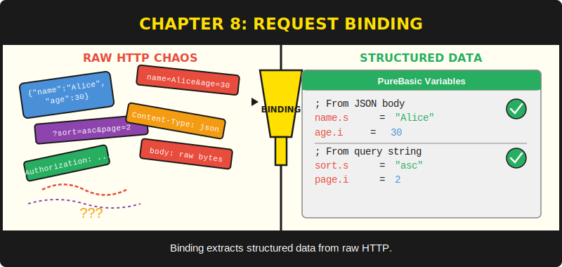
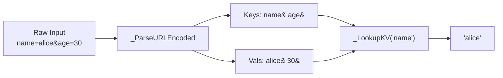

# Chapter 8: Request Binding



*Turning raw bytes into the data your handler needs.*

---

**After reading this chapter you will be able to:**

- Extract query string parameters from URLs using `Binding::Query`
- Parse URL-encoded form submissions with `Binding::PostForm`
- Bind and read JSON request bodies using `Binding::BindJSON`, `JSONString`, `JSONInteger`, and `JSONBool`
- Release JSON resources safely with `ReleaseJSON` (not `FreeJSON`)
- Implement input validation patterns that return proper 400 Bad Request responses

---

## 8.1 The Four Sources of Request Data

Every HTTP request can carry data in four places: the URL path, the query string, the request body (as a form or as JSON), and the headers. Chapter 6 introduced `Ctx::Param` for extracting path parameters like `:id` from `/users/:id`. This chapter covers the other three data sources, all exposed through the `Binding` module.

The `Binding` module lives in `src/Binding.pbi` and provides a clean, consistent API for getting data out of requests regardless of where the caller put it. You ask for a value by name, and the module handles the parsing, decoding, and lookup. You could do all of this yourself with `Mid()`, `FindString()`, and `StringField()`. You could also peel a potato with a Swiss Army knife. Both are technically possible, and neither is a good use of your afternoon.

Here is the public interface at a glance:

```purebasic
; Listing 8.1 -- The Binding module's public interface
DeclareModule Binding
  Declare.s Param(*C.RequestContext, Name.s)
  Declare.s Query(*C.RequestContext, Name.s)
  Declare.s PostForm(*C.RequestContext, Field.s)
  Declare.i BindJSON(*C.RequestContext)
  Declare.s JSONString(*C.RequestContext, Key.s)
  Declare.i JSONInteger(*C.RequestContext, Key.s)
  Declare.i JSONBool(*C.RequestContext, Key.s)
  Declare   ReleaseJSON(*C.RequestContext)
EndDeclareModule
```

Every procedure takes a `*C.RequestContext` pointer as its first argument. This is the same context you met in Chapter 6 -- the backpack that follows every request through the handler chain. Binding reads from it; rendering (Chapter 9) writes to it. The two modules never collide.

---

## 8.2 Route Parameters: Binding::Param

The simplest binding source is the URL path itself. When you register a route with a named parameter like `/users/:id`, the router extracts the value during matching and stores it in the context's `ParamKeys`/`ParamVals` fields. `Binding::Param` is a thin wrapper around `Ctx::Param`:

```purebasic
; Listing 8.2 -- Extracting a route parameter
Procedure GetUserHandler(*C.RequestContext)
  Protected id.s = Binding::Param(*C, "id")
  ; id now contains "42" for a request to /users/42
  Rendering::JSON(*C, ~"{\"user_id\":\"" + id + ~"\"}")
EndProcedure

Engine::GET("/users/:id", @GetUserHandler())
```

This is a one-liner by design. Route parameters are already parsed by the time your handler runs, so there is no lazy parsing or allocation happening behind the scenes. The cost is a linear scan of a tab-delimited string, which for typical routes (one to three parameters) is effectively free.

> **Compare:** In Go's Gin framework, the equivalent is `c.Param("id")`. In Express.js, it is `req.params.id`. PureSimple's API follows the same pattern -- ask for a parameter by name, get a string back. The difference is that PureSimple stores parameters in parallel `Chr(9)`-delimited strings rather than a hash map, which avoids map allocation on every request.

---

## 8.3 Query Strings: Binding::Query

Query strings are the part of a URL after the `?` mark: `/search?q=purebasic&page=2`. The browser sends them as part of the URL, and PureSimpleHTTPServer stores the raw string in `*C\RawQuery`. The `Binding::Query` procedure parses this string into key-value pairs the first time you call it, then caches the result for subsequent lookups on the same request.

```purebasic
; Listing 8.3 -- Reading query string parameters
Procedure SearchHandler(*C.RequestContext)
  Protected q.s    = Binding::Query(*C, "q")
  Protected page.s = Binding::Query(*C, "page")

  If q = ""
    Rendering::JSON(*C, ~"{\"error\":\"missing q\"}", 400)
    ProcedureReturn
  EndIf

  ; Use q and page to search your data store
  Rendering::JSON(*C, ~"{\"query\":\"" + q + ~"\",\"page\":\"" + page + ~"\"}")
EndProcedure

Engine::GET("/search", @SearchHandler())
```

The lazy parsing strategy is worth understanding. The first call to `Binding::Query` on a given request triggers `_ParseURLEncoded`, which splits `*C\RawQuery` on `&` characters, splits each pair on `=`, URL-decodes both sides, and stores the results in `*C\QueryKeys` and `*C\QueryVals`. The second call skips all of that work because the cache is already populated. If your handler never reads query parameters, the parsing never happens at all. You pay for what you use.

> **Under the Hood:** URL decoding converts `+` to space and `%XX` hex escapes to their character equivalents. The private `_URLDecode` procedure handles this with a single-pass loop. It checks each character: `+` becomes a space, `%` followed by two hex digits becomes `Chr(Val("$" + hex))`, and everything else passes through unchanged. The `$` prefix tells PureBasic's `Val` to parse a hexadecimal number.

```purebasic
; Listing 8.4 -- URL decoding internals (from src/Binding.pbi)
Procedure.s _URLDecode(s.s)
  Protected result.s = "", i.i = 1, n.i = Len(s), c.s
  While i <= n
    c = Mid(s, i, 1)
    If c = "+"
      result + " "
    ElseIf c = "%" And i + 2 <= n
      result + Chr(Val("$" + Mid(s, i + 1, 2)))
      i + 2
    Else
      result + c
    EndIf
    i + 1
  Wend
  ProcedureReturn result
EndProcedure
```

The RFC calls this "percent encoding" because `%20` is shorter than "that space character that breaks everything." The `+` shorthand for spaces dates back to HTML form encoding circa 1995 and refuses to retire.

---

## 8.4 Form Data: Binding::PostForm

When a browser submits an HTML form with `method="POST"` and the default `application/x-www-form-urlencoded` content type, the request body looks identical to a query string: `username=alice&password=secret123`. The `Binding::PostForm` procedure parses this body and returns the value for a given field name.

```purebasic
; Listing 8.5 -- Handling a form submission
Procedure LoginHandler(*C.RequestContext)
  Protected username.s = Binding::PostForm(*C, "username")
  Protected password.s = Binding::PostForm(*C, "password")

  If username = "" Or password = ""
    Rendering::JSON(*C, ~"{\"error\":\"missing credentials\"}", 400)
    ProcedureReturn
  EndIf

  ; Validate credentials (see Chapter 16)
  Rendering::Redirect(*C, "/dashboard")
EndProcedure

Engine::POST("/login", @LoginHandler())
```

Unlike `Binding::Query`, `PostForm` re-parses the body on every call. This is a deliberate design choice: query strings are immutable for the life of a request, but a handler might theoretically modify `*C\Body` between calls (unlikely, but possible). The cost of re-parsing a typical form body -- a few hundred bytes with a handful of fields -- is negligible. If you find yourself parsing a form body with thousands of fields, you have bigger problems than parser performance.

> **Warning:** `Binding::PostForm` returns an empty string for missing fields, not an error. Always check for empty values before using them. An empty username is not the same as "the user didn't submit the field" -- but in URL-encoded forms, they look identical. Validate early, validate often.

---

## 8.5 JSON Bodies: Binding::BindJSON

Modern APIs send and receive JSON. The `Binding::BindJSON` procedure parses the raw request body as JSON using PureBasic's built-in JSON library and stores the handle in `*C\JSONHandle`. Once bound, you use `JSONString`, `JSONInteger`, and `JSONBool` to extract top-level fields by name.

```purebasic
; Listing 8.6 -- Binding and reading a JSON request body
Procedure CreatePostHandler(*C.RequestContext)
  If Binding::BindJSON(*C) = 0
    Rendering::JSON(*C, ~"{\"error\":\"invalid JSON\"}", 400)
    ProcedureReturn
  EndIf

  Protected title.s  = Binding::JSONString(*C, "title")
  Protected body.s   = Binding::JSONString(*C, "body")
  Protected draft.i  = Binding::JSONBool(*C, "draft")

  If title = ""
    Binding::ReleaseJSON(*C)
    Rendering::JSON(*C, ~"{\"error\":\"title required\"}", 400)
    ProcedureReturn
  EndIf

  ; Save the post (see Chapter 13 for SQLite)
  Binding::ReleaseJSON(*C)
  Rendering::JSON(*C, ~"{\"status\":\"created\"}", 201)
EndProcedure

Engine::POST("/api/posts", @CreatePostHandler())
```

The `BindJSON` procedure returns the JSON handle on success (a positive integer) or `0` on failure. A return value of `0` means either the body was empty or the JSON was malformed. In both cases, the right response is a 400 Bad Request.

The field accessors -- `JSONString`, `JSONInteger`, `JSONBool` -- work only on top-level object members. They call PureBasic's `GetJSONMember` on the root object. For nested JSON structures, you would use PureBasic's JSON API directly with the handle stored in `*C\JSONHandle`. But for the vast majority of API endpoints that accept flat JSON objects with string, integer, and boolean fields, the built-in accessors are all you need.

> **PureBasic Gotcha:** The cleanup procedure is called `ReleaseJSON`, not `FreeJSON`. PureBasic already defines a built-in `FreeJSON(id.i)` procedure. If the framework had named its cleanup `FreeJSON`, it would shadow PureBasic's built-in, and calls to either one would behave unpredictably depending on scope. The name `ReleaseJSON` sidesteps the collision entirely. This is the kind of naming surprise that PureBasic's flat global namespace imposes on library authors -- and why the PureSimple codebase documents every naming workaround.

Here is what `ReleaseJSON` does internally:

```purebasic
; Listing 8.7 -- ReleaseJSON cleanup (from src/Binding.pbi)
Procedure ReleaseJSON(*C.RequestContext)
  If *C\JSONHandle <> 0
    FreeJSON(*C\JSONHandle)    ; <- calls PureBasic's built-in
    *C\JSONHandle = 0
  EndIf
EndProcedure
```

It checks whether a JSON handle exists, frees it using PureBasic's built-in `FreeJSON`, and resets the handle to zero. Simple, but forgetting to call it leaks memory. Every `BindJSON` must have a matching `ReleaseJSON`, just as every `ReadFile` must have a `CloseFile`.

> **Tip:** If your handler has multiple exit paths (validation failures, early returns), make sure every path calls `ReleaseJSON`. A common pattern is to bind early, validate, and release in a single cleanup block at the end. Another approach is to let the framework's context reset handle it -- `Ctx::Init` resets `*C\JSONHandle` to zero at the start of each request, but it does not free the previous handle. Design your handlers to clean up after themselves.

---

## 8.6 The Shared Parsing Engine

Under the hood, `Query` and `PostForm` use the same private procedure: `_ParseURLEncoded`. This procedure splits a URL-encoded string into parallel key-value lists delimited by `Chr(9)` (the tab character). The same tab-delimited parallel-list pattern appears throughout PureSimple -- in route parameters, the KV store, and session data. It is the framework's universal data structure for small, string-keyed collections.


*Figure 8.1 -- URL-encoded parsing and lookup pipeline*

The `_LookupKV` procedure performs a linear scan through the keys list, comparing each tab-delimited field against the requested name. When it finds a match, it returns the corresponding field from the values list. For empty or missing keys, it returns an empty string. This is not a hash map, and it does not need to be. A typical query string has two to five parameters. A linear scan of five strings completes in nanoseconds.

---

## 8.7 Validation Patterns

The Binding module extracts data. It does not validate it. Validation is your handler's responsibility, and it should happen immediately after extraction, before any business logic runs. Here is a pattern that works well:

```purebasic
; Listing 8.8 -- Input validation pattern
Procedure UpdateUserHandler(*C.RequestContext)
  Protected id.s = Binding::Param(*C, "id")

  If Binding::BindJSON(*C) = 0
    Rendering::JSON(*C, ~"{\"error\":\"invalid JSON\"}", 400)
    ProcedureReturn
  EndIf

  Protected name.s  = Binding::JSONString(*C, "name")
  Protected email.s = Binding::JSONString(*C, "email")

  ; Validate required fields
  If name = "" Or email = ""
    Binding::ReleaseJSON(*C)
    Rendering::JSON(*C,
      ~"{\"error\":\"name and email are required\"}", 400)
    ProcedureReturn
  EndIf

  ; Validate email format (basic check)
  If FindString(email, "@") = 0
    Binding::ReleaseJSON(*C)
    Rendering::JSON(*C,
      ~"{\"error\":\"invalid email format\"}", 400)
    ProcedureReturn
  EndIf

  ; Business logic here
  Binding::ReleaseJSON(*C)
  Rendering::JSON(*C, ~"{\"status\":\"updated\"}")
EndProcedure

Engine::PUT("/users/:id", @UpdateUserHandler())
```

The pattern is: extract, validate, reject-or-proceed, clean up. Every validation failure returns a 400 status with a JSON error message explaining what went wrong. The client gets a clear signal; the handler stays readable.

I once spent an hour debugging why a form submission was silently producing empty database records. The handler was happily inserting empty strings because I skipped validation. The code worked perfectly. It just had no idea it was eating garbage.

> **Warning:** Never trust user input. Query strings, form data, and JSON bodies can contain anything the client sends. Validate types, check for required fields, enforce length limits, and sanitise strings before they reach your database. The Binding module gives you the raw values. What you do with them is on you.

---

## Summary

The Binding module provides four extraction procedures that cover the most common sources of request data: route parameters via `Param`, query strings via `Query`, URL-encoded form bodies via `PostForm`, and JSON request bodies via `BindJSON` with its field accessors `JSONString`, `JSONInteger`, and `JSONBool`. All of these return empty or zero values for missing data rather than raising errors, putting validation responsibility squarely on the handler. The `ReleaseJSON` procedure (deliberately not named `FreeJSON`) prevents memory leaks and avoids a PureBasic naming collision.

## Key Takeaways

- `Binding::Query` lazily parses the query string on first access and caches the result. `Binding::PostForm` re-parses on every call.
- Every `BindJSON` call must be matched by a `ReleaseJSON` call on every exit path to prevent memory leaks.
- `ReleaseJSON` is named to avoid shadowing PureBasic's built-in `FreeJSON` -- a naming discipline the framework applies throughout.
- Validation is the handler's job, not the binding module's. Always check for empty strings and invalid formats before processing data.

## Review Questions

1. Why does `Binding::Query` cache its results while `Binding::PostForm` re-parses on every call? What assumption makes caching safe for query strings?
2. What would happen if PureSimple named its JSON cleanup procedure `FreeJSON` instead of `ReleaseJSON`? Explain the collision.
3. *Try it:* Write a handler for `POST /api/contacts` that binds a JSON body with `name`, `email`, and `message` fields. Validate that all three are non-empty. Return 400 with an error JSON if validation fails, or 201 with a success JSON if it passes. Remember to call `ReleaseJSON`.
