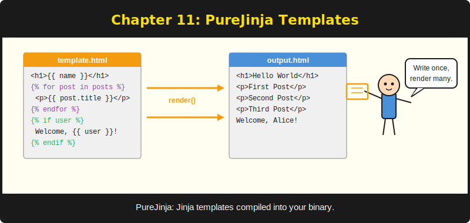
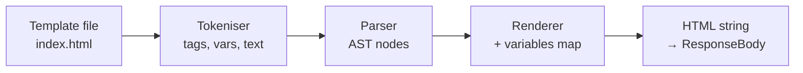

# Chapter 11: PureJinja -- Jinja Templates in PureBasic



*The template engine that speaks Python syntax and runs at C speed.*

---

**After reading this chapter you will be able to:**

- Write Jinja templates with variable output, conditionals, and loops
- Use template inheritance with `` and `` to eliminate HTML duplication
- Apply PureJinja's 34 built-in filters (plus 3 aliases) to transform data in templates
- Connect handlers to templates through `Rendering::Render` and the context KV store
- Understand PureJinja's render pipeline: tokenise, parse, and render

---

## 11.1 Why a Template Engine?

In Chapter 9, you saw `Rendering::HTML` sending raw HTML strings from handler code. That works for a health check page or a quick prototype. It does not work for a real application with a consistent layout, a navigation bar, a footer, and twenty pages that share the same chrome. Writing HTML inside PureBasic string concatenations is the programming equivalent of writing a novel on sticky notes -- technically possible, deeply uncomfortable, and impossible to maintain.

A template engine separates your HTML structure from your application logic. The handler prepares the data. The template defines the layout. The engine merges the two at render time. If you have used Jinja in Python, Django templates, Go's `html/template`, or Handlebars in JavaScript, the concept is identical. PureJinja happens to be compatible with Jinja syntax, which means Python developers can read PureSimple templates without learning anything new. PureBasic developers get a battle-tested template syntax without inventing their own.

PureJinja is a standalone repository (`github.com/Jedt3D/pure_jinja`) that compiles into the same binary as PureSimple. It has 34 built-in filters (plus 3 aliases), 599 tests, and zero runtime dependencies. It tokenises, parses, and renders templates at compiled-code speed. The templates look like Python Jinja. The execution speed looks like C. That combination is the whole point.

---

## 11.2 The Render Pipeline

Before diving into syntax, it helps to understand what happens when `Rendering::Render` calls PureJinja. The pipeline has three stages:


*Figure 11.1 -- PureJinja render pipeline: template file to HTML output*

1. **Tokenise.** The raw template string is split into tokens: text blocks, variable expressions (`{{ ... }}`), tag blocks (``), and comment blocks (`{# ... #}`). The tokeniser recognises opening and closing delimiters and classifies each chunk.

2. **Parse.** The token stream is converted into an abstract syntax tree (AST). `` blocks become conditional nodes with true and false branches. `` blocks become loop nodes with a body and an iterator variable. Variable expressions become output nodes with optional filter chains.

3. **Render.** The AST is walked depth-first. Text nodes emit their content directly. Variable nodes look up the variable name in the provided map, apply any filters, and emit the result. Conditional nodes evaluate their test expression and render the appropriate branch. Loop nodes iterate their collection and render the body once per item.

The template file is read from disk by `JinjaEnv::RenderTemplate`, which is called by `Rendering::Render`. The handler's KV store variables are converted to a PureJinja `JinjaVariant` map before rendering. After rendering, the environment and all variant objects are freed. The rendered HTML string is stored in `*C\ResponseBody`.

> **Under the Hood:** PureJinja creates and destroys a `JinjaEnvironment` on every `Rendering::Render` call. The environment holds the template path, the filter registry, and internal parser state. Creating it involves registering all 34 built-in filters (plus 3 aliases) (a loop of 36 map insertions). This is fast enough for typical web traffic. For high-throughput scenarios, a cache layer that reuses environments across requests would be a worthwhile optimisation. The framework does not provide one today, but the PureJinja API supports it -- you can create an environment once and render multiple templates through it.

---

## 11.3 Variable Output

The most basic template operation is printing a variable. Wrap it in double curly braces:

```html
<!-- Listing 11.1 -- Variable output in a template -->
<h1>{{ site_name }}</h1>
<p>Welcome to {{ site_name }}!</p>
```

The handler sets the variable using `Ctx::Set`:

```purebasic
; Listing 11.2 -- Setting template variables in a handler
Procedure HomeHandler(*C.RequestContext)
  Ctx::Set(*C, "site_name", "PureSimple Blog")
  Rendering::Render(*C, "index.html",
                    "templates/")
EndProcedure
```

When PureJinja encounters `{{ site_name }}`, it looks up `"site_name"` in the variables map and emits its string value. If the variable does not exist, PureJinja outputs an empty string. No error, no exception, no crash. Just silence. This is consistent with Jinja's default behavior in Python, and it means a typo in a variable name produces a blank spot on the page rather than a 500 error. Whether that is a feature or a bug depends on how you feel about silent failures at 2 AM.

---

## 11.4 Conditionals and Loops

Templates need logic. PureJinja supports ``, ``, ``, and `` for conditionals, and `` / `` for loops.

### Conditionals

```html
<!-- Listing 11.3 -- Conditional blocks -->

  <p>Hello, {{ user }}!</p>

  <p>Hello, guest!</p>

```

The `` tag evaluates its expression. Non-empty strings and non-zero numbers are truthy. Empty strings, zero, and undefined variables are falsy. This matches Jinja's truthiness rules.

### Loops

Loops iterate over collections. In PureJinja, the most common pattern is iterating over a string that has been split into a list using the `split` filter:

```html
<!-- Listing 11.4 -- Looping over a split string -->

  
    
    <article>
      <h2>
        <a href="/post/{{ parts[0] }}">
          {{ parts[1] }}
        </a>
      </h2>
      <p class="date">{{ parts[2] }}</p>
    </article>
  

```

This is the actual `index.html` template from the `examples/blog/` application. The handler builds a string of post data with tabs separating fields and newlines separating records, stores it in the context with `Ctx::Set(*C, "posts", titles)`, and the template unpacks it using `split('\n')` and `split('\t')`.

Why strings instead of objects? PureSimple's KV store is string-to-string. PureJinja variables are strings at the bridge layer. Passing structured data requires serialising it into a delimited string and deserialising it in the template. This is the trade-off for a simple, allocation-free KV store. You could also build a PureJinja variables map directly in your handler using the PureJinja API, bypassing `Rendering::Render` -- but the delimited-string pattern is simpler for most cases and keeps your handler code free of PureJinja dependencies.

You might look at `split('\t')` and think "that is an odd way to pass data to a template." You would be right. In Python or Go, you would pass a list of objects. In PureSimple, you pass a formatted string and let the template unpack it. It is the kind of pragmatic hack that makes a framework author wince and a shipping product possible.

---

## 11.5 Template Inheritance

Template inheritance is how you avoid copying your `<head>`, navigation, and footer into every page. You define a base template with named blocks, then child templates extend the base and override specific blocks.

Consider a base template:

```html
<!-- Listing 11.5 -- Base template with named blocks -->
<!-- templates/base.html -->
<!DOCTYPE html>
<html lang="en">
<head>
  <meta charset="UTF-8">
  <title>My Site</title>
</head>
<body>
  <nav>
    <a href="/">Home</a>
    <a href="/about">About</a>
  </nav>
  <main>
    
  </main>
  <footer>
    <p>Built with PureSimple</p>
  </footer>
</body>
</html>
```

A child template extends it:

```html
<!-- Listing 11.6 -- Child template overriding blocks -->
<!-- templates/about.html -->


About — My Site


<h1>About Us</h1>
<p>We build things with PureBasic.</p>

```

When PureJinja renders `about.html`, it loads `base.html` first, then overlays the child's block definitions. The result is the full base HTML with the `title` block replaced by "About -- My Site" and the `content` block replaced by the about page content. The navigation and footer come from the base template and are shared across all pages that extend it.

```mermaid
graph TD
  A["base.html<br/>&#123;% block title %&#125;<br/>&#123;% block content %&#125;"] --> B["index.html<br/>extends base.html"]
  A --> C["about.html<br/>extends base.html"]
  A --> D["post.html<br/>extends base.html"]

  style A fill:#4A90D9,color:#fff
```


*Figure 11.2 -- Template inheritance tree: one base template, multiple child pages*

> **Compare:** This is identical to Jinja template inheritance in Python Flask. The syntax is the same: ``, ``, ``. If you have written a Flask application, you can write PureSimple templates with zero new syntax to learn. The mental model transfers directly. The only difference is that the rendering happens inside a compiled PureBasic binary rather than a Python interpreter.

Change the navigation in `base.html`, and every page that extends it picks up the change. This is the single most important benefit of template inheritance. Without it, adding a menu item means editing every HTML file in your project. With it, you edit one file. Multiply that by the number of pages in your application, and template inheritance pays for itself before lunch.

---

## 11.6 Filters

Filters transform values in the template. They are applied with the pipe character:

```html
{{ name|upper }}
{{ description|truncate(100) }}
{{ items|length }}
{{ price|round(2) }}
```

PureJinja ships with 34 built-in filters (plus 3 aliases) (plus aliases). Here is a reference grouped by category:

**String filters:**
`upper`, `lower`, `title`, `capitalize`, `trim`, `replace`, `truncate`, `striptags`, `indent`, `wordwrap`, `center`, `escape` (alias: `e`), `safe`, `urlencode`, `split`

**Number filters:**
`int`, `float`, `abs`, `round`

**Collection filters:**
`length` (alias: `count`), `first`, `last`, `reverse`, `sort`, `join`, `unique`, `batch`, `list`, `map`, `items`

**Utility filters:**
`default` (alias: `d`), `string`, `wordcount`, `tojson`

Filters can be chained:

```html
<!-- Listing 11.7 -- Filter chaining -->
{{ name|lower|capitalize }}
{{ items|sort|join(', ') }}
{{ body|striptags|truncate(200) }}
```

The `default` filter is particularly useful for providing fallback values:

```html
<!-- Listing 11.8 -- The default filter -->
<title>{{ page_title|default('Home') }} — {{ site_name }}</title>
```

If `page_title` is empty or undefined, PureJinja substitutes `'Home'`. This saves you from setting a title variable in every single handler.

The `split` filter deserves special attention because it is central to PureSimple's data-passing pattern. Since the KV store passes all values as strings, complex data is encoded with delimiters and decoded in the template:

```html
<!-- Listing 11.9 -- The split filter for structured data -->

  <span class="tag">{{ tag|trim }}</span>

```

The handler sets `Ctx::Set(*C, "tags", "purebasic, web, framework")`, and the template splits it into individual tags. The `trim` filter cleans up any whitespace around the commas. It is string processing, but it is string processing that happens at compiled speed.

> **Tip:** The `escape` filter (or its alias `e`) converts `<`, `>`, `&`, `"`, and `'` to their HTML entity equivalents. Use it when displaying user-generated content to prevent cross-site scripting (XSS) attacks. The `safe` filter does the opposite -- it marks a string as safe for raw HTML output. Use `safe` only for content you control, never for user input. The rule is simple: if a user typed it, escape it.

---

## 11.7 Comments

Template comments are wrapped in `{# ... #}` and do not appear in the rendered output:

```html
{# This is a template comment -- invisible in the HTML #}
<h1>{{ title }}</h1>
{# TODO: add author byline #}
```

Comments are stripped during tokenisation. They cost nothing at render time. Use them freely for notes, TODOs, and explanations. The browser never sees them, and search engines never index them. They exist purely for the developer reading the template file.

---

## 11.8 Connecting Handlers to Templates

The bridge between PureBasic handler code and Jinja templates is `Rendering::Render`, which was introduced in Chapter 9. Here is the complete pattern:

```purebasic
; Listing 11.10 -- Full handler-to-template flow
Procedure PostHandler(*C.RequestContext)
  Protected slug.s = Binding::Param(*C, "slug")

  ; Look up the post (database, array, etc.)
  ; ...

  ; Set template variables via the KV store
  Ctx::Set(*C, "title",     postTitle)
  Ctx::Set(*C, "author",    postAuthor)
  Ctx::Set(*C, "date",      postDate)
  Ctx::Set(*C, "body",      postBody)
  Ctx::Set(*C, "site_name", Config::Get("SITE_NAME",
                              "My Blog"))

  ; Render the template
  Rendering::Render(*C, "post.html", "templates/")
EndProcedure
```

And the corresponding template:

```html
<!-- Listing 11.11 -- The post.html template -->
<!DOCTYPE html>
<html lang="en">
<head>
  <meta charset="UTF-8">
  <title>{{ title }} — {{ site_name }}</title>
</head>
<body>
  <nav><a href="/">Home</a></nav>
  <h1>{{ title }}</h1>
  <p class="meta">By {{ author }} on {{ date }}</p>
  <p class="body">{{ body }}</p>
</body>
</html>
```

The variable names in `Ctx::Set` must match the variable names in the template exactly. `Ctx::Set(*C, "title", ...)` maps to `{{ title }}`. Case matters. Spelling matters. There is no autocomplete, no type checking, and no compile-time validation that your handler sets every variable the template expects. The connection is a string-name contract between two files. A misspelled variable name in either file produces a blank spot on the page, not a compiler error.

This is the price of simplicity. The benefit is that templates are just files -- you can edit them without recompiling, share them with a designer who does not know PureBasic, and test them with sample data in a standalone PureJinja runner. The trade-off is worth it for most applications. For safety-critical rendering where a missing variable is a bug, add handler-side checks before calling `Render`.

Jinja templates are not just HTML with holes. They are a small programming language for presentation logic. Keep that logic small. If your template has more `` blocks than `<p>` tags, move the logic to the handler. The template's job is to present data, not to compute it. I have seen templates with nested conditional loops that would make a SQL query blush. Do not be that developer.

---

## Summary

PureJinja brings Jinja-compatible template syntax to PureBasic, running at compiled-code speed. Templates use `{{ variable }}` for output, `` / `` for logic, `` / `` for inheritance, and 34 built-in filters (plus 3 aliases) for data transformation. The `Rendering::Render` procedure bridges handlers and templates: the handler sets variables with `Ctx::Set`, and the template reads them by name. PureJinja's render pipeline tokenises, parses, and renders in a single pass through the template file, creating and freeing a `JinjaEnvironment` per request.

## Key Takeaways

- PureJinja uses standard Jinja syntax. If you know Python's Jinja or Flask templates, you already know PureJinja templates.
- Template inheritance (`` and ``) eliminates HTML duplication. Change the base template once, and every child page inherits the change.
- The `split` filter is essential in PureSimple because the KV store is string-to-string. Encode structured data with delimiters in the handler, and decode it with `split` in the template.
- Always use the `escape` filter (or `e`) when displaying user-generated content to prevent XSS attacks. Use `safe` only for content you trust completely.

## Review Questions

1. What is the difference between `{{ name|escape }}` and `{{ name|safe }}`? When would you use each one?
2. Explain how `Rendering::Render` converts the context KV store into PureJinja template variables. What is the data flow from handler to rendered HTML?
3. *Try it:* Create a base template with a `title` block and a `content` block. Create two child templates that extend it: one for a home page listing items from a comma-separated string (using `split`), and one for an about page with static content. Write handlers for both that set the appropriate variables and render the templates.
