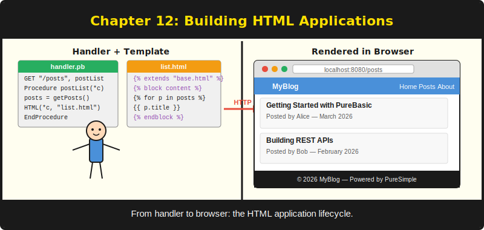

# Chapter 12: Building an HTML Application



*From empty directory to rendered pages in one sitting.*

---

**After reading this chapter you will be able to:**

- Structure an HTML web application with separate directories for source, templates, and static assets
- Build a base template and extend it with page-specific content
- Create a list page that iterates over data using PureJinja's `split` and `for` loop
- Create a detail page that displays a single item using route parameters
- Implement custom 404 and 500 error pages with PureJinja templates

---

## 12.1 Project Structure

Every PureSimple HTML application follows the same directory layout. The convention is not enforced by the framework -- you can put files wherever you like -- but following it makes your project readable to anyone who has seen a PureSimple application before. And since one of those people will be you in six months, that matters.

```
blog/
  main.pb              ; application entry point
  .env                 ; configuration (PORT, MODE, etc.)
  templates/
    index.html          ; home page template
    post.html           ; single post template
    about.html          ; about page template
  static/
    style.css           ; shared stylesheet (optional)
```

The `main.pb` file contains everything: structure definitions, data initialization, handler procedures, middleware registration, route registration, and the `Engine::Run` call. For a small application, a single file is fine. For a larger application, you would split handlers and data access into separate `.pbi` files and include them with `XIncludeFile`. But for a blog with four routes and three templates, a single file keeps everything visible without jumping between files.

The `templates/` directory holds your Jinja template files. `Rendering::Render` takes the template directory as a parameter, so you can name it anything you like, but `templates/` is the convention and the default.

The `static/` directory holds CSS, JavaScript, images, and other assets. PureSimpleHTTPServer serves static files directly when configured with `Engine::Static`. These files bypass the router and middleware chain entirely -- the HTTP server handles them at the transport level, which is both faster and more appropriate for content that does not change between requests.

> **Tip:** Keep templates in a dedicated directory with the `.html` extension. Your text editor will provide HTML syntax highlighting, and designers can work on them without needing PureBasic installed. The `{%` and `{{` delimiters are standard Jinja, which most editors recognize and highlight correctly.

---

## 12.2 The Application Entry Point

Let us walk through the `examples/blog/main.pb` file, which is a complete HTML application in 106 lines. It demonstrates every concept from Chapters 5 through 11: routing, binding, context, middleware, rendering, and templates.

The file starts with `EnableExplicit` and includes the framework:

```purebasic
; Listing 12.1 -- Blog application entry point
EnableExplicit
XIncludeFile "../../src/PureSimple.pb"
```

Then it defines a data structure for blog posts and initialises an in-memory array:

```purebasic
; Listing 12.2 -- Blog post structure and seed data
Structure BlogPost
  slug.s
  title.s
  author.s
  date.s
  body.s
EndStructure

Global Dim _Posts.BlogPost(2)

Procedure InitPosts()
  _Posts(0)\slug   = "hello-puresimple"
  _Posts(0)\title  = "Hello, PureSimple!"
  _Posts(0)\author = "Alice"
  _Posts(0)\date   = "2026-03-20"
  _Posts(0)\body   = "Welcome to the first post."

  _Posts(1)\slug   = "routing-in-purebasic"
  _Posts(1)\title  = "Routing in PureBasic"
  _Posts(1)\author = "Bob"
  _Posts(1)\date   = "2026-03-21"
  _Posts(1)\body   = "PureSimple uses a radix trie."

  _Posts(2)\slug   = "templates-with-purejinja"
  _Posts(2)\title  = "HTML Templates with PureJinja"
  _Posts(2)\author = "Alice"
  _Posts(2)\date   = "2026-03-22"
  _Posts(2)\body   = "PureJinja brings Jinja templates."
EndProcedure
```

This is an in-memory data store -- no database required. Chapter 13 replaces this with SQLite. For now, a fixed array of three posts is enough to demonstrate routing, binding, and template rendering. The `Dim _Posts.BlogPost(2)` creates three elements (indices 0 to 2), which is one of PureBasic's charming quirks: `Dim a(N)` creates N+1 elements, not N. If this catches you off guard, congratulations -- you are now a PureBasic developer.

---

## 12.3 The Home Page: List View

The home page handler builds a delimited string of post data and passes it to the template:

```purebasic
; Listing 12.3 -- Home page handler
Procedure HomeHandler(*C.RequestContext)
  Protected titles.s = ""
  Protected i.i
  For i = 0 To 2
    titles + _Posts(i)\slug + Chr(9) +
             _Posts(i)\title + Chr(9) +
             _Posts(i)\date + Chr(10)
  Next i
  Ctx::Set(*C, "posts", titles)
  Ctx::Set(*C, "site_name",
           Config::Get("SITE_NAME", "PureSimple Blog"))
  Rendering::Render(*C, "index.html",
                    "examples/blog/templates/")
EndProcedure
```

The handler encodes each post as a tab-separated line (`slug<TAB>title<TAB>date`) and separates posts with newlines. This delimited format is the bridge between PureBasic's typed structures and PureJinja's string-based variable system.

Before we look at the page templates, let us define a base template. All three HTML pages in this application share the same navigation bar, document structure, and footer. Rather than duplicating that boilerplate in every template, we use PureJinja's template inheritance: a base template defines the shared skeleton, and each page template extends it with page-specific content.

```html
<!-- Listing 12.4 -- base.html: shared layout with blocks -->
<!DOCTYPE html>
<html lang="en">
<head>
  <meta charset="UTF-8">
  <title>{{ site_name }}</title>
</head>
<body>
  <nav>
    <a href="/">Home</a>
    <a href="/about">About</a>
  </nav>

  

  <footer>
    <p>&copy; {{ site_name }}</p>
  </footer>
</body>
</html>
```

The `` and `` tags are extension points. Child templates override these blocks while inheriting everything else -- the `<!DOCTYPE>`, the `<nav>`, the `<footer>`. If a child template does not override a block, the base template's default content is used. For the title block, the default is the site name. For the content block, the default is empty.

This is the same inheritance model used by Django, Jinja, and Twig. If you have used any of those, the pattern is familiar. If you have not, the rule is simple: `` says "start with this template," and `` says "replace this section."

Now the index template extends the base and provides its own content:

```html
<!-- Listing 12.5 -- index.html with template inheritance -->


Home — {{ site_name }}


<h1>{{ site_name }}</h1>


  
    
    <article>
      <h2>
        <a href="/post/{{ parts[0] }}">
          {{ parts[1] }}
        </a>
      </h2>
      <p class="date">{{ parts[2] }}</p>
      <p>
        <a href="/post/{{ parts[0] }}">
          Read more
        </a>
      </p>
    </article>
  


```

The `` directive tells PureJinja to start with the base template and fill in the blocks. The `` overrides the page title. The `` provides the page body. The navigation and footer come from `base.html` automatically -- if you change the nav links in the base template, every page picks up the change.

Inside the content block, the `` loop iterates over each line. The `` guard skips empty lines (the trailing newline after the last post produces an empty final element). Inside the loop, `` splits each line into its tab-separated fields: `parts[0]` is the slug, `parts[1]` is the title, and `parts[2]` is the date.

This pattern -- encode in the handler, decode in the template -- appears throughout PureSimple applications. It is not elegant, but it is effective. The handler has access to typed structures and database queries. The template has access to string operations and HTML. The delimited string is the handshake between the two worlds.

> **Compare:** In a Python Flask application, you would pass a list of dictionaries: `render_template('index.html', posts=posts)`. In Go's Gin, you would pass a slice of structs: `c.HTML(200, "index.html", gin.H{"posts": posts})`. PureSimple's string-based approach is less convenient but avoids the need for runtime reflection or a complex serialisation layer. The trade-off is explicit in every handler, which means you always know exactly what data the template receives.

---

## 12.4 The Detail Page: Single Item View

The post detail handler extracts a slug from the URL, finds the matching post, and renders it:

```purebasic
; Listing 12.6 -- Post detail handler
Procedure PostHandler(*C.RequestContext)
  Protected slug.s = Binding::Param(*C, "slug")
  Protected i.i
  For i = 0 To 2
    If _Posts(i)\slug = slug
      Ctx::Set(*C, "title",  _Posts(i)\title)
      Ctx::Set(*C, "author", _Posts(i)\author)
      Ctx::Set(*C, "date",   _Posts(i)\date)
      Ctx::Set(*C, "body",   _Posts(i)\body)
      Ctx::Set(*C, "site_name",
               Config::Get("SITE_NAME",
                            "PureSimple Blog"))
      Rendering::Render(*C, "post.html",
                        "examples/blog/templates/")
      ProcedureReturn
    EndIf
  Next i
  Engine::HandleNotFound(*C)
EndProcedure
```

The handler loops through the posts array looking for a matching slug. When it finds one, it sets individual template variables for each field (`title`, `author`, `date`, `body`) and renders `post.html`. If no post matches the slug, it calls `Engine::HandleNotFound(*C)` to trigger the framework's 404 response.

Unlike the home page handler, which packs multiple posts into a single delimited string, the detail handler sets each field as a separate KV store entry. This is the simpler approach when you are displaying a single item with a fixed set of fields. The template reads each variable directly:

```html
<!-- Listing 12.7 -- post.html with template inheritance -->


{{ title }} — {{ site_name }}


  <h1>{{ title }}</h1>
  <p class="meta">By {{ author }} on {{ date }}</p>
  <p class="body">{{ body }}</p>

```

Clean, readable, and free of parsing logic. The navigation and document structure come from `base.html`. The post template only defines what is unique to this page: the title and the article content. For single-item pages, one variable per field is always the right choice. Save the `split` gymnastics for list pages where you need to pass multiple records.

---

## 12.5 Static Pages

Not every page needs dynamic data. The about page handler sets only the site name and renders a template with mostly static content:

```purebasic
; Listing 12.8 -- About page handler
Procedure AboutHandler(*C.RequestContext)
  Ctx::Set(*C, "site_name",
           Config::Get("SITE_NAME", "PureSimple Blog"))
  Rendering::Render(*C, "about.html",
                    "examples/blog/templates/")
EndProcedure
```

The template is plain HTML with one variable substitution:

```html
<!-- Listing 12.9 -- about.html with template inheritance -->


About — {{ site_name }}


<h1>About {{ site_name }}</h1>
<p>
  This blog is built with <strong>PureSimple</strong>,
  a lightweight web framework for PureBasic 6.x
  inspired by Go's Gin and Chi.
</p>
<p>
  Templates are rendered by PureJinja, a
  Jinja-compatible template engine written
  entirely in PureBasic.
</p>

```

Even static pages benefit from template inheritance. The about page inherits the navigation and footer from `base.html` and only defines its own title and content. The site name comes from configuration, so it can change without recompiling. The handler code does not need to know anything about the base template -- it sets the same variables regardless of whether the template uses inheritance or not.

---

## 12.6 Flash Messages

Web applications frequently need to show a one-time message after a redirect. The user submits a form, the handler processes it and redirects to another page, and that page displays "Post created!" or "Settings saved." The message appears once and disappears on the next page load. These are called flash messages.

The challenge is that a redirect is two separate requests. The handler that processes the form is one request. The page that displays the confirmation is a different request. The message must survive the redirect but not persist beyond it. Sessions solve this neatly.

The pattern is straightforward. Before redirecting, store the message in the session under a known key:

```purebasic
; Listing 12.10 -- Setting a flash message before redirect
Procedure CreatePostHandler(*C.RequestContext)
  ; ... process form data, insert into database ...
  Session::Set(*C, "_flash", "Post created!")
  Rendering::Redirect(*C, "/", 302)
EndProcedure
```

In the handler that renders the destination page, retrieve the flash message, pass it to the template, and then clear it so it does not appear again:

```purebasic
; Listing 12.11 -- Reading and clearing a flash message
Procedure HomeHandler(*C.RequestContext)
  Protected flash.s = Session::Get(*C, "_flash")
  If flash <> ""
    Ctx::Set(*C, "flash", flash)
    Session::Set(*C, "_flash", "")  ; clear after reading
  EndIf
  ; ... prepare other template data ...
  Rendering::Render(*C, "index.html",
                    "examples/blog/templates/")
EndProcedure
```

The template checks for the flash variable and renders it when present:

```html

<div class="alert">{{ flash }}</div>

```

The `_flash` key is a convention, not a framework feature. You can use any key name you like. The underscore prefix signals that it is a framework-level concern rather than application data, matching the `_psid` and `_auth_user` conventions used elsewhere in PureSimple.

This pattern works because sessions persist across requests. The first request writes the message. The redirect triggers a second request. The second request reads the message, passes it to the template, and clears it. Any subsequent request finds the `_flash` key empty and renders no message.

> **Note:** Sessions are covered in depth in Chapter 15. For now, all you need to know is that `Session::Set` stores a value that persists across requests for the same user, and `Session::Get` retrieves it. The session middleware must be registered before any handlers that use flash messages.

---

## 12.7 Error Pages: 404 and 500

Every application needs error pages. The default PureSimple error pages live in `templates/404.html` and `templates/500.html` and are rendered by the framework when no route matches (404) or when a handler crashes (500).

The 404 template uses a `{{ request.path }}` variable to show the user which URL they tried:

```html
<!-- Listing 12.12 -- The default 404.html template -->
<!DOCTYPE html>
<html lang="en">
<head>
  <meta charset="UTF-8">
  <title>404 Not Found — PureSimple</title>
</head>
<body>
  <h1>404</h1>
  <h2>Page Not Found</h2>
  <p>
    The page you requested —
    <code>{{ request.path }}</code> —
    does not exist.
  </p>
  <p><a href="/">Go home</a></p>
</body>
</html>
```

The `{{ request.path }}` variable does not appear by magic. The framework's 404 handler sets it before rendering the template:

```purebasic
; Listing 12.13 -- The 404 handler that sets request.path
Procedure HandleNotFound(*C.RequestContext)
  Ctx::Set(*C, "request.path", SafeVal(*C\Path))
  Rendering::Render(*C, "404.html", "templates/")
EndProcedure
```

The `SafeVal` call HTML-escapes the path to prevent cross-site scripting -- without it, an attacker could craft a URL containing `<script>` tags that would execute in the user's browser when the 404 page renders.

The 500 template includes a conditional debug section:

```html
<!-- Listing 12.14 -- The default 500.html template -->
<!DOCTYPE html>
<html lang="en">
<head>
  <meta charset="UTF-8">
  <title>500 Internal Server Error — PureSimple</title>
</head>
<body>
  <h1>500</h1>
  <h2>Internal Server Error</h2>
  <p>Something went wrong on our end.</p>
  
  <pre>{{ error }}</pre>
  
  <p><a href="/">Go home</a></p>
</body>
</html>
```

The `` block shows the error message only when the application runs in debug mode. In production, users see a clean error page without technical details. This is both a security practice (error messages can leak internal structure) and a user experience decision (stack traces scare normal people).

> **Warning:** Never expose error details in production. The `` pattern ensures that `{{ error }}` only renders when `Engine::SetMode("debug")` is active. In release mode, the error is logged to the server console but hidden from the user. If you are tempted to remove the `` check to "help with debugging in production," resist the temptation. Use `Log::Error` instead, and read your logs like a professional.

Custom error pages should match your application's visual design. A 404 page that looks like the rest of your site reassures users they are in the right place. A 404 page that looks like a default server error makes them wonder if the entire site is broken. The difference is ten minutes of HTML and a lifetime of first impressions.

---

## 12.8 Bootstrapping the Application

The bootstrap section at the bottom of `main.pb` ties everything together:

```purebasic
; Listing 12.15 -- Application bootstrap
InitPosts()
Config::Load(".env")
Protected port.i = Config::GetInt("PORT", 8080)
Engine::SetMode(Config::Get("MODE", "debug"))

Engine::Use(@Logger::Middleware())
Engine::Use(@Recovery::Middleware())

Engine::GET("/",            @HomeHandler())
Engine::GET("/post/:slug",  @PostHandler())
Engine::GET("/about",       @AboutHandler())
Engine::GET("/health",      @HealthHandler())

Log::Info("Blog starting on :" + Str(port) +
          " [" + Engine::Mode() + "]")
Engine::Run(port)
```

The sequence is: initialise data, load configuration, set the run mode, register global middleware, register routes, log a startup message, and start the server. This ordering is not arbitrary. Middleware must be registered before routes because `Engine::Use` adds to a global middleware list that is combined with route handlers at dispatch time. Configuration must be loaded before middleware and routes that depend on config values.

The `HealthHandler` returns a JSON response rather than HTML:

```purebasic
; Listing 12.16 -- Health check handler
Procedure HealthHandler(*C.RequestContext)
  Rendering::JSON(*C, ~"{\"status\":\"ok\"}")
EndProcedure
```

Every production application needs a health check. Load balancers, monitoring systems, and deploy scripts poll this endpoint to verify the application is running. A health check that returns JSON is both machine-readable and human-readable. A health check that renders an HTML template is a health check that can fail because of a template parsing error, which defeats the entire purpose. Keep health checks simple. Keep them free of dependencies. Keep them boring. Boring health checks are the best health checks, because they are the ones that never lie to you.

---

## 12.9 Running the Application

Compile and run:

```bash
# Listing 12.17 -- Compiling and running the blog
$PUREBASIC_HOME/compilers/pbcompiler \
  examples/blog/main.pb -cl -o blog

./blog
```

Open `http://localhost:8080/` in your browser. You will see the home page with three blog posts. Click a post title to view the detail page. Click "About" to view the about page. Visit a non-existent URL like `/nope` to see the 404 page.

The entire application -- web server, router, middleware, template engine, and all three blog posts -- compiles to a single binary. No `node_modules`. No virtualenv. No Docker container. No runtime. Just a file you can copy to any machine with the same operating system and run. Your React app has more configuration files than this application has source files.

---

## Summary

An HTML application in PureSimple follows a straightforward structure: a `main.pb` entry point, a `templates/` directory for Jinja templates, and optionally a `static/` directory for CSS and assets. Handlers prepare data using the context KV store and render templates with `Rendering::Render`. List pages use the `split` pattern to pass multiple records as delimited strings. Detail pages set individual variables for each field. Error pages (404 and 500) use conditional blocks to show debug information only in development mode. The bootstrap section loads configuration, registers middleware and routes, and starts the server in a fixed, deterministic order.

## Key Takeaways

- Structure your project with `main.pb` at the root, `templates/` for HTML files, and `static/` for assets. The convention is not enforced but is universally understood.
- Use the `split` pattern for list pages: encode records as delimited strings in the handler, decode them with `split('\n')` and `split('\t')` in the template.
- For detail pages, set each field as a separate KV store entry rather than encoding everything into a single string.
- Always provide custom 404 and 500 error pages. Use `` to hide technical details in production.

## Review Questions

1. Why does the home page handler encode post data as a tab-and-newline-delimited string instead of passing a structured object to the template?
2. What is the purpose of `Engine::HandleNotFound(*C)` in the post detail handler, and what happens when it is called?
3. *Try it:* Add a "tags" field to the `BlogPost` structure and seed each post with two or three comma-separated tags. Modify the `post.html` template to display the tags as a list using `split(',')`. Modify the home page template to show the first tag next to each post title.
