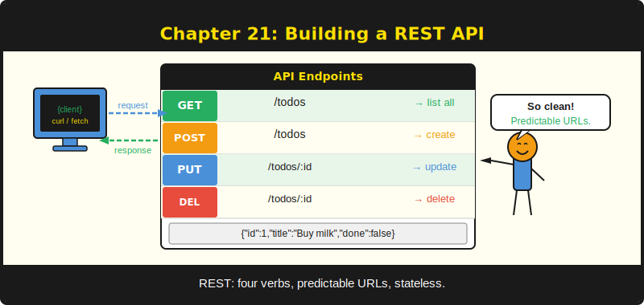

# Chapter 21: Building a REST API -- To-Do List



*Your first API, from scaffold to curl, in one chapter.*

---

**After reading this chapter you will be able to:**

- Scaffold a new PureSimple project with `scripts/new-project.sh`
- Implement a complete JSON CRUD API with in-memory storage
- Validate incoming request data and return structured error responses
- Test every endpoint with `curl` from the command line
- Add authentication middleware to protect write operations

---

## 21.1 The Scaffold

Every building project starts with a foundation, and every PureSimple project starts with a scaffold. The framework ships with a shell script that creates a ready-to-compile project in one command. No generators that pull half the internet. No YAML configuration files. A bash script that writes a `main.pb`, a `.env`, a `.gitignore`, and a starter template.

Listing 21.1 -- Scaffolding a new project

```bash
./scripts/new-project.sh todo
```

That command creates the following structure:

```
todo/
  main.pb            -- entry point with routes, config, and logging
  .env               -- local environment variables (not committed)
  .env.example       -- documented example for version control
  .gitignore         -- excludes compiled output and .env
  templates/
    index.html       -- starter Jinja HTML template
  static/            -- placeholder for static assets
```

The generated `main.pb` already includes PureSimple, loads the `.env` file, registers Logger and Recovery middleware, and wires up a health check endpoint. You get a compilable, runnable web app before you write a single line of application code.

```purebasic
; Listing 21.2 -- Generated main.pb (from new-project.sh)
EnableExplicit

XIncludeFile "../../src/PureSimple.pb"

; Load .env configuration
If Config::Load(".env")
  Log::Info(".env loaded")
Else
  Log::Warn("No .env file found -- using built-in defaults")
EndIf

Protected port.i = Config::GetInt("PORT", 8080)
Protected mode.s = Config::Get("MODE", "debug")
Engine::SetMode(mode)

; ---- Global middleware ----
Engine::Use(@Logger::Middleware())
Engine::Use(@Recovery::Middleware())

; ---- Routes ----
Engine::GET("/", @IndexHandler())
Engine::GET("/health", @HealthHandler())

Log::Info("Starting todo on :" + Str(port) +
          " [" + Engine::Mode() + "]")
Engine::Run(port)
```

The scaffold writes the `XIncludeFile` path relative to where the new project sits. If your `todo/` directory is inside the PureSimple repo under `examples/`, the path will be `../../src/PureSimple.pb`. If you placed it as a sibling directory, the script computes the relative path with Python's `os.path.relpath`. One less thing to get wrong.

> **Tip:** The `.env.example` file is meant to be committed to version control. The `.env` file is not. This follows the twelve-factor app convention described in Chapter 18. Your future self will thank you when you deploy to a server and can't remember which environment variables the app expects.

---

## 21.2 Data Model: The In-Memory Store

A REST API needs data. For a to-do list, the data model is almost insultingly simple: each item has an ID, a title, and a done flag. There is no database in this chapter -- we store everything in a PureBasic linked list. This is deliberate. The goal is to learn routing, binding, and rendering without the distraction of SQL. Chapter 13 handles databases. Chapter 22 combines both.

```purebasic
; Listing 21.3 -- In-memory to-do store
Structure TodoItem
  id.i
  title.s
  done.i
EndStructure

Global NewList _Todos.TodoItem()
Global _NextID.i = 1
```

The `_NextID` counter increments with every new item. This is not how you generate IDs in a production system -- a database would handle that with `AUTOINCREMENT`. But for an in-memory demo, it works. And unlike UUIDs, you can type `curl localhost:8080/todos/3` without copy-pasting a 36-character string.

If you restart the app, everything is gone. In-memory storage has the lifespan of the process. This is a feature for learning and a bug for production. Accept the trade-off and move on.

> **Compare:** In Go's Gin framework, you'd typically store in-memory data in a `sync.Map` for thread safety. PureSimple's HTTP server is single-threaded by default, so a plain `NewList` works. If you enable threading with `-t`, you would need to add mutex protection.

---

## 21.3 JSON Helpers

Before we write handlers, we need a way to turn a `TodoItem` into JSON. PureBasic has a built-in JSON library, but for simple structures, manual string building is often clearer and faster. The to-do app uses two helper procedures: one for a single item and one for the full list.

```purebasic
; Listing 21.4 -- JSON serialization helpers
Procedure.s TodoJSON(*T.TodoItem)
  Protected done.s = "false"
  If *T\done : done = "true" : EndIf
  ProcedureReturn "{" +
    ~"\"id\":"    + Str(*T\id)      + "," +
    ~"\"title\":" + Chr(34) + *T\title + Chr(34) + "," +
    ~"\"done\":"  + done +
  "}"
EndProcedure

Procedure.s AllTodosJSON()
  Protected out.s = "["
  Protected first.i = #True
  ForEach _Todos()
    If Not first : out + "," : EndIf
    out + TodoJSON(_Todos())
    first = #False
  Next
  ProcedureReturn out + "]"
EndProcedure
```

Notice the `~"\"id\":"` syntax. The `~` prefix enables escape sequences, so `\"` produces a literal double quote. Without the prefix, PureBasic interprets `"` as a string terminator and the compiler complains. This is the kind of thing you learn once and never forget, mostly because the error message is unhelpful.

The `AllTodosJSON` procedure uses a `first` flag to avoid a leading comma. You could also build the string, then strip the trailing comma. Or you could join with a separator. PureBasic does not have a built-in `join()` for lists, so the flag approach is the idiomatic way. It also happens to be exactly how Go's `json.Marshal` handles arrays internally, just with more layers of abstraction.

> **PureBasic Gotcha:** The `Chr(34)` call produces a double-quote character. You could also use `~"\""` inside an escape-enabled string, but mixing `~""` strings with `Chr()` calls is a common pattern when the quoting gets complex. Choose whichever keeps you sane.

---

## 21.4 CRUD Handlers

REST APIs follow a predictable pattern: Create, Read, Update, Delete. The to-do app implements four of the five standard operations (we skip Update for brevity -- adding a `PUT /todos/:id` handler is left as a review exercise).

Each handler is a procedure that takes a `*C.RequestContext` pointer. This is the universal handler signature in PureSimple, identical to the middleware signature. The framework does not distinguish between the two. A handler is just the last function in the chain.

```purebasic
; Listing 21.5 -- List all to-dos (GET /todos)
Procedure ListTodos(*C.RequestContext)
  Rendering::JSON(*C, AllTodosJSON())
EndProcedure
```

One line. The `Rendering::JSON` procedure sets the `Content-Type` header to `application/json`, writes the body, and sets the status code to 200. If you want a different status code, pass it as the third argument.

```purebasic
; Listing 21.6 -- Create a to-do (POST /todos)
Procedure CreateTodo(*C.RequestContext)
  Binding::BindJSON(*C)
  Protected title.s = Binding::JSONString(*C, "title")
  Binding::ReleaseJSON(*C)
  If title = ""
    Ctx::AbortWithError(*C, 400,
      ~"{\"error\":\"title is required\"}")
    ProcedureReturn
  EndIf
  AddElement(_Todos())
  _Todos()\id    = _NextID
  _Todos()\title = title
  _Todos()\done  = #False
  _NextID + 1
  Rendering::JSON(*C, TodoJSON(_Todos()), 201)
EndProcedure
```

This handler demonstrates the full request binding cycle from Chapter 8: call `Binding::BindJSON` to parse the body, extract fields with `Binding::JSONString`, then release the parsed JSON with `Binding::ReleaseJSON`. The release step is not optional. PureBasic's JSON parser allocates memory, and `ReleaseJSON` frees it. Skip it and you leak memory on every request. In a to-do app that handles ten requests a day, you will never notice. In a production API, you will.

The validation is minimal but present: if the title is empty, we abort with a 400 status and a JSON error body. `Ctx::AbortWithError` both sets the response and stops the handler chain -- no further middleware will execute after it.

On success, we return 201 Created with the new item's JSON. This follows the REST convention that POST returns the created resource.

```purebasic
; Listing 21.7 -- Get and delete a single to-do
Procedure GetTodo(*C.RequestContext)
  Protected id.i = Val(Binding::Param(*C, "id"))
  ForEach _Todos()
    If _Todos()\id = id
      Rendering::JSON(*C, TodoJSON(_Todos()))
      ProcedureReturn
    EndIf
  Next
  Ctx::AbortWithError(*C, 404,
    ~"{\"error\":\"not found\"}")
EndProcedure

Procedure DeleteTodo(*C.RequestContext)
  Protected id.i = Val(Binding::Param(*C, "id"))
  ForEach _Todos()
    If _Todos()\id = id
      DeleteElement(_Todos())
      Rendering::Status(*C, 204)
      ProcedureReturn
    EndIf
  Next
  Ctx::AbortWithError(*C, 404,
    ~"{\"error\":\"not found\"}")
EndProcedure
```

Both handlers extract the `:id` route parameter with `Binding::Param` and convert it to an integer with `Val()`. The `ForEach` loop is a linear scan through the linked list. For three to-do items, this is fine. For three thousand, you would want a map. For thirty thousand, you would want a database. Know your data volumes.

The delete handler returns 204 No Content -- the HTTP way of saying "it's done, and there's nothing more to tell you." `Rendering::Status` sets the status code without writing a body.

> **Warning:** `Val()` returns 0 for non-numeric strings. If someone sends `GET /todos/abc`, the `id` will be 0, which won't match any item, and they'll get a 404. This is acceptable behavior, but in a production API you might want to validate the parameter format and return 400 explicitly.

---

## 21.5 Route Registration and Boot

With the handlers written, wiring them to routes is five lines:

```purebasic
; Listing 21.8 -- Route registration and app boot
Config::Load(".env")
Protected port.i = Config::GetInt("PORT", 8080)
Engine::SetMode(Config::Get("MODE", "debug"))

Engine::Use(@Logger::Middleware())
Engine::Use(@Recovery::Middleware())

Engine::GET("/todos",        @ListTodos())
Engine::POST("/todos",       @CreateTodo())
Engine::GET("/todos/:id",    @GetTodo())
Engine::DELETE("/todos/:id", @DeleteTodo())
Engine::GET("/health",       @HealthCheck())

Log::Info("Todo API starting on :" + Str(port) +
          " [" + Engine::Mode() + "]")
Engine::Run(port)
```

The `@` operator takes the address of a procedure. PureSimple stores these addresses in the route table and calls them through a `Prototype.i` function pointer when a request matches. This is the same mechanism described in Chapter 5 (Routing) and Chapter 6 (The Request Context).

Logger and Recovery middleware run on every request, in that order. Logger records the method, path, status code, and response time. Recovery catches runtime errors and returns a 500 response instead of crashing the process. These two middleware are the minimum viable safety net for any PureSimple application.

---

## 21.6 Testing with curl

The API is running. Time to test it. `curl` is the universal API testing tool -- it ships with every macOS and Linux system, and it prints exactly what the server sends.

Listing 21.9 -- Testing the to-do API with curl

```bash
# Health check
curl http://localhost:8080/health
# {"status":"ok"}

# Create two to-dos
curl -X POST http://localhost:8080/todos \
  -H "Content-Type: application/json" \
  -d '{"title":"Write Chapter 21"}'
# {"id":1,"title":"Write Chapter 21","done":false}

curl -X POST http://localhost:8080/todos \
  -H "Content-Type: application/json" \
  -d '{"title":"Review Chapter 21"}'
# {"id":2,"title":"Review Chapter 21","done":false}

# List all
curl http://localhost:8080/todos
# [{"id":1,"title":"Write Chapter 21","done":false},
#  {"id":2,"title":"Review Chapter 21","done":false}]

# Get one
curl http://localhost:8080/todos/1
# {"id":1,"title":"Write Chapter 21","done":false}

# Delete one
curl -X DELETE http://localhost:8080/todos/1
# (204 No Content -- empty response)

# Verify it's gone
curl http://localhost:8080/todos/1
# {"error":"not found"}
```

Each `curl` invocation is a complete HTTP request-response cycle. The Logger middleware prints a line for each one, so you can watch the terminal while testing. If something goes wrong, the Recovery middleware catches the error and returns JSON instead of letting the process crash.

This is what a REST API looks like before frameworks convinced everyone it needed 200 dependencies, a build step, and a Docker container. Seventy lines of PureBasic, compiled in under a second, serving JSON from memory at speeds that would make your Node.js server quietly jealous.

> **Tip:** If you want to format the JSON output for readability, pipe curl through `jq`: `curl http://localhost:8080/todos | jq .` The `jq` tool is not installed by default on all systems, but it is available through every package manager. It is also, somewhat ironically, a single binary.

---

## 21.7 Adding Authentication

The to-do API as written is completely open. Anyone who can reach the port can create and delete items. For a local demo, this is fine. For anything else, you need authentication.

PureSimple provides BasicAuth middleware out of the box (Chapter 16). Adding it to the to-do API takes three lines. But rather than protecting every route, let's protect only the write operations -- POST and DELETE -- by creating a route group.

```purebasic
; Listing 21.10 -- Adding BasicAuth to write operations
BasicAuth::SetCredentials("admin", "secret")

; Public routes (no auth required)
Engine::GET("/todos",     @ListTodos())
Engine::GET("/todos/:id", @GetTodo())
Engine::GET("/health",    @HealthCheck())

; Protected routes (BasicAuth required)
Define writeGrp.PS_RouterGroup
Group::Init(@writeGrp, "/todos")
Group::Use(@writeGrp, @_BasicAuthMW())
Group::POST(@writeGrp, "",     @CreateTodo())
Group::DELETE(@writeGrp, "/:id", @DeleteTodo())
```

Now `GET /todos` and `GET /todos/:id` work without credentials, but `POST /todos` and `DELETE /todos/:id` require a valid `Authorization` header. This is the route group pattern from Chapter 10 applied to a practical problem: different security requirements for different operations.

Test it:

```bash
# This still works without auth
curl http://localhost:8080/todos

# This now requires auth
curl -X POST http://localhost:8080/todos \
  -H "Content-Type: application/json" \
  -d '{"title":"Test auth"}'
# 401 Unauthorized

# With credentials
curl -X POST http://localhost:8080/todos \
  -u admin:secret \
  -H "Content-Type: application/json" \
  -d '{"title":"Test auth"}'
# {"id":1,"title":"Test auth","done":false}
```

The `-u` flag in curl sends the username and password as a Base64-encoded `Authorization: Basic` header. The browser does the same thing when it shows you that ugly built-in login dialog.

---

## Summary

A REST API in PureSimple is a set of handler procedures registered to HTTP method and path combinations. Request data comes in through `Binding::BindJSON` and `Binding::Param`. Responses go out through `Rendering::JSON` and `Rendering::Status`. The scaffolding script eliminates boilerplate. Authentication is a middleware applied to a route group. The entire to-do API compiles to a single binary under 2 MB.

## Key Takeaways

- Use `scripts/new-project.sh` to scaffold a project with config, templates, and middleware already wired up.
- Always call `Binding::ReleaseJSON` after extracting fields from a JSON request body -- PureBasic's JSON parser allocates memory that must be freed.
- Return appropriate HTTP status codes: 200 for success, 201 for creation, 204 for deletion, 400 for bad input, 404 for missing resources.

## Review Questions

1. Why does the `CreateTodo` handler call `Binding::ReleaseJSON` even though the request is small? What would happen if you skipped it?
2. The to-do app uses a linked list (`NewList`) for storage. What data structure would you switch to for O(1) lookups by ID, and which PureBasic keyword creates it?
3. *Try it:* Add a `PUT /todos/:id` handler that updates the `title` and `done` fields of an existing to-do item. Test it with `curl -X PUT`.
