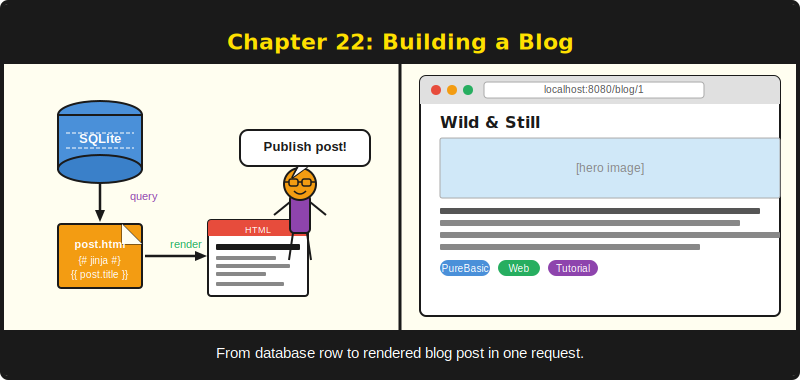
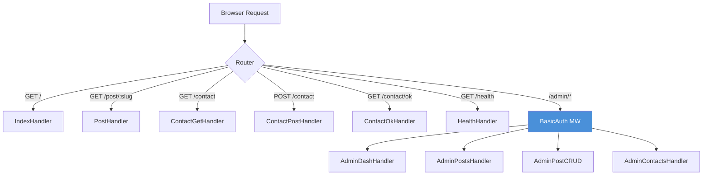

# Chapter 22: Building a Blog -- Wild & Still



*596 lines of PureBasic. One binary. A production blog.*

---

**After reading this chapter you will be able to:**

- Design a route map that separates public and admin concerns using route groups
- Build a migration-driven SQLite schema with seed data for a content-rich application
- Implement the pipe-delimited string pattern for passing structured data from handlers to PureJinja templates
- Create a full admin CRUD interface protected by BasicAuth
- Apply the Post/Redirect/Get (PRG) pattern to prevent duplicate form submissions

---

## 22.1 Why This Chapter Matters

This is the capstone chapter. Every concept from the previous twenty-one chapters converges here. Routing (Chapter 5), the request context (Chapter 6), middleware (Chapter 7), request binding (Chapter 8), response rendering (Chapter 9), route groups (Chapter 10), PureJinja templates (Chapter 11), SQLite (Chapter 13), database patterns (Chapter 14), authentication (Chapter 16), configuration (Chapter 18) -- all of them appear in a single, working application.

The application is called *Wild & Still*. It is a nature photography blog. It has a public-facing site using the Massively HTML5 UP theme, an admin panel using the Tabler UI kit, a SQLite database with ten migrations, five seed posts with real prose, a contact form with server-side validation, and a health check endpoint. It runs on a production server behind Caddy, serves HTTPS, and is deployed with a single shell script.

596 lines of PureBasic. One binary. A production blog. Your React app has more lines in its webpack config.

The complete source lives at `examples/massively/main.pb` in the PureSimple repository. This chapter walks through every section of that file, explains why each piece exists, and connects it to the chapter where the underlying concept was first introduced. If you have been reading linearly, this chapter is the payoff. If you jumped straight here, the cross-references will tell you where to look when something is unfamiliar.

---

## 22.2 Architecture Overview

Before we read the code, let's look at the route map. The blog has two audiences: readers who visit the public site, and the author who manages content through the admin panel. Each audience has its own set of routes, its own templates, and its own middleware requirements.


*Figure 22.1 -- Blog route map. Public routes pass through Logger and Recovery middleware only. Admin routes additionally pass through BasicAuth.*

The public side has six routes. The admin side has nine. All fifteen routes compile into one binary, served by one process, backed by one SQLite file. The total memory footprint at idle is what most frameworks use for their configuration parser.

> **Under the Hood:** PureSimple's router stores each route in a radix trie, one trie per HTTP method. The fifteen routes in the blog produce six trie nodes for GET and four for POST. The entire route table fits in a few hundred bytes of memory.

---

## 22.3 Project Structure

The blog follows the same layout that `scripts/new-project.sh` creates, with additions for the database and the two template themes:

```
examples/massively/
  main.pb                    -- the complete application
  .env                       -- PORT, MODE, ADMIN_USER, ADMIN_PASS
  .env.example               -- documented template
  db/
    blog.db                  -- SQLite database (auto-created)
  templates/
    base.html                -- Massively theme layout
    index.html               -- post list page
    post.html                -- single post page
    contact.html             -- contact form
    contact_ok.html          -- thank-you page
    404.html                 -- custom not-found page
    admin/
      dashboard.html         -- admin dashboard (Tabler)
      posts.html             -- post management table
      post_form.html         -- create/edit post form
      contacts.html          -- contact inbox
  static/
    css/                     -- Massively CSS + FontAwesome
    js/                      -- jQuery + Massively JS
    images/                  -- background images
    webfonts/                -- FontAwesome web fonts
```

The entire application is one file: `main.pb`. There is no MVC directory structure, no model layer, no controller folder, no service abstraction. For a blog with fifteen routes, one file is the right amount of architecture. When the file grows past a thousand lines, split it. Until then, one file means one place to look.

> **Tip:** The `.env` file controls the admin credentials. In production, set `ADMIN_USER` and `ADMIN_PASS` to something other than `admin`/`changeme`. This is the "do as I say, not as I demo" paragraph.

---

## 22.4 Globals and Helpers

The file begins with two globals and a collection of helper procedures that the handlers depend on.

```purebasic
; Listing 22.1 -- From examples/massively/main.pb: globals
EnableExplicit

XIncludeFile "../../src/PureSimple.pb"

Global _db.i
Global _tplDir.s = "examples/massively/templates/"
```

`_db` holds the SQLite database handle, returned by `DB::Open`. Every handler that touches the database references this global. `_tplDir` is the path to the template directory, passed to `Rendering::Render` in every handler that renders HTML. Both are globals because PureBasic handler procedures cannot receive custom arguments -- the only parameter is `*C.RequestContext`.

This is a constraint worth understanding. In Go, you would create a struct with a `db` field and attach handler methods to it. In PureBasic, you use globals or the KV store on the context. Globals work when you have one database and one template directory. The KV store works when different routes need different values. The blog uses globals because the values never change after startup.

### The SafeVal Function

```purebasic
; Listing 22.2 -- SafeVal: sanitizing values for the KV store
Procedure.s SafeVal(s.s)
  ProcedureReturn ReplaceString(s, Chr(9), " ")
EndProcedure
```

This three-line procedure prevents a subtle and vicious bug. The KV store on `RequestContext` uses the Tab character (`Chr(9)`) as a delimiter between keys and values in its internal string representation. If a database value contains a tab character -- and user-submitted text absolutely can -- the KV store will corrupt its own parsing. `SafeVal` replaces tabs with spaces before any value enters the store.

> **Under the Hood:** The KV store is a single string, not a hash map. Each key-value pair is stored as `key\tvalue\n`. This design keeps `RequestContext` allocation-free (no map to create or destroy per request), but it means the delimiter character is load-bearing. A tab in a value splits the value in half. `SafeVal` is the fix.

Three lines of code. One bug prevented. This is the kind of function that earns its place by the damage it prevents, not by the work it does.

### SetSiteVars: Injecting Global Template Variables

```purebasic
; Listing 22.3 -- SetSiteVars: loading site settings into the context
Procedure SetSiteVars(*C.RequestContext)
  Protected siteName.s = "Wild & Still"
  Protected tagline.s  = "One frame. One story."

  If DB::Query(_db,
    "SELECT value FROM site_settings " +
    "WHERE key = 'site_name'")
    If DB::NextRow(_db)
      siteName = DB::GetStr(_db, 0)
    EndIf
    DB::Done(_db)
  EndIf
  If DB::Query(_db,
    "SELECT value FROM site_settings " +
    "WHERE key = 'tagline'")
    If DB::NextRow(_db)
      tagline = DB::GetStr(_db, 0)
    EndIf
    DB::Done(_db)
  EndIf
  Ctx::Set(*C, "site_name", SafeVal(siteName))
  Ctx::Set(*C, "tagline",   SafeVal(tagline))
EndProcedure
```

Every public page needs the site name and tagline for the header. Rather than hardcoding these values in every handler, `SetSiteVars` queries the `site_settings` table and injects the results into the context. If the database query fails or the rows don't exist, the procedure falls back to hardcoded defaults. This is defensive programming: the blog still renders even if the settings table is empty.

The pattern -- default value, overridden by database lookup -- appears throughout the blog. It makes the application resilient to partial data states, which is particularly useful during development when you might run the app before all migrations have completed.

### PostsToStr: The Pipe-Delimited Data Pattern

This is the most important helper in the file, and it introduces a pattern unique to PureSimple's template integration.

```purebasic
; Listing 22.4 -- PostsToStr: structured data as a delimited string
Procedure.s PostsToStr()
  Protected result.s = ""
  If DB::Query(_db,
    "SELECT id, slug, title, published_at, " +
    "photo_url, excerpt, published" +
    " FROM posts WHERE published = 1 " +
    "ORDER BY published_at DESC")
    While DB::NextRow(_db)
      result +
        SafeVal(DB::GetStr(_db, 0)) + "|" +
        SafeVal(DB::GetStr(_db, 1)) + "|" +
        SafeVal(DB::GetStr(_db, 2)) + "|" +
        SafeVal(DB::GetStr(_db, 3)) + "|" +
        SafeVal(DB::GetStr(_db, 4)) + "|" +
        SafeVal(DB::GetStr(_db, 5)) + "|" +
        SafeVal(DB::GetStr(_db, 6)) + Chr(10)
    Wend
    DB::Done(_db)
  EndIf
  ProcedureReturn result
EndProcedure
```

The KV store passes data to PureJinja templates as strings. There is no native way to pass a list of objects. The workaround: serialize the data as a multi-line string where each line represents one row, and pipe characters separate the fields. The template then uses PureJinja's `split` filter to reconstruct the structure.

Each line follows the format: `id|slug|title|published_at|photo_url|excerpt|published`. The `Chr(10)` at the end of each line is a newline character, separating rows. PureJinja splits on `\n` to get lines, then splits each line on `|` to get fields.

This is not elegant. It is not how you would design a data transfer mechanism if you were starting from scratch. It is how you solve the problem when your template engine operates on strings and your context store is a flat key-value map. And it works. It has worked in production since the blog launched. Sometimes the pragmatic solution is the right solution.

> **Compare:** In Go's `html/template`, you pass a slice of structs directly to `Execute`. In Python's Jinja, you pass a list of dictionaries. In PureSimple, you pass a pipe-delimited string and `split` it in the template. Different rivers, same ocean. The blog posts still appear on the page.

The `AllPostsToStr` procedure is identical but removes the `WHERE published = 1` filter, returning both published posts and drafts. The admin panel uses it. The public site uses `PostsToStr`.

---

## 22.5 Database Migrations

The blog's database is built by ten migrations, registered in the `InitDB` procedure and applied by `DB::Migrate`. This is the pattern from Chapter 14 (Database Patterns) applied at scale.

```purebasic
; Listing 22.5 -- InitDB: registering migrations (condensed)
Procedure InitDB()
  Protected sql.s
  Protected cols.s = " (slug, title, body, excerpt," +
    " photo_url, photo_credit, photo_license," +
    " photo_link, author, published_at," +
    " created_at, updated_at, published)"

  ; v1: posts table
  sql = "CREATE TABLE IF NOT EXISTS posts ("
  sql + "  id INTEGER PRIMARY KEY AUTOINCREMENT,"
  sql + "  slug TEXT UNIQUE NOT NULL,"
  sql + "  title TEXT NOT NULL,"
  sql + "  body TEXT NOT NULL,"
  sql + "  excerpt TEXT NOT NULL,"
  sql + "  photo_url TEXT NOT NULL,"
  sql + "  photo_credit TEXT NOT NULL,"
  sql + "  photo_license TEXT NOT NULL "
  sql + "    DEFAULT 'Pexels License',"
  sql + "  photo_link TEXT NOT NULL,"
  sql + "  author TEXT NOT NULL "
  sql + "    DEFAULT 'Jedt Sitth',"
  sql + "  published_at TEXT NOT NULL,"
  sql + "  created_at TEXT NOT NULL,"
  sql + "  updated_at TEXT NOT NULL,"
  sql + "  published INTEGER NOT NULL DEFAULT 1)"
  DB::AddMigration(1, sql)

  ; v2: contacts table
  sql = "CREATE TABLE IF NOT EXISTS contacts ("
  sql + "  id INTEGER PRIMARY KEY AUTOINCREMENT,"
  sql + "  name TEXT NOT NULL,"
  sql + "  email TEXT NOT NULL,"
  sql + "  message TEXT NOT NULL,"
  sql + "  submitted_at TEXT NOT NULL,"
  sql + "  is_read INTEGER NOT NULL DEFAULT 0)"
  DB::AddMigration(2, sql)

  ; v3: site_settings table
  sql = "CREATE TABLE IF NOT EXISTS site_settings ("
  sql + "  key TEXT PRIMARY KEY,"
  sql + "  value TEXT NOT NULL)"
  DB::AddMigration(3, sql)

  ; v4-v5: seed site settings
  DB::AddMigration(4,
    "INSERT OR IGNORE INTO site_settings " +
    "(key, value) VALUES ('site_name', 'Wild & Still')")
  DB::AddMigration(5,
    "INSERT OR IGNORE INTO site_settings " +
    "(key, value) VALUES ('tagline', " +
    "'One frame. One story.')")

  ; v6-v10: seed five blog posts
  ; ... (each migration inserts one complete post
  ;      with slug, title, multi-paragraph body,
  ;      excerpt, photo metadata, and author)

  _db = DB::Open("examples/massively/db/blog.db")
  If _db = 0
    PrintN("ERROR: Cannot open database")
    End 1
  EndIf

  If Not DB::Migrate(_db)
    PrintN("ERROR: Migration failed: " +
           DB::Error(_db))
    End 1
  EndIf
EndProcedure
```

The migration numbering is significant. Migrations 1-3 create the schema. Migrations 4-5 seed the site settings. Migrations 6-10 seed the five blog posts. Each migration runs exactly once, tracked by a `puresimple_migrations` table that the `DB::Migrate` function maintains automatically. If you add migration 11 and recompile, only migration 11 runs. The first ten are skipped.

This is idempotent deployment. You can run `DB::Migrate` a hundred times and the database will always end up in the same state. This matters when you deploy with `scripts/deploy.sh`, which runs the app fresh every time. The migration runner checks what has already been applied and only runs what is new.

The seed posts deserve attention. Each one contains multi-paragraph prose stored as a single text field. The paragraphs are separated by double newlines (`Chr(10) + Chr(10)`). The `post.html` template splits on `\n\n` to render each paragraph in its own `<p>` tag. This is the same pipe-delimited pattern applied vertically: structured data encoded in a flat string, decoded by the template engine.

I once spent an afternoon wondering why a blog post's paragraphs were running together. The body text had single newlines between paragraphs instead of double newlines. PureJinja's `split('\n\n')` found nothing to split. The entire essay rendered as one wall of text. The fix was adding a second `Chr(10)`. Two characters. One afternoon. This is web development.

> **Warning:** `INSERT OR IGNORE` is critical for seed migrations. Without `OR IGNORE`, running the migration a second time would fail with a `UNIQUE constraint` error on the `slug` column. The migration runner marks the migration as applied regardless of whether the SQL succeeded or failed, so a failed seed migration would silently leave your database empty. Use `OR IGNORE` for seed data. Use `CREATE TABLE IF NOT EXISTS` for schema. Be defensive.

---

## 22.6 Middleware Wrappers

A PureBasic-specific detail appears next in the file: thin wrapper procedures around the module-level middleware.

```purebasic
; Listing 22.6 -- Middleware wrappers for @-address compatibility
Procedure _LoggerMW(*C.RequestContext)
  Logger::Middleware(*C)
EndProcedure

Procedure _RecoveryMW(*C.RequestContext)
  Recovery::Middleware(*C)
EndProcedure

Procedure _BasicAuthMW(*C.RequestContext)
  BasicAuth::Middleware(*C)
EndProcedure
```

These wrappers exist because PureBasic cannot resolve `@Module::Proc()` in `Global` variable initialisers -- the address evaluates to zero. At program level (outside a `Global` declaration), it works fine. The massively example uses thin wrapper procedures as a defensive pattern. Three lines per middleware. Not elegant, but reliable.

> **PureBasic Gotcha:** You cannot write `Global handler = @Logger::Middleware()` -- the address evaluates to zero in a `Global` initialiser. At program level the `@` operator works with module-qualified names, but the thin-wrapper pattern shown here avoids the edge case entirely and is the standard workaround used throughout the PureSimple examples.

---

## 22.7 Public Handlers

The public side of the blog serves four types of content: the post list, individual posts, the contact form, and the health check.

### The Index Handler

```purebasic
; Listing 22.7 -- IndexHandler: the front page
Procedure IndexHandler(*C.RequestContext)
  SetSiteVars(*C)
  Ctx::Set(*C, "active_page", "home")
  Ctx::Set(*C, "posts_data", PostsToStr())
  Rendering::Render(*C, "index.html", _tplDir)
EndProcedure
```

Four lines. Load the site-wide variables. Mark the current page as "home" (for navigation highlighting). Query all published posts and pack them into a pipe-delimited string. Render the template. The handler's job is to be a thin coordinator between the database and the template. It does not format HTML. It does not build JSON. It assembles context and delegates rendering.

The template that receives this data is equally concise:

```html
; Listing 22.8 -- From templates/index.html


{{ site_name }} -- Stories


<section class="posts">
  
  
  
  <article>
    <header>
      <span class="date">{{ p[2] }}</span>
      <h2><a href="/post/{{ p[0] }}">{{ p[1] }}</a></h2>
    </header>
    <a href="/post/{{ p[0] }}" class="image fit">
      
    </a>
    <p>{{ p[4] }}</p>
    <ul class="actions special">
      <li><a href="/post/{{ p[0] }}"
             class="button">Read the story</a></li>
    </ul>
  </article>
  
</section>

```

This is the pipe-delimited pattern in action. The `posts_data` variable is a single string. PureJinja's `split('\n')` breaks it into lines. The `` guard skips empty lines (the last line has a trailing newline). Each line is split on `|` into an array `p`, and the fields are accessed by index: `p[0]` is the id, `p[1]` is the slug, `p[2]` is the title, `p[3]` is the publication date, `p[4]` is the photo URL, and `p[5]` is the excerpt.

The template extends `base.html` (Chapter 11's inheritance pattern), which provides the navigation, header, and footer. The `` override fills in the main area with the post grid. This is how template inheritance keeps you from repeating the `<head>`, `<nav>`, and `<footer>` on every page.

### The Post Handler

```purebasic
; Listing 22.9 -- PostHandler: displaying a single post
Procedure PostHandler(*C.RequestContext)
  Protected slug.s = Binding::Param(*C, "slug")

  DB::BindStr(_db, 0, slug)
  If Not DB::Query(_db,
    "SELECT title, body, excerpt, photo_url," +
    " photo_credit, photo_license, photo_link," +
    " author, published_at" +
    " FROM posts WHERE slug = ?" +
    " AND published = 1")
    Engine::HandleNotFound(*C)
    ProcedureReturn
  EndIf

  If Not DB::NextRow(_db)
    DB::Done(_db)
    Engine::HandleNotFound(*C)
    ProcedureReturn
  EndIf

  SetSiteVars(*C)
  Ctx::Set(*C, "title",
    SafeVal(DB::GetStr(_db, 0)))
  Ctx::Set(*C, "body",
    SafeVal(DB::GetStr(_db, 1)))
  Ctx::Set(*C, "excerpt",
    SafeVal(DB::GetStr(_db, 2)))
  Ctx::Set(*C, "photo_url",
    SafeVal(DB::GetStr(_db, 3)))
  Ctx::Set(*C, "photo_credit",
    SafeVal(DB::GetStr(_db, 4)))
  Ctx::Set(*C, "photo_license",
    SafeVal(DB::GetStr(_db, 5)))
  Ctx::Set(*C, "photo_link",
    SafeVal(DB::GetStr(_db, 6)))
  Ctx::Set(*C, "author",
    SafeVal(DB::GetStr(_db, 7)))
  Ctx::Set(*C, "date",
    SafeVal(DB::GetStr(_db, 8)))
  DB::Done(_db)

  Rendering::Render(*C, "post.html", _tplDir)
EndProcedure
```

This handler demonstrates parameterized queries (Chapter 13), route parameters (Chapter 5), and the two-step query pattern: check if the query succeeded, then check if any rows were returned. Both failure cases delegate to `Engine::HandleNotFound`, which invokes the custom 404 handler registered at boot.

The `WHERE slug = ? AND published = 1` clause ensures that unpublished drafts are not visible on the public site. A user who guesses a draft's slug gets a 404, not a preview. Security through query conditions.

The `post.html` template uses a different split pattern for the body text:

```html
; Listing 22.10 -- From templates/post.html: paragraph rendering


<p>{{ para }}</p>


```

The body field contains multi-paragraph prose separated by double newlines. The `split('\n\n')` call breaks it into individual paragraphs, each wrapped in a `<p>` tag. This is how the blog achieves formatted article output without a Markdown parser. The trade-off is that all formatting is limited to paragraph breaks -- no bold, no italics, no headings within posts. For a photography blog where the images carry the weight, this is sufficient.

---

## 22.8 The Contact Form and PRG

The contact form demonstrates form handling, server-side validation, and the Post/Redirect/Get pattern.

```purebasic
; Listing 22.11 -- Contact form: GET, POST, and PRG redirect
Procedure ContactGetHandler(*C.RequestContext)
  SetSiteVars(*C)
  Ctx::Set(*C, "active_page", "contact")
  Rendering::Render(*C, "contact.html", _tplDir)
EndProcedure

Procedure ContactPostHandler(*C.RequestContext)
  Protected name.s =
    SafeVal(Trim(Binding::PostForm(*C, "name")))
  Protected email.s =
    SafeVal(Trim(Binding::PostForm(*C, "email")))
  Protected message.s =
    SafeVal(Trim(Binding::PostForm(*C, "message")))
  Protected now.s = NowStr()

  If name = "" Or email = "" Or message = ""
    SetSiteVars(*C)
    Ctx::Set(*C, "active_page", "contact")
    Ctx::Set(*C, "error",
             "Please fill in all fields.")
    Rendering::Render(*C, "contact.html", _tplDir)
    ProcedureReturn
  EndIf

  DB::BindStr(_db, 0, name)
  DB::BindStr(_db, 1, email)
  DB::BindStr(_db, 2, message)
  DB::BindStr(_db, 3, now)
  DB::Exec(_db,
    "INSERT INTO contacts " +
    "(name, email, message, submitted_at) " +
    "VALUES (?, ?, ?, ?)")

  Rendering::Redirect(*C, "/contact/ok")
EndProcedure

Procedure ContactOkHandler(*C.RequestContext)
  SetSiteVars(*C)
  Ctx::Set(*C, "active_page", "contact")
  Rendering::Render(*C, "contact_ok.html", _tplDir)
EndProcedure
```

The flow works like this:

1. User visits `GET /contact` and sees the form.
2. User submits the form, triggering `POST /contact`.
3. If validation fails (empty fields), the handler re-renders the form with an error message. The user stays on the same page.
4. If validation passes, the handler inserts the message into the database and issues a 302 redirect to `GET /contact/ok`.
5. The browser follows the redirect and displays a thank-you page.

This is the Post/Redirect/Get pattern. Without it, refreshing the thank-you page would re-submit the form and insert a duplicate message. With PRG, refreshing the thank-you page just re-fetches the GET endpoint. The browser's history entry is the redirect target, not the POST action.

Every form in every web application should use PRG for successful submissions. It is one of those patterns that feels like unnecessary ceremony until the first time a user hits the refresh button and your database gets four copies of the same contact message.

> **Tip:** The `Trim()` call strips leading and trailing whitespace from form values. A name that is just spaces passes the `name = ""` check without `Trim`. Always trim user input before validation.

---

## 22.9 The Admin Panel

The admin panel is where route groups earn their keep. All admin routes share the `/admin` prefix and the BasicAuth middleware. Rather than adding `BasicAuth::Middleware` to each handler individually, the blog creates a route group:

```purebasic
; Listing 22.12 -- Admin group: prefix + BasicAuth
Define _adminUser.s =
  Config::Get("ADMIN_USER", "admin")
Define _adminPass.s =
  Config::Get("ADMIN_PASS", "changeme")
BasicAuth::SetCredentials(_adminUser, _adminPass)

Define adminGrp.PS_RouterGroup
Group::Init(@adminGrp, "/admin")
Group::Use(@adminGrp, @_BasicAuthMW())

Group::GET(@adminGrp, "/",
  @AdminDashHandler())
Group::GET(@adminGrp, "/posts",
  @AdminPostsHandler())
Group::GET(@adminGrp, "/posts/new",
  @AdminPostNewHandler())
Group::POST(@adminGrp, "/posts/new",
  @AdminPostCreateHandler())
Group::GET(@adminGrp, "/posts/:id/edit",
  @AdminPostEditHandler())
Group::POST(@adminGrp, "/posts/:id/edit",
  @AdminPostUpdateHandler())
Group::POST(@adminGrp, "/posts/:id/delete",
  @AdminPostDeleteHandler())
Group::GET(@adminGrp, "/contacts",
  @AdminContactsHandler())
Group::POST(@adminGrp, "/contacts/:id/delete",
  @AdminContactDeleteHandler())
```

Nine routes, one authentication check. The `Group::Use` call inserts BasicAuth into the handler chain for every route in the group. When a browser hits `/admin/posts`, the request passes through Logger, then Recovery, then BasicAuth, and finally `AdminPostsHandler`. If BasicAuth fails, the chain stops and the browser shows a login dialog. This is the onion model from Chapter 7, applied at the group level.

The admin credentials come from the `.env` file via `Config::Get`, with fallback defaults. In production, you set `ADMIN_USER=yourname` and `ADMIN_PASS=a-strong-password` in the `.env` file. In development, the defaults work. This is Chapter 18's configuration pattern in practice.

### The Dashboard

```purebasic
; Listing 22.13 -- Admin dashboard handler
Procedure AdminDashHandler(*C.RequestContext)
  Protected totalPosts.s = "0"
  Protected publishedPosts.s = "0"

  If DB::Query(_db, "SELECT COUNT(*) FROM posts")
    If DB::NextRow(_db)
      totalPosts = DB::GetStr(_db, 0)
    EndIf
    DB::Done(_db)
  EndIf
  If DB::Query(_db,
    "SELECT COUNT(*) FROM posts " +
    "WHERE published = 1")
    If DB::NextRow(_db)
      publishedPosts = DB::GetStr(_db, 0)
    EndIf
    DB::Done(_db)
  EndIf

  Ctx::Set(*C, "active_admin", "dashboard")
  Ctx::Set(*C, "total_posts", totalPosts)
  Ctx::Set(*C, "published_posts", publishedPosts)
  Ctx::Set(*C, "unread_count", UnreadCount())
  Rendering::Render(*C, "admin/dashboard.html",
                    _tplDir)
EndProcedure
```

The dashboard shows summary statistics: total posts, published posts, and unread contact messages. Each statistic is a separate `COUNT(*)` query. The `UnreadCount()` helper is a reusable function that appears in every admin handler -- it populates the notification badge in the admin navigation.

Note that all values are stored as strings, not integers. The KV store is string-typed. `Ctx::Set` takes a string value. `DB::GetStr` returns a string. The template displays strings. There is no type conversion because there is no need for one. The number 5 and the string "5" look identical in an HTML badge.

### Post CRUD

The blog's admin panel implements full Create, Read, Update, Delete for posts. The create flow uses two handlers: one for the form (GET), one for the submission (POST).

```purebasic
; Listing 22.14 -- Admin post create: form and handler
Procedure AdminPostNewHandler(*C.RequestContext)
  Ctx::Set(*C, "active_admin",  "posts")
  Ctx::Set(*C, "form_title",    "New Post")
  Ctx::Set(*C, "form_action",   "/admin/posts/new")
  Ctx::Set(*C, "submit_label",  "Create Post")
  Ctx::Set(*C, "post_title",    "")
  Ctx::Set(*C, "post_slug",     "")
  Ctx::Set(*C, "post_excerpt",  "")
  Ctx::Set(*C, "post_body",     "")
  Ctx::Set(*C, "post_photo_url",    "")
  Ctx::Set(*C, "post_photo_credit", "")
  Ctx::Set(*C, "post_photo_link",   "")
  Ctx::Set(*C, "post_published", "1")
  Ctx::Set(*C, "unread_count",  UnreadCount())
  Rendering::Render(*C,
    "admin/post_form.html", _tplDir)
EndProcedure

Procedure AdminPostCreateHandler(*C.RequestContext)
  Protected title.s =
    SafeVal(Trim(Binding::PostForm(*C, "title")))
  Protected slug.s =
    SafeVal(Trim(Binding::PostForm(*C, "slug")))
  Protected excerpt.s =
    SafeVal(Trim(Binding::PostForm(*C, "excerpt")))
  Protected body.s =
    SafeVal(Trim(Binding::PostForm(*C, "body")))
  Protected photoUrl.s =
    SafeVal(Trim(Binding::PostForm(*C, "photo_url")))
  Protected photoCredit.s =
    SafeVal(Trim(Binding::PostForm(*C, "photo_credit")))
  Protected photoLink.s =
    SafeVal(Trim(Binding::PostForm(*C, "photo_link")))
  Protected published.s =
    Binding::PostForm(*C, "published")
  Protected now.s = NowStr()

  DB::BindStr(_db, 0, slug)
  DB::BindStr(_db, 1, title)
  DB::BindStr(_db, 2, body)
  DB::BindStr(_db, 3, excerpt)
  DB::BindStr(_db, 4, photoUrl)
  DB::BindStr(_db, 5, photoCredit)
  DB::BindStr(_db, 6, photoLink)
  DB::BindStr(_db, 7, now)
  DB::BindStr(_db, 8, now)
  DB::BindStr(_db, 9, now)
  DB::BindInt(_db, 10, Val(published))
  Protected insertSQL.s =
    "INSERT INTO posts " +
    "(slug, title, body, excerpt, photo_url," +
    " photo_credit, photo_link, published_at," +
    " created_at, updated_at, published) " +
    "VALUES (?, ?, ?, ?, ?, ?, ?, ?, ?, ?, ?)"
  DB::Exec(_db, insertSQL)

  Rendering::Redirect(*C, "/admin/posts")
EndProcedure
```

The form handler pre-populates the template with empty strings for a new post. The same template (`admin/post_form.html`) is used for both creating and editing posts -- the `form_action`, `form_title`, and `submit_label` variables control the behavior. This is the single-template-for-two-operations pattern, and it halves the number of admin templates you need to maintain.

The create handler extracts eleven form fields using `Binding::PostForm` (Chapter 8), binds them as parameterized query arguments (Chapter 13), and inserts the row. The PRG redirect at the end sends the admin back to the post list.

Notice the careful use of `DB::BindStr` and `DB::BindInt`. The `published` field is an integer in the database (0 or 1), so it uses `DB::BindInt` with `Val()` to convert the form string to a number. Every other field is text. Parameterized queries handle escaping automatically -- there is no SQL injection risk in this handler.

The edit handler follows the same pattern but loads existing values from the database:

```purebasic
; Listing 22.15 -- Admin post edit: loading existing values
Procedure AdminPostEditHandler(*C.RequestContext)
  Protected id.s = Binding::Param(*C, "id")

  DB::BindStr(_db, 0, id)
  If Not DB::Query(_db,
    "SELECT id, slug, title, body, excerpt," +
    " photo_url, photo_credit, photo_link," +
    " published FROM posts WHERE id = ?")
    Engine::HandleNotFound(*C)
    ProcedureReturn
  EndIf

  If Not DB::NextRow(_db)
    DB::Done(_db)
    Engine::HandleNotFound(*C)
    ProcedureReturn
  EndIf

  Ctx::Set(*C, "active_admin",      "posts")
  Ctx::Set(*C, "form_title",        "Edit Post")
  Ctx::Set(*C, "form_action",
    "/admin/posts/" + id + "/edit")
  Ctx::Set(*C, "submit_label",      "Save Changes")
  Ctx::Set(*C, "post_slug",
    SafeVal(DB::GetStr(_db, 1)))
  Ctx::Set(*C, "post_title",
    SafeVal(DB::GetStr(_db, 2)))
  Ctx::Set(*C, "post_body",
    SafeVal(DB::GetStr(_db, 3)))
  Ctx::Set(*C, "post_excerpt",
    SafeVal(DB::GetStr(_db, 4)))
  Ctx::Set(*C, "post_photo_url",
    SafeVal(DB::GetStr(_db, 5)))
  Ctx::Set(*C, "post_photo_credit",
    SafeVal(DB::GetStr(_db, 6)))
  Ctx::Set(*C, "post_photo_link",
    SafeVal(DB::GetStr(_db, 7)))
  Ctx::Set(*C, "post_published",
    SafeVal(DB::GetStr(_db, 8)))
  DB::Done(_db)

  Ctx::Set(*C, "unread_count", UnreadCount())
  Rendering::Render(*C,
    "admin/post_form.html", _tplDir)
EndProcedure
```

Same template, different data, different `form_action`. The form submits to `/admin/posts/:id/edit` for updates instead of `/admin/posts/new` for creates. The template does not need to know whether it is creating or editing -- it just renders the values it receives.

### Delete and Contact Management

Delete is a one-liner hiding behind a POST endpoint:

```purebasic
; Listing 22.16 -- Delete post and manage contacts
Procedure AdminPostDeleteHandler(*C.RequestContext)
  Protected id.s = Binding::Param(*C, "id")
  DB::BindStr(_db, 0, id)
  DB::Exec(_db, "DELETE FROM posts WHERE id = ?")
  Rendering::Redirect(*C, "/admin/posts")
EndProcedure

Procedure AdminContactsHandler(*C.RequestContext)
  ; Mark all as read when admin views the inbox
  DB::Exec(_db,
    "UPDATE contacts SET is_read = 1 " +
    "WHERE is_read = 0")

  Ctx::Set(*C, "active_admin",  "contacts")
  Ctx::Set(*C, "contacts_data", ContactsToStr())
  Ctx::Set(*C, "unread_count",  "0")
  Rendering::Render(*C,
    "admin/contacts.html", _tplDir)
EndProcedure
```

The contacts handler has a clever side effect: viewing the inbox marks all messages as read. The unread count resets to "0" without a separate API call. This is opinionated UX design baked into the handler. If you see it, you've read it.

---

## 22.10 Template Inheritance: base.html

The public templates all extend `base.html`, which provides the Massively theme layout:

```html
; Listing 22.17 -- From templates/base.html (key sections)
<!DOCTYPE HTML>
<html>
<head>
  <title>{{ site_name }}</title>
  <meta charset="utf-8" />
  <link rel="stylesheet"
        href="/static/css/main.css" />
</head>
<body class="is-preload">
  <div id="wrapper" class="fade-in">
    <div id="intro">
      <h1>{{ site_name }}</h1>
      <p>{{ tagline }}</p>
    </div>
    <nav id="nav">
      <ul class="links">
        <li
            class="active">
          <a href="/">Stories</a>
        </li>
        <li
            class="active">
          <a href="/contact">Contact</a>
        </li>
      </ul>
    </nav>
    <div id="main">
      
    </div>
    <footer id="footer">
      <p>Powered by
        <a href="https://github.com/Jedt3D/PureSimple">
          PureSimple</a></p>
    </footer>
  </div>
</body>
</html>
```

The `active_page` variable controls which navigation link gets the `class="active"` highlight. This is the pattern from Chapter 12: set a context variable in the handler, check it in the template with ``. No JavaScript required.

The `` and `` tags are PureJinja's template inheritance hooks. Child templates override these blocks. The base provides the structure; the children provide the content. Chapter 11 introduced this pattern. Here it runs a production site.

---

## 22.11 App Boot Sequence

The bottom of `main.pb` ties everything together in a boot sequence that reads like a recipe:

```purebasic
; Listing 22.18 -- App boot: the final 40 lines
Engine::NewApp()
Config::Load("examples/massively/.env")
Engine::SetMode(Config::Get("MODE", "debug"))
Log::SetLevel(Log::#LevelInfo)

InitDB()

Engine::Use(@_LoggerMW())
Engine::Use(@_RecoveryMW())

Engine::SetNotFoundHandler(@NotFoundHandler())

; Public routes
Engine::GET("/",           @IndexHandler())
Engine::GET("/post/:slug", @PostHandler())
Engine::GET("/contact",    @ContactGetHandler())
Engine::POST("/contact",   @ContactPostHandler())
Engine::GET("/contact/ok", @ContactOkHandler())
Engine::GET("/health",     @HealthHandler())

; Admin group
; ... (BasicAuth + 9 routes as shown above)

Log::Info(
  "Wild & Still starting on :" +
  Str(Config::GetInt("PORT", 8080)) +
  " [" + Engine::Mode() + "]")
Engine::Run(Config::GetInt("PORT", 8080))
```

The order matters: `Engine::NewApp()` initializes the framework, `Config::Load` reads the `.env` file, `Engine::SetMode` configures logging verbosity, `InitDB()` opens the database and runs migrations, middleware is registered globally, routes are registered (public first, then admin group), and finally `Engine::Run` starts the HTTP listener.

If any step fails -- database can't open, migration fails -- the app exits with a non-zero exit code. There is no "start in degraded mode." A blog without a database is not a blog. Fail fast, fail loud.

The very last line of code in the blog is `Engine::Run(Config::GetInt("PORT", 8080))`. That call blocks forever, listening for connections. Everything above it is setup. Everything inside the handlers is per-request. The app has exactly two phases: boot and serve.

---

## 22.12 Deployment

Deploying the blog to a production server uses the same `scripts/deploy.sh` pipeline from Chapter 19. The script SSHs into the production server, pulls the latest code, compiles the binary with `-z` for optimization, stops the running service, swaps the binary, runs migrations (handled by `InitDB` on startup), restarts the service, and checks the health endpoint.

The entire deployment takes under ten seconds. There is no Docker image to build, no container registry to push to, no Kubernetes manifest to apply. One binary, one systemd service, one Caddy reverse proxy. The server has been running this blog since it was first deployed, and the total downtime across all deployments is measured in the seconds between `systemctl stop` and `systemctl start`.

For static files (CSS, JavaScript, images, fonts), Caddy serves them directly from disk without touching the PureSimple process. The `Caddyfile` maps `/static/*` to the filesystem. This is the correct architecture: let the reverse proxy handle static assets, let the application handle dynamic requests.

---

## Summary

The Wild & Still blog is a complete, production-quality web application in 596 lines of PureBasic. It demonstrates every major feature of the PureSimple framework: routing with named parameters, middleware chains with BasicAuth, request binding for both JSON and form data, parameterized SQLite queries with a migration runner, PureJinja template rendering with inheritance, the Post/Redirect/Get pattern for form submissions, route groups for separating public and admin concerns, configuration from `.env` files, and deployment to a production server with health checks. The pipe-delimited string pattern for passing structured data to templates is a pragmatic solution to the constraint of a string-typed KV store.

## Key Takeaways

- Use `SafeVal` (or equivalent sanitization) whenever storing user-provided or database-provided values in the KV store -- the Tab delimiter will corrupt unpredicted data.
- The pipe-delimited string pattern (`split('\n')` for rows, `split('|')` for fields) is the standard way to pass lists of objects from handlers to PureJinja templates.
- Route groups reduce authentication boilerplate: one `Group::Use` call protects all routes in the group.
- The PRG (Post/Redirect/Get) pattern prevents duplicate form submissions and should be used after every successful form POST.

## Review Questions

1. Why does the blog call `SafeVal()` on every value before passing it to `Ctx::Set`? What specific character causes the problem, and what would happen without the sanitization?
2. Explain how the `PostsToStr` helper and the `index.html` template work together to display a list of blog posts, given that the KV store only supports string values.
3. *Try it:* Add a tag system to the blog. Create a migration for a `tags` table and a `post_tags` junction table. Modify `PostsToStr` to include a comma-separated tag list as an additional pipe-delimited field. Display the tags on the index page and add a `/tag/:name` route that filters posts by tag.
