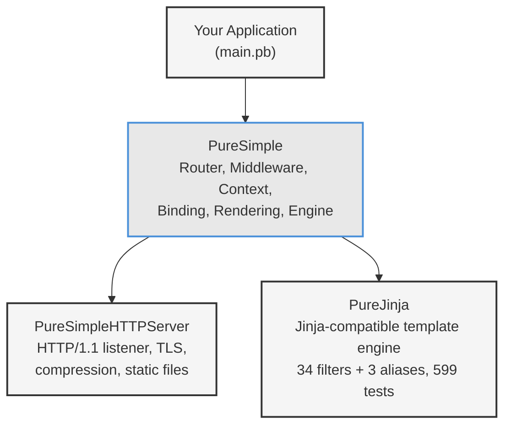

# บทที่ 1: ทำไมต้องใช้ PureBasic สำหรับงาน Web?

*เหตุผลที่การ compile web application ให้กลายเป็นไฟล์เดียวที่รันได้เลยนั้นมีคุณค่ามากกว่าที่คิด*

---

## วัตถุประสงค์การเรียนรู้

หลังจากอ่านบทนี้จบ คุณจะสามารถ:

- อธิบายข้อได้เปรียบเชิงปฏิบัติของการ deploy web application ในรูปแบบ native binary ไฟล์เดียว
- ระบุ repository ทั้งสามในระบบนิเวศของ PureSimple และอธิบายบทบาทของแต่ละอัน
- ตั้งค่า development environment สำหรับ PureBasic โดยกำหนด compiler path ให้ถูกต้อง
- Compile และรัน PureSimple web application แบบเรียบง่ายจาก command line

---

## 1.1 ข้อได้เปรียบของ Binary

Web application ส่วนใหญ่ต้องผ่านพิธีกรรมหลายขั้นตอนก่อนจะพร้อมรับ request แรก Node.js app ต้องติดตั้ง Node ก่อน จากนั้น `npm install` เพื่อดาวน์โหลด dependencies แล้วอาจต้องมีขั้นตอน build เพิ่มเติมเพื่อ transpile TypeScript หรือ bundle assets Python app ต้องการ interpreter เวอร์ชันที่ถูกต้อง virtual environment และ `pip install -r requirements.txt` ส่วน Ruby app ก็ต้องการ runtime, Bundler และการอธิษฐานให้ native extension compile ผ่านบนเครื่อง target

PureSimple application ไม่ต้องการสิ่งเหล่านั้นเลย คุณ compile มันบนเครื่อง development คัดลอก binary ที่ได้ไปไว้บน server แล้วรันได้ทันที นั่นคือกระบวนการ deploy ทั้งหมด

binary นั้นรวมทุกอย่างไว้ในตัว: HTTP server, router, template engine, SQLite driver และ application code ของคุณ ไม่มี interpreter ให้ติดตั้ง ไม่มี virtual machine ให้ตั้งค่า ไม่มี package manager ให้ต้องเอาใจ แม้แต่ server เองก็ไม่จำเป็นต้องติดตั้ง PureBasic binary รันบน bare metal จัดสรรหน่วยความจำเฉพาะที่ใช้จริง และ start ขึ้นมาภายในมิลลิวินาที ไม่ใช่วินาที

โฟลเดอร์ `node_modules` ของคุณมีไฟล์มากกว่าบาง operating system เสียอีก แต่ PureSimple application ในระบบ production มีเพียงไฟล์เดียว: binary

ความสำคัญนี้เกินกว่าแค่ความสะดวก runtime dependency ทุกตัวคือจุดล้มเหลวที่อาจเกิดขึ้นได้ version mismatch ของ package ทุกครั้งคือโทรศัพท์ตี 3 เช้า การอัปเดต interpreter ทุกครั้งคือความเสี่ยงที่ application จะทำงานต่างไปใน production จากที่ทดสอบไว้ static binary ตัดปัญหาเหล่านี้ออกไปได้ทั้งหมด

ตารางด้านล่างเปรียบเทียบสิ่งที่ต้องเตรียมสำหรับ deploy web application ใน 3 stack:

| | **PureSimple** | **Go (Gin)** | **Node.js (Express)** |
|---|---|---|---|
| ไฟล์ที่ต้อง deploy | 1 binary | 1 binary | `node_modules/` + source + `package.json` |
| Runtime ที่ต้องการ | ไม่มี | ไม่มี | Node.js |
| Startup time | ~5 ms | ~10 ms | ~500-2000 ms |
| ขนาด binary | ~2-4 MB | ~8-15 MB | ไม่มี (interpreted) |
| หน่วยความจำ idle | ~3-5 MB | ~8-12 MB | ~30-60 MB |

ตัวเลขของ PureSimple มาจาก blog example ชื่อ `massively` ที่รันบน Ubuntu server จริงในระบบ production ตัวเลขของคุณอาจแตกต่างออกไปขึ้นกับ application แต่รูปแบบยังคงเดิม: ภาษาที่ compile แล้วให้ process ที่เล็กกว่า เร็วกว่า และใช้ทรัพยากรน้อยกว่าภาษา interpreted เสมอ

> **เปรียบเทียบ:** ถ้าคุณเคยทำงานกับ Go คุณน่าจะคุ้นเคยกับแนวคิดนี้อยู่แล้ว Go ก็ compile ออกมาเป็น static binary ไฟล์เดียวเช่นกัน PureSimple ได้ binary ที่เล็กกว่าเพราะ standard library ของ PureBasic มีขนาดกะทัดรัดกว่า แต่ Go มี ecosystem ที่กว้างขวางกว่ามากและมี concurrency primitive ในตัว ความต่างนี้มีอยู่จริง และหนังสือเล่มนี้ไม่ได้แกล้งทำเป็นว่ามันไม่มี

## 1.2 แล้วทำไมไม่ใช้ Go เลย?

คำถามนี้สมเหตุสมผล และสมควรได้รับคำตอบที่ตรงไปตรงมา ไม่ใช่ภาษาการตลาด

Go เป็นตัวเลือกที่ยอดเยี่ยมสำหรับ web service มี standard library ที่เติบโตเต็มที่ ecosystem ขนาดใหญ่ goroutine สำหรับ concurrency ในตัว และ compiler ที่ผลิต static binary ถ้าคุณรู้จัก Go และทำงานกับมันได้คล่องแล้ว หนังสือเล่มนี้ไม่ได้พยายามโน้มน้าวให้คุณเปลี่ยนมาใช้ PureBasic

PureBasic ครองพื้นที่อีกกลุ่มหนึ่ง มันดึงดูดนักพัฒนาที่ต้องการ native performance โดยไม่ต้องการความซับซ้อนของ systems programming syntax ของ PureBasic เข้าใจง่าย standard library ครอบคลุมทั้ง GUI, multimedia, networking และ file I/O โดยไม่ต้องพึ่ง external package ไม่มี package manager เพราะไม่จำเป็นต้องมี compiler มาพร้อมทุกสิ่งที่ต้องการ

ใน Go คุณจะต้องเขียน `if err != nil` ราวสี่สิบครั้งต่อไฟล์ ใน PureBasic คุณเขียน `If result = 0` ราวสี่สิบครั้งต่อไฟล์ เรียกว่า "ก้าวหน้า" ไปได้ระดับนึง

ข้อโต้แย้งที่แท้จริงสำหรับ PureSimple ไม่ใช่ว่ามันดีกว่า Go หรือ Python หรือ Rust สำหรับ web development โดยทั่วไป แต่คือ: ถ้าคุณทำงานกับ PureBasic อยู่แล้ว หรือต้องการ web framework ที่อ่าน source code ได้ทั้งหมดภายในบ่ายวันเดียว PureSimple ให้ stack ครบชุดในภาษาที่เรียนรู้ได้เร็ว framework ทั้งหมด รวมทั้ง HTTP server, router, template engine และ database layer มีโค้ดราวหมื่นบรรทัด ลองอ่าน source ของ Express.js หรือ Django ภายในบ่ายวันเดียวดูสิ

## 1.3 ระบบนิเวศสามคลัง

PureSimple ไม่ใช่ repository เดียว มันคือระบบนิเวศของ repository สามตัวที่ compile รวมกันเป็น binary ไฟล์เดียว แต่ละ repo มีความรับผิดชอบชัดเจน และการเข้าใจขอบเขตระหว่างกันจะช่วยให้คุณไม่สับสนตลอดการอ่านหนังสือเล่มนี้


*รูปที่ 1.1 -- ระบบนิเวศสาม repository application ของคุณ include PureSimple ซึ่งใน include HTTP server และ template engine อีกทีหนึ่ง ทั้งสี่ส่วน compile รวมกันเป็น binary ไฟล์เดียว*

**PureSimpleHTTPServer** คือ HTTP engine มันรับฟังบน port รับ TCP connection แยกวิเคราะห์ HTTP/1.1 request จัดการ TLS termination ให้บริการ static file และบีบอัดด้วย gzip มันไม่รู้อะไรเกี่ยวกับ routing, middleware หรือ template เลย แค่เรียก dispatch callback ทุกครั้งที่มี request เข้ามา repository นี้ stable ใน production ที่ version 1.x

**PureSimple** คือ framework layer -- และเป็นหัวข้อของหนังสือเล่มนี้ มันมี router (radix trie ที่ map URL pattern ไปยัง handler procedure), request context (struct ต่อ request ที่เก็บ method, path, header, body, parameter และ key-value store), middleware chain (Logger, Recovery, BasicAuth, CSRF, Session), request binding (query string, form data, JSON), response rendering (JSON, HTML, text, redirect, file, template), route group, SQLite database adapter พร้อม migration runner, การโหลด configuration จาก `.env` file และ levelled logging รายการนี้ยาว แต่ source code ทั้งหมดอยู่ในไฟล์ `.pbi` แค่สิบกว่าไฟล์

**PureJinja** คือ template engine แบบ Jinja-compatible เขียนด้วย PureBasic ถ้าคุณเคยใช้ Jinja ใน Python syntax จะเหมือนกันเลย: `{{ variable }}`, ``, ``, `` PureJinja รองรับ built-in filter 34 ตัว (บวก alias 3 ตัว รวม 37 ชื่อ), template inheritance และ block override มี test 599 รายการของตัวเอง PureSimple เรียก API `RenderString` ของ PureJinja เพื่อ render HTML template

รูปแบบการ integrate นั้นตรงไปตรงมา `main.pb` ของคุณ include PureSimple ด้วยบรรทัดเดียว:

```purebasic
XIncludeFile "src/PureSimple.pb"
```

ไฟล์หลักของ PureSimple คือ `src/PureSimple.pb` จะ include ทั้ง PureSimpleHTTPServer และ PureJinja ควบคู่กับ module ของตัวเอง compiler จะ resolve include path ทั้งหมด compile ทุกอย่างรวมกัน และผลิต binary ออกมาหนึ่งตัว ไม่มีขั้นตอน linking แยก ไม่มีการโหลด dynamic library และไม่มี runtime class path compiler คือ package manager

## 1.4 ตั้งค่า Development Environment

PureBasic เป็น commercial compiler ที่ใช้ได้กับ macOS, Linux และ Windows คุณต้องใช้ version 6.x ซึ่งใช้ C backend ในการสร้างโค้ด version ก่อนหน้าใช้ assembler backend และจะ compile PureSimple ไม่ผ่าน

### ติดตั้ง PureBasic

ดาวน์โหลด PureBasic 6.x จากเว็บไซต์ทางการ (purebasic.com) installer จะวาง compiler และ IDE ไว้ในตำแหน่งมาตรฐาน:

- **macOS:** `/Applications/PureBasic.app/Contents/Resources`
- **Linux:** `/usr/local/purebasic` หรือที่ที่คุณแตก archive ไว้
- **Windows:** `C:\Program Files\PureBasic`

### ตั้งค่า PUREBASIC_HOME

binary ของ compiler อยู่ภายใน installation directory แทนที่จะพิมพ์ path เต็มทุกครั้ง ให้ตั้ง environment variable ใน shell profile ของคุณ:

```bash
# macOS — เพิ่มใน ~/.zshrc หรือ ~/.bash_profile
export PUREBASIC_HOME="/Applications/PureBasic.app/Contents/Resources"

# Linux — เพิ่มใน ~/.bashrc
export PUREBASIC_HOME="/opt/purebasic"

# Windows (Command Prompt)
set PUREBASIC_HOME=C:\Program Files\PureBasic

# Windows (PowerShell)
$env:PUREBASIC_HOME = "C:\Program Files\PureBasic"
```

หลังจาก reload shell (`source ~/.zshrc`) คุณสามารถเรียก compiler ได้ว่า:

```bash
$PUREBASIC_HOME/compilers/pbcompiler myfile.pb -cl -o myapp
```

> **เคล็ดลับ:** บน Windows ใช้ `%PUREBASIC_HOME%\Compilers\pbcompiler.exe` (Command Prompt) หรือ `& "$env:PUREBASIC_HOME\Compilers\pbcompiler.exe"` (PowerShell) flag ของ compiler เหมือนกันทุก platform

> **เคล็ดลับ:** ตั้งค่า `PUREBASIC_HOME` ใน shell profile เพื่อไม่ต้อง export ใหม่ทุก session คำสั่ง build ทุกคำสั่งในหนังสือเล่มนี้ถือว่าตัวแปรนี้ถูกตั้งค่าไว้แล้ว

### Clone Repository

Clone ทั้งสาม repository วางเคียงกันใน parent directory เดียวกัน include path ใน PureSimple คาดหวัง layout แบบนี้:

```
PureBasic_Projects/
  PureSimple/              # This repo
  PureSimpleHTTPServer/    # HTTP server
  pure_jinja/              # Template engine
```

```bash
mkdir PureBasic_Projects && cd PureBasic_Projects
git clone https://github.com/Jedt3D/PureSimple.git
git clone https://github.com/Jedt3D/PureSimpleHTTPServer.git
git clone https://github.com/Jedt3D/pure_jinja.git
```

### IDE หรือ Command Line

PureBasic มาพร้อม IDE ครบชุดที่มี syntax highlighting, debugger ในตัวพร้อม breakpoint และการดู variable, profiler และ visual form designer มันยอดเยี่ยมสำหรับการสำรวจโค้ดและการไล่หาปัญหา

อย่างไรก็ตาม web server ต้องรันในรูปแบบ console application และ debugger ของ IDE ไม่ได้ออกแบบมาสำหรับ server process ที่รันต่อเนื่องนาน ตลอดหนังสือเล่มนี้เราจะ compile และรันจาก command line ถ้าคุณชอบใช้ IDE สำหรับเขียนโค้ด ก็ทำได้ -- แค่ compile และรัน server จาก terminal

## 1.5 Hello World: PureSimple App แรกของคุณ

นี่คือ PureSimple application ที่เล็กที่สุดที่ทำสิ่งมีประโยชน์ได้ มันลงทะเบียน route สองเส้น -- JSON endpoint และ health check -- และเริ่มรับฟังบน port 8080

```purebasic
; Listing 1.1 -- Hello World PureSimple app
EnableExplicit
XIncludeFile "src/PureSimple.pb"

Engine::Use(@Logger::Middleware())
Engine::Use(@Recovery::Middleware())

Engine::GET("/",        @IndexHandler())
Engine::GET("/health",  @HealthHandler())

Engine::Run(8080)

Procedure IndexHandler(*C.RequestContext)
  Rendering::JSON(*C, ~"{\"hello\":\"world\"}")
EndProcedure

Procedure HealthHandler(*C.RequestContext)
  Rendering::Text(*C, "OK")
EndProcedure
```

ทุกบรรทัดมีความหมาย `EnableExplicit` บอก compiler ให้ปฏิเสธตัวแปรที่ไม่ได้ประกาศ -- เป็นตาข่ายนิรภัยที่คุณจะซาบซึ้งคุณค่าในครั้งแรกที่มันดักจับการพิมพ์ผิด `XIncludeFile "src/PureSimple.pb"` ดึง framework ทั้งหมดเข้ามา การเรียก `Engine::Use` สองครั้งลงทะเบียน global middleware: Logger พิมพ์ timing ของ request ลง console และ Recovery ดักจับ runtime error แล้วส่ง response 500 แทนการ crash

การเรียก `Engine::GET` ลงทะเบียน route pattern เมื่อมี GET request มาที่ `/` router จะเรียก `IndexHandler` เมื่อมี GET request มาที่ `/health` router จะเรียก `HealthHandler` handler ทั้งสองรับ pointer ไปยัง struct `RequestContext` -- กระเป๋าเป้ที่บรรจุข้อมูล request และ response ทั้งหมดตลอด handler chain

`Rendering::JSON` กำหนด response body เป็น JSON string กำหนด content type เป็น `application/json` และกำหนด status code เป็น 200 `Rendering::Text` ทำเหมือนกันแต่ใช้ `text/plain` HTTP server จัดการส่ง byte ของ response กลับไปยัง client

วิธี compile และรัน:

**ตัวอย่างที่ 1.2** -- Compile และรันจาก terminal

```bash
$PUREBASIC_HOME/compilers/pbcompiler main.pb -cl -o hello
./hello
```

flag `-cl` มีความสำคัญมาก มันบอก compiler ให้ผลิต console application หากไม่ใส่ PureBasic จะผลิต GUI binary ที่ไม่พิมพ์ออก terminal และไม่ทำงานในฐานะ server เปิด browser ไปที่ `http://localhost:8080/` คุณควรเห็น `{"hello":"world"}` เปิด `http://localhost:8080/health` คุณจะได้ `OK`

```mermaid
graph LR
    A["main.pb<br/>+ PureSimple.pb<br/>+ HTTPServer.pbi<br/>+ PureJinja.pbi"] -->|"pbcompiler -cl"| B["hello<br/>(native binary)"]
    B -->|"./hello"| C["Listening on :8080"]
    D["Browser"] -->|"GET /"| C
    C -->|'{"hello":"world"}'| D

    style A fill:#f5f5f5,stroke:#333,stroke-width:1px
    style B fill:#e8e8e8,stroke:#4A90D9,stroke-width:2px
    style C fill:#f5f5f5,stroke:#333,stroke-width:1px
    style D fill:#f5f5f5,stroke:#333,stroke-width:1px
```
*รูปที่ 1.2 -- Pipeline การ compile ไฟล์ source ถูก compile ให้กลายเป็น native binary ไฟล์เดียว ซึ่งรับฟัง port และให้บริการ request โดยตรงกับ browser*

> **เปรียบเทียบ:** ถ้าคุณรู้จัก `net/http` ของ Go PureSimple ก็คือ Gin สำหรับ PureBasic `Engine::GET` ตรงกับ `r.GET`, `*C.RequestContext` ตรงกับ `*gin.Context` และ `Rendering::JSON` ตรงกับ `c.JSON()` แนวคิดถ่ายทอดตรงกัน เปลี่ยนแค่ syntax

นั่นคือ development loop ทั้งหมด: เขียนโค้ด, compile, รัน, ทดสอบใน browser ไม่มี build tool, ไม่มี transpiler, ไม่มี bundler, ไม่มี watcher คำสั่งเดียวผลิต binary หนึ่งตัว binary นั้นรัน server ของคุณ ส่วนที่เหลือคือรายละเอียด และนั่นคือสิ่งที่บทที่เหลือของหนังสือเล่มนี้ครอบคลุม

---

## สรุป

PureBasic compile web application ให้กลายเป็น native binary ไฟล์เดียวโดยไม่มี runtime dependency ระบบนิเวศของ PureSimple แบ่งความรับผิดชอบออกเป็นสาม repository -- PureSimpleHTTPServer สำหรับ HTTP engine, PureSimple สำหรับ routing และฟีเจอร์ต่าง ๆ และ PureJinja สำหรับ Jinja-compatible template -- ที่รวมกันตอน compile time ผ่าน directive `XIncludeFile` การตั้งค่า development environment ต้องการแค่ PureBasic compiler และคำสั่ง `git clone` สามครั้ง web application ที่สมบูรณ์ใส่ได้ในสิบบรรทัดและ compile ภายในไม่กี่วินาที

## ประเด็นสำคัญ

- **Binary ไฟล์เดียว ไม่มีความซับซ้อนในการ deploy** คัดลอก binary ที่ compile แล้วไปยัง server และรัน ไม่มี interpreter ไม่มี package manager ไม่มีการ resolve dependency ตอน deploy
- **สาม repo เชื่อมกันด้วย `XIncludeFile` chain เดียว** PureSimpleHTTPServer จัดการ HTTP, PureSimple จัดการ routing และ framework logic, PureJinja จัดการ template ทั้งสามรวม compile เข้าไปใน application binary ของคุณ
- **Compiler คือ package manager ของคุณ** ไม่มี `npm install` หรือ `go mod tidy` compiler resolve include, compile ทุกอย่าง และ link ผลลัพธ์ ถ้า compile ผ่าน ก็พร้อม deploy

## คำถามทบทวน

1. ระบุชื่อ repository ทั้งสามในระบบนิเวศของ PureSimple และอธิบายว่าแต่ละตัวทำหน้าที่อะไร
2. ข้อได้เปรียบของการ compile web application เป็น binary ไฟล์เดียวเมื่อเทียบกับการ deploy ภาษา interpreted ที่มี package ecosystem คืออะไร
3. *ลองทำ:* Clone ทั้งสาม repository ไว้ใน parent directory เดียวกัน compile ตัวอย่าง Hello World ด้วย `pbcompiler -cl -o hello` และตรวจสอบว่า `http://localhost:8080/health` ส่งกลับ `OK`
