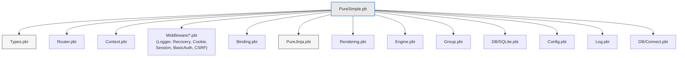
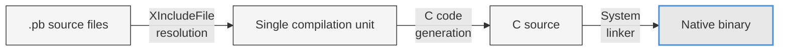

# บทที่ 3: Toolchain ของ PureBasic -- Compiler, Debugger และ PureUnit


*สามเครื่องมือที่เปลี่ยนโค้ดของคุณให้กลายเป็น binary ที่ผ่านการทดสอบและ debug แล้ว*

---

## วัตถุประสงค์การเรียนรู้

หลังจากอ่านบทนี้จบ คุณจะสามารถ:

- Compile ไฟล์ source ของ PureBasic จาก command line โดยใช้ flag ที่จำเป็น
- ติดตาม `XIncludeFile` resolution tree ของ PureSimple framework
- เขียนและรัน test โดยใช้ทั้ง built-in assertion ของ PureUnit และ custom harness ของ PureSimple
- ใช้ PureBasic IDE debugger สำหรับ breakpoint การตรวจสอบตัวแปร และ profiling
- ปฏิบัติตามวงจร compile-test-debug ที่ใช้ตลอดกระบวนการพัฒนา PureSimple

---

## 3.1 PureBasic Compiler (`pbcompiler`)

PureBasic compiler คือ executable ไฟล์เดียวที่อ่านไฟล์ source `.pb` resolve include, สร้างโค้ด C และเรียก system linker เพื่อผลิต native binary ไม่มี preprocessor แยกต่างหาก ไม่มี intermediate bytecode และไม่มีการ compile แบบ just-in-time source เข้าไป binary ออกมา

compiler อยู่ภายใน PureBasic installation ของคุณ:

**ตัวอย่างที่ 3.1** -- Compile console app จาก command line

```bash
$PUREBASIC_HOME/compilers/pbcompiler main.pb -cl -o myapp
./myapp
```

> **เคล็ดลับ:** บน Windows ใช้ `%PUREBASIC_HOME%\Compilers\pbcompiler.exe` (Command Prompt) หรือ `& "$env:PUREBASIC_HOME\Compilers\pbcompiler.exe"` (PowerShell) flag ของ compiler เหมือนกันทุก platform

compiler ไม่มี package manager และไม่จำเป็นต้องมี รวมทั้งไม่มีโฟลเดอร์ `node_modules` คุณยินดีต้อนรับ

### Flag ที่จำเป็น

นี่คือ compiler flag ที่คุณจะใช้ตลอดหนังสือเล่มนี้:

| Flag | วัตถุประสงค์ | เมื่อใช้ |
|------|---------|-------------|
| `-cl` | Console application | **เสมอ** สำหรับ server และ test runner |
| `-o <name>` | ชื่อ binary output | เสมอ (ไม่งั้นจะได้ชื่อ default) |
| `-z` | เปิดใช้ C optimiser | Release build |
| `-k` | ตรวจ syntax เท่านั้น | Feedback เร็วระหว่าง development |
| `-t` | Thread-safe mode | เมื่อใช้ thread หรือ thread-safe library |
| `-dl` | Compile เป็น shared library | Plugin architecture (แทบไม่ต้องใช้) |

> **คำเตือน:** ใช้ `-cl` เสมอสำหรับ server application และ test runner หากไม่ใส่ PureBasic จะผลิต GUI binary ที่ไม่พิมพ์ออก terminal server ของคุณจะ start รับฟัง port แต่ไม่มี log output ใด ๆ เลย คุณจะจ้องดู terminal ที่เงียบงันและสงสัยว่ามีอะไรเกิดขึ้นหรือเปล่า ประสบการณ์ไม่น่าพึงพอใจเลย

flag `-k` สมควรได้รับการกล่าวถึงเป็นพิเศษ มันตรวจ syntax แบบสมบูรณ์โดยไม่ผลิต binary ในการ compile PureSimple ทั่วไป การ build เต็มรูปแบบใช้เวลา 2-3 วินาที การตรวจ syntax ด้วย `-k` ใช้เวลาไม่ถึงวินาที เมื่อคุณกำลัง iterate บนโค้ดและต้องการรู้แค่ว่า compile ผ่านหรือเปล่า `-k` คือเพื่อนของคุณ

> **เคล็ดลับ:** ใช้ `-k` สำหรับตรวจ syntax ระหว่าง development -- เร็วกว่า compile เต็มรูปแบบถึง 10 เท่า

### Compiler Constant

PureBasic มี compile-time constant หลายตัวที่มีประโยชน์สำหรับ diagnostic และโค้ดข้าม platform:

```purebasic
; Listing 3.2 -- Using compiler constants for diagnostics
EnableExplicit

PrintN("Compiled with PureBasic")
PrintN("  File: " + #PB_Compiler_File)
PrintN("  Line: " + Str(#PB_Compiler_Line))
PrintN("  Home: " + #PB_Compiler_Home)

CompilerSelect #PB_Compiler_OS
  CompilerCase #PB_OS_MacOS
    PrintN("  OS: macOS")
  CompilerCase #PB_OS_Linux
    PrintN("  OS: Linux")
  CompilerCase #PB_OS_Windows
    PrintN("  OS: Windows")
CompilerEndSelect

CompilerIf #PB_Compiler_Processor = #PB_Processor_x64
  PrintN("  Arch: x64 (pointer = 8 bytes)")
CompilerElse
  PrintN("  Arch: x86 (pointer = 4 bytes)")
CompilerEndIf
```

`#PB_Compiler_File` และ `#PB_Compiler_Line` มีประโยชน์อย่างยิ่งสำหรับ test harness และการรายงาน error มันจะขยายเป็น source file path และหมายเลขบรรทัดปัจจุบันตอน compile ซึ่งนั่นคือวิธีที่ macro `Check` ของ PureSimple รายงานตำแหน่งของ assertion ที่ล้มเหลว

### รูปแบบการ Resolve Include

เมื่อ compiler เจอ `XIncludeFile "path/to/file.pbi"` มันจะอ่านไฟล์นั้นและ compile เนื้อหาราวกับว่าวางไว้ในตำแหน่งนั้น นี่คือการ include แบบ textual คล้ายกับ `#include` ของ C prefix `X` หมายความว่า "include เพียงครั้งเดียว" -- ถ้าไฟล์เดียวกันถูก include อีกครั้ง (โดยตรงหรือผ่าน include chain อื่น) การ include ครั้งที่สองจะถูกข้ามไปเงียบ ๆ ซึ่งป้องกันข้อผิดพลาด duplicate definition

`IncludeFile` (ไม่มี `X`) include ไฟล์ทุกครั้ง ถ้า module สอง module ต่าง `IncludeFile "Types.pbi"` คุณจะได้ structure definition ซ้ำและ compiler error PureSimple ใช้ `XIncludeFile` เท่านั้น

Include path คำนวณจาก directory ของไฟล์ที่มี directive `XIncludeFile` ไม่ใช่จาก working directory ของ compiler ซึ่งหมายความว่าถ้า `tests/run_all.pb` include `"../src/PureSimple.pb"` compiler จะ resolve ตำแหน่งนั้นจาก directory `tests/`

## 3.2 Include Tree

การเข้าใจ include tree ของ PureSimple เป็นสิ่งจำเป็นสำหรับการนำทางใน codebase จุดเข้า framework คือ `src/PureSimple.pb` และมัน include ทุก module ตามลำดับ dependency:

```purebasic
; Listing 3.3 -- PureSimple.pb include chain (annotated)
EnableExplicit

XIncludeFile "Types.pbi"               ; Shared types: RequestContext, PS_HandlerFunc
UseModule Types                        ; Import types into global scope

XIncludeFile "Router.pbi"              ; Radix trie router: Insert / Match
XIncludeFile "Context.pbi"             ; Request lifecycle: Advance, Abort, KV store
XIncludeFile "Middleware/Logger.pbi"   ; Logger: method/path/status/elapsed
XIncludeFile "Middleware/Recovery.pbi" ; Recovery: OnError -> 500 response
XIncludeFile "Binding.pbi"             ; Request binding: Param, Query, PostForm, JSON
XIncludeFile "Middleware/Cookie.pbi"   ; Cookie parsing + Set-Cookie
XIncludeFile "Middleware/Session.pbi"  ; In-memory session store
XIncludeFile "Middleware/BasicAuth.pbi"; HTTP Basic Authentication
XIncludeFile "Middleware/CSRF.pbi"     ; CSRF token generation + validation
XIncludeFile "../../pure_jinja/PureJinja.pbi"  ; Jinja template engine
XIncludeFile "Rendering.pbi"           ; Response: JSON, HTML, Text, Redirect, File
XIncludeFile "Engine.pbi"              ; Top-level API: NewApp, Run, GET, POST, Use
XIncludeFile "Group.pbi"               ; RouterGroup: sub-router with prefix
XIncludeFile "DB/SQLite.pbi"           ; SQLite adapter + migration runner
XIncludeFile "Config.pbi"              ; .env loader + config store
XIncludeFile "Log.pbi"                 ; Levelled logger
XIncludeFile "DB/Connect.pbi"          ; Multi-driver DSN connection factory
```

ลำดับนี้ไม่ใช่เรื่องบังเอิญ Types ต้องมาก่อนทุกอย่างเพราะทุก module ใช้ `RequestContext` Router ต้องมาก่อน Context เพราะ context ต้องการผลลัพธ์จาก route matching Middleware module ต้องมาก่อน Engine เพราะ function `Use()` ของ Engine ลงทะเบียน middleware ด้วย address Rendering ต้องมาหลัง PureJinja เพราะเรียก API ของ template engine


*รูปที่ 3.1 -- XIncludeFile resolution tree สำหรับ PureSimple.pb จุดเข้า framework include ทุก module ตามลำดับ dependency Types มาก่อนเพราะทุก module อื่นขึ้นอยู่กับ structure RequestContext*

เมื่อคุณ compile ไฟล์ test หรือ application คุณ include `PureSimple.pb` และทั้ง framework จะตามมาด้วย compiler resolve `XIncludeFile` แต่ละตัว compile เนื้อหา และทิ้ง include ที่ซ้ำกัน binary สุดท้ายของคุณมีเฉพาะโค้ดที่ต้องการ


*รูปที่ 3.2 -- Compiler pipeline PureBasic resolve include ทั้งหมดให้เป็น compilation unit เดียว สร้างโค้ด C และเรียก system linker เพื่อผลิต native binary*

## 3.3 PureBasic IDE และ Debugger

PureBasic มาพร้อม IDE ที่มีฟีเจอร์ครบชุด รวมทั้ง syntax highlighting, code folding, integrated debugger และ profiler ถ้าคุณชอบเขียนโค้ดในสภาพแวดล้อม GUI IDE ถือเป็น editor ที่มีความสามารถ

debugger คือจุดที่ IDE โดดเด่นจริง ๆ คุณสามารถตั้ง breakpoint โดยคลิกที่ gutter แล้วรันโปรแกรม เมื่อ execution ถึง breakpoint คุณสามารถตรวจสอบตัวแปร ดู expression นำทาง call stack และ step ผ่านโค้ดทีละบรรทัด profiler แสดงว่าแต่ละ procedure ใช้เวลาเท่าใด ซึ่งมีคุณค่ามากเมื่อ optimise hot path

statement `Debug` ส่ง output ไปยัง debug window ของ IDE:

```purebasic
Debug "Connection count: " + Str(count)
Debug "Processing request for: " + path
```

statement `Debug` จะถูกตัดออกจาก release build (เมื่อ compile โดยไม่เปิด debugger) ดังนั้นจึงไม่มีค่าใช้จ่ายใด ๆ ใน production ใช้อย่างเสรีระหว่าง development

อย่างไรก็ตาม web server เป็น console process ที่รันต่อเนื่องนาน IDE debugger ออกแบบมาสำหรับโปรแกรมที่ start, ทำงาน และหยุด มันรองรับ interactive debug session ได้ดี แต่ไม่รองรับ server ที่นั่งรอ connection อยู่เฉย ๆ สำหรับ web development workflow ที่ใช้จริงคือ:

1. **แก้ไขโค้ด** ใน editor ที่ชอบ (IDE, VS Code, vim หรืออะไรก็ได้)
2. **Compile** จาก command line ด้วย `pbcompiler -cl`
3. **รัน** binary โดยตรง
4. **Debug** ปัญหาเฉพาะโดยแยกปัญหาออกมาในไฟล์ test เล็ก ๆ และใช้ IDE debugger

> **เคล็ดลับ:** IDE ยอดเยี่ยมสำหรับการสำรวจและ debug Command line จำเป็นสำหรับ CI และ deployment ใช้ทั้งสอง

## 3.4 PureUnit -- Test Framework ในตัว

PureBasic 6.x มี testing mechanism ในตัวผ่าน macro ที่นิยามไว้ล่วงหน้าสองตัว: `Assert()` และ `AssertString()` ซึ่งเป็นส่วนหนึ่งของ `pureunit.res` ที่ link เข้าไปในทุกโปรแกรม PureBasic

```purebasic
; Listing 3.4 -- A PureUnit test file: Assert() and AssertString()
EnableExplicit

; Numeric assertion -- halts on failure
Assert(1 + 1 = 2)
Assert(10 > 5)

; String assertion -- halts on failure
AssertString(UCase("hello"), "HELLO")
AssertString(Left("PureBasic", 4), "Pure")

PrintN("All PureUnit assertions passed.")
```

PureUnit ทำงานตามโมเดล "หยุดที่ failure แรก" ถ้า assertion ใด fail execution จะหยุดทันที คุณเห็น failure แก้ไข recompile และรันใหม่ วิธีนี้เรียบง่ายและได้ผลดีสำหรับโปรแกรมขนาดเล็ก

ข้อจำกัดจะเห็นได้ชัดในโปรเจกต์ขนาดใหญ่ ถ้าคุณมี assertion 264 ตัวใน 11 test suite และ assertion ที่ 3 fail คุณไม่รู้ว่า assertion 4 ถึง 264 ผ่านหรือไม่ผ่าน คุณแก้ failure แรก recompile รัน และค้นพบ failure ต่อไป เหมือนกับการเล่นเกม whack-a-mole ในเชิง debug

> **เปรียบเทียบ:** `Assert()` ของ PureUnit เทียบเท่ากับ `t.Fatal()` ของ Go -- มันหยุด test ทันที test harness ของ PureSimple เทียบเท่ากับ `t.Error()` ของ Go -- มันบันทึก failure และรันต่อ ทั้งสองแนวทางมีที่ใช้ แต่สำหรับ framework ที่มี assertion หลายร้อยตัว การนับและรันต่อเป็นสิ่งจำเป็น

> **ข้อควรระวังใน PureBasic:** PureBasic 6.x นิยาม `Assert()` และ `AssertString()` ไว้ล่วงหน้าจาก `pureunit.res` ถ้าคุณพยายามนิยาม macro ของตัวเองด้วยชื่อเหล่านี้ คุณจะได้ silent conflict ที่อาจเรียกใช้เวอร์ชันผิด PureSimple หลีกเลี่ยงเรื่องนี้โดยใช้ชื่อที่แตกต่างกันโดยสิ้นเชิง: `Check`, `CheckEqual` และ `CheckStr`

## 3.5 Test Harness ของ PureSimple

test harness ของ PureSimple คือไฟล์เดียว -- `tests/TestHarness.pbi` -- ที่มี assertion แบบนับและรันต่อ ทุก assertion จะเพิ่ม pass counter หรือ fail counter พิมพ์ failure message พร้อมชื่อไฟล์และหมายเลขบรรทัดถ้ามีบางอย่างผิดพลาด และรันต่อไป ท้ายสุด `PrintResults()` จะพิมพ์สรุปและคืนค่า pass/fail status

harness นิยาม assertion macro สามตัว:

```purebasic
; Listing 3.5 -- The PureSimple Check / CheckEqual / CheckStr macros
; (from tests/TestHarness.pbi)

; Check(expr) -- boolean assertion
; Passes if expr is #True, fails otherwise
Macro Check(expr)
  _PS_CheckTrue(Bool(expr), #PB_Compiler_File, #PB_Compiler_Line)
EndMacro

; CheckEqual(a, b) -- numeric equality
; Passes if a = b, fails and prints both values otherwise
Macro CheckEqual(a, b)
  _PS_CheckEqual((a), (b), #PB_Compiler_File, #PB_Compiler_Line)
EndMacro

; CheckStr(a, b) -- string equality
; Passes if a = b, fails and prints both strings otherwise
Macro CheckStr(a, b)
  _PS_CheckStr((a), (b), #PB_Compiler_File, #PB_Compiler_Line)
EndMacro
```

แต่ละ macro ดักจับ `#PB_Compiler_File` และ `#PB_Compiler_Line` ที่ call site แล้วส่งต่อไปยัง helper procedure ที่ทำการเปรียบเทียบจริงและจัดการ counter การออกแบบนี้ทำให้ macro มีขนาดเล็ก (หลีกเลี่ยงข้อจำกัดของ PureBasic macro เรื่องการต่อ string) ในขณะที่ให้ข้อมูล diagnostic ไฟล์และบรรทัดที่แม่นยำเมื่อ failure

helper procedure เรียบง่าย นี่คือตัวที่ใช้กับ `Check`:

```purebasic
Procedure _PS_CheckTrue(result.i, file.s, line.i)
  If result
    _PS_PassCount + 1
  Else
    _PS_FailCount + 1
    PrintN("  FAIL  Check @ " + file + ":" + Str(line))
  EndIf
EndProcedure
```

เมื่อ check fail คุณจะเห็นชัดเจนว่าไฟล์และบรรทัดใดเกิด failure เมื่อผ่าน counter จะเพิ่มอย่างเงียบ ๆ ท้ายสุดของการรัน `PrintResults()` แสดงผลรวม:

```
======================================
  ALL TESTS PASSED  (264 assertions)
======================================
```

264 test ทั้งหมดผ่าน หรืออย่างน้อยก็ผ่านตอนที่ compile หน้านี้

### การเขียน Test Suite

Test suite จัดระเบียบด้วย `BeginSuite` ซึ่งพิมพ์ label เพื่อจัดกลุ่ม assertion ที่เกี่ยวข้อง:

```purebasic
; Listing 3.6 -- Writing a test suite
BeginSuite("String utilities")

CheckStr(UCase("hello"), "HELLO")
CheckStr(LCase("WORLD"), "world")
CheckStr(Left("PureBasic", 4), "Pure")
CheckEqual(Len("test"), 4)
Check(FindString("hello world", "world") > 0)
```

`BeginSuite` คือ macro ที่ขยายออกเป็น call `PrintN` เดียว มันไม่สร้าง scope หรือแยก test state ออกจากกัน เป็นเพียง labeling mechanism ที่ทำให้ test output อ่านได้ง่าย เมื่อรัน test คุณจะเห็น:

```
PureSimple Test Suite
=====================

  [Suite] P0 / Harness self-tests
  [Suite] P1 / Router tests
  [Suite] P2 / Middleware tests
  ...
```

### รูปแบบ run_all.pb

PureSimple ใช้ entry point เดียวสำหรับ test ทั้งหมด:

```purebasic
; Listing 3.7 -- The run_all.pb entry point pattern
; (from tests/run_all.pb)
EnableExplicit

; Pull in the framework
XIncludeFile "../src/PureSimple.pb"

; Test harness (macros + counters)
XIncludeFile "TestHarness.pbi"

; Phase test files
PrintN("PureSimple Test Suite")
PrintN("=====================")
PrintN("")

XIncludeFile "P0_Harness_Test.pbi"
XIncludeFile "P1_Router_Test.pbi"
XIncludeFile "P2_Middleware_Test.pbi"
; ... one include per phase

; Print summary and exit
If PrintResults()
  End 0    ; exit code 0 = success
Else
  End 1    ; exit code 1 = failure
EndIf
```

รูปแบบนี้เรียบง่าย: include framework, include harness, include ไฟล์ test แต่ละไฟล์, พิมพ์ผลลัพธ์ และออกด้วย exit code ที่เหมาะสม exit code มีความสำคัญสำหรับ CI pipeline -- exit code ที่ไม่ใช่ศูนย์บอก pipeline ว่า test ล้มเหลว

ไฟล์ test แต่ละไฟล์ (เช่น `P0_Harness_Test.pbi`) คือไฟล์ `.pbi` ธรรมดาที่ไม่มี `EnableExplicit` หรือ include ของตัวเอง (สิ่งเหล่านั้น `run_all.pb` จัดการแล้ว) มันเริ่มต้นด้วย call `BeginSuite` และมี assertion macro:

```purebasic
; From tests/P0_Harness_Test.pbi
BeginSuite("P0 / Harness self-tests")

Check(#True)
Check(Not #False)
Check(1 = 1)

CheckEqual(1 + 1, 2)
CheckEqual(10 - 3, 7)
CheckEqual(3 * 4, 12)

CheckStr("a" + "b", "ab")
CheckStr(LCase("HELLO"), "hello")
CheckStr(UCase("world"), "WORLD")
CheckStr(Str(42), "42")
```

วิธี compile และรัน test suite ทั้งหมด:

```bash
$PUREBASIC_HOME/compilers/pbcompiler tests/run_all.pb -cl -o run_all
./run_all
```

คำสั่งเดียว binary เดียว test ทั้งหมด ไม่มี test runner framework ให้ติดตั้ง ไม่มี configuration file ให้เขียน ไม่มี glob pattern สำหรับ match ไฟล์ test compiler include ไฟล์ test เพราะคุณบอกให้ทำ และ binary รันมันเพราะมันเป็นโค้ด PureBasic ธรรมดา

## 3.6 นำทุกอย่างมารวมกัน

workflow การพัฒนาสำหรับทุก phase ของ PureSimple ใช้วงจรเดียวกัน:

1. **เขียนโค้ด** ในไฟล์ module `.pbi` ภายใต้ `src/`
2. **เขียน test** ในไฟล์ test ภายใต้ `tests/`
3. **เพิ่มไฟล์ test** ใน `tests/run_all.pb` ผ่าน `XIncludeFile`
4. **Compile test**: `pbcompiler tests/run_all.pb -cl -o run_all`
5. **รัน test**: `./run_all`
6. **ถ้า test fail**: อ่าน failure output หา file และ line แก้ปัญหา ไปขั้นตอน 4
7. **ถ้า test pass**: compile example app และตรวจสอบว่าทำงานได้ใน browser
8. **ทำซ้ำ** จนกว่า phase จะเสร็จสมบูรณ์

สำหรับการ iterate เร็วระหว่างขั้นตอน 2-3 ใช้ `-k` ตรวจ syntax ก่อน compile เต็มรูปแบบ:

```bash
# Fast syntax check (under 1 second)
$PUREBASIC_HOME/compilers/pbcompiler -k tests/run_all.pb

# Full compile (2-3 seconds)
$PUREBASIC_HOME/compilers/pbcompiler tests/run_all.pb -cl -o run_all
```

เมื่อต้องการสืบสวน bug ที่ซับซ้อน แยกปัญหาออกมาในไฟล์เล็ก ๆ และใช้ IDE debugger ตั้ง breakpoint ที่บรรทัดที่สงสัย step ผ่าน execution และตรวจสอบค่าตัวแปร เมื่อเข้าใจปัญหาแล้ว แก้ไขใน editor และกลับไปใช้ command-line workflow

นี่คือ quick reference สำหรับ flag ที่ใช้บ่อยที่สุด:

| งาน | คำสั่ง |
|------|---------|
| ตรวจ syntax | `pbcompiler -k myfile.pb` |
| Compile console app | `pbcompiler myfile.pb -cl -o myapp` |
| Compile พร้อม optimiser | `pbcompiler myfile.pb -cl -z -o myapp` |
| Compile พร้อม thread safety | `pbcompiler myfile.pb -cl -t -o myapp` |
| Compile test suite | `pbcompiler tests/run_all.pb -cl -o run_all` |
| รัน test | `./run_all` |

คุณจะ trace include chain ด้วยมือและกระดาษก็ได้ คุณจะคำนวณ pi โดยนับเม็ดฝนก็ได้ ทั้งสองทำได้ในทางเทคนิค แต่ตารางข้างต้นเร็วกว่า

---

## สรุป

Toolchain ของ PureBasic ประกอบด้วย `pbcompiler` (พร้อม flag สำหรับ console mode, optimisation, thread safety และ syntax check), IDE พร้อม debugger และ profiler ในตัว และ PureUnit สำหรับ built-in assertion แบบ halt-on-fail PureSimple ขยาย PureUnit ด้วย harness แบบ count-and-continue ที่รายงาน failure ทั้งหมดแทนที่จะหยุดที่แรก ไฟล์ `TestHarness.pbi` มี macro `Check`, `CheckEqual` และ `CheckStr` ที่ดักจับข้อมูลไฟล์และบรรทัดที่ call site `run_all.pb` entry point include framework, harness และทุกไฟล์ test ผลิต binary เดียวที่รัน test suite ทั้งหมดและออกด้วย exit code ที่เหมาะสม

## ประเด็นสำคัญ

- **`-cl` สำหรับ console, `-z` สำหรับ release, `-k` สำหรับตรวจ syntax** Flag สามตัวนี้ครอบคลุม 90% ของความต้องการ compile ของคุณ จำไว้ว่า web server คือ console application
- **`XIncludeFile` ป้องกัน duplicate definition และลำดับ include มีความสำคัญ** Types ต้อง include ก่อน module ที่ใช้มัน prefix `X` หมายความว่า "include เพียงครั้งเดียว"
- **PureUnit หยุดที่ failure แรก; harness ของ PureSimple รันต่อ** ใช้ `Check`, `CheckEqual` และ `CheckStr` สำหรับ framework test มันรายงาน failure ทั้งหมดในการรันครั้งเดียว
- **รูปแบบ `run_all.pb`: entry point เดียว binary เดียว test ทั้งหมด** เพิ่มไฟล์ test ใหม่โดยเพิ่มบรรทัด `XIncludeFile` หนึ่งบรรทัด ไม่ต้องตั้งค่า test runner

## คำถามทบทวน

1. ความแตกต่างระหว่าง `-cl` และ default compiler mode คืออะไร และทำไมมันสำคัญสำหรับ web server
2. ทำไม PureSimple จึงใช้ `Check()` แทน built-in `Assert()` ของ PureBasic custom harness แก้ปัญหาเชิงปฏิบัติอะไร
3. *ลองทำ:* สร้างไฟล์ชื่อ `my_test.pbi` พร้อม call `BeginSuite("My tests")` และ `Check` assertion สามตัว -- สองตัวที่ผ่านและหนึ่งตัวที่ fail โดยตั้งใจ เพิ่มลงใน entry point `my_run.pb` ใหม่ (include `TestHarness.pbi`, ไฟล์ test ของคุณ และเรียก `PrintResults()`) Compile ด้วย `-cl`, รัน และอ่าน output สังเกตชื่อไฟล์และหมายเลขบรรทัดใน failure message
