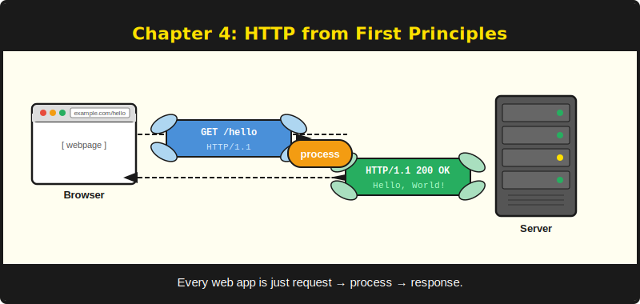
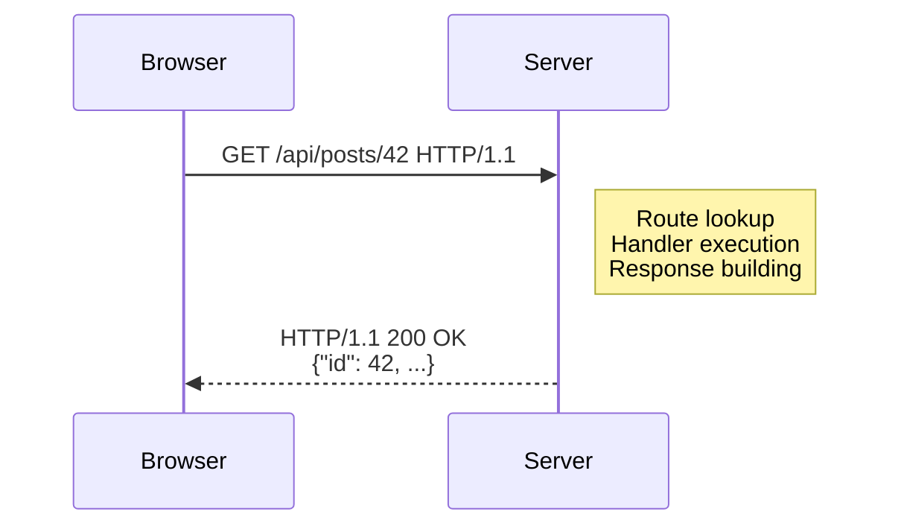
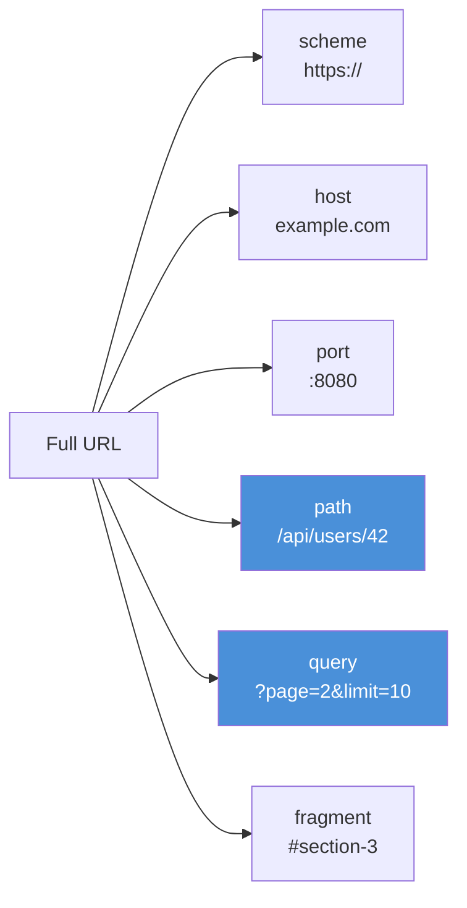

# บทที่ 4: พื้นฐาน HTTP



*ภาษาที่ browser และ server ใช้สื่อสารกัน*

---

## วัตถุประสงค์การเรียนรู้

หลังจากอ่านบทนี้จบ คุณจะสามารถ:

- อธิบายวงจร HTTP request/response และระบุแต่ละส่วนประกอบของ request และ response
- แยกส่วนประกอบของ URL ออกเป็น: scheme, host, port, path, query string และ fragment
- อธิบายบทบาทของ content type ในการสื่อสาร HTTP และเลือกใช้ให้เหมาะกับสถานการณ์
- อธิบายว่าทำไม HTTP จึงเป็น stateless และ cookie กับ session ชดเชยข้อจำกัดนั้นอย่างไร
- แยกแยะความรับผิดชอบของ PureSimpleHTTPServer จาก PureSimple

---

## 4.1 Request และ Response

HTTP คือการสนทนาอย่างสุภาพระหว่างสองโปรแกรมที่ไม่ไว้วางใจกันโดยพื้นฐาน browser พูดว่า "ฉันต้องการ resource นี้ กรุณาด้วย" server ตอบว่า "นี่เลย" หรือบ่อยกว่านั้นคือ "ไม่" ทุกปฏิสัมพันธ์บนเว็บเป็นไปตามรูปแบบนี้: request หนึ่งเข้า response หนึ่งออก ไม่มีข้อยกเว้น ไม่มี callback ไม่มีโทรศัพท์แปลกใจกลางดึก

request ประกอบด้วยสี่ส่วน ประการแรก **method** บอก server ว่า client ต้องการดำเนินการประเภทใด: `GET` เพื่ออ่าน, `POST` เพื่อสร้าง, `PUT` หรือ `PATCH` เพื่ออัปเดต, `DELETE` เพื่อลบ ประการที่สอง **path** บอก server ว่า client กำลังอ้างถึง resource ใด ประการที่สาม **header** บรรจุ metadata: content type ที่ client รับได้ cookie สำหรับ authentication, caching directive และ field อีกมากมาย ประการที่สี่ **body** บรรจุข้อมูลเมื่อ client ต้องการส่งบางอย่างไปยัง server เช่น JSON payload หรือ form submission Request แบบ `GET` มักไม่มี body; Request แบบ `POST` และ `PUT` เกือบทุกครั้งมี

response สะท้อนโครงสร้างนี้ด้วยสี่ส่วนของตัวเอง **status code** คือตัวเลขสามหลักที่สรุปผลลัพธ์: `200` หมายถึงสำเร็จ, `301` หมายถึง permanent redirect, `404` หมายถึงไม่พบ resource และ `500` หมายถึง server มีวันที่แย่ **header** ใน response ส่ง metadata กลับไปยัง client: content type ของ body, cache instruction และ cookie ที่ server ต้องการให้ browserจดจำ **body** มีเนื้อหาจริง: HTML page, JSON object, รูปภาพ หรือไม่มีอะไรเลย (เช่นใน response `204 No Content`) สุดท้าย **status line** ที่อยู่บนสุดของทุก response มี HTTP version และ reason phrase ที่มนุษย์อ่านได้ แม้ว่า client สมัยใหม่จะไม่สนใจ reason phrase เลย

```
; Listing 4.1 — A raw HTTP request (text)
GET /api/posts/42 HTTP/1.1
Host: example.com
Accept: application/json
Cookie: session=abc123
```

```
; Listing 4.2 — A raw HTTP response (text)
HTTP/1.1 200 OK
Content-Type: application/json
Content-Length: 47

{"id": 42, "title": "Hello", "status": "draft"}
```

request ใน Listing 4.1 ขอ blog post เฉพาะ response ใน Listing 4.2 ส่งกลับมาในรูป JSON การแลกเปลี่ยนทั้งหมดเป็น plain text ที่วิ่งผ่าน TCP connection ไม่มีเวทมนตร์ใด ๆ -- เพียงแค่ข้อความที่มีโครงสร้างพร้อมกฎเกณฑ์ว่า header สิ้นสุดตรงไหนและ body เริ่มตรงไหน (บรรทัดว่าง)


*รูปที่ 4.1 -- วงจร HTTP request/response Browser ส่ง request; server ประมวลผลและส่ง response กลับมา หนึ่งเข้า หนึ่งออก*

> **เปรียบเทียบ:** ถ้าคุณเคยใช้ `net/http` ของ Go คุณเห็นโมเดลนี้แล้ว คู่ `http.Request` และ `http.ResponseWriter` ตรงกับ `RequestContext` ของ PureSimple ที่รวมทั้งข้อมูล request ขาเข้าและ field response ขาออกไว้ใน structure เดียว บทที่ 6 ครอบคลุม context อย่างละเอียด

---

## 4.2 โครงสร้างของ URL

URL (Uniform Resource Locator) คือ string กะทัดรัดที่ระบุ resource และบอก client ว่าจะเข้าถึงมันได้อย่างไร มันดูเรียบง่ายอย่างหลอกลวงจนกว่าคุณจะต้องแยกวิเคราะห์มันด้วยมือ พิจารณา URL นี้:

```
https://example.com:8080/api/users/42?page=2&limit=10#section-3
```

string เดียวนั้นมีหกส่วนที่แตกต่างกัน:

1. **Scheme** (`https`) -- protocol สำหรับ web application คือ `http` หรือ `https`
2. **Host** (`example.com`) -- domain name หรือ IP address ของ server
3. **Port** (`8080`) -- TCP port ถ้าไม่ระบุ `http` default เป็น 80 และ `https` default เป็น 443
4. **Path** (`/api/users/42`) -- ที่อยู่แบบ hierarchical ของ resource นี่คือสิ่งที่ router ใช้ match
5. **Query string** (`page=2&limit=10`) -- คู่ key-value ที่ต่อท้ายด้วย `?` หลายคู่คั่นด้วย `&`
6. **Fragment** (`#section-3`) -- anchor ฝั่ง client browser ไม่ส่งส่วนนี้ไปยัง server


*รูปที่ 4.2 -- โครงสร้างของ URL path และ query string (ไฮไลต์) คือส่วนที่ application code จะทำงานด้วยมากที่สุด*

ความแตกต่างระหว่าง path parameter และ query parameter เป็นสิ่งที่ควรเข้าใจตั้งแต่เนิ่น ๆ path `/users/42` ฝัง user ID ไว้โดยตรงในโครงสร้าง URL นี่คือ **path parameter** -- router ดึง `42` ออกมาและส่งให้ handler ของคุณเป็น named value (`:id`) URL `/users?id=42` ได้ผลเหมือนกันโดยใช้ **query parameter** แต่ semantic ต่างกัน path parameter ระบุ resource เฉพาะ; query parameter ปรับเปลี่ยนวิธีที่ server ประมวลผล request (การกรอง, การเรียงลำดับ, pagination)

RFC เรียกการ encode อักขระพิเศษใน URL ว่า "percent encoding" เพราะ `%20` สั้นกว่า "อักขระช่องว่างที่ทำให้ทุกอย่างพัง" เมื่อ query string มีช่องว่าง browser จะแทนที่ด้วย `%20` หรือ `+` PureSimple จัดการการ decode นี้ให้คุณใน binding layer (บทที่ 8) แต่การรู้ว่ามันมีอยู่ช่วยให้ debug URL แปลก ๆ ที่ดูเหมือนถูกสร้างโดยแมวเดินบนคีย์บอร์ด

> **เคล็ดลับ:** เมื่อออกแบบ API route ใส่ resource identifier ไว้ใน path (`/posts/:id`) และตัวเลือก filtering หรือ pagination ไว้ใน query string (`?page=2`) นี่ไม่ใช่แค่ convention -- มัน map ได้พอดีกับวิธีที่ router ของ PureSimple แยกแยะระหว่าง path matching และ query parsing

---

## 4.3 Content Type

เมื่อ server ส่ง response header `Content-Type` บอก client ว่าข้อมูลใน body เป็นประเภทใด ถ้าทำผิด browser จะ render JSON ดิบเป็นกำแพงข้อความ หรือพยายาม parse HTML เป็น JSON object ประสบการณ์ผู้ใช้ที่ไม่น่าพึงพอใจไม่ว่าแบบใด

content type สามประเภทที่คุณจะใช้มากที่สุดใน PureSimple คือ:

- **`application/json`** -- ข้อมูลที่มีโครงสร้างสำหรับ API เครื่องจักรชอบมัน มนุษย์พอทนได้
- **`text/html`** -- หน้าเว็บ Browser render มัน เครื่องจักรเป็นทุกข์กับมัน
- **`text/plain`** -- ข้อความดิบ Health check endpoint, error message และวิกฤตอัตถิภาวนิยมของ server ตี 3

Content negotiation คือกระบวนการที่ client และ server ตกลงกันเรื่อง content type client ส่ง header `Accept` ที่ระบุประเภทที่รองรับ (`Accept: application/json, text/html`) และ server เลือก match ที่ดีที่สุด ในทางปฏิบัติ API ส่วนใหญ่ return JSON โดยไม่มีเงื่อนไข และ route สำหรับ browser ส่วนใหญ่ return HTML โดยไม่มีเงื่อนไข การต่อรองมีความสำคัญมากกว่าในทางทฤษฎีมากกว่าการพัฒนา PureSimple ประจำวัน แต่การรู้ว่ามันมีอยู่ป้องกันความสับสนเมื่อเห็น header `Accept` ใน log

PureSimple กำหนด content type ผ่าน rendering layer เมื่อคุณเรียก `Rendering::JSON` มันจะกำหนด `Content-Type: application/json` เมื่อคุณเรียก `Rendering::HTML` มันจะกำหนด `text/html` คุณแทบไม่ต้องกำหนดมันเอง -- แต่ทำได้ โดย write ตรงไปยัง `*C\ContentType` บน request context

> **คำเตือน:** ถ้าคุณลืมกำหนด content type และ handler ของคุณ write JSON string ไปยัง `ResponseBody` browser จะได้รับมันในรูป `text/plain` และแสดงเป็นข้อความดิบ ใช้ rendering function เสมอแทนที่จะ write ตรงไปยัง `ResponseBody`

---

## 4.4 HTTP ที่ไม่มีความจำ

HTTP ไม่มีความจำ ทุก request มาถึงราวกับว่า server ไม่เคยเห็น client มาก่อน server ไม่รู้ว่าคุณเป็นใคร คุณทำอะไรเมื่อห้าวินาทีก่อน หรือคุณ login อยู่หรือเปล่า นี่คือการออกแบบโดยเจตนา -- statelessness ทำให้ HTTP เรียบง่าย cacheable และ scalable มันก็ทำให้การสร้าง login system รู้สึกเหมือนกับการอธิบายตัวเองให้คนที่เป็นโรคความจำเสื่อมฟัง

วิธีแก้ปัญหาการหลงลืมโดยเจตนานี้คือ **cookie**: ข้อมูลเล็ก ๆ ที่ server ส่งให้ browser พร้อมคำสั่งให้ส่งกลับมาทุก request ที่ตามมา cookie คือโพสต์อิทบนตู้เย็นที่เขียนว่า "คุณคือ user #42 และ login เมื่อ 15:15 น."

**session** สร้างต่อยอดจาก cookie แทนที่จะเก็บข้อมูล user ไว้ใน cookie เอง (ซึ่ง client อ่านและแก้ไขได้) server เก็บ session ID แบบสุ่มไว้ใน cookie และเก็บข้อมูลจริงฝั่ง server session ID คือ key ไปยัง store ฝั่ง server -- map, database row หรือไฟล์ เมื่อ request มาพร้อม session cookie server จะ lookup session data, ต่อเข้ากับ request context และ handler ของคุณสามารถอ่านชื่อ, role หรือตะกร้าสินค้าของ user โดยไม่ต้องขอให้ client ส่งข้อมูลนั้นมาอีกครั้ง

คุณจะสร้าง session system เองตั้งแต่ต้นโดยใช้ `Mid()` และ `FindString()` เพื่อ parse cookie header ด้วยมือก็ได้ คุณจะสร้างบ้านด้วยช้อนก็ได้ ทั้งสองทำได้ในทางเทคนิค PureSimple มี `Cookie::Get`, `Cookie::Set` และ session middleware ครบชุดเพื่อไม่ให้คุณต้องทำเช่นนั้น

Cookie และ session ครอบคลุมอย่างลึกซึ้งในบทที่ 15 Authentication สร้างต่อยอดจาก session ในบทที่ 16 CSRF protection ซึ่งป้องกัน attacker จากการปลอม request โดยใช้ cookie ของคุณ ครอบคลุมในบทที่ 17 สำหรับตอนนี้ ประเด็นสำคัญคือ HTTP เองไม่มีความจำ -- ทุกอย่างอื่นสร้างต่อยอดบนพื้นฐานนั้น

> **เปรียบเทียบ:** Express.js ใช้ `req.session` หลังจากโหลด middleware `express-session` PureSimple ใช้ `Session::Get(*C, "key")` หลังจากโหลด `Session::Middleware` รูปแบบเหมือนกัน: middleware โหลด session, handler อ่านและเขียนมัน, middleware บันทึกกลับ

---

## 4.5 สิ่งที่ PureSimpleHTTPServer ให้มา

PureSimple ไม่ใช่ web server มันคือ framework ที่วางอยู่บน web server งาน HTTP หนัก ๆ จริง ๆ -- การรับฟัง TCP socket, การ parse HTTP byte ดิบ, การจัดการ TLS, การบีบอัด response และการให้บริการ static file -- จัดการโดย **PureSimpleHTTPServer** ซึ่งเป็น repository แยกต่างหากที่ compile เข้าไปใน binary เดียวกัน

PureSimpleHTTPServer ให้ฐานรากดังนี้:

- **TCP listener** บน port ที่ตั้งค่าได้
- **HTTP/1.1 parsing** ของ request เป็น method, path, header และ body
- **TLS termination** สำหรับ HTTPS connection (แม้ว่าใน production Caddy มักจัดการส่วนนี้)
- **Gzip compression** ของ response body เมื่อ client รองรับ
- **Static file serving** สำหรับ CSS, JavaScript, รูปภาพและ asset อื่น ๆ

PureSimple เพิ่ม application logic บนนั้น:

- **Routing** -- match request path กับ handler function (บทที่ 5)
- **Middleware** -- รัน logic ร่วมก่อนและหลัง handler (บทที่ 7)
- **Context** -- รวม request และ response data เป็น struct เดียว (บทที่ 6)
- **Binding** -- ดึงข้อมูลที่มี type จาก query string, form และ JSON (บทที่ 8)
- **Rendering** -- ผลิต JSON, HTML และ redirect response (บทที่ 9)

สอง repository มาบรรจบกันที่จุดเดียว: **dispatch callback** PureSimpleHTTPServer รับ HTTP request ดิบ, parse มัน และเรียก function pointer ที่ PureSimple ลงทะเบียนไว้ function นั้นสร้าง `RequestContext`, รันผ่าน router เพื่อหา handler ที่ match, ห่อ handler ด้วย middleware และ dispatch chain เมื่อ chain เสร็จสิ้น field response บน context จะถูก PureSimpleHTTPServer อ่าน ซึ่ง serialize มันกลับเป็น HTTP response และส่งไปยัง client

การแยกนี้เป็นเจตนา PureSimpleHTTPServer ไม่รู้อะไรเกี่ยวกับ route, middleware หรือ template PureSimple ไม่รู้อะไรเกี่ยวกับ TCP socket, HTTP parsing หรือการบีบอัด แต่ละ repository ทำสิ่งเดียวได้ดี และทั้งสองรวมกันตอน compile time เป็น binary ไฟล์เดียว

> **เบื้องหลัง:** รูปแบบ dispatch callback คือ function pointer ที่ลงทะเบียนกับ API `SetRequestHandler()` ของ PureSimpleHTTPServer ในแง่ PureBasic นี่คือ `Prototype.i` ที่รับ pointer ไปยังข้อมูล request ที่เข้ามา engine ของ PureSimple สร้าง `RequestContext`, populate มันจากข้อมูลดิบ, รัน handler chain และ write field response กลับ HTTP server ไม่เคยเห็น `RequestContext` -- มันเห็นแค่ field ดิบ

---

## สรุป

HTTP คือ protocol แบบ stateless ที่ใช้ข้อความเป็นฐาน ซึ่งทุกปฏิสัมพันธ์ประกอบด้วย request หนึ่งและ response หนึ่ง Request บรรจุ method, path, header และ body ที่เลือกใส่หรือไม่ก็ได้; response บรรจุ status code, header และ body URL encode ที่อยู่ resource พร้อมกับ query parameter และ content type บอก client ว่าจะตีความ response body อย่างไร เนื่องจาก HTTP ลืมทุกอย่างระหว่าง request cookie และ session ให้ความจำที่ web application ต้องการ PureSimpleHTTPServer จัดการงาน socket และ parsing ระดับต่ำ ในขณะที่ PureSimple มี routing, middleware, context และ rendering ที่เปลี่ยน HTTP ดิบให้เป็น application ที่มีโครงสร้าง

## ประเด็นสำคัญ

- ทุก HTTP request มี method (GET, POST, PUT, DELETE), path, header และ body ที่เลือกใส่ได้ ทุก response มี status code, header และ body ที่เลือกใส่ได้
- Path parameter (`/users/:id`) ระบุ resource; query parameter (`?page=2`) ปรับเปลี่ยนวิธีที่ server ประมวลผล request ใช้ทั้งสอง แต่ใช้เพื่อวัตถุประสงค์ที่ต่างกัน
- HTTP เป็น stateless โดยการออกแบบ -- cookie บรรจุ session ID ที่ให้ server lookup ข้อมูลที่เก็บไว้ระหว่าง request
- PureSimpleHTTPServer และ PureSimple มีความรับผิดชอบแยกกันที่มาบรรจบกันที่ dispatch callback, compile เป็น binary เดียวที่มีการแยกความรับผิดชอบชัดเจน

## คำถามทบทวน

1. ความแตกต่างระหว่าง path parameter (`/users/:id`) และ query parameter (`/users?id=42`) คืออะไร คุณจะใช้แต่ละแบบเมื่อใด
2. ทำไม HTTP จึงถือว่าเป็น stateless และ web application ใช้กลไกอะไรในการจดจำ user ระหว่าง request
3. *ลองทำ:* เปิด developer tools ของ browser (F12) ไปที่เว็บไซต์ใดก็ได้ และตรวจสอบแท็บ Network ค้นหา request และระบุ method, path, status code, content type และ cookie ใด ๆ เขียนว่าแต่ละส่วนบอกอะไรเกี่ยวกับปฏิสัมพันธ์นั้น
