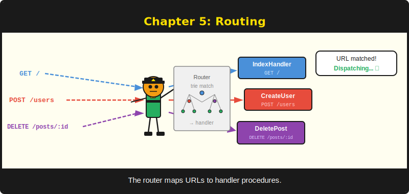
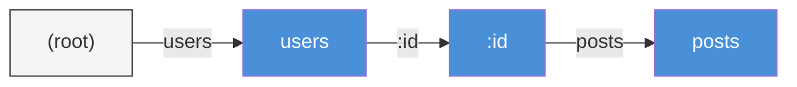

# บทที่ 5: Routing



*สอนให้เซิร์ฟเวอร์รู้ว่า handler ไหนรับผิดชอบ URL ไหน*

---

## วัตถุประสงค์การเรียนรู้

**หลังจากอ่านบทนี้จบ คุณจะสามารถ:**

- ลงทะเบียน route สำหรับ HTTP method ทุกประเภทด้วย `Engine::GET`, `POST`, `PUT`, `PATCH`, `DELETE` และ `Any`
- ดึงค่า named parameter จาก URL path ด้วย segment แบบ `:param`
- ใช้ wildcard route แบบ `*path` เพื่อรับ path segment ที่เหลือทั้งหมด
- อธิบายลำดับความสำคัญของการจับคู่ route: exact segment ก่อน, ตามด้วย parameter แล้วจึง wildcard
- ตั้งค่า custom handler สำหรับกรณี 404 Not Found และ 405 Method Not Allowed

---

## 5.1 การลงทะเบียน Route

Route คือข้อตกลงระหว่าง URL pattern กับ handler function เมื่อ request เข้ามาพร้อม `GET /api/posts/42` งานของ router คือค้นหา handler ที่ลงทะเบียนไว้สำหรับ pattern นั้น แล้วส่ง request ไปให้ หากไม่พบ handler ที่ตรงกัน เซิร์ฟเวอร์จะตอบกลับด้วย 404 นั่นคือทั้งหมดที่ต้องทำ

module `Engine` ของ PureSimple มี convenience function ที่แมปตรงกับ HTTP method แต่ละตัว ทุก function รับ pattern string และ handler address แล้วส่งต่อให้ `Router::Insert` พร้อมระบุ method ที่เหมาะสม:

```purebasic
EnableExplicit
; ตัวอย่างที่ 5.1 — ลงทะเบียน route ด้วย Engine convenience function
Procedure IndexHandler(*C.RequestContext)
  *C\StatusCode   = 200
  *C\ResponseBody = "Welcome"
  *C\ContentType  = "text/plain"
EndProcedure

Procedure GetPostHandler(*C.RequestContext)
  *C\StatusCode   = 200
  *C\ResponseBody = "Post detail"
  *C\ContentType  = "text/plain"
EndProcedure

Procedure CreatePostHandler(*C.RequestContext)
  *C\StatusCode   = 201
  *C\ResponseBody = "Created"
  *C\ContentType  = "text/plain"
EndProcedure

Engine::GET("/", @IndexHandler())
Engine::GET("/posts/:id", @GetPostHandler())
Engine::POST("/posts", @CreatePostHandler())
```

operator `@` ใช้ดึง address ของ procedure ออกมา ซึ่งก็คือ function pointer วิธีนี้คือหัวใจของการลงทะเบียน handler ใน PureSimple โดยไม่ต้องพึ่ง object system หรือ interface dispatch รูปแบบนี้คล้ายกับ Gin framework ของ Go อย่างน่าประหลาดใจ ใน Go คุณเขียน `r.GET("/path", handler)` ส่วน PureSimple คุณเขียน `Engine::GET("/path", @Handler())` ทั้ง `@` และวงเล็บคือวิธีที่ PureBasic สื่อสารสิ่งเดียวกัน

ภายใต้ฝากาบ แต่ละ call ของ `Engine::GET` ทำงานเพียงอย่างเดียว:

```purebasic
; จาก src/Engine.pbi — procedure Engine::GET
Procedure GET(Pattern.s, Handler.i)
  Router::Insert("GET", Pattern, Handler)
EndProcedure
```

function `Engine::Any` ลงทะเบียน handler เดิมสำหรับ method มาตรฐานทั้งห้า เหมาะสำหรับ catch-all route หรือ health check endpoint ที่ต้องรับทุก method:

```purebasic
EnableExplicit
; ตัวอย่างที่ 5.2 — ลงทะเบียน route สำหรับ HTTP method ทุกประเภท
Procedure HealthHandler(*C.RequestContext)
  *C\StatusCode   = 200
  *C\ResponseBody = "OK"
  *C\ContentType  = "text/plain"
EndProcedure

Engine::Any("/health", @HealthHandler())
```

> **เปรียบเทียบ:** ใน Gin (Go) คุณเขียน `r.GET("/path", handler)` ใน Express (Node.js) คุณเขียน `app.get("/path", handler)` ใน PureSimple คุณเขียน `Engine::GET("/path", @Handler())` pattern นี้เป็นสากลในทุก web framework — เปลี่ยนแค่เครื่องหมายวรรคตอน

---

## 5.2 Named Parameter

Route แบบ static อย่าง `/posts` และ `/about` ใช้ได้เพียงระดับหนึ่ง application จริงต้องการ segment แบบ dynamic เช่น `/42` ใน `/posts/42` ที่ระบุ resource เฉพาะ PureSimple รองรับสิ่งนี้ด้วย **named parameter** โดยใช้เครื่องหมายโคลอนนำหน้าใน route pattern

```purebasic
EnableExplicit
; ตัวอย่างที่ 5.3 — การดึงค่า named parameter
Procedure UserHandler(*C.RequestContext)
  Protected userId.s = Ctx::Param(*C, "id")
  *C\StatusCode   = 200
  *C\ResponseBody = "User ID: " + userId
  *C\ContentType  = "text/plain"
EndProcedure

Engine::GET("/users/:id", @UserHandler())
```

เมื่อ request เข้ามาสำหรับ `GET /users/42` router จะจับคู่ segment `:id` กับค่า literal `42` แล้วเก็บคู่ key-value ไว้ใน context handler ดึงค่าออกมาด้วย `Ctx::Param(*C, "id")` ซึ่งคืน `"42"` ในรูปแบบ string โปรดสังเกตว่า parameter ทั้งหมดเป็น string หากต้องการค่าตัวเลข ต้องแปลงเองด้วย `Val()`

คุณสามารถใช้ named parameter หลายตัวใน route เดียวได้:

```purebasic
EnableExplicit
; ตัวอย่างที่ 5.4 — named parameter หลายตัว
Procedure CommentHandler(*C.RequestContext)
  Protected postId.s    = Ctx::Param(*C, "postId")
  Protected commentId.s = Ctx::Param(*C, "commentId")
  *C\StatusCode   = 200
  *C\ResponseBody = "Post " + postId + ", Comment " + commentId
  *C\ContentType  = "text/plain"
EndProcedure

Engine::GET("/posts/:postId/comments/:commentId",
            @CommentHandler())
```

request ไปยัง `/posts/7/comments/3` จะได้ `postId = "7"` และ `commentId = "3"` ชื่อ parameter ต้องไม่ซ้ำกันภายใน pattern เดียว การลงทะเบียน `/users/:id/posts/:id` จะทำให้เกิดผลลัพธ์ที่คลุมเครือ

> **เบื้องหลัง:** router เก็บ parameter แบบ key-value คู่ขนานไว้ใน string สองตัวบน `RequestContext` ได้แก่ `ParamKeys` และ `ParamVals` โดยใช้ `Chr(9)` (tab character) เป็นตัวคั่น `Ctx::Param` ค้นหาชื่อใน `ParamKeys` แล้วคืนค่าที่ตรงกันจาก `ParamVals` การออกแบบด้วย tab-delimited นี้หลีกเลี่ยงการ allocate map ทุก request ซึ่งสำคัญมากเมื่อต้องรับ request หลักพันต่อวินาทีบนเซิร์ฟเวอร์ single-threaded

---

## 5.3 Wildcard Route

บางครั้งคุณต้องการ route ที่จับคู่ทุก path ใต้ prefix หนึ่ง file server ที่แมป `/static/css/style.css` และ `/static/js/app.js` ไปยัง handler เดียวกันต้องการวิธีจับ path ที่เหลือทั้งหมด PureSimple รองรับสิ่งนี้ด้วย **wildcard parameter** โดยใช้เครื่องหมายดอกจันนำหน้า:

```purebasic
EnableExplicit
; ตัวอย่างที่ 5.5 — wildcard route สำหรับจับ path ที่เหลือ
Procedure StaticHandler(*C.RequestContext)
  Protected filePath.s = Ctx::Param(*C, "filepath")
  *C\StatusCode   = 200
  *C\ResponseBody = "Serving file: " + filePath
  *C\ContentType  = "text/plain"
EndProcedure

Engine::GET("/static/*filepath", @StaticHandler())
```

request ไปยัง `/static/css/style.css` จะตั้งค่า `filepath` เป็น `"css/style.css"` request ไปยัง `/static/images/logo.png` จะตั้งค่าเป็น `"images/logo.png"` wildcard กินทุกอย่างตั้งแต่ตำแหน่งของมันจนถึงท้าย URL รวมถึง slash ด้วย

> **คำเตือน:** segment ของ wildcard ต้องเป็น segment สุดท้ายใน pattern คุณไม่สามารถลงทะเบียน `/static/*filepath/edit` ได้เพราะ wildcard ไม่รู้ว่าจะหยุดกินตรงไหน PureSimple จะลงทะเบียน route นั้น แต่จะไม่มีอะไรจับคู่ได้หลัง wildcard เลย

Wildcard ยังมีประโยชน์สำหรับ fallback route ของ single-page application (SPA) ที่เซิร์ฟเวอร์ต้องส่ง HTML เดิมกลับไปสำหรับ URL ทุก URL ใต้ prefix เพื่อให้ JavaScript router ฝั่ง client ทำงานต่อ:

```purebasic
EnableExplicit
; ตัวอย่างที่ 5.6 — SPA fallback route
Procedure SpaHandler(*C.RequestContext)
  *C\StatusCode   = 200
  *C\ResponseBody = "<html>SPA shell</html>"
  *C\ContentType  = "text/html"
EndProcedure

Engine::GET("/app/*path", @SpaHandler())
```

---

## 5.4 Radix Trie

Router ของ PureSimple ใช้ **radix trie** (หรือที่เรียกว่า prefix tree) สำหรับเก็บและจับคู่ route การเข้าใจโครงสร้างข้อมูลนี้จะอธิบายได้ว่าทำไมการจับคู่ route จึงรวดเร็ว และทำไมกฎลำดับความสำคัญถึงทำงานในแบบที่เป็น

trie คือ tree ที่แต่ละ node แทน path segment ลองพิจารณา route ที่ลงทะเบียนสามตัว: `/users`, `/users/:id` และ `/users/:id/posts` trie มีหน้าตาดังนี้:


*รูปที่ 5.1 — Radix trie สำหรับสาม route แต่ละ node คือ path segment router เดิน tree ทีละ segment เพื่อจับคู่ request path กับ node label*

เมื่อ request สำหรับ `/users/42/posts` เข้ามา router เริ่มต้นที่ root แล้วเดิน tree ทีละ segment มันจับคู่ `users` แบบตรงตัว จากนั้นจับคู่ `42` กับ parameter node `:id` (พร้อมเก็บ `id = "42"`) แล้วจับคู่ `posts` แบบตรงตัว หาก node ปลายทางมี handler ลงทะเบียนไว้ การจับคู่ก็สำเร็จ

การ implement เก็บ node ในรูปแบบ array คู่ขนานสี่ตัวแทนที่จะเป็น linked object:

```purebasic
; จาก src/Router.pbi — Trie storage
#_MAX = 512

Global Dim _Seg.s(#_MAX)       ; node segment string
Global Dim _Handler.i(#_MAX)   ; terminal handler address
Global Dim _Child.i(#_MAX)     ; first child index
Global Dim _Sibling.i(#_MAX)   ; next sibling index
Global _Cnt.i = 1              ; next free slot
Global NewMap _Root.i()        ; method -> root node index
```

แต่ละ method (`GET`, `POST` เป็นต้น) มี root node เป็นของตัวเอง เก็บไว้ใน map โดยใช้ method string เป็น key นั่นหมายความว่า `GET /users` และ `POST /users` มี handler แยกกันได้ ซึ่งเป็นสิ่งที่ต้องการพอดี

> **เบื้องหลัง:** การออกแบบด้วย parallel array เป็นการ optimize แบบ PureBasic โดยเจตนา module body ใน PureBasic ไม่สามารถอ้างอิง structure ที่นิยามนอก module ใน global array ได้โดยตรง การใช้ array ของ simple type สี่ตัวหลีกเลี่ยงข้อจำกัดนี้ได้ทั้งหมด อีกทั้งยังมี cache locality ที่ดีเยี่ยมเพราะ array อยู่ต่อเนื่องในหน่วยความจำ ข้อแลกเปลี่ยนคือจำนวน node สูงสุด 512 ตัว ซึ่งมากกว่าพอสำหรับ application จริงทุกตัว ถ้าคุณลงทะเบียน segment ครบ 512 ตัวแล้วยังต้องการเพิ่มอีก แสดงว่า API ของคุณมีปัญหาอื่นที่ต้องแก้ก่อน

---

## 5.5 ลำดับความสำคัญในการจับคู่

เมื่อ router เจอ path segment หนึ่ง มันต้องตัดสินใจว่าจะไปตาม child node ไหน PureSimple ใช้ลำดับความสำคัญที่แน่นอน: **exact segment ชนะ named parameter ชนะ wildcard** ไม่มีข้อยกเว้น Exact ชนะ param ชนะ wildcard ทุกครั้ง ไม่ต้องเจรจา

ลองพิจารณา route สามตัวที่ลงทะเบียนบน method เดียวกัน:

```purebasic
EnableExplicit
; ตัวอย่างที่ 5.7 — การแสดงลำดับความสำคัญของ route
Engine::GET("/files/readme",    @ReadmeHandler())
Engine::GET("/files/:name",     @FileByNameHandler())
Engine::GET("/files/*path",     @CatchAllHandler())
```

request ไปยัง `/files/readme` จับคู่กับ route แรกแบบตรงตัว request ไปยัง `/files/report` จับคู่กับ route ที่สองโดยมี `name = "report"` request ไปยัง `/files/docs/guide.pdf` จับคู่กับ route ที่สามโดยมี `path = "docs/guide.pdf"` router ไม่ลังเล — ลองตรงก่อน ตามด้วย parameter แล้วจึง wildcard

การ implement ใน `Router::_Match` ทำให้ลำดับความสำคัญนี้ชัดเจน:

```purebasic
; จาก src/Router.pbi — ลำดับความสำคัญใน procedure _Match
; รอบแรก: จับคู่ exact segment (ความสำคัญสูงสุด)
While child <> 0
  cseg = _Seg(child)
  If Left(cseg, 1) = ":"
    If paramChild = 0 : paramChild = child : EndIf
  ElseIf Left(cseg, 1) = "*"
    If wildChild = 0 : wildChild = child : EndIf
  ElseIf cseg = seg
    result = _Match(child, Segs(), Depth + 1,
                    Total, CtxPtr)
    If result <> 0 : ProcedureReturn result : EndIf
  EndIf
  child = _Sibling(child)
Wend

; รอบสอง: จับคู่ :param พร้อม backtrack หากล้มเหลว
If paramChild
  ; ... ลอง param, backtrack ถ้าไม่พบ handler
EndIf

; รอบสาม: *wildcard กินทุก segment ที่เหลือ
If wildChild
  ; ... กินทุกอย่าง คืน handler
EndIf
```

รอบแรกสแกน child ทั้งหมดเพื่อหา exact match หากพบ มัน recurse ทันที จะผ่านไปรอบสองและลอง parameter matching ก็ต่อเมื่อ exact match ล้มเหลว (ไม่มี handler อยู่ปลายทาง) wildcard คือทางเลือกสุดท้ายเสมอ

พฤติกรรม backtracking ก็น่าสนใจ หาก path `:param` นำไปสู่ทางตัน (ไม่มี handler ที่ node ปลายทาง) router จะ reset สถานะ parameter แล้วไปที่ wildcard pass ซึ่งหมายความว่าลำดับการลงทะเบียนไม่มีผล ความสำคัญเป็นเรื่องของโครงสร้าง ไม่ใช่ลำดับเวลา

> **ข้อควรระวังใน PureBasic:** procedure `_Match` ส่ง `RequestContext` เป็น integer `.i` ธรรมดา (raw pointer address) แทนที่จะเป็น `*C.RequestContext` แบบ typed PureBasic module body บางครั้งมีปัญหากับ structure type ที่นิยามจากภายนอกใน recursive procedure parameter typed alias จึงถูกสร้างใหม่ภายใน procedure ด้วย `*C = CtxPtr` มันทำงานได้ แต่เป็นแบบที่ทำให้คุณชื่นชม type-safe language ในเช้าวันจันทร์

---

## 5.6 Custom Error Handler

เมื่อไม่มี route ใดจับคู่ได้ PureSimple จะส่ง response `404 Not Found` แบบ plain-text เป็นค่าตั้งต้น เมื่อมี route สำหรับ path แต่ไม่มีสำหรับ method ที่ร้องขอ (เช่น `DELETE /health` ทั้งที่ลงทะเบียนแค่ `GET /health`) response ตั้งต้นคือ `405 Method Not Allowed` ทั้งสองทำงานได้แต่ไม่สวย คุณจะอยากเปลี่ยนมัน

```purebasic
EnableExplicit
; ตัวอย่างที่ 5.8 — custom handler สำหรับ 404 และ 405
Procedure My404Handler(*C.RequestContext)
  *C\StatusCode   = 404
  *C\ResponseBody = "Nothing here. Check the URL."
  *C\ContentType  = "text/plain"
EndProcedure

Procedure My405Handler(*C.RequestContext)
  *C\StatusCode   = 405
  *C\ResponseBody = "This method is not allowed."
  *C\ContentType  = "text/plain"
EndProcedure

Engine::SetNotFoundHandler(@My404Handler())
Engine::SetMethodNotAllowedHandler(@My405Handler())
```

procedure `Engine::HandleNotFound` ตรวจสอบว่ามี custom handler ลงทะเบียนไว้หรือไม่ ถ้ามีก็เรียกผ่าน function pointer ถ้าไม่มีก็เขียน response ตั้งต้นโดยตรง:

```purebasic
; จาก src/Engine.pbi — HandleNotFound
Procedure HandleNotFound(*C.RequestContext)
  Protected fn.PS_HandlerFunc
  If _NotFoundHandler <> 0
    fn = _NotFoundHandler
    fn(*C)
  Else
    *C\StatusCode   = 404
    *C\ResponseBody = "404 Not Found"
    *C\ContentType  = "text/plain"
  EndIf
EndProcedure
```

ใน production application custom 404 handler ของคุณจะ render HTML template พร้อม navigation ที่ใช้งานได้ เพื่อให้ผู้ใช้หาทางกลับได้ ใน API มันจะส่ง JSON error object กลับไป กลไกเหมือนกันทุกกรณี ลงทะเบียน handler แล้ว PureSimple จะเรียกมันทุกครั้งที่จับคู่ route ล้มเหลว

> **เคล็ดลับ:** ลงทะเบียน custom error handler ก่อน start application เสมอ หน้า 404 ที่ออกแบบดีสามารถเปลี่ยนผู้เยี่ยมชมที่หลงทางให้กลับมาเป็นผู้ใช้ประจำได้ ส่วน plain-text `"404 Not Found"` ดิบๆ แค่บอกว่าไม่มีใครดูแลเว็บไซต์นี้

---

## สรุป

Routing คือเหตุผลที่ router มีอยู่: รับ method และ path ที่เข้ามา หา handler ที่ถูกต้อง และดึง dynamic segment ออกมาระหว่างทาง Radix trie ของ PureSimple เก็บ route อย่างมีประสิทธิภาพ รองรับ named parameter และ wildcard และใช้ลำดับความสำคัญที่แน่นอนเพื่อการ matching ที่คาดเดาได้ Custom error handler ให้คุณควบคุมสิ่งที่เกิดขึ้นเมื่อไม่มี route จับคู่ได้ เปลี่ยน default ของ framework ให้กลายเป็น personality ของ application คุณ

## สาระสำคัญ

- ลงทะเบียน route ด้วย `Engine::GET`, `POST`, `PUT`, `PATCH`, `DELETE` หรือ `Any` แต่ละตัว delegate ไปยัง `Router::Insert` พร้อม HTTP method string ที่เหมาะสม
- Named parameter (`:id`) จับคู่ path segment เดียวและดึงออกมาด้วย `Ctx::Param(*C, "id")` Wildcard (`*path`) กินทุก segment ที่เหลือ Wildcard ต้องเป็น segment สุดท้ายใน pattern
- ลำดับความสำคัญในการจับคู่เป็นสัมบูรณ์: exact segment ชนะ named parameter ชนะ wildcard ความสำคัญนี้อยู่ในโครงสร้างของ trie ไม่ขึ้นกับลำดับการลงทะเบียน
- Custom handler สำหรับ 404 และ 405 แทนที่ค่าตั้งต้นด้วย `Engine::SetNotFoundHandler` และ `Engine::SetMethodNotAllowedHandler`

## คำถามทบทวน

1. ถ้าคุณลงทะเบียน `Engine::GET("/files/readme", ...)`, `Engine::GET("/files/:name", ...)` และ `Engine::GET("/files/*path", ...)` handler ไหนทำงานสำหรับ request ไปยัง `/files/readme`? ไหนทำงานสำหรับ `/files/report.pdf`? ไหนทำงานสำหรับ `/files/docs/api/index.html`?
2. ทำไม router ถึงใช้ radix trie แทนที่จะเป็นรายการ route แบบ flat? โครงสร้าง tree ให้ข้อได้เปรียบอะไรในการจับคู่?
3. *ลองทำ:* ลงทะเบียน route ห้าตัวสำหรับ blog อย่างง่าย: `GET /` (index), `GET /posts/:slug` (single post), `POST /posts` (สร้าง), `PUT /posts/:slug` (อัปเดต), `DELETE /posts/:slug` (ลบ) เขียน handler ที่ส่ง plain-text อธิบายสิ่งที่แต่ละ route ทำ compile และทดสอบด้วย `curl`
