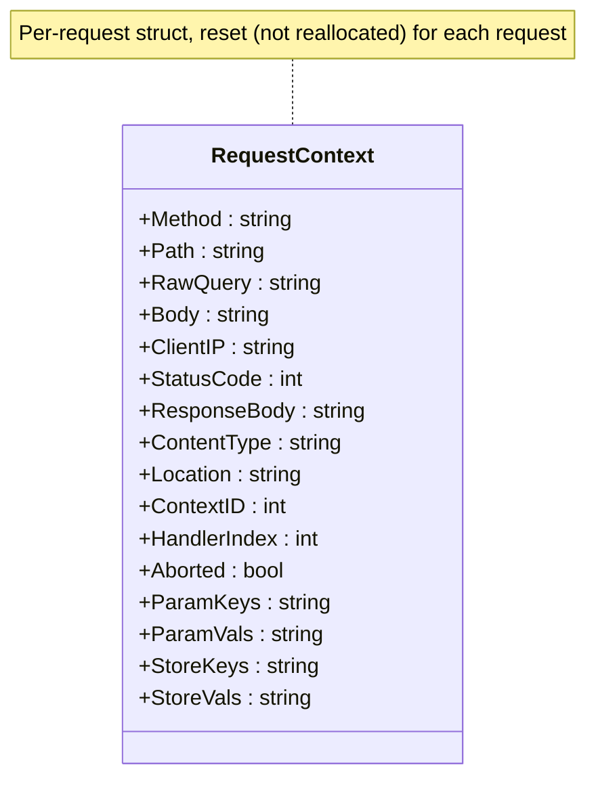
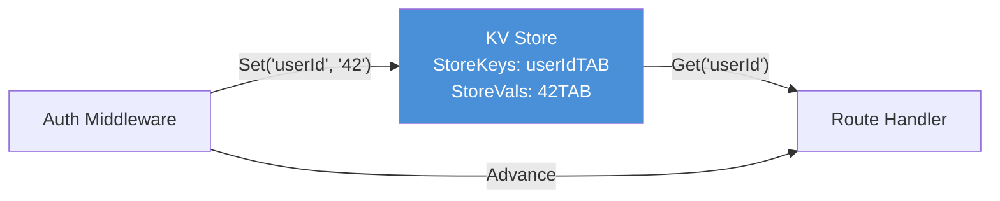

# บทที่ 6: Request Context

*กระเป๋าเป้ที่ทุก request แบกติดตัวตลอดห่วงโซ่ handler*

---

## วัตถุประสงค์การเรียนรู้

**หลังจากอ่านบทนี้จบ คุณจะสามารถ:**

- ระบุทุก field ใน structure `RequestContext` และอธิบายหน้าที่ของแต่ละ field
- ใช้ `Ctx::Advance` เพื่อส่งต่อการควบคุมไปยัง handler ถัดไปในห่วงโซ่ และอธิบายว่าทำไมถึงเรียกไม่ได้ว่า `Next`
- หยุดห่วงโซ่ handler ด้วย `Ctx::Abort`, `Ctx::AbortWithStatus` และ `Ctx::AbortWithError`
- ส่งข้อมูลระหว่าง middleware และ handler โดยใช้ KV store (`Ctx::Set` และ `Ctx::Get`)
- ดึง route parameter จาก context ด้วย `Ctx::Param`

---

## 6.1 สิ่งที่อาศัยอยู่ใน RequestContext

ทุก request ที่เข้ามาใน PureSimple จะได้รับ `RequestContext` ซึ่งเป็น structure เดี่ยวที่บรรจุทุกอย่างที่ handler chain ต้องรู้เกี่ยวกับ request ขาเข้า และทุกอย่างที่ต้องการเพื่อสร้าง response ขาออก ถ้าคุณเคยใช้ Gin ใน Go นี่คือ `*gin.Context` ถ้าคุณเคยใช้ Express ใน Node.js นี่คือ `req` และ `res` หลอมรวมเป็นหนึ่ง PureSimple เลือกแนวทาง single-struct เพราะการส่ง pointer เดียวง่ายกว่าการส่งสอง และความเรียบง่ายคือคุณสมบัติอีกอย่าง

structure `RequestContext` อยู่ใน `src/Types.pbi` และเป็น type ที่สำคัญที่สุดในทั้ง framework นี่คือมัน พร้อมคำอธิบายจำแนกตามหน้าที่:

```purebasic
; ตัวอย่างที่ 6.1 — structure RequestContext (จาก src/Types.pbi)
Structure RequestContext
  ; --- ข้อมูล request ขาเข้า ---
  Method.s            ; "GET", "POST" เป็นต้น
  Path.s              ; URL path เช่น "/api/users/42"
  RawQuery.s          ; query string เช่น "page=1&limit=10"
  Body.s              ; raw request body (สำหรับ JSON binding)
  ClientIP.s          ; remote address

  ; --- สถานะ response ขาออก ---
  StatusCode.i        ; HTTP status ที่จะส่ง (ค่าตั้งต้น 200)
  ResponseBody.s      ; เนื้อหา response
  ContentType.s       ; MIME type (ค่าตั้งต้น "text/plain")
  Location.s          ; redirect URL

  ; --- กลไกห่วงโซ่ handler ---
  ContextID.i         ; หมายเลข slot สำหรับ handler array
  HandlerIndex.i      ; ตำแหน่งปัจจุบันในห่วงโซ่
  Aborted.i           ; #True ถ้าเรียก Abort() แล้ว

  ; --- route param และ query (คั่นด้วย tab) ---
  ParamKeys.s
  ParamVals.s
  QueryKeys.s
  QueryVals.s

  ; --- KV store สำหรับการสื่อสารระหว่าง middleware ---
  StoreKeys.s
  StoreVals.s

  ; --- JSON binding handle ---
  JSONHandle.i

  ; --- Cookie / session ---
  Cookie.s            ; raw Cookie header
  SetCookies.s        ; Set-Cookie directive
  Authorization.s     ; raw Authorization header
  SessionID.s         ; session ID จาก cookie
  SessionKeys.s       ; session data key
  SessionVals.s       ; session data value
EndStructure
```

นั่นคือ 25 field ดูเยอะ จนกว่าคุณจะตระหนักว่ามันแทนที่สิ่งที่ framework อื่นกระจายอยู่ใน 3-4 object แยกกัน context คือร้านค้าครบวงจรสำหรับการอ่านข้อมูล request เขียนข้อมูล response จัดการห่วงโซ่ handler และส่งข้อมูลระหว่าง middleware layer


*รูปที่ 6.1 — structure RequestContext ข้อมูล request ไหลเข้าผ่าน field บน ข้อมูล response ไหลออกผ่าน field กลาง สถานะห่วงโซ่ handler และ KV store อยู่ส่วนล่าง*

> **เบื้องหลัง:** context ไม่ถูก allocate ใหม่ทุก request PureSimple เก็บ pool แบบ rolling จำนวน 32 context slot (`#_MAX_CTX = 32`) เมื่อ request เข้ามา `Ctx::Init` เลือก slot ถัดไป reset ทุก field ให้เป็นค่าตั้งต้น แล้วคืน memory address เดิม วิธีนี้หลีกเลี่ยงการ allocate บน heap ทุก request ซึ่งสำคัญมากเมื่อ memory allocator ของ PureBasic คือสิ่งเดียวที่คั่นระหว่างคุณกับการหยุดทำงานจากการ garbage collection ข้อแลกเปลี่ยนคือจำนวน concurrent context สูงสุด 32 ตัว ซึ่งเพียงพอสำหรับเซิร์ฟเวอร์ single-threaded

---

## 6.2 การ Initialize Context

ก่อนจะใช้ context ได้ มันต้อง initialize ด้วย method และ path ของ request ขาเข้า `Ctx::Init` reset ทุก field ให้เป็นค่าตั้งต้นที่สะอาด กำหนด slot ID และล้างห่วงโซ่ handler:

```purebasic
; ตัวอย่างที่ 6.2 — Ctx::Init reset context
; (จาก src/Context.pbi)
Procedure Init(*C.RequestContext, Method.s, Path.s)
  Protected slot.i = _SlotSeq % #_MAX_CTX
  _SlotSeq + 1
  *C\Method       = Method
  *C\Path         = Path
  *C\RawQuery     = ""
  *C\Body         = ""
  *C\ClientIP     = ""
  *C\StatusCode   = 200
  *C\ResponseBody = ""
  *C\ContentType  = "text/plain"
  *C\Location     = ""
  *C\ParamKeys    = ""
  *C\ParamVals    = ""
  *C\QueryKeys    = ""
  *C\QueryVals    = ""
  *C\StoreKeys    = ""
  *C\StoreVals    = ""
  *C\ContextID    = slot
  *C\HandlerIndex = 0
  *C\Aborted      = #False
  *C\JSONHandle   = 0
  *C\Cookie       = ""
  *C\SetCookies   = ""
  *C\Authorization = ""
  *C\SessionID    = ""
  *C\SessionKeys  = ""
  *C\SessionVals  = ""
  _HandlerCount(slot) = 0
EndProcedure
```

สองสิ่งที่น่าสังเกต ประการแรก `StatusCode` ตั้งต้นเป็น 200 และ `ContentType` ตั้งต้นเป็น `"text/plain"` ถ้า handler ของคุณทำแค่กำหนด `ResponseBody` client จะได้รับ response แบบ 200 plain-text ค่า default ที่สมเหตุสมผลช่วยลด boilerplate ประการที่สอง การกำหนด slot ใช้ modular counter (`_SlotSeq % #_MAX_CTX`) ที่วนรอบ นี่คือ rolling pool ไม่ใช่การกำหนดแบบ fixed Slot 0 จะถูกนำมาใช้ใหม่หลัง request ครบ 32 ตัว เนื่องจากแต่ละ request เสร็จสิ้นก่อนที่ slot นั้นจะถูกต้องการอีกในเซิร์ฟเวอร์ single-threaded วิธีนี้จึงทำงานได้อย่างสมบูรณ์

> **เคล็ดลับ:** ในโค้ด test คุณจะสร้าง structure `RequestContext` เองและเรียก `Ctx::Init` เอง นี่คือวิธีมาตรฐานในการตั้งค่า context สำหรับ unit test handler และ middleware โดยไม่ต้องรัน HTTP server จริง

---

## 6.3 Advance — "Next" ที่เรียกว่า Next ไม่ได้

ห่วงโซ่ handler คือกระดูกสันหลังของการประมวลผล request ใน PureSimple middleware function และ route handler สุดท้ายถูกรวมเป็น flat array เดียว เมื่อ request ถูก dispatch PureSimple เรียก handler แรก handler นั้นต้องเรียก `Ctx::Advance(*C)` อย่างชัดเจนเพื่อส่งต่อการควบคุมไปยัง handler ถัดไปในห่วงโซ่ ถ้าไม่เรียก `Advance` ห่วงโซ่จะหยุด

method นี้ชื่อ `Advance` เพราะ `Next` เป็น reserved keyword PureBasic ใช้ `Next` ปิด loop `For...Next` และมันจะไม่ยอมต่อรอง ครั้งหนึ่งระหว่างพัฒนาช่วงแรก ผมตั้งชื่อ method นี้ว่า `Next` แล้วดู compiler โยน error ที่ไม่มีประโยชน์เรื่อง loop body หายไป และใช้เวลานานกว่าจะยอมรับว่า `Next` ไม่ใช่ชื่อที่ใช้ได้ ดังนั้นจึงใช้ `Advance` แทน

```purebasic
; ตัวอย่างที่ 6.3 — Ctx::Advance วน iterate ห่วงโซ่ handler
; (จาก src/Context.pbi)
Procedure Advance(*C.RequestContext)
  Protected slot.i = *C\ContextID
  Protected idx.i  = *C\HandlerIndex
  Protected cnt.i  = _HandlerCount(slot)
  Protected fn.PS_HandlerFunc
  If Not *C\Aborted And idx < cnt
    *C\HandlerIndex + 1
    fn = _Handlers(slot, idx)
    If fn : fn(*C) : EndIf
  EndIf
EndProcedure
```

logic เรียบง่าย ถ้า context ยังไม่ถูก abort และยังมี handler เหลืออีก ให้เพิ่ม index แล้วเรียก handler ถัดไปผ่าน function pointer การเพิ่ม index เกิด *ก่อน* การเรียก ดังนั้นเมื่อ handler ที่ถูกเรียกนั้น เรียก `Advance` เองก็จะได้ handler ที่อยู่หลังมัน ไม่ใช่ตัวเอง วิธีนี้ป้องกัน infinite recursion

รูปแบบ middleware เกิดขึ้นจากการออกแบบนี้ middleware function ทำงานบางอย่างก่อน `Advance` เรียก `Advance` เพื่อให้ห่วงโซ่ที่เหลือทำงาน จากนั้นทำงานบางอย่างหลังจาก `Advance` คืนค่า:

```purebasic
EnableExplicit
; ตัวอย่างที่ 6.4 — รูปแบบ middleware ใช้ Advance
Procedure TimingMiddleware(*C.RequestContext)
  Protected t0.i = ElapsedMilliseconds()

  Ctx::Advance(*C)   ; รัน handler ที่เหลือในห่วงโซ่

  Protected elapsed.i = ElapsedMilliseconds() - t0
  ; "after" logic ทำงานเมื่อ Advance คืนค่า
  PrintN("Request took " + Str(elapsed) + "ms")
EndProcedure
```

โค้ดก่อน `Advance` ทำงานตอนขาเข้า โค้ดหลัง `Advance` ทำงานตอนขาออก นี่คือ onion model: แต่ละ middleware ห่อหุ้มตัวที่อยู่ข้างใน บทที่ 7 สำรวจรูปแบบนี้อย่างละเอียด

> **ข้อควรระวังใน PureBasic:** `Next` เป็น reserved keyword ใน PureBasic มันปิด loop `For...Next` คุณไม่สามารถใช้เป็นชื่อ procedure, variable หรือ module method ได้ PureSimple ใช้ `Advance` แทน ถ้าคุณเห็น `Next` ในเอกสาร Go framework แล้วนำมาใช้ใน PureBasic compiler จะปฏิเสธด้วย error ที่พูดถึงโครงสร้าง loop ไม่ใช่ naming conflict เป็น error ที่ทำให้คุณตั้งคำถามกับตัวเองตี 4

---

## 6.4 Abort — การหยุดห่วงโซ่

บางครั้ง middleware ต้องหยุดห่วงโซ่ทั้งหมด authentication middleware ที่ไม่พบ credential ควรส่ง 401 กลับและป้องกันไม่ให้ route handler ทำงาน rate-limiting middleware ที่ตรวจพบการใช้งานผิดปกติควรส่ง 429 และปิดประตู `Ctx::Abort` มีกลไกนี้ให้

```purebasic
; ตัวอย่างที่ 6.5 — Ctx::Abort และ variant ต่างๆ
; (จาก src/Context.pbi)

; หยุดห่วงโซ่ — handler ถัดไปทั้งหมดถูกข้ามไป
Procedure Abort(*C.RequestContext)
  *C\Aborted = #True
EndProcedure

; Abort และกำหนด HTTP status code
Procedure AbortWithStatus(*C.RequestContext,
                           StatusCode.i)
  *C\Aborted    = #True
  *C\StatusCode = StatusCode
EndProcedure

; Abort กำหนด status และเขียน error body แบบ plain-text
Procedure AbortWithError(*C.RequestContext,
                          StatusCode.i, Message.s)
  *C\Aborted      = #True
  *C\StatusCode   = StatusCode
  *C\ResponseBody = Message
  *C\ContentType  = "text/plain"
EndProcedure
```

เมื่อ `Aborted` ถูกตั้งเป็น `#True` `Advance` จะตรวจสอบ flag นี้ก่อนเรียก handler ถัดไปและ short-circuit ทันที ไม่มี handler ใดทำงานอีก response ถูกสร้างจากสิ่งที่ middleware ที่ abort เขียนไว้ใน `StatusCode`, `ResponseBody` และ `ContentType`

นี่คือตัวอย่างในทางปฏิบัติ authentication guard:

```purebasic
EnableExplicit
; ตัวอย่างที่ 6.6 — Authentication middleware ใช้ Abort
Procedure AuthGuard(*C.RequestContext)
  If *C\Authorization = ""
    Ctx::AbortWithError(*C, 401,
                        "Authorization required")
    ProcedureReturn
  EndIf
  Ctx::Advance(*C)
EndProcedure
```

สังเกต `ProcedureReturn` หลัง `AbortWithError` นี่คือนิสัยที่ควรสร้าง แม้ว่า `Advance` จะตรวจสอบ aborted flag และจะไม่เรียก handler ถัดไป แต่การ return ทันทีทำให้ control flow ชัดเจน และยังป้องกัน "after" logic ใน middleware จากการทำงาน ซึ่งปกติแล้วคือสิ่งที่ต้องการเมื่อ abort

> **คำเตือน:** การเรียก `Abort` ไม่ได้ย้อนกลับ side effect จาก handler ที่ทำงานไปแล้ว ถ้า middleware แรกในห่วงโซ่เขียนลง KV store และ middleware ที่สองเรียก `Abort` entries ใน KV store จาก middleware แรกยังคงอยู่ `Abort` ป้องกัน handler ในอนาคตจากการทำงาน ไม่ได้ยกเลิกสิ่งที่เกิดขึ้นไปแล้ว

---

## 6.5 KV Store

Middleware และ handler มักต้องแชร์ข้อมูล authentication middleware อาจ validate token แล้วต้องการส่ง user ID ไปยัง route handler logging middleware อาจสร้าง request ID และต้องการให้ middleware อื่นรวมมันไว้ใน output KV store ของ context มีช่องทางนี้ให้

```purebasic
EnableExplicit
; ตัวอย่างที่ 6.7 — ใช้ KV store สำหรับการสื่อสาร
; ระหว่าง middleware
Procedure RequestIDMiddleware(*C.RequestContext)
  Protected reqId.s = "req-" + Str(Random(99999))
  Ctx::Set(*C, "requestId", reqId)
  Ctx::Advance(*C)
EndProcedure

Procedure MyHandler(*C.RequestContext)
  Protected reqId.s = Ctx::Get(*C, "requestId")
  *C\StatusCode   = 200
  *C\ResponseBody = "Request ID: " + reqId
  *C\ContentType  = "text/plain"
EndProcedure
```

`Ctx::Set` ต่อท้าย key และ value ลงใน string `StoreKeys` และ `StoreVals` แบบ tab-delimited บน context `Ctx::Get` ค้นหา key แล้วคืนค่าที่ตรงกัน หรือ string ว่างถ้าไม่พบ key:

```purebasic
; จาก src/Context.pbi — Set และ Get
Procedure Set(*C.RequestContext, Key.s, Val.s)
  *C\StoreKeys + Key + Chr(9)
  *C\StoreVals + Val + Chr(9)
EndProcedure

Procedure.s Get(*C.RequestContext, Key.s)
  ProcedureReturn _LookupTab(*C\StoreKeys,
                              *C\StoreVals, Key)
EndProcedure
```


*รูปที่ 6.2 — การไหลของข้อมูลใน KV store Middleware เขียน key-value pair ด้วย `Set` handler และ middleware ปลายทางอ่านด้วย `Get` ข้อมูลอยู่บน RequestContext และถูก reset สำหรับแต่ละ request*

KV store ออกแบบมาให้เรียบง่ายโดยเจตนา มันไม่ใช่ map แต่เป็น string สองตัวกับ linear search สำหรับ key จำนวนน้อยที่ request ทั่วไปพกติดมา (ปกติน้อยกว่า 10 ตัว) linear search บน string สั้นเร็วกว่าการ allocate map และ hashing ถ้าคุณต้องเก็บ key 50 ตัวต่อ request KV store ยังเร็วพอ แต่ architecture ของคุณอาจต้องคิดใหม่

> **เบื้องหลัง:** tab character (`Chr(9)`) คือตัวคั่นสำหรับการเก็บข้อมูลแบบ parallel string ทั้งหมดใน PureSimple ทั้ง route parameter, query parameter และ KV store ซึ่งหมายความว่า value ของคุณต้องไม่มี tab character ถ้าคุณเก็บ value ที่มี tab `_LookupTab` จะแยกมันผิดพลาด helper function `SafeVal` (แนะนำในตัวอย่าง blog, บทที่ 22) ตัด tab จาก user input ก่อนเก็บ นี่คือข้อจำกัดที่ลืมได้ง่ายจนกว่าจะพัง production ดังนั้นลองนึกว่านี่คือ debugging hint แรกฟรีของคุณ

---

## 6.6 Dispatch และห่วงโซ่ Handler

ห่วงโซ่ handler ถูกประกอบโดย `Engine::CombineHandlers` ซึ่งเติม global middleware ไว้ก่อน route handler และเริ่มต้นด้วย `Ctx::Dispatch`:

```purebasic
; ตัวอย่างที่ 6.8 — Ctx::Dispatch เริ่มต้นห่วงโซ่
; (จาก src/Context.pbi)
Procedure Dispatch(*C.RequestContext)
  *C\HandlerIndex = 0
  *C\Aborted      = #False
  Advance(*C)
EndProcedure
```

`Dispatch` reset handler index เป็น 0 ล้าง abort flag (ในกรณีที่ context ถูกนำมาใช้ใหม่จาก request ที่ถูก abort ก่อนหน้า) แล้วเรียก `Advance` เพื่อเริ่มห่วงโซ่ จากนั้น แต่ละ handler เรียก `Advance` เพื่อต่อไป หรือเรียก `Abort` เพื่อหยุด เมื่อ handler สุดท้าย return โดยไม่เรียก `Advance` ห่วงโซ่ก็จบลงเองตามธรรมชาติ ไม่มีอะไรเหลือให้ advance แล้ว

วงจรชีวิตเต็มรูปแบบสำหรับ request เดียวมีดังนี้:

1. `Ctx::Init(*C, method, path)` — reset context
2. `Router::Match(method, path, *C)` — ค้นหา handler และเติม route param
3. `Engine::CombineHandlers(*C, routeHandler)` — สร้างห่วงโซ่: global middleware + route handler
4. `Ctx::Dispatch(*C)` — เริ่มต้นห่วงโซ่
5. แต่ละ handler ทำงาน เรียก `Advance` หรือ `Abort`
6. Response field บน `*C` ถูกอ่านโดย PureSimpleHTTPServer และส่งไปยัง client

นี่คือวงจรชีวิต request ทั้งหมด ไม่มี event ไม่มี callback ไม่มี promise ไม่มี future pointer เดียว ห่วงโซ่เดียว ผ่านครั้งเดียว ความเรียบง่ายนี้ตั้งใจ

---

## 6.7 การดึง Route Parameter

Route parameter ที่ router กำหนดระหว่างการจับคู่ถูกดึงออกมาด้วย `Ctx::Param`:

```purebasic
EnableExplicit
; ตัวอย่างที่ 6.9 — การดึง route parameter
Procedure ShowUser(*C.RequestContext)
  Protected userId.s = Ctx::Param(*C, "id")
  If userId = ""
    Ctx::AbortWithError(*C, 400, "Missing user ID")
    ProcedureReturn
  EndIf
  *C\StatusCode   = 200
  *C\ResponseBody = "User: " + userId
  *C\ContentType  = "text/plain"
EndProcedure

; ลงทะเบียนเป็น: Engine::GET("/users/:id", @ShowUser())
```

`Ctx::Param` delegate ไปยัง helper `_LookupTab` เดิมที่ KV store ใช้ มันค้นหาชื่อใน `ParamKeys` แล้วคืนค่าที่ตรงกันจาก `ParamVals` ถ้า parameter ไม่มีอยู่ (เพราะ route pattern ไม่รวมมัน หรือสะกดชื่อผิด) มันคืน string ว่าง ควรตรวจสอบ string ว่างเสมอเมื่อดึง parameter จาก route ที่ผู้ใช้เข้าถึงได้

> **เคล็ดลับ:** Route parameter เป็น string เสมอ ถ้าต้องการ ID แบบตัวเลข แปลงด้วย `Val(Ctx::Param(*C, "id"))` ถ้าต้องการตรวจสอบว่า parameter เป็น integer ที่ valid ให้ตรวจว่า `Val()` คืนค่าที่ไม่ใช่ศูนย์ หรือ string ไม่ว่าง เนื่องจาก `Val("abc")` คืน `0` ใน PureBasic ซึ่งแยกไม่ออกจาก `Val("0")`

---

## สรุป

`RequestContext` คือ structure เดียวที่ร้อยผ่านทุก handler และ middleware ใน PureSimple มันพก request data ขาเข้า, response field ขาออก, สถานะห่วงโซ่ handler, route parameter และ KV store สำหรับการสื่อสารระหว่าง middleware `Ctx::Init` reset มันสำหรับแต่ละ request จาก rolling pool ของ slot `Ctx::Advance` ส่งต่อการควบคุมไปยัง handler ถัดไปในห่วงโซ่ (ชื่อ `Advance` เพราะ PureBasic ใช้ `Next` สำหรับ loop) `Ctx::Abort` หยุดห่วงโซ่เมื่อ middleware ตัดสินว่า request ไม่ควรดำเนินต่อไป KV store ให้ middleware ส่งข้อมูลต่อไปโดยไม่ใช้ global variable และ `Ctx::Param` ดึง route parameter ที่ router กำหนดระหว่างการจับคู่

## สาระสำคัญ

- `RequestContext` คือ struct เดียวที่รวม request data, response state, กลไกห่วงโซ่ handler, route parameter และ KV store ถูก reset ต่อ request ไม่ถูก reallocate
- `Ctx::Advance` เรียก handler ถัดไปในห่วงโซ่ โค้ดก่อน `Advance` ทำงานตอนขาเข้า โค้ดหลัง `Advance` ทำงานตอนขาออก วิธีนี้สร้าง onion model สำหรับ middleware
- `Ctx::Abort` ตั้ง flag `Aborted` ซึ่งทำให้ `Advance` ข้าม handler ที่เหลือทั้งหมด ใช้ `AbortWithError` เพื่อตั้ง status code และ error message ในครั้งเดียว
- KV store (`Ctx::Set` / `Ctx::Get`) คือวิธีมาตรฐานในการส่งข้อมูลระหว่าง middleware และ handler Value ต้องไม่มี tab character

## คำถามทบทวน

1. ทำไม PureSimple ถึงใช้ rolling pool ของ 32 context slot แทนการ allocate `RequestContext` ใหม่ทุก request? ข้อแลกเปลี่ยนคืออะไร?
2. จะเกิดอะไรขึ้นถ้า middleware เรียก `Ctx::Abort` แต่ไม่เรียก `ProcedureReturn` ทันทีหลังจากนั้น? "after" logic ยังทำงานอยู่หรือไม่?
3. *ลองทำ:* เขียน middleware ที่สร้าง unique request ID (โดยใช้ `Random()`) เก็บไว้ใน KV store ด้วย `Ctx::Set` และพิมพ์มันออกหลัง `Ctx::Advance` คืนค่า ลงทะเบียนด้วย `Engine::Use` เพิ่ม route handler อย่างง่าย และตรวจสอบว่า request ID ปรากฏใน console output
