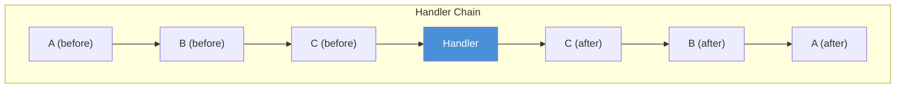
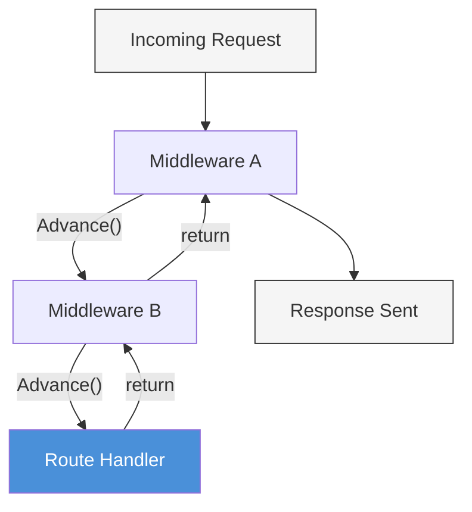

# บทที่ 7: Middleware

*ด่านตรวจที่ทุก request ต้องผ่าน*

---

**หลังจากอ่านบทนี้จบ คุณจะสามารถ:**

- อธิบาย pattern ของ middleware และ onion model ในการประมวลผล request
- ติดตามลำดับการทำงานของ middleware chain และทำนายว่าโค้ดไหนทำงานก่อนและหลัง handler
- อ่านและทำความเข้าใจ implementation ของ Logger และ Recovery middleware ใน PureSimple
- เขียน custom middleware สำหรับงานต่างๆ เช่น การสร้าง request ID, การจับเวลา และ rate limiting เบื้องต้น
- วิเคราะห์ลำดับ middleware และอธิบายว่าทำไมลำดับของการเรียก `Engine::Use` จึงสำคัญ

---

## 7.1 Middleware คืออะไร

Middleware เปรียบเหมือนด่านตรวจสนามบิน ทุกคนต้องผ่าน ไม่มีใครชอบ แต่มันคอยจับสิ่งที่จะทำลายวันของทุกคน

ในทางปฏิบัติ middleware คือ handler ที่รัน logic ร่วมก่อนและหลัง route handler การ log, การ recover จาก error, authentication, CSRF validation, การโหลด session, rate limiting, CORS header เหล่านี้คือ concern ที่ใช้กับ route หลายตัว (หรือทุกตัว) และคุณไม่ต้องการ copy code ไปทุก handler function Middleware ให้คุณเขียน logic นี้ครั้งเดียวและนำไปใช้ทั่วทั้งระบบหรือกับ route group เฉพาะ

กลไกนี้ตรงไปตรงมา middleware function มี signature เดียวกับ handler ทุกตัว: `Procedure MyMiddleware(*C.RequestContext)` มันทำงานบางอย่าง เรียก `Ctx::Advance(*C)` เพื่อส่งต่อการควบคุมไปยัง handler ถัดไปในห่วงโซ่ และอาจทำงานเพิ่มเติมหลังจาก `Advance` คืนค่า ถ้าไม่เรียก `Advance` ห่วงโซ่จะหยุดและ handler ปลายทางทั้งหมดไม่ทำงาน

```purebasic
; ตัวอย่างที่ 7.1 — โครงสร้างของ middleware function
Procedure ExampleMiddleware(*C.RequestContext)
  ; --- "before" logic: ทำงานตอนขาเข้า ---
  PrintN("Before handler")

  Ctx::Advance(*C)   ; ส่งต่อการควบคุมไปข้างหน้า

  ; --- "after" logic: ทำงานตอนขาออก ---
  PrintN("After handler")
EndProcedure
```

นี่คือ pattern ทั้งหมด ไม่มี interface พิเศษที่ต้อง implement ไม่มี abstract class ที่ต้อง extend ไม่มี lifecycle method ที่ต้อง override middleware คือ procedure ที่เรียก `Advance` ในจังหวะที่เหมาะสม ความเรียบง่ายคือตัว feature เอง

---

## 7.2 The Onion Model

เมื่อคุณลงทะเบียน middleware หลายตัวด้วย `Engine::Use` PureSimple จะเพิ่มมันลงใน handler chain ตามลำดับ ตามด้วย route handler ที่ท้าย การทำงานที่ตามมาเป็นสิ่งที่เรียกกันทั่วไปว่า **onion model**: แต่ละ middleware ห่อหุ้มตัวที่อยู่ข้างใน เหมือนชั้นของหัวหอม

ลองพิจารณา middleware สามตัว (A, B, C) และ route handler:


*รูปที่ 7.1 — Onion model โค้ด "before" ของแต่ละ middleware ทำงานตามลำดับการลงทะเบียน handler ทำงาน จากนั้นโค้ด "after" ของแต่ละ middleware ทำงานในลำดับย้อนกลับ*

ลำดับการทำงานของห่วงโซ่นี้คือ:

1. before logic ของ A ทำงาน
2. A เรียก `Advance` — before logic ของ B ทำงาน
3. B เรียก `Advance` — before logic ของ C ทำงาน
4. C เรียก `Advance` — route handler ทำงาน
5. Handler คืนค่า — after logic ของ C ทำงาน
6. `Advance` ของ C คืนค่า — after logic ของ B ทำงาน
7. `Advance` ของ B คืนค่า — after logic ของ A ทำงาน

นี่ไม่ใช่แค่ทฤษฎี นี่คือสิ่งที่เกิดขึ้นจริงในโค้ด แต่ละการเรียก `Advance` ดันลงไปลึกกว่าเดิม แต่ละการ return จาก `Advance` ดันกลับขึ้นมาหนึ่งระดับ call stack *คือ* middleware chain


*รูปที่ 7.2 — ลำดับ middleware การทำงานไหลเข้าด้านในผ่านการเรียก `Advance` และไหลออกผ่านการ return middleware ที่ลงทะเบียนก่อนคือชั้นนอกสุด*

> **เปรียบเทียบ:** Express.js ใช้ `app.use(middleware)` และ middleware เรียก `next()` เพื่อต่อไป Gin (Go) ใช้ `r.Use(middleware)` และ middleware เรียก `c.Next()` เพื่อต่อไป PureSimple ใช้ `Engine::Use(@Middleware())` และ middleware เรียก `Ctx::Advance(*C)` เพื่อต่อไป pattern เหมือนกันทุก framework เปลี่ยนแค่ชื่อ function

---

## 7.3 Logger Middleware

Logger middleware คือ middleware แรกที่คุณควรลงทะเบียนและสุดท้ายที่ควรถอดออก มันบันทึก HTTP method, path, response status code และเวลาที่ใช้สำหรับทุก request เมื่อมีบางอย่างผิดพลาดตี 3 output ของ logger คือสิ่งแรกที่คุณตรวจ

นี่คือ implementation เต็มรูปแบบ:

```purebasic
; ตัวอย่างที่ 7.2 — Logger middleware
; (จาก src/Middleware/Logger.pbi)
DeclareModule Logger
  Declare Middleware(*C.RequestContext)
EndDeclareModule

Module Logger
  UseModule Types

  Procedure Middleware(*C.RequestContext)
    Protected t0.i      = ElapsedMilliseconds()
    Protected method.s  = *C\Method
    Protected path.s    = *C\Path

    Ctx::Advance(*C)

    Protected elapsed.i = ElapsedMilliseconds() - t0
    PrintN("[LOG] " + method + " " + path +
           " -> " + Str(*C\StatusCode) +
           " (" + Str(elapsed) + "ms)")
  EndProcedure

EndModule
```

Logger จับ method และ path *ก่อน* `Advance` เพราะ handler ปลายทางอาจแก้ไข context ในแบบที่ทำให้ค่าเหล่านี้อ่านยากขึ้น status code และเวลาที่ใช้ถูกจับ *หลัง* `Advance` เพราะยังไม่รู้จนกว่า handler chain จะเสร็จ นี่คือ onion model ในทางปฏิบัติ: before-logic จับ input, after-logic จับ output

output ดูแบบนี้:

```
[LOG] GET /api/posts -> 200 (3ms)
[LOG] POST /api/posts -> 201 (12ms)
[LOG] GET /api/missing -> 404 (0ms)
```

การลงทะเบียนทำในบรรทัดเดียว:

```purebasic
; ตัวอย่างที่ 7.3 — การลงทะเบียน Logger middleware
Engine::Use(@Logger::Middleware())
```

> **เคล็ดลับ:** ลงทะเบียน Logger เป็น middleware *แรกเสมอ* (ก่อน Recovery) เพื่อให้ timer ของ logger จับเวลาการประมวลผล request ทั้งหมด รวมถึงเวลาที่ใช้ใน error handling ของ Recovery ถ้าลงทะเบียน Logger หลัง Recovery เวลาประมวลผลของ error ที่ถูก recover จะไม่ถูกรวมใน log

---

## 7.4 Recovery Middleware

ใน production web server runtime error ที่ไม่ได้รับการจัดการ (null-pointer dereference, array out of bounds, การเรียก `RaiseError` ชัดๆ) ต้องไม่ทำให้ process crash Recovery middleware จับ error เหล่านี้และแปลงเป็น response 500 Internal Server Error เซิร์ฟเวอร์ยังคงทำงาน error ถูก log ไว้ และ client ได้รับ error page ที่สุภาพแทนที่จะเป็นการตัดการเชื่อมต่อ

```purebasic
; ตัวอย่างที่ 7.4 — Recovery middleware
; (จาก src/Middleware/Recovery.pbi)
DeclareModule Recovery
  Declare Middleware(*C.RequestContext)
EndDeclareModule

Module Recovery
  UseModule Types

  Global _CtxPtr.i = 0

  Procedure Middleware(*C.RequestContext)
    Protected *Cx.RequestContext

    _CtxPtr = *C
    OnErrorGoto(?_Mw_Recovery_Error)

    Ctx::Advance(*C)

    Goto _Mw_Recovery_Done

  _Mw_Recovery_Error:
    If _CtxPtr
      *Cx = _CtxPtr
      *Cx\StatusCode   = 500
      *Cx\ResponseBody = "Internal Server Error"
      *Cx\ContentType  = "text/plain"
      Ctx::Abort(*Cx)
    EndIf

  _Mw_Recovery_Done:
    _CtxPtr = 0
    OnErrorDefault()
  EndProcedure

EndModule
```

นี่คือ middleware ที่ซับซ้อนที่สุดใน PureSimple และคุ้มค่าที่จะทำความเข้าใจทีละบรรทัด

`OnErrorGoto(?_Mw_Recovery_Error)` ติดตั้ง `setjmp` checkpoint ถ้า handler ปลายทางตัวใดก็ตามทำให้เกิด runtime error PureBasic runtime จะ `longjmp` และการทำงานจะกลับมาที่ label `_Mw_Recovery_Error` global `_CtxPtr` เก็บ context address ไว้เพราะ local variable ไม่รอด `longjmp` stack frame หายไปแล้วตอนที่การทำงานถึง error handler

ใน error path Recovery ตั้ง status code เป็น 500 เขียน generic error message และเรียก `Ctx::Abort` เพื่อป้องกัน handler เพิ่มเติมจากการทำงาน ใน path ปกติ (ไม่มี error) `Goto _Mw_Recovery_Done` ข้าม error block ไป ท้ายสุด `OnErrorDefault()` ลบ custom error handler ออกเพื่อไม่ให้กระทบโค้ดที่อยู่นอก middleware

> **ข้อควรระวังใน PureBasic:** `OnErrorGoto` ใช้ `setjmp`/`longjmp` ภายใต้ฝากาบ บน macOS arm64 `longjmp` ไม่จับ OS-level signal (เช่น SIGBUS, SIGSEGV จากการเข้าถึง unmapped memory) มันจับ PureBasic runtime error เช่น `RaiseError()`, การละเมิด array bounds เมื่อ debugger เปิดใช้งาน และ null-pointer string operation สำหรับการป้องกัน crash จริงใน production คุณยังต้องมี external process monitor (เช่น `Restart=always` ของ systemd)

> **เบื้องหลัง:** global `_CtxPtr` คือการประนีประนอมโดยเจตนา โดยปกติ PureSimple หลีกเลี่ยง global mutable state แต่ `longjmp` ทำลาย call stack ซึ่งหมายความว่า parameter `*C` ซึ่งเป็น local variable บน stack ไม่สามารถเข้าถึงได้ใน error handler การเก็บ pointer ไว้ใน global ก่อน section ที่เสี่ยง error แล้วล้างมันหลังจากนั้น คือ pattern มาตรฐานสำหรับ `setjmp`-based error recovery ไม่สวย แต่ทำงานได้

---

## 7.5 การเขียน Custom Middleware

Pattern สำหรับการเขียน custom middleware เหมือนกันเสมอ: จับ state ก่อน เรียก `Advance` ทำงานหลัง นี่คือ request-ID middleware ที่สร้าง unique identifier สำหรับแต่ละ request และแนบมันไว้ใน KV store ของ context:

```purebasic
; ตัวอย่างที่ 7.5 — Custom request-ID middleware
Procedure RequestIDMiddleware(*C.RequestContext)
  Protected reqId.s = Hex(Random($FFFFFFFF)) +
                      Hex(Random($FFFFFFFF))
  Ctx::Set(*C, "requestId", reqId)

  Ctx::Advance(*C)

  ; After: อาจ log request ID พร้อม response
EndProcedure

Engine::Use(@RequestIDMiddleware())
```

และนี่คือ rate limiter อย่างง่ายที่ปฏิเสธ request ที่เกิน threshold นี่คือ implementation แบบ naive ใช้ global counter และ time window เหมาะสำหรับเซิร์ฟเวอร์ single-threaded:

```purebasic
; ตัวอย่างที่ 7.6 — Simple rate-limiting middleware
Global _RateCount.i  = 0
Global _RateWindow.i = 0

Procedure RateLimitMiddleware(*C.RequestContext)
  Protected now.i = ElapsedMilliseconds()

  ; Reset counter ทุก 60 วินาที
  If now - _RateWindow > 60000
    _RateCount  = 0
    _RateWindow = now
  EndIf

  _RateCount + 1

  If _RateCount > 100
    Ctx::AbortWithError(*C, 429, "Too Many Requests")
    ProcedureReturn
  EndIf

  Ctx::Advance(*C)
EndProcedure
```

สังเกต `ProcedureReturn` หลัง `AbortWithError` นี่สำคัญมาก ถ้าไม่มีมัน การทำงานจะตกลงมาที่ `Ctx::Advance` ซึ่งตรวจ aborted flag แล้วไม่ทำอะไร แต่ intent ไม่ชัดเจน และ after-logic ที่อยู่ใต้ `Advance` ก็ยังทำงานอยู่ ควร return ทันทีหลัง abort เสมอ

แนวทางในการเขียน middleware:

1. **ให้มุ่งเน้นสิ่งเดียว** แต่ละ middleware ควรทำสิ่งเดียว Authentication คือ middleware หนึ่ง Logging คืออีกตัว อย่ารวมกัน
2. **เรียก `Advance` เสมอใน success path** ถ้า middleware ของคุณไม่เรียก `Advance` ห่วงโซ่ handler จะหยุด ถูกต้องก็เฉพาะเมื่อคุณตั้งใจ block request
3. **เรียก `ProcedureReturn` เสมอหลัง abort** แม้ว่า `Advance` จะตรวจ aborted flag แต่การ return อย่างชัดเจนทำให้ control flow มองเห็นได้
4. **หลีกเลี่ยงการคำนวณหนักก่อน `Advance`** client กำลังรออยู่ ทำงานขั้นต่ำที่จำเป็นเพื่อตัดสินว่า request ควรดำเนินต่อหรือไม่ แล้วค่อย advance งานหนัก (เช่น การ log ลงไฟล์) ทำหลัง `Advance` คืนค่าได้

> **เคล็ดลับ:** เมื่อ debug ปัญหา middleware ให้เพิ่ม `PrintN("MW:before:" + *C\Path)` ก่อน `Advance` และ `PrintN("MW:after:" + Str(*C\StatusCode))` หลัง วิธีนี้ให้ trace ลำดับการทำงาน chain ที่ชัดเจนโดยไม่ต้องใช้ debugger

---

## 7.6 ลำดับ Middleware

ลำดับที่คุณลงทะเบียน middleware ด้วย `Engine::Use` กำหนดลำดับการทำงาน นี่ไม่ใช่รายละเอียดที่ข้ามได้

```purebasic
; ตัวอย่างที่ 7.7 — ลำดับการลงทะเบียน middleware
Engine::Use(@Logger::Middleware())
Engine::Use(@Recovery::Middleware())
Engine::Use(@AuthGuard())
```

ด้วยการลงทะเบียนนี้ ลำดับการทำงานคือ:

1. Logger (before) — จับ method, path, เริ่ม timer
2. Recovery (before) — ติดตั้ง error handler
3. AuthGuard (before) — ตรวจ credential
4. Route handler
5. AuthGuard (after) — ไม่มีในกรณีนี้
6. Recovery (after) — ลบ error handler
7. Logger (after) — log status code และเวลาที่ใช้

ถ้าคุณสลับ Logger และ Recovery timer ของ logger จะไม่รวมเวลาที่ใช้ใน error handling path ของ Recovery ถ้าคุณวาง AuthGuard ก่อน Recovery error ใน AuthGuard จะ crash process เพราะ Recovery ยังไม่ได้ติดตั้ง error handler

ลำดับที่แนะนำสำหรับ PureSimple middleware คือ:

1. **Logger** — เข้าก่อนสุด ออกหลังสุด จับทุกอย่าง
2. **Recovery** — เข้าที่สอง ออกก่อนสุดท้าย จับ error จากทุกอย่างที่อยู่หลังมัน
3. **Session** — โหลด session data สำหรับ middleware ที่ตามมา
4. **CSRF** — validate token ก่อน handler ที่เปลี่ยนแปลง state ทำงาน
5. **Authentication** — ตรวจ credential โดยใช้ session data ที่โหลดในขั้น 3
6. Route handler

`Engine::CombineHandlers` สร้าง chain โดยเติม global middleware ทั้งหมดไว้ก่อน route handler:

```purebasic
; จาก src/Engine.pbi — CombineHandlers
Procedure CombineHandlers(*C.RequestContext,
                           RouteHandler.i)
  Protected i.i
  For i = 0 To _MWCount - 1
    Ctx::AddHandler(*C, _MW(i))
  Next i
  Ctx::AddHandler(*C, RouteHandler)
EndProcedure
```

array middleware `_MW` ถูกเติมโดย call ของ `Engine::Use` ตามลำดับที่ทำ `CombineHandlers` วน iterate array นี้และต่อท้าย middleware แต่ละตัวลงใน handler chain ของ context ตามด้วย route handler ที่ท้าย route handler อยู่หลังสุดเสมอ คุณไม่สามารถวาง middleware หลัง handler ใน global chain ได้ แต่คุณไม่จำเป็นต้องทำ เพราะ after-logic ของ middleware บรรลุผลเดิมผ่าน onion model

> **คำเตือน:** `Engine::Use` คือการลงทะเบียนแบบ global ทุก route ใน application จะผ่านทุก middleware ที่ลงทะเบียน globally ถ้าต้องการ middleware ที่ใช้กับ route บางตัวเท่านั้น ให้ใช้ route group (บทที่ 10) แทน `Engine::Use` ความผิดพลาดที่พบบ่อยคือการลงทะเบียน authentication แบบ admin-only เป็น global middleware ซึ่งจะ block การเข้าถึง public route

---

## 7.7 การ Reset ระหว่าง Test

เมื่อเขียน test คุณจะลงทะเบียน middleware สำหรับ test suite หนึ่งและต้องการ state สะอาดสำหรับอีกชุด `Engine::ResetMiddleware()` ล้าง global middleware ทั้งหมด, custom handler สำหรับ 404/405 และ middleware counter:

```purebasic
; ตัวอย่างที่ 7.8 — การ reset middleware state ระหว่าง test
Engine::ResetMiddleware()

; ลงทะเบียน middleware สำหรับ test suite นี้โดยเฉพาะ
Engine::Use(@Logger::Middleware())
Engine::Use(@Recovery::Middleware())
```

การลืมเรียก `ResetMiddleware()` ระหว่าง test suite ทำให้ middleware จาก suite ก่อนหน้ารั่วไหลเข้าไปใน suite ถัดไป อาการที่พบคือ: response 401 ที่ไม่คาดคิด, log line ซ้ำสอง หรือ middleware ที่ทำงานสองครั้ง ถ้า test output ของคุณดูเหมือนสิ่งประหลาด `ResetMiddleware()` มักจะเป็นคำตอบ

---

## สรุป

Middleware คือกลไกสำหรับรัน shared logic ทั่วทุก route โดยไม่ต้อง duplicate code ใน handler ทุกตัว Pattern เป็นสากล: ทำงานก่อน `Advance` เรียก `Advance` เพื่อต่อ chain ทำงานหลัง `Advance` คืนค่า Logger จับ timing และ status information Recovery จับ runtime error ผ่าน `OnErrorGoto` และแปลงเป็น response 500 Custom middleware ทำตาม pattern เดิมสำหรับ authentication, rate limiting, request ID และ cross-cutting concern อื่นๆ ลำดับของการเรียก `Engine::Use` กำหนดลำดับการทำงาน และการทำผิดพลาดสร้าง bug ที่วินิจฉัยยากถ้าไม่เข้าใจ onion model

## สาระสำคัญ

- Middleware คือ handler ที่เรียก `Ctx::Advance(*C)` เพื่อส่งต่อการควบคุมไปข้างหน้า โค้ดก่อน `Advance` ทำงานตอนขาเข้า โค้ดหลัง `Advance` ทำงานตอนขาออก นี่คือ onion model
- Logger ควรเป็น middleware แรกที่ลงทะเบียน (ชั้นนอกสุด) เพื่อให้ timer ของมันจับ request lifecycle ทั้งหมด Recovery ควรเป็นตัวที่สอง เพื่อจับ error จาก middleware และ handler ปลายทางทั้งหมด
- ควรเรียก `ProcedureReturn` ทันทีหลัง `Ctx::Abort` หรือ `Ctx::AbortWithError` เสมอ แม้ว่า `Advance` จะตรวจ aborted flag แต่การ return อย่างชัดเจนทำให้ control flow มองเห็นได้และป้องกัน after-logic จากการทำงาน
- `Engine::Use` ลงทะเบียน global middleware ที่ใช้กับทุก route สำหรับ middleware เฉพาะ route ให้ใช้ route group (บทที่ 10)

## คำถามทบทวน

1. ถ้า middleware A, B และ C ถูกลงทะเบียนตามลำดับนั้นด้วย `Engine::Use` และ route handler คือ H ลำดับการทำงานทั้งหมดของ before-logic, handler และ after-logic คืออะไร?
2. ทำไม Recovery middleware ถึงเก็บ context pointer ไว้ใน global variable (`_CtxPtr`) แทนที่จะใช้ parameter `*C` ใน error handler?
3. *ลองทำ:* เขียน middleware ที่เพิ่ม concept ของ `X-Request-Time` header โดยเก็บเวลาที่ใช้ (เป็น millisecond) ใน KV store ด้วย key `"x-request-time"` ลงทะเบียนด้วย `Engine::Use` ควบคู่กับ Logger และ Recovery สร้าง handler อย่างง่ายที่อ่านค่าจาก KV store หลัง `Advance` คืนค่าและพิมพ์มัน ตรวจสอบว่าค่า timing สอดคล้องกับสิ่งที่ Logger รายงาน
