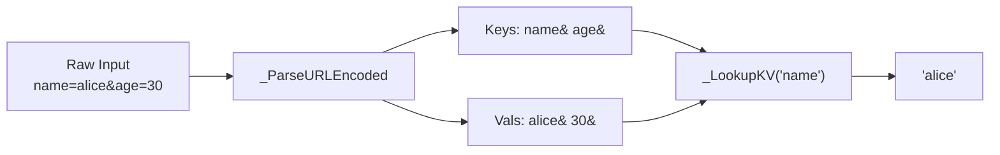

# บทที่ 8: Request Binding

*แปลง raw byte ให้กลายเป็นข้อมูลที่ handler ต้องการ*

---

**หลังจากอ่านบทนี้จบ คุณจะสามารถ:**

- ดึง query string parameter จาก URL ด้วย `Binding::Query`
- แยกวิเคราะห์ form submission แบบ URL-encoded ด้วย `Binding::PostForm`
- Bind และอ่าน JSON request body ด้วย `Binding::BindJSON`, `JSONString`, `JSONInteger` และ `JSONBool`
- Release JSON resource อย่างปลอดภัยด้วย `ReleaseJSON` (ไม่ใช่ `FreeJSON`)
- Implement รูปแบบการตรวจสอบ input ที่ส่ง response 400 Bad Request ที่เหมาะสม

---

## 8.1 แหล่งข้อมูลสี่แหล่งของ Request

HTTP request ทุกตัวสามารถบรรจุข้อมูลได้สี่ที่: URL path, query string, request body (ในรูปแบบ form หรือ JSON) และ header บทที่ 6 แนะนำ `Ctx::Param` สำหรับการดึง path parameter อย่าง `:id` จาก `/users/:id` บทนี้ครอบคลุมอีกสามแหล่ง ทั้งหมดเปิดเผยผ่าน module `Binding`

module `Binding` อยู่ใน `src/Binding.pbi` และมี API ที่สะอาดและสม่ำเสมอสำหรับการดึงข้อมูลออกจาก request ไม่ว่า caller จะวางข้อมูลไว้ที่ไหน คุณขอ value ตามชื่อ และ module จัดการการ parse, decode และ lookup ให้คุณทำทั้งหมดนี้เองด้วย `Mid()`, `FindString()` และ `StringField()` ก็ได้ เหมือนกับการปอกมันฝรั่งด้วยมีดพับ ทำได้ทั้งคู่ แต่ไม่ควรทำเพราะเปลืองเวลา

นี่คือ public interface อย่างรวบรัด:

```purebasic
; ตัวอย่างที่ 8.1 -- public interface ของ module Binding
DeclareModule Binding
  Declare.s Param(*C.RequestContext, Name.s)
  Declare.s Query(*C.RequestContext, Name.s)
  Declare.s PostForm(*C.RequestContext, Field.s)
  Declare.i BindJSON(*C.RequestContext)
  Declare.s JSONString(*C.RequestContext, Key.s)
  Declare.i JSONInteger(*C.RequestContext, Key.s)
  Declare.i JSONBool(*C.RequestContext, Key.s)
  Declare   ReleaseJSON(*C.RequestContext)
EndDeclareModule
```

ทุก procedure รับ `*C.RequestContext` pointer เป็น argument แรก นี่คือ context เดิมที่คุณรู้จักในบทที่ 6 กระเป๋าเป้ที่ติดตาม request ทุกตัวตลอด handler chain Binding อ่านจากมัน Rendering (บทที่ 9) เขียนลงมัน ทั้งสอง module ไม่ชนกัน

---

## 8.2 Route Parameter: Binding::Param

แหล่ง binding ที่ง่ายที่สุดคือ URL path เอง เมื่อคุณลงทะเบียน route ที่มี named parameter อย่าง `/users/:id` router จะดึงค่าระหว่างการจับคู่และเก็บไว้ใน field `ParamKeys`/`ParamVals` ของ context `Binding::Param` คือ thin wrapper รอบ `Ctx::Param`:

```purebasic
; ตัวอย่างที่ 8.2 -- การดึง route parameter
Procedure GetUserHandler(*C.RequestContext)
  Protected id.s = Binding::Param(*C, "id")
  ; id ตอนนี้มี "42" สำหรับ request ไปยัง /users/42
  Rendering::JSON(*C, ~"{\"user_id\":\"" + id + ~"\"}")
EndProcedure

Engine::GET("/users/:id", @GetUserHandler())
```

การออกแบบเป็น one-liner โดยเจตนา route parameter ถูก parse แล้วตั้งแต่ก่อน handler ของคุณทำงาน จึงไม่มีการ parse แบบ lazy หรือ allocation เกิดขึ้นเบื้องหลัง ค่าใช้จ่ายคือ linear scan ของ tab-delimited string ซึ่งสำหรับ route ทั่วไป (หนึ่งถึงสาม parameter) ถือว่าแทบไม่มีต้นทุน

> **เปรียบเทียบ:** ใน Gin framework ของ Go คำเทียบเท่าคือ `c.Param("id")` ใน Express.js คือ `req.params.id` API ของ PureSimple ทำตาม pattern เดิม ขอ parameter ตามชื่อ ได้ string กลับมา ความต่างคือ PureSimple เก็บ parameter ใน string คั่นด้วย `Chr(9)` แบบคู่ขนานแทนที่จะเป็น hash map ซึ่งหลีกเลี่ยงการ allocate map ทุก request

---

## 8.3 Query String: Binding::Query

Query string คือส่วนของ URL หลัง `?`: `/search?q=purebasic&page=2` browser ส่งมันเป็นส่วนหนึ่งของ URL และ PureSimpleHTTPServer เก็บ raw string ไว้ใน `*C\RawQuery` procedure `Binding::Query` แยกวิเคราะห์ string นี้เป็น key-value pair ครั้งแรกที่คุณเรียกมัน แล้ว cache ผลลัพธ์สำหรับการ lookup ครั้งต่อไปใน request เดียวกัน

```purebasic
; ตัวอย่างที่ 8.3 -- การอ่าน query string parameter
Procedure SearchHandler(*C.RequestContext)
  Protected q.s    = Binding::Query(*C, "q")
  Protected page.s = Binding::Query(*C, "page")

  If q = ""
    Rendering::JSON(*C, ~"{\"error\":\"missing q\"}", 400)
    ProcedureReturn
  EndIf

  ; ใช้ q และ page ค้นหา data store
  Rendering::JSON(*C, ~"{\"query\":\"" + q + ~"\",\"page\":\"" + page + ~"\"}")
EndProcedure

Engine::GET("/search", @SearchHandler())
```

strategy การ parse แบบ lazy น่าทำความเข้าใจ การเรียก `Binding::Query` ครั้งแรกบน request ที่กำหนดจะ trigger `_ParseURLEncoded` ซึ่งแยก `*C\RawQuery` บนตัวคั่น `&` แยกแต่ละ pair บน `=` URL-decode ทั้งสองฝั่ง และเก็บผลลัพธ์ใน `*C\QueryKeys` และ `*C\QueryVals` การเรียกครั้งที่สองข้ามงานทั้งหมดนั้นเพราะ cache เต็มแล้ว ถ้า handler ของคุณไม่เคยอ่าน query parameter การ parse ก็ไม่เกิดขึ้นเลย คุณจ่ายเฉพาะสิ่งที่ใช้

> **เบื้องหลัง:** URL decoding แปลง `+` เป็น space และ hex escape แบบ `%XX` เป็น character ที่เทียบเท่า procedure ส่วนตัว `_URLDecode` จัดการสิ่งนี้ด้วย single-pass loop มันตรวจแต่ละ character: `+` กลายเป็น space, `%` ที่ตามด้วย hex digit สองตัวกลายเป็น `Chr(Val("$" + hex))` และอื่นๆ ผ่านไปไม่เปลี่ยนแปลง prefix `$` บอก `Val` ของ PureBasic ให้ parse เลขฐานสิบหก

```purebasic
; ตัวอย่างที่ 8.4 -- ภายใน URL decoding (จาก src/Binding.pbi)
Procedure.s _URLDecode(s.s)
  Protected result.s = "", i.i = 1, n.i = Len(s), c.s
  While i <= n
    c = Mid(s, i, 1)
    If c = "+"
      result + " "
    ElseIf c = "%" And i + 2 <= n
      result + Chr(Val("$" + Mid(s, i + 1, 2)))
      i + 2
    Else
      result + c
    EndIf
    i + 1
  Wend
  ProcedureReturn result
EndProcedure
```

RFC เรียกสิ่งนี้ว่า "percent encoding" เพราะ `%20` สั้นกว่า "space character ที่ทำให้ทุกอย่างพัง" shorthand `+` สำหรับ space มีมาตั้งแต่การ encode HTML form ราวปี 1995 และยังไม่ยอมเกษียณ

---

## 8.4 Form Data: Binding::PostForm

เมื่อ browser ส่ง HTML form ด้วย `method="POST"` และ content type ตั้งต้นแบบ `application/x-www-form-urlencoded` request body จะดูเหมือน query string เลย: `username=alice&password=secret123` procedure `Binding::PostForm` แยกวิเคราะห์ body นี้และส่งคืนค่าสำหรับชื่อ field ที่กำหนด

```purebasic
; ตัวอย่างที่ 8.5 -- การจัดการ form submission
Procedure LoginHandler(*C.RequestContext)
  Protected username.s = Binding::PostForm(*C, "username")
  Protected password.s = Binding::PostForm(*C, "password")

  If username = "" Or password = ""
    Rendering::JSON(*C, ~"{\"error\":\"missing credentials\"}", 400)
    ProcedureReturn
  EndIf

  ; ตรวจสอบ credential (ดูบทที่ 16)
  Rendering::Redirect(*C, "/dashboard")
EndProcedure

Engine::POST("/login", @LoginHandler())
```

ต่างจาก `Binding::Query` ตรงที่ `PostForm` แยกวิเคราะห์ body ใหม่ทุกครั้งที่เรียก นี่เป็นการตัดสินใจออกแบบโดยเจตนา: query string ไม่เปลี่ยนแปลงตลอดอายุของ request แต่ handler อาจแก้ไข `*C\Body` ระหว่างการเรียก (โอกาสน้อย แต่เป็นไปได้) ต้นทุนของการ re-parse form body ทั่วไป ซึ่งมีขนาดไม่กี่ร้อย byte และมี field ไม่กี่ตัว ถือว่าเล็กน้อยมาก ถ้าคุณพบตัวเอง parse form body ที่มี field พันตัว ปัญหาของคุณใหญ่กว่าประสิทธิภาพของ parser

> **คำเตือน:** `Binding::PostForm` คืน string ว่างสำหรับ field ที่ไม่มี ไม่ใช่ error ตรวจสอบค่าว่างก่อนใช้เสมอ username ว่างไม่เหมือนกับ "ผู้ใช้ไม่ได้ส่ง field" แต่ใน URL-encoded form ทั้งสองดูเหมือนกัน ตรวจสอบก่อน ตรวจสอบบ่อยๆ

---

## 8.5 JSON Body: Binding::BindJSON

API สมัยใหม่ส่งและรับ JSON procedure `Binding::BindJSON` แยกวิเคราะห์ raw request body เป็น JSON โดยใช้ JSON library ที่ built-in ของ PureBasic และเก็บ handle ไว้ใน `*C\JSONHandle` เมื่อ bind แล้ว คุณใช้ `JSONString`, `JSONInteger` และ `JSONBool` เพื่อดึง top-level field ตามชื่อ

```purebasic
; ตัวอย่างที่ 8.6 -- การ bind และอ่าน JSON request body
Procedure CreatePostHandler(*C.RequestContext)
  If Binding::BindJSON(*C) = 0
    Rendering::JSON(*C, ~"{\"error\":\"invalid JSON\"}", 400)
    ProcedureReturn
  EndIf

  Protected title.s  = Binding::JSONString(*C, "title")
  Protected body.s   = Binding::JSONString(*C, "body")
  Protected draft.i  = Binding::JSONBool(*C, "draft")

  If title = ""
    Binding::ReleaseJSON(*C)
    Rendering::JSON(*C, ~"{\"error\":\"title required\"}", 400)
    ProcedureReturn
  EndIf

  ; บันทึก post (ดูบทที่ 13 สำหรับ SQLite)
  Binding::ReleaseJSON(*C)
  Rendering::JSON(*C, ~"{\"status\":\"created\"}", 201)
EndProcedure

Engine::POST("/api/posts", @CreatePostHandler())
```

procedure `BindJSON` คืน JSON handle เมื่อสำเร็จ (integer บวก) หรือ `0` เมื่อล้มเหลว ค่าที่คืนเป็น `0` หมายความว่า body ว่าง หรือ JSON ผิดรูปแบบ ทั้งสองกรณี response ที่ถูกต้องคือ 400 Bad Request

field accessor ทั้งหลาย `JSONString`, `JSONInteger`, `JSONBool` ทำงานเฉพาะกับ top-level object member พวกมันเรียก `GetJSONMember` ของ PureBasic บน root object สำหรับ JSON structure แบบ nested คุณจะใช้ JSON API ของ PureBasic โดยตรงกับ handle ที่เก็บไว้ใน `*C\JSONHandle` แต่สำหรับ API endpoint ส่วนใหญ่ที่รับ flat JSON object ที่มี field เป็น string, integer และ boolean accessor ที่ built-in มาก็เพียงพอแล้ว

> **ข้อควรระวังใน PureBasic:** procedure cleanup ชื่อ `ReleaseJSON` ไม่ใช่ `FreeJSON` PureBasic มี procedure ที่ built-in `FreeJSON(id.i)` อยู่แล้ว ถ้า framework ตั้งชื่อ cleanup ว่า `FreeJSON` มันจะ shadow built-in ของ PureBasic และการเรียกตัวใดตัวหนึ่งก็จะทำงานคาดเดาไม่ได้ขึ้นอยู่กับ scope ชื่อ `ReleaseJSON` หลีกเลี่ยงการชนกันทั้งหมด นี่คือความประหลาดในการตั้งชื่อที่ flat global namespace ของ PureBasic กำหนดให้ผู้เขียน library และเหตุใด codebase ของ PureSimple จึง document ทุก workaround ในการตั้งชื่อ

นี่คือสิ่งที่ `ReleaseJSON` ทำภายใน:

```purebasic
; ตัวอย่างที่ 8.7 -- การ cleanup ของ ReleaseJSON (จาก src/Binding.pbi)
Procedure ReleaseJSON(*C.RequestContext)
  If *C\JSONHandle <> 0
    FreeJSON(*C\JSONHandle)    ; <- เรียก built-in ของ PureBasic
    *C\JSONHandle = 0
  EndIf
EndProcedure
```

มันตรวจว่ามี JSON handle อยู่หรือไม่ free มันโดยใช้ `FreeJSON` ที่ built-in ของ PureBasic แล้ว reset handle เป็น zero เรียบง่าย แต่การลืมเรียกมันทำให้ memory รั่ว ทุก `BindJSON` ต้องมี `ReleaseJSON` ที่ match กัน เหมือนทุก `ReadFile` ต้องมี `CloseFile`

> **เคล็ดลับ:** ถ้า handler ของคุณมีหลาย exit path (validation ล้มเหลว, early return) ให้แน่ใจว่าทุก path เรียก `ReleaseJSON` pattern ที่ใช้ได้ดีคือการ bind ตั้งแต่ต้น validate และ release ใน cleanup block เดียวท้ายสุด อีกแนวทางคือปล่อยให้ framework จัดการผ่านการ reset context ด้วย `Ctx::Init` ซึ่ง reset `*C\JSONHandle` เป็น zero ตั้งแต่ต้นของแต่ละ request แต่ไม่ได้ free handle ก่อนหน้า ออกแบบ handler ของคุณให้ cleanup ตัวเองเสมอ

---

## 8.6 Parsing Engine ที่ใช้ร่วมกัน

ภายใต้ฝากาบ `Query` และ `PostForm` ใช้ procedure ส่วนตัวเดิม: `_ParseURLEncoded` procedure นี้แยก URL-encoded string เป็น key-value list แบบคู่ขนานคั่นด้วย `Chr(9)` (tab character) pattern parallel list แบบ tab-delimited เดิมปรากฏทั่ว PureSimple ทั้งใน route parameter, KV store และ session data มันคือ data structure สากลของ framework สำหรับ collection ขนาดเล็กที่ใช้ string เป็น key


*รูปที่ 8.1 — pipeline การ parse และ lookup แบบ URL-encoded*

procedure `_LookupKV` ทำ linear scan ผ่าน keys list เปรียบแต่ละ field ที่คั่นด้วย tab กับชื่อที่ร้องขอ เมื่อพบ match จะคืน field ที่ตรงกันจาก values list สำหรับ key ว่างหรือไม่มีอยู่ จะคืน string ว่าง นี่ไม่ใช่ hash map และไม่จำเป็นต้องเป็น query string ทั่วไปมี parameter สองถึงห้าตัว linear scan บน string ห้าตัวเสร็จในเวลา nanosecond

---

## 8.7 รูปแบบการตรวจสอบ Input

module Binding ดึงข้อมูล มันไม่ตรวจสอบข้อมูล การตรวจสอบคือหน้าที่ของ handler และควรเกิดขึ้นทันทีหลังการดึงข้อมูล ก่อน business logic ใดๆ ทำงาน นี่คือรูปแบบที่ใช้ได้ดี:

```purebasic
; ตัวอย่างที่ 8.8 -- รูปแบบการตรวจสอบ input
Procedure UpdateUserHandler(*C.RequestContext)
  Protected id.s = Binding::Param(*C, "id")

  If Binding::BindJSON(*C) = 0
    Rendering::JSON(*C, ~"{\"error\":\"invalid JSON\"}", 400)
    ProcedureReturn
  EndIf

  Protected name.s  = Binding::JSONString(*C, "name")
  Protected email.s = Binding::JSONString(*C, "email")

  ; ตรวจสอบ required field
  If name = "" Or email = ""
    Binding::ReleaseJSON(*C)
    Rendering::JSON(*C,
      ~"{\"error\":\"name and email are required\"}", 400)
    ProcedureReturn
  EndIf

  ; ตรวจสอบรูปแบบ email (การตรวจสอบเบื้องต้น)
  If FindString(email, "@") = 0
    Binding::ReleaseJSON(*C)
    Rendering::JSON(*C,
      ~"{\"error\":\"invalid email format\"}", 400)
    ProcedureReturn
  EndIf

  ; Business logic อยู่ตรงนี้
  Binding::ReleaseJSON(*C)
  Rendering::JSON(*C, ~"{\"status\":\"updated\"}")
EndProcedure

Engine::PUT("/users/:id", @UpdateUserHandler())
```

รูปแบบคือ: ดึงข้อมูล, ตรวจสอบ, ปฏิเสธหรือดำเนินต่อ, cleanup ทุก validation failure ส่ง status 400 พร้อม JSON error message อธิบายสิ่งที่ผิดพลาด client ได้รับสัญญาณที่ชัดเจน handler อ่านง่าย

ครั้งหนึ่งผมใช้เวลาหนึ่งชั่วโมง debug ว่าทำไม form submission ถึง insert record ว่างเปล่าในฐานข้อมูลโดยไม่มีเสียง handler ทำงาน insert string ว่างอย่างมีความสุขเพราะผมข้ามการตรวจสอบ โค้ดทำงานได้สมบูรณ์แบบ แค่ไม่รู้ว่าตัวเองกำลังกินขยะ

> **คำเตือน:** อย่าเชื่อ user input เด็ดขาด Query string, form data และ JSON body สามารถมีอะไรก็ได้ที่ client ส่งมา ตรวจสอบ type, ตรวจสอบ required field, กำหนด length limit และทำความสะอาด string ก่อนที่มันจะถึงฐานข้อมูล module Binding ให้ raw value มาคุณ สิ่งที่คุณทำกับมันเป็นความรับผิดชอบของคุณ

---

## สรุป

module Binding มี procedure สำหรับดึงข้อมูลสี่ตัวที่ครอบคลุมแหล่งข้อมูล request ที่พบบ่อยที่สุด: route parameter ผ่าน `Param`, query string ผ่าน `Query`, URL-encoded form body ผ่าน `PostForm` และ JSON request body ผ่าน `BindJSON` พร้อม field accessor `JSONString`, `JSONInteger` และ `JSONBool` ทั้งหมดคืนค่าว่างหรือ 0 สำหรับข้อมูลที่ขาดหายไปแทนที่จะ raise error ทำให้ความรับผิดชอบในการตรวจสอบตกอยู่ที่ handler อย่างชัดเจน procedure `ReleaseJSON` (ตั้งใจไม่ให้ชื่อ `FreeJSON`) ป้องกัน memory leak และหลีกเลี่ยงการชนกันในการตั้งชื่อกับ PureBasic

## สาระสำคัญ

- `Binding::Query` แยกวิเคราะห์ query string แบบ lazy ในการเข้าถึงครั้งแรกและ cache ผลลัพธ์ `Binding::PostForm` แยกวิเคราะห์ใหม่ทุกครั้งที่เรียก
- ทุกการเรียก `BindJSON` ต้องมี `ReleaseJSON` ที่ match บนทุก exit path เพื่อป้องกัน memory leak
- `ReleaseJSON` ตั้งชื่อเช่นนั้นเพื่อหลีกเลี่ยงการ shadow `FreeJSON` ที่ built-in ของ PureBasic ซึ่งเป็น naming discipline ที่ framework ยึดถือตลอด
- การตรวจสอบ input คือหน้าที่ของ handler ไม่ใช่ module binding ตรวจสอบ string ว่างและรูปแบบที่ไม่ถูกต้องก่อนประมวลผลข้อมูลเสมอ

## คำถามทบทวน

1. ทำไม `Binding::Query` ถึง cache ผลลัพธ์ขณะที่ `Binding::PostForm` แยกวิเคราะห์ใหม่ทุกครั้ง สมมติฐานอะไรที่ทำให้การ cache ปลอดภัยสำหรับ query string?
2. จะเกิดอะไรขึ้นถ้า PureSimple ตั้งชื่อ procedure cleanup JSON ว่า `FreeJSON` แทน `ReleaseJSON`? อธิบายการชนกันที่เกิดขึ้น
3. *ลองทำ:* เขียน handler สำหรับ `POST /api/contacts` ที่ bind JSON body ที่มี field `name`, `email` และ `message` ตรวจสอบว่าทั้งสามไม่ว่าง ส่ง 400 พร้อม error JSON ถ้า validation ล้มเหลว หรือ 201 พร้อม success JSON ถ้าผ่าน อย่าลืมเรียก `ReleaseJSON`
