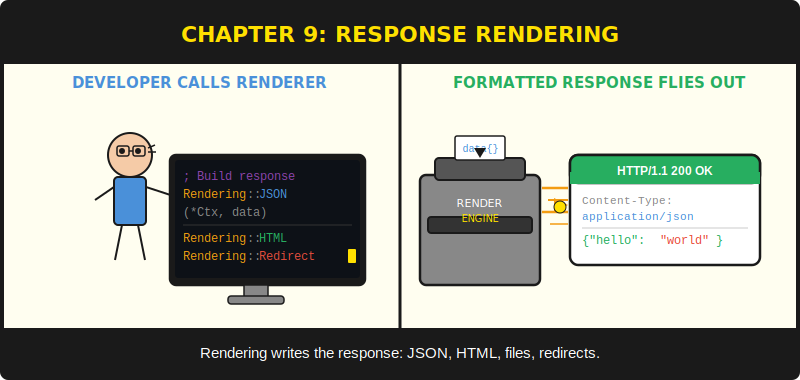
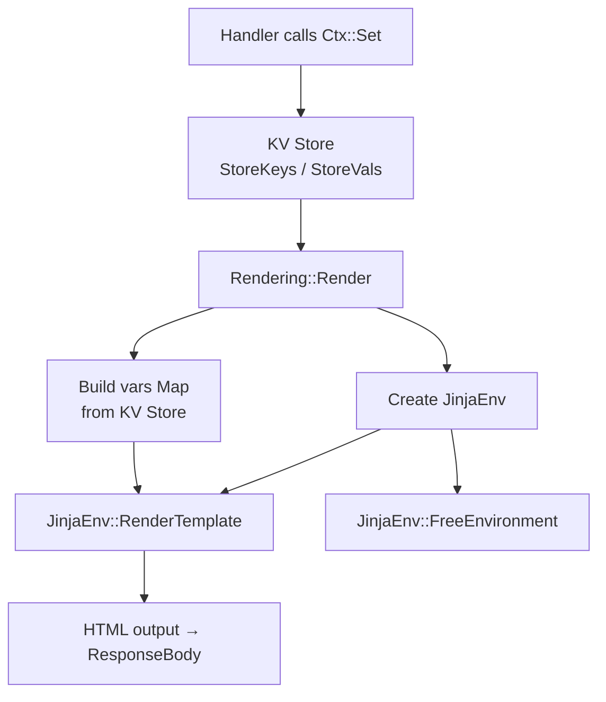

# บทที่ 9: การส่งข้อมูลกลับสู่ผู้ใช้ (Response Rendering)



*ให้เสียงกับเซิร์ฟเวอร์ของคุณ — JSON, HTML, redirect และไฟล์*

---

**หลังจากอ่านบทนี้แล้ว คุณจะสามารถ:**

- ส่ง JSON, HTML และ plain-text response พร้อมกำหนด content type และ status code ที่เหมาะสม
- เปลี่ยนเส้นทาง client ด้วย status code 302 (temporary) และ 301 (permanent)
- ให้บริการไฟล์จากดิสก์ด้วย `Rendering::File`
- เรนเดอร์ Jinja template ผ่าน `Rendering::Render` โดยส่งข้อมูลจาก handler ผ่าน KV store ของ context
- กำหนด status code ล้วนๆ สำหรับ response ที่ไม่มี body เช่น 204 No Content

---

## 9.1 โมดูล Rendering

บทที่ 8 พูดถึงวิธีนำข้อมูลเข้าสู่ handler บทนี้จะพูดถึงวิธีส่งข้อมูลออกมา โมดูล `Rendering` เป็นภาพสะท้อนของ `Binding`: ถ้า Binding อ่านจาก `*C\Body`, `*C\RawQuery` และ `*C\ParamKeys` แล้ว Rendering ก็เขียนไปยัง `*C\ResponseBody`, `*C\ContentType` และ `*C\StatusCode` เซิร์ฟเวอร์ HTTP จะอ่านค่าเหล่านั้นหลังจาก handler ของคุณทำงานเสร็จ แล้วส่ง response ไปยัง client

ทุก procedure ใน Rendering ทำงานตามแบบแผนเดียวกัน: รับ pointer ของ context และเนื้อหาบางอย่าง ตั้งค่าสามฟิลด์ใน response แล้วคืนค่ากลับ ไม่มีการ buffer, ไม่มี streaming, ไม่มี response object ที่ต้องสร้างและ flush ทีหลัง เรียก procedure เดียว response ก็พร้อม มันเป็นวิธีที่เรียบง่ายที่สุดในโลกของ rendering

นี่คือ public interface ทั้งหมด:

```purebasic
; ตัวอย่างที่ 9.1 -- Public interface ของโมดูล Rendering
DeclareModule Rendering
  Declare JSON(*C.RequestContext, Body.s, StatusCode.i = 200)
  Declare HTML(*C.RequestContext, Body.s, StatusCode.i = 200)
  Declare Text(*C.RequestContext, Body.s, StatusCode.i = 200)
  Declare Status(*C.RequestContext, StatusCode.i)
  Declare Redirect(*C.RequestContext, URL.s, StatusCode.i = 302)
  Declare File(*C.RequestContext, FilePath.s)
  Declare Render(*C.RequestContext, TemplateName.s,
                 TemplatesDir.s = "templates/")
EndDeclareModule
```

เจ็ด procedure ไม่มีการตั้งค่า ไม่มี builder object เรียกสักตัวแล้วงานของ handler ก็เสร็จ ความเรียบง่ายนี้ตั้งใจออกแบบไว้ชัดเจน ชั้น rendering ของ web framework มีหน้าที่เดียวคือ: วางไบต์ที่ถูกต้องลงในฟิลด์ที่ถูกต้อง อะไรที่ซับซ้อนกว่านั้นเป็นความรับผิดชอบของ template engine และ PureSimple มอบหมายงานนั้นให้ PureJinja (บทที่ 11)

---

## 9.2 JSON Response

ประเภท response ที่พบบ่อยที่สุดสำหรับ API คือ JSON `Rendering::JSON` ตั้ง content type เป็น `application/json` บันทึก body string และกำหนด status code:

```purebasic
; ตัวอย่างที่ 9.2 -- ส่ง JSON response
Procedure HealthHandler(*C.RequestContext)
  Rendering::JSON(*C, ~"{\"status\":\"ok\"}")
EndProcedure

Engine::GET("/health", @HealthHandler())
```

status code ค่าเริ่มต้นคือ 200 แต่สามารถเปลี่ยนได้:

```purebasic
; ตัวอย่างที่ 9.3 -- JSON พร้อม status code กำหนดเอง
Procedure NotFoundHandler(*C.RequestContext)
  Rendering::JSON(*C,
    ~"{\"error\":\"resource not found\"}", 404)
EndProcedure
```

คุณสร้าง JSON string เองด้วยการต่อ string ของ PureBasic และ escape sequence (prefix `~"..."` สำหรับตัวอักษร `\"`) สำหรับ response ที่เรียบง่าย เช่น status message, error หรือ object เล็กๆ — วิธีนี้เร็วกว่าและอ่านง่ายกว่าการสร้าง JSON tree ด้วย `CreateJSON`, `SetJSONString` และ `ComposeJSON` สำหรับ object ที่ซับซ้อนมี nested arrays ให้ใช้ JSON library ของ PureBasic โดยตรงแล้วส่งผลลัพธ์ไปที่ `Rendering::JSON`

> **เปรียบเทียบ:** `c.JSON(200, gin.H{"status": "ok"})` ของ Gin จะ serialise Go map เป็น JSON ให้โดยอัตโนมัติ PureSimple ไม่มี auto-serialiser เทียบเท่า เพราะ PureBasic ขาด reflection — ไม่มีทางตรวจสอบ field ของ structure ณ runtime และแปลงเป็น JSON key ได้ คุณสร้าง string เอง แล้ว framework ส่งออกไป นี่คือ trade-off: พิมพ์มากขึ้น แต่ไม่มีเวทย์มนตร์ ไม่มีเรื่องประหลาดใจ

การ implement มีเพียงสี่บรรทัด:

```purebasic
; ตัวอย่างที่ 9.4 -- ภายในของ Rendering::JSON (จาก src/Rendering.pbi)
Procedure JSON(*C.RequestContext, Body.s, StatusCode.i = 200)
  *C\StatusCode   = StatusCode
  *C\ResponseBody = Body
  *C\ContentType  = "application/json"
EndProcedure
```

ถ้าคุณคาดหวังอะไรที่ดราม่ากว่านี้ นั่นแหละคือประเด็น โมดูล rendering ไม่ใช่ที่อยู่ของความซับซ้อน มันคือ layer การกำหนดค่าบางๆ ที่รับรองว่า content type และ status code ถูกตั้งค่าอย่างถูกต้องเสมอ ดราม่าทั้งหมดอยู่ที่ router, middleware chain และ template engine Rendering คือความสงบหลังจากพายุ

---

## 9.3 HTML และ Text Response

สำหรับหน้าเว็บที่ render บน server โดยไม่ใช้ template `Rendering::HTML` ส่ง HTML string พร้อม `text/html`:

```purebasic
; ตัวอย่างที่ 9.5 -- ส่ง HTML response แบบ raw
Procedure SimplePageHandler(*C.RequestContext)
  Rendering::HTML(*C,
    "<html><body><h1>Hello</h1></body></html>")
EndProcedure
```

สำหรับ plain-text response เช่น debug output, health check หรือข้อความง่ายๆ — `Rendering::Text` ตั้ง `text/plain`:

```purebasic
; ตัวอย่างที่ 9.6 -- ส่ง plain-text response
Procedure PingHandler(*C.RequestContext)
  Rendering::Text(*C, "pong")
EndProcedure
```

ทั้งสองทำงานเหมือน `Rendering::JSON` แต่ต่างกันที่ content type browser ใช้ content type เพื่อตัดสินใจว่าจะ render response อย่างไร: HTML จะถูก parse และแสดงผลเป็นหน้าเว็บ plain text จะแสดงตามที่เป็นในฟอนต์ monospace และ JSON มักจะถูก format โดย browser developer tools

การเขียน HTML string ดิบๆ ใน handler เหมาะสำหรับหน้าเดี่ยวและ prototype เมื่อต้องการสิ่งที่มี navigation bar, footer หรือมี markup มากกว่าสิบบรรทัด ควรใช้ `Rendering::Render` พร้อม template (หัวข้อ 9.7) ตัวคุณในอนาคตจะขอบคุณตัวเองในวันนี้ ตัวคุณในปัจจุบันอาจไม่ชอบไฟล์พิเศษที่เพิ่มขึ้น แต่ตัวคุณในอนาคตคือคนที่ต้องเพิ่ม sidebar ให้ทุกหน้า

---

## 9.4 Response แบบ Status เท่านั้น

HTTP response บางอย่างไม่มี body เลย `DELETE` ที่สำเร็จมักคืน `204 No Content` request แบบ `OPTIONS` preflight คืนแค่ header สำหรับกรณีเหล่านี้ `Rendering::Status` ตั้ง status code โดยไม่แตะต้อง response body:

```purebasic
; ตัวอย่างที่ 9.7 -- Response แบบ status เท่านั้นสำหรับ DELETE
Procedure DeleteItemHandler(*C.RequestContext)
  Protected id.s = Binding::Param(*C, "id")
  ; ลบ item จาก storage...
  Rendering::Status(*C, 204)
EndProcedure

Engine::DELETE("/items/:id", @DeleteItemHandler())
```

> **เคล็ดลับ:** ใช้ `Rendering::Status` สำหรับ 204 No Content, 304 Not Modified และ response อื่นๆ ที่ body จะไม่มีความหมาย การส่ง body ว่างด้วย `Rendering::JSON(*C, "", 204)` ทำได้ แต่มันตั้ง content type header ที่บอกว่าจะส่ง JSON แล้วก็ไม่ส่งอะไร นั่นถูกต้องตามหลัก HTTP แต่ไม่ซื่อสัตย์ในเชิงหลักการ

---

## 9.5 Redirect

Redirect บอก browser ให้ไปที่อื่น `Rendering::Redirect` ตั้ง `Location` header และล้าง response body:

```purebasic
; ตัวอย่างที่ 9.8 -- Temporary redirect หลังส่งฟอร์ม
Procedure SubmitFormHandler(*C.RequestContext)
  ; ประมวลผลข้อมูลฟอร์ม...
  Rendering::Redirect(*C, "/thank-you")
EndProcedure

Engine::POST("/contact", @SubmitFormHandler())
```

status code ค่าเริ่มต้นคือ 302 (Found) ซึ่งเป็นตัวเลือกที่ถูกต้องสำหรับ pattern Post-Redirect-Get (PRG): ผู้ใช้ส่งฟอร์ม เซิร์ฟเวอร์ประมวลผล แล้ว redirect ไปหน้า confirmation ถ้าผู้ใช้รีเฟรชหน้า confirmation browser จะร้องขอ GET อีกครั้ง ไม่ใช่ POST วิธีนี้ป้องกันการส่งฟอร์มซ้ำ ซึ่งสำคัญมากเมื่อฟอร์มสร้าง database record หรือส่งอีเมล

สำหรับ redirect ถาวร — เมื่อ URL ย้ายไปตลอดกาลและ search engine ควรอัปเดต index ของตน — ใช้ 301:

```purebasic
; ตัวอย่างที่ 9.9 -- Permanent redirect สำหรับเนื้อหาที่ย้ายแล้ว
Procedure OldBlogHandler(*C.RequestContext)
  Protected slug.s = Binding::Param(*C, "slug")
  Rendering::Redirect(*C, "/post/" + slug, 301)
EndProcedure

Engine::GET("/blog/:slug", @OldBlogHandler())
```

ความแตกต่างระหว่าง 301 และ 302 สำคัญเป็นหลักสำหรับ search engine และ caching proxy Browser ตาม redirect ทั้งสองแบบ ใช้ 302 เว้นแต่จะแน่ใจว่า URL เก่าจะไม่มีวันใช้งานได้อีก

นี่คือสิ่งที่ `Redirect` ทำภายใน:

```purebasic
; ตัวอย่างที่ 9.10 -- ภายในของ Rendering::Redirect
;                  (จาก src/Rendering.pbi)
Procedure Redirect(*C.RequestContext, URL.s,
                    StatusCode.i = 302)
  *C\StatusCode   = StatusCode
  *C\Location     = URL
  *C\ResponseBody = ""
  *C\ContentType  = "text/plain"
EndProcedure
```

มันตั้ง `*C\Location` ซึ่ง PureSimpleHTTPServer อ่านและแปลงเป็น `Location:` response header response body ถูกล้างเพราะ redirect response ไม่ควรมีเนื้อหา — browser จะไม่แสดงมันอยู่แล้ว มันกำลังโหลดหน้าถัดไปก่อนที่ response body ของคุณจะดาวน์โหลดเสร็จ

---

## 9.6 File Response

`Rendering::File` อ่านไฟล์จากดิสก์และส่งเนื้อหาเป็น HTML:

```purebasic
; ตัวอย่างที่ 9.11 -- ให้บริการไฟล์ HTML แบบ static
Procedure LicenseHandler(*C.RequestContext)
  Rendering::File(*C, "static/license.html")
EndProcedure

Engine::GET("/license", @LicenseHandler())
```

procedure นี้จัดการ error สองกรณีภายใน ถ้าไฟล์ไม่มีอยู่ (`FileSize` คืนค่าน้อยกว่าศูนย์) จะคืน 404 พร้อม error message แบบ plain-text ถ้าไฟล์มีอยู่แต่เปิดไม่ได้ จะคืน 500 ทั้งสองกรณีตั้ง content type เป็น `text/plain` เพื่อให้ error message แสดงถูกต้อง

```purebasic
; ตัวอย่างที่ 9.12 -- การจัดการ error ของไฟล์ (จาก src/Rendering.pbi)
Procedure File(*C.RequestContext, FilePath.s)
  Protected fh.i
  If FileSize(FilePath) < 0
    *C\StatusCode   = 404
    *C\ResponseBody = "File not found: " + FilePath
    *C\ContentType  = "text/plain"
    ProcedureReturn
  EndIf
  fh = ReadFile(#PB_Any, FilePath)
  If fh = 0
    *C\StatusCode   = 500
    *C\ResponseBody = "Cannot open file: " + FilePath
    *C\ContentType  = "text/plain"
    ProcedureReturn
  EndIf
  *C\ResponseBody = ""
  While Not Eof(fh)
    *C\ResponseBody + ReadString(fh) + #LF$
  Wend
  CloseFile(fh)
  *C\StatusCode  = 200
  *C\ContentType = "text/html"
EndProcedure
```

> **ข้อควรระวังใน PureBasic:** PureBasic ไม่มีฟังก์ชัน `FileExists()` framework ใช้ `FileSize(path) < 0` เป็นการตรวจสอบการมีอยู่ของไฟล์ `FileSize` คืนค่า -1 ถ้าไฟล์ไม่มีอยู่ และ -2 ถ้า path เป็น directory ค่าที่เป็นศูนย์หรือมากกว่าหมายความว่าไฟล์มีอยู่และมีขนาดเท่านั้น นี่คือหนึ่งในความประหลาดใจของ PureBasic ที่เสียเวลา debug ไปหนึ่งครั้งก่อนจะจำขึ้นใจตลอดไป

โปรดสังเกตว่า `Rendering::File` ปัจจุบันตั้ง content type เป็น `text/html` สำหรับทุกไฟล์ สำหรับการให้บริการรูปภาพ CSS JavaScript หรือ static asset อื่นๆ ควรใช้ static file server ในตัวของ PureSimpleHTTPServer แทน ซึ่งตรวจจับ content type โดยอัตโนมัติ `Rendering::File` ออกแบบมาสำหรับการให้บริการไฟล์ HTML จาก handler code ไม่ใช่สำหรับการให้บริการไฟล์ static ทั่วไป การใช้มันเพื่อให้บริการ PNG จะทำงานได้ในทางเทคนิค แต่ browser จะงุนงงมากว่าทำไมรูปภาพถึงอ้างว่าตัวเองเป็น HTML

---

## 9.7 Template Rendering ด้วย PureJinja

procedure rendering ที่ทรงพลังที่สุดคือ `Rendering::Render` มันโหลดไฟล์ Jinja template จากดิสก์ เติมตัวแปรจาก KV store ของ context และส่ง HTML ที่ render แล้วไปยัง client นี่คือจุดที่ PureSimple พบกับ PureJinja ซึ่งเป็น template engine ที่เข้ากันได้กับ Jinja และคอมไพล์รวมเป็น binary เดียวกัน

```purebasic
; ตัวอย่างที่ 9.13 -- การ render template พร้อมตัวแปร
Procedure HomeHandler(*C.RequestContext)
  Ctx::Set(*C, "site_name", "My Blog")
  Ctx::Set(*C, "greeting", "Welcome, visitor!")
  Rendering::Render(*C, "index.html",
                    "examples/blog/templates/")
EndProcedure
```

กระบวนการทำงานดังนี้: คุณตั้งตัวแปรใน context โดยใช้ `Ctx::Set` แล้วเรียก `Rendering::Render` พร้อมชื่อไฟล์ template และ directory ที่ template อยู่ procedure Render จะวน loop ผ่าน field `StoreKeys` และ `StoreVals` ของ context สร้าง variable map ของ PureJinja จากนั้น สร้าง PureJinja environment ตั้ง template path render template และล้างทุกอย่าง


*รูปที่ 9.1 — pipeline ของ Rendering::Render ตั้งแต่ KV store ถึง HTML output*

parameter `TemplatesDir` มีค่าเริ่มต้นเป็น `"templates/"` ซึ่งใช้งานได้สำหรับการ deploy จริงที่ templates directory อยู่ข้างๆ binary ในระหว่าง development คุณอาจต้องระบุ relative path เช่น `"examples/blog/templates/"` ให้ตรงกับโครงสร้างโปรเจกต์ของคุณ

> **เบื้องหลัง:** `Rendering::Render` สร้างและทำลาย `JinjaEnvironment` ทุกครั้งที่เรียก ซึ่งรวมถึงการ parse ไฟล์ template การประเมิน expression และการ free memory ทั้งหมด สำหรับ blog ที่มีการใช้งานปานกลางนี่ดีเกินพอ PureJinja engine เร็ว — มันทำงานที่ความเร็วของ compiled code ไม่ใช่ความเร็วของ interpreted template สำหรับแอปพลิเคชันที่มีการใช้งานสูงที่ render template เดิมหลายพันครั้งต่อวินาที คุณอาจต้องการ cache environment นั้น การ optimise ดังกล่าวไม่ได้มีใน framework วันนี้ แต่เป็น extension ที่ไม่ซับซ้อน

บทที่ 11 ครอบคลุม syntax ของ PureJinja template อย่างละเอียด — `{{ variables }}`, `` block, `` loop, filter และ template inheritance สำหรับตอนนี้ ข้อสรุปสำคัญคือ `Rendering::Render` คือสะพานเชื่อม handler code กับ HTML template ของคุณ handler ตั้งข้อมูลด้วย `Ctx::Set` template อ่านด้วย `{{ variable_name }}` renderer เชื่อมสองสิ่งนี้เข้าหากัน

---

## สรุป

โมดูล Rendering มี procedure เจ็ดตัวที่ครอบคลุม response ทุกประเภทที่พบบ่อย: `JSON` สำหรับ API, `HTML` และ `Text` สำหรับเนื้อหา inline, `Status` สำหรับ response ที่ไม่มี body, `Redirect` สำหรับการนำทาง, `File` สำหรับการให้บริการหน้าจากดิสก์ และ `Render` สำหรับ Jinja template แต่ละ procedure ตั้ง `*C\StatusCode`, `*C\ResponseBody` และ `*C\ContentType` บน context ซึ่ง PureSimpleHTTPServer อ่านและส่งไปยัง client โมดูลนี้ออกแบบให้บางโดยตั้งใจ — มันกำหนดค่า field แล้วถอยออกไป ปล่อยให้ PureJinja จัดการการ render ที่ซับซ้อน

## ประเด็นสำคัญ

- ทุก procedure ใน rendering ตั้งค่าสาม context field: `StatusCode`, `ResponseBody` และ `ContentType` ส่วน Redirect จะตั้ง `Location` เพิ่มด้วย
- ใช้ `Rendering::Status` สำหรับ response ที่ไม่มี body (204, 304) แทนการส่ง body ว่างพร้อม content type ที่สัญญาว่าจะมีเนื้อหา
- `Rendering::Render` เชื่อม handler กับ PureJinja: handler ตั้งตัวแปร KV store ด้วย `Ctx::Set` และ template อ่านด้วย syntax `{{ variable }}`
- `Rendering::File` ใช้ `FileSize(path) < 0` สำหรับการตรวจสอบว่าไฟล์มีอยู่ เพราะ PureBasic ไม่มีฟังก์ชัน `FileExists()`

## คำถามทบทวน

1. `Rendering::JSON(*C, "", 204)` และ `Rendering::Status(*C, 204)` ต่างกันอย่างไร? อันไหนถูกต้องกว่าสำหรับ response แบบ "No Content" และเพราะเหตุใด?
2. อธิบาย pattern Post-Redirect-Get (PRG) และเหตุใด `Rendering::Redirect` จึงใช้ status code 302 เป็นค่าเริ่มต้นแทนที่จะเป็น 301
3. *ลองทำ:* เขียน handler ที่อ่าน query parameter ชื่อ `format` ถ้า `format` เป็น `"json"` ให้คืน JSON response ถ้าเป็น `"text"` ให้คืน plain-text response ถ้าเป็นอย่างอื่น ให้คืน HTML response ทั้งสามแบบควรมีข้อความ "Hello, PureSimple!" พร้อม status code 200
