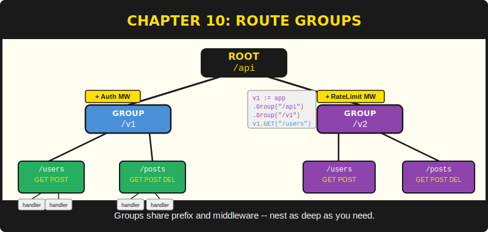
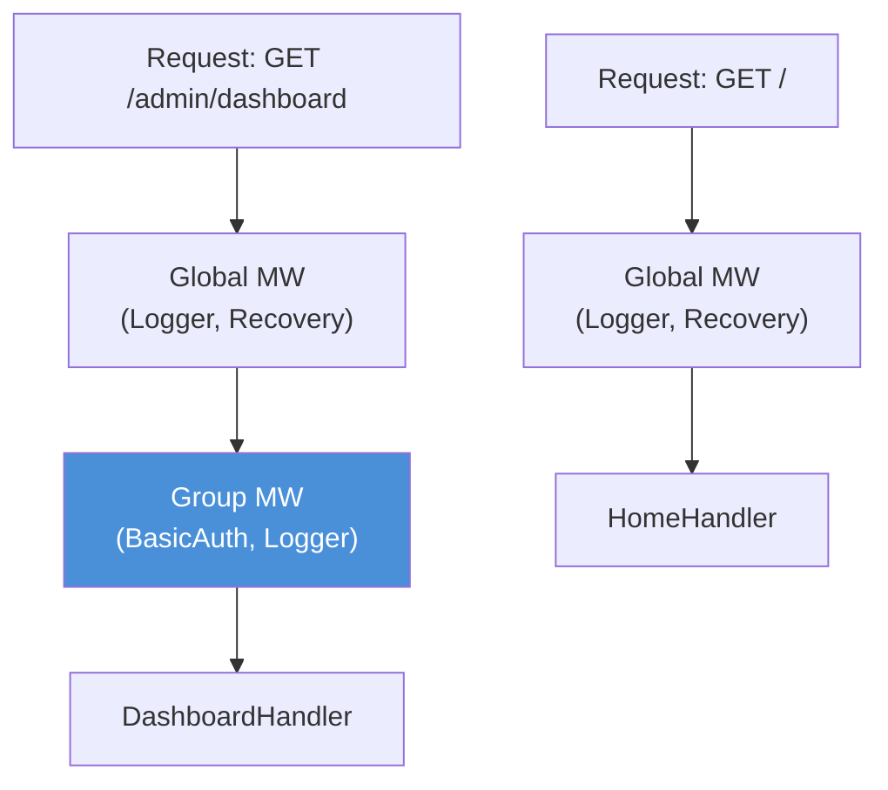

# บทที่ 10: Route Groups



*จัดระเบียบ route ในแบบเดียวกับที่คุณจัดระเบียบโค้ด — แบ่งตามความรับผิดชอบ*

---

**หลังจากอ่านบทนี้แล้ว คุณจะสามารถ:**

- สร้าง route group ที่มี path prefix ร่วมกันด้วย `Group::Init`
- แนบ middleware ที่ scoped ตาม group ด้วย `Group::Use`
- ซ้อน group ด้วย `Group::SubGroup` เพื่อสร้างโครงสร้าง route แบบลำดับชั้น
- Implement API versioning ด้วย group แบบ prefix
- จำกัด authentication middleware เฉพาะ route group ของ admin

---

## 10.1 ทำไมต้องมี Group?

เมื่อถึงบทที่ 9 คุณรู้วิธี register route ดึงข้อมูล และส่ง response แล้ว แอปพลิเคชันขนาดเล็กที่มีห้าหรือหก route ทำงานได้ดีกับการ register แบบ flat:

```purebasic
Engine::GET("/",          @HomeHandler())
Engine::GET("/about",     @AboutHandler())
Engine::GET("/health",    @HealthHandler())
Engine::POST("/contact",  @ContactHandler())
```

ลองนึกภาพแอปพลิเคชันที่มีสามสิบ route สิบเส้นทางอยู่ใน public API ที่ `/api/v1` แปดเส้นทางอยู่ใน admin panel ที่ `/admin` และที่เหลือเป็นหน้าสาธารณะ ทุก admin route ต้องการ authentication middleware ทุก API route ต้องการ rate limiter ถ้าคุณ register แต่ละ route ทีละตัวและแนบ middleware ไปแต่ละตัว คุณจะทำซ้ำตัวเองสามสิบครั้ง การทำซ้ำไม่ใช่แค่น่าเบื่อ — มันคือโรงงานผลิต bug ลืมแนบ auth middleware ไปกับ admin route สักตัว แล้วคุณจะมี endpoint ที่ไม่ได้รับการ authenticate ใน production ขอให้โชคดีกับการหามันก่อนที่คนอื่นจะหาเจอ

Route group แก้ปัญหานี้ group รวม path prefix และชุด middleware เข้าด้วยกัน ทุก route ที่ register ผ่าน group จะสืบทอดทั้งสองอย่าง เปลี่ยน middleware ของ group แล้วทุก route ใน group จะรับการเปลี่ยนแปลง เพิ่ม route เข้า group แล้วมันจะได้รับ prefix และ middleware ทั้งหมดโดยอัตโนมัติ คุณกำหนด policy ครั้งเดียว แล้ว route ทั้งหมดก็ปฏิบัติตาม

แนวคิดนี้เหมือนกับ `r.Group()` ของ Go Chi หรือ `r.Group()` ของ Gin ถ้าคุณเคยใช้สิ่งเหล่านั้น group ของ PureSimple จะรู้สึกคุ้นเคยทันที ถ้าไม่เคย ให้คิดว่า group คือ sub-router ที่มีสติกเกอร์ prefix ติดอยู่และมีเจ้าหน้าที่รักษาความปลอดภัยที่ประตู

---

## 10.2 การสร้าง Group

Group คือ structure `PS_RouterGroup` ที่เก็บ path prefix, array ของ middleware และจำนวน คุณประกาศมันบน stack และเริ่มต้นด้วย `Group::Init`:

```purebasic
; ตัวอย่างที่ 10.1 -- การสร้าง route group พื้นฐาน
Protected api.PS_RouterGroup
Group::Init(@api, "/api")

Group::GET(@api, "/users",  @ListUsersHandler())
Group::POST(@api, "/users", @CreateUserHandler())
```

`Group::Init` ตั้ง prefix เป็น `"/api"` และ reset จำนวน middleware เป็นศูนย์ เมื่อคุณเรียก `Group::GET(@api, "/users", @ListUsersHandler())` group จะเติม prefix ข้างหน้า pattern ได้ `"/api/users"` แล้วส่งต่อไปที่ `Router::Insert` handler ถูก register ราวกับว่าคุณเขียน `Engine::GET("/api/users", @ListUsersHandler())` group คือ syntax sugar — มันทำ concatenation ให้คุณและรับประกันความสอดคล้อง

structure `PS_RouterGroup` กำหนดไว้ใน `src/Types.pbi`:

```purebasic
; ตัวอย่างที่ 10.2 -- Structure PS_RouterGroup
;                  (จาก src/Types.pbi)
Structure PS_RouterGroup
  Prefix.s        ; path prefix สำหรับทุก route
  MW.i[32]        ; address ของ procedure middleware
  MWCount.i       ; จำนวน middleware ที่ register ไว้
EndStructure
```

array ของ middleware มีขนาดคงที่ที่ 32 slot นี่เป็นการเลือกออกแบบโดยตั้งใจ array ขนาดคงที่หลีกเลี่ยงการจัดสรรหน่วยความจำแบบ dynamic ทำให้ structure สามารถ allocate บน stack ได้ และกำหนดขีดจำกัดที่สมเหตุสมผล ถ้าคุณต้องการ middleware handler มากกว่า 32 ตัวใน group เดียว ปัญหาคือ architecture ของคุณ ไม่ใช่ขนาดของ array middleware 32 ตัวใน chain เดียวจะทำให้ request รู้สึกเหมือนผ่านด่านศุลกากรทุกชายแดนในยุโรป

---

## 10.3 Group Middleware

Middleware ที่ register ด้วย `Group::Use` ใช้กับเฉพาะ route ใน group นั้น Global middleware (register ด้วย `Engine::Use`) ยังคงใช้กับทุก route รวมถึง route ใน group chain ของ handler สุดท้ายสำหรับ grouped route คือ: global middleware แล้วตามด้วย group middleware แล้วจึงเป็น route handler

```purebasic
; ตัวอย่างที่ 10.3 -- การเพิ่ม middleware ให้ group
Protected admin.PS_RouterGroup
Group::Init(@admin, "/admin")
Group::Use(@admin, @BasicAuth::Middleware())
Group::Use(@admin, @Logger::Middleware())

Group::GET(@admin, "/dashboard",  @DashboardHandler())
Group::GET(@admin, "/users",      @AdminUsersHandler())
Group::POST(@admin, "/users",     @AdminCreateHandler())
```

ในตัวอย่างนี้ ทุก request ไปยัง `/admin/dashboard`, `/admin/users` หรือ route อื่นๆ ที่ register บน `admin` group จะผ่าน `BasicAuth::Middleware` และ `Logger::Middleware` ก่อนถึง handler Public route ที่ register ด้วย `Engine::GET` จะไม่เห็น BasicAuth middleware ขอบเขตการ authenticate กำหนดโดย group ไม่ใช่โดย route แต่ละเส้น


*รูปที่ 10.1 — การซ้อน middleware ของ route group: route ใน group ผ่านทั้ง global และ group middleware ส่วน route ที่ไม่อยู่ใน group เห็นเฉพาะ global middleware*

> **เบื้องหลัง:** เมื่อ grouped route ถูก dispatch `Group::CombineHandlers` สร้าง handler chain เต็มรูปแบบ โดยเรียก `Engine::AppendGlobalMiddleware(*C)` ก่อนเพื่อเพิ่ม global middleware ทั้งหมดไปยัง array handler ของ context จากนั้น loop ผ่าน array `MW` ของ group เพิ่ม group middleware แต่ละตัว สุดท้ายเพิ่ม route handler เอง mechanism `Advance` ของ context (บทที่ 6) จะ iterate ผ่าน array รวมนี้ทีละ handler และเรียกแต่ละตัวตามลำดับ

```purebasic
; ตัวอย่างที่ 10.4 -- CombineHandlers สร้าง chain
;                  (จาก src/Group.pbi)
Procedure CombineHandlers(*G.PS_RouterGroup,
                           *C.RequestContext,
                           RouteHandler.i)
  Protected i.i
  Engine::AppendGlobalMiddleware(*C)
  For i = 0 To *G\MWCount - 1
    Ctx::AddHandler(*C, *G\MW[i])
  Next i
  Ctx::AddHandler(*C, RouteHandler)
EndProcedure
```

---

## 10.4 การซ้อน Group ด้วย SubGroup

Group สามารถซ้อนกันได้ API group สามารถมี version sub-group ได้ admin group สามารถมี section sub-group ได้ `Group::SubGroup` สร้าง child group ที่สืบทอด prefix และ middleware ของ parent แล้วเพิ่มของตัวเองเข้าไป:

```purebasic
; ตัวอย่างที่ 10.5 -- การซ้อน group สำหรับ API versioning
Protected api.PS_RouterGroup
Group::Init(@api, "/api")
Group::Use(@api, @RateLimitMiddleware())

Protected v1.PS_RouterGroup
Group::SubGroup(@api, @v1, "/v1")

Protected v2.PS_RouterGroup
Group::SubGroup(@api, @v2, "/v2")
Group::Use(@v2, @DeprecationHeaderMiddleware())

; /api/v1/users -- มี rate-limit
Group::GET(@v1, "/users", @ListUsersV1())

; /api/v2/users -- มี rate-limit + deprecation header
Group::GET(@v2, "/users", @ListUsersV2())
```

`SubGroup` ทำสองสิ่ง อันดับแรก concatenate prefix ของ parent กับ sub-prefix: `"/api"` + `"/v1"` = `"/api/v1"` อันดับสอง copy array middleware ของ parent ไปยัง child การ copy เป็น value copy ไม่ใช่ reference หลังจาก `SubGroup` คืนค่า child มี middleware list ของตัวเองที่เป็นอิสระซึ่งเริ่มต้นด้วยสิ่งที่ parent มี การเรียก `Group::Use` บน child จะเพิ่ม middleware เฉพาะ child — parent ไม่ถูกกระทบ

```purebasic
; ตัวอย่างที่ 10.6 -- SubGroup copy prefix และ middleware
;                  (จาก src/Group.pbi)
Procedure SubGroup(*Parent.PS_RouterGroup,
                    *Child.PS_RouterGroup,
                    SubPrefix.s)
  Protected i.i
  *Child\Prefix  = *Parent\Prefix + SubPrefix
  *Child\MWCount = *Parent\MWCount
  For i = 0 To *Parent\MWCount - 1
    *Child\MW[i] = *Parent\MW[i]
  Next i
EndProcedure
```

การออกแบบแบบ copy-on-SubGroup หมายความว่า group สร้างเป็นต้นไม้โดยแต่ละโหนดสืบทอดจาก parent ณ เวลาที่สร้าง แต่การเปลี่ยนแปลงในภายหลังจะไม่ส่งต่อขึ้นหรือลง เพิ่ม middleware ให้ parent หลังจากสร้าง child แล้ว child จะไม่เห็นมัน นี่คือพฤติกรรมที่คาดเดาได้: ต้นไม้ group คือ snapshot hierarchy ไม่ใช่ reference graph แบบ live ถ้าต้องการให้ middleware ใช้กับ descendant ทั้งหมด ให้แนบไปกับ parent ก่อนสร้าง sub-group

> **คำเตือน:** การ copy middleware เกิดขึ้น ณ เวลาที่เรียก `SubGroup` ไม่ใช่ ณ เวลา dispatch ถ้าคุณเรียก `Group::Use` บน parent หลังจากเรียก `SubGroup` child จะไม่รับ middleware ใหม่ กำหนดค่า middleware ของ parent เสมอก่อนสร้าง sub-group โค้ดอ่านจากบนลงล่าง และ middleware chain สร้างจากบนลงล่าง ทำให้ทั้งสองสอดคล้องกัน

---

## 10.5 Pattern การทำ API Versioning

API versioning คือ use case ที่พบบ่อยที่สุดสำหรับ nested group คุณต้องการให้ `/api/v1/users` และ `/api/v2/users` อยู่ร่วมกัน โดยมี middleware บางส่วนร่วมกัน นี่คือ pattern ที่สมบูรณ์:

```purebasic
; ตัวอย่างที่ 10.7 -- การตั้งค่า API versioning แบบสมบูรณ์
; Global middleware
Engine::Use(@Logger::Middleware())
Engine::Use(@Recovery::Middleware())

; API group พร้อม middleware ร่วมกัน
Protected api.PS_RouterGroup
Group::Init(@api, "/api")
Group::Use(@api, @CORSMiddleware())

; Version 1 -- stable
Protected v1.PS_RouterGroup
Group::SubGroup(@api, @v1, "/v1")
Group::GET(@v1, "/users",     @V1ListUsers())
Group::GET(@v1, "/users/:id", @V1GetUser())
Group::POST(@v1, "/users",    @V1CreateUser())

; Version 2 -- มี feature ใหม่
Protected v2.PS_RouterGroup
Group::SubGroup(@api, @v2, "/v2")
Group::GET(@v2, "/users",     @V2ListUsers())
Group::GET(@v2, "/users/:id", @V2GetUser())
Group::POST(@v2, "/users",    @V2CreateUser())
Group::GET(@v2, "/users/:id/posts", @V2UserPosts())
```

ทั้งสอง version สืบทอด CORS middleware จาก API group V2 เพิ่ม route ใหม่ (`/users/:id/posts`) ที่ V1 ไม่มี handler ของแต่ละ version สามารถแตกต่างกันได้อิสระ V1 อาจคืน JSON ของผู้ใช้แบบ flat ในขณะที่ V2 รวม nested relations router ไม่สนใจ — มันจับคู่ URL กับ handler ที่ถูกต้องและปล่อยให้โค้ดเฉพาะ version ดำเนินการ

บางคนถามว่าควร version API ของตนหรือไม่ คำตอบคือ: คุณมี API version อยู่แล้ว มันชื่อว่า "ตัวที่ใช้อยู่ตอนนี้" คำถามคือคุณจะเสียใจหรือไม่ที่ไม่ได้กำหนดหมายเลขไว้ตั้งแต่ต้นเมื่อการเปลี่ยนแปลงที่ไม่ backward compatible มาถึง คุณจะเสียใจอย่างแน่นอน

---

## 10.6 Admin Route พร้อม Authentication แบบ Scoped

อีก pattern ที่พบบ่อยคือการจำกัดส่วนทั้งหมดของ route ให้เฉพาะผู้ใช้ที่ authenticated แทนที่จะแนบ authentication middleware ไปกับแต่ละ route ให้แนบไปกับ group:

```purebasic
; ตัวอย่างที่ 10.8 -- Admin group พร้อม BasicAuth
Protected admin.PS_RouterGroup
Group::Init(@admin, "/admin")
Group::Use(@admin, @BasicAuth::Middleware())

Group::GET(@admin, "/",         @AdminDashboard())
Group::GET(@admin, "/posts",    @AdminListPosts())
Group::POST(@admin, "/posts",   @AdminCreatePost())
Group::PUT(@admin, "/posts/:id", @AdminUpdatePost())
Group::DELETE(@admin, "/posts/:id", @AdminDeletePost())
```

ห้า route ขอบเขต authentication เดียว ถ้าคุณเพิ่ม `/admin/settings` หรือ `/admin/users` ในภายหลัง มันจะได้รับการปกป้องโดยอัตโนมัติ group ไม่ใช่แค่ความสะดวก — มันคือ security policy ที่แสดงออกมาเป็นโค้ด ผู้ตรวจสอบสามารถเห็นได้ทันทีว่า route ใดต้องการ authentication โดยดูว่ามันอยู่ใน group ใด

> **เปรียบเทียบ:** ใน Express.js คุณจะสร้าง sub-router ด้วย `express.Router()` แนบ `authMiddleware` ด้วย `.use()` และ mount ที่ `/admin` ใน Chi ของ Go คุณจะใช้ `r.Route("/admin", func(r chi.Router) { r.Use(authMW); r.Get("/", handler) })` `Group::Init` + `Group::Use` ของ PureSimple ทำตาม pattern เดียวกัน syntax ต่างกัน แต่แนวคิดเหมือนกัน

---

## 10.7 HTTP Method ครบชุด

โมดูล Group รองรับ HTTP method ทั้งหกตัวบวก wildcard:

```purebasic
; ตัวอย่างที่ 10.9 -- ทุก method สำหรับการ register route ใน group
Group::GET(@g,    "/resource",     @GetHandler())
Group::POST(@g,   "/resource",     @PostHandler())
Group::PUT(@g,    "/resource/:id", @PutHandler())
Group::PATCH(@g,  "/resource/:id", @PatchHandler())
Group::DELETE(@g, "/resource/:id", @DeleteHandler())
Group::Any(@g,    "/wildcard",     @CatchAllHandler())
```

`Group::Any` register handler สำหรับทุก method ทั้งห้า (GET, POST, PUT, PATCH, DELETE) ที่ path ที่มี prefix ของ group นี่มีประโยชน์สำหรับ handler ที่ต้องตอบสนองทุก method เช่น health check, CORS preflight handler หรือ error page แบบ catch-all ภายในมันเรียก `Router::Insert` ห้าครั้งด้วย handler เดียวกันและ full path เดียวกัน

แต่ละ method procedure เป็นโค้ดสองบรรทัด: concatenate prefix ของ group กับ pattern เรียก `Router::Insert` ความเรียบง่ายทำให้โค้ดตรวจสอบได้ง่าย ไม่มีการแปลงที่ซ่อนอยู่ ไม่มีการ inject middleware ณ เวลา register และไม่มีการประเมินแบบ deferred เมื่อคุณเรียก `Group::GET` route จะถูก register ทันทีและถาวร ไม่มี "route table build phase" หรือ "router compilation step" สิ่งที่คุณ register คือสิ่งที่คุณได้รับ

---

## สรุป

Route group แก้ปัญหาการทำซ้ำใน route registration group รวม path prefix และชุด middleware เข้าด้วยกัน และทุก route ที่ register ผ่าน group จะสืบทอดทั้งสองอย่าง Group ซ้อนกันผ่าน `SubGroup` ซึ่ง copy prefix และ middleware ของ parent ไปยัง child ณ เวลาสร้าง วิธีนี้รองรับ API versioning (prefix ร่วมกัน handler แยกกัน) และ scoped authentication (middleware ร่วมกัน route ที่ปกป้อง) โดยไม่ต้องตั้งค่าต่อ route array middleware มีขนาดคงที่ 32 slot และ copy ด้วย value ทำให้ group สามารถ allocate บน stack และปลอดภัยต่อการเปลี่ยนแปลง

## ประเด็นสำคัญ

- `Group::Init` ตั้ง prefix และ reset middleware ทุก route ที่ register ผ่าน group จะได้รับ prefix ต่อหน้าโดยอัตโนมัติ
- `Group::Use` เพิ่ม middleware ที่ใช้กับเฉพาะ route ของ group Global middleware (จาก `Engine::Use`) ยังคงใช้กับ grouped route เพิ่มเติมจาก middleware ของ group เอง
- `Group::SubGroup` copy prefix และ middleware ของ parent ด้วย value การเปลี่ยนแปลงใน parent หลังจาก `SubGroup` จะไม่ส่งต่อไปยัง child
- array middleware มีขนาดคงที่ 32 slot ต่อ group ถ้าต้องการมากกว่า 32 ให้ simplify architecture ของ middleware

## คำถามทบทวน

1. handler จะถูก execute ตามลำดับใดสำหรับ request ที่ match กับ grouped route? อธิบายความสัมพันธ์ระหว่าง global middleware, group middleware และ route handler
2. นักพัฒนาเรียก `Group::Use` บน parent group หลังจากเรียก `Group::SubGroup` เพื่อสร้าง child แล้ว child จะสืบทอด middleware ใหม่นั้นหรือไม่? อธิบายว่าเพราะเหตุใด
3. *ลองทำ:* สร้าง API group ที่ `/api` พร้อม logging middleware สร้าง sub-group สองตัว: `/api/v1` และ `/api/v2` Register handler `GET /users` บนแต่ละ version ที่คืน JSON response ที่แตกต่างกัน ตรวจสอบว่าทั้งสอง version log request
