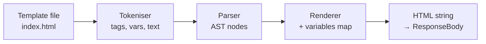

# บทที่ 11: PureJinja — Jinja Templates ใน PureBasic

*Template engine ที่พูด syntax แบบ Python แต่ทำงานด้วยความเร็วระดับ C*

---

**หลังจากอ่านบทนี้แล้ว คุณจะสามารถ:**

- เขียน Jinja template พร้อม variable output, conditional และ loop
- ใช้ template inheritance ด้วย `` และ `` เพื่อกำจัดความซ้ำซ้อนของ HTML
- ใช้ filter ในตัวทั้ง 34 ตัว (บวก 3 alias) ของ PureJinja เพื่อแปลงข้อมูลใน template
- เชื่อม handler กับ template ผ่าน `Rendering::Render` และ KV store ของ context
- เข้าใจ render pipeline ของ PureJinja: tokenise, parse และ render

---

## 11.1 ทำไมต้องใช้ Template Engine?

ในบทที่ 9 คุณเห็น `Rendering::HTML` ส่ง HTML string แบบ raw จาก handler code นั้นใช้ได้สำหรับหน้า health check หรือ prototype รวดเร็ว แต่ไม่ใช้ได้สำหรับแอปพลิเคชันจริงที่มี layout สม่ำเสมอ navigation bar, footer และยี่สิบหน้าที่ใช้ chrome เดียวกัน การเขียน HTML ใน string concatenation ของ PureBasic เปรียบเสมือนการเขียนนิยายบน sticky note — ทำได้ในทางเทคนิค รู้สึกอึดอัดอย่างยิ่ง และ maintain ไม่ได้

Template engine แยก HTML structure ออกจาก application logic handler เตรียมข้อมูล template กำหนด layout engine ผสานทั้งสองอย่างเข้าด้วยกัน ณ เวลา render ถ้าคุณเคยใช้ Jinja ใน Python, Django templates, `html/template` ของ Go หรือ Handlebars ใน JavaScript แนวคิดก็เหมือนกัน PureJinja มีความเข้ากันได้กับ Jinja syntax ซึ่งหมายความว่านักพัฒนา Python สามารถอ่าน PureSimple template ได้โดยไม่ต้องเรียนรู้อะไรใหม่ นักพัฒนา PureBasic ได้รับ template syntax ที่ผ่านการทดสอบมาแล้วโดยไม่ต้องประดิษฐ์ขึ้นมาเอง

PureJinja คือ repository แบบ standalone (`github.com/Jedt3D/pure_jinja`) ที่คอมไพล์รวมเป็น binary เดียวกับ PureSimple มี filter ในตัว 34 ตัว (บวก 3 alias) มีการทดสอบ 599 รายการ และไม่มี runtime dependency ใดๆ มัน tokenise, parse และ render template ด้วยความเร็วของ compiled code template มีหน้าตาเหมือน Python Jinja ความเร็ว execute มีระดับเทียบเท่า C นั่นคือจุดรวมของทั้งหมด

---

## 11.2 Render Pipeline

ก่อนเจาะลึก syntax จะเป็นประโยชน์ถ้าเข้าใจว่าเกิดอะไรขึ้นเมื่อ `Rendering::Render` เรียก PureJinja pipeline มีสามขั้นตอน:


*รูปที่ 11.1 — Render pipeline ของ PureJinja: จากไฟล์ template ถึง HTML output*

1. **Tokenise.** raw template string จะถูกแบ่งเป็น token: text block, variable expression (`{{ ... }}`), tag block (``) และ comment block (`{# ... #}`) tokeniser จดจำ delimiter เปิดและปิดและจำแนกแต่ละส่วน

2. **Parse.** token stream จะถูกแปลงเป็น abstract syntax tree (AST) block `` กลายเป็น conditional node ที่มี true และ false branch block `` กลายเป็น loop node ที่มี body และ iterator variable variable expression กลายเป็น output node ที่มี optional filter chain

3. **Render.** AST จะถูก walk แบบ depth-first text node ส่งออกเนื้อหาโดยตรง variable node ค้นหาชื่อ variable ใน map ที่ให้มา ใช้ filter ใดๆ และส่งออกผลลัพธ์ conditional node ประเมิน test expression และ render branch ที่เหมาะสม loop node iterate collection และ render body ครั้งหนึ่งต่อ item

ไฟล์ template ถูกอ่านจากดิสก์โดย `JinjaEnv::RenderTemplate` ซึ่งถูกเรียกโดย `Rendering::Render` ตัวแปร KV store ของ handler ถูกแปลงเป็น `JinjaVariant` map ของ PureJinja ก่อน render หลัง render environment และ variant object ทั้งหมดจะถูก free HTML string ที่ render แล้วถูกเก็บใน `*C\ResponseBody`

> **เบื้องหลัง:** PureJinja สร้างและทำลาย `JinjaEnvironment` ในทุกการเรียก `Rendering::Render` environment เก็บ template path, filter registry และ internal parser state การสร้างมันเกี่ยวข้องกับการ register filter ในตัวทั้ง 34 ตัว (บวก 3 alias) (loop 36 map insertion) ซึ่งเร็วพอสำหรับ web traffic ทั่วไป สำหรับ scenario ที่มีการใช้งานสูง cache layer ที่ reuse environment ข้าม request จะเป็น optimisation ที่คุ้มค่า framework ไม่ได้จัดหาให้วันนี้ แต่ PureJinja API รองรับมัน — คุณสามารถสร้าง environment ครั้งเดียวและ render template หลายอันผ่านมันได้

---

## 11.3 Variable Output

การดำเนินการ template ขั้นพื้นฐานที่สุดคือการพิมพ์ variable ห่อด้วย curly brace คู่:

```html
<!-- ตัวอย่างที่ 11.1 -- Variable output ใน template -->
<h1>{{ site_name }}</h1>
<p>Welcome to {{ site_name }}!</p>
```

handler ตั้งตัวแปรโดยใช้ `Ctx::Set`:

```purebasic
; ตัวอย่างที่ 11.2 -- การตั้งค่า template variable ใน handler
Procedure HomeHandler(*C.RequestContext)
  Ctx::Set(*C, "site_name", "PureSimple Blog")
  Rendering::Render(*C, "index.html",
                    "templates/")
EndProcedure
```

เมื่อ PureJinja พบ `{{ site_name }}` มันจะค้นหา `"site_name"` ใน variables map และส่งออก string value ถ้า variable ไม่มีอยู่ PureJinja จะส่งออก string ว่าง ไม่มี error ไม่มี exception ไม่มีการ crash แค่เงียบ ซึ่งสอดคล้องกับพฤติกรรมเริ่มต้นของ Jinja ใน Python และหมายความว่า typo ในชื่อ variable จะทำให้เกิดช่องว่างในหน้าเว็บแทนที่จะเป็น error 500 ว่านี่คือ feature หรือ bug ขึ้นอยู่กับว่าคุณรู้สึกอย่างไรกับ silent failure ตอนตี 2

---

## 11.4 Conditional และ Loop

Template ต้องการ logic PureJinja รองรับ ``, ``, `` และ `` สำหรับ conditional และ `` / `` สำหรับ loop

### Conditional

```html
<!-- ตัวอย่างที่ 11.3 -- Conditional block -->

  <p>Hello, {{ user }}!</p>

  <p>Hello, guest!</p>

```

tag `` ประเมิน expression string ที่ไม่ว่างและตัวเลขที่ไม่ใช่ศูนย์ถือว่าเป็น truthy string ว่าง ศูนย์ และ variable ที่ไม่ได้กำหนดถือว่าเป็น falsy ซึ่งตรงกับ truthiness rules ของ Jinja

### Loop

Loop iterate ผ่าน collection ใน PureJinja pattern ที่พบบ่อยที่สุดคือการ iterate ผ่าน string ที่ถูกแบ่งเป็น list โดยใช้ filter `split`:

```html
<!-- ตัวอย่างที่ 11.4 -- Loop ผ่าน split string -->

  
    
    <article>
      <h2>
        <a href="/post/{{ parts[0] }}">
          {{ parts[1] }}
        </a>
      </h2>
      <p class="date">{{ parts[2] }}</p>
    </article>
  

```

นี่คือ template `index.html` จริงๆ จากแอปพลิเคชัน `examples/blog/` handler สร้าง string ของข้อมูล post โดยใช้ tab แยก field และ newline แยก record เก็บไว้ใน context ด้วย `Ctx::Set(*C, "posts", titles)` และ template แกะออกโดยใช้ `split('\n')` และ `split('\t')`

ทำไมถึงใช้ string แทน object? KV store ของ PureSimple เป็น string-to-string ตัวแปร PureJinja คือ string ที่ bridge layer การส่งข้อมูล structured ต้องการการ serialise เป็น delimited string และ deserialise ใน template นี่คือ trade-off สำหรับ KV store แบบง่ายที่ไม่ต้องจัดสรรหน่วยความจำ คุณยังสามารถสร้าง variables map ของ PureJinja โดยตรงใน handler โดยใช้ PureJinja API โดยข้าม `Rendering::Render` — แต่ pattern delimited-string นั้นง่ายกว่าสำหรับกรณีส่วนใหญ่และทำให้ handler code ของคุณไม่ต้องพึ่งพา PureJinja

คุณอาจมองที่ `split('\t')` แล้วคิดว่า "นั่นเป็นวิธีแปลกๆ ในการส่งข้อมูลไปยัง template" คุณพูดถูก ใน Python หรือ Go คุณจะส่ง list ของ object ใน PureSimple คุณส่ง formatted string แล้วปล่อยให้ template แกะออก มันคือ pragmatic hack ชนิดที่ทำให้ผู้สร้าง framework ขมวดคิ้วแต่ทำให้สินค้าสามารถ ship ได้

---

## 11.5 Template Inheritance

Template inheritance คือวิธีที่คุณหลีกเลี่ยงการ copy `<head>`, navigation และ footer ไปในทุกหน้า คุณกำหนด base template ที่มี named block แล้ว child template จะ extend base และ override block เฉพาะ

พิจารณา base template:

```html
<!-- ตัวอย่างที่ 11.5 -- Base template พร้อม named block -->
<!-- templates/base.html -->
<!DOCTYPE html>
<html lang="en">
<head>
  <meta charset="UTF-8">
  <title>My Site</title>
</head>
<body>
  <nav>
    <a href="/">Home</a>
    <a href="/about">About</a>
  </nav>
  <main>
    
  </main>
  <footer>
    <p>Built with PureSimple</p>
  </footer>
</body>
</html>
```

child template extend มัน:

```html
<!-- ตัวอย่างที่ 11.6 -- Child template ที่ override block -->
<!-- templates/about.html -->


About — My Site


<h1>About Us</h1>
<p>We build things with PureBasic.</p>

```

เมื่อ PureJinja render `about.html` มันจะโหลด `base.html` ก่อน แล้วซ้อน block definition ของ child ทับ ผลลัพธ์คือ HTML ของ base ทั้งหมดที่มี `title` block ถูกแทนที่ด้วย "About — My Site" และ `content` block ถูกแทนที่ด้วยเนื้อหาหน้า about navigation และ footer มาจาก base template และใช้ร่วมกันในทุกหน้าที่ extend มัน

```mermaid
graph TD
  A["base.html<br/>&#123;% block title %&#125;<br/>&#123;% block content %&#125;"] --> B["index.html<br/>extends base.html"]
  A --> C["about.html<br/>extends base.html"]
  A --> D["post.html<br/>extends base.html"]

  style A fill:#4A90D9,color:#fff
```


*รูปที่ 11.2 — ต้นไม้ template inheritance: base template หนึ่งอัน หน้า child หลายอัน*

> **เปรียบเทียบ:** นี่เหมือนกับ Jinja template inheritance ใน Python Flask ทุกประการ syntax เหมือนกัน: ``, ``, `` ถ้าคุณเคียนเขียน Flask application คุณสามารถเขียน PureSimple template โดยไม่ต้องเรียน syntax ใหม่ mental model ถ่ายโอนได้โดยตรง ความแตกต่างเพียงอย่างเดียวคือการ render เกิดขึ้นภายใน compiled PureBasic binary แทน Python interpreter

เปลี่ยน navigation ใน `base.html` แล้วทุกหน้าที่ extend มันจะรับการเปลี่ยนแปลง นี่คือประโยชน์ที่สำคัญที่สุดของ template inheritance หากไม่มีมัน การเพิ่มเมนู item หมายถึงการแก้ไขทุกไฟล์ HTML ในโปรเจกต์ของคุณ แต่ด้วยมัน คุณแก้ไขไฟล์เดียว คูณนั้นด้วยจำนวนหน้าในแอปพลิเคชันของคุณ และ template inheritance จะคุ้มทุนก่อนเที่ยง

---

## 11.6 Filter

Filter แปลงค่าใน template ใช้ด้วยตัวอักษร pipe:

```html
{{ name|upper }}
{{ description|truncate(100) }}
{{ items|length }}
{{ price|round(2) }}
```

PureJinja มาพร้อม filter ในตัว 34 ตัว (บวก 3 alias) นี่คือ reference จำแนกตามหมวดหมู่:

**String filter:**
`upper`, `lower`, `title`, `capitalize`, `trim`, `replace`, `truncate`, `striptags`, `indent`, `wordwrap`, `center`, `escape` (alias: `e`), `safe`, `urlencode`, `split`

**Number filter:**
`int`, `float`, `abs`, `round`

**Collection filter:**
`length` (alias: `count`), `first`, `last`, `reverse`, `sort`, `join`, `unique`, `batch`, `list`, `map`, `items`

**Utility filter:**
`default` (alias: `d`), `string`, `wordcount`, `tojson`

Filter สามารถ chain กันได้:

```html
<!-- ตัวอย่างที่ 11.7 -- การ chain filter -->
{{ name|lower|capitalize }}
{{ items|sort|join(', ') }}
{{ body|striptags|truncate(200) }}
```

filter `default` มีประโยชน์อย่างยิ่งสำหรับการให้ค่า fallback:

```html
<!-- ตัวอย่างที่ 11.8 -- Filter default -->
<title>{{ page_title|default('Home') }} — {{ site_name }}</title>
```

ถ้า `page_title` ว่างหรือไม่ได้กำหนด PureJinja จะใส่ `'Home'` แทน วิธีนี้ช่วยให้คุณไม่ต้องตั้ง title variable ในทุก handler

filter `split` สมควรได้รับความสนใจเป็นพิเศษเพราะมันเป็นศูนย์กลางของ pattern การส่งข้อมูลของ PureSimple เนื่องจาก KV store ส่งค่าทั้งหมดเป็น string ข้อมูลที่ซับซ้อนจึงถูก encode ด้วย delimiter และ decode ใน template:

```html
<!-- ตัวอย่างที่ 11.9 -- Filter split สำหรับข้อมูล structured -->

  <span class="tag">{{ tag|trim }}</span>

```

handler ตั้ง `Ctx::Set(*C, "tags", "purebasic, web, framework")` และ template แบ่งมันเป็น tag แต่ละอัน filter `trim` ล้าง whitespace รอบๆ comma มันคือการประมวลผล string แต่เป็นการประมวลผล string ที่เกิดขึ้นด้วยความเร็วของ compiled code

> **เคล็ดลับ:** filter `escape` (หรือ alias `e`) แปลง `<`, `>`, `&`, `"` และ `'` เป็น HTML entity ที่เทียบเท่า ใช้เมื่อแสดงเนื้อหาที่ผู้ใช้สร้างขึ้นเพื่อป้องกันการโจมตี cross-site scripting (XSS) filter `safe` ทำตรงกันข้าม — มัน mark string ว่าปลอดภัยสำหรับ raw HTML output ใช้ `safe` เฉพาะสำหรับเนื้อหาที่คุณควบคุม ไม่ใช่สำหรับ input ของผู้ใช้ กฎง่ายๆ: ถ้าผู้ใช้พิมพ์มัน ให้ escape มัน

---

## 11.7 Comment

Template comment ห่อด้วย `{# ... #}` และไม่ปรากฏใน rendered output:

```html
{# This is a template comment -- invisible in the HTML #}
<h1>{{ title }}</h1>
{# TODO: add author byline #}
```

Comment ถูกกำจัดออกระหว่าง tokenisation ไม่มีต้นทุนใดๆ ณ render time ใช้ comment ได้อย่างเสรีสำหรับบันทึก TODO และคำอธิบาย browser ไม่เห็นมัน และ search engine ไม่ index มัน มันมีอยู่เพื่อนักพัฒนาที่อ่านไฟล์ template เท่านั้น

---

## 11.8 การเชื่อม Handler กับ Template

สะพานเชื่อมระหว่าง PureBasic handler code และ Jinja template คือ `Rendering::Render` ซึ่งแนะนำไว้ในบทที่ 9 นี่คือ pattern ที่สมบูรณ์:

```purebasic
; ตัวอย่างที่ 11.10 -- กระบวนการ handler-to-template แบบเต็ม
Procedure PostHandler(*C.RequestContext)
  Protected slug.s = Binding::Param(*C, "slug")

  ; ค้นหา post (database, array ฯลฯ)
  ; ...

  ; ตั้งค่า template variable ผ่าน KV store
  Ctx::Set(*C, "title",     postTitle)
  Ctx::Set(*C, "author",    postAuthor)
  Ctx::Set(*C, "date",      postDate)
  Ctx::Set(*C, "body",      postBody)
  Ctx::Set(*C, "site_name", Config::Get("SITE_NAME",
                              "My Blog"))

  ; Render template
  Rendering::Render(*C, "post.html", "templates/")
EndProcedure
```

และ template ที่สอดคล้องกัน:

```html
<!-- ตัวอย่างที่ 11.11 -- Template post.html -->
<!DOCTYPE html>
<html lang="en">
<head>
  <meta charset="UTF-8">
  <title>{{ title }} — {{ site_name }}</title>
</head>
<body>
  <nav><a href="/">Home</a></nav>
  <h1>{{ title }}</h1>
  <p class="meta">By {{ author }} on {{ date }}</p>
  <p class="body">{{ body }}</p>
</body>
</html>
```

ชื่อตัวแปรใน `Ctx::Set` ต้องตรงกับชื่อตัวแปรใน template พอดี `Ctx::Set(*C, "title", ...)` map ไปยัง `{{ title }}` ตัวพิมพ์เล็กใหญ่มีความสำคัญ การสะกดมีความสำคัญ ไม่มี autocomplete, ไม่มี type checking และไม่มีการ validate ณ compile time ว่า handler ของคุณตั้งทุกตัวแปรที่ template คาดหวัง การเชื่อมต่อคือ string-name contract ระหว่างสองไฟล์ ชื่อตัวแปรที่สะกดผิดในไฟล์ใดไฟล์หนึ่งจะทำให้เกิดช่องว่างในหน้าเว็บ ไม่ใช่ compiler error

นี่คือราคาของความเรียบง่าย ประโยชน์คือ template เป็นแค่ไฟล์ — คุณสามารถแก้ไขได้โดยไม่ต้อง recompile แบ่งกับ designer ที่ไม่รู้ PureBasic และทดสอบด้วยข้อมูลตัวอย่างใน standalone PureJinja runner trade-off นี้คุ้มค่าสำหรับแอปพลิเคชันส่วนใหญ่ สำหรับการ render ที่ต้องการความปลอดภัยสูงซึ่ง missing variable คือ bug ให้เพิ่มการตรวจสอบฝั่ง handler ก่อนเรียก `Render`

Jinja template ไม่ใช่แค่ HTML ที่มีช่องว่าง มันคือภาษาโปรแกรมขนาดเล็กสำหรับ presentation logic ทำให้ logic นั้นเล็กไว้ ถ้า template ของคุณมี `` block มากกว่า `<p>` tag ให้ย้าย logic ไปยัง handler หน้าที่ของ template คือ present ข้อมูล ไม่ใช่คำนวณมัน ผมเคยเห็น template ที่มี nested conditional loop ที่จะทำให้ SQL query อายแดงง ไม่เป็นนักพัฒนาประเภทนั้น

---

## สรุป

PureJinja นำ Jinja-compatible template syntax มาสู่ PureBasic ทำงานด้วยความเร็วของ compiled code Template ใช้ `{{ variable }}` สำหรับ output, `` / `` สำหรับ logic, `` / `` สำหรับ inheritance และ filter ในตัว 34 ตัว (บวก 3 alias) สำหรับการแปลงข้อมูล procedure `Rendering::Render` เชื่อม handler กับ template: handler ตั้งตัวแปรด้วย `Ctx::Set` และ template อ่านด้วยชื่อ render pipeline ของ PureJinja tokenise, parse และ render ในการผ่านเดียวผ่านไฟล์ template โดยสร้างและ free `JinjaEnvironment` ต่อ request

## ประเด็นสำคัญ

- PureJinja ใช้ Jinja syntax มาตรฐาน ถ้าคุณรู้ Jinja ของ Python หรือ Flask template คุณรู้ PureJinja template อยู่แล้ว
- Template inheritance (`` และ ``) กำจัดความซ้ำซ้อนของ HTML เปลี่ยน base template ครั้งเดียว และทุกหน้า child สืบทอดการเปลี่ยนแปลง
- filter `split` มีความสำคัญใน PureSimple เพราะ KV store เป็น string-to-string encode ข้อมูล structured ด้วย delimiter ใน handler และ decode ด้วย `split` ใน template
- ใช้ filter `escape` (หรือ `e`) เสมอเมื่อแสดงเนื้อหาที่ผู้ใช้สร้างขึ้นเพื่อป้องกันการโจมตี XSS ใช้ `safe` เฉพาะสำหรับเนื้อหาที่คุณไว้วางใจอย่างสมบูรณ์

## คำถามทบทวน

1. `{{ name|escape }}` และ `{{ name|safe }}` ต่างกันอย่างไร? คุณจะใช้แต่ละตัวเมื่อใด?
2. อธิบายว่า `Rendering::Render` แปลง KV store ของ context เป็น PureJinja template variable อย่างไร data flow จาก handler ถึง rendered HTML เป็นอย่างไร?
3. *ลองทำ:* สร้าง base template ที่มี `title` block และ `content` block สร้าง child template สองอัน ที่ extend มัน: หนึ่งสำหรับหน้า home ที่แสดง item จาก comma-separated string (โดยใช้ `split`) และอีกหนึ่งสำหรับหน้า about ที่มีเนื้อหา static เขียน handler สำหรับทั้งคู่ที่ตั้งตัวแปรที่เหมาะสมและ render template
