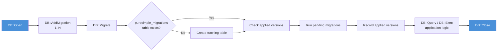

# บทที่ 13: การผนวก SQLite

*ฐานข้อมูลของคุณคอมไพล์รวมเข้าไปในไบนารีด้วย*

---

**วัตถุประสงค์การเรียนรู้**

เมื่ออ่านบทนี้จบ คุณจะสามารถ:

- เปิดฐานข้อมูล SQLite ทั้งแบบไฟล์และแบบ in-memory ผ่านโมดูล `DB`
- รันคำสั่ง DDL และ DML ด้วย parameterised queries เพื่อป้องกัน SQL injection
- อ่านค่าคอลัมน์ตามชนิดข้อมูลด้วย `DB::GetStr`, `DB::GetInt`, และ `DB::GetFloat`
- ลงทะเบียนและรัน migration แบบ idempotent ด้วย `DB::AddMigration` และ `DB::Migrate`
- จัดการข้อผิดพลาดของฐานข้อมูลอย่างเหมาะสมด้วย `DB::Error`

---

## 13.1 ทำไมต้อง SQLite?

เฟรมเวิร์กเว็บส่วนใหญ่กำหนดให้คุณต้องติดตั้ง database server แยกต่างหาก ต้องตั้งค่า PostgreSQL สร้างผู้ใช้ จัดการ connection และหวังว่า ORM จะสร้าง SQL ที่สมเหตุสมผลออกมา PureSimple เลือกเส้นทางที่แตกต่าง PureBasic มี SQLite ฝังอยู่ใน standard library ตั้งแต่ต้น เมื่อคุณเรียก `UseSQLiteDatabase()` engine ของ SQLite ก็กลายเป็นส่วนหนึ่งของไบนารีคุณทันที ไม่มี process ภายนอก ไม่มีการเชื่อมต่อผ่าน socket ไม่มีไฟล์ config ฐานข้อมูลของคุณอยู่ในไฟล์ไฟล์เดียวบนดิสก์ หรือเป็น store แบบชั่วคราวในหน่วยความจำที่หายไปเมื่อ process สิ้นสุด

นี่ไม่ใช่ข้อจำกัด SQLite รองรับการอ่านข้อมูลพร้อมกันได้หลายร้อยคน รองรับ transaction และเป็น database engine ที่ถูก deploy ใช้งานมากที่สุดในโลก สมาร์ทโฟนของคุณใช้มัน เบราว์เซอร์ของคุณก็ใช้มัน หาก SQLite ดีพอสำหรับ Firefox และ Android ทุกเครื่องที่เคยผลิตมา มันก็ดีพอสำหรับบล็อกของคุณเช่นกัน

โมดูล `DB` ใน PureSimple ห่อหุ้มฟังก์ชัน SQLite ของ PureBasic ไว้เบื้องหลัง API ที่เรียบง่ายและสะอาด wrapper นี้มีเหตุผลสองประการ ประการแรก ทำให้ทุก operation มี prefix `DB::` อย่างสม่ำเสมอ ทำให้โค้ดอ่านง่ายขึ้น ประการที่สอง เพิ่ม migration runner ซึ่งเป็นสิ่งที่ PureBasic ไม่มีให้มาในตัว คุณลงทะเบียนคำสั่ง SQL ที่มีหมายเลขกำกับ เรียก `DB::Migrate` แล้วเฟรมเวิร์กจะรันเฉพาะรายการที่ยังไม่ได้รัน

> **เปรียบเทียบ:** หากคุณเคยใช้ package `database/sql` ของ Go โมดูล `DB` ทำหน้าที่คล้ายกัน `DB::Open` เทียบเท่า `sql.Open`, `DB::Query` เทียบเท่า `db.Query` และ `DB::NextRow` เทียบเท่า `rows.Next` พื้นที่ API ออกแบบให้เล็กโดยเจตนา ราวสิบกว่า procedure เพราะ wrapper ที่บางนั้นอยู่ยั้งยืนยงกว่า abstraction ที่หนา

---

## 13.2 การเปิดและปิดฐานข้อมูล

ทุกอย่างเริ่มต้นที่ `DB::Open` ส่ง path ของไฟล์เข้าไปก็จะได้ handle ของฐานข้อมูลกลับมา หรือส่ง `":memory:"` เข้าไปก็จะได้ฐานข้อมูลใหม่ในหน่วยความจำที่หายไปเมื่อคุณเรียก `DB::Close` หรือเมื่อ process สิ้นสุด

```purebasic
; ตัวอย่างที่ 13.1 -- การเปิดฐานข้อมูลแบบไฟล์และแบบ in-memory
EnableExplicit

XIncludeFile "../../src/PureSimple.pb"

; ฐานข้อมูลแบบไฟล์ (สร้างใหม่หากยังไม่มี)
Define db.i = DB::Open("app.db")
If db = 0
  PrintN("Failed to open database")
  End 1
EndIf

; ฐานข้อมูลแบบ in-memory (เร็ว แต่เป็นแบบชั่วคราว)
Define testdb.i = DB::Open(":memory:")

; ... ใช้งานฐานข้อมูล ...

DB::Close(testdb)
DB::Close(db)
```

handle ที่ได้จาก `DB::Open` คือ identifier แบบ `#PB_Any` ของ PureBasic ซึ่งเป็นตัวเลขที่ระบุ connection นี้โดยเฉพาะ คุณต้องส่งมันไปทุกครั้งที่เรียก `DB::` หากการเปิดล้มเหลว จะได้ศูนย์กลับมา ตรวจสอบค่าศูนย์ทุกครั้ง

ผมเคยเสียเวลายี่สิบนาทีในการ debug handler ที่แสดงหน้าว่างเปล่าโดยไม่มีข้อผิดพลาด ปัญหาคือ path ของไฟล์ฐานข้อมูลผิด `DB::Open` คืนค่าศูนย์ ทุก query คืนค่าศูนย์ ทุก `NextRow` คืนค่าศูนย์ และ handler ก็แสดงหน้าที่ไม่มีข้อมูลอย่างขยันขันแข็ง ไม่มี crash ไม่มีข้อความ error แค่หน้าว่างและนักพัฒนาจ้องจอ ตรวจสอบ handle ของคุณเสมอ

> **คำเตือน:** ตรวจสอบว่า `DB::Open` คืนค่า handle ที่ไม่ใช่ศูนย์เสมอก่อนดำเนินการต่อ ค่าศูนย์หมายความว่าเปิดฐานข้อมูลไม่ได้ และ operation ถัดไปทั้งหมดจะล้มเหลวโดยไม่แจ้งเตือน

ภายใต้ฝาครอบ `DB::Open` เรียก `OpenDatabase(#PB_Any, Path, "", "")` ของ PureBasic สตริงว่างสองตัวคือ parameter ของ username และ password ซึ่ง SQLite ไม่ใช้แต่ function signature กำหนดให้มี `DB::Close` เรียก `CloseDatabase` wrapper นี้ไม่เพิ่ม overhead เลย คอมไพเลอร์ inline procedure บรรทัดเดียวเหล่านี้

> **ข้อควรระวัง PureBasic:** PureBasic กำหนดให้ต้องเรียก `UseSQLiteDatabase()` ก่อน operation SQLite ทุกครั้ง ใน PureSimple สิ่งนี้จัดการโดยอัตโนมัติ `src/DB/SQLite.pbi` เรียกมันที่ระดับ module หากคุณเขียนโค้ด SQLite แบบ standalone นอกเฟรมเวิร์ก ให้เพิ่ม `UseSQLiteDatabase()` ก่อนเรียก `DB::Open` ครั้งแรก

---

## 13.3 การรันคำสั่ง SQL

การทำงานกับฐานข้อมูลแบ่งเป็นสองประเภท: คำสั่งที่เปลี่ยนแปลงข้อมูลและคำสั่งที่อ่านข้อมูล โมดูล `DB` สะท้อนการแบ่งนี้ด้วย `DB::Exec` สำหรับการเขียนและ `DB::Query` สำหรับการอ่าน

### DDL: การสร้างตารางและ Index

`DB::Exec` รันคำสั่ง SQL ที่ไม่คืนค่าแถว ได้แก่ `CREATE TABLE`, `CREATE INDEX`, `INSERT`, `UPDATE`, `DELETE`, `DROP`, และ `ALTER TABLE`

```purebasic
; ตัวอย่างที่ 13.2 -- การสร้างตารางและ index ด้วย DB::Exec
Define ok.i

ok = DB::Exec(db, "CREATE TABLE IF NOT EXISTS posts (" +
                   "id INTEGER PRIMARY KEY AUTOINCREMENT, " +
                   "title TEXT NOT NULL, " +
                   "slug TEXT NOT NULL UNIQUE, " +
                   "body TEXT NOT NULL, " +
                   "created_at TEXT NOT NULL DEFAULT " +
                   "(datetime('now')))")

If Not ok
  PrintN("Create table failed: " + DB::Error(db))
EndIf

ok = DB::Exec(db, "CREATE INDEX IF NOT EXISTS " +
                   "idx_posts_slug ON posts (slug)")
```

`DB::Exec` คืน `#True` เมื่อสำเร็จและ `#False` เมื่อล้มเหลว เมื่อล้มเหลว ให้เรียก `DB::Error` เพื่อดูข้อความ error จาก SQLite ข้อความ error มีประโยชน์สำหรับการ log แต่ไม่ควรแสดงให้ผู้ใช้เห็น เพราะอาจเปิดเผยรายละเอียดของ schema

### DML: การแทรกและอัปเดตข้อมูล

การแทรกข้อมูลทำได้เช่นเดียวกัน แต่ที่นี่คุณต้องเผชิญกับกฎที่สำคัญที่สุดในการพัฒนาเว็บ: **ห้ามต่อ input ของผู้ใช้เข้าไปใน SQL string โดยตรง**

```purebasic
; ตัวอย่างที่ 13.3 -- ผิด: ช่องโหว่ SQL injection
; อย่าทำแบบนี้เด็ดขาด
Define title.s = userInput  ; ← ผู้โจมตีควบคุมได้
DB::Exec(db, "INSERT INTO posts (title) VALUES ('" +
              title + "')")
; ถ้า title = "'); DROP TABLE posts; --"
; คุณเพิ่งทำลายข้อมูลทั้งหมด
```

ให้ใช้ parameterised queries แทน ชั้น database ของ PureBasic รองรับ placeholder แบบ `?` คุณผูกค่าเข้ากับ placeholder เหล่านั้นตามลำดับ และ database engine จัดการ escaping ให้

```purebasic
; ตัวอย่างที่ 13.4 -- ถูกต้อง: parameterised INSERT
DB::BindStr(db, 0, title)
DB::BindStr(db, 1, slug)
DB::BindStr(db, 2, body)
DB::Exec(db, "INSERT INTO posts (title, slug, body) " +
              "VALUES (?, ?, ?)")
```

> **คำเตือน:** ใช้ parameterised queries เสมอ ห้ามต่อ input ของผู้ใช้เข้า SQL SQL injection เป็นช่องโหว่เว็บอันดับหนึ่งมากว่ายี่สิบปี และวิธีแก้คือ parameterised queries มาตลอดระยะเวลานั้น ไม่มีข้อแก้ตัว

procedure `DB::BindStr` และ `DB::BindInt` กำหนดค่า parameter ตามลำดับที่เริ่มจากศูนย์ เรียกก่อนที่จะเรียก `DB::Exec` หรือ `DB::Query` การผูกค่าจะใช้ได้กับการรัน statement ครั้งถัดไปเท่านั้น

---

## 13.4 การ Query ข้อมูล

การอ่านข้อมูลต้องทำสามขั้นตอน: รัน query วนซ้ำผ่านแถว แล้วจัดการ result set

```purebasic
; ตัวอย่างที่ 13.5 -- การ Query แถวด้วย DB::Query และ DB::NextRow
If DB::Query(db, "SELECT id, title, slug FROM posts " +
                  "ORDER BY id DESC")
  While DB::NextRow(db)
    Protected id.i    = DB::GetInt(db, 0)
    Protected title.s = DB::GetStr(db, 1)
    Protected slug.s  = DB::GetStr(db, 2)
    PrintN(Str(id) + ": " + title + " (" + slug + ")")
  Wend
  DB::Done(db)
EndIf
```

`DB::Query` คืน `#True` หาก query รันสำเร็จ (แม้จะไม่มีแถวกลับมาเลย) `DB::NextRow` เลื่อนไปยังแถวถัดไปและคืน `#True` หากมีแถวพร้อมใช้ เมื่อหมดแถวก็คืน `#False` และออกจากลูป `While` `DB::Done` คืน result set ภายในให้ระบบ เรียกมันเมื่อทำงานเสร็จ ไม่ว่าจะอ่านครบทุกแถวหรือไม่

> **เคล็ดลับ:** `Protected` ใน PureBasic มี scope อยู่ในระดับ procedure ไม่ใช่ระดับ block การประกาศ `Protected` ภายในลูป `While` ไม่ได้จองหน่วยความจำใหม่ มันเทียบเท่ากับการประกาศที่ต้นของ procedure เราวางไว้ใกล้จุดที่ใช้งานครั้งแรกเพื่อความอ่านง่าย

> **ข้อควรระวัง PureBasic:** method นี้ชื่อ `DB::NextRow` ไม่ใช่ `DB::Next` เพราะ PureBasic จอง `Next` ไว้สำหรับลูป `For...Next` ทุกครั้งที่คุณนึกถึง `Next` แล้วคอมไพเลอร์บ่น ให้นึกถึงเรื่องนี้: PureBasic มีความเห็นที่แน่วแน่เกี่ยวกับ `For...Next` และไม่ยอมประนีประนอม

ค่าคอลัมน์ถูกดึงออกตามลำดับที่เริ่มจากศูนย์ ไม่ใช่ตามชื่อ คอลัมน์ 0 คือคอลัมน์แรกใน `SELECT` ของคุณ ตัวเข้าถึงสามแบบครอบคลุมชนิดข้อมูลทั่วไป:

| Procedure | คืนค่า | ใช้สำหรับ |
|-----------|--------|-----------|
| `DB::GetStr(db, col)` | `.s` (string) | คอลัมน์ TEXT |
| `DB::GetInt(db, col)` | `.i` (integer) | คอลัมน์ INTEGER |
| `DB::GetFloat(db, col)` | `.d` (double) | คอลัมน์ REAL/FLOAT |

### Parameterised SELECT Queries

คุณผูก parameter เข้ากับ SELECT query ได้เช่นเดียวกับที่ผูกเข้ากับ INSERT:

```purebasic
; ตัวอย่างที่ 13.6 -- Parameterised SELECT query
DB::BindStr(db, 0, "hello-world")
If DB::Query(db, "SELECT title, body FROM posts " +
                  "WHERE slug = ?")
  If DB::NextRow(db)
    Protected postTitle.s = DB::GetStr(db, 0)
    Protected postBody.s  = DB::GetStr(db, 1)
  EndIf
  DB::Done(db)
EndIf
```

ผูกก่อน แล้วค่อย query ลำดับของ parameter index ตรงกับตำแหน่งของ `?` placeholder ใน SQL string โดยเริ่มจากศูนย์

---

## 13.5 Migration Runner

ฐานข้อมูลเปลี่ยนแปลงตลอดเวลา คุณเริ่มต้นด้วยตารางเดียว แล้วเพิ่มคอลัมน์ เพิ่มตารางใหม่ สร้าง index Migration runner ติดตามว่าการเปลี่ยนแปลงใดถูกนำไปใช้แล้ว และรันเฉพาะรายการที่ยังรอดำเนินการ


*รูปที่ 13.1 -- วงจรชีวิต SQLite: เปิด, migrate, query, ปิด*

### การลงทะเบียน Migration

เรียก `DB::AddMigration` พร้อมหมายเลข version และ SQL string หมายเลข version ต้องเป็นเลขจำนวนเต็มบวกที่ไม่ซ้ำกัน Migration จะรันตามลำดับที่ลงทะเบียน ไม่ใช่ตามหมายเลข version ดังนั้นให้ลงทะเบียนตามลำดับ

```purebasic
; ตัวอย่างที่ 13.7 -- การลงทะเบียนและรัน migration
DB::AddMigration(1, "CREATE TABLE IF NOT EXISTS posts (" +
                     "id INTEGER PRIMARY KEY AUTOINCREMENT, " +
                     "title TEXT NOT NULL, " +
                     "slug TEXT NOT NULL UNIQUE, " +
                     "body TEXT NOT NULL, " +
                     "created_at TEXT NOT NULL DEFAULT " +
                     "(datetime('now')))")

DB::AddMigration(2, "CREATE TABLE IF NOT EXISTS contacts (" +
                     "id INTEGER PRIMARY KEY AUTOINCREMENT, " +
                     "name TEXT NOT NULL, " +
                     "email TEXT NOT NULL, " +
                     "message TEXT NOT NULL, " +
                     "created_at TEXT NOT NULL DEFAULT " +
                     "(datetime('now')))")

DB::AddMigration(3, "ALTER TABLE posts ADD COLUMN " +
                     "is_published INTEGER DEFAULT 1")

Define db.i = DB::Open("app.db")
If DB::Migrate(db)
  PrintN("Migrations applied successfully")
Else
  PrintN("Migration failed: " + DB::Error(db))
EndIf
```

### กลไกการทำงานของ Migrate

เมื่อคุณเรียก `DB::Migrate` เฟรมเวิร์กดำเนินการดังนี้:

1. สร้างตาราง `puresimple_migrations` หากยังไม่มี ตารางนี้มีสองคอลัมน์: `version` (integer primary key) และ `applied_at` (text)
2. สำหรับแต่ละ migration ที่ลงทะเบียนไว้ ตรวจสอบว่าหมายเลข version ปรากฏอยู่ใน `puresimple_migrations` แล้วหรือยัง
3. หากยังไม่พบ version นั้น รัน SQL ของ migration
4. บันทึก version และ timestamp ลงใน `puresimple_migrations`
5. หาก migration ใดล้มเหลว คืน `#False` ทันที Migration ที่ถูกนำไปใช้แล้วในชุดเดียวกันจะไม่ถูก rollback

กระบวนการนี้เป็น idempotent คุณเรียก `DB::Migrate` ทุกครั้งที่แอปพลิเคชันเริ่มต้นได้ Migration ที่ถูกนำไปใช้แล้วจะถูกข้ามไป Migration ใหม่ถูกนำไปใช้ตามลำดับ schema ของคุณจะมาถึงสถานะที่ถูกต้องโดยไม่ว่าจะ restart กี่ครั้ง

> **ภายใต้ฝาครอบ:** Migration ถูกเก็บไว้ในสองอาร์เรย์ global: `_MigVer` สำหรับหมายเลข version และ `_MigSQL` สำหรับ SQL string สูงสุด 64 migration กำหนดโดยค่าคงที่ `#_MAX_MIG` หากแอปพลิเคชันของคุณต้องการมากกว่า 64 migration แสดงว่าคุณ iterate เร็วมากเกินไป หรือควรพิจารณารวม migration เก่าๆ ให้เป็น baseline schema เดียว

### การ Reset Migration สำหรับการทดสอบ

ระหว่าง test suite ให้เรียก `DB::ResetMigrations()` เพื่อล้างรายการ migration ที่ลงทะเบียนไว้ สิ่งนี้ป้องกัน migration จาก test suite หนึ่งไม่ให้รั่วไหลไปยัง test suite อื่น:

```purebasic
; ตัวอย่างที่ 13.8 -- การ reset migration ระหว่างการทดสอบ
DB::ResetMigrations()
DB::AddMigration(1, "CREATE TABLE test_items (" +
                     "id INTEGER PRIMARY KEY, " +
                     "name TEXT)")
Define testdb.i = DB::Open(":memory:")
DB::Migrate(testdb)
; ... รันการทดสอบ ...
DB::Close(testdb)
DB::ResetMigrations()
```

> **เคล็ดลับ:** ใช้ `":memory:"` สำหรับฐานข้อมูลทดสอบ มันเร็ว ไม่ต้องทำความสะอาด และรับประกันการแยกการทดสอบ การเรียก `DB::Open(":memory:")` แต่ละครั้งสร้างฐานข้อมูลอิสระโดยสมบูรณ์

---

## 13.6 การจัดการข้อผิดพลาด

ทุก call ของ `DB::Exec` และ `DB::Query` อาจล้มเหลวได้ รูปแบบการจัดการสอดคล้องกัน: ตรวจสอบค่าที่คืนมา แล้วเรียก `DB::Error` เพื่อดูรายละเอียด

```purebasic
; ตัวอย่างที่ 13.9 -- การจัดการข้อผิดพลาดของฐานข้อมูล
If Not DB::Exec(db, "INSERT INTO posts (title, slug, " +
                     "body) VALUES (?, ?, ?)")
  Protected errMsg.s = DB::Error(db)
  PrintN("Insert failed: " + errMsg)
  ; ส่ง error 500 กลับไปยัง client
  ; Rendering::Status(*C, 500)
EndIf
```

`DB::Error` คืนข้อความ error จาก SQLite engine ข้อผิดพลาดที่พบบ่อยได้แก่ `UNIQUE constraint failed` (key ซ้ำ), `NOT NULL constraint failed` (ขาดข้อมูลที่จำเป็น), และ `no such table` (ยังไม่ได้รัน migration) ข้อความเหล่านี้มีประโยชน์สำหรับการ log แต่ควรแปลงเป็นข้อความที่เข้าใจง่ายก่อนส่งในการตอบสนอง HTTP

ใน handler รูปแบบทั่วไปคือ: ลองดำเนินการ ตรวจสอบความล้มเหลว และส่ง HTTP status ที่เหมาะสมกลับไป slug ที่ซ้ำกันเมื่อ insert กลายเป็น 409 Conflict ตารางที่หายไปกลายเป็น 500 Internal Server Error (เพราะหมายความว่า migration ไม่ได้รัน)

ข้อผิดพลาดของฐานข้อมูลในแอปพลิเคชันเว็บไม่ใช่เรื่องผิดปกติ มันคาดเดาได้ ผู้ใช้จะส่งข้อมูลซ้ำ ปัญหาเครือข่ายจะทำให้ query เสียหาย ดิสก์จะเต็ม จัดการข้อผิดพลาดอย่างชัดเจน log มัน และส่งการตอบสนอง HTTP ที่สมเหตุสมผล ผู้ใช้ของคุณสมควรได้รับมากกว่า stack trace

---

## 13.7 API ของโมดูล DB ทั้งหมด

นี่คือ interface สาธารณะทั้งหมดของโมดูล `DB` รวบรวมไว้ในที่เดียวสำหรับอ้างอิง:

| Procedure | Signature | จุดประสงค์ |
|-----------|-----------|------------|
| `DB::Open` | `(Path.s) -> .i` | เปิดฐานข้อมูล คืน handle หรือ 0 |
| `DB::Close` | `(Handle.i)` | ปิด database handle |
| `DB::Exec` | `(Handle.i, SQL.s) -> .i` | รัน SQL ที่ไม่ใช่ SELECT คืน `#True`/`#False` |
| `DB::Query` | `(Handle.i, SQL.s) -> .i` | รัน SELECT คืน `#True`/`#False` |
| `DB::NextRow` | `(Handle.i) -> .i` | เลื่อนไปแถวถัดไป คืน `#True` หากมี |
| `DB::Done` | `(Handle.i)` | คืน result set ปัจจุบัน |
| `DB::GetStr` | `(Handle.i, Col.i) -> .s` | ดึงค่า string จากคอลัมน์ |
| `DB::GetInt` | `(Handle.i, Col.i) -> .i` | ดึงค่า integer จากคอลัมน์ |
| `DB::GetFloat` | `(Handle.i, Col.i) -> .d` | ดึงค่า float จากคอลัมน์ |
| `DB::BindStr` | `(Handle.i, Idx.i, Val.s)` | ผูก string เข้ากับ parameter placeholder |
| `DB::BindInt` | `(Handle.i, Idx.i, Val.i)` | ผูก integer เข้ากับ parameter placeholder |
| `DB::Error` | `(Handle.i) -> .s` | ดึงข้อความ error ล่าสุด |
| `DB::AddMigration` | `(Version.i, SQL.s)` | ลงทะเบียน migration |
| `DB::Migrate` | `(Handle.i) -> .i` | รัน migration ที่รอดำเนินการ |
| `DB::ResetMigrations` | `()` | ล้าง migration ที่ลงทะเบียนทั้งหมด |

> ดูการ implement ทั้งหมดได้ที่ `src/DB/SQLite.pbi` ใน repository ของ PureSimple

---

## สรุป

การผนวก SQLite ใน PureSimple ให้ database engine ที่คอมไพล์รวมอยู่ในตัวโดยไม่มีค่าใช้จ่ายในการ deploy โมดูล `DB` ห่อหุ้มฟังก์ชัน SQLite ของ PureBasic ไว้เบื้องหลัง API ที่สอดคล้องกัน: `Open` และ `Close` สำหรับการจัดการวงจรชีวิต, `Exec` และ `Query` สำหรับการรัน statement, `BindStr` และ `BindInt` สำหรับ parameterised queries และ `AddMigration` บวกกับ `Migrate` สำหรับการวิวัฒนาการของ schema Parameterised queries เป็นสิ่งบังคับ ห้ามต่อ input ผู้ใช้เข้า SQL Migration runner เป็น idempotent คุณเรียก `DB::Migrate` ทุกครั้งที่เริ่มต้นได้โดยไม่ต้องกังวลเรื่องการเปลี่ยนแปลง schema ซ้ำ

---

**ประเด็นสำคัญ**

- ใช้ parameterised queries (`DB::BindStr`, `DB::BindInt`) เสมอ SQL injection คือช่องโหว่เก่าแก่ที่สุดในการพัฒนาเว็บ และป้องกันได้อย่างสมบูรณ์
- ใช้ `":memory:"` สำหรับฐานข้อมูลทดสอบเพื่อให้การทดสอบรันเร็วและแยกจากกันโดยไม่ต้องทำความสะอาดไฟล์
- เรียก `DB::Migrate` ทุกครั้งที่แอปพลิเคชันเริ่มต้น migration runner จะข้าม migration ที่ถูกนำไปใช้แล้วโดยอัตโนมัติ
- ตรวจสอบค่าที่คืนมาจาก `DB::Open`, `DB::Exec`, และ `DB::Query` เสมอ ความล้มเหลวที่เงียบสงบสร้างหน้าว่าง ไม่ใช่ข้อความ error

---

**คำถามทบทวน**

1. อะไรจะเกิดขึ้นหากคุณเรียก `DB::Migrate` สองครั้งบนฐานข้อมูลเดียวกันด้วยชุด migration ที่ลงทะเบียนชุดเดิม? อธิบายว่าทำไมพฤติกรรมนี้จึงสำคัญสำหรับ production deployment

2. ทำไมคุณควรเรียก `DB::Done` หลังจาก query เสร็จสิ้น แม้ว่าจะอ่านครบทุกแถวแล้ว?

3. *ลองทำ:* สร้าง migration ที่เพิ่มตาราง `users` พร้อมคอลัมน์ `id`, `username`, `email`, และ `created_at` เปิดฐานข้อมูล in-memory รัน migration แทรก user สองคนด้วย parameterised queries แล้ว query กลับมาและแสดงผล
