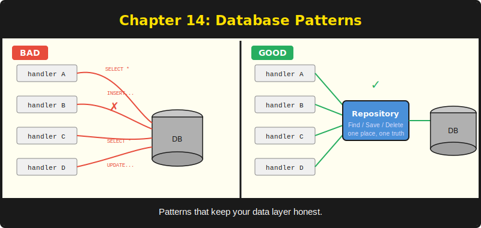

# บทที่ 14: รูปแบบการใช้งานฐานข้อมูล



*รูปแบบที่รักษา data layer ของคุณให้เป็นระเบียบเมื่อแอปพลิเคชันเติบโต*

---

**วัตถุประสงค์การเรียนรู้**

เมื่ออ่านบทนี้จบ คุณจะสามารถ:

- ใช้ repository pattern เพื่อแยกตรรกะฐานข้อมูลไว้เบื้องหลัง module boundary
- สร้าง query แบบแบ่งหน้าด้วย LIMIT และ OFFSET
- ห่อหุ้ม operation หลายขั้นตอนด้วย transaction โดยใช้ BEGIN, COMMIT, และ ROLLBACK
- เติมข้อมูลทดสอบและ reset สถานะฐานข้อมูลระหว่าง test suite

---

## 14.1 ปัญหาของ SQL ที่กระจัดกระจาย

ในบทที่ 13 คุณเรียนรู้การเปิดฐานข้อมูล รัน query และนำ migration ไปใช้ ตอนนี้คุณมีเครื่องมือแล้ว แต่ยังไม่มีแผนว่าจะวางมันไว้ที่ไหน

ความล่อใจนั้นแรงมาก: เขียน SQL โดยตรงใน route handler ของคุณ ต้องการดึงรายการโพสต์? Query ตรงนั้นเลยใน `IndexHandler` ต้องการสร้างโพสต์? INSERT ตรงนั้นเลยใน `CreateHandler` สำหรับแอปพลิเคชันสิบ route สิ่งนี้ใช้ได้ สำหรับแอปพลิเคชันสามสิบ route ที่มีการทดสอบ admin panel และ API endpoint คุณจะจบลงด้วย SQL เดิมๆ กระจายอยู่ใน procedure สิบกว่าตัว แต่ละตัวมีความแตกต่างเล็กน้อยในลำดับคอลัมน์ การจัดการข้อผิดพลาด และการผูก parameter

คุณอาจจัดการความวุ่นวายนี้ด้วยการ copy-paste และความหวัง หรือจะโยน chainsaw ที่กำลังเดินอยู่ขึ้นไปในอากาศก็ได้ ทั้งสองอย่างดูน่าประทับใจอยู่ประมาณสามสิบวินาที

ทางออกคือ repository pattern: วาง database access ทั้งหมดสำหรับ resource หนึ่งๆ ไว้เบื้องหลัง module Handler เรียก module และ module คุยกับฐานข้อมูล Handler ไม่เคยเห็น SQL string เลย

---

## 14.2 Repository Pattern

module ของ repository เปิดเผย procedure เช่น `FindAll`, `FindBySlug`, `Create`, `Update`, และ `Delete` ภายใน module คุณเขียน SQL ภายนอก module คุณเรียก procedure ที่สะอาดพร้อม parameter ที่มีชนิดข้อมูล หาก database schema เปลี่ยนแปลง คุณแก้ไข module เดียวแทนที่จะไล่หาทุก handler

```purebasic
; ตัวอย่างที่ 14.1 -- Repository module สำหรับโพสต์บล็อก
EnableExplicit

DeclareModule PostRepo
  Declare.i FindAll(db.i, List titles.s(), List slugs.s())
  Declare.i FindBySlug(db.i, slug.s, *title.String,
                       *body.String)
  Declare.i Create(db.i, title.s, slug.s, body.s)
  Declare.i Update(db.i, slug.s, title.s, body.s)
  Declare.i DeleteBySlug(db.i, slug.s)
EndDeclareModule

Module PostRepo

  Procedure.i FindAll(db.i, List titles.s(),
                      List slugs.s())
    Protected count.i = 0
    ClearList(titles())
    ClearList(slugs())
    If DB::Query(db, "SELECT title, slug FROM posts " +
                      "ORDER BY id DESC")
      While DB::NextRow(db)
        AddElement(titles())
        titles() = DB::GetStr(db, 0)
        AddElement(slugs())
        slugs() = DB::GetStr(db, 1)
        count + 1
      Wend
      DB::Done(db)
    EndIf
    ProcedureReturn count
  EndProcedure

  Procedure.i FindBySlug(db.i, slug.s, *title.String,
                         *body.String)
    DB::BindStr(db, 0, slug)
    If DB::Query(db, "SELECT title, body FROM posts " +
                      "WHERE slug = ?")
      If DB::NextRow(db)
        *title\s = DB::GetStr(db, 0)
        *body\s  = DB::GetStr(db, 1)
        DB::Done(db)
        ProcedureReturn #True
      EndIf
      DB::Done(db)
    EndIf
    ProcedureReturn #False
  EndProcedure

  Procedure.i Create(db.i, title.s, slug.s, body.s)
    DB::BindStr(db, 0, title)
    DB::BindStr(db, 1, slug)
    DB::BindStr(db, 2, body)
    ProcedureReturn DB::Exec(db,
      "INSERT INTO posts (title, slug, body) " +
      "VALUES (?, ?, ?)")
  EndProcedure

  Procedure.i Update(db.i, slug.s, title.s, body.s)
    DB::BindStr(db, 0, title)
    DB::BindStr(db, 1, body)
    DB::BindStr(db, 2, slug)
    ProcedureReturn DB::Exec(db,
      "UPDATE posts SET title = ?, body = ? " +
      "WHERE slug = ?")
  EndProcedure

  Procedure.i DeleteBySlug(db.i, slug.s)
    DB::BindStr(db, 0, slug)
    ProcedureReturn DB::Exec(db,
      "DELETE FROM posts WHERE slug = ?")
  EndProcedure

EndModule
```

> **ภายใต้ฝาครอบ:** `String` คือ structure ที่มีอยู่ใน PureBasic โดยมีฟิลด์เดียวคือ `\s` การใช้ `*title.String` ส่ง string แบบ by reference เข้าถึงค่าด้วย `*title\s` วิธีนี้หลีกเลี่ยงการคัดลอก string ขนาดใหญ่ระหว่าง procedure

โค้ดของ handler อ่านง่ายขึ้นมาก:

```purebasic
; ตัวอย่างที่ 14.2 -- Handler ที่ใช้ repository module
Procedure IndexHandler(*C.RequestContext)
  Protected NewList titles.s()
  Protected NewList slugs.s()
  PostRepo::FindAll(db, titles(), slugs())
  ; ... render รายการ ...
EndProcedure

Procedure PostHandler(*C.RequestContext)
  Protected slug.s = Binding::Param(*C, "slug")
  Protected title.String, body.String
  If PostRepo::FindBySlug(db, slug, @title, @body)
    ; ... render โพสต์ ...
  Else
    Rendering::Status(*C, 404)
  EndIf
EndProcedure
```

ไม่มี SQL ใน handler ไม่มีการผูก parameter ใน handler ไม่มี `DB::Done` ใน handler handler ส่งคำขอ รับผลลัพธ์ และ render มัน นั่นคืองานของมัน การคุยกับฐานข้อมูลเป็นงานของ repository

> **เปรียบเทียบ:** ใน Go คุณจะกำหนด interface `PostStore` พร้อม method `FindAll`, `FindBySlug`, `Create`, `Update`, และ `Delete` แล้ว implement ด้วย struct ที่เก็บ `*sql.DB` PureBasic ไม่มี interface แต่ module พร้อม `DeclareModule` ทำหน้าที่ encapsulation เช่นเดียวกัน handler ขึ้นอยู่กับ public API ของ module ไม่ใช่ SQL implementation ของมัน

---

## 14.3 การแบ่งหน้าด้วย LIMIT และ OFFSET

เมื่อตาราง posts ของคุณเติบโตจากห้าแถวเป็นห้าพัน การคืนทั้งหมดใน query เดียวเป็นการเอาเปรียบผู้ใช้และกดดันเบราว์เซอร์ของพวกเขา การแบ่งหน้าจำกัด query แต่ละครั้งให้ได้จำนวนแถวที่กำหนด และให้ผู้ใช้นำทางผ่านหน้าต่างๆ

SQLite รองรับ `LIMIT` และ `OFFSET` โดยตรง:

```purebasic
; ตัวอย่างที่ 14.3 -- Query แบบแบ่งหน้าด้วย LIMIT และ OFFSET
Procedure.i FindPage(db.i, page.i, perPage.i,
                     List titles.s(), List slugs.s())
  Protected count.i = 0
  Protected offset.i = (page - 1) * perPage
  ClearList(titles())
  ClearList(slugs())

  DB::BindInt(db, 0, perPage)
  DB::BindInt(db, 1, offset)
  If DB::Query(db, "SELECT title, slug FROM posts " +
                    "ORDER BY id DESC " +
                    "LIMIT ? OFFSET ?")
    While DB::NextRow(db)
      AddElement(titles())
      titles() = DB::GetStr(db, 0)
      AddElement(slugs())
      slugs() = DB::GetStr(db, 1)
      count + 1
    Wend
    DB::Done(db)
  EndIf
  ProcedureReturn count
EndProcedure
```

หน้าที่ 1 พร้อม 10 รายการต่อหน้าได้ `OFFSET 0` หน้าที่ 2 ได้ `OFFSET 10` หน้าที่ 3 ได้ `OFFSET 20` คณิตศาสตร์นั้นง่าย และรูปแบบนี้ทำงานได้ดีสำหรับ dataset ขนาดเล็กถึงกลาง

เพื่อสร้าง page navigation ใน template คุณยังต้องการจำนวนทั้งหมด:

```purebasic
; ตัวอย่างที่ 14.4 -- การนับแถวทั้งหมดสำหรับการแบ่งหน้า
Procedure.i CountPosts(db.i)
  Protected total.i = 0
  If DB::Query(db, "SELECT COUNT(*) FROM posts")
    If DB::NextRow(db)
      total = DB::GetInt(db, 0)
    EndIf
    DB::Done(db)
  EndIf
  ProcedureReturn total
EndProcedure
```

ด้วย `total` และ `perPage` คุณคำนวณ `totalPages = (total + perPage - 1) / perPage` และ render ลิงก์หน้าใน template

> **เคล็ดลับ:** การแบ่งหน้าด้วย LIMIT/OFFSET นั้นง่ายและถูกต้องสำหรับ dataset ที่น้อยกว่าหนึ่งหมื่นแถว สำหรับ dataset ขนาดใหญ่กว่า พิจารณา keyset pagination (เรียกอีกชื่อว่า cursor pagination) ซึ่งใช้ `WHERE id > lastSeenId LIMIT N` แทน OFFSET Keyset pagination ไม่ช้าลงเมื่อ offset เพิ่มขึ้น

มีข้อควรระวังที่รู้จักกันดีกับ OFFSET pagination ที่ดักจับนักพัฒนาที่มาจากระบบฐานข้อมูลขนาดใหญ่: ด้วย single-writer model ของ SQLite ข้อมูลอาจเปลี่ยนแปลงระหว่าง COUNT query และ SELECT query หากมีการเขียนในระหว่างนั้น สำหรับบล็อกที่มี admin คนเดียว นี่ไม่ใช่ปัญหาในทางปฏิบัติ สำหรับแอปพลิเคชันที่มี traffic สูง keyset pagination แก้ปัญหานี้ได้อย่างสมบูรณ์

---

## 14.4 Transaction

บาง operation ต้องสำเร็จหรือล้มเหลวเป็นหน่วยเดียว หากคุณกำลังโอน credit ระหว่างบัญชีผู้ใช้สองบัญชี คุณไม่สามารถหัก credit จากบัญชีหนึ่งแล้วล้มเหลวก่อนที่จะเพิ่มให้อีกบัญชีได้ Transaction รับประกัน atomicity: คำสั่งทั้งหมดสำเร็จ หรือไม่มีคำสั่งใดมีผล

SQLite รองรับ transaction ผ่านคำสั่ง SQL มาตรฐาน: `BEGIN`, `COMMIT`, และ `ROLLBACK` โมดูล `DB` รันสิ่งเหล่านี้เหมือน statement ทั่วไปที่ไม่ใช่ SELECT:

```purebasic
; ตัวอย่างที่ 14.5 -- รูปแบบ transaction wrapper
Procedure.i TransferCredits(db.i, fromUser.i,
                            toUser.i, amount.i)
  ; เริ่ม transaction
  If Not DB::Exec(db, "BEGIN")
    ProcedureReturn #False
  EndIf

  ; หัก credit จากผู้ส่ง
  DB::BindInt(db, 0, amount)
  DB::BindInt(db, 1, fromUser)
  If Not DB::Exec(db, "UPDATE users SET credits = " +
                       "credits - ? WHERE id = ?")
    DB::Exec(db, "ROLLBACK")
    ProcedureReturn #False
  EndIf

  ; เพิ่ม credit ให้ผู้รับ
  DB::BindInt(db, 0, amount)
  DB::BindInt(db, 1, toUser)
  If Not DB::Exec(db, "UPDATE users SET credits = " +
                       "credits + ? WHERE id = ?")
    DB::Exec(db, "ROLLBACK")
    ProcedureReturn #False
  EndIf

  ; ทุกอย่างเรียบร้อย -- commit
  If Not DB::Exec(db, "COMMIT")
    DB::Exec(db, "ROLLBACK")
    ProcedureReturn #False
  EndIf

  ProcedureReturn #True
EndProcedure
```

รูปแบบเสมอเหมือนกัน: `BEGIN` ทำงาน ตรวจสอบทุกขั้นตอน `ROLLBACK` เมื่อล้มเหลว `COMMIT` เมื่อทุกอย่างสำเร็จ ลำดับ `If Not ... ROLLBACK ... ProcedureReturn #False` ซ้ำสำหรับทุก statement ใน transaction นี่ดูยืดยาว แต่ถูกต้อง ในการเขียนโปรแกรมฐานข้อมูล "ถูกต้องและยืดยาว" ดีกว่า "ฉลาดแต่เสียหาย" เสมอ

> **ภายใต้ฝาครอบ:** SQLite ใช้ journal file (หรือ WAL mode) เพื่อ implement transaction เมื่อคุณ `BEGIN` SQLite เริ่มบันทึกการเปลี่ยนแปลงในพื้นที่แยกต่างหาก เมื่อ `COMMIT` มันทำให้การเปลี่ยนแปลงถาวร เมื่อ `ROLLBACK` มันทิ้งการเปลี่ยนแปลงนั้น ไฟล์ฐานข้อมูลไม่เคยอยู่ในสถานะที่ไม่สอดคล้องกัน แม้ว่า process จะ crash ระหว่าง transaction นี่คือกลไกเดียวกับที่ทำให้ SQLite เชื่อถือได้พอสำหรับกล่องดำของเครื่องบิน

คุณสามารถสกัด helper แบบ generic เพื่อลด boilerplate:

```purebasic
; ตัวอย่างที่ 14.6 -- การทำ transaction แบบง่ายด้วย begin/rollback/commit
; เริ่ม transaction คืน #True เมื่อสำเร็จ
Procedure.i TxBegin(db.i)
  ProcedureReturn DB::Exec(db, "BEGIN")
EndProcedure

; Commit transaction คืน #True เมื่อสำเร็จ
Procedure.i TxCommit(db.i)
  ProcedureReturn DB::Exec(db, "COMMIT")
EndProcedure

; Rollback transaction
Procedure TxRollback(db.i)
  DB::Exec(db, "ROLLBACK")
EndProcedure
```

สิ่งเหล่านี้เป็น wrapper บางๆ แต่สื่อความหมายได้ชัดเจน เมื่อคุณอ่าน `TxBegin(db)` คุณรู้ทันทีว่าเกิดอะไรขึ้น เมื่อคุณอ่าน `DB::Exec(db, "BEGIN")` คุณต้องแปล SQL string ในหัว

---

## 14.5 การเติมข้อมูลทดสอบ

การทดสอบต้องการข้อมูล ทุก test suite ที่แตะฐานข้อมูลต้องมีสถานะเริ่มต้นที่รู้จัก รูปแบบ seed ให้สิ่งนั้น:

```purebasic
; ตัวอย่างที่ 14.7 -- การเติมข้อมูลทดสอบลงใน in-memory DB
Procedure.i SetupTestDB()
  Protected db.i = DB::Open(":memory:")
  If db = 0 : ProcedureReturn 0 : EndIf

  DB::ResetMigrations()
  DB::AddMigration(1, "CREATE TABLE posts (" +
                       "id INTEGER PRIMARY KEY " +
                       "AUTOINCREMENT, " +
                       "title TEXT NOT NULL, " +
                       "slug TEXT NOT NULL UNIQUE, " +
                       "body TEXT NOT NULL)")

  If Not DB::Migrate(db)
    DB::Close(db)
    ProcedureReturn 0
  EndIf

  ; เติมข้อมูลทดสอบที่รู้จัก
  DB::BindStr(db, 0, "First Post")
  DB::BindStr(db, 1, "first-post")
  DB::BindStr(db, 2, "Hello world")
  DB::Exec(db, "INSERT INTO posts (title, slug, body) " +
               "VALUES (?, ?, ?)")

  DB::BindStr(db, 0, "Second Post")
  DB::BindStr(db, 1, "second-post")
  DB::BindStr(db, 2, "Goodbye world")
  DB::Exec(db, "INSERT INTO posts (title, slug, body) " +
               "VALUES (?, ?, ?)")

  ProcedureReturn db
EndProcedure
```

การทดสอบแต่ละครั้งเปิดฐานข้อมูล in-memory ใหม่ เติมข้อมูล รัน assertion และปิด ไม่มีการทดสอบใดที่ทำให้อีกการทดสอบปนเปื้อน ไม่มีแถวเหลือจากการรันก่อนหน้าที่จะทำให้เกิดความล้มเหลวแบบผิดพลาดตอนตีสามเมื่อคุณกำลังพยายาม ship fix

function `SetupTestDB` encapsulate ลำดับ setup ทั้งหมด: เปิด, migrate, เติมข้อมูล, คืน handle หากขั้นตอนใดล้มเหลว มันทำความสะอาดและคืนค่าศูนย์ การทดสอบตรวจสอบค่าศูนย์และข้ามอย่างสง่างาม:

```purebasic
; ตัวอย่างที่ 14.8 -- การใช้ test database ใน test suite
BeginSuite("PostRepo")

Define testdb.i = SetupTestDB()
Check(testdb > 0)

If testdb
  ; ทดสอบว่า FindAll คืนโพสต์สองรายการ
  Protected NewList titles.s()
  Protected NewList slugs.s()
  Protected count.i = PostRepo::FindAll(testdb,
                                         titles(),
                                         slugs())
  CheckEqual(count, 2)

  ; ทดสอบ FindBySlug
  Protected t.String, b.String
  Protected found.i = PostRepo::FindBySlug(testdb,
                        "first-post", @t, @b)
  Check(found)
  CheckStr(t\s, "First Post")

  DB::Close(testdb)
EndIf

DB::ResetMigrations()
```

> **เคล็ดลับ:** ใช้ `":memory:"` สำหรับฐานข้อมูลทดสอบ มันเร็ว (ไม่มี disk I/O) แยกจากกัน (แต่ละ handle เป็นอิสระ) และไม่ต้องทำความสะอาด หากคุณต้องการทดสอบพฤติกรรมแบบ file-based ให้สร้างไฟล์ชั่วคราวและลบมันใน teardown code

ผมมีกฎส่วนตัวข้อหนึ่ง: หากการทดสอบใช้เวลามากกว่า 100 มิลลิวินาที แสดงว่ามีบางอย่างผิดปกติ ฐานข้อมูล SQLite แบบ in-memory ทำให้สิ่งนี้ง่าย ลำดับ `SetupTestDB` ทั้งหมด ทั้งเปิด migrate และเติมสองแถว ใช้เวลาน้อยกว่าหนึ่งมิลลิวินาทีบน hardware สมัยใหม่ คุณสามารถรัน test database หนึ่งพันชุดก่อนที่กาน้ำชาจะเดือด

---

## 14.6 ข้อพิจารณาเรื่อง Connection

PureSimple รันในโมเดล single-threaded request หนึ่ง request ต่อเวลา หนึ่ง database connection ไม่มีการแย่งชิง ความเรียบง่ายนี้คือ feature คุณไม่ต้องการ connection pool ไม่ต้องกังวลว่า handler สอง handler จะพยายามเขียนลงตารางเดียวกันพร้อมกัน และไม่ต้องการ mutex รอบ database call

หากคุณย้ายไปสู่โมเดล multi-threaded (คอมไพล์ด้วย flag `-t` และกระจาย request ไปยัง worker thread) กฎจะเปลี่ยน SQLite รองรับการอ่านพร้อมกันแต่ serialize การเขียน คุณต้องการหนึ่ง connection ต่อ thread หรือ connection ที่ใช้ร่วมกันที่ป้องกันด้วย mutex โมดูล `DB` ในปัจจุบันไม่จัดการ connection pool ซึ่งเป็นการตัดสินใจออกแบบสำหรับ phase ในอนาคต

ตอนนี้รูปแบบนั้นง่าย: เปิดฐานข้อมูลครั้งเดียวเมื่อเริ่มต้น ส่ง handle ไปยัง handler ปิดเมื่อสิ้นสุด หนึ่ง connection หนึ่ง handle ไม่มีเรื่องน่าประหลาดใจ

> **คำเตือน:** ฐานข้อมูลแบบ in-memory (`":memory:"`) หายไปเมื่อ process สิ้นสุด นี่เหมาะสำหรับการทดสอบแต่อันตรายสำหรับ production ใช้ file path เสมอใน production: `DB::Open("/opt/puresimple/data/app.db")` และ backup ไฟล์นั้น ฐานข้อมูล SQLite เป็นแค่ไฟล์ Backup มันเหมือนไฟล์

---

## สรุป

รูปแบบการใช้งานฐานข้อมูลให้โครงสร้างแก่ data layer ของคุณเมื่อแอปพลิเคชันเติบโต Repository pattern แยก SQL ไว้เบื้องหลัง module boundary เพื่อให้ handler สะอาดและทดสอบได้ การแบ่งหน้าด้วย LIMIT และ OFFSET ทำให้ query มีประสิทธิภาพและการตอบสนองมีขนาดที่เหมาะสม Transaction ห่อหุ้ม operation หลายขั้นตอนใน atomic unit ที่สำเร็จหรือ rollback อย่างสมบูรณ์ การเติมข้อมูลทดสอบลงในฐานข้อมูล in-memory ให้การทดสอบที่รันเร็วและแยกจากกัน ไม่รบกวนกันเองหรือข้อมูล production

---

**ประเด็นสำคัญ**

- แยก database access ทั้งหมดไว้เบื้องหลัง repository module ห้าม handler มี SQL string
- ใช้ LIMIT/OFFSET สำหรับการแบ่งหน้าและเพิ่ม COUNT query เพื่อคำนวณจำนวนหน้าทั้งหมด
- ห่อหุ้ม database operation หลายขั้นตอนด้วย BEGIN/COMMIT/ROLLBACK transaction เพื่อรับประกัน atomicity

---

**คำถามทบทวน**

1. ข้อดีของ repository pattern เหนือการเขียน SQL โดยตรงใน route handler คืออะไร? ระบุอย่างน้อยสองข้อ

2. อธิบายว่าทำไมฐานข้อมูลแบบ in-memory (`":memory:"`) จึงเหมาะสำหรับการทดสอบแต่ไม่เหมาะสำหรับ production

3. *ลองทำ:* เขียน module `UserRepo` พร้อม procedure `Create`, `FindByID`, และ `FindAll` เขียน test suite ที่เปิดฐานข้อมูล in-memory เติม user สามคน และตรวจสอบว่า `FindAll` คืน user ทั้งสามและ `FindByID` คืน user ที่ถูกต้อง
