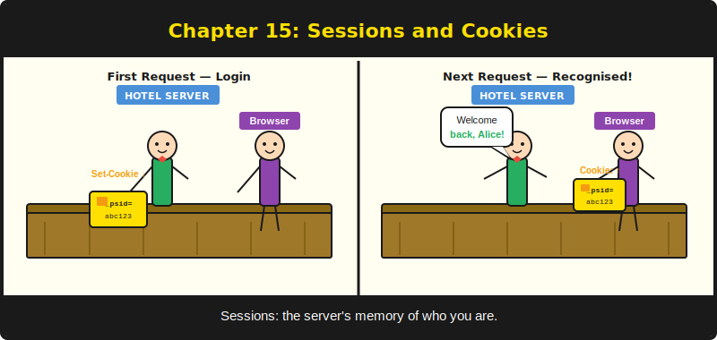
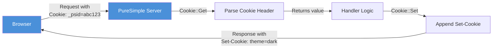
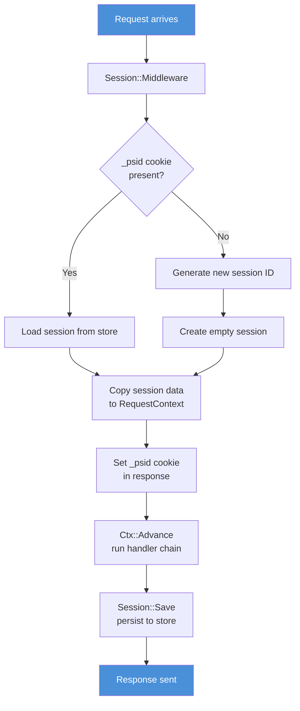

# บทที่ 15: Cookie และ Session



*สอน protocol ที่ไม่มีความจำให้รู้จักว่าคุณเป็นใคร*

---

**วัตถุประสงค์การเรียนรู้**

เมื่ออ่านบทนี้จบ คุณจะสามารถ:

- อ่านและเขียน HTTP cookie ด้วยโมดูล `Cookie`
- จัดการวงจรชีวิตของ session ด้วย middleware `Session`
- เก็บและดึงข้อมูล session ด้วย `Session::Get` และ `Session::Set`
- อธิบาย trade-off ระหว่าง session storage แบบ in-memory และแบบ persistent
- Reset สถานะ session ระหว่าง test suite ด้วย `Session::ClearStore`

---

## 15.1 ปัญหาเรื่องความจำ

HTTP เป็นโรคความจำสั้น ทุก request มาถึงโดยไม่จำ request ก่อนหน้าเลย Server ประมวลผล ส่งการตอบสนอง และลืมว่าการสนทนานั้นเคยเกิดขึ้น นี่คือการออกแบบโดยเจตนา ความไม่มี state ทำให้ HTTP เรียบง่าย ขยายได้ และ cache ได้ และยังทำให้มันไร้ประโยชน์โดยสิ้นเชิงสำหรับสิ่งที่ต้องจำว่าผู้ใช้คือใคร

ลองนึกภาพโรงแรมที่พนักงานต้อนรับเปลี่ยนทุกสามสิบวินาที และไม่มีใครจดอะไรไว้เลย คุณ check in รับห้องพัก เดินไปลิฟต์ กลับมาถามเรื่องอาหารเช้า และคนใหม่ที่เคาน์เตอร์ไม่รู้จักคุณเลย "ขอดูกุญแจห้องได้ไหมครับ?"

กุญแจห้องนั้นคือ cookie ทะเบียนแขกเบื้องหลังเคาน์เตอร์คือ session store ทั้งสองอย่างร่วมกันให้ HTTP มีภาพลวงตาของความจำ

---

## 15.2 Cookie: ฝั่ง Client

Cookie คือข้อมูลชิ้นเล็กที่ server ส่งไปยังเบราว์เซอร์ เบราว์เซอร์เก็บมันและส่งกลับมาพร้อมทุก request ที่ตามมา Server อ่าน cookie จดจำผู้ใช้ และทำงานต่อจากที่ค้างไว้

ใน PureSimple cookie ถูกจัดการโดยโมดูล `Cookie` ซึ่งมีสอง procedure:

```purebasic
; จาก src/Middleware/Cookie.pbi
Cookie::Get(*C, Name.s)   ; → คืนค่า cookie
Cookie::Set(*C, Name.s, Value.s, Path.s = "/", MaxAge.i = 0)
```

### การอ่าน Cookie

`Cookie::Get` แยกวิเคราะห์ header `Cookie` ที่เข้ามาและคืนค่าของ cookie ที่ระบุชื่อ หาก cookie ไม่มีอยู่ จะคืนสตริงว่าง

```purebasic
; ตัวอย่างที่ 15.1 -- การอ่านค่า cookie
Procedure PreferenceHandler(*C.RequestContext)
  Protected theme.s = Cookie::Get(*C, "theme")
  If theme = ""
    theme = "light"   ; ← ค่า default
  EndIf
  ; ... render หน้าพร้อม theme preference ...
EndProcedure
```

> **ภายใต้ฝาครอบ:** เบราว์เซอร์ส่ง cookie ใน header `Cookie` เดียวเป็น pair ที่คั่นด้วย semicolon: `name1=value1; name2=value2; name3=value3` procedure `Cookie::Get` แยก string นี้โดยใช้ `StringField` กับ `";"` เป็น delimiter ตัดช่องว่างจาก pair แต่ละคู่ และดึงค่าหลัง `=` มันเป็นการสแกนแบบ linear O(n) โดย n คือจำนวน cookie สำหรับแอปพลิเคชันเว็บทั่วไปที่มี cookie สามถึงห้าตัว นี่รวดเร็วมาก

### การเขียน Cookie

`Cookie::Set` เพิ่ม directive `Set-Cookie` เข้าในการตอบสนอง เบราว์เซอร์รับมันและเก็บ cookie สำหรับ request ถัดไป

```purebasic
; ตัวอย่างที่ 15.2 -- การตั้งค่า cookie พร้อม path และ max-age
Procedure SetThemeHandler(*C.RequestContext)
  Protected theme.s = Binding::Query(*C, "theme")
  If theme = "dark" Or theme = "light"
    Cookie::Set(*C, "theme", theme, "/", 86400 * 30)
    ; 86400 * 30 = 30 วันในหน่วยวินาที
  EndIf
  Rendering::Redirect(*C, "/", 302)
EndProcedure
```

parameter ของ `Cookie::Set`:

| Parameter | ชนิด | จุดประสงค์ |
|-----------|------|------------|
| `*C` | `*RequestContext` | context ของ request ปัจจุบัน |
| `Name` | `.s` | ชื่อ cookie |
| `Value` | `.s` | ค่า cookie |
| `Path` | `.s` | ขอบเขต URL path (ค่าเริ่มต้น `"/"` = ทั้งเว็บไซต์) |
| `MaxAge` | `.i` | อายุในหน่วยวินาที (0 = session cookie) |

`MaxAge` เป็นศูนย์หมายความว่า cookie หมดอายุเมื่อเบราว์เซอร์ปิด ค่าบวกกำหนดอายุที่ชัดเจน ไม่มีวิธีตั้งค่า max-age เป็นลบ หากต้องการลบ cookie ให้ตั้งค่าเป็นสตริงว่างและ max-age เป็น 1 (หนึ่งวินาทีในอดีต หมดอายุทันที)

Cookie หลายตัวถูกสะสมไว้ในฟิลด์ `*C\SetCookies` โดยคั่นด้วย `Chr(10)` PureSimpleHTTPServer แยก field นี้และส่งแต่ละ cookie เป็น header `Set-Cookie` แยกในการตอบสนอง

> **คำเตือน:** Cookie ถูกส่งเป็น plain text กับทุก request ห้ามเก็บข้อมูลสำคัญโดยตรงใน cookie เก็บ session ID แทน และเก็บข้อมูลจริงไว้บน server


*รูปที่ 15.1 -- กระบวนการอ่าน/เขียน cookie: เบราว์เซอร์ส่ง cookie มาพร้อมทุก request; server อ่านและอาจตั้งค่า cookie ใหม่ในการตอบสนอง*

---

## 15.3 Session: ฝั่ง Server

Cookie บอกว่า *ใคร* กำลังส่ง request Session บอกว่าคุณ *รู้อะไร* เกี่ยวกับพวกเขา Session คือ key-value store บน server ที่ index ด้วย session ID ที่ไม่ซ้ำกัน Session ID ถูกเก็บไว้ใน cookie เบราว์เซอร์ส่ง session ID cookie มาพร้อมทุก request Server ค้นหาข้อมูล session ที่สอดคล้องกันและทำให้ handler ใช้ได้

ระบบ session ของ PureSimple ใช้สามส่วนประกอบที่ทำงานร่วมกัน:

1. **โมดูล `Cookie`** -- อ่านและเขียน session ID cookie (`_psid`)
2. **โมดูล `Session`** -- จัดการ in-memory session store และให้ `Get`/`Set`/`Save`
3. **`Session::Middleware`** -- ห่อหุ้ม handler chain เพื่อโหลดข้อมูล session ก่อน handler รัน และบันทึกหลัง handler คืน


*รูปที่ 15.2 -- วงจรชีวิต session: middleware โหลดหรือสร้าง session ก่อน handler รัน แล้วบันทึกหลัง handler คืน*

### การเปิดใช้งาน Session

Session ต้องการ session middleware ลงทะเบียนก่อน handler ใดๆ ที่ต้องการเข้าถึง session:

```purebasic
; ตัวอย่างที่ 15.3 -- การเปิดใช้งาน session middleware
Engine::Use(@Session_Middleware())

Procedure Session_Middleware(*C.RequestContext)
  Session::Middleware(*C)
EndProcedure
```

procedure wrapper บางๆ นี้มีอยู่เพราะ operator `@` ของ PureBasic ต้องการ procedure ใน scope ปัจจุบัน คุณไม่สามารถส่ง `@Session::Middleware()` ข้าม module boundary โดยตรง

เมื่อ middleware ลงทะเบียนแล้ว ทุก request จะได้รับ session ผู้เยี่ยมชมใหม่จะได้รับ session ID ใหม่ ผู้เยี่ยมชมที่กลับมาจะมี session เดิมโหลดจาก store

### การอ่านและเขียนข้อมูล Session

ภายใน handler ใดๆ ที่รันหลัง session middleware คุณอ่านและเขียนค่า session ได้:

```purebasic
; ตัวอย่างที่ 15.4 -- การใช้ Session::Get และ Session::Set
Procedure DashboardHandler(*C.RequestContext)
  Protected userId.s = Session::Get(*C, "user_id")
  If userId = ""
    Rendering::Redirect(*C, "/login", 302)
    ProcedureReturn
  EndIf

  Protected visits.s = Session::Get(*C, "visit_count")
  Protected count.i = Val(visits) + 1
  Session::Set(*C, "visit_count", Str(count))

  ; ... render dashboard ...
EndProcedure
```

`Session::Get` คืนค่าที่เชื่อมโยงกับ key หรือสตริงว่างหาก key ไม่มี `Session::Set` เขียน key-value pair เข้าสู่ session ค่าเป็น string หากต้องการเก็บตัวเลข แปลงด้วย `Str()` และ `Val()`

> **ข้อควรระวัง PureBasic:** session module ใช้ตัวแปรชื่อ `sessData` เพื่อเก็บ session string ดิบ นี่ไม่ใช่อุบัติเหตุ `Data` เป็น keyword ที่จองไว้ใน PureBasic (ใช้ประกาศส่วนข้อมูลแบบ inline) หากคุณตั้งชื่อตัวแปรว่า `data` คอมไพเลอร์จะให้ error ที่ดูลึกลับเกี่ยวกับ token ที่ไม่คาดคิด framework เรียนรู้สิ่งนี้มาอย่างยากลำบากเพื่อคุณจะได้ไม่ต้องเจอ

### Session ID

Session ID เป็นสตริงเลขฐานสิบหกขนาด 32 ตัวอักษร สร้างโดยการต่อเลขจำนวนเต็ม 32-bit แบบสุ่มสี่ตัว:

```purebasic
; จาก src/Middleware/Session.pbi -- _GenerateID
Procedure.s _GenerateID()
  Protected i.i, id.s = ""
  For i = 1 To 4
    id + RSet(Hex(Random($FFFFFFFF)), 8, "0")
  Next i
  ProcedureReturn id
EndProcedure
```

สิ่งนี้สร้างความสุ่ม 128 bit ซึ่งเพียงพอสำหรับการระบุ session การเรียก `RSet` เติม hex segment แต่ละส่วนให้ได้ 8 ตัวอักษรด้วยศูนย์นำหน้า ทำให้ ID มีความยาว 32 ตัวอักษรพอดีเสมอ ID จะหน้าตาแบบนี้: `A3F0B12C00000042DEADBEEF01234567`

คุณดึง session ID ปัจจุบันได้ด้วย `Session::ID(*C)`:

```purebasic
; ตัวอย่างที่ 15.5 -- การดึง session ID ปัจจุบัน
Procedure DebugHandler(*C.RequestContext)
  Protected sid.s = Session::ID(*C)
  PrintN("Session: " + sid)
EndProcedure
```

### กลไกการเก็บ Session

Session ถูกเก็บใน map ของ PureBasic แบบ global: `NewMap _Store.s()` โดย map key คือ session ID และค่า map คือสตริงที่บรรจุ key-value pair ทั้งหมด

รูปแบบการบรรจุใช้ `Chr(9)` (tab) เป็น delimiter ระหว่าง key (และระหว่าง value) และใช้ `Chr(1)` (SOH) เป็นตัวคั่นระหว่าง keys string และ values string:

```
key1<TAB>key2<TAB>key3<TAB><SOH>val1<TAB>val2<TAB>val3<TAB>
```

เมื่อ middleware โหลด session มันแยก string ที่เก็บไว้ที่ `Chr(1)` และคัดลอก key และ value เข้าสู่ `*C\SessionKeys` และ `*C\SessionVals` เมื่อ handler เรียก `Session::Set` key และ value จะถูกต่อท้าย (พร้อม tab ตามหลัง) เมื่อ middleware บันทึก session หลัง handler chain คืน มันต่อ key และ value กลับเป็น string เดียวพร้อม `Chr(1)` คั่นระหว่างกัน

procedure `Get` ใช้กลยุทธ์ "ค่าสุดท้ายชนะ": มันสแกน key ทั้งหมดและคืนค่าจาก key ที่ตรงกันตัวสุดท้าย ซึ่งหมายความว่าการเรียก `Set` หลายครั้งสำหรับ key เดียวกันภายใน request เดียวทำงานถูกต้อง ค่าล่าสุดบดบังค่าก่อนหน้า

> **ภายใต้ฝาครอบ:** วิธีการ parallel list แบบ tab-delimited นั้นไม่ธรรมดา การ implement session ส่วนใหญ่ใช้ map หรือ dictionary PureSimple ใช้ parallel string เพราะ struct `RequestContext` มีขนาดคงที่ มันไม่สามารถเก็บ map ขนาดไดนามิกได้ ประสิทธิภาพเพียงพอสำหรับ session ที่มี key น้อยกว่าห้าสิบ หากSession ของคุณเติบโตเกินนั้น คุณอาจเก็บข้อมูลมากเกินไปใน session

### Auto-Save

คุณไม่จำเป็นต้องเรียก `Session::Save` ด้วยตนเอง session middleware เรียกมันโดยอัตโนมัติหลัง handler chain คืน:

```purebasic
; จาก src/Middleware/Session.pbi -- Middleware
Procedure Middleware(*C.RequestContext)
  ; ... โหลด/สร้าง session ...
  Ctx::Advance(*C)        ; ← รัน handler chain
  Save(*C)                ; ← auto-save หลัง chain คืน
EndProcedure
```

นี่คือโมเดล onion ในการทำงาน middleware ห่อหุ้ม handler chain ทุกอย่างก่อน `Ctx::Advance` คือ pre-processing (โหลด session) ทุกอย่างหลัง `Ctx::Advance` คือ post-processing (บันทึก session) handler ตรงกลางอ่านและเขียนข้อมูล session โดยไม่ต้องกังวลเรื่องการ persist

---

## 15.4 Trade-off ของ Session Storage

การ implement ปัจจุบันเก็บ session ในหน่วยความจำ ซึ่งมีผลสำคัญ:

| ด้าน | In-Memory (ปัจจุบัน) | Persistent (SQLite-backed) |
|------|---------------------|---------------------------|
| ความเร็ว | น้อยกว่าไมโครวินาที | มิลลิวินาทีต่อการอ่าน/เขียน |
| ความทนทาน | หายเมื่อ restart | รอดจาก restart |
| Scalability | จำกัดด้วย RAM | จำกัดด้วยดิสก์ |
| ความซับซ้อน | ศูนย์ | ต้องการ migration + cleanup |

สำหรับการพัฒนาและ deployment ขนาดเล็ก session แบบ in-memory เหมาะสมมาก แอปพลิเคชันเริ่มต้น ผู้ใช้ login และ session ทำงาน หากแอปพลิเคชัน restart ผู้ใช้ทั้งหมดต้อง login ใหม่ สำหรับบล็อกที่มี admin คนเดียว นี่เป็นเพียงความไม่สะดวกเล็กน้อย

สำหรับ production deployment ที่มีผู้ใช้จำนวนมาก คุณจะขยาย session store เพื่อ persist session ลงใน SQLite procedure `Session::Save` จะเขียนลงตาราง database แทนที่ (หรือเพิ่มจาก) global map ขั้นตอนการโหลดของ `Session::Middleware` จะอ่านจาก database API สำหรับ handler จะไม่เปลี่ยนแปลงเลย `Session::Get` และ `Session::Set` จะยังคงทำงานเหมือนเดิม

> **คำเตือน:** Session แบบ in-memory หายไปเมื่อ process restart สำหรับการพัฒนานี่ไม่เป็นไร แต่ในมุมมอง production คิดไว้ว่าทุก deployment ผ่าน `deploy.sh` จะ restart process และ logout ผู้ใช้ทั้งหมด หากแอปพลิเคชันของคุณมีความต้องการ session ผู้ใช้แบบ persistent ให้ขยาย session store เพื่อใช้ SQLite

---

## 15.5 การล้าง Session สำหรับการทดสอบ

ระหว่าง test suite ให้เรียก `Session::ClearStore()` เพื่อลบ session ทั้งหมด:

```purebasic
; ตัวอย่างที่ 15.6 -- การล้างสถานะ session ระหว่างการทดสอบ
BeginSuite("Session Tests")

; ... รัน session tests ...

Session::ClearStore()

BeginSuite("Auth Tests")
; ... session จาก test suite ก่อนหน้าจะไม่รั่วไหลมา ...
```

นี่คือรูปแบบ test isolation จากบทที่ 14 ที่นำมาใช้กับ session หากไม่ทำเช่นนี้ session ID ที่สร้างใน test suite หนึ่งอาจยังคงอยู่และรบกวน assertion ใน test suite อื่น

---

## สรุป

HTTP ไม่มี state แต่ cookie และ session ให้ความจำแก่มัน โมดูล `Cookie` อ่าน incoming cookie จาก header `Cookie` และเขียน outgoing cookie ผ่าน directive `Set-Cookie` โมดูล `Session` สร้างบน cookie เพื่อให้ server-side key-value store ที่ index ด้วย session ID แบบสุ่ม session middleware จัดการวงจรชีวิตทั้งหมดโดยอัตโนมัติ: โหลดหรือสร้าง session ก่อน handler รัน และบันทึกหลัง handler คืน ข้อมูล session ถูกเก็บในหน่วยความจำ ซึ่งเร็วแต่ไม่ทนทานข้าม restart

---

**ประเด็นสำคัญ**

- Cookie นำ session ID ไป; session นำข้อมูล ห้ามเก็บข้อมูลสำคัญโดยตรงใน cookie
- session middleware จัดการการโหลดและบันทึกโดยอัตโนมัติ handler แค่เรียก `Session::Get` และ `Session::Set`
- Session แบบ in-memory เร็วและง่ายแต่หายเมื่อ process restart วางแผนสำหรับ production deployment ตามความเหมาะสม

---

**คำถามทบทวน**

1. `_psid` cookie มีจุดประสงค์อะไร และเกิดอะไรขึ้นเมื่อผู้เยี่ยมชมใหม่มาโดยไม่มี cookie นั้น?

2. อธิบายกลยุทธ์ "ค่าสุดท้ายชนะ" ที่ `Session::Get` ใช้ ทำไมวิธีนี้จึงทำงานถูกต้องแม้เมื่อ `Session::Set` ถูกเรียกหลายครั้งด้วย key เดียวกัน?

3. *ลองทำ:* ลงทะเบียน session middleware เขียน handler ที่เพิ่มตัวแปร session `visit_count` ในแต่ละ request และตรวจสอบว่าตัวนับเพิ่มขึ้นใน request หลายๆ ครั้งโดยใช้ `curl` พร้อม cookie jar (`curl -b cookies.txt -c cookies.txt`)
