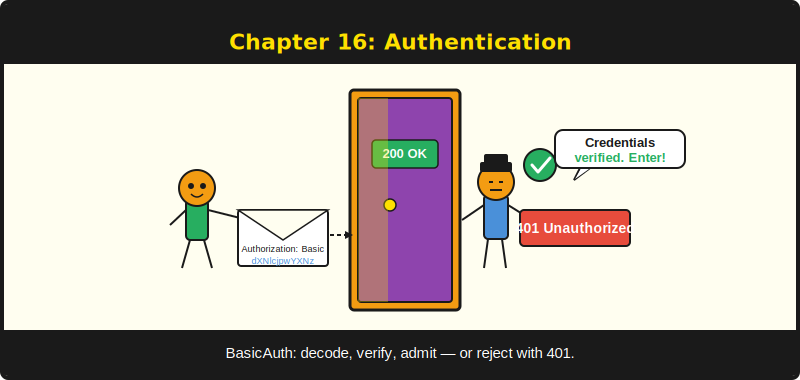
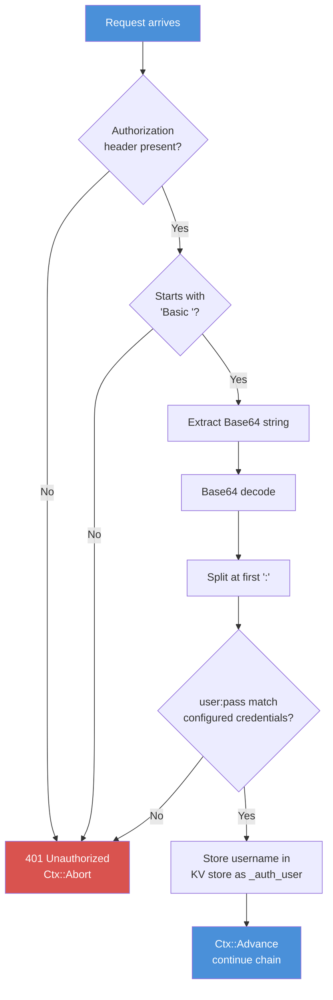

# บทที่ 16: Authentication



*ตรวจสอบว่าคนที่ยืนอยู่หน้าประตูเป็นคนที่อ้างตัวจริงหรือไม่*

---

**วัตถุประสงค์การเรียนรู้**

เมื่ออ่านบทนี้จบ คุณจะสามารถ:

- ใช้ HTTP Basic Authentication ด้วยโมดูล `BasicAuth`
- อธิบายกลไกการ encode credential ด้วย Base64 (และทำไมมันไม่ใช่การเข้ารหัส)
- Hash รหัสผ่านด้วย `Fingerprint` และ SHA-256 ของ PureBasic
- สร้าง login และ logout flow แบบ session-based
- กำหนดขอบเขต authentication ให้กับ route group เฉพาะ

---

## 16.1 Authentication กับ Authorisation

ก่อนเขียนโค้ดใดๆ ขอชี้แจงสองคำที่นักพัฒนามักสับสน บางครั้งด้วยผลที่ตามมาราคาแพง

**Authentication** ตอบคำถาม "คุณเป็นใคร?" มันตรวจสอบตัวตน ผ่าน username และ password ลายนิ้วมือ หรือบัตรที่เคาน์เตอร์ต้อนรับ

**Authorisation** ตอบคำถาม "คุณได้รับอนุญาตให้ทำอะไร?" มันควบคุมการเข้าถึง admin ลบโพสต์ได้ ผู้ใช้ทั่วไปอ่านได้อย่างเดียว แขกเห็นได้เฉพาะหน้าสาธารณะ

บทนี้ครอบคลุม authentication Authorisation จัดการด้วย route group ที่มี middleware แบบ scoped (บทที่ 10) และการตรวจสอบค่า session ภายใน handler ทำ authentication ให้ถูกต้องก่อน หากคุณไม่รู้ว่า *ใคร* เป็นใคร คุณก็ตัดสินใจไม่ได้ว่าพวกเขาทำอะไรได้บ้าง

---

## 16.2 HTTP Basic Authentication

Basic Auth เป็นกลไก authentication ที่ง่ายที่สุดใน HTTP เบราว์เซอร์ส่ง username และ password ที่ encode ใน header `Authorization` Server decode และตรวจสอบกับ credential ที่รู้จัก ถ้าตรงกัน request ดำเนินต่อ ถ้าไม่ server ตอบกลับด้วย `401 Unauthorized`

มันง่าย ไม่มี state และรองรับกว้างขวาง และยังไม่ปลอดภัยอย่างสมบูรณ์โดยไม่มี TLS เพราะ credential เป็นเพียงการ encode ด้วย Base64 ไม่ใช่การเข้ารหัส Base64 คือการ encoding ไม่ใช่ encryption ใครก็ตามที่ดักข้อมูลเครือข่ายสามารถ decode credential ได้ภายในสามวินาที เมื่อใช้กับ TLS (ซึ่ง Caddy ให้มาโดยอัตโนมัติ) Basic Auth เหมาะสมอย่างยิ่งสำหรับ admin panel และ internal tool

ผมเคยได้ยินนักพัฒนาพูดว่า "เราไม่จำเป็นต้องใช้ HTTPS สำหรับ internal tool" นักพัฒนาเหล่านั้นยังไม่เคยเจอเพื่อนร่วมงานที่อยากรู้ที่ถือ Wireshark

### กลไกการทำงาน


*รูปที่ 16.1 -- pipeline การ decode ของ BasicAuth: middleware ตรวจสอบ credential ห้าขั้นตอนก่อนอนุญาตให้ request ดำเนินต่อ*

### การตั้งค่า Basic Auth

โมดูล `BasicAuth` มีสอง procedure: `SetCredentials` เพื่อกำหนด username และ password ที่คาดหวัง และ `Middleware` เพื่อบังคับใช้

```purebasic
; ตัวอย่างที่ 16.1 -- การกำหนดค่าและใช้งาน BasicAuth
EnableExplicit

XIncludeFile "../../src/PureSimple.pb"

BasicAuth::SetCredentials("admin", "s3cret-passw0rd")

; ปกป้อง admin group
Procedure AdminAuthMW(*C.RequestContext)
  BasicAuth::Middleware(*C)
EndProcedure

; ... ใน route setup:
; adminGroup = Group::Init("/admin")
; Group::Use(adminGroup, @AdminAuthMW())
```

เมื่อ request มาถึง route ที่ปกป้องด้วย BasicAuth middleware middleware จะอ่าน header `Authorization` จาก `*C\Authorization` หาก header ขาดหายหรือไม่ขึ้นต้นด้วย `"Basic "` middleware เรียก `Ctx::AbortWithError(*C, 401, "Unauthorized")` และคืน handler ไม่รันเลย

หาก header มีอยู่ middleware ดึงส่วน Base64 ออกมา decode มัน แยกผลลัพธ์ที่ colon ตัวแรกเพื่อได้ username และ password และเปรียบเทียบกับ credential ที่กำหนดไว้:

```purebasic
; จาก src/Middleware/BasicAuth.pbi -- การตรวจสอบ credential
Protected encoded.s  = Mid(auth, 7)
Protected bufSize.i  = Len(encoded) + 4
Protected *buf       = AllocateMemory(bufSize)
; (การตรวจสอบ null pointer ละเว้นเพื่อความกระชับ — ดูได้ที่ src/Middleware/BasicAuth.pbi)

Protected decodedLen.i  = Base64Decoder(encoded,
                                         *buf, bufSize)
Protected credentials.s = PeekS(*buf, decodedLen,
                                 #PB_Ascii)
FreeMemory(*buf)

Protected colon.i = FindString(credentials, ":")
Protected user.s = Left(credentials, colon - 1)
Protected pass.s = Mid(credentials, colon + 1)

If user <> _User Or pass <> _Pass
  Ctx::AbortWithError(*C, 401, "Unauthorized")
  ProcedureReturn
EndIf
```

การ decode ใช้ `Base64Decoder` ของ PureBasic ซึ่งเขียน raw byte เข้า buffer `PeekS` แปลง byte เหล่านั้นเป็น PureBasic string โดยใช้ ASCII encoding สิ่งนี้สำคัญ credential ของ HTTP Basic Auth เป็น ASCII ตามข้อตกลง Unicode username ใน Basic Auth คือ "implementation-defined" ต่างกันในเบราว์เซอร์ต่างๆ และควรหลีกเลี่ยง

> **ภายใต้ฝาครอบ:** middleware จอง `Len(encoded) + 4` byte สำหรับ decode buffer ส่วน `+ 4` ให้ margin ความปลอดภัย เพราะ Base64 decoding สร้างได้มากที่สุด `ceil(len * 3 / 4)` byte สำหรับ credential ทั่วไป (น้อยกว่า 100 ตัวอักษร) การจองและคืนหน่วยความจำนี้ใช้เวลาระดับ nanosecond buffer ถูก free ทันทีหลังใช้ด้วย `FreeMemory(*buf)` ไม่มี memory leak

### การเข้าถึง Authenticated User

เมื่อ authentication สำเร็จ middleware เก็บ username ใน KV store ของ context ภายใต้ key `"_auth_user"`:

```purebasic
; จาก src/Middleware/BasicAuth.pbi
Ctx::Set(*C, "_auth_user", user)
Ctx::Advance(*C)
```

Handler ที่อยู่ถัดไปสามารถดึงมาใช้ได้:

```purebasic
; ตัวอย่างที่ 16.2 -- การอ่าน authenticated username
Procedure AdminDashboard(*C.RequestContext)
  Protected username.s = Ctx::Get(*C, "_auth_user")
  PrintN("Admin: " + username)
  ; ... render admin dashboard ...
EndProcedure
```

นี่คือรูปแบบการสื่อสารมาตรฐานระหว่าง middleware กับ handler: middleware ตรวจสอบ เก็บ context และ advance handler อ่าน context และดำเนินการ

---

## 16.3 Token-Based Authentication

Basic Auth ทำงานได้ดีสำหรับ admin panel ที่ใช้เบราว์เซอร์ แต่ API client เช่น script, mobile app, หรือ server อื่น ต้องการวิธีที่ต่างออกไป Token-based authentication ให้ client ส่ง token ที่แชร์ล่วงหน้าใน header `Authorization` แทน username และ password Server ตรวจสอบ token และระบุผู้เรียกโดยไม่ต้องการ login แบบโต้ตอบ

รูปแบบนั้นตรงไปตรงมา client ส่ง request พร้อม header `Authorization: Bearer <token>` middleware ตรวจสอบ header นี้ ดึง token ออกมา และตรวจสอบกับค่าที่เก็บไว้ ถ้า token ตรงกัน middleware เก็บ authenticated user ใน context KV store และ advance ถ้าไม่ มัน abort ด้วยการตอบสนอง 401

```purebasic
; ตัวอย่างที่ 16.3 -- Token-based auth middleware
Procedure BearerAuthMW(*C.RequestContext)
  Protected auth.s = *C\Authorization
  If Left(auth, 7) <> "Bearer "
    Ctx::AbortWithError(*C, 401, "Unauthorized")
    ProcedureReturn
  EndIf

  Protected token.s = Mid(auth, 8)
  Protected username.s = ValidateToken(token)
  If username = ""
    Ctx::AbortWithError(*C, 401, "Invalid token")
    ProcedureReturn
  EndIf

  Ctx::Set(*C, "_auth_user", username)
  Ctx::Advance(*C)
EndProcedure
```

procedure `ValidateToken` เป็นสิ่งที่เฉพาะกับแอปพลิเคชัน ในกรณีที่ง่ายที่สุดมันเปรียบเทียบ token กับค่าจาก configuration `.env` ของคุณ ในระบบที่ซับซ้อนกว่า มันค้นหา token ในตาราง database ที่ map token ไปยัง user ทางใดก็ตาม middleware ตาม validate-store-advance pattern เดียวกับ BasicAuth

Token-based auth เหมาะเมื่อ client เป็นโปรแกรม ไม่ใช่มนุษย์ที่ใช้เบราว์เซอร์ CI/CD pipeline, mobile app และ microservice-to-microservice call ล้วนได้ประโยชน์จาก token สำหรับแอปพลิเคชันที่ใช้เบราว์เซอร์ที่ผู้ใช้ login ผ่านฟอร์ม session-based auth (ครอบคลุมใน section 16.5) มักเหมาะสมกว่า เบราว์เซอร์จัดการ cookie โดยอัตโนมัติในขณะที่ token ต้องการการจัดการ header ใน JavaScript อย่างชัดเจน

---

## 16.4 การ Hash รหัสผ่าน

โมดูล `BasicAuth` เก็บ credential ในหน่วยความจำเป็น plain text string นี่ยอมรับได้สำหรับ admin panel ง่ายๆ ที่รหัสผ่านถูกตั้งในโค้ดและแอปพลิเคชันรันในสภาพแวดล้อมที่เชื่อถือได้ สำหรับ authentication ที่ผู้ใช้ทั่วไปใช้งานพร้อมรหัสผ่านที่เก็บในฐานข้อมูล คุณต้องทำการ hash

การเก็บรหัสผ่านเป็น plaintext เทียบเท่ากับการวางกุญแจบ้านไว้ใต้พรมหน้าประตู ยกเว้นว่าพรมนั้นกำลังไหม้และมองเห็นได้จากอวกาศ

การเก็บรหัสผ่านเป็น plaintext ไม่ใช่ "ความเสี่ยงเล็กน้อย" มันคือความประมาทในเชิงวิชาชีพ เมื่อ (ไม่ใช่ถ้า) ฐานข้อมูลของคุณรั่วไหล รหัสผ่านของทุกผู้ใช้ถูกเปิดเผย เนื่องจากคนส่วนใหญ่ใช้รหัสผ่านซ้ำ คุณไม่ได้แค่ compromise แอปพลิเคชันของคุณ แต่ compromise email, banking และทุกอย่างอื่นของพวกเขา

PureBasic มี `Fingerprint` สำหรับการ hash ประกอบกับ SHA-256 ทำให้ได้ hash แบบ one-way ที่เก็บได้อย่างปลอดภัย:

```purebasic
; ตัวอย่างที่ 16.4 -- การ hash รหัสผ่านด้วย SHA-256
EnableExplicit

UseSHA2Fingerprint()

Procedure.s HashPassword(password.s)
  ProcedureReturn Fingerprint(@password,
    StringByteLength(password), #PB_Cipher_SHA2,
    256)
EndProcedure

; การสร้าง user พร้อมรหัสผ่านที่ hash แล้ว
Define hash.s = HashPassword("my-secret-password")
; hash = "5E884898DA280471..."
; เก็บ `hash` ในฐานข้อมูล ไม่ใช่ plaintext
```

เพื่อตรวจสอบการ login ให้ hash รหัสผ่านที่ส่งมาและเปรียบเทียบกับ hash ที่เก็บไว้:

```purebasic
; ตัวอย่างที่ 16.5 -- การตรวจสอบรหัสผ่านกับ hash ที่เก็บไว้
Procedure.i VerifyPassword(submitted.s,
                           storedHash.s)
  Protected hash.s = HashPassword(submitted)
  ProcedureReturn Bool(hash = storedHash)
EndProcedure
```

> **คำเตือน:** SHA-256 เป็น fast hash สำหรับการเก็บรหัสผ่านใน production การใช้ slow hash เช่น bcrypt หรือ Argon2 ดีกว่า เพราะต้านทานการโจมตีแบบ brute-force ได้ PureBasic ไม่รวม bcrypt ในตัว แต่ SHA-256 พร้อม per-user salt ดีขึ้นอย่างมากเมื่อเทียบกับ plaintext

เพื่อเพิ่ม salt (สตริงสุ่มที่ต่อหน้ารหัสผ่านก่อน hash) ให้สร้างสตริงสุ่มเมื่อผู้ใช้ register เก็บมันคู่กับ hash และต่อมันก่อน hash:

```purebasic
; ตัวอย่างที่ 16.6 -- Salted password hashing
Procedure.s GenerateSalt()
  Protected i.i, salt.s = ""
  For i = 1 To 4
    salt + RSet(Hex(Random($FFFFFFFF)), 8, "0")
  Next i
  ProcedureReturn salt
EndProcedure

Procedure.s HashWithSalt(password.s, salt.s)
  Protected combined.s = salt + password
  ProcedureReturn Fingerprint(@combined,
    StringByteLength(combined), #PB_Cipher_SHA2,
    256)
EndProcedure
```

เก็บทั้ง salt และ hash ในฐานข้อมูล เมื่อตรวจสอบ ให้ดึง salt ออกมา ต่อมันกับรหัสผ่านที่ส่งมา hash ผลลัพธ์ และเปรียบเทียบ Salt รับประกันว่าผู้ใช้สองคนที่มีรหัสผ่านเดียวกันจะสร้าง hash ที่ต่างกัน

---

## 16.5 Session-Based Login Flow

Basic Auth ให้เบราว์เซอร์แสดง dialog login แบบ native สิ่งนี้ทำงานได้สำหรับ admin panel แต่สำหรับแอปพลิเคชันที่เปิดสาธารณะ คุณต้องการหน้า login ที่เหมาะสมพร้อมฟอร์ม Session-based authentication รวม HTML form การตรวจสอบรหัสผ่าน และ session เข้าด้วยกัน

flow ทำงานดังนี้:

1. ผู้ใช้เยี่ยมชม `/login` -- handler render ฟอร์ม login
2. ผู้ใช้ส่ง username และ password ผ่าน POST
3. Handler ตรวจสอบ credential (hash รหัสผ่านที่ส่งมา เปรียบเทียบกับ hash ที่เก็บ)
4. ถ้าถูกต้อง: เก็บ user ID ใน session, redirect ไป dashboard
5. ถ้าไม่ถูกต้อง: render ฟอร์ม login อีกครั้งพร้อมข้อความ error
6. ใน request ถัดไป: session middleware โหลด session; handler ตรวจสอบ `user_id` ใน session
7. เมื่อ logout: ล้างข้อมูล session และ redirect ไปหน้า login

```purebasic
; ตัวอย่างที่ 16.7 -- Login handler พร้อม session authentication
Procedure LoginPageHandler(*C.RequestContext)
  ; Render ฟอร์ม login (GET /login)
  Rendering::Render(*C, "login.html", 200)
EndProcedure

Procedure LoginSubmitHandler(*C.RequestContext)
  ; ประมวลผลฟอร์ม login (POST /login)
  Protected username.s = Binding::PostForm(*C,
                                            "username")
  Protected password.s = Binding::PostForm(*C,
                                            "password")

  ; ค้นหา user ในฐานข้อมูล
  Protected storedHash.s = ""
  Protected userId.s = ""
  DB::BindStr(db, 0, username)
  If DB::Query(db, "SELECT id, password_hash " +
                    "FROM users WHERE username = ?")
    If DB::NextRow(db)
      userId     = Str(DB::GetInt(db, 0))
      storedHash = DB::GetStr(db, 1)
    EndIf
    DB::Done(db)
  EndIf

  ; ตรวจสอบรหัสผ่าน
  If userId <> "" And VerifyPassword(password,
                                      storedHash)
    Session::Set(*C, "user_id", userId)
    Session::Set(*C, "username", username)
    Rendering::Redirect(*C, "/dashboard", 302)
  Else
    Ctx::Set(*C, "error", "Invalid credentials")
    Rendering::Render(*C, "login.html", 401)
  EndIf
EndProcedure

Procedure LogoutHandler(*C.RequestContext)
  ; ล้างข้อมูล session (POST /logout)
  Session::Set(*C, "user_id", "")
  Session::Set(*C, "username", "")
  Rendering::Redirect(*C, "/login", 302)
EndProcedure
```

logout handler คือ procedure ที่สั้นที่สุดในแอปพลิเคชันเว็บใดๆ มันทำสิ่งเดียว ทำได้ดี และไม่เคยโต้เถียง

session middleware (จากบทที่ 15) จัดการการโหลดและบันทึก session โดยอัตโนมัติ login handler เพียงเขียนลง session dashboard handler ตรวจสอบ session:

```purebasic
; ตัวอย่างที่ 16.8 -- การตรวจสอบ authentication ใน handler
Procedure DashboardHandler(*C.RequestContext)
  Protected userId.s = Session::Get(*C, "user_id")
  If userId = ""
    Rendering::Redirect(*C, "/login", 302)
    ProcedureReturn
  EndIf

  ; ผู้ใช้ผ่านการ authenticate แล้ว -- render dashboard
  Protected username.s = Session::Get(*C, "username")
  Ctx::Set(*C, "username", username)
  Rendering::Render(*C, "dashboard.html", 200)
EndProcedure
```

> **เปรียบเทียบ:** flow นี้เหมือนกับกลไก authentication ใน Express.js กับ Passport, Flask กับ Flask-Login หรือ Go กับ Gorilla Sessions session เก็บ user ID ทุก request ตรวจสอบ session login handler เขียนลง session logout handler ล้างมัน รูปแบบนี้สากล เพราะปัญหาก็สากล

---

## 16.6 Scoped Authentication ด้วย Route Group

ไม่ใช่ทุก route ที่ต้องการ authentication หน้าสาธารณะ หน้า login เอง และ endpoint สำหรับ health check ควรเข้าถึงได้โดยไม่ต้องมี credential Route group ของ PureSimple ให้คุณกำหนดขอบเขต authentication middleware ให้กับ URL prefix เฉพาะได้

```purebasic
; ตัวอย่างที่ 16.9 -- การจำกัด BasicAuth ให้ admin group
; Public route -- ไม่ต้องการ auth
Engine::GET("/", @IndexHandler())
Engine::GET("/post/:slug", @PostHandler())
Engine::GET("/health", @HealthHandler())

; Admin route -- ต้องการ BasicAuth
BasicAuth::SetCredentials("admin", "s3cret")

Procedure AdminAuthMW(*C.RequestContext)
  BasicAuth::Middleware(*C)
EndProcedure

Define admin.i = Group::Init("/admin")
Group::Use(admin, @AdminAuthMW())
Group::GET(admin, "/", @AdminDashboard())
Group::GET(admin, "/posts", @AdminPostList())
Group::POST(admin, "/posts", @AdminPostCreate())
```

`AdminAuthMW` wrapper รันเฉพาะสำหรับ route ภายใต้ `/admin` request ไปที่ `/` หรือ `/post/hello` ผ่านโดยไม่มีการตรวจสอบ authentication ใดๆ request ไปที่ `/admin/posts` จะเรียก Basic Auth prompt

สำหรับ session-based auth คุณเขียน middleware ที่คล้ายกันซึ่งตรวจสอบค่า session:

```purebasic
; ตัวอย่างที่ 16.10 -- Session-based auth middleware
Procedure RequireLoginMW(*C.RequestContext)
  Protected userId.s = Session::Get(*C, "user_id")
  If userId = ""
    Rendering::Redirect(*C, "/login", 302)
    Ctx::Abort(*C)
    ProcedureReturn
  EndIf
  Ctx::Advance(*C)
EndProcedure
```

ลงทะเบียน middleware นี้ในทุก group ที่ต้องการ login ผู้ใช้ที่ไม่ผ่านการ authenticate จะถูก redirect ไปหน้า login ผู้ใช้ที่ผ่านการ authenticate ดำเนินไปยัง handler middleware ไม่รู้หรือสนใจว่า handler ใดจะรัน มันตรวจสอบเพียงว่า session ที่ถูกต้องมีอยู่

นี่คือความสวยงามของ middleware pattern Authentication เป็น cross-cutting concern คุณกำหนดมันครั้งเดียวและนำไปใช้กับ group ทุก route ใน group นั้นได้รับการปกป้อง ไม่มี handler ใดต้องทำซ้ำการตรวจสอบ

---

## สรุป

Authentication ตรวจสอบตัวตน โมดูล `BasicAuth` ให้ HTTP Basic Authentication โดย decode credential Base64 จาก header `Authorization` และเปรียบเทียบกับค่าที่กำหนดไว้ สำหรับแอปพลิเคชันที่ผู้ใช้ทั่วไปใช้งาน session-based authentication เก็บ user ID ใน session หลังจากส่งฟอร์ม login สำเร็จ รหัสผ่านต้องถูก hash ก่อนเก็บ `Fingerprint` ของ PureBasic กับ SHA-256 เป็นรากฐานที่แข็งแกร่ง โดยเฉพาะเมื่อใช้ร่วมกับ per-user salt Route group ให้คุณกำหนดขอบเขต authentication ให้กับ URL prefix เฉพาะ รักษา route สาธารณะให้เข้าถึงได้และ route admin ให้ได้รับการปกป้อง

---

**ประเด็นสำคัญ**

- Basic Auth ง่ายและมีประสิทธิภาพสำหรับ admin panel แต่ต้องการ TLS เพื่อความปลอดภัย Base64 คือการ encoding ไม่ใช่ encryption
- ห้ามเก็บรหัสผ่านเป็น plaintext ใช้ `Fingerprint` กับ SHA-256 (และ per-user salt) สำหรับการ hash
- Session-based login คือรูปแบบมาตรฐานสำหรับแอปพลิเคชันเว็บที่ผู้ใช้ทั่วไปใช้งาน: เขียน `user_id` ลง session เมื่อ login ตรวจสอบใน request ถัดๆ มา ล้างเมื่อ logout

---

**คำถามทบทวน**

1. อธิบายความแตกต่างระหว่าง Base64 encoding และ encryption ทำไม HTTP Basic Auth จึงต้องการ TLS เพื่อความปลอดภัย?

2. key ใดที่ middleware `BasicAuth` เก็บใน context KV store หลังจาก authentication สำเร็จ และ handler ถัดไปจะเข้าถึงมันได้อย่างไร?

3. *ลองทำ:* เขียน login และ logout flow โดยใช้ session-based authentication สร้างตาราง users, hash รหัสผ่านด้วย SHA-256 และตรวจสอบ credential การ login กับฐานข้อมูล
