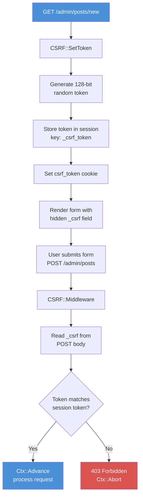

# บทที่ 17: การป้องกัน CSRF

*การโจมตีที่มองไม่เห็น ซึ่งมักพบเมื่อสายเกินแก้*

---

**วัตถุประสงค์การเรียนรู้**

เมื่ออ่านบทนี้จบ ผู้อ่านจะสามารถ:

- อธิบายได้ว่า CSRF attack คืออะไร และเหตุใดเว็บแอปพลิเคชันที่ใช้ฟอร์มจึงมีช่องโหว่
- สร้าง token แบบสุ่มด้วยการเข้ารหัสลับโดยใช้ `CSRF::GenerateToken`
- ฝัง CSRF token ไว้ในฟอร์ม HTML และตรวจสอบความถูกต้องเมื่อมีการส่งข้อมูล
- กำหนดค่า CSRF middleware เพื่อป้องกัน route ที่ใช้ POST, PUT, PATCH และ DELETE
- ระบุได้ว่าเมื่อใดที่ไม่จำเป็นต้องใช้การป้องกัน CSRF (JSON API ที่ใช้ Authorization header)

---

## 17.1 การโจมตีที่มองไม่เห็น

ลองจินตนาการว่าคุณกำลังล็อกอินอยู่ในเว็บไซต์ธนาคาร แล้วเปิดแท็บอีกแท็บเพื่อดูเว็บไซต์ภาพแมวน่ารัก ปรากฏว่าเว็บไซต์นั้นมีฟอร์มซ่อนอยู่ที่ส่ง POST request ไปยัง endpoint โอนเงินของธนาคารคุณ เบราว์เซอร์ของคุณก็แนบ session cookie ของธนาคารไปด้วยโดยอัตโนมัติ ธนาคารมองเห็น session ที่ถูกต้อง จึงดำเนินการโอนเงิน และนั่นแหละคือจุดเริ่มต้นของปัญหา

นี่คือ Cross-Site Request Forgery ผู้โจมตีไม่ได้ขโมยรหัสผ่านของคุณ ไม่ได้เจาะเข้าเซิร์ฟเวอร์ แต่หลอกให้เบราว์เซอร์ของคุณส่ง request แทนพวกเขา โดยอาศัย session ที่ผ่านการยืนยันตัวตนของคุณที่มีอยู่แล้ว เซิร์ฟเวอร์จึงแยกไม่ออกระหว่างการส่งฟอร์มที่ถูกต้องจากหน้าเว็บของธนาคาร กับการส่งฟอร์มปลอมจากหน้าเว็บอันตราย

CSRF attack เคยถูกใช้เพื่อโอนเงิน เปลี่ยนที่อยู่อีเมล มอบสิทธิ์ผู้ดูแลระบบ และลบบัญชีผู้ใช้ มันเงียบ มีประสิทธิภาพ และป้องกันได้อย่างสิ้นเชิง กลไกการป้องกันนั้นเรียบง่ายอย่างน่าประหลาดใจ: เพียงใช้ token แบบสุ่มที่ผู้โจมตีไม่สามารถเดาได้

---

## 17.2 หลักการทำงานของ CSRF Token

การป้องกันประกอบด้วย 3 ขั้นตอน:

1. เมื่อเซิร์ฟเวอร์แสดงผลฟอร์ม จะสร้าง token แบบสุ่มและฝังไว้เป็น hidden field
2. เมื่อผู้ใช้ส่งฟอร์ม token จะถูกส่งมาพร้อมกับข้อมูลในฟอร์ม
3. เซิร์ฟเวอร์ตรวจสอบว่า token ที่ส่งมาตรงกับที่สร้างไว้หรือไม่

ฟอร์มปลอมของผู้โจมตีไม่สามารถใส่ token ที่ถูกต้องได้ เพราะผู้โจมตีไม่มีสิทธิ์เข้าถึง token ดังกล่าว token ถูกสร้างขึ้นต่อ session เก็บไว้ที่เซิร์ฟเวอร์ และฝังไว้ในหน้าเว็บที่มีเพียงเว็บไซต์ที่ถูกต้องเท่านั้นที่แสดงผลได้ ผู้โจมตีอาจปลอมแปลงฟอร์มได้ แต่ปลอมแปลง token ไม่ได้


*รูปที่ 17.1 -- กระบวนการทำงานของ CSRF token: token ถูกสร้างในคำขอ GET ฝังไว้ในฟอร์ม ส่งมาพร้อม POST และตรวจสอบโดย middleware*

---

## 17.3 การสร้าง Token

โมดูล `CSRF` สร้าง token ด้วยวิธีเดียวกับ session ID: นำตัวเลขสุ่ม 32 บิตจำนวน 4 ค่ามาเรียงต่อกันเป็นสตริงเลขฐานสิบหก 32 ตัวอักษร

```purebasic
; From src/Middleware/CSRF.pbi -- GenerateToken
Procedure.s GenerateToken()
  Protected i.i, token.s = ""
  For i = 1 To 4
    token + RSet(Hex(Random($FFFFFFFF)), 8, "0")
  Next i
  ProcedureReturn token
EndProcedure
```

วิธีนี้ให้ความสุ่มที่ 128 บิต ผู้โจมตีต้องเดาค่าจาก 2^128 ความเป็นไปได้ ซึ่งมีประมาณ 3.4 x 10^38 ค่า เพื่อให้เห็นภาพ หากผู้โจมตีสามารถลองเดาได้หนึ่งพันล้านครั้งต่อวินาที จะต้องใช้เวลาประมาณ 10^22 ปีจึงจะลองได้ครบทุกค่า ขณะที่จักรวาลมีอายุเพียงราว 1.4 x 10^10 ปีเท่านั้น พูดได้เลยว่าไม่มีทางเดา token ของคุณได้แน่นอน

> **เบื้องหลังการทำงาน:** ฟังก์ชัน `Random()` ของ PureBasic ใช้ตัวสร้างตัวเลขสุ่มหลอกของระบบ แม้ว่านี่จะไม่ใช่ CSPRNG อย่างแท้จริง (เช่น `/dev/urandom`) แต่ขนาด token 128 บิตนั้นใหญ่เพียงพอที่จะทำให้การโจมตีด้วยการทำนายค่าไม่ได้ผลในทางปฏิบัติ สำหรับการสร้าง cryptographic key อาจต้องการ CSPRNG ที่เฉพาะเจาะจง แต่สำหรับ CSRF token ระดับความสุ่มนี้เกินพอ

---

## 17.4 การตั้งค่า Token ในฟอร์ม

เมื่อแสดงผลหน้าเว็บที่มีฟอร์ม ให้เรียก `CSRF::SetToken` ในตัวจัดการคำขอ วิธีนี้จะสร้าง token ใหม่ เก็บไว้ใน session และตั้งค่า cookie เพื่อให้ JavaScript ฝั่ง client เข้าถึงได้หากจำเป็น

```purebasic
; ตัวอย่างที่ 17.1 -- การตั้งค่า CSRF token ก่อนแสดงผลฟอร์ม
Procedure NewPostHandler(*C.RequestContext)
  CSRF::SetToken(*C)

  ; Make the token available to the template
  Protected token.s = Session::Get(*C, "_csrf_token")
  Ctx::Set(*C, "csrf_token", token)

  Rendering::Render(*C, "admin/new_post.html", 200)
EndProcedure
```

ขั้นตอนภายใน `CSRF::SetToken` ทำงาน 3 อย่าง:

```purebasic
; From src/Middleware/CSRF.pbi -- SetToken
Procedure SetToken(*C.RequestContext)
  Protected token.s = GenerateToken()
  Session::Set(*C, #_SESSION_KEY, token)  ; ← store in session
  Cookie::Set(*C, "csrf_token", token)    ; ← set as cookie
EndProcedure
```

token ถูกเก็บไว้ใน session ภายใต้คีย์ `"_csrf_token"` และถูกตั้งเป็น cookie ชื่อ `csrf_token` ด้วย การเก็บใน session คือสิ่งที่ middleware ใช้ในการตรวจสอบ ส่วน cookie เป็นความสะดวกสำหรับแอปพลิเคชันที่ใช้ JavaScript มากและต้องการอ่าน token ฝั่ง client

ในเทมเพลต HTML ให้ฝัง token เป็น hidden field ดังนี้:

```html
<!-- ตัวอย่างที่ 17.2 -- ฟอร์ม HTML พร้อม CSRF hidden field -->
<form method="POST" action="/admin/posts">
  <input type="hidden" name="_csrf"
         value="{{ csrf_token }}">

  <label for="title">Title</label>
  <input type="text" name="title" id="title"
         required>

  <label for="body">Body</label>
  <textarea name="body" id="body" required></textarea>

  <button type="submit">Create Post</button>
</form>
```

hidden field ชื่อ `_csrf` คือตัวพา token เมื่อส่งฟอร์ม token จะเดินทางมาพร้อม POST body ร่วมกับข้อมูลฟอร์มอื่นๆ CSRF middleware จะอ่านจากข้อมูล POST และตรวจสอบความถูกต้อง

> **เคล็ดลับ:** ชื่อ field `_csrf` ถูกกำหนดโดยค่าคงที่ `#_FORM_FIELD` ในโมดูล CSRF หากต้องการเปลี่ยน (เช่น เพื่อให้ตรงกับ convention ของ front-end framework) สามารถแก้ไขค่าคงที่นั้นได้ แต่ `_csrf` เป็น convention ที่ใช้กันอย่างแพร่หลาย และไม่ค่อยมีเหตุผลที่ต้องเปลี่ยน

---

## 17.5 CSRF Middleware

Middleware คือจุดที่การตรวจสอบเกิดขึ้น มันทำงานก่อน handler และตัดสินใจง่ายๆ ว่า: นี่คือ request ที่ปลอดภัย (GET/HEAD) หรือ request ที่เปลี่ยนสถานะข้อมูล (POST/PUT/PATCH/DELETE)?

Request ที่ปลอดภัยจะผ่านไปโดยไม่ต้องตรวจสอบ เพราะ GET request ไม่ควรเปลี่ยนสถานะข้อมูลใดๆ Request ที่เปลี่ยนสถานะจะต้องมี CSRF token ที่ถูกต้อง

```purebasic
; From src/Middleware/CSRF.pbi -- Middleware
Procedure Middleware(*C.RequestContext)
  Protected method.s = *C\Method

  If method = "GET" Or method = "HEAD"
    Ctx::Advance(*C)
    ProcedureReturn
  EndIf

  ; Read CSRF token from form body
  Protected token.s = Binding::PostForm(*C,
                                         #_FORM_FIELD)

  If Not ValidateToken(*C, token)
    Ctx::AbortWithError(*C, 403,
                         "CSRF token invalid or missing")
    ProcedureReturn
  EndIf

  Ctx::Advance(*C)
EndProcedure
```

ขั้นตอน `ValidateToken` เปรียบเทียบ token ที่ส่งมากับ token ที่เก็บไว้ใน session:

```purebasic
; From src/Middleware/CSRF.pbi -- ValidateToken
Procedure.i ValidateToken(*C.RequestContext, Token.s)
  Protected expected.s = Session::Get(*C,
                                       #_SESSION_KEY)
  ProcedureReturn Bool(expected <> "" And
                        expected = Token)
EndProcedure
```

ต้องเป็นจริงสองเงื่อนไข: session ต้องมี token อยู่ (ไม่ว่างเปล่า) และ token ที่ส่งมาต้องตรงกันทุกตัวอักษร หากเงื่อนไขใดเงื่อนไขหนึ่งไม่เป็นจริง middleware จะคืนค่า `#False` และ request นั้นจะได้รับ response 403 Forbidden

### การลงทะเบียน Middleware

Session middleware จากบทที่ 15 ต้องทำงานก่อน CSRF middleware ส่วน CSRF middleware ต้องทำงาน *หลัง* Session middleware (เพราะอ่านข้อมูลจาก session) และ *ก่อน* handler ของคุณ:

```purebasic
; ตัวอย่างที่ 17.3 -- การลงทะเบียน CSRF middleware ตามลำดับที่ถูกต้อง
Procedure Session_MW(*C.RequestContext)
  Session::Middleware(*C)
EndProcedure

Procedure CSRF_MW(*C.RequestContext)
  CSRF::Middleware(*C)
EndProcedure

; Order matters: Session first, then CSRF
Engine::Use(@Session_MW())
Engine::Use(@CSRF_MW())
```

หากลงทะเบียน CSRF ก่อน Session CSRF middleware จะพยายามอ่านจาก session ที่ยังไม่ถูกโหลด จะไม่พบ token ใดๆ และจะปฏิเสธทุก POST request ด้วย 403 คุณจะต้องเสียเวลาดีบักอยู่นานว่าทำไมฟอร์มถึงใช้ไม่ได้

> **คำเตือน:** ลำดับของ middleware สำคัญมาก Session ต้องทำงานก่อน CSRF เสมอ หาก CSRF อ่าน session ไม่ได้ ก็ไม่สามารถตรวจสอบ token ได้ และทุก request ที่เปลี่ยนสถานะข้อมูลจะถูกปฏิเสธด้วย 403 Forbidden

---

## 17.6 กระบวนการทำงานทั้งหมดในทางปฏิบัติ

ลองติดตาม กระบวนการส่งฟอร์มที่ป้องกันด้วย CSRF ตั้งแต่ต้นจนจบ นี่คือรูปแบบที่จะใช้กับฟอร์มทุกอย่างในแอปพลิเคชัน ไม่ว่าจะเป็นฟอร์มติดต่อ ฟอร์มเข้าสู่ระบบ หน้าสร้างโพสต์ของผู้ดูแล หน้าตั้งค่า หรือหน้าใดก็ตามที่ผู้ใช้ส่งข้อมูล

**ขั้นตอนที่ 1: ผู้ใช้ขอดูฟอร์ม (GET)**

```
GET /admin/posts/new HTTP/1.1
Cookie: _psid=A3F0B12C00000042DEADBEEF01234567
```

Session middleware โหลด session CSRF middleware เห็น GET request และปล่อยผ่านไป handler เรียก `CSRF::SetToken` ซึ่งสร้าง `"8F3A...C721"` เก็บไว้ใน session และตั้ง cookie `csrf_token` เทมเพลตแสดงผลฟอร์มพร้อม token ใน hidden field

**ขั้นตอนที่ 2: ผู้ใช้ส่งฟอร์ม (POST)**

```
POST /admin/posts HTTP/1.1
Cookie: _psid=A3F0B12C00000042DEADBEEF01234567
Content-Type: application/x-www-form-urlencoded

_csrf=8F3A...C721&title=My+Post&body=Hello+world
```

Session middleware โหลด session (ซึ่งมี `_csrf_token = "8F3A...C721"`) CSRF middleware เห็น POST request อ่าน `_csrf` จาก form body เรียก `ValidateToken` พบว่า `"8F3A...C721" = "8F3A...C721"` จึงเรียก `Ctx::Advance` handler ดำเนินการสร้างโพสต์

**ขั้นตอนที่ 3: ผู้โจมตีพยายามปลอมแปลง request**

```
POST /admin/posts HTTP/1.1
Cookie: _psid=A3F0B12C00000042DEADBEEF01234567
Content-Type: application/x-www-form-urlencoded

_csrf=WRONG_TOKEN&title=Hacked&body=PWNED
```

CSRF middleware อ่าน `_csrf = "WRONG_TOKEN"` จาก form body เปรียบเทียบกับ token ใน session `"8F3A...C721"` พบว่าไม่ตรงกัน จึงเรียก `Ctx::AbortWithError(*C, 403, "CSRF token invalid or missing")` handler ไม่เคยทำงาน request ปลอมของผู้โจมตีถูกปฏิเสธ

ประเด็นสำคัญคือ ผู้โจมตีสามารถส่ง POST request พร้อม session cookie ของผู้ใช้ได้ (เพราะเบราว์เซอร์แนบ cookie อัตโนมัติ) แต่ไม่สามารถใส่ CSRF token ที่ถูกต้องได้ เพราะไม่มีสิทธิ์เข้าถึงหน้าฟอร์มที่ฝัง token ไว้

---

## 17.7 เมื่อใดที่ไม่จำเป็นต้องใช้การป้องกัน CSRF

การป้องกัน CSRF จำเป็นมากสำหรับการส่งฟอร์มผ่านเบราว์เซอร์ แต่ไม่จำเป็นและบางครั้งอาจสร้างปัญหาสำหรับ JSON API ที่ใช้การยืนยันตัวตนด้วย token

หาก API ต้องการ header `Authorization: Bearer <token>` CSRF ไม่ใช่สิ่งที่ต้องกังวล เพราะเบราว์เซอร์ไม่แนบ `Authorization` header อัตโนมัติแบบที่แนบ cookie ฟอร์มปลอมของผู้โจมตีไม่สามารถตั้ง custom header ได้ `Authorization` header ต้องถูกตั้งค่าอย่างชัดเจนด้วย JavaScript ที่รันบน origin ที่ถูกต้องเท่านั้น

```purebasic
; ตัวอย่างที่ 17.4 -- JSON API routes โดยไม่ใช้ CSRF
; These routes use Bearer token auth, not cookies
; No CSRF middleware needed
Engine::GET("/api/v1/posts", @APIListPosts())
Engine::POST("/api/v1/posts", @APICreatePost())
Engine::PUT("/api/v1/posts/:id", @APIUpdatePost())
Engine::DELETE("/api/v1/posts/:id", @APIDeletePost())
```

> **เคล็ดลับ:** หากแอปพลิเคชันมีทั้งฟอร์มที่แสดงผลในเบราว์เซอร์ (ต้องการ CSRF) และ JSON API (ใช้ Bearer token) ให้ลงทะเบียน CSRF middleware เฉพาะกับกลุ่ม route ที่เสิร์ฟฟอร์มเท่านั้น อย่าใช้ middleware ระดับ global

กฎง่ายๆ คือ: หากการยืนยันตัวตนเดินทางใน cookie ต้องการการป้องกัน CSRF หากเดินทางใน header ที่เบราว์เซอร์ไม่แนบอัตโนมัติ ก็ไม่จำเป็น

CORS (Cross-Origin Resource Sharing) เป็นการป้องกันอีกชั้นสำหรับ API โดยจำกัด origin ที่สามารถส่ง request ได้ แต่ CORS ไม่ใช่ตัวทดแทน CSRF token สำหรับ route ที่ยืนยันตัวตนด้วย cookie ทั้งสองแก้ปัญหาคนละอย่าง ใช้ร่วมกันได้เลย

---

## 17.8 ข้อผิดพลาดที่พบบ่อย

มีข้อผิดพลาด 3 ประการที่มักพบเมื่อนักพัฒนาลงมือทำการป้องกัน CSRF แต่ละข้อเปิดช่องโหว่ด้านความปลอดภัยพร้อมสร้างภาพลวงว่าระบบปลอดภัย

**ข้อผิดพลาดที่ 1: สร้าง token แต่ไม่ได้ฝังไว้ในฟอร์ม**

คุณเรียก `CSRF::SetToken` ใน handler แต่ลืมส่ง token ไปยังเทมเพลต หรือละเว้น hidden field ทุก POST submission จะล้มเหลวด้วย 403 คุณโกรธ middleware ปิดมันทิ้ง แล้วเดินหน้าต่อ บัดนี้คุณไม่มีการป้องกัน CSRF แล้ว วิธีแก้: ใส่ `<input type="hidden" name="_csrf" value="{{ csrf_token }}">` ในทุกฟอร์มเสมอ

**ข้อผิดพลาดที่ 2: ลงทะเบียน CSRF middleware ก่อน Session middleware**

CSRF middleware อ่านจาก session หาก session ยังไม่ถูกโหลด ก็อ่านไม่ได้อะไรเลย จะไม่พบ token ที่เก็บไว้ และปฏิเสธทุกอย่าง คุณโกรธ middleware อีกครั้ง วิธีแก้: ลงทะเบียน Session ก่อน แล้วจึงตาม CSRF

**ข้อผิดพลาดที่ 3: ใช้ token เดิมตลอดไป**

การทำงานปัจจุบันสร้าง token ใหม่ทุกครั้งที่เรียก `CSRF::SetToken` นักพัฒนาบางคน cache token ไว้และนำมาใช้ซ้ำข้าม request เพื่อ "ประสิทธิภาพ" ซึ่งลดความแข็งแกร่งของการป้องกัน หาก token รั่วไหล (ผ่าน log, Referer header หรือหน้าที่ถูก cache) token นั้นจะยังคงใช้ได้ตลอดไป token ใหม่ช่วยจำกัดช่วงเวลาของช่องโหว่

---

## สรุป

CSRF attack ใช้ประโยชน์จากการที่เบราว์เซอร์แนบ cookie อัตโนมัติเพื่อปลอมแปลง request แทนผู้ใช้ที่ผ่านการยืนยันตัวตน การป้องกันคือ token แบบสุ่มที่ฝังในฟอร์มและตรวจสอบเมื่อมีการส่งข้อมูล โมดูล CSRF สร้าง token แบบสุ่ม 128 บิต เก็บไว้ใน session และตรวจสอบผ่าน middleware GET และ HEAD request ผ่านโดยไม่ต้องตรวจสอบ ส่วน POST, PUT, PATCH และ DELETE ต้องมี token ที่ตรงกัน JSON API ที่ใช้ Bearer token ไม่จำเป็นต้องป้องกัน CSRF เพราะเบราว์เซอร์ไม่แนบ Authorization header อัตโนมัติ

---

**ประเด็นสำคัญ**

- CSRF attack ทำงานได้เพราะเบราว์เซอร์ส่ง cookie อัตโนมัติทุก request รวมถึง request ที่เริ่มต้นจากเว็บไซต์อันตราย
- CSRF middleware ต้องทำงานหลัง Session middleware เสมอ เพราะต้องอ่าน token ที่คาดไว้จาก session
- JSON API ที่ใช้ `Authorization` header ไม่ได้รับผลกระทบจาก CSRF และไม่จำเป็นต้องใช้การป้องกัน token เฉพาะการส่งฟอร์มที่ยืนยันตัวตนด้วย cookie เท่านั้นที่ต้องการ

---

**คำถามทบทวน**

1. เหตุใดผู้โจมตีจึงสามารถปลอมแปลง POST request พร้อม session cookie ของผู้ใช้ได้ แต่ไม่สามารถใช้ CSRF token ที่ถูกต้องได้? อะไรที่ป้องกันไม่ให้ผู้โจมตีได้รับ token?

2. CSRF middleware คืน HTTP status code อะไรเมื่อการตรวจสอบล้มเหลว และเหตุใด code นั้นจึงเหมาะสม?

3. *ลองทำ:* เพิ่มการป้องกัน CSRF ในแอปพลิเคชันที่ใช้ฟอร์ม สร้างฟอร์มพร้อม `_csrf` hidden field ลงทะเบียน Session และ CSRF middleware ตามลำดับที่ถูกต้อง และยืนยันว่าการส่งฟอร์มโดยไม่มี token ทำให้เกิดข้อผิดพลาด 403
