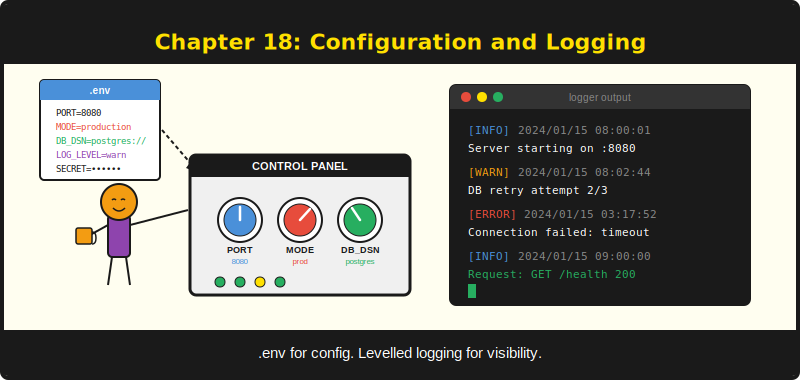

# บทที่ 18: Configuration และ Logging



*Config แบบ twelve-factor และ log ที่บอกคุณว่าเกิดอะไรขึ้นตอนตีสาม*

---

## วัตถุประสงค์การเรียนรู้

**เมื่ออ่านบทนี้จบ ผู้อ่านจะสามารถ:**

- โหลด configuration จากไฟล์ `.env` และดึงค่าออกมาพร้อม fallback ที่ปลอดภัยด้านชนิดข้อมูล
- Override configuration ขณะ runtime สำหรับการทดสอบและการพัฒนา
- กำหนด run mode ของแอปพลิเคชัน (debug, release, test) และเข้าใจผลกระทบต่อพฤติกรรมของระบบ
- กำหนดค่า levelled logging พร้อมส่งผลลัพธ์ไปยัง stdout หรือไฟล์
- นำหลักการ twelve-factor app มาใช้กับแอปพลิเคชัน PureSimple

---

## 18.1 ปัญหาของค่าที่ hard-code ไว้

ทุกเว็บแอปพลิเคชันต้องการ configuration หมายเลขพอร์ต, path ฐานข้อมูล, API key, run mode ค่าเหล่านี้เปลี่ยนไปตาม environment ไม่ว่าจะเป็นเครื่อง laptop ส่วนตัว, staging server หรือ production server แน่นอนว่าคุณสามารถ hard-code ค่าเหล่านี้ลงไปตรงๆ ได้ เช่นเดียวกับที่คุณสักรหัสผ่าน WiFi ไว้บนหน้าผาก ทั้งสองวิธีใช้ได้ดีจนกว่าคุณจะต้องเปลี่ยนอะไรสักอย่าง

แนวคิด twelve-factor app methodology ซึ่งเริ่มต้นโดยวิศวกรของ Heroku มีคำตอบที่สะอาดกว่า: เก็บ configuration ไว้ใน environment แต่ละ deployment มีไฟล์ `.env` เป็นของตัวเอง โค้ดอ่านจากไฟล์นั้น ไบนารีเหมือนกันทุกที่ นี่คือรูปแบบที่ PureSimple ปฏิบัติตาม

ระบบ configuration ของ PureSimple อยู่ในสองโมดูล `Config` ดูแลการจัดเก็บ key-value และการอ่านไฟล์ `.env` ส่วน `Log` ให้บริการ levelled logging พร้อม output ที่ปรับแต่งได้ ร่วมกันแล้วให้ visibility ด้าน operation ที่คุณต้องการโดยไม่ผูกโค้ดกับ environment การ deploy เฉพาะเจาะจงใดๆ

---

## 18.2 โมดูล Config

โมดูล `Config` เป็น wrapper บางๆ ที่ครอบ `NewMap` ของ PureBasic ซึ่งเป็น hash map จาก string key ไปยัง string value มันอ่านไฟล์ `.env` เก็บค่าในหน่วยความจำ และมี typed accessor พร้อม fallback default ทั้งโมดูลมีไม่ถึง 110 บรรทัด ไม่มี YAML parser ไม่มี TOML parser ไม่มีการโต้เถียงว่า tab หรือ space มีความหมายอะไร มันอ่านบรรทัด `KEY=value` จากไฟล์ และนั่นคือทุกสิ่งที่มันทำ

```purebasic
; ตัวอย่างที่ 18.1 -- public interface ของโมดูล Config
DeclareModule Config
  Declare.i Load(Path.s)
  Declare.s Get(Key.s, Fallback.s = "")
  Declare.i GetInt(Key.s, Fallback.i = 0)
  Declare   Set(Key.s, Val.s)
  Declare.i Has(Key.s)
  Declare   Reset()
EndDeclareModule
```

หก procedure นี่คือ configuration API ทั้งหมด `Load` อ่านไฟล์ `Get` และ `GetInt` ดึงค่า `Set` override ค่าขณะ runtime `Has` ตรวจสอบการมีอยู่ของ key และ `Reset` ล้างทุกอย่าง หากคุณเคยใช้ `os.Getenv` ของ Go พร้อม helper function สำหรับ default คุณรู้จักรูปแบบนี้แล้ว หากคุณเคยใช้ `python-dotenv` ก็เป็นแนวคิดเดียวกัน แต่อันนี้ compile เป็น machine code และไม่มี dependency ใดๆ เลย

### การโหลดไฟล์ .env

รูปแบบไฟล์ `.env` นั้นเรียบง่ายโดยตั้งใจ:

```
# .env -- application configuration
# Lines starting with # are comments
PORT=8080
MODE=release
DB_PATH=data/production.db
APP_NAME=PureSimple
EMPTY_VAL=
MAX_CONN=25
```

บรรทัดว่างและบรรทัดที่ขึ้นต้นด้วย `#` (comment) จะถูกข้ามไป บรรทัดอื่นจะถูกแยกที่เครื่องหมาย `=` ตัวแรก key จะถูก trim, value จะถูก trim แล้วเก็บคู่กัน key เป็น case-sensitive ค่าทั้งหมดเป็น string ภายใน โดย `GetInt` จะแปลงด้วย `Val()` เมื่อดึงข้อมูลออกมา

```purebasic
; ตัวอย่างที่ 18.2 -- การโหลด configuration และอ่านค่า
Config::Load(".env")

; String value with fallback
Protected mode.s = Config::Get("MODE", "debug")

; Integer value with fallback
Protected port.i = Config::GetInt("PORT", 8080)

; Check if a key exists before reading
If Config::Has("DB_PATH")
  Protected dbPath.s = Config::Get("DB_PATH")
EndIf
```

`Load` คืนค่า `#True` เมื่อสำเร็จ และ `#False` หากเปิดไฟล์ไม่ได้ นี่เป็นการตัดสินใจออกแบบโดยเจตนา ไฟล์ `.env` ที่หายไปไม่จำเป็นต้องเป็นข้อผิดพลาดเสมอ แอปพลิเคชันอาจพึ่งพา default ที่ compile ไว้ทั้งหมดในระหว่างการพัฒนา ผู้เรียกเป็นผู้ตัดสินใจว่าไฟล์ที่หายไปเป็นเรื่องร้ายแรงหรือไม่

> **เคล็ดลับ:** อย่า commit ไฟล์ `.env` ของคุณลงใน version control เด็ดขาด เพิ่ม `.env` ใน `.gitignore` และใช้ไฟล์ `.env.example` ที่มี placeholder แทน secret ในระบบ production ควรอยู่บน production server เท่านั้น ไม่ใช่ใน Git history

### หลักการทำงานภายในของ Load

การ implement ใช้ I/O primitives ของ PureBasic ได้แก่ `ReadFile`, `ReadString` และ `Eof` มันตรวจสอบการมีอยู่ของไฟล์ด้วย `FileSize(Path) < 0` ซึ่งเป็น idiom มาตรฐานของ PureBasic เนื่องจากไม่มีฟังก์ชัน `FileExists()` ครั้งหนึ่งผู้เขียนเสียเวลาสิบห้านาทีค้นหา `FileExists()` ในเอกสารก่อนจะค้นพบว่ามันไม่มีอยู่จริง (หมายถึงฟังก์ชัน ส่วนไฟล์นั้นดีอยู่)

```purebasic
; ตัวอย่างที่ 18.3 -- จาก src/Config.pbi: procedure Load
Procedure.i Load(Path.s)
  Protected fh.i, line.s, eq.i, key.s, val.s
  If FileSize(Path) < 0
    ProcedureReturn #False
  EndIf
  fh = ReadFile(#PB_Any, Path)
  If fh = 0
    ProcedureReturn #False
  EndIf
  While Not Eof(fh)
    line = Trim(ReadString(fh))
    If Len(line) = 0 Or Left(line, 1) = "#"
      Continue
    EndIf
    eq = FindString(line, "=")
    If eq > 0
      key = Trim(Left(line, eq - 1))
      val = Trim(Mid(line, eq + 1))
      If key <> ""
        _C(key) = val
      EndIf
    EndIf
  Wend
  CloseFile(fh)
  ProcedureReturn #True
EndProcedure
```

สังเกตตรรกะการแยก: `FindString(line, "=")` คืนตำแหน่งของ `=` ตัวแรก ทุกอย่างก่อนหน้าคือ key ทุกอย่างหลังจากนั้นคือ value ซึ่งหมายความว่าค่าสามารถมี `=` ได้โดยไม่คลุมเครือ เช่น `SECRET=abc=def` เก็บ `"abc=def"` ภายใต้ key `"SECRET"` key ไม่สามารถมี `=` ได้ แต่หากคุณใส่ `=` ในชื่อ key ของคุณ configuration ไม่ใช่ปัญหาเร่งด่วนที่สุดของคุณแล้ว

> **ข้อควรระวังใน PureBasic:** `FindString` คืนค่า 0 เมื่อไม่พบ substring ไม่ใช่ -1 เพราะ PureBasic นับ string จากตำแหน่ง 1 ดังนั้นตำแหน่ง 0 หมายถึง "ไม่พบ" บรรทัดที่ไม่มีเครื่องหมาย `=` จะถูกข้ามไปเงียบๆ

### Runtime Override และ Reset

`Config::Set` เขียนลงใน internal map โดยตรง ซึ่ง override ค่าที่มีอยู่สำหรับ key นั้น มีประโยชน์มากระหว่างการทดสอบ เพราะสามารถจำลอง configuration ต่างๆ โดยไม่ต้องเขียนไฟล์ชั่วคราวลงดิสก์

`Config::Reset` ล้าง map ทั้งหมด ระหว่าง test suite ควรเรียก `Config::Reset()` เพื่อให้แน่ใจว่า configuration ของ suite ก่อนหน้าไม่รั่วไหลมายัง suite ถัดไป state ที่แชร์กันและเปลี่ยนแปลงได้คือสาเหตุอันดับหนึ่งของ flaky test และ configuration ก็คือ state ที่แชร์กันและเปลี่ยนแปลงได้ประเภทหนึ่ง

```purebasic
; ตัวอย่างที่ 18.4 -- Runtime override ในโค้ดทดสอบ
Config::Reset()
Config::Set("PORT", "3000")
Config::Set("MODE", "test")
CheckEqual(Config::GetInt("PORT"), 3000)
CheckStr(Config::Get("MODE"), "test")
Config::Reset()   ; clean slate for the next suite
```

> **เปรียบเทียบ:** นักพัฒนา Go มักใช้ `os.Setenv` และ `os.Getenv` หรือ library อย่าง Viper ที่รองรับ YAML, TOML, JSON, environment variable และ remote config server โมดูล `Config` ของ PureSimple ใกล้เคียงกับ `godotenv` มากกว่า มันทำสิ่งเดียว (อ่านไฟล์ `.env`) และทำได้ดี หากต้องการ hierarchical config พร้อม inheritance และ hot-reloading แสดงว่าคุณกำลังสร้างแอปพลิเคชันประเภทอื่นที่อยู่นอกเป้าหมายของ PureSimple

---

## 18.3 Run Mode

PureSimple รองรับสาม run mode: `"debug"`, `"release"` และ `"test"` ค่าเริ่มต้นคือ `"debug"` คุณตั้งค่า mode ด้วย `Engine::SetMode` และอ่านด้วย `Engine::Mode`

```purebasic
; ตัวอย่างที่ 18.5 -- การตั้งค่าและอ่าน run mode
Engine::SetMode("release")
CheckStr(Engine::Mode(), "release")

Engine::SetMode("test")
CheckStr(Engine::Mode(), "test")

Engine::SetMode("debug")  ; restore default
```

mode เก็บเป็น global string ธรรมดาภายในโมดูล Engine มันไม่เปลี่ยนพฤติกรรมโดยอัตโนมัติ แต่เป็น flag ที่ middleware และ handler สามารถตรวจสอบได้ ตัวอย่างเช่น Logger middleware อาจระงับ debug-level output ใน release mode ส่วน Recovery middleware อาจแสดง stack trace ใน debug mode แต่คืน error page ทั่วไปใน release mode

ไฟล์ systemd service ตั้ง mode ผ่าน environment variable:

```ini
; ตัวอย่างที่ 18.6 -- จาก deploy/puresimple.service
Environment=PURESIMPLE_MODE=release
```

โค้ด startup ของแอปพลิเคชันอ่านค่านี้และนำไปใช้:

```purebasic
; ตัวอย่างที่ 18.7 -- การนำ mode จาก config มาใช้
Config::Load(".env")
Engine::SetMode(Config::Get("PURESIMPLE_MODE", "debug"))
```

> **เคล็ดลับ:** รักษา mode handling ให้เรียบง่าย สาม mode ก็เพียงพอแล้ว "debug" สำหรับการพัฒนา "release" สำหรับ production "test" สำหรับการทดสอบอัตโนมัติ หากพบว่าตัวเองกำลังเพิ่ม mode อย่าง "staging-with-extra-logging-on-tuesdays" ให้หยุดคิดใหม่และใช้ log level แทน

---

## 18.4 โมดูล Log

Logging คือศิลปะของการเขียนข้อความที่คุณจะอยากเขียนให้มากกว่านี้อย่างสุดๆ หลังจากสามเดือนต่อมา ตอนตีสาม ขณะที่ production ล่มและคุณไม่รู้ว่าเกิดอะไรขึ้น โมดูล `Log` มี severity level สี่ระดับและ output target สอง target

```purebasic
; ตัวอย่างที่ 18.8 -- public interface ของโมดูล Log
DeclareModule Log
  #LevelDebug = 0
  #LevelInfo  = 1
  #LevelWarn  = 2
  #LevelError = 3

  Declare   SetLevel(Level.i)
  Declare   SetOutput(Filename.s)
  Declare   Dbg(Msg.s)
  Declare   Info(Msg.s)
  Declare   Warn(Msg.s)
  Declare   Error(Msg.s)
EndDeclareModule
```

สี่ระดับนี้มีลำดับชั้น การตั้ง level เป็น `#LevelWarn` จะระงับทั้ง `Dbg` และ `Info` การตั้งเป็น `#LevelDebug` จะแสดงทุกอย่าง ค่าเริ่มต้นคือ `#LevelInfo` ซึ่งหมายความว่า debug message จะถูกระงับเว้นแต่คุณจะลด threshold อย่างชัดเจน

### รูปแบบ Log Output

ทุก log line มีรูปแบบเดียวกัน:

```
[2026-03-20 14:32:01] [INFO] Server starting on :8080
[2026-03-20 14:32:01] [DEBUG] Loaded 10 migrations
[2026-03-20 14:32:05] [WARN] Slow query: 1.2s on /api/posts
[2026-03-20 14:32:07] [ERROR] Database connection failed
```

timestamp มาจาก `FormatDate` ที่ใช้กับ `Date()` level tag เป็น string ความกว้างคงที่ ส่วน message คือสิ่งที่คุณส่งเข้าไป รูปแบบนี้อ่านง่าย grep ได้ง่าย และ pipe เข้า log aggregation tool ใดก็ได้ที่เข้าใจ plain text ซึ่งครอบคลุมทุก tool ที่มีอยู่

```purebasic
; ตัวอย่างที่ 18.9 -- การใช้ log level ในโค้ดแอปพลิเคชัน
Log::SetLevel(Log::#LevelDebug)
Log::Dbg("Loading configuration from .env")
Log::Info("Server starting on port " + Str(port))
Log::Warn("No DB_PATH configured, using in-memory")
Log::Error("Failed to bind to port " + Str(port))
```

### File Output

ตามค่าเริ่มต้น `Log` เขียนลง stdout ด้วย `PrintN` หากต้องการส่ง output ไปยังไฟล์ ให้เรียก `SetOutput` พร้อม file path ส่ง string ว่างเพื่อกลับมาใช้ stdout

```purebasic
; ตัวอย่างที่ 18.10 -- การส่ง log output ไปยังไฟล์
Log::SetOutput("logs/app.log")
Log::Info("This goes to the file")
Log::SetOutput("")
Log::Info("This goes to stdout")
```

การ implement สำหรับ file output จะต่อท้ายไฟล์ที่มีอยู่ (ด้วย `OpenFile` และ `FileSeek` ไปยังตอนท้าย) หรือสร้างใหม่หากยังไม่มีไฟล์ แต่ละครั้งที่ log จะเปิดไฟล์ เขียนหนึ่งบรรทัด แล้วปิดไฟล์ แม้จะไม่ใช่วิธีที่เร็วที่สุด (buffered writer จะมีประสิทธิภาพกว่า) แต่รับประกันว่าทุก log line ถูก flush ลงดิสก์ทันที เมื่อเซิร์ฟเวอร์ crash คุณต้องการให้ log line สุดท้ายอยู่บนดิสก์ ไม่ใช่อยู่ใน buffer ที่กำลังครุ่นคิดถึงความหมายของการดำรงอยู่

> **เบื้องหลังการทำงาน:** helper procedure `_Write` ตรวจสอบ `FileSize(_Output) >= 0` เพื่อตัดสินใจระหว่าง `OpenFile` (append) และ `CreateFile` (สร้างใหม่) ใช้ `FileSize` แบบเดียวกับที่ใช้ทั่ว PureBasic สำหรับการตรวจสอบการมีอยู่ของไฟล์ file handle ได้จาก `#PB_Any` เพื่อหลีกเลี่ยงความขัดแย้งของ ID

PureSimple ไม่มี log rotation ในตัว บน Linux ใช้ `logrotate` เพื่อจัดการขนาดไฟล์ log รูปแบบ open-write-close-ต่อบรรทัดของโมดูล `Log` หมายความว่า `logrotate` สามารถ rotate ไฟล์ได้ทุกเมื่อโดยไม่ต้องประสานงานกับแอปพลิเคชันที่กำลังรัน บน Windows สามารถทำได้ในลักษณะเดียวกันด้วย PowerShell scheduled task หรือ tool อื่นๆ

### ควรบันทึกอะไรในแต่ละระดับ

การเลือก log level ที่เหมาะสมเป็นทั้งศิลปะและวิทยาศาสตร์ แต่มีแนวทางปฏิบัติดังนี้:

| ระดับ | ใช้สำหรับ | ตัวอย่าง |
|-------|-----------|---------|
| **DEBUG** | รายละเอียดมากสำหรับการพัฒนา | "Loaded 10 routes", "Config key DB_PATH = data/app.db" |
| **INFO** | การทำงานปกติที่ควรบันทึก | "Server started on :8080", "Migration 003 applied" |
| **WARN** | บางอย่างผิดปกติแต่ไม่ร้ายแรง | "Slow query (1.2s)", "Missing optional config key" |
| **ERROR** | บางอย่างพังและต้องการการดูแล | "Database connection failed", "Template not found" |

ใน production ตั้ง level เป็น `#LevelInfo` หรือ `#LevelWarn` ในระหว่างพัฒนาตั้งเป็น `#LevelDebug` ในการทดสอบตั้งเป็น `#LevelError` เพื่อให้ output ของการทดสอบสะอาด หรือ redirect ไปยังไฟล์ชั่วคราวและยืนยัน content ดังที่ test suite ของบทนี้ทำ

> **คำเตือน:** อย่า log ข้อมูลที่อ่อนไหว รหัสผ่าน, API key, session token และหมายเลขบัตรเครดิตไม่มีทางที่ควรปรากฏใน log file หากต้องการ log request body เพื่อ debug ให้ redact ฟิลด์ที่อ่อนไหวก่อน

---

## 18.5 นำ Config และ Log มาใช้ร่วมกัน

ในแอปพลิเคชัน PureSimple ทั่วไป การตั้งค่า configuration และ logging เป็นสิ่งแรกที่ควรทำ ทำงานก่อนที่จะลงทะเบียน route, แนบ middleware หรือเริ่มรับ request

```purebasic
; ตัวอย่างที่ 18.11 -- ลำดับการเริ่มต้นแอปพลิเคชันทั่วไป
EnableExplicit
XIncludeFile "src/PureSimple.pb"

; 1. Load configuration
If Not Config::Load(".env")
  Log::Warn("No .env file found, using defaults")
EndIf

; 2. Set run mode
Engine::SetMode(Config::Get("MODE", "debug"))

; 3. Configure logging
If Engine::Mode() = "release"
  Log::SetLevel(Log::#LevelInfo)
  Log::SetOutput(Config::Get("LOG_FILE", "logs/app.log"))
Else
  Log::SetLevel(Log::#LevelDebug)
EndIf

; 4. Read application-specific config
Protected port.i = Config::GetInt("PORT", 8080)
Protected dbPath.s = Config::Get("DB_PATH", "data/app.db")

Log::Info("Starting in " + Engine::Mode() + " mode")
Log::Info("Port: " + Str(port))
Log::Info("Database: " + dbPath)

; 5. Register routes, middleware, etc.
; ... (rest of application setup)
```

รูปแบบนี้ปฏิบัติตามหลัก twelve-factor: ไบนารีเหมือนกันทุกที่ เปลี่ยนเพียงไฟล์ `.env` ระหว่าง environment ไฟล์ `.env` ของการพัฒนามี `MODE=debug` และ `PORT=3000` ส่วนไฟล์ `.env` ของ production มี `MODE=release` และ `PORT=8080` ไบนารีไม่สนใจ มันอ่านค่าที่ให้มาและทำงานตามนั้น

---

## 18.6 การทดสอบ Configuration

test suite ของ configuration แสดงให้เห็นแนวทางการทดสอบโมดูล Config อย่างละเอียด มันโหลดไฟล์ `.env` ที่รู้จัก ตรวจสอบค่าที่ parse ได้ ทดสอบ fallback default ออกกำลังกาย runtime override และยืนยันว่า `Reset` ล้าง store จริงๆ

```purebasic
; ตัวอย่างที่ 18.12 -- จาก tests/P8_Config_Test.pbi: assertion หลัก
Config::Reset()
result = Config::Load("tests/test.env")
Check(result)   ; file loaded successfully

; Verify known keys
CheckStr(Config::Get("PORT"),     "9090")
CheckStr(Config::Get("MODE"),     "release")
CheckStr(Config::Get("APP_NAME"), "PureSimple")

; Empty values are stored, not skipped
Check(Config::Has("EMPTY_VAL"))
CheckStr(Config::Get("EMPTY_VAL"), "")

; Comments must not appear as keys
Check(Not Config::Has(
  "# This line is a comment and should be ignored"))

; Fallback defaults
CheckStr(Config::Get("NONEXISTENT_KEY", "fallback"),
  "fallback")
CheckEqual(Config::GetInt("MISSING_INT", 42), 42)
```

การทดสอบยังตรวจสอบว่า `Config::Load` คืนค่า `#False` สำหรับไฟล์ที่ไม่มีอยู่ ว่า `GetInt` แปลง string เป็น integer ได้ถูกต้อง และว่า `Config::Set` สามารถ override ค่าที่โหลดมาได้ขณะ runtime สำหรับโมดูล `Log` การทดสอบ redirect output ไปยังไฟล์ชั่วคราว เขียน message ในทุกสี่ระดับ และยืนยันว่าไฟล์ถูกสร้างขึ้นพร้อม content

> **เคล็ดลับ:** เรียก `Config::Reset()` ไว้เสมอที่ต้นของ config test ของคุณ test suite อื่นที่รันก่อนหน้านี้อาจทิ้งค่าไว้ใน store การทดสอบที่ป้องกันตัวเองไม่ใช่ความหวาดระแวง แต่เป็นความเป็นมืออาชีพ

---

## สรุป

Configuration และ logging คือกระดูกสันหลังด้าน operation ของเว็บแอปพลิเคชันทุกตัว โมดูล `Config` ของ PureSimple ให้ตัว parse ไฟล์ `.env` ที่เบาพร้อม typed accessor และ runtime override โมดูล `Log` มี severity level สี่ระดับพร้อม output ไปยัง stdout หรือไฟล์ ร่วมกับ `Engine::SetMode` ทำให้ปรับพฤติกรรมตาม environment ได้โดยไม่ต้อง recompile ไบนารี รูปแบบง่ายๆ คือ: โหลด config ก่อน ตั้ง mode กำหนด logging แล้วค่อยเริ่มแอปพลิเคชัน

---

## ประเด็นสำคัญ

- **โหลดครั้งเดียว อ่านได้ทุกที่** เรียก `Config::Load` ตอน startup แล้วใช้ `Config::Get` และ `Config::GetInt` พร้อม fallback default ทั่วทั้งแอปพลิเคชัน
- **อย่า commit ไฟล์ `.env` เด็ดขาด** ใช้ `.env.example` พร้อม placeholder และเก็บ secret จริงไว้บนเซิร์ฟเวอร์
- **Log ในระดับที่เหมาะสม** DEBUG สำหรับ verbosity ตอนพัฒนา INFO สำหรับการทำงานปกติ WARN สำหรับปัญหาที่แก้ได้เอง ERROR สำหรับสิ่งที่ต้องการความสนใจทันที
- **Reset ระหว่าง test** เรียก `Config::Reset()` และคืน `Log::SetLevel` / `Log::SetOutput` กลับสู่ default ระหว่าง test suite เพื่อป้องกัน state รั่วไหล

---

## คำถามทบทวน

1. เหตุใด `Config::Load` จึงคืนค่า `#False` แทนการ raise error เมื่อไม่พบไฟล์ `.env`? การออกแบบนี้มีข้อดีอะไรบ้าง?
2. ความแตกต่างระหว่าง `Log::#LevelInfo` และ `Log::#LevelWarn` คืออะไร และเมื่อใดที่ควรเลือกใช้แต่ละระดับเป็น production log level?
3. *ลองทำ:* สร้างไฟล์ `.env` ที่มี key `PORT`, `MODE` และ `LOG_FILE` เขียนโปรแกรมสั้นๆ ที่โหลด config ตั้ง run mode redirect log output ไปยังไฟล์ที่กำหนด และ log startup message ในทุก severity level ตรวจสอบว่ามีเฉพาะ message ที่อยู่ในระดับที่กำหนดหรือสูงกว่าเท่านั้นที่ปรากฏในไฟล์
