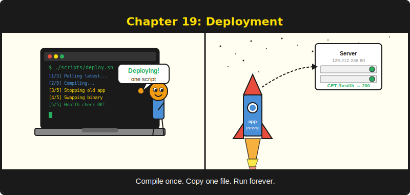
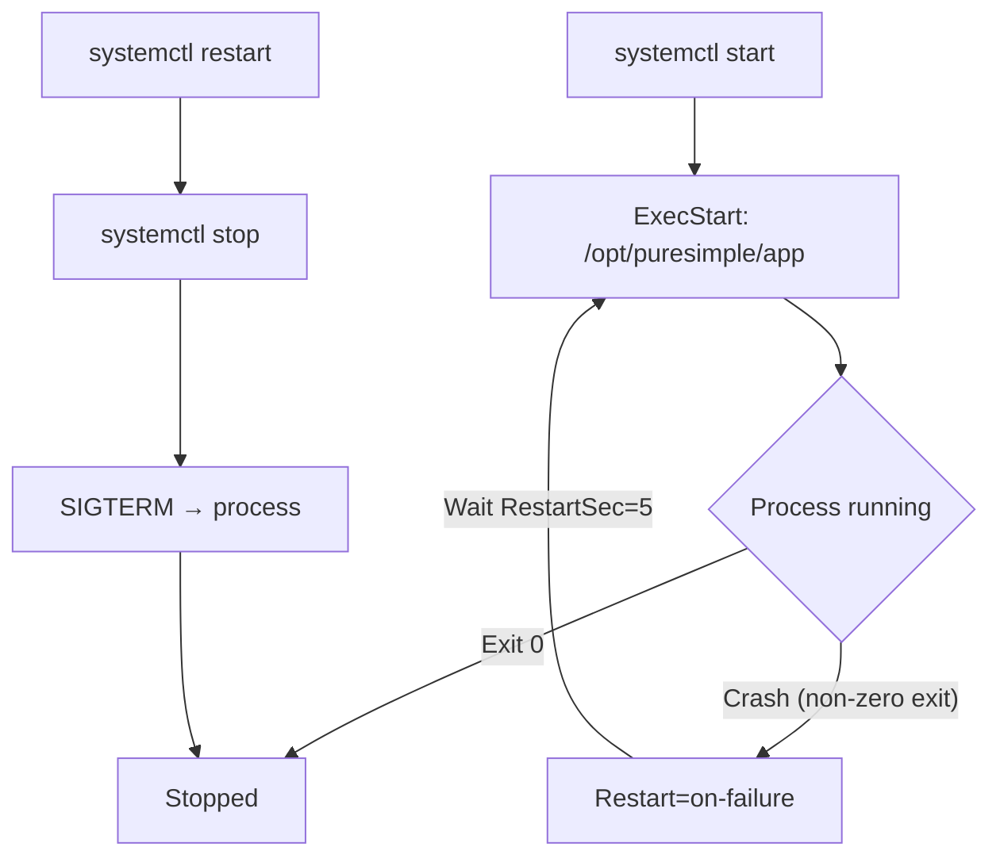
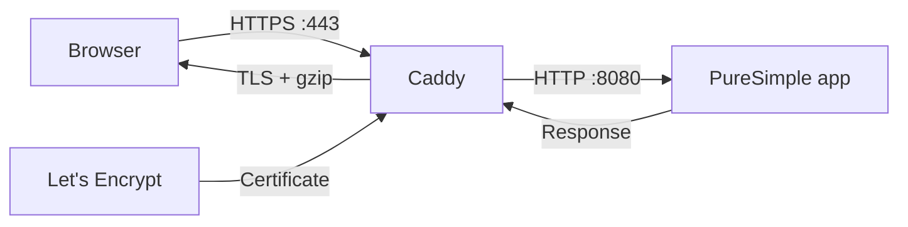
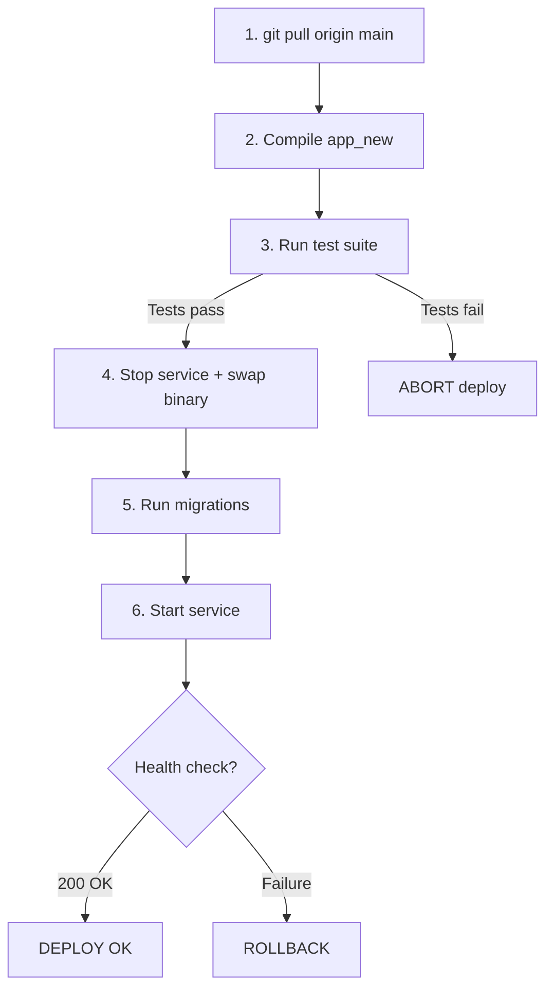

# บทที่ 19: Deployment



*การนำไบนารีจาก laptop ไปยังเซิร์ฟเวอร์ โดยไม่ต้องอธิษฐาน*

---

**เมื่ออ่านบทนี้จบ ผู้อ่านจะสามารถ:**

- Compile ไบนารี PureSimple แบบ production-optimised ด้วย flag `-z`
- กำหนดค่า systemd service เพื่อรันแอปพลิเคชันเป็น managed daemon
- ตั้งค่า Caddy เป็น reverse proxy พร้อม automatic TLS
- Deploy ด้วยความมั่นใจโดยใช้ pipeline `deploy.sh` (pull, compile, test, swap, health check)
- Rollback การ deploy ที่ล้มเหลวใน 10 วินาที

---

> **หมายเหตุ:** บทนี้เน้นการ deploy บน Linux server ด้วย systemd และ Caddy การ deploy บน Windows ใช้รูปแบบ compile-and-run เหมือนกัน โดยไบนารีรันได้โดยตรง และสามารถใช้ reverse proxy ใดก็ได้ (IIS, nginx for Windows หรือ Caddy for Windows) อยู่ด้านหน้า

## 19.1 ข้อได้เปรียบของ Single Binary (ทบทวน)

เราพูดถึงข้อได้เปรียบของ single binary ในบทที่ 1 แล้ว บัดนี้ถึงเวลาแลกเปลี่ยนผลตอบแทนนั้น การ deploy แอปพลิเคชัน PureSimple หมายถึงการ copy ไฟล์หนึ่งไฟล์ไปยังเซิร์ฟเวอร์แล้วรัน ไม่มี `npm install` ไม่มี `pip install -r requirements.txt` ไม่มี container image ต้อง pull จาก registry ไม่มี runtime ต้องติดตั้ง ไม่มี dependency graph ต้อง resolve ไฟล์เดียว `chmod +x` เสร็จแล้ว

นี่ไม่ใช่ประโยชน์ในเชิงทฤษฎี deploy script สำหรับ production blog ของ PureSimple มีเพียง 78 บรรทัดของ bash ส่วน rollback script มี 51 บรรทัด เทียบกับ Kubernetes deployment manifest ทั่วไป, Dockerfile, pipeline YAML ของ CI/CD และสามชั่วโมงที่คุณเสียไปกับการ debug ว่าทำไม staging container ถึงมี `libssl` คนละเวอร์ชันกับ production เราเลือก 78 บรรทัดนั้นดีกว่า

แต่ความเรียบง่ายไม่ได้แปลว่าประมาท การ deploy ใน production ยังคงต้องการ process manager, reverse proxy, TLS termination, health check และแผน rollback PureSimple ใช้ systemd สำหรับ process management, Caddy สำหรับ reverse proxy และ TLS รวมถึง shell script คู่หนึ่งสำหรับ deployment pipeline มาดูทีละส่วนกัน

## 19.2 การ Compile สำหรับ Production

Development build เน้นความเร็วในการ compile ส่วน production build เน้นความเร็วในการรัน ความแตกต่างอยู่ที่ flag `-z` ซึ่งเปิดใช้ optimizer ของ PureBasic C backend

```bash
# ตัวอย่างที่ 19.1 -- Development build เทียบกับ production build
# Development: fast compile, no optimisation
$PUREBASIC_HOME/compilers/pbcompiler src/main.pb -o app

# Production: slower compile, optimised binary
$PUREBASIC_HOME/compilers/pbcompiler src/main.pb -z -o app
```

Flag `-z` บอกให้ C backend ใช้ optimization ระหว่างสร้างโค้ด ไบนารีที่ได้มีขนาดเท่าเดิม (หรือเล็กกว่าเล็กน้อย) แต่รันเร็วขึ้น โดยเฉพาะใน loop ที่แน่นและการทำงานกับ string มาก การ compile จะใช้เวลานานขึ้น บางครั้งสองถึงสามเท่า แต่คุณ compile ครั้งเดียวแล้วรันอยู่หลายสัปดาห์ มันคุ้มค่า

> **เคล็ดลับ:** Compile ด้วย `-cl` สำหรับ console mode เสมอเมื่อสร้าง server ไบนารี PureBasic ที่ compile โดยไม่มี `-cl` จะสร้าง GUI application บน Linux ซึ่งจะ fail เงียบๆ เมื่อ launch โดย systemd เพราะไม่มี display server deploy script จัดการเรื่องนี้โดยอัตโนมัติ แต่หากคุณ compile เอง อย่าลืม flag นี้

## 19.3 ไฟล์ systemd Service

systemd คือ process manager บน Linux distribution สมัยใหม่แทบทุกตัว มันเริ่มแอปพลิเคชันของคุณ restart หากเกิด crash ดักจับ stdout/stderr ไปยัง journal และหยุดอย่างสะอาดเมื่อ shutdown ไฟล์ service ของ PureSimple มีเพียงสิบห้าบรรทัด:

```ini
; ตัวอย่างที่ 19.2 -- จาก deploy/puresimple.service
[Unit]
Description=PureSimple Web Framework
After=network.target

[Service]
ExecStart=/opt/puresimple/app
Restart=on-failure
RestartSec=5
WorkingDirectory=/opt/puresimple
User=www-data
Environment=PURESIMPLE_MODE=release

[Install]
WantedBy=multi-user.target
```

แต่ละ section มีหน้าที่เฉพาะ:

**[Unit]** อธิบาย service `After=network.target` บอก systemd ให้รอ network stack ก่อนเริ่มแอปพลิเคชัน เว็บเซิร์ฟเวอร์ที่ไม่มี network ก็ไร้ประโยชน์

**[Service]** กำหนดวิธีรัน process `ExecStart` ชี้ไปยังไบนารี `WorkingDirectory` ตั้ง current directory ซึ่งสำคัญมากเพราะ PureSimple ค้นหาไฟล์ `.env` และ template directory แบบ relative จาก working directory `User=www-data` รัน process ในฐานะ non-root user ไม่ควรรัน web server เป็น root เด็ดขาด เว้นแต่จะชอบอ่าน post-mortem เกี่ยวกับ infrastructure ของตัวเอง `Restart=on-failure` บอก systemd ให้ restart process หากออกด้วย non-zero code โดยรอ 5 วินาทีระหว่างความพยายาม และ `Environment=PURESIMPLE_MODE=release` ตั้ง run mode

**[Install]** บอก systemd ว่าจะเริ่ม service เมื่อใด `WantedBy=multi-user.target` หมายความว่า "เริ่มเมื่อระบบเข้าสู่ multi-user mode ปกติ" ซึ่งเกิดขึ้นทุกครั้งที่ boot ตามปกติ

ไฟล์ service ถูกติดตั้งโดย setup script:

```bash
# ตัวอย่างที่ 19.3 -- การติดตั้ง systemd unit
cp deploy/puresimple.service /etc/systemd/system/
systemctl daemon-reload
systemctl enable puresimple
```

`daemon-reload` บอก systemd ให้อ่าน configuration ใหม่ `enable` สร้าง symlink ที่จำเป็นสำหรับ service เพื่อเริ่มตอน boot หลังจากนั้น คุณควบคุม service ด้วยคำสั่งมาตรฐาน:

```bash
# ตัวอย่างที่ 19.4 -- การจัดการ service
systemctl start puresimple
systemctl stop puresimple
systemctl restart puresimple
systemctl status puresimple
journalctl -u puresimple -f  # follow live logs
```



*รูปที่ 19.1 -- วงจรชีวิต systemd: process เริ่มต้น รัน และ restart อัตโนมัติเมื่อ crash*

> **คำเตือน:** หากเปลี่ยนไฟล์ `.service` หลังจากติดตั้ง ต้องรัน `systemctl daemon-reload` ก่อนที่การเปลี่ยนแปลงจะมีผล systemd cache unit file อย่างก้าวร้าว การลืม `daemon-reload` เหมือนกับการสงสัยว่าทำไมการเปลี่ยนแปลงของคุณไม่แสดงออกมา แล้วพบว่าบันทึกไฟล์แล้วแต่ไม่ได้ recompile เราทุกคนเคยผ่านสถานการณ์นี้มาแล้ว

## 19.4 Caddy เป็น Reverse Proxy

แอปพลิเคชัน PureSimple ของคุณ listen บน `localhost:8080` อินเทอร์เน็ตไม่ได้คุยกับ `localhost:8080` อินเทอร์เน็ตคุยบน port 443 ผ่าน HTTPS พร้อม TLS certificate ที่ถูกต้อง ต้องมีอะไรบางอย่างนั่งอยู่ระหว่างสองสิ่งนี้และแปลให้ นั่นคือ reverse proxy

PureSimple ใช้ Caddy Caddy คือ web server ที่เขียนด้วย Go ที่ทำสามสิ่งได้ยอดเยี่ยม: reverse proxying, automatic HTTPS ผ่าน Let's Encrypt และไม่ต้องให้คุณอ่าน nginx configuration 4,000 บรรทัด

Caddyfile มีเพียงเจ็ดบรรทัด:

```
# ตัวอย่างที่ 19.5 -- จาก deploy/Caddyfile
yourdomain.com {
    reverse_proxy localhost:8080
    encode gzip
    log {
        output file /var/log/caddy/access.log
    }
}
```

แทนที่ `yourdomain.com` ด้วย domain จริงของคุณ Caddy จะขอ TLS certificate จาก Let's Encrypt โดยอัตโนมัติ ต่ออายุก่อนหมดอายุ และ redirect HTTP ไปยัง HTTPS โดยไม่ต้องกำหนดค่า certificate path, key file หรือ renewal cron job Caddy จัดการทั้งหมด

`reverse_proxy localhost:8080` ส่ง request ทั้งหมดไปยังแอปพลิเคชัน PureSimple `encode gzip` บีบอัด response และ block `log` เขียน access log ไปที่ `/var/log/caddy/access.log`



*รูปที่ 19.2 -- สถาปัตยกรรม Caddy reverse proxy: Caddy จัดการ TLS และส่งต่อ request ไปยังแอปพลิเคชันบน localhost*

สถาปัตยกรรมนี้เข้าใจง่าย เบราว์เซอร์เชื่อมต่อกับ Caddy ผ่าน HTTPS บน port 443 Caddy ยุติ TLS, decompress request หากจำเป็น แล้วส่งต่อไปยังแอปพลิเคชันผ่าน plain HTTP บน localhost แอปพลิเคชันสร้าง response Caddy บีบอัด, เข้ารหัส แล้วส่งกลับไปยังเบราว์เซอร์ แอปพลิเคชันของคุณไม่ต้องแตะต้อง TLS โดยตรงเลย Separation of concerns ไม่ได้เป็นแค่หลักการออกแบบซอฟต์แวร์ แต่ใช้ได้กับ infrastructure ด้วย

> **เคล็ดลับ:** automatic HTTPS ของ Caddy ต้องการให้ DNS A record ของ domain ของคุณชี้ไปยัง public IP ของเซิร์ฟเวอร์ หากไม่มี domain ที่ถูกต้อง Caddy จะ fall back เป็น self-signed certificate สำหรับการพัฒนาและทดสอบบน raw IP address คุณสามารถใช้ `http://` แทน domain name ใน Caddyfile แต่วิธีนี้จะปิดใช้ TLS ทั้งหมด

## 19.5 Deploy Pipeline

deploy script ทำให้กระบวนการนำโค้ดจาก repository ไปยัง production server เป็นไปโดยอัตโนมัติ มันรันจากเครื่อง local ของคุณ เชื่อมต่อกับเซิร์ฟเวอร์ผ่าน SSH และดำเนินการ 6 ขั้นตอน หากขั้นตอนใดล้มเหลว script จะหยุด หาก health check ล้มเหลวหลัง deployment จะ trigger rollback อัตโนมัติ



*รูปที่ 19.3 -- Deploy pipeline: 6 ขั้นตอนพร้อมจุด safety net ในแต่ละส่วนสำคัญ*

มาดูแต่ละขั้นตอนโดยใช้ script `deploy.sh` จริง

### ขั้นตอนที่ 1: Pull โค้ดล่าสุด

```bash
# ตัวอย่างที่ 19.6 -- จาก scripts/deploy.sh: ขั้นตอนที่ 1
log "Pulling latest code on remote..."
remote "cd $DEPLOY_DIR && git pull origin main"
```

Script SSH เข้าสู่เซิร์ฟเวอร์และ pull โค้ดล่าสุดจาก main branch helper function `remote()` ครอบ `ssh` พร้อม key path และ host:

```bash
# ตัวอย่างที่ 19.7 -- helper remote()
REMOTE_HOST="root@129.212.236.80"
SSH_KEY="$HOME/.ssh/id_ed25519"
SSH_OPTS="-i $SSH_KEY -o StrictHostKeyChecking=no"

remote() {
  ssh $SSH_OPTS "$REMOTE_HOST" "$@"
}
```

### ขั้นตอนที่ 2: Compile ไบนารีใหม่

```bash
# ตัวอย่างที่ 19.8 -- จาก scripts/deploy.sh: ขั้นตอนที่ 2
log "Compiling app_new..."
remote "cd $DEPLOY_DIR && \
  $PUREBASIC_HOME/compilers/pbcompiler src/main.pb \
  -o app_new"
```

ไบนารีใหม่ถูก compile เป็น `app_new` ไม่ใช่ `app` ไบนารี production ปัจจุบัน (`app`) ยังคงรันอยู่ขณะ compile หาก compile ล้มเหลว script หยุดและแอปพลิเคชันที่กำลังรันไม่ได้รับผลกระทบ นี่คือ safety net แรก

### ขั้นตอนที่ 3: รัน Test Suite

```bash
# ตัวอย่างที่ 19.9 -- จาก scripts/deploy.sh: ขั้นตอนที่ 3
log "Running test suite..."
remote "cd $DEPLOY_DIR && \
  $PUREBASIC_HOME/compilers/pbcompiler tests/run_all.pb \
  -cl -o run_all_tmp && \
  ./run_all_tmp; rc=\$?; rm -f run_all_tmp; exit \$rc"
```

นี่คือ safety net ที่สอง และอาจสำคัญที่สุด script compile และรัน test suite เต็มรูปแบบบน production server โดยใช้ production environment หากการทดสอบใดล้มเหลว การ deploy หยุด ไบนารีใหม่ (`app_new`) ถูกทิ้งไว้บนดิสก์แต่ไม่ได้ติดตั้ง rollback script มีอยู่เพราะความหวังไม่ใช่กลยุทธ์การ deployment แต่การรันการทดสอบก่อน deploy ทำให้คุณต้องการ rollback script น้อยลงมาก

### ขั้นตอนที่ 4: Swap ไบนารี

```bash
# ตัวอย่างที่ 19.10 -- จาก scripts/deploy.sh: ขั้นตอนที่ 4
log "Stopping service..."
remote "systemctl stop $SERVICE || true"

log "Swapping binary (app -> app.bak, app_new -> app)..."
remote "cd $DEPLOY_DIR && \
  cp -f app app.bak 2>/dev/null || true && \
  mv -f app_new app"
```

Service หยุด ไบนารีปัจจุบันถูก copy ไปยัง `app.bak` (ช่องหนีภัยของคุณ) จากนั้นไบนารีใหม่เข้ามาแทนที่ guard `|| true` ป้องกันไม่ให้ script หยุดหากไม่มีไฟล์ `app` อยู่ก่อน (สำหรับการ deploy ครั้งแรก) หรือหาก service ไม่ได้รันอยู่

### ขั้นตอนที่ 5: รัน Migration

```bash
# ตัวอย่างที่ 19.11 -- จาก scripts/deploy.sh: ขั้นตอนที่ 5
log "Running migrations..."
remote "cd $DEPLOY_DIR && ./app --migrate 2>/dev/null || true"
```

หากแอปพลิเคชันมี database migration จะรันที่นี่ หลังจาก binary swap แต่ก่อนที่ service จะเริ่ม `|| true` ระงับ error จากแอปพลิเคชันที่ยังไม่ implement flag `--migrate`

### ขั้นตอนที่ 6: เริ่มและ Health Check

```bash
# ตัวอย่างที่ 19.12 -- จาก scripts/deploy.sh: ขั้นตอนที่ 6
log "Starting service..."
remote "systemctl start $SERVICE"

log "Waiting for health check..."
sleep 3

if remote "curl -sf $HEALTH_URL"; then
  log "DEPLOY OK -- $HEALTH_URL responded 200"
else
  log "Health check FAILED -- triggering rollback"
  ssh $SSH_OPTS "$REMOTE_HOST" \
    "bash $DEPLOY_DIR/scripts/rollback.sh"
  exit 1
fi
```

Service เริ่ม script รอสามวินาทีเพื่อให้แอปพลิเคชัน initialize จากนั้น hit health check endpoint (`GET /health` บน `localhost:8080`) หาก endpoint คืน 200 การ deploy เสร็จสมบูรณ์ หากไม่ script จะ trigger rollback โดยอัตโนมัติ

นี่คือ safety net ที่สาม แม้การทดสอบจะผ่าน อาจมีบางอย่างผิดพลาดขณะ runtime เช่น environment variable ที่หายไป, การเชื่อมต่อฐานข้อมูลล้มเหลว หรือ port conflict health check จับสิ่งเหล่านี้ได้ คุณอาจตรวจสอบ health endpoint ด้วย `curl` เอง แต่การทำให้อัตโนมัติหมายความว่าคุณไม่ต้องจำ มนุษย์ลืม script ไม่ลืม

> **คำเตือน:** อย่า deploy โดยไม่มี health check การ deploy ที่ "สำเร็จ" โดยไม่ตรวจสอบว่าแอปพลิเคชันเริ่มทำงานจริงๆ ไม่ใช่การ deploy แต่เป็นการอธิษฐาน

## 19.6 Rollback Script

เมื่อสิ่งผิดพลาดเกิดขึ้น และสักวันมันจะเกิด คุณต้องกู้คืนให้เร็ว rollback script คือเบรกฉุกเฉินของคุณ มันหยุด service คืน `app.bak` กลับเป็น `app` restart service และตรวจสอบ health

```bash
# ตัวอย่างที่ 19.13 -- จาก scripts/rollback.sh: core logic
log "Stopping service..."
systemctl stop "$SERVICE" || true

if [[ -f app.bak ]]; then
  log "Restoring app.bak -> app"
  mv -f app.bak app
else
  log "ERROR: app.bak not found -- cannot rollback"
  exit 1
fi

log "Starting service..."
systemctl start "$SERVICE"

sleep 3

if curl -sf "$HEALTH_URL"; then
  log "ROLLBACK OK -- service is healthy"
else
  log "ROLLBACK FAILED -- service is not responding"
  exit 1
fi
```

Script ตรวจสอบว่ากำลังรันบนเซิร์ฟเวอร์เองหรือบนเครื่อง local หากเป็น local จะ SSH เข้าสู่เซิร์ฟเวอร์และเรียกตัวเองใหม่พร้อม flag `--local` ซึ่งหมายความว่าคุณสามารถ trigger rollback จาก laptop หรือจากเซิร์ฟเวอร์โดยตรง ไม่ว่าแบบไหนจะเร็วกว่าเมื่อ production มีปัญหาตอนตีสาม

เวลา rollback ทั้งหมด: ประมาณ 8 วินาที สามวินาทีเพื่อหยุดและ swap, สามวินาทีสำหรับ health check, สองวินาทีสำหรับ SSH overhead เทียบกับการ rollback การ deploy ของ Docker ซึ่งต้อง pull image ก่อนหน้า สร้าง container ใหม่ และหวังว่า orchestrator จะร่วมมือ แปดวินาทีนั้นเป็นแปดวินาทีที่สงบที่สุดในเหตุการณ์ production

## 19.7 Server Provisioning

ก่อนการ deploy ครั้งแรก คุณต้องจัดเตรียมเซิร์ฟเวอร์ script `setup-server.sh` ดูแลการตั้งค่าครั้งเดียว: ติดตั้ง system package, Caddy, PureBasic, clone repository และกำหนดค่า systemd

```bash
# ตัวอย่างที่ 19.14 -- ขั้นตอนสำคัญจาก deploy/setup-server.sh
# 1. System packages
apt-get install -y git curl unzip

# 2. Install Caddy
curl -1sLf \
  'https://dl.cloudsmith.io/public/caddy/stable/gpg.key' \
  | gpg --dearmor -o /usr/share/keyrings/caddy-stable-archive-keyring.gpg

# 3. Install PureBasic
mkdir -p "$PUREBASIC_HOME"
tar -xzf "$PUREBASIC_ARCHIVE" -C "$PUREBASIC_HOME" \
  --strip-components=1

# 4. Clone repos
git clone "$REPO_PURESIMPLE" "$DEPLOY_DIR"

# 5. Install Caddyfile and systemd unit
cp deploy/Caddyfile /etc/caddy/Caddyfile
cp deploy/puresimple.service /etc/systemd/system/
systemctl daemon-reload
systemctl enable puresimple caddy

# 6. Set ownership
chown -R www-data:www-data "$DEPLOY_DIR"
```

หลังจากจัดเตรียม ให้แก้ไข Caddyfile เพื่อแทนที่ `yourdomain.com` ด้วย domain จริงของคุณ จากนั้นรัน `deploy.sh` จากเครื่อง local เพื่อสร้างและเริ่มแอปพลิเคชันเป็นครั้งแรก

## 19.8 Health Check Endpoint

health check คือ handler เรียบง่ายที่คืน 200 OK พร้อม plain text body มันพิสูจน์ว่าแอปพลิเคชันเริ่มทำงาน router ทำงาน และ HTTP server รับ connection ได้

```purebasic
; ตัวอย่างที่ 19.15 -- Health check handler
Procedure HealthHandler(*C.RequestContext)
  Rendering::JSON(*C, ~"{\"status\":\"ok\"}")
EndProcedure

Engine::GET("/health", @HealthHandler())
```

สองบรรทัดของโค้ด แต่สองบรรทัดนี้คือความแตกต่างระหว่าง "การ deploy สำเร็จ" และ "ผมคิดว่าการ deploy น่าจะสำเร็จ" ใน production คุณอาจขยาย health check เพื่อตรวจสอบการเชื่อมต่อฐานข้อมูล แต่เวอร์ชันพื้นฐานควรตอบสนองเร็วเสมอและไม่พึ่งพา external service ที่อาจช้า

> **เบื้องหลังการทำงาน:** deploy script ใช้ `curl -sf` สำหรับ health check flag `-s` ระงับ progress output และ `-f` ทำให้ curl คืน non-zero exit code เมื่อเกิด HTTP error (4xx, 5xx) ซึ่งหมายความว่าเงื่อนไข `if` ใน script แยกแยะได้อย่างถูกต้องระหว่าง "เซิร์ฟเวอร์ตอบ 200" กับ "เซิร์ฟเวอร์ตอบ 500" หรือ "เซิร์ฟเวอร์ไม่ listen เลย"

## 19.9 การ Deploy บน Windows

ทุกอย่างในบทนี้จนถึงตอนนี้เน้น Linux กับ systemd และ Caddy แต่ไบนารี PureSimple รันได้เหมือนกันทุกประการบน Windows -- source code เดียวกัน compiler เดียวกัน output เดียวกัน สิ่งที่ต่างคือวิธีจัดการ process และวาง reverse proxy ข้างหน้า

### การ Compile บน Windows

PureBasic compiler บน Windows อยู่ในโฟลเดอร์ย่อย `Compilers` ของที่ติดตั้ง PureBasic ใน Command Prompt:

```cmd
:: ตัวอย่างที่ 19.16 -- Compile บน Windows
"%PUREBASIC_HOME%\Compilers\pbcompiler.exe" src\main.pb -z -o app.exe
```

หรือใน PowerShell:

```powershell
# ตัวอย่างที่ 19.17 -- Compile บน Windows (PowerShell)
& "$env:PUREBASIC_HOME\Compilers\pbcompiler.exe" src\main.pb -z -o app.exe
```

flag `-z` optimizer ทำงานเหมือนกัน flag `-cl` console ไม่จำเป็นบน Windows เพราะไบนารี PureBasic บน Windows เป็น console mode โดยปริยาย เว้นแต่คุณสร้าง GUI window โดยตรง

### รันเป็น Windows Service ด้วย NSSM

บน Linux, systemd จัดการ process ของแอปพลิเคชัน บน Windows สิ่งที่เทียบเท่าคือ Windows Service PureSimple ไม่ใช่ native Windows Service (ไม่ได้ implement Service Control Manager API) ดังนั้นคุณต้องใช้ wrapper NSSM (the Non-Sucking Service Manager) เป็นตัวเลือกที่ง่ายที่สุด

```cmd
:: ตัวอย่างที่ 19.18 -- ติดตั้ง PureSimple เป็น Windows service
nssm install PureSimple C:\opt\puresimple\app.exe
nssm set PureSimple AppDirectory C:\opt\puresimple
nssm set PureSimple AppEnvironmentExtra PURESIMPLE_MODE=release
nssm set PureSimple AppRestartDelay 5000
nssm start PureSimple
```

`AppDirectory` ตั้ง working directory ซึ่งสำคัญเพราะ PureSimple มองหาไฟล์ `.env` และ template directory แบบ relative กับ working directory -- เหตุผลเดียวกับที่เราตั้ง `WorkingDirectory` ใน systemd unit file `AppRestartDelay` เทียบเท่า `RestartSec=5` NSSM จะ restart process อัตโนมัติเมื่อล้มเหลว

การจัดการ service หลังติดตั้ง:

```cmd
:: ตัวอย่างที่ 19.19 -- จัดการ Windows service
nssm start PureSimple
nssm stop PureSimple
nssm restart PureSimple
nssm status PureSimple
```

> **เคล็ดลับ:** NSSM เป็น executable เดียวไม่มี installer ดาวน์โหลดจาก nssm.cc วาง `nssm.exe` ไว้ใน PATH แค่นี้ก็เสร็จ เป็น service wrapper มาตรฐานบน Windows มากว่าสิบปี

### Reverse Proxy บน Windows

**Caddy for Windows** เป็นตัวเลือกที่แนะนำ Caddyfile จาก Section 19.4 ใช้งานได้โดยไม่ต้องแก้ไข ดาวน์โหลด Caddy จาก caddyserver.com ติดตั้งเป็น service ด้วย `caddy run --config Caddyfile` แล้วคุณจะได้ automatic HTTPS และ reverse proxying เหมือนกับบน Linux

สำหรับสภาพแวดล้อมที่ต้องใช้ **IIS** ให้ใช้โมดูล URL Rewrite กับ Application Request Routing (ARR) เพื่อ proxy request ไปที่ `localhost:8080` การกำหนดค่า IIS ซับซ้อนกว่า Caddyfile เจ็ดบรรทัด แต่จะ integrate กับ Windows Authentication และ IIS infrastructure ที่มีอยู่

### Health Check

endpoint `/health` เดียวกันทำงานบน Windows ตรวจสอบด้วย PowerShell:

```powershell
# ตัวอย่างที่ 19.20 -- Health check บน Windows
Invoke-WebRequest -Uri http://localhost:8080/health -UseBasicParsing
```

หรือด้วย `curl.exe` (มาพร้อมกับ Windows 10 ขึ้นไป):

```cmd
curl.exe -sf http://localhost:8080/health
```

### การอัปเดตแอปพลิเคชัน

โดยไม่มี SSH-based deploy script การอัปเดต Windows ทำตามรูปแบบ manual อย่างง่าย:

1. Compile ไบนารีใหม่เป็น `app_new.exe`
2. หยุด service: `nssm stop PureSimple`
3. สำรอง binary ปัจจุบัน: `copy app.exe app.bak.exe`
4. แทนที่: `move /Y app_new.exe app.exe`
5. เริ่ม service: `nssm start PureSimple`
6. ตรวจสอบ: `curl.exe -sf http://localhost:8080/health`

นี่คือ swap pattern เดียวกับที่ `deploy.sh` ทำอัตโนมัติบน Linux คุณสามารถ wrap ขั้นตอนเหล่านี้ใน PowerShell script หาก deploy บ่อย

### Windows Firewall

หากเซิร์ฟเวอร์ Windows ของคุณเปิดให้เข้าถึงจากอินเทอร์เน็ตโดยตรง เปิด port 443 สำหรับ Caddy:

```powershell
# ตัวอย่างที่ 19.21 -- Windows Firewall rule สำหรับ HTTPS
New-NetFirewallRule -DisplayName "PureSimple HTTPS" `
    -Direction Inbound -Protocol TCP -LocalPort 443 -Action Allow
```

หาก Caddy และ PureSimple อยู่บนเครื่องเดียวกัน (การตั้งค่าปกติ) ไม่จำเป็นต้องมี firewall rule สำหรับ port 8080 เพราะ traffic อยู่บน localhost

---

## สรุป

การ deploy แอปพลิเคชัน PureSimple หมายถึงการ compile ไบนารีเดียว copy ไปยังเซิร์ฟเวอร์ และจัดการด้วย systemd Caddy ให้บริการ reverse proxying และ automatic TLS ในไฟล์ configuration เจ็ดบรรทัด deploy script ทำให้ pipeline ทั้งหมดเป็นไปโดยอัตโนมัติ ทั้ง pull, compile, test, swap, migrate, start และ health check พร้อม rollback อัตโนมัติเมื่อล้มเหลว rollback script คืนไบนารีก่อนหน้าในเวลาไม่ถึง 10 วินาที โครงสร้าง infrastructure ทั้งหมดนี้รันบน shell script สอง script, systemd unit สิบห้าบรรทัด และ Caddyfile เจ็ดบรรทัด

## ประเด็นสำคัญ

- **Compile ด้วย `-z` สำหรับ production** flag optimizer แลกเปลี่ยนเวลา compile ที่นานขึ้นเพื่อประสิทธิภาพ runtime ที่ดีขึ้น
- **อย่ารัน web server เป็น root เด็ดขาด** ใช้ `User=www-data` ในไฟล์ systemd service และตั้ง directory ownership ให้ถูกต้อง
- **ทำ health check ให้อัตโนมัติ** การ deploy ที่ไม่ตรวจสอบว่าแอปพลิเคชันเริ่มทำงานก็เป็นเพียงความหวังที่มี shell script ครอบ
- **มีแผน rollback เสมอ** รูปแบบ `app.bak` ให้ fallback ทันทีเมื่อมีบางอย่างผิดพลาด

## คำถามทบทวน

1. Deploy pipeline ใน `deploy.sh` มี 6 ขั้นตอนอะไรบ้าง และขั้นตอนใดทำหน้าที่เป็น safety net ป้องกันการ deploy โค้ดที่มีปัญหา?
2. เหตุใด deploy script จึง compile ไบนารีใหม่เป็น `app_new` แทนที่จะ overwrite `app` โดยตรง?
3. *ลองทำ:* ตั้งค่าการทดสอบ deploy workflow บนเครื่อง local สร้างไฟล์ `.env`, health check handler และไฟล์ systemd service Compile ไบนารี เริ่มด้วย systemd และตรวจสอบ health check ด้วย curl จากนั้นแก้ไข handler ใดสักตัว re-deploy โดยใช้ swap pattern และยืนยันว่าการเปลี่ยนแปลงมีผล
