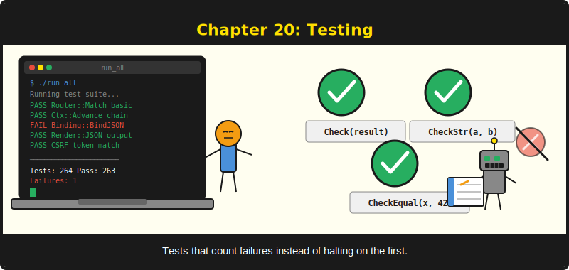

# บทที่ 20: Testing



*264 assertion ที่ทำให้คุณ refactor ได้โดยไม่หวาดกลัว*

---

**เมื่ออ่านบทนี้จบ ผู้อ่านจะสามารถ:**

- เขียน unit test สำหรับ handler และ middleware โดยใช้ test harness ของ PureSimple
- สร้าง object `RequestContext` ด้วยตนเองสำหรับการทดสอบ handler แบบ isolated
- ใช้ in-memory SQLite database สำหรับ integration test ที่รันโดยไม่ต้อง disk I/O
- จัดระเบียบ test ด้วยรูปแบบ `run_all.pb` พร้อมการจัดกลุ่มแบบ `BeginSuite`
- แยก test state ด้วย `Config::Reset`, `Session::ClearStore` และ `ResetMiddleware`

---

## 20.1 เหตุใด Test จึงสำคัญยิ่งกว่าใน Compiled Language

ใน Python หรือ JavaScript คุณสามารถเริ่มแอปพลิเคชัน ลองในเบราว์เซอร์ และเห็นทันทีว่ามีอะไรพัง feedback loop เร็ว ใน compiled language feedback loop มีขั้นตอนการ compile เพิ่มเข้ามา หากคุณเปลี่ยน handler และต้องการตรวจสอบว่าทำงาน คุณต้อง compile, รัน, เปิดเบราว์เซอร์, นำทางไปยังหน้านั้น แล้วตรวจสอบผล นั่นคือห้าขั้นตอนที่ Python ทำได้ในสองขั้นตอน

Test ย่นขั้นตอนทั้งห้าเหลือหนึ่งเดียว: compile และรัน test binary test binary ออกกำลังกาย handler, middleware และ database query โดยไม่ต้องเริ่ม HTTP server หรือเปิดเบราว์เซอร์ รันในหน่วยมิลลิวินาที ไม่ใช่นาที และตรวจสอบทุกอย่าง ทุกครั้ง รวมถึง feature ที่คุณเปลี่ยนเมื่อหกเดือนก่อนและลืมไปแล้ว

test suite ปัจจุบันของ PureSimple มี 264 assertion ใน 11 test file ทุก assertion รันทุกครั้ง ทุก phase ต้องผ่าน test ทั้งหมดก่อน merge ไม่มี "ความล้มเหลวที่รู้จัก" ไม่มี test ที่ถูก mark ว่า "ข้าม" หากอยู่ใน suite ต้องผ่าน assertion 264 ตัวทั้งหมดต้องผ่าน อย่างน้อยก็ขณะที่ compile หน้านี้

## 20.2 Test Harness เจาะลึก

เราแนะนำ test harness ในบทที่ 3 นี่คือการพิจารณาเชิงลึกว่ามันทำงานอย่างไรและใช้อย่างมีประสิทธิภาพสำหรับการทดสอบระดับ framework ได้อย่างไร

harness อยู่ใน `tests/TestHarness.pbi` และให้เครื่องมือห้าอย่าง:

```purebasic
; ตัวอย่างที่ 20.1 -- test harness API
; From tests/TestHarness.pbi

BeginSuite(name)       ; label a group of related checks
Check(expr)            ; fails if expr is #False
CheckEqual(a, b)       ; fails if a <> b (numeric)
CheckStr(a, b)         ; fails if a <> b (string)
PrintResults()         ; print summary; exit code 0 or 1
```

`Check`, `CheckEqual` และ `CheckStr` เป็น macro ไม่ใช่ procedure นี่เป็นการตัดสินใจออกแบบโดยเจตนา Macro ขยายตอน compile ซึ่งหมายความว่า `#PB_Compiler_File` และ `#PB_Compiler_Line` resolve ไปยังไฟล์และหมายเลขบรรทัดของผู้เรียก ไม่ใช่ไฟล์ harness เมื่อ test ล้มเหลว output จะบอกตำแหน่งที่แน่นอน:

```
  FAIL  CheckStr @ tests/P8_Config_Test.pbi:24 => "9091" <> "9090"
```

หมายเลขบรรทัดนั้นชี้ไปยัง assertion ในโค้ด test ของคุณ ไม่ใช่บรรทัด 51 ของ `TestHarness.pbi` นี่คือเหตุผลทั้งหมดที่ harness ใช้ macro การเรียก procedure จะรายงานหมายเลขบรรทัดของตัวเอง ซึ่งไม่มีประโยชน์อะไรเลย

> **ข้อควรระวังใน PureBasic:** PureBasic 6.x กำหนด `Assert()` และ `AssertString()` ไว้ล่วงหน้าเป็น built-in halt-on-fail macro จาก `pureunit.res` การนิยามซ้ำจะเกิด silent conflict harness หลีกเลี่ยงสิ่งนี้โดยใช้ `Check`, `CheckEqual` และ `CheckStr` ซึ่งเป็นชื่อที่ไม่ขัดแย้ง และยังทำให้ความแตกต่างชัดเจน: PureUnit หยุดเมื่อล้มเหลวครั้งแรก ส่วน harness ของ PureSimple ดำเนินต่อและรายงานความล้มเหลวทั้งหมด

### วิธีที่ Harness นับ

counter global สอง ตัว คือ `_PS_PassCount` และ `_PS_FailCount` ติดตามทุก assertion แต่ละ macro `Check*` เรียก helper procedure ที่เพิ่มค่า counter ใดค่าหนึ่ง เมื่อจบ suite `PrintResults` รวมผล:

```purebasic
; ตัวอย่างที่ 20.2 -- จาก tests/TestHarness.pbi: helper CheckEqual
Procedure _PS_CheckEqual(a.i, b.i, file.s, line.i)
  If a = b
    _PS_PassCount + 1
  Else
    _PS_FailCount + 1
    PrintN("  FAIL  CheckEqual @ " + file + ":" +
      Str(line) + " => " + Str(a) + " <> " + Str(b))
  EndIf
EndProcedure
```

assertion ที่ผ่านไม่สร้าง output มีแค่ความล้มเหลวเท่านั้นที่สร้าง output ทำให้การรัน test สะอาด เมื่อทุกอย่างผ่าน คุณเห็นชื่อ suite และ summary เมื่อมีบางอย่างพัง ความล้มเหลวนั้นโดดเด่นทันทีเพราะเป็น output เดียวระหว่าง suite header กับ summary

```purebasic
; ตัวอย่างที่ 20.3 -- จาก tests/TestHarness.pbi: PrintResults
Procedure.i PrintResults()
  Protected Total.i = _PS_PassCount + _PS_FailCount
  PrintN("")
  PrintN("======================================")
  If _PS_FailCount = 0
    PrintN("  ALL TESTS PASSED  (" +
      Str(Total) + " assertions)")
  Else
    PrintN("  FAILURES: " + Str(_PS_FailCount) +
      " / " + Str(Total))
  EndIf
  PrintN("======================================")
  ProcedureReturn Bool(_PS_FailCount = 0)
EndProcedure
```

`PrintResults` คืน `#True` หากผ่านทั้งหมด และ `#False` หากไม่ จุด entry point `run_all.pb` ใช้ค่า return นี้เพื่อตั้ง exit code ของ process:

```purebasic
; ตัวอย่างที่ 20.4 -- จาก tests/run_all.pb: ออกด้วย exit code ที่ถูกต้อง
If PrintResults()
  End 0
Else
  End 1
EndIf
```

non-zero exit code สำคัญมากสำหรับ CI และ deployment deploy script (บทที่ 19) รัน test binary และตรวจสอบ exit code หาก test ล้มเหลว การ deploy หยุด หากไม่มี exit code นั้น script จะ deploy โค้ดที่เสียหายอย่างสบายใจ และคุณจะพบปัญหาจาก bug report ของลูกค้า ตอนตีสาม

> **เปรียบเทียบ:** `Assert()` ของ PureUnit เทียบเท่ากับ `testing.Fatal()` ของ Go คือหยุดเมื่อล้มเหลวครั้งแรก คุณจึงเห็น test ที่เสียแค่อันเดียวต่อการรัน ส่วน `Check()` ของ PureSimple เทียบเท่ากับ `testing.Error()` ของ Go คือบันทึกความล้มเหลวและดำเนินต่อ คุณจึงเห็น test ที่เสียทั้งหมดในการรันเดียว เมื่อมี 264 assertion การเห็นความล้มเหลวทั้งหมดพร้อมกันช่วยประหยัดเวลา compile-run-fix-one-compile-run-fix-another

## 20.3 รูปแบบ run_all.pb

PureSimple ใช้ entry point เดียว คือ `tests/run_all.pb` ที่ include ทุก test file สร้าง test binary หนึ่งไฟล์ที่รัน assertion ทั้งหมด

```purebasic
; ตัวอย่างที่ 20.5 -- จาก tests/run_all.pb
EnableExplicit

; Pull in the framework
XIncludeFile "../src/PureSimple.pb"

; Test harness (macros + counters)
XIncludeFile "TestHarness.pbi"

; Phase test files
PrintN("PureSimple Test Suite")
PrintN("=====================")
PrintN("")

XIncludeFile "P0_Harness_Test.pbi"
XIncludeFile "P1_Router_Test.pbi"
XIncludeFile "P2_Middleware_Test.pbi"
XIncludeFile "P3_Binding_Test.pbi"
XIncludeFile "P4_Rendering_Test.pbi"
XIncludeFile "P5_Groups_Test.pbi"
XIncludeFile "P6_SQLite_Test.pbi"
XIncludeFile "P7_Auth_Test.pbi"
XIncludeFile "P8_Config_Test.pbi"
XIncludeFile "P9_Examples_Test.pbi"
XIncludeFile "P10_MultiDB_Test.pbi"

If PrintResults()
  End 0
Else
  End 1
EndIf
```

รูปแบบนี้เรียบง่าย: include framework, include harness, include แต่ละ test file, print ผล, ออก การเพิ่ม test ของ phase ใหม่หมายถึงการเพิ่มบรรทัด `XIncludeFile` หนึ่งบรรทัด ลำดับ include ตามหมายเลข phase ซึ่งตามลำดับ dependency ด้วย test P0 ทดสอบ harness เอง P1 ทดสอบ router (ที่พึ่งพา harness), P2 ทดสอบ middleware (ที่พึ่งพา router) และเป็นเช่นนี้ต่อไป

คุณ compile และรัน suite ด้วยสองคำสั่ง:

```bash
# ตัวอย่างที่ 20.6 -- Compile และรัน test suite
$PUREBASIC_HOME/compilers/pbcompiler tests/run_all.pb \
  -cl -o run_all
./run_all
```

Flag `-cl` จำเป็นมาก หากขาด PureBasic จะสร้าง GUI binary ที่ไม่สามารถ print ไปยัง terminal ได้ และ test output ของคุณจะไปไหนไม่รู้ คุณจะจ้องหน้าจอว่างๆ สงสัยว่า test ผ่านหรือเปล่า ไม่ผ่านหรอก output ไปอยู่ในหน้าต่างที่มองไม่เห็น เชื่อผู้เขียนเถอะ

การรันที่สำเร็จหน้าตาแบบนี้:

```
PureSimple Test Suite
=====================

  [Suite] P0 — Harness Self-Test
  [Suite] P1 — Router
  [Suite] P2 — Middleware
  [Suite] P3 — Binding
  [Suite] P4 — Rendering
  [Suite] P5 — Groups
  [Suite] P6 — SQLite
  [Suite] P7 — Auth
  [Suite] P8 — Config / Log / Modes
  [Suite] P9 — Examples
  [Suite] P10 — Multi-DB

======================================
  ALL TESTS PASSED  (264 assertions)
======================================
```

การรันที่ล้มเหลวจะแสดงความล้มเหลวแบบ inline:

```
  [Suite] P8 — Config / Log / Modes
  FAIL  CheckStr @ tests/P8_Config_Test.pbi:24
    => "9091" <> "9090"

======================================
  FAILURES: 1 / 264
======================================
```

## 20.4 การเขียน Unit Test สำหรับ Handler

unit test ออกกำลังกาย function เดียวแบบ isolated สำหรับ handler หมายถึงการเรียก handler procedure โดยตรงพร้อม `RequestContext` ที่สร้างด้วยตนเอง จากนั้นตรวจสอบสถานะของ context หลังจากนั้น

นี่คือวิธีที่ test P8 Config ออกกำลังกาย โมดูล `Config`:

```purebasic
; ตัวอย่างที่ 20.7 -- จาก tests/P8_Config_Test.pbi: unit test สำหรับ Config
Procedure P8_Config_Tests()
  Protected result.i, val.s, ival.i

  ; Load a known .env file
  Config::Reset()
  result = Config::Load("tests/test.env")
  Check(result)   ; file loaded successfully

  ; Verify parsed values
  CheckStr(Config::Get("PORT"),     "9090")
  CheckStr(Config::Get("MODE"),     "release")
  CheckStr(Config::Get("APP_NAME"), "PureSimple")
  CheckStr(Config::Get("DB_PATH"),  "data/test.db")

  ; Empty values are stored, not skipped
  Check(Config::Has("EMPTY_VAL"))
  CheckStr(Config::Get("EMPTY_VAL"), "")

  ; Comments must not appear as keys
  Check(Not Config::Has(
    "# This line is a comment and should be ignored"))

  ; Fallback defaults
  CheckStr(Config::Get("NONEXISTENT_KEY", "fallback"),
    "fallback")
  CheckEqual(Config::GetInt("MISSING_INT", 42), 42)
EndProcedure

P8_Config_Tests()
```

สังเกตรูปแบบ: แต่ละ test procedure เป็นอิสระในตัวเอง มันตั้งค่า state (โหลดไฟล์ที่รู้จัก) ออกกำลังกายโมดูล (เรียก `Get`, `GetInt`, `Has`) และตรวจสอบผล (ใช้ `Check`, `CheckStr`, `CheckEqual`) procedure ถูกเรียกทันทีหลังจากกำหนด PureBasic ไม่มี test runner ที่ค้นหา test โดยอัตโนมัติ คุณเขียน procedure แล้วก็เรียกมัน

> **เคล็ดลับ:** เริ่มต้นแต่ละ test procedure ด้วยการ reset state ที่แชร์กัน `Config::Reset()` ล้าง config map `Session::ClearStore()` ล้างข้อมูล session `ResetMiddleware()` ลบ middleware ที่ลงทะเบียนไว้ หากไม่ reset state ที่เหลือจาก test suite หนึ่งจะกลายเป็น mystery bug ของ suite ถัดไป ผู้เขียนเคยเสียสี่สิบนาทีในการ debug ความล้มเหลวที่เกิดเฉพาะเมื่อรัน suite ทั้งหมด การรันไฟล์ test เดียวเองก็ผ่าน แต่รัน test ทั้งหมดก็แดง สาเหตุคือค่า config จาก suite ก่อนหน้าที่เปลี่ยนพฤติกรรมของ suite ถัดมา เรียก `Reset` เสมอ

## 20.5 การทดสอบ Runtime Override

test suite ของ Config ยังตรวจสอบ runtime override ด้วย ซึ่งเป็นความสามารถในการตั้งค่าด้วยโปรแกรมโดยไม่ต้องมีไฟล์ `.env` สิ่งนี้สำคัญมากสำหรับการทดสอบ เพราะคุณต้องการจำลอง configuration ต่างๆ โดยไม่ต้องเขียนไฟล์ชั่วคราว

```purebasic
; ตัวอย่างที่ 20.8 -- การทดสอบ runtime override
; Runtime Set
Config::Set("RUNTIME_KEY", "hello")
CheckStr(Config::Get("RUNTIME_KEY"), "hello")

; Override an existing key
Config::Set("PORT", "1234")
CheckEqual(Config::GetInt("PORT"), 1234)

; Has detects dynamically set keys
Check(Config::Has("MODE"))
Check(Not Config::Has("DEFINITELY_MISSING"))

; Reset clears everything
Config::Reset()
Check(Not Config::Has("PORT"))
Check(Not Config::Has("MODE"))
```

แต่ละ assertion ทดสอบพฤติกรรมเฉพาะหนึ่งอย่าง `Set` เก็บค่า `Set` บน key ที่มีอยู่แล้ว overwrite มัน `Has` คืน `#True` สำหรับ key ที่มีอยู่และ `#False` สำหรับ key ที่ไม่มี `Reset` ล้าง key ทั้งหมด นี่ไม่ใช่ test ที่ซับซ้อน ไม่จำเป็นต้องเป็น คุณค่าของมันมาจากการรันอัตโนมัติทุกครั้ง จับ regression ที่การทดสอบด้วยตนเองจะพลาด

## 20.6 การทดสอบ Engine Mode

test Engine mode ตรวจสอบว่า `SetMode` และ `Mode` ทำงานเป็นคู่ getter/setter และ default mode คือ `"debug"`:

```purebasic
; ตัวอย่างที่ 20.9 -- การทดสอบ run mode
; Default is "debug"
CheckStr(Engine::Mode(), "debug")

; Set to release
Engine::SetMode("release")
CheckStr(Engine::Mode(), "release")

; Set to test
Engine::SetMode("test")
CheckStr(Engine::Mode(), "test")

; Restore default for other tests
Engine::SetMode("debug")
```

บรรทัดสุดท้าย การคืน default กลับ สำคัญมาก หาก test suite นี้ตั้ง mode เป็น `"test"` แล้วไม่คืนกลับ ทุก test ที่ตามมาจะรันใน test mode บาง test อาจทำงานต่างออกไปใน test mode ความล้มเหลวจะปรากฏใน test file ที่ไม่เกี่ยวข้องกันเลย และคุณจะต้องเสียหนึ่งชั่วโมงในการอ่านโค้ดผิดที่ คืน default เสมอ ทุกครั้ง

## 20.7 การทดสอบ Log Output

Log output ทดสอบยากกว่าค่า config เพราะ log เขียนลง stdout หรือไฟล์ test suite P8 จัดการเรื่องนี้โดย redirect log output ไปยังไฟล์ชั่วคราวและตรวจสอบว่าไฟล์ถูกสร้างพร้อม content:

```purebasic
; ตัวอย่างที่ 20.10 -- การทดสอบ log output
; Redirect to temp file to avoid polluting test output
Log::SetOutput("tests/p8_log_test_tmp.txt")
Log::SetLevel(Log::#LevelDebug)

; Write at all levels
Log::Dbg("debug message")
Log::Info("info message")
Log::Warn("warn message")
Log::Error("error message")

; Restore defaults
Log::SetOutput("")
Log::SetLevel(Log::#LevelInfo)

; Verify the file exists and has content
Check(FileSize("tests/p8_log_test_tmp.txt") > 0)

; Clean up
DeleteFile("tests/p8_log_test_tmp.txt")
```

นี่เป็นวิธีที่ใช้งานได้จริง มันไม่ตรวจสอบ content แน่นอนของแต่ละ log line เพราะจะทำให้ test เปราะบาง พังทุกครั้งที่เปลี่ยน timestamp format แต่ตรวจสอบว่าระบบ log เขียนบางอย่างลงไฟล์ การกรองระดับถูกทดสอบโดยปริยาย: หาก `SetLevel(Log::#LevelDebug)` ไม่ทำงาน debug message จะไม่ถูกเขียน และไฟล์อาจเล็กกว่าที่คาด

> **เบื้องหลังการทำงาน:** test ใช้ `FileSize` เพื่อตรวจสอบไฟล์ ไม่ใช่ `FileExists` (ซึ่งไม่มีใน PureBasic) `FileSize` คืน `-1` สำหรับไฟล์ที่ไม่มีอยู่และจำนวน byte สำหรับไฟล์ที่มีอยู่ การตรวจสอบ `FileSize(path) > 0` ยืนยันทั้งการมีอยู่และ content ที่ไม่ว่างในการเรียกครั้งเดียว

## 20.8 Integration Testing ด้วย In-Memory SQLite

Unit test ออกกำลังกาย function แต่ละตัว Integration test ออกกำลังกาย component หลายตัวที่ทำงานร่วมกัน สำหรับ PureSimple รูปแบบ integration test ที่พบบ่อยที่สุดเกี่ยวข้องกับ in-memory SQLite database

โหมด `:memory:` ของ SQLite สร้างฐานข้อมูลที่อยู่ในหน่วยความจำ RAM ทั้งหมด มันเร็ว (ไม่มี disk I/O), isolated (ไม่มี shared state ระหว่าง test) และถูก destroy อัตโนมัติเมื่อ database handle ถูกปิด ทำให้เหมาะมากสำหรับการทดสอบ handler ที่ต้องพึ่งพาฐานข้อมูล

```purebasic
; ตัวอย่างที่ 20.11 -- Integration test ด้วย in-memory SQLite
Procedure TestPostCreation()
  Protected db.i

  ; Open in-memory database
  db = DB::Open(":memory:")
  Check(db <> 0)

  ; Run migrations
  DB::Exec(db, "CREATE TABLE posts (" +
    "id INTEGER PRIMARY KEY AUTOINCREMENT, " +
    "title TEXT NOT NULL, " +
    "slug TEXT NOT NULL UNIQUE, " +
    "body TEXT NOT NULL DEFAULT '')")

  ; Insert a post
  DB::Exec(db, "INSERT INTO posts (title, slug, body)" +
    " VALUES ('Hello', 'hello', 'World')")

  ; Query it back
  DB::Query(db, "SELECT title, slug FROM posts " +
    "WHERE slug = 'hello'")
  Check(DB::NextRow(db))
  CheckStr(DB::GetStr(db, 0), "Hello")
  CheckStr(DB::GetStr(db, 1), "hello")

  ; Clean up
  DB::Close(db)
EndProcedure
```

รูปแบบคือ: เปิด in-memory database, สร้าง schema, insert ข้อมูลทดสอบ, query กลับมา, ตรวจสอบผล, ปิดฐานข้อมูล แต่ละ test procedure มีฐานข้อมูลเป็นของตัวเอง ไม่มี test ใดรบกวน test อื่น ไม่มี test ใดทิ้งไฟล์ `.db` ไว้ที่ทำให้นักพัฒนาคนถัดมาสับสน

> **เคล็ดลับ:** ใช้ `:memory:` สำหรับ test database มันเร็วกว่า file-based SQLite (ไม่มี disk I/O), สะอาดอัตโนมัติ (ไม่มีข้อมูลค้างระหว่างการรัน) และไม่ต้องโค้ด cleanup ข้อเสียเพียงอย่างเดียวคือคุณตรวจสอบฐานข้อมูลหลัง test เสร็จไม่ได้ แต่หาก test ล้มเหลว output ของ assertion จะบอกคุณว่าผิดอะไร

## 20.9 Regression Testing

regression test ตรวจสอบว่า bug ที่แก้ไขแล้ว ยังคงถูกแก้ไขอยู่ ใน PureSimple รูปแบบ `run_all.pb` เป็น regression test suite โดยธรรมชาติ ทุก assertion จากทุก phase รันทุกครั้ง หาก phase P5 นำการ interaction ที่ subtle ระหว่าง route group และ middleware มา และ phase P8 พังโดยบังเอิญ test P5 จะจับมันได้

นี่คือเหตุผลที่กฎของ project เข้มงวด: ทุก phase ต้องผ่าน test ทั้งหมดก่อน merge ไม่ใช่แค่ test ของ phase ใหม่ การเปลี่ยนแปลงที่ทำให้ P8 ผ่านแต่ทำให้ P2 พังไม่ใช่การแก้ไข มันเป็นการแลก

ประโยชน์ที่เป็นรูปธรรมคือความมั่นใจ เมื่อคุณ refactor internal ของ router ใน phase ถัดมา คุณรัน `./run_all` และเห็น assertion 264 ตัวสีเขียว หรือข้อความความล้มเหลวที่ชัดเจนที่ชี้ไปยังไฟล์และบรรทัดที่พัง คุณไม่ต้องทดสอบทุก feature ในเบราว์เซอร์ด้วยตนเอง ไม่ต้องเก็บ checklist ของ "สิ่งที่ต้องตรวจสอบหลังเปลี่ยน router" test suite คือ checklist ของคุณ และมันไม่เคยลืมรายการใดๆ

## 20.10 แนวทางการจัดระเบียบ Test

หลังจากเขียน test มาสิบ phase รูปแบบก็เริ่มชัดเจน นี่คือแนวทางที่ทำให้ test suite ดูแลรักษาได้เมื่อเติบโต

**หนึ่ง test file ต่อหนึ่ง phase** แต่ละ phase มีไฟล์ `.pbi` เป็นของตัวเอง: `P0_Harness_Test.pbi`, `P1_Router_Test.pbi` และต่อไป ทำให้แต่ละไฟล์มีจุดมุ่งหมายชัดเจนและหา test สำหรับ feature เฉพาะได้ง่าย

**หนึ่ง procedure ต่อหนึ่ง test area** ภายใน test file ให้จัดกลุ่ม assertion ที่เกี่ยวข้องเป็น procedure: `P8_Config_Tests()`, `P8_Log_Tests()`, `P8_Mode_Tests()` เรียกแต่ละ procedure ที่ด้านล่างของไฟล์ ให้การจัดกลุ่มเชิงตรรกะโดยไม่ต้องการ discovery mechanism ของ test framework

**Reset state ที่ต้น คืน default ที่ท้าย** เริ่มต้นแต่ละ test procedure ด้วย `Config::Reset()` หรือการเรียก cleanup ที่เหมาะสม จบด้วยการคืน global state ใดๆ (อย่าง `Engine::SetMode("debug")`) กลับสู่ default test procedure ถัดไปควรเห็น environment ที่สะอาด

**ใช้ `BeginSuite` เพื่อ output ที่อ่านได้** label ของ suite ใน output ของ test บอกคุณว่า assertion กลุ่มใดกำลังรัน เมื่อทุกอย่างผ่าน suite label เป็น output เดียวนอกจาก summary เมื่อมีบางอย่างล้มเหลว suite label บอกคุณว่าควรตรวจสอบพื้นที่ใด

```purebasic
; ตัวอย่างที่ 20.12 -- การจัดระเบียบ test ด้วย BeginSuite
BeginSuite("P8 -- Config / Log / Modes")
P8_Config_Tests()
; P8_Log_Tests() would go here
; P8_Mode_Tests() would go here
```

**ทดสอบ sad path ด้วย** เป็นเรื่องล่อใจที่จะทดสอบแค่ happy path: input ที่ถูกต้อง, ไฟล์ที่มีอยู่, parameter ที่ถูกต้อง แต่ bug ซ่อนตัวอยู่ใน sad path: ไฟล์ที่หายไป, string ว่าง, ข้อมูลไม่ถูกต้อง, ค่าที่เกิน range test suite P8 ทดสอบว่า `Config::Load` คืน `#False` สำหรับไฟล์ที่ไม่มีอยู่ ว่า `Get` คืน fallback สำหรับ key ที่ไม่มี และว่า `Has` คืน `#False` สำหรับ key ที่ไม่มี test "น่าเบื่อ" เหล่านี้จับ bug จริงๆ

> **คำเตือน:** อย่าข้าม test เพื่อทำให้ suite รันเร็วขึ้น หาก test ช้า ทำให้เร็วขึ้น (ใช้ `:memory:` แทน file-based SQLite) หาก test ไม่น่าเชื่อถือ แก้สาเหตุที่แท้จริง (ปกติคือ shared mutable state) การข้าม test คือหนี้ทางเทคนิคที่มีดอกเบี้ยทบต้น คุณคิดว่ากำลังประหยัดเวลาตอนนี้ แต่กำลังยืมมันจาก debugging session ในอนาคต

## 20.11 การทดสอบ Middleware Chain

unit test สำหรับ handler แต่ละตัวมีคุณค่า แต่ bug หลายตัวซ่อนอยู่ใน interaction ระหว่าง middleware MiddlewareA รันก่อน MiddlewareB ไหม? handler เห็นค่าที่ middleware ตั้งไว้หรือเปล่า? การทดสอบ chain เต็มรูปแบบโดยไม่เริ่ม HTTP server ให้ความมั่นใจว่าลำดับ middleware ของคุณถูกต้อง

รูปแบบนั้นตรงไปตรงมา: สร้าง `RequestContext` ด้วยตนเอง เพิ่ม handler ด้วย `Ctx::AddHandler` และเรียก `Ctx::Dispatch` เพื่อรัน chain แต่ละ middleware เรียก `Ctx::Advance` เพื่อส่งต่อการควบคุมไปยัง handler ถัดไป แล้วคุณตรวจสอบสถานะสุดท้ายของ context

```purebasic
; ตัวอย่างที่ 20.13 -- การทดสอบ middleware chain
BeginSuite("Middleware chain ordering")

Ctx::Init(@testCtx, "GET", "/test")
Ctx::AddHandler(@testCtx, @MiddlewareA())
Ctx::AddHandler(@testCtx, @MiddlewareB())
Ctx::AddHandler(@testCtx, @TestHandler())
Ctx::Dispatch(@testCtx)

CheckStr(Ctx::Get(@testCtx, "order"), "A-B-handler")
CheckEqual(testCtx\StatusCode, 200)
```

แต่ละ middleware ในตัวอย่างนี้ต่อชื่อของตัวเองไปยัง key `"order"` ใน key-value store ของ context หลัง dispatch test ตรวจสอบว่าทั้งสามรันตามลำดับที่คาดไว้ เทคนิคนี้มีคุณค่าเพราะทดสอบพฤติกรรมของ middleware chain โดยไม่มี HTTP overhead ใดๆ ไม่มี socket ไม่มี parsing ไม่มี serialisation หากลำดับผิด assertion `CheckStr` จะล้มเหลวพร้อมข้อความที่ชัดเจนแสดงลำดับการ execute จริงเทียบกับที่คาดไว้

เทคนิคนี้มีประโยชน์มากเป็นพิเศษเมื่อ debug middleware ที่พึ่งพา middleware อื่น หาก auth middleware ของคุณคาดว่า session ถูกโหลดแล้ว คุณสามารถเพิ่มทั้ง session middleware และ auth middleware ลงใน test chain และตรวจสอบว่าทั้งสองร่วมมือกันได้ถูกต้อง ทั้งหมดนี้ภายใน test procedure เดียว

---

## สรุป

การทดสอบใน PureSimple ปฏิบัติตามรูปแบบที่ตรงไปตรงมา: macro จับข้อมูล file และ line สำหรับการรายงานความล้มเหลว, helper procedure เพิ่ม counter ผ่าน/ล้มเหลว และ `PrintResults` สร้าง summary พร้อม exit code ที่ถูกต้อง entry point `run_all.pb` include ทุก test file และสร้าง binary เดียวที่ออกกำลังกาย assertion ทั้ง 264 ตัว unit test เรียก module procedure โดยตรงพร้อม input ที่รู้จัก integration test ใช้ in-memory SQLite สำหรับการทดสอบฐานข้อมูลที่เร็วและ isolated ทุก phase ต้องผ่าน test ทั้งหมด ไม่ใช่แค่ของตัวเอง ก่อน merge

## ประเด็นสำคัญ

- **Harness ใช้ macro ด้วยเหตุผล** `Check`, `CheckEqual` และ `CheckStr` เป็น macro เพื่อให้ `#PB_Compiler_File` และ `#PB_Compiler_Line` resolve ที่ call site ให้ตำแหน่งความล้มเหลวที่แม่นยำ
- **Binary เดียว test ทั้งหมด** รูปแบบ `run_all.pb` สร้าง test binary เดียวที่รัน assertion ทุกตัว การเพิ่ม test file ใหม่หมายถึงการเพิ่มบรรทัด `XIncludeFile` หนึ่งบรรทัด
- **Reset state ระหว่าง suite** เรียก `Config::Reset()`, `Session::ClearStore()` และ `Engine::SetMode("debug")` เพื่อป้องกัน state ของ suite หนึ่งปนเปื้อน suite ถัดไป
- **ใช้ `:memory:` สำหรับ database test** in-memory SQLite เร็ว isolated และไม่ต้องการ cleanup

## คำถามทบทวน

1. เหตุใด test harness จึงใช้ macro แทน procedure สำหรับ `Check`, `CheckEqual` และ `CheckStr`? อะไรจะเปลี่ยนไปหากพวกมันเป็น procedure?
2. อธิบายว่าทำไมการที่ deploy script รัน `./run_all` บนเซิร์ฟเวอร์ก่อน swap ไบนารีจึงเป็น safety net ที่สำคัญ bug ประเภทใดที่สิ่งนี้จับได้ที่การทดสอบ local อาจพลาด?
3. *ลองทำ:* เขียน test file (`P_Custom_Test.pbi`) ที่ใช้ `BeginSuite`, ทดสอบ procedure ง่ายๆ ที่คุณกำหนดเอง (เช่น string formatting function), รวม assertion ที่ผ่านและ assertion ที่ตั้งใจให้ล้มเหลว แล้วสังเกตรูปแบบ output จากนั้นแก้ไข assertion ที่ล้มเหลว recompile และยืนยันว่า test ทั้งหมดผ่าน
