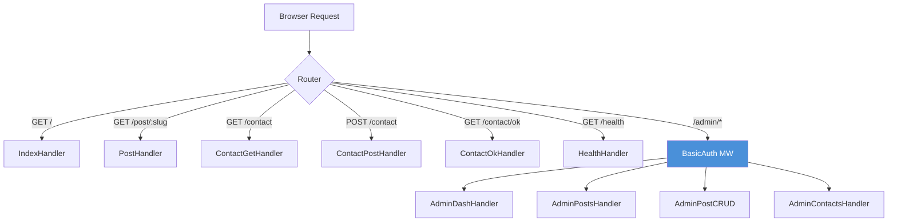

# บทที่ 22: สร้าง Blog — Wild & Still

*PureBasic 596 บรรทัด Binary ตัวเดียว Blog ที่ใช้งาน production ได้*

---

**หลังจากอ่านบทนี้จบ คุณจะสามารถ:**

- ออกแบบ route map ที่แยกส่วน public และ admin ด้วย route group
- สร้าง SQLite schema แบบ migration-driven พร้อม seed data สำหรับแอปพลิเคชันที่มีเนื้อหาหลากหลาย
- นำ pipe-delimited string pattern มาใช้ส่งข้อมูลที่มีโครงสร้างจาก handler ไปยัง PureJinja template
- สร้าง admin CRUD interface ที่ป้องกันด้วย BasicAuth แบบสมบูรณ์
- ประยุกต์ใช้ pattern Post/Redirect/Get (PRG) เพื่อป้องกันการส่งฟอร์มซ้ำ

---

## 22.1 ทำไมบทนี้จึงสำคัญ

นี่คือบทสรุปทั้งหมด ทุกแนวคิดจากยี่สิบเอ็ดบทที่ผ่านมาบรรจบกันที่นี่ Routing (บทที่ 5), request context (บทที่ 6), middleware (บทที่ 7), request binding (บทที่ 8), response rendering (บทที่ 9), route group (บทที่ 10), PureJinja templates (บทที่ 11), SQLite (บทที่ 13), database patterns (บทที่ 14), authentication (บทที่ 16), configuration (บทที่ 18) — ทั้งหมดปรากฏในแอปพลิเคชันเดียวที่ทำงานได้จริง

แอปพลิเคชันนี้ชื่อ *Wild & Still* เป็น blog ภาพถ่ายธรรมชาติ มีเว็บไซต์สาธารณะที่ใช้ Massively HTML5 UP theme มีแผง admin ที่ใช้ Tabler UI kit มีฐานข้อมูล SQLite ที่มี migration สิบรายการ มี seed post ห้าบทพร้อมเนื้อหาจริง มีฟอร์มติดต่อพร้อม server-side validation และมี health check endpoint รันบน production server ผ่าน Caddy พร้อม HTTPS และ deploy ด้วย shell script เดียว

PureBasic 596 บรรทัด Binary ตัวเดียว Blog ที่ใช้ production ได้จริง React app ของคุณมีโค้ดมากกว่านี้แค่ใน webpack config

source code ทั้งหมดอยู่ที่ `examples/massively/main.pb` ใน PureSimple repository บทนี้จะอธิบายทุกส่วนของไฟล์นั้น ชี้แจงว่าแต่ละส่วนมีไว้ทำไม และเชื่อมโยงกับบทที่แนวคิดหลักถูกนำเสนอครั้งแรก ถ้าคุณอ่านมาตามลำดับ บทนี้คือผลตอบแทน ถ้าคุณข้ามมาที่นี่โดยตรง cross-reference จะบอกว่าต้องหาข้อมูลเพิ่มเติมที่ไหน

---

## 22.2 ภาพรวมสถาปัตยกรรม

ก่อนอ่านโค้ด มาดู route map กันก่อน blog มีผู้ใช้สองกลุ่ม: ผู้อ่านที่เยี่ยมชมเว็บไซต์สาธารณะ และผู้เขียนที่จัดการเนื้อหาผ่านแผง admin แต่ละกลุ่มมี route ของตัวเอง template ของตัวเอง และข้อกำหนด middleware ของตัวเอง


*รูปที่ 22.1 — Route map ของ blog ส่วน public route ผ่านเฉพาะ Logger และ Recovery middleware ส่วน admin route ผ่าน BasicAuth เพิ่มเติม*

ฝั่ง public มีหกเส้นทาง ฝั่ง admin มีเก้าเส้นทาง ทั้งสิบห้าเส้นทาง compile เป็น binary ตัวเดียว serve โดย process เดียว หนุนหลังด้วยไฟล์ SQLite ไฟล์เดียว memory footprint รวมขณะ idle คือสิ่งที่ framework ส่วนใหญ่ใช้แค่สำหรับ configuration parser

> **เบื้องหลัง:** Router ของ PureSimple เก็บแต่ละ route ใน radix trie หนึ่ง trie ต่อ HTTP method สิบห้า route ใน blog สร้าง trie node หกโหนดสำหรับ GET และสี่โหนดสำหรับ POST route table ทั้งหมดใช้หน่วยความจำแค่ไม่กี่ร้อย byte

---

## 22.3 โครงสร้างโปรเจกต์

blog ใช้ layout เดียวกับที่ `scripts/new-project.sh` สร้าง พร้อมส่วนเพิ่มเติมสำหรับฐานข้อมูลและ template สองธีม:

```
examples/massively/
  main.pb                    -- แอปพลิเคชันทั้งหมด
  .env                       -- PORT, MODE, ADMIN_USER, ADMIN_PASS
  .env.example               -- template ที่มีคำอธิบาย
  db/
    blog.db                  -- ฐานข้อมูล SQLite (สร้างอัตโนมัติ)
  templates/
    base.html                -- layout ของธีม Massively
    index.html               -- หน้ารายการ post
    post.html                -- หน้า post เดียว
    contact.html             -- ฟอร์มติดต่อ
    contact_ok.html          -- หน้าขอบคุณ
    404.html                 -- หน้า not-found แบบกำหนดเอง
    admin/
      dashboard.html         -- แผง admin (Tabler)
      posts.html             -- ตารางจัดการ post
      post_form.html         -- ฟอร์มสร้าง/แก้ไข post
      contacts.html          -- inbox ของข้อความติดต่อ
  static/
    css/                     -- Massively CSS + FontAwesome
    js/                      -- jQuery + Massively JS
    images/                  -- ภาพพื้นหลัง
    webfonts/                -- FontAwesome web fonts
```

แอปพลิเคชันทั้งหมดอยู่ในไฟล์เดียว: `main.pb` ไม่มีโครงสร้างไดเรกทอรี MVC ไม่มี model layer ไม่มีโฟลเดอร์ controller ไม่มี service abstraction สำหรับ blog ที่มีสิบห้า route หนึ่งไฟล์คือสถาปัตยกรรมที่เหมาะสม เมื่อไฟล์โตถึงพันบรรทัดค่อยแยก จนถึงตอนนั้นหนึ่งไฟล์หมายถึงหนึ่งที่ที่ต้องดู

> **เคล็ดลับ:** ไฟล์ `.env` ควบคุม admin credentials ใน production ตั้งค่า `ADMIN_USER` และ `ADMIN_PASS` เป็นอะไรก็ได้ที่ไม่ใช่ `admin`/`changeme` นี่คือย่อหน้าที่บอกว่า "ทำตามที่ฉันบอก ไม่ใช่ทำตามที่ฉันสาธิต"

---

## 22.4 Globals และ Helpers

ไฟล์เริ่มต้นด้วย global สองตัวและชุดของ helper procedure ที่ handler ต้องใช้

```purebasic
; ตัวอย่างที่ 22.1 -- จาก examples/massively/main.pb: globals
EnableExplicit

XIncludeFile "../../src/PureSimple.pb"

Global _db.i
Global _tplDir.s = "examples/massively/templates/"
```

`_db` เก็บ database handle ของ SQLite ที่ได้จาก `DB::Open` ทุก handler ที่แตะฐานข้อมูลอ้างถึง global นี้ `_tplDir` คือ path ไปยังไดเรกทอรี template ที่ส่งไปยัง `Rendering::Render` ในทุก handler ที่ render HTML ทั้งสองเป็น global เพราะ handler procedure ของ PureBasic ไม่สามารถรับ argument เพิ่มเติมได้ — parameter เดียวที่มีคือ `*C.RequestContext`

นี่คือข้อจำกัดที่ควรทำความเข้าใจ ใน Go คุณจะสร้าง struct ที่มี field `db` และ attach handler method เข้าไป ใน PureBasic คุณใช้ global หรือ KV store บน context Global ทำงานได้เมื่อคุณมีฐานข้อมูลหนึ่งตัวและ template directory หนึ่งตัว KV store ทำงานได้เมื่อ route ต่างกันต้องการค่าต่างกัน blog ใช้ global เพราะค่าไม่เคยเปลี่ยนหลังจากเริ่มต้น

### ฟังก์ชัน SafeVal

```purebasic
; ตัวอย่างที่ 22.2 -- SafeVal: ทำความสะอาดค่าสำหรับ KV store
Procedure.s SafeVal(s.s)
  ProcedureReturn ReplaceString(s, Chr(9), " ")
EndProcedure
```

procedure สามบรรทัดนี้ป้องกัน bug ที่ซ่อนอยู่อย่างแยบยล KV store บน `RequestContext` ใช้ตัวอักษร Tab (`Chr(9)`) เป็น delimiter ระหว่าง key และ value ใน string representation ภายใน ถ้าค่าจากฐานข้อมูลมีตัวอักษร tab — และข้อความที่ผู้ใช้ส่งมาสามารถมีได้แน่นอน — KV store จะทำให้การ parse ของตัวเองพัง `SafeVal` แทนที่ tab ด้วย space ก่อนที่ค่าใดจะเข้าสู่ store

> **เบื้องหลัง:** KV store คือ string เดียว ไม่ใช่ hash map แต่ละคู่ key-value เก็บเป็น `key\tvalue\n` การออกแบบนี้ทำให้การจัดสรร `RequestContext` ไม่ต้องสร้างหรือทำลาย map ต่อ request แต่มันทำให้ตัวอักษร delimiter มีความสำคัญมาก tab ในค่าจะแยกค่าออกเป็นสองส่วน `SafeVal` คือทางแก้ปัญหา

สามบรรทัดของโค้ด หนึ่ง bug ที่ป้องกันได้ นี่คือประเภทของฟังก์ชันที่คุ้มค่าด้วยความเสียหายที่มันป้องกัน ไม่ใช่งานที่มันทำ

### SetSiteVars: การนำตัวแปร Template สากลเข้ามา

```purebasic
; ตัวอย่างที่ 22.3 -- SetSiteVars: โหลด site settings เข้า context
Procedure SetSiteVars(*C.RequestContext)
  Protected siteName.s = "Wild & Still"
  Protected tagline.s  = "One frame. One story."

  If DB::Query(_db,
    "SELECT value FROM site_settings " +
    "WHERE key = 'site_name'")
    If DB::NextRow(_db)
      siteName = DB::GetStr(_db, 0)
    EndIf
    DB::Done(_db)
  EndIf
  If DB::Query(_db,
    "SELECT value FROM site_settings " +
    "WHERE key = 'tagline'")
    If DB::NextRow(_db)
      tagline = DB::GetStr(_db, 0)
    EndIf
    DB::Done(_db)
  EndIf
  Ctx::Set(*C, "site_name", SafeVal(siteName))
  Ctx::Set(*C, "tagline",   SafeVal(tagline))
EndProcedure
```

ทุกหน้า public ต้องการชื่อไซต์และ tagline สำหรับ header แทนที่จะ hardcode ค่าเหล่านี้ใน handler ทุกตัว `SetSiteVars` query ตาราง `site_settings` และใส่ผลลัพธ์เข้า context ถ้า database query ล้มเหลวหรือไม่มีแถว procedure จะ fallback ไปใช้ค่า hardcode เป็นการเขียนโปรแกรมแบบ defensive: blog ยัง render ได้แม้ settings table จะว่างเปล่า

pattern นี้ — ค่าเริ่มต้น ที่ถูก override โดย database lookup — ปรากฏตลอดทั้ง blog ทำให้แอปพลิเคชันยืดหยุ่นต่อสถานะข้อมูลที่ไม่สมบูรณ์ ซึ่งมีประโยชน์มากในช่วงพัฒนาเมื่อคุณอาจรันแอปก่อน migration ทั้งหมดเสร็จสมบูรณ์

### PostsToStr: รูปแบบ Pipe-Delimited

นี่คือ helper ที่สำคัญที่สุดในไฟล์ และมันนำเสนอ pattern ที่มีเฉพาะใน PureSimple's template integration

```purebasic
; ตัวอย่างที่ 22.4 -- PostsToStr: ข้อมูลที่มีโครงสร้างเป็น delimited string
Procedure.s PostsToStr()
  Protected result.s = ""
  If DB::Query(_db,
    "SELECT id, slug, title, published_at, " +
    "photo_url, excerpt, published" +
    " FROM posts WHERE published = 1 " +
    "ORDER BY published_at DESC")
    While DB::NextRow(_db)
      result +
        SafeVal(DB::GetStr(_db, 0)) + "|" +
        SafeVal(DB::GetStr(_db, 1)) + "|" +
        SafeVal(DB::GetStr(_db, 2)) + "|" +
        SafeVal(DB::GetStr(_db, 3)) + "|" +
        SafeVal(DB::GetStr(_db, 4)) + "|" +
        SafeVal(DB::GetStr(_db, 5)) + "|" +
        SafeVal(DB::GetStr(_db, 6)) + Chr(10)
    Wend
    DB::Done(_db)
  EndIf
  ProcedureReturn result
EndProcedure
```

KV store ส่งข้อมูลไปยัง PureJinja template เป็น string ไม่มีวิธีดั้งเดิมในการส่งรายการของ object ทางแก้คือ serialize ข้อมูลเป็น multi-line string โดยแต่ละบรรทัดแทนหนึ่งแถว และตัวอักษร pipe คั่น field Template จากนั้นใช้ filter `split` ของ PureJinja เพื่อสร้างโครงสร้างกลับมา

แต่ละบรรทัดอยู่ในรูปแบบ: `id|slug|title|published_at|photo_url|excerpt|published` `Chr(10)` ท้ายแต่ละบรรทัดเป็นตัวอักษร newline แบ่งแถว PureJinja แยกด้วย `\n` เพื่อได้บรรทัด แล้วแยกแต่ละบรรทัดด้วย `|` เพื่อได้ field

นี่ไม่ใช่วิธีที่สง่างาม ไม่ใช่วิธีที่คุณจะออกแบบกลไกถ่ายโอนข้อมูลหากเริ่มจากศูนย์ แต่นี่คือวิธีแก้ปัญหาเมื่อ template engine ทำงานกับ string และ context store คือ flat key-value map และมันได้ผล ใช้งาน production ได้ตั้งแต่ blog เปิดตัว บางครั้งวิธีแก้ปัญหาเชิง pragmatic คือวิธีที่ถูกต้อง

> **เปรียบเทียบ:** ใน `html/template` ของ Go คุณส่ง slice ของ struct ไปยัง `Execute` ได้โดยตรง ใน Jinja ของ Python คุณส่ง list ของ dictionary ใน PureSimple คุณส่ง pipe-delimited string แล้ว `split` ใน template แม่น้ำต่างกัน มหาสมุทรเดียวกัน blog post ยังคงปรากฏบนหน้าเว็บ

procedure `AllPostsToStr` เหมือนกันแต่ลบ filter `WHERE published = 1` ออก คืนค่าทั้ง post ที่ published และ draft แผง admin ใช้ตัวนี้ เว็บไซต์สาธารณะใช้ `PostsToStr`

---

## 22.5 Database Migrations

ฐานข้อมูลของ blog สร้างโดย migration สิบรายการ ลงทะเบียนใน procedure `InitDB` และใช้งานโดย `DB::Migrate` นี่คือ pattern จากบทที่ 14 (Database Patterns) ที่นำมาใช้ในระดับขนาดใหญ่

```purebasic
; ตัวอย่างที่ 22.5 -- InitDB: การลงทะเบียน migration (แบบย่อ)
Procedure InitDB()
  Protected sql.s
  Protected cols.s = " (slug, title, body, excerpt," +
    " photo_url, photo_credit, photo_license," +
    " photo_link, author, published_at," +
    " created_at, updated_at, published)"

  ; v1: ตาราง posts
  sql = "CREATE TABLE IF NOT EXISTS posts ("
  sql + "  id INTEGER PRIMARY KEY AUTOINCREMENT,"
  sql + "  slug TEXT UNIQUE NOT NULL,"
  sql + "  title TEXT NOT NULL,"
  sql + "  body TEXT NOT NULL,"
  sql + "  excerpt TEXT NOT NULL,"
  sql + "  photo_url TEXT NOT NULL,"
  sql + "  photo_credit TEXT NOT NULL,"
  sql + "  photo_license TEXT NOT NULL "
  sql + "    DEFAULT 'Pexels License',"
  sql + "  photo_link TEXT NOT NULL,"
  sql + "  author TEXT NOT NULL "
  sql + "    DEFAULT 'Jedt Sitth',"
  sql + "  published_at TEXT NOT NULL,"
  sql + "  created_at TEXT NOT NULL,"
  sql + "  updated_at TEXT NOT NULL,"
  sql + "  published INTEGER NOT NULL DEFAULT 1)"
  DB::AddMigration(1, sql)

  ; v2: ตาราง contacts
  sql = "CREATE TABLE IF NOT EXISTS contacts ("
  sql + "  id INTEGER PRIMARY KEY AUTOINCREMENT,"
  sql + "  name TEXT NOT NULL,"
  sql + "  email TEXT NOT NULL,"
  sql + "  message TEXT NOT NULL,"
  sql + "  submitted_at TEXT NOT NULL,"
  sql + "  is_read INTEGER NOT NULL DEFAULT 0)"
  DB::AddMigration(2, sql)

  ; v3: ตาราง site_settings
  sql = "CREATE TABLE IF NOT EXISTS site_settings ("
  sql + "  key TEXT PRIMARY KEY,"
  sql + "  value TEXT NOT NULL)"
  DB::AddMigration(3, sql)

  ; v4-v5: seed site settings
  DB::AddMigration(4,
    "INSERT OR IGNORE INTO site_settings " +
    "(key, value) VALUES ('site_name', 'Wild & Still')")
  DB::AddMigration(5,
    "INSERT OR IGNORE INTO site_settings " +
    "(key, value) VALUES ('tagline', " +
    "'One frame. One story.')")

  ; v6-v10: seed blog post ห้าบท
  ; ... (แต่ละ migration เพิ่ม post หนึ่งบทพร้อมครบถ้วน
  ;      ทั้ง slug, title, body หลายย่อหน้า,
  ;      excerpt, photo metadata, และ author)

  _db = DB::Open("examples/massively/db/blog.db")
  If _db = 0
    PrintN("ERROR: Cannot open database")
    End 1
  EndIf

  If Not DB::Migrate(_db)
    PrintN("ERROR: Migration failed: " +
           DB::Error(_db))
    End 1
  EndIf
EndProcedure
```

การกำหนดหมายเลข migration มีความสำคัญ Migration 1-3 สร้าง schema Migration 4-5 seed site settings Migration 6-10 seed blog post ห้าบท แต่ละ migration รันครั้งเดียว ติดตามโดยตาราง `puresimple_migrations` ที่ฟังก์ชัน `DB::Migrate` ดูแลโดยอัตโนมัติ ถ้าคุณเพิ่ม migration 11 และ recompile จะมีแค่ migration 11 ที่รัน สิบตัวแรกถูกข้ามไป

นี่คือการ deploy แบบ idempotent คุณรัน `DB::Migrate` ร้อยครั้งก็ได้ ฐานข้อมูลจะอยู่ในสถานะเดิมเสมอ เรื่องนี้สำคัญเมื่อ deploy ด้วย `scripts/deploy.sh` ซึ่งรันแอปใหม่ทุกครั้ง migration runner ตรวจสอบว่าอะไรถูก apply ไปแล้วและรันเฉพาะสิ่งที่ใหม่เท่านั้น

seed post สมควรได้รับความสนใจ แต่ละบทมีข้อความหลายย่อหน้าที่เก็บเป็น text field เดียว ย่อหน้าคั่นด้วย double newline (`Chr(10) + Chr(10)`) template `post.html` แยกด้วย `\n\n` เพื่อ render แต่ละย่อหน้าใน `<p>` tag ของตัวเอง นี่คือ pipe-delimited pattern เดียวกันที่ใช้ในแนวตั้ง: ข้อมูลที่มีโครงสร้างเข้ารหัสใน flat string ถอดรหัสโดย template engine

ครั้งหนึ่งฉันเสียบ่ายทั้งวันไปงงว่าทำไมย่อหน้าใน blog post ถึงชิดกัน ปรากฏว่า body text มี newline เดียวระหว่างย่อหน้าแทนที่จะเป็น double newline `split('\n\n')` ของ PureJinja ไม่พบอะไรให้แยก บทความทั้งหมด render ออกมาเป็นกำแพงข้อความก้อนใหญ่ ทางแก้คือเพิ่ม `Chr(10)` อีกตัว สองตัวอักษร ทั้งบ่าย นี่แหละ web development

> **คำเตือน:** `INSERT OR IGNORE` สำคัญมากสำหรับ seed migration หากไม่มี `OR IGNORE` การรัน migration ครั้งที่สองจะล้มเหลวด้วย error `UNIQUE constraint` บนคอลัมน์ `slug` migration runner จะทำเครื่องหมายว่า migration ถูก apply แล้วโดยไม่คำนึงว่า SQL สำเร็จหรือล้มเหลว ดังนั้น seed migration ที่ล้มเหลวจะทำให้ฐานข้อมูลของคุณว่างเปล่าโดยไม่มีการแจ้งเตือน ใช้ `OR IGNORE` สำหรับ seed data ใช้ `CREATE TABLE IF NOT EXISTS` สำหรับ schema เขียนโปรแกรมแบบ defensive เสมอ

---

## 22.6 Middleware Wrappers

รายละเอียดเฉพาะของ PureBasic ปรากฏถัดมาในไฟล์: thin wrapper procedure รอบๆ module-level middleware

```purebasic
; ตัวอย่างที่ 22.6 -- Middleware wrappers สำหรับความเข้ากันได้กับ @-address
Procedure _LoggerMW(*C.RequestContext)
  Logger::Middleware(*C)
EndProcedure

Procedure _RecoveryMW(*C.RequestContext)
  Recovery::Middleware(*C)
EndProcedure

Procedure _BasicAuthMW(*C.RequestContext)
  BasicAuth::Middleware(*C)
EndProcedure
```

wrapper เหล่านี้มีอยู่เพราะ PureBasic ไม่สามารถ resolve `@Module::Proc()` ใน `Global` variable initialiser ได้ — address จะประเมินค่าเป็นศูนย์ ในระดับ program (ภายนอก `Global` declaration) มันทำงานได้ ตัวอย่าง massively ใช้ thin wrapper procedure เป็น defensive pattern สามบรรทัดต่อ middleware ไม่สง่างาม แต่เชื่อถือได้

> **ข้อควรระวังใน PureBasic:** คุณไม่สามารถเขียน `Global handler = @Logger::Middleware()` ได้ — address จะประเมินค่าเป็นศูนย์ใน `Global` initialiser ในระดับ program operator `@` ทำงานกับชื่อที่มี module qualifier ได้ แต่ thin-wrapper pattern ที่แสดงที่นี่หลีกเลี่ยง edge case นี้ได้ทั้งหมด และเป็น workaround มาตรฐานที่ใช้ในตัวอย่าง PureSimple ทุกตัว

---

## 22.7 Public Handlers

ฝั่ง public ของ blog ให้บริการเนื้อหาสี่ประเภท: รายการ post, post แต่ละบท, ฟอร์มติดต่อ และ health check

### Index Handler

```purebasic
; ตัวอย่างที่ 22.7 -- IndexHandler: หน้าแรก
Procedure IndexHandler(*C.RequestContext)
  SetSiteVars(*C)
  Ctx::Set(*C, "active_page", "home")
  Ctx::Set(*C, "posts_data", PostsToStr())
  Rendering::Render(*C, "index.html", _tplDir)
EndProcedure
```

สี่บรรทัด โหลดตัวแปรระดับไซต์ ทำเครื่องหมายหน้าปัจจุบันเป็น "home" (สำหรับ highlight การนำทาง) query post ที่ published ทั้งหมดและบรรจุลงใน pipe-delimited string แล้ว render template หน้าที่ของ handler คือเป็นตัวประสานงานบางๆ ระหว่างฐานข้อมูลและ template มันไม่ format HTML มันไม่สร้าง JSON มันประกอบ context และมอบหมาย rendering

template ที่รับข้อมูลนี้มีความกระชับพอๆ กัน:

```html
; ตัวอย่างที่ 22.8 -- จาก templates/index.html


{{ site_name }} -- Stories


<section class="posts">
  
  
  
  <article>
    <header>
      <span class="date">{{ p[2] }}</span>
      <h2><a href="/post/{{ p[0] }}">{{ p[1] }}</a></h2>
    </header>
    <a href="/post/{{ p[0] }}" class="image fit">
      
    </a>
    <p>{{ p[4] }}</p>
    <ul class="actions special">
      <li><a href="/post/{{ p[0] }}"
             class="button">Read the story</a></li>
    </ul>
  </article>
  
</section>

```

นี่คือ pipe-delimited pattern ในทางปฏิบัติ ตัวแปร `posts_data` เป็น string เดียว `split('\n')` ของ PureJinja แยกออกเป็นบรรทัด guard `` ข้ามบรรทัดว่าง (บรรทัดสุดท้ายมี trailing newline) แต่ละบรรทัดถูกแยกด้วย `|` เป็น array `p` และ field เข้าถึงด้วย index: `p[0]` คือ id, `p[1]` คือ slug, `p[2]` คือ title, `p[3]` คือวันที่ publish, `p[4]` คือ photo URL และ `p[5]` คือ excerpt

template ขยายจาก `base.html` (inheritance pattern ของบทที่ 11) ซึ่งให้ navigation, header และ footer การ override `` เติมส่วนหลักด้วย post grid นี่คือวิธีที่ template inheritance ป้องกันไม่ให้คุณเขียน `<head>`, `<nav>` และ `<footer>` ซ้ำในทุกหน้า

### Post Handler

```purebasic
; ตัวอย่างที่ 22.9 -- PostHandler: แสดง post เดียว
Procedure PostHandler(*C.RequestContext)
  Protected slug.s = Binding::Param(*C, "slug")

  DB::BindStr(_db, 0, slug)
  If Not DB::Query(_db,
    "SELECT title, body, excerpt, photo_url," +
    " photo_credit, photo_license, photo_link," +
    " author, published_at" +
    " FROM posts WHERE slug = ?" +
    " AND published = 1")
    Engine::HandleNotFound(*C)
    ProcedureReturn
  EndIf

  If Not DB::NextRow(_db)
    DB::Done(_db)
    Engine::HandleNotFound(*C)
    ProcedureReturn
  EndIf

  SetSiteVars(*C)
  Ctx::Set(*C, "title",
    SafeVal(DB::GetStr(_db, 0)))
  Ctx::Set(*C, "body",
    SafeVal(DB::GetStr(_db, 1)))
  Ctx::Set(*C, "excerpt",
    SafeVal(DB::GetStr(_db, 2)))
  Ctx::Set(*C, "photo_url",
    SafeVal(DB::GetStr(_db, 3)))
  Ctx::Set(*C, "photo_credit",
    SafeVal(DB::GetStr(_db, 4)))
  Ctx::Set(*C, "photo_license",
    SafeVal(DB::GetStr(_db, 5)))
  Ctx::Set(*C, "photo_link",
    SafeVal(DB::GetStr(_db, 6)))
  Ctx::Set(*C, "author",
    SafeVal(DB::GetStr(_db, 7)))
  Ctx::Set(*C, "date",
    SafeVal(DB::GetStr(_db, 8)))
  DB::Done(_db)

  Rendering::Render(*C, "post.html", _tplDir)
EndProcedure
```

handler นี้แสดง parameterized query (บทที่ 13), route parameter (บทที่ 5) และ two-step query pattern: ตรวจสอบว่า query สำเร็จ จากนั้นตรวจสอบว่ามีแถวที่คืนค่ามา ทั้งสองกรณีที่ล้มเหลวมอบให้ `Engine::HandleNotFound` ซึ่งเรียก custom 404 handler ที่ลงทะเบียนไว้ตอน boot

clause `WHERE slug = ? AND published = 1` ทำให้มั่นใจว่า draft ที่ยังไม่ published จะไม่ปรากฏบนเว็บไซต์สาธารณะ ผู้ใช้ที่เดา slug ของ draft จะได้รับ 404 ไม่ใช่ preview ความปลอดภัยผ่าน query conditions

template `post.html` ใช้ split pattern แตกต่างสำหรับ body text:

```html
; ตัวอย่างที่ 22.10 -- จาก templates/post.html: การ render ย่อหน้า


<p>{{ para }}</p>


```

field body มีข้อความหลายย่อหน้าที่คั่นด้วย double newline การเรียก `split('\n\n')` แยกออกเป็นย่อหน้าแต่ละย่อหน้า แต่ละอันครอบด้วย `<p>` tag นี่คือวิธีที่ blog ได้ผลลัพธ์บทความที่มีการจัดรูปแบบโดยไม่ต้องใช้ Markdown parser ข้อแลกเปลี่ยนคือการจัดรูปแบบทั้งหมดจำกัดอยู่ที่การแบ่งย่อหน้า — ไม่มี bold ไม่มี italic ไม่มี heading ภายใน post สำหรับ blog ภาพถ่ายที่ภาพรับน้ำหนักหลัก เพียงพอแล้ว

---

## 22.8 ฟอร์มติดต่อและ PRG

ฟอร์มติดต่อแสดงให้เห็น form handling, server-side validation และ Post/Redirect/Get pattern

```purebasic
; ตัวอย่างที่ 22.11 -- ฟอร์มติดต่อ: GET, POST และ PRG redirect
Procedure ContactGetHandler(*C.RequestContext)
  SetSiteVars(*C)
  Ctx::Set(*C, "active_page", "contact")
  Rendering::Render(*C, "contact.html", _tplDir)
EndProcedure

Procedure ContactPostHandler(*C.RequestContext)
  Protected name.s =
    SafeVal(Trim(Binding::PostForm(*C, "name")))
  Protected email.s =
    SafeVal(Trim(Binding::PostForm(*C, "email")))
  Protected message.s =
    SafeVal(Trim(Binding::PostForm(*C, "message")))
  Protected now.s = NowStr()

  If name = "" Or email = "" Or message = ""
    SetSiteVars(*C)
    Ctx::Set(*C, "active_page", "contact")
    Ctx::Set(*C, "error",
             "Please fill in all fields.")
    Rendering::Render(*C, "contact.html", _tplDir)
    ProcedureReturn
  EndIf

  DB::BindStr(_db, 0, name)
  DB::BindStr(_db, 1, email)
  DB::BindStr(_db, 2, message)
  DB::BindStr(_db, 3, now)
  DB::Exec(_db,
    "INSERT INTO contacts " +
    "(name, email, message, submitted_at) " +
    "VALUES (?, ?, ?, ?)")

  Rendering::Redirect(*C, "/contact/ok")
EndProcedure

Procedure ContactOkHandler(*C.RequestContext)
  SetSiteVars(*C)
  Ctx::Set(*C, "active_page", "contact")
  Rendering::Render(*C, "contact_ok.html", _tplDir)
EndProcedure
```

flow ทำงานแบบนี้:

1. ผู้ใช้เยี่ยมชม `GET /contact` และเห็นฟอร์ม
2. ผู้ใช้ส่งฟอร์ม ทำให้เกิด `POST /contact`
3. ถ้า validation ล้มเหลว (field ว่าง) handler จะ render ฟอร์มอีกครั้งพร้อม error message ผู้ใช้อยู่ในหน้าเดิม
4. ถ้า validation ผ่าน handler จะ insert ข้อความลงฐานข้อมูลและออก 302 redirect ไปยัง `GET /contact/ok`
5. browser ทำตาม redirect และแสดงหน้าขอบคุณ

นี่คือ Post/Redirect/Get pattern หากไม่มีมัน การ refresh หน้าขอบคุณจะส่งฟอร์มอีกครั้งและ insert ข้อความซ้ำ ด้วย PRG การ refresh หน้าขอบคุณเพียงแค่ดึง GET endpoint อีกครั้ง history entry ของ browser คือ redirect target ไม่ใช่ POST action

ทุกฟอร์มในทุกเว็บแอปพลิเคชันควรใช้ PRG สำหรับการส่งที่สำเร็จ มันรู้สึกเหมือนพิธีกรรมที่ไม่จำเป็นจนกว่าจะถึงครั้งแรกที่ผู้ใช้กด refresh แล้วฐานข้อมูลของคุณมีสำเนาข้อความติดต่อเดิมสี่ชุด

> **เคล็ดลับ:** การเรียก `Trim()` ตัด whitespace นำหน้าและท้ายจาก form value ชื่อที่เป็นแค่ space จะผ่านการตรวจสอบ `name = ""` หากไม่มี `Trim` ควร trim input ของผู้ใช้ก่อน validation เสมอ

---

## 22.9 แผง Admin

แผง admin คือที่ที่ route group แสดงคุณค่า ทุก admin route ใช้ prefix `/admin` และ BasicAuth middleware ร่วมกัน แทนที่จะเพิ่ม `BasicAuth::Middleware` ในแต่ละ handler blog สร้าง route group:

```purebasic
; ตัวอย่างที่ 22.12 -- Admin group: prefix + BasicAuth
Define _adminUser.s =
  Config::Get("ADMIN_USER", "admin")
Define _adminPass.s =
  Config::Get("ADMIN_PASS", "changeme")
BasicAuth::SetCredentials(_adminUser, _adminPass)

Define adminGrp.PS_RouterGroup
Group::Init(@adminGrp, "/admin")
Group::Use(@adminGrp, @_BasicAuthMW())

Group::GET(@adminGrp, "/",
  @AdminDashHandler())
Group::GET(@adminGrp, "/posts",
  @AdminPostsHandler())
Group::GET(@adminGrp, "/posts/new",
  @AdminPostNewHandler())
Group::POST(@adminGrp, "/posts/new",
  @AdminPostCreateHandler())
Group::GET(@adminGrp, "/posts/:id/edit",
  @AdminPostEditHandler())
Group::POST(@adminGrp, "/posts/:id/edit",
  @AdminPostUpdateHandler())
Group::POST(@adminGrp, "/posts/:id/delete",
  @AdminPostDeleteHandler())
Group::GET(@adminGrp, "/contacts",
  @AdminContactsHandler())
Group::POST(@adminGrp, "/contacts/:id/delete",
  @AdminContactDeleteHandler())
```

เก้า route หนึ่งการตรวจสอบ authentication การเรียก `Group::Use` เพิ่ม BasicAuth เข้าใน handler chain สำหรับทุก route ใน group เมื่อ browser ไปที่ `/admin/posts` request จะผ่าน Logger แล้ว Recovery แล้ว BasicAuth แล้วจึงถึง `AdminPostsHandler` ถ้า BasicAuth ล้มเหลว chain หยุดและ browser แสดง login dialog นี่คือ onion model จากบทที่ 7 ที่ใช้ในระดับ group

admin credentials มาจากไฟล์ `.env` ผ่าน `Config::Get` พร้อม fallback default ใน production คุณตั้งค่า `ADMIN_USER=yourname` และ `ADMIN_PASS=a-strong-password` ในไฟล์ `.env` ในระหว่างพัฒนา ค่าเริ่มต้นใช้ได้ นี่คือ configuration pattern ของบทที่ 18 ในทางปฏิบัติ

### Dashboard

```purebasic
; ตัวอย่างที่ 22.13 -- Admin dashboard handler
Procedure AdminDashHandler(*C.RequestContext)
  Protected totalPosts.s = "0"
  Protected publishedPosts.s = "0"

  If DB::Query(_db, "SELECT COUNT(*) FROM posts")
    If DB::NextRow(_db)
      totalPosts = DB::GetStr(_db, 0)
    EndIf
    DB::Done(_db)
  EndIf
  If DB::Query(_db,
    "SELECT COUNT(*) FROM posts " +
    "WHERE published = 1")
    If DB::NextRow(_db)
      publishedPosts = DB::GetStr(_db, 0)
    EndIf
    DB::Done(_db)
  EndIf

  Ctx::Set(*C, "active_admin", "dashboard")
  Ctx::Set(*C, "total_posts", totalPosts)
  Ctx::Set(*C, "published_posts", publishedPosts)
  Ctx::Set(*C, "unread_count", UnreadCount())
  Rendering::Render(*C, "admin/dashboard.html",
                    _tplDir)
EndProcedure
```

dashboard แสดงสถิติสรุป: จำนวน post ทั้งหมด, post ที่ published และข้อความติดต่อที่ยังไม่อ่าน แต่ละสถิติเป็น query `COUNT(*)` แยก ฟังก์ชัน `UnreadCount()` เป็นฟังก์ชัน reusable ที่ปรากฏในทุก admin handler — มันเติม notification badge ใน admin navigation

สังเกตว่าค่าทั้งหมดเก็บเป็น string ไม่ใช่ integer KV store เป็น string-typed `Ctx::Set` รับ string value `DB::GetStr` คืนค่า string template แสดง string ไม่มีการแปลงประเภทเพราะไม่จำเป็น ตัวเลข 5 และ string "5" ดูเหมือนกันใน HTML badge

### Post CRUD

แผง admin ของ blog มี Create, Read, Update, Delete สำหรับ post ครบถ้วน create flow ใช้ handler สองตัว: ตัวหนึ่งสำหรับฟอร์ม (GET) ตัวหนึ่งสำหรับการส่ง (POST)

```purebasic
; ตัวอย่างที่ 22.14 -- Admin post create: ฟอร์มและ handler
Procedure AdminPostNewHandler(*C.RequestContext)
  Ctx::Set(*C, "active_admin",  "posts")
  Ctx::Set(*C, "form_title",    "New Post")
  Ctx::Set(*C, "form_action",   "/admin/posts/new")
  Ctx::Set(*C, "submit_label",  "Create Post")
  Ctx::Set(*C, "post_title",    "")
  Ctx::Set(*C, "post_slug",     "")
  Ctx::Set(*C, "post_excerpt",  "")
  Ctx::Set(*C, "post_body",     "")
  Ctx::Set(*C, "post_photo_url",    "")
  Ctx::Set(*C, "post_photo_credit", "")
  Ctx::Set(*C, "post_photo_link",   "")
  Ctx::Set(*C, "post_published", "1")
  Ctx::Set(*C, "unread_count",  UnreadCount())
  Rendering::Render(*C,
    "admin/post_form.html", _tplDir)
EndProcedure

Procedure AdminPostCreateHandler(*C.RequestContext)
  Protected title.s =
    SafeVal(Trim(Binding::PostForm(*C, "title")))
  Protected slug.s =
    SafeVal(Trim(Binding::PostForm(*C, "slug")))
  Protected excerpt.s =
    SafeVal(Trim(Binding::PostForm(*C, "excerpt")))
  Protected body.s =
    SafeVal(Trim(Binding::PostForm(*C, "body")))
  Protected photoUrl.s =
    SafeVal(Trim(Binding::PostForm(*C, "photo_url")))
  Protected photoCredit.s =
    SafeVal(Trim(Binding::PostForm(*C, "photo_credit")))
  Protected photoLink.s =
    SafeVal(Trim(Binding::PostForm(*C, "photo_link")))
  Protected published.s =
    Binding::PostForm(*C, "published")
  Protected now.s = NowStr()

  DB::BindStr(_db, 0, slug)
  DB::BindStr(_db, 1, title)
  DB::BindStr(_db, 2, body)
  DB::BindStr(_db, 3, excerpt)
  DB::BindStr(_db, 4, photoUrl)
  DB::BindStr(_db, 5, photoCredit)
  DB::BindStr(_db, 6, photoLink)
  DB::BindStr(_db, 7, now)
  DB::BindStr(_db, 8, now)
  DB::BindStr(_db, 9, now)
  DB::BindInt(_db, 10, Val(published))
  Protected insertSQL.s =
    "INSERT INTO posts " +
    "(slug, title, body, excerpt, photo_url," +
    " photo_credit, photo_link, published_at," +
    " created_at, updated_at, published) " +
    "VALUES (?, ?, ?, ?, ?, ?, ?, ?, ?, ?, ?)"
  DB::Exec(_db, insertSQL)

  Rendering::Redirect(*C, "/admin/posts")
EndProcedure
```

form handler เตรียม template ด้วย empty string สำหรับ post ใหม่ template เดียวกัน (`admin/post_form.html`) ใช้ทั้งสำหรับสร้างและแก้ไข post — ตัวแปร `form_action`, `form_title` และ `submit_label` ควบคุมพฤติกรรม นี่คือ single-template-for-two-operations pattern และมันลดจำนวน admin template ที่ต้องดูแลลงครึ่งหนึ่ง

create handler ดึง form field สิบเอ็ด field โดยใช้ `Binding::PostForm` (บทที่ 8) bind เป็น parameterized query argument (บทที่ 13) และ insert แถว PRG redirect ที่ท้ายส่ง admin กลับไปที่รายการ post

สังเกตการใช้ `DB::BindStr` และ `DB::BindInt` อย่างระมัดระวัง field `published` เป็น integer ในฐานข้อมูล (0 หรือ 1) จึงใช้ `DB::BindInt` กับ `Val()` เพื่อแปลง form string เป็นตัวเลข ทุก field อื่นเป็น text Parameterized query จัดการ escaping โดยอัตโนมัติ — ไม่มีความเสี่ยง SQL injection ใน handler นี้

edit handler ใช้ pattern เดียวกันแต่โหลดค่าที่มีอยู่จากฐานข้อมูล:

```purebasic
; ตัวอย่างที่ 22.15 -- Admin post edit: โหลดค่าที่มีอยู่
Procedure AdminPostEditHandler(*C.RequestContext)
  Protected id.s = Binding::Param(*C, "id")

  DB::BindStr(_db, 0, id)
  If Not DB::Query(_db,
    "SELECT id, slug, title, body, excerpt," +
    " photo_url, photo_credit, photo_link," +
    " published FROM posts WHERE id = ?")
    Engine::HandleNotFound(*C)
    ProcedureReturn
  EndIf

  If Not DB::NextRow(_db)
    DB::Done(_db)
    Engine::HandleNotFound(*C)
    ProcedureReturn
  EndIf

  Ctx::Set(*C, "active_admin",      "posts")
  Ctx::Set(*C, "form_title",        "Edit Post")
  Ctx::Set(*C, "form_action",
    "/admin/posts/" + id + "/edit")
  Ctx::Set(*C, "submit_label",      "Save Changes")
  Ctx::Set(*C, "post_slug",
    SafeVal(DB::GetStr(_db, 1)))
  Ctx::Set(*C, "post_title",
    SafeVal(DB::GetStr(_db, 2)))
  Ctx::Set(*C, "post_body",
    SafeVal(DB::GetStr(_db, 3)))
  Ctx::Set(*C, "post_excerpt",
    SafeVal(DB::GetStr(_db, 4)))
  Ctx::Set(*C, "post_photo_url",
    SafeVal(DB::GetStr(_db, 5)))
  Ctx::Set(*C, "post_photo_credit",
    SafeVal(DB::GetStr(_db, 6)))
  Ctx::Set(*C, "post_photo_link",
    SafeVal(DB::GetStr(_db, 7)))
  Ctx::Set(*C, "post_published",
    SafeVal(DB::GetStr(_db, 8)))
  DB::Done(_db)

  Ctx::Set(*C, "unread_count", UnreadCount())
  Rendering::Render(*C,
    "admin/post_form.html", _tplDir)
EndProcedure
```

template เดียวกัน ข้อมูลต่างกัน `form_action` ต่างกัน ฟอร์มส่งไปยัง `/admin/posts/:id/edit` สำหรับ update แทนที่จะเป็น `/admin/posts/new` สำหรับ create template ไม่จำเป็นต้องรู้ว่ากำลังสร้างหรือแก้ไข — มันแค่ render ค่าที่ได้รับ

### Delete และการจัดการข้อความติดต่อ

Delete คือบรรทัดเดียวที่ซ่อนอยู่หลัง POST endpoint:

```purebasic
; ตัวอย่างที่ 22.16 -- ลบ post และจัดการข้อความติดต่อ
Procedure AdminPostDeleteHandler(*C.RequestContext)
  Protected id.s = Binding::Param(*C, "id")
  DB::BindStr(_db, 0, id)
  DB::Exec(_db, "DELETE FROM posts WHERE id = ?")
  Rendering::Redirect(*C, "/admin/posts")
EndProcedure

Procedure AdminContactsHandler(*C.RequestContext)
  ; ทำเครื่องหมายทั้งหมดว่าอ่านแล้วเมื่อ admin ดู inbox
  DB::Exec(_db,
    "UPDATE contacts SET is_read = 1 " +
    "WHERE is_read = 0")

  Ctx::Set(*C, "active_admin",  "contacts")
  Ctx::Set(*C, "contacts_data", ContactsToStr())
  Ctx::Set(*C, "unread_count",  "0")
  Rendering::Render(*C,
    "admin/contacts.html", _tplDir)
EndProcedure
```

contacts handler มี side effect ที่ชาญฉลาด: การดู inbox จะทำเครื่องหมายข้อความทั้งหมดว่าอ่านแล้ว unread count reset เป็น "0" โดยไม่ต้อง API call เพิ่มเติม นี่คือ UX design ที่มีความคิดเห็นที่ชัดเจนซึ่งฝังอยู่ใน handler ถ้าคุณเห็นมัน แสดงว่าคุณได้อ่านแล้ว

---

## 22.10 Template Inheritance: base.html

template สาธารณะทั้งหมด extend จาก `base.html` ซึ่งให้ layout ธีม Massively:

```html
; ตัวอย่างที่ 22.17 -- จาก templates/base.html (ส่วนสำคัญ)
<!DOCTYPE HTML>
<html>
<head>
  <title>{{ site_name }}</title>
  <meta charset="utf-8" />
  <link rel="stylesheet"
        href="/static/css/main.css" />
</head>
<body class="is-preload">
  <div id="wrapper" class="fade-in">
    <div id="intro">
      <h1>{{ site_name }}</h1>
      <p>{{ tagline }}</p>
    </div>
    <nav id="nav">
      <ul class="links">
        <li
            class="active">
          <a href="/">Stories</a>
        </li>
        <li
            class="active">
          <a href="/contact">Contact</a>
        </li>
      </ul>
    </nav>
    <div id="main">
      
    </div>
    <footer id="footer">
      <p>Powered by
        <a href="https://github.com/Jedt3D/PureSimple">
          PureSimple</a></p>
    </footer>
  </div>
</body>
</html>
```

ตัวแปร `active_page` ควบคุมว่าลิงก์ navigation ใดจะได้ `class="active"` highlight นี่คือ pattern จากบทที่ 12: ตั้งค่าตัวแปร context ใน handler ตรวจสอบใน template ด้วย `` ไม่ต้องใช้ JavaScript

tag `` และ `` คือ hook ของ template inheritance ใน PureJinja child template override block เหล่านี้ base ให้โครงสร้าง children ให้เนื้อหา บทที่ 11 แนะนำ pattern นี้ที่นี่มันรัน production site

---

## 22.11 App Boot Sequence

ด้านล่างของ `main.pb` รวบรวมทุกอย่างเข้าด้วยกันใน boot sequence ที่อ่านเหมือนสูตรทำอาหาร:

```purebasic
; ตัวอย่างที่ 22.18 -- App boot: สี่สิบบรรทัดสุดท้าย
Engine::NewApp()
Config::Load("examples/massively/.env")
Engine::SetMode(Config::Get("MODE", "debug"))
Log::SetLevel(Log::#LevelInfo)

InitDB()

Engine::Use(@_LoggerMW())
Engine::Use(@_RecoveryMW())

Engine::SetNotFoundHandler(@NotFoundHandler())

; Public routes
Engine::GET("/",           @IndexHandler())
Engine::GET("/post/:slug", @PostHandler())
Engine::GET("/contact",    @ContactGetHandler())
Engine::POST("/contact",   @ContactPostHandler())
Engine::GET("/contact/ok", @ContactOkHandler())
Engine::GET("/health",     @HealthHandler())

; Admin group
; ... (BasicAuth + 9 routes ตามที่แสดงด้านบน)

Log::Info(
  "Wild & Still starting on :" +
  Str(Config::GetInt("PORT", 8080)) +
  " [" + Engine::Mode() + "]")
Engine::Run(Config::GetInt("PORT", 8080))
```

ลำดับสำคัญ: `Engine::NewApp()` initialize framework, `Config::Load` อ่านไฟล์ `.env`, `Engine::SetMode` กำหนด verbosity ของ logging, `InitDB()` เปิดฐานข้อมูลและรัน migration, middleware ลงทะเบียนทั่วไป, route ลงทะเบียน (public ก่อน แล้ว admin group) และสุดท้าย `Engine::Run` เริ่ม HTTP listener

ถ้าขั้นตอนใดล้มเหลว — เปิดฐานข้อมูลไม่ได้ migration ล้มเหลว — แอปจะออกด้วย exit code ที่ไม่ใช่ศูนย์ ไม่มี "เริ่มในโหมดลดประสิทธิภาพ" blog ที่ไม่มีฐานข้อมูลไม่ใช่ blog ล้มเร็ว ล้มให้รู้

บรรทัดสุดท้ายของโค้ดใน blog คือ `Engine::Run(Config::GetInt("PORT", 8080))` การเรียกนั้น block ตลอดไป รอการเชื่อมต่อ ทุกอย่างด้านบนคือ setup ทุกอย่างใน handler คือ per-request แอปมีเพียงสองเฟส: boot และ serve

---

## 22.12 การ Deploy

การ deploy blog ไปยัง production server ใช้ pipeline `scripts/deploy.sh` เดียวกับในบทที่ 19 script SSH เข้า production server ดึงโค้ดล่าสุด compile binary ด้วย `-z` สำหรับการ optimize หยุด service ที่กำลังทำงาน swap binary รัน migration (จัดการโดย `InitDB` เมื่อเริ่มต้น) restart service และตรวจสอบ health endpoint

การ deploy ทั้งหมดใช้เวลาไม่ถึงสิบวินาที ไม่มี Docker image ให้ build ไม่มี container registry ให้ push ไม่มี Kubernetes manifest ให้ apply Binary ตัวเดียว systemd service ตัวเดียว Caddy reverse proxy ตัวเดียว server รัน blog นี้ตั้งแต่ deploy ครั้งแรก และ downtime รวมทั้งหมดจากการ deploy ทุกครั้งวัดได้เป็นวินาทีระหว่าง `systemctl stop` และ `systemctl start`

สำหรับ static file (CSS, JavaScript, ภาพ, font) Caddy serve โดยตรงจาก disk โดยไม่ผ่าน PureSimple process `Caddyfile` map `/static/*` ไปยัง filesystem นี่คือสถาปัตยกรรมที่ถูกต้อง: ให้ reverse proxy จัดการ static asset ให้แอปพลิเคชันจัดการ dynamic request

---

## สรุป

blog Wild & Still คือเว็บแอปพลิเคชัน production quality ใน PureBasic 596 บรรทัด มันแสดงทุก feature หลักของ PureSimple framework: routing ด้วย named parameter, middleware chain กับ BasicAuth, request binding สำหรับทั้ง JSON และ form data, parameterized SQLite query กับ migration runner, PureJinja template rendering กับ inheritance, Post/Redirect/Get pattern สำหรับการส่งฟอร์ม, route group สำหรับแยก public และ admin concern, configuration จากไฟล์ `.env` และการ deploy ไปยัง production server พร้อม health check pipe-delimited string pattern สำหรับการส่งข้อมูลที่มีโครงสร้างไปยัง template เป็นวิธีแก้ปัญหาเชิง pragmatic สำหรับข้อจำกัดของ string-typed KV store

## สิ่งสำคัญที่ควรจำ

- ใช้ `SafeVal` (หรือการ sanitize ที่เทียบเท่า) เมื่อเก็บค่าที่ผู้ใช้หรือฐานข้อมูลให้มาใน KV store — Tab delimiter จะทำให้ข้อมูลที่คาดไม่ถึงเสียหาย
- pipe-delimited string pattern (`split('\n')` สำหรับแถว, `split('|')` สำหรับ field) คือวิธีมาตรฐานในการส่งรายการของ object จาก handler ไปยัง PureJinja template
- Route group ลด authentication boilerplate: การเรียก `Group::Use` ครั้งเดียวป้องกันทุก route ใน group
- PRG (Post/Redirect/Get) pattern ป้องกันการส่งฟอร์มซ้ำ และควรใช้หลังจากส่ง form POST สำเร็จทุกครั้ง

## คำถามทบทวน

1. ทำไม blog ถึงเรียก `SafeVal()` กับทุกค่าก่อนส่งไปยัง `Ctx::Set`? ตัวอักษรเฉพาะอะไรที่ทำให้เกิดปัญหา และจะเกิดอะไรขึ้นหากไม่มีการ sanitize?
2. อธิบายว่า `PostsToStr` helper และ template `index.html` ทำงานร่วมกันอย่างไรเพื่อแสดงรายการ blog post โดยที่ KV store รองรับเฉพาะค่า string
3. *ลองทำ:* เพิ่มระบบ tag ใน blog สร้าง migration สำหรับตาราง `tags` และตาราง junction `post_tags` แก้ไข `PostsToStr` เพื่อเพิ่ม comma-separated tag list เป็น field pipe-delimited เพิ่มเติม แสดง tag ในหน้า index และเพิ่ม route `/tag/:name` ที่กรอง post ตาม tag
